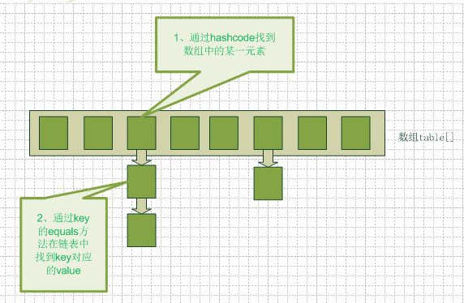
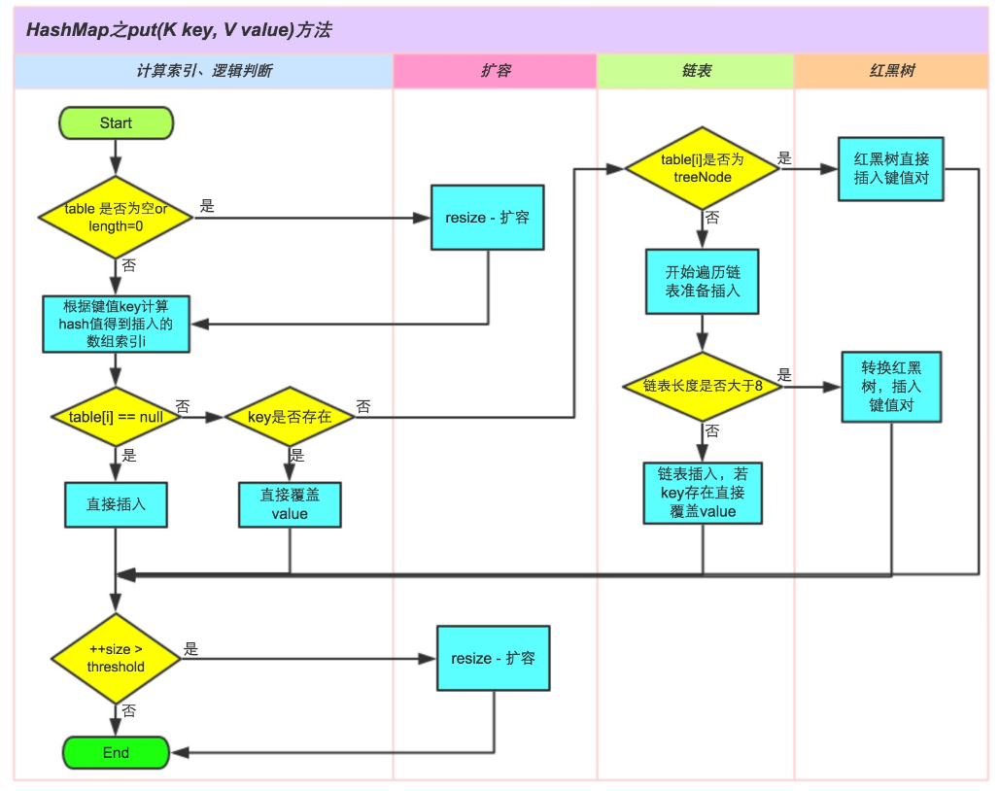

[toc]

# Java 详解HashMap

## HashMap的数据存储结构

Hashmap实际上是一个数组和链表的结合体（在数据结构中，一般称之为“链表散列“）



1. 当往HashMap中put元素时，首先先根据key的hash值得到这个元素在数组中的位置（即下标），然后把这个元素放到对应的位置中了。
2. 如果这个元素所在的位子上已经存放有其他元素了，那么在同一个位子上的元素将以链表的形式存放，<font color="red">新加入的放在链头，最先加入的放在链尾。</font>
3. 当从HashMap中get元素时，首先计算key的hash值，找到数组中对应位置的某一元素，然后通过key的equals方法在对应位置的链表中找到需要的元素。

## HashMap的构造函数

```
HashMap()
HashMap(int initialCapacity)
HashMap(int initialCapacity, float loadFactor)
HashMap(Map<? extends K, ? extends V> m)
```

1. initialCapacity：初始容量，从上面第11行代码我们看到，初始容量数值没有存起来，而且使用它计算阀值threshold。计算方法就是返回大于initialCapacity且最接近initialCapacity的一个2的正数幂的数字作为初始阀值。
2. capacity：容量。capacity就是指HashMap中桶的数量。默认值为16。一般第一次扩容时会扩容到64，之后都是以2的幂数增加。
3. loadFactor：装载因子，用来衡量HashMap满的程度，加载因子越大,填满的元素越多,空间利用率越高。loadFactor的默认值为0.75f。计算HashMap的实时装载因子的方法为size/capacity。

threshold：阀值，满足公式threshold=loadFactor*capacity。当HashMap的size大于threshold时会执行扩容（resize）操作。

## HashMap的put方法



首先根据key的hash值计算数组索引i.

①.判断键值对数组table[i]是否为空或为null，否则执行resize()进行扩容；
②.根据键值key计算hash值得到插入的数组索引i，如果table[i]==null，直接新建节点添加，转向⑥，如果table[i]不为空，转向③；
③.判断table[i]的首个元素是否和key一样，如果相同直接覆盖value，否则转向④，这里的相同指的是hashCode以及equals；
④.判断table[i] 是否为treeNode，即table[i] 是否是红黑树，如果是红黑树，则直接在树中插入键值对，否则转向⑤；
⑤.遍历table[i]，判断链表长度是否大于8，大于8的话把链表转换为红黑树，在红黑树中执行插入操作，否则进行链表的插入操作；遍历过程中若发现key已经存在直接覆盖value即可；
⑥.插入成功后，判断实际存在的键值对数量size是否超多了最大容量threshold，如果超过，进行扩容。

## HashMap的常见问题：

>1. HashMap如果有很多相同key，导致链表很长的话，你会怎么优化？或者你会用什么数据结构来存储？针对HashMap中某个Entry链太长，查找的时间复杂度可能达到O(n)，怎么优化？
在jdk1.8中若HashMap中某一下标位置对应的链表长度>8时，会把链表部分转换为红黑树。利用红黑树快速增删改查的特点来提高HashMap的性能。这其中会涉及到红黑树的插入，删除，查找的算法。

>2. HashMap在高并发的情况下会发生什么问题？
会发送扩容问题。在jdk1.8的情况下，<font color="red">HashMap的扩容不是重新计算所有元素在数组中的位置。而是将原来数组的长度扩大为原来的2倍。</font>所有的之前元素的位置不是在原位置就是改变为原位置+2次幂的位置。

>3. HashMap对象的key、value值均可为null（key只能有一个为null，而value则可以有多个为null）？
HashMap在put的时候会调用hash()方法来计算key的hashcode值，当key==null时返回的值为0。因此key为null时，hash算法返回值为0，不会调用key的hashcode方法。之后会把数组中下标为0的元素覆盖。

>4. HashMap是线程安全的吗？
HashMap非线程安全，即任一时刻可以有多个线程同时写HashMap，会导致数据的不一致。<font color="red">如果需要满足线程安全，可以用 Collections的synchronizedMap方法使HashMap具有线程安全的能力，或者使用ConcurrentHashMap。</font>