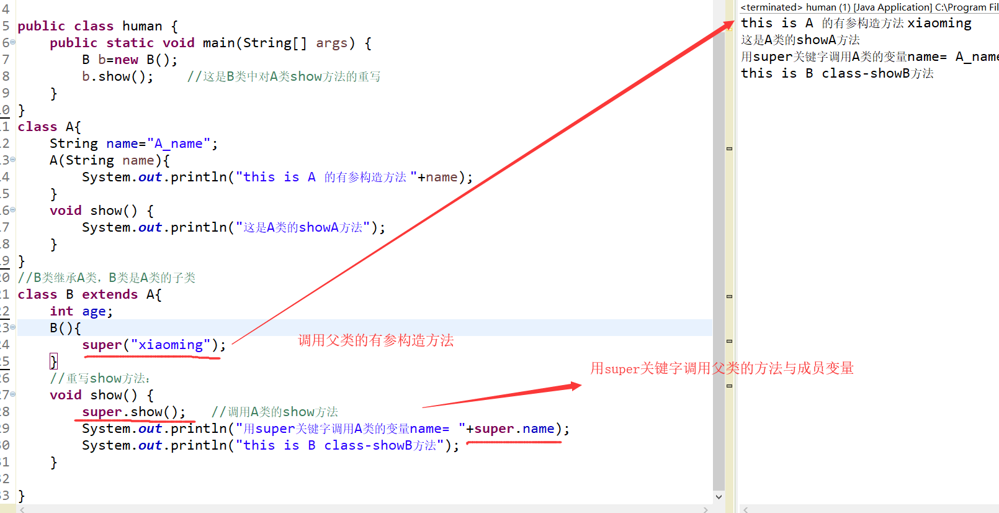

[toc]


## 1.面向对象

### 0.Java 封装

>封装可以防止类中的代码和数据被外部类的代码随机访问,必须通过严格的接口控制才能访问，增加程序的安全性。
>封装的步骤：
1.修改属性的可见性来限制外部类对属性的访问（一般限制为private）。
2.对每个属性提供对外的公共方法进行设置和访问。

```java
public class Person{
    private String name;  //设置私有属性，来限制对属性的随意访问
    private int age;
​
    public int getAge(){   //提供公共方法对属性进行操作
      return age;
    }
​
    public String getName(){
      return name;
    }
​
    public void setAge(int age){
      this.age = age;
    }
​
    public void setName(String name){
      this.name = name;
    }
}
```

### 1.类与对象：

>类：类是一个模板，它描述一类对象的行为和状态。例如：人类,会吃喝睡。
>对象：对象是类的一个实例，有状态和行为。例如，小明，就是人类的实例化的一个对象。

```java
public class human {
	  String name;    //姓名
	  int age;   		//年龄
	  String sex;		//性别		
	  Date birth;  		//出生年月
	  
	  public human() {   
		 //默认的构造方法
	  }
	  public human(String name) {   
		  this.name=name;     //改造的构造方法
	  }
	  void sleeping(){   //人类会睡觉
	  }
	  void eating(){     //人类会吃
	  }
}
```

#### 1.创建对象：

```java
public class human {
	  String name;    //姓名
	  int age;   		//年龄
	  String sex;		//性别		
	  Date birth;  		//出生年月
	  public human() {   
		 //默认的构造方法
	  }
	  public human(String name) {   
		  this.name=name;     //改造的构造方法
	  }
	  void sleeping(){   //人类会睡觉
	  }
	  
	  void eating(){     //人类会吃
	  }
	  public static void main(String[] args) {
		   human hu=new human();   //这个实例化对象语句会调用默认的构造方法
		   System.out.println("方式1  "+hu.name);
		   human hu2=new human("xiaoming");   //这个实例化对象语句会调用改造的构造方法
		   System.out.println("方式2  "+hu2.name);
	  }
}
```


#### 2.类的封装：

>类的封装就是指在定义一个类时，把类的属性私有化（用private修饰），私有属性只能在本类中被访问，为了能让外界访问，通过构造方法来访问私有属性。

```java
public class human {
	private String name;    //姓名
	private int age;   		//年龄
	private String sex;		//性别		
	private Date birth;  		//出生年月
	  public human() {   
		 //默认的构造方法
	  }
	  public human(String name) {   
		  this.name=name;     //改造的构造方法
	  }
	public String getName() {
		return name;
	}
	public void setName(String name) {
		this.name = name;
	}
	public int getAge() {
		return age;
	}
	public void setAge(int age) {
		this.age = age;
	}
	public String getSex() {
		return sex;
	}
	public void setSex(String sex) {
		this.sex = sex;
	}
	public Date getBirth() {
		return birth;
	}
	public void setBirth(Date birth) {
		this.birth = birth;
	}
	public static void main(String[] args) {
		   human hu=new human();   //这个实例化对象语句会调用默认的构造方法
		   hu.setAge(23);			//设置年龄23
		   hu.setName("xiaoming");	//设置姓名为小明
		   hu.setSex("男");  
	  }
}

```

#### 3.类的构造方法与构造方法的重载：

>构造方法的定义：
>1. 方法名与类名相同。
>2. 方法无返回值类型。

```java
public class human {
	  String name;      //姓名
	  int age;   		//年龄
	  String sex;		//性别		
	  Date birth;  		//出生年月
      public human() {   
		 //无参的构造方法
	  }
	  public human(String name) {   
		  this.name=name;     //有参的构造方法
	  }
}
```

>1. 一个类中可以定义多个构造方法，只要构造方法的参数类型与参数个数互不相同。
>2. 在java中每个类中至少有一个构造方法，若类中没有编写该方法。则java会默认创建一个无参构造方法。
>3. 一旦对类的构造方法进行重载，系统不再提供默认的构造方法。

#### 4.this关键字

>①：通过this关键字可以访问类的变量。
>②：this可以调用方法。
>③：this可以调用构造方法。（注意：只能在构造方法中用this调用构造方法，并且该语句必须在第一行。）

```java
//this关键字可以访问类的变量
 public human(String name) {   
		  this.name=name;     
	  }
//this可以调用方法
public String getName() {
	return name;
}
public void tets() {
    this.getName();
}

//this可以调用构造方法
public human() {   
    //默认的构造方法
}
public human(String name) {   
    this();   //调用无参构造方法
}
```

#### 5.源文件声明规则与Import语句:

>1. 一个源文件中只能有一个public类,主类
>2. 一个源文件可以有多个非public类
>3. 源文件的名称应该和public类的类名保持一致。例如：源文件中public类的类名是Employee，那么源文件应该命名为Employee.java。
>4. 如果源文件包含import语句，那么应该放在package语句和类定义之间。如果没有package语句，那么import语句应该在源文件中最前面。
>5. import语句和package语句对源文件中定义的所有类都有效。在同一源文件中，不能给不同的类不同的包声明。

>Import语句就是用来提供一个合理的路径，使得编译器可以找到某个类。
>例如，下面的命令行将会命令编译器载入java_installation/java/io路径下的所有类

```java
import java.io.*;
```

#### 6.内部类：

>java允许在一个类的内部在定义类，这样的类叫做内部类。

<h4>①：成员内部类</h4>

>在一个类中在定义一个类，这种类叫做成员内部类。成员内部类中可以访问外部类的所有成员，包括私有成员。
>创建成员内部类对象语法：
>外部类名.内部类名 变量名=new 外部类名().new 内部类名();

```java
package blog;
import java.sql.Date;
public class human {
private String name="xiaoming";   
public human() {}
public void shilihua() {    //外部类要访问内部类
	neibu n=new neibu();
	n.show();
}
  class neibu{
	  void show() {
		  System.out.println("这是内部类的show方法,"+"外部类的name成员的值为"+name);
	  }
  }
	public static void main(String[] args) {
		human h=new human();
		h.shilihua();   //外部类访问内部类,可在外部类中创建方法，方法中创建内部类对象。
		human.neibu hn=new human().new neibu();   //外部类访问内部类，要通过外部类对象去创建内部类对象
		hn.show();
	}
}
```


<font color="red">外部类访问内部类的方法：</font>

>1. 外部类访问内部类,可在外部类中创建方法，方法中创建内部类对象。
>2. 外部类访问内部类，要通过外部类对象去创建内部类对象,从而实现外部类访问内部类。

<h4>②：静态内部类</h4>

**用static修饰符修饰的成员内部类就是静态内部类。**

>实例化静态内部类对象语法：
> 外部类名.内部类名 变量名=new 外部类名.内部类名();
> 1 在静态内部类中，只能访问外部类的静态成员，非静态成员不能访问。
> 2 静态内部类中可以定义静态成员，但在非静态内部类中不能定义静态成员。

```java
package blog;
import java.sql.Date;
public class human {
private String name="xiaoming";
private static int number=5;
public human() {}
public void shilihua() {    //外部类要访问内部类
	neibu2 n=new neibu2();
	n.show();
}
  
  //静态内部类
  static class neibu2{
	  void show() {
		  //静态内部类只能访问外部类的静态成员
		  System.out.println("这是静态内部类的show方法,"+"外部类的静态number成员的值为"+number);
	  } 
	  
  }
	public static void main(String[] args) {
		human h=new human();
		h.shilihua();   //外部类访问内部类,可在外部类中创建方法，方法中创建内部类对象。
		human.neibu2 hn=new human.neibu2();   //外部类访问内部类，要通过外部类对象去创建内部类对象
		hn.show();
	}
}
```

<h4>③：方法内部类</h4>

>方法内部类指在成员方法中定义的类，它只能在当前方法中使用。方法内部类可以访问外部类成员

```java
public class human {
private String name="xiaoming";
	public void shilihua() {    //外部类要访问内部类
		//方法内部类
		class inner{
			void show() {
				 System.out.println("这是静态内部类的show方法,"+"外部类的静态name成员的值为"+name);
			}
		}
		//实例化内部类对象
		inner i=new inner();
		i.show();   //调用内部类方法
	}
	public static void main(String[] args) {
		human h=new human();
		h.shilihua();
	}
}

```

### 2.类的继承---减少重复代码，提高维护性：

#### 1.extends类的继承：

>继承就是子类继承父类中所有可继承的成员变量和方法，使得子类对象具有父类的成员变量和方法，使得子类具有父类相同的行为。

```java
//语法
class 父类 {
}
 
class 子类 extends 父类 {   //用关键字extends,让子类继承父类
}
//=================

public class human {
	public static void main(String[] args) {
		B b=new B();
		b.showA();    //这是从A类中继承的方法
		b.name="xiaoming";  //这是从A类中继承的成员变量
		b.showB();
	}
}
class A{
	String name;
	void showA() {
		System.out.println("这是A类的showA方法");
	}
}
//B类继承A类，B类是A类的子类
class B extends A{
	int age;
	void showB() {
		System.out.println("this is B class-showB方法");
	}
}
```


<font color="red">

PS:在类的继承中注意：
1. 在Java中只支持单继承，即一个类中只有一个父类。
2. 多个类可以有一个父类。
3. 多层继承是可以的。即B类继承A类，C类继承B类。
4. 子类拥有父类非private的变量、方法。
5. 子类可以拥有自己的属性和方法，即子类可以对父类进行扩展。
6. 子类可以用自己的方式实现父类的方法。

</font>


#### 2.重写父类方法：

>在继承中，有时子类会需要对从父类哪里继承的方法进行修改，这叫做重写父类方法，两个方法之间必须具有相同的方法名，参数列表，返回值类型。

```java
public class human {
	public static void main(String[] args) {
		B b=new B();
		b.show();    //这是B类中对A类show方法的重写
	}
}

class A{
	String name;
	void show() {
		System.out.println("这是A类的showA方法");
	}
}

//B类继承A类，B类是A类的子类
class B extends A{
	int age;
	//重写show方法：
	void show() {
		System.out.println("this is B class-showB方法");
	}
	
}
```
>运行结果：this is B class-showB方法


#### 3. super 关键字：

>当子类重写父类方法后，不能访问原来父类的那个方法，但可以通过super关键字来访问。

<h4>①：使用super关键字调用父类的变量与方法：②：用super关键字调用父类构造方法。</h4>

```java
public class human {
	public static void main(String[] args) {
		B b=new B();
		b.show();    //这是B类中对A类show方法的重写
	}
}
class A{
	String name="A_name";
	A(String name){
		System.out.println("this is A 的有参构造方法 "+name);
	}
	void show() {
		System.out.println("这是A类的showA方法");
	}
}
//B类继承A类，B类是A类的子类
class B extends A{
	int age;
	B(){
		super("xiaoming");    //调用父类的有参构造方法
	}
	//重写show方法：
	void show() {
		super.show();   //调用A类的show方法
		System.out.println("用super关键字调用A类的变量name= "+super.name);
		System.out.println("this is B class-showB方法");
	}
	
}
```


<font color="red">
通过super调用父类的构造方法的代码必须位于子类构造方法的第一行，并且只能出现一次。
</font>


#### 4.final关键字：

>final关键子用于修饰类，变量，方法
>1. final修饰的类不能被继承。
>2. final修饰的方法不能被子类重写。
>3. final修饰的变量是常量，只能被赋值一次。

```java
final class A{
	//最终类
}
public final void show(){
	//最终方法
}
final String name="xiaoming";
```

#### 5.抽象类与接口：

① 抽象类与abstract关键字：

>抽象类：部分含有抽象方法的类，也可以不含有。
>抽象方法：无方法体的方法叫做抽象方法.
>抽象方法,抽象类用abstract关键字修饰。

```java
abstract class A{
	abstract int show();   //抽象方法show
}
```

<font color="red">
注意：
1.抽象类是不可以被实例化。
2.任何子类必须重写父类的抽象方法，或者声明自身为抽象类。
</font>

```java
//抽象类
abstract class C{
	abstract void show();    //抽象方法
	void run() {   			 //非抽象方法
		System.out.println("RUN");
	}
}

class D extends C{
	void show() {    //对父类抽象方法的重写
		System.out.println("this is 对抽象类C的抽象方法show的重写");
	}
}

public class human {
	public static void main(String[] args) {
		D d=new D();
		d.run();
		d.show();
	}
}

//运行结果：
//RUN
//this is 对抽象类C的抽象方法show的重写
```

② 接口与interface,implements关键字：

接口相当于是完全抽象类，接口的特点：

>1.当一个抽象类中的所有方法都是抽象方法时，这个抽象类叫做接口。此时要用interface关键字来声明接口。
>2.接口无法被实例化，但是可以被实现(用implements关键字)。一个实现接口的类，必须实现接口内所有的抽象方法，否则就必须声明为抽象类。
>3.接口中的方法都默认用“ public abstract ”修饰,变量默认用“ public final ”修饰,即抽象方法与全局变量
>4.一个类可以实现多个接口。
>5.一个接口能继承另一个接口.


```java
//用interface关键字声明接口
interface C{
	 void show();    //抽象方法
	 void run();
}
// 接口e
interface E {
	void eat();
	void sleep();
}

//一个接口继承另一个接口
interface G extends E{
	void speak();
	void jump();
}

//用implements关键字实现接口C
class D implements C{
	public void show() {    //对接口的重写
		System.out.println("show");
	}
	public void run() {
		System.out.println("run");
	}
}

//实现两个接口
class F implements C,E{
	public void eat() { // 对接口的重写
		System.out.println("F-eat");
	}
	public void sleep() {
		System.out.println("F-sleep");
	}
	public void show() { // 对接口的重写
		System.out.println("F-show");
	}
	public void run() {
		System.out.println("F-run");
	}
}
```


#### 6.多态：

① 多态概述

>1.在同一个方法中，根据参数类型的不同而产生不同的执行结果的现象叫做多态。
>2.多态存在的三个必要条件:继承,重写,父类引用指向子类对象.
>3.java中允许父类引用指向子类对象，根据被引用子类的不同，得到不同的执行结果。
>4.当使用多态方式调用方法时，首先检查父类中是否有该方法，如果没有，则编译错误；如果有，再去调用子类的同名方法。

```java
abstract class Animal {  
    abstract void eat();  
}  
  
class Cat extends Animal {  
    public void eat() {  
        System.out.println("吃鱼");  
    }  
    public void work() {  
        System.out.println("抓老鼠");  
    }  
}  
class Dog extends Animal {  
    public void eat() {  
        System.out.println("吃骨头");  
    }  
    public void work() {  
        System.out.println("看家");  
    }  
}

public class human {
	public static void main(String[] args) {
		Animal animal=new Cat();   //父类引用指向子类对象
		animal.eat();     		   //父类引用调用子类方法
		Animal animal2=new Dog();  //父类引用指向子类对象
		animal2.eat();  		   //父类引用调用子类方法
	}
}

//运行结果：
//吃鱼
//吃骨头
```


② Object类

>Object类是所有类的父类，即每个类都直接或间接继java.lang.Object类
>该类中主要有以下方法: toString(),getClass(),equals(),clone(),finalize()等, 其中toString(),equals()是其中最重要的方法

1. toString()方法

>toString 方法返回一个字符串，该字符串由类名、at 标记符“@”和此对象哈希码的无符号十六进制表示组成。

```java
@Override
	public String toString() {
		return "human [getClass()=" + getClass() + ", hashCode()=" + hashCode() + ", toString()=" + super.toString()
				+ "]";
	}
```

2. equals()方法

>equals()方法：比较两个对象是否相等。
>注意：即便是内容完全相等的两块不同的内存对象，也返回false。
>String类已经重写了object中的equals方法（这样就是比较内容是否相等了）。

3. hashCode()方法

>返回该对象的哈希码值

