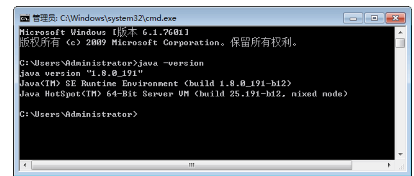
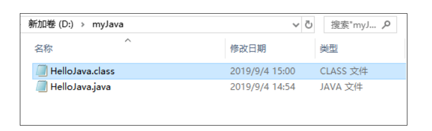
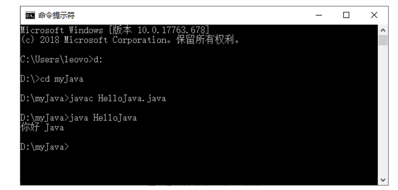
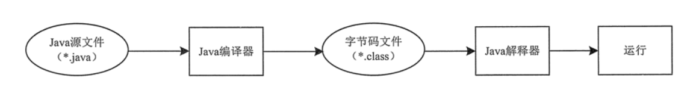
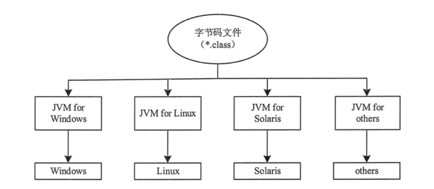
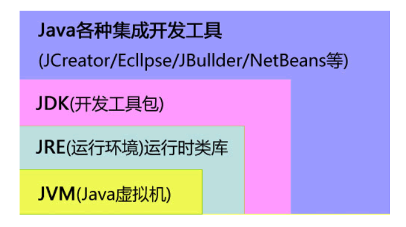

[toc]

# Java笔记1-介绍

## 什么是java?

Java 是由 Sun Microsystems 公司于 1995 年推出的一门面向对象程序设计语言。2010 年 Oracle 公司收购 Sun Microsystems，之后由 Oracle 公司负责 Java 的维护和版本升级。

## Java环境搭建

编写和运行Java程序必须使用JDK（Java Development Kit），它提供了编译和运行 Java 程序的环境。

1. 访问Oracle公司的官方网站（www.oracle.com）。
2. 在官网中找到jdk的下载链接，根据操作系统选择不同版本的安装包
3. 运行jdk安装包,开始安装jdk
   
验证jdk是否安装成功？
1. 打开终端环境，输入以下命令`java -version`
2. 出现如图所示信息，则说明JDK 已经安装成功



## jdk环境变量配置

一些Java 程序工具会通过环境变量搜索JDK的安装路径。如果没有在系统环境变量中配置JDK的安装路径，那么该工具就无法使用。

不同操作系统配置jdk环境变量的方法，自行百度。

## 第一个Java程序

下面展示一个完整 Java 应用程序的开发过程。

1. 创建一个名为HelloJava.java的文件。
2. 文件内容如下
   
```java
/*
*第一个java程序
*/
public class HelloJava {
    // 这里是程序入口
    public static void main(String[] args) {
        // 输出字符串
        System.out.println("你好 Java");
    }
}

// main() 方法是所有程序的入口，最先开始执行。
```

3. 编译HelloJava.java文件

Java源程序编写到文件之后，还需要进行编译才能运行。编译 Java 源程序使用的是 JDK 中的 javac 命令。编译命令如下

```
javac HelloJava.java
```

`javac HelloJava.java`命令的作用是让 Java 编译器获取 Java 应用程序 HelloJava.java 的源代码，把它编译成符合 Java 虚拟机规范的字节码文件。这时会生成一个新文件 HelloJava.class，此文件便是字节码文件，它也是 JVM 上的可执行文件。 



4. 运行字节码文件

运行 Java 程序需要使用 JDK 中的 java 命令，例如运行上步生成的 .class 文件，命令如下

```
java HelloJava
```
具体效果如下



## Java程序的运行过程（执行流程）分析

Java 程序的运行必须经过编写、编译和运行 3 个步骤。
1. 编写：是指在.java 的 Java 源文件中编写程序代码。
2. 编译：是指使用 Java 编译器对源文件进行错误排査的过程，编译后将生成后缀名为 .class 的字节码文件。
3. 运行：是指使用 Java 解释器将.class字节码文件翻译成机器代码，然后执行机器代码并显示结果。



## Java是如何实现跨平台的？

JVM虚拟机是 Java 平台架构的基础，Java 的跨平台特性正是通过在 JVM虚拟机中运行 Java 程序实现的。



Java 虚拟机（JVM）是运行 Java 程序的软件环境，Java解释器是 Java虚拟机的一部分。

在运行 Java 程序时，首先会启动 JVM，然后由它来负责解释执行 Java 的字节码程序，并且 Java 字节码程序只能运行于 JVM 之上。

这样利用 JVM 就可以把 Java 字节码程序和具体的硬件平台以及操作系统环境分隔开来，只要在不同的计算机上安装了针对特定平台的 JVM，Java 程序就可以运行，而不用考虑当前具体的硬件平台及操作系统环境。

<font color="red">提示：Java 程序通过 JVM 可以实现跨平台特性，但 JVM 是不跨平台的。也就是说，不同操作系统之上的 JVM 是不同的，Windows 平台之上的 JVM 不能用在 Linux 平台，反之亦然。</font>

## JVM，JRE，JDK三者关系

* JDK（Java Development Kid，Java开发开源工具包）是整个 Java 的核心，包括了 Java 运行环境 JRE、Java开发工具和 Java 基础类库。
* JRE（Java Runtime Environment，Java 运行环境）是运行 JAVA 程序所必须的环境的集合，包含 JVM 标准实现及 Java 核心类库。
* JVM（Java Virtual Machine，Java 虚拟机）是整个 Java 实现跨平台的最核心的部分，能够运行以 Java 语言编写的软件程序。


