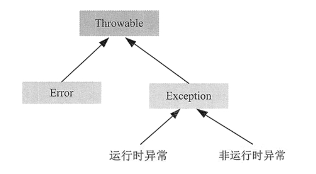
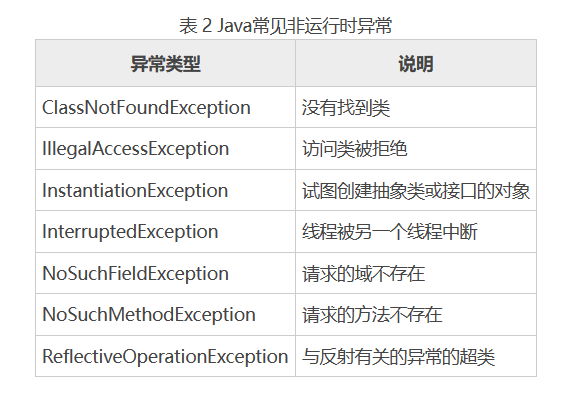

[toc]

# Java笔记10-异常

异常（exception）是在运行程序时产生的一种异常情况。

在 Java 中一个异常的产生，主要有如下三种原因：
1. Java 内部错误发生异常，Java 虚拟机产生的异常。
2. 编写的程序代码中的错误所产生的异常，例如空指针异常、数组越界异常等。
3. 通过 throw 语句手动生成的异常，一般用来告知该方法的调用者一些必要信息。

Java 通过面向对象的方法来处理异常。在一个方法的运行过程中，如果发生了异常，则这个方法会产生一个异常对象，并把它交给当前系统，当前系统会寻找相应的代码来处理这一异常对象。

* 其中把生成异常对象，并把它交给当前系统的过程称为拋出（throw）异常。
* 当前系统寻找相应的代码来处理这一异常对象，这一个过程称为捕获（catch）异常。


## 异常类型

为了能够及时有效地处理程序中的运行错误，Java 专门引入了异常类。

在 Java 中所有异常类型都是 java.lang.Throwable 类的子类。Throwable 类下有两个异常分支 Exception 和 Error。



* Exception 类用处理用户程序可能出现的异常情况，它也是用来创建自定义异常类型类的类。
* Error 定义了在通常环境下不希望被程序捕获的异常。一般指的是 JVM 错误，如堆栈溢出。这些错误不是程序可以控制的。

由图可知 异常类 Exception 又分为运行时异常和非运行时异常，这两种异常有很大的区别。
- 运行时异常都是 RuntimeException 类及其子类异常，如 NullPointerException、IndexOutOfBoundsException 等，这些异常是不检查异常，程序中可以选择捕获处理，也可以不处理。这些异常一般由程序逻辑错误引起，程序应该从逻辑角度尽可能避免这类异常的发生。
- 非运行时异常是指 RuntimeException 以外的异常，类型上都属于 Exception 类及其子类。从程序语法角度讲是必须进行处理的异常，如果不处理，程序就不能编译通过。如 IOException、ClassNotFoundException 等以及用户自定义的 Exception 异常（一般情况下不自定义检查异常）。





## Error和Exception的异同

Exception 和 Error 体现了 Java 平台设计者对不同异常情况的分类，Exception 是程序正常运行过程中可以预料到的意外情况，并且应该被开发者捕获，进行相应的处理。Error 是指正常情况下不大可能出现的情况，绝大部分的 Error 是任何处理技术都无法恢复的情况，肯定会导致程序非正常终止。所以不需要被开发者捕获。

Exception 又分为可检查（checked）异常和不检查（unchecked）异常，可检查异常在源码里必须显示的进行捕获处理，这里是编译期检查的一部分。不检查异常就是所谓的运行时异常，通常是可以编码避免的逻辑错误，具体根据需要来判断是否需要捕获，并不会在编译器强制要求。

如下是常见的 Error 和 Exception：

1）运行时异常（RuntimeException）：
```
NullPropagation：空指针异常；
ClassCastException：类型强制转换异常
IllegalArgumentException：传递非法参数异常
IndexOutOfBoundsException：下标越界异常
NumberFormatException：数字格式异常
```

2）非运行时异常：
```
ClassNotFoundException：找不到指定 class 的异常
IOException：IO 操作异常
```

3）错误（Error）：
```
NoClassDefFoundError：找不到 class 定义异常
StackOverflowError：深递归导致栈被耗尽而抛出的异常
OutOfMemoryError：内存溢出异常
```

## 异常处理机制

Java 的异常处理通过 5 个关键字来实现：try catch、throw、throws 和 finally。try catch 语句用于捕获并处理异常，finally 语句用于在任何情况下（除特殊情况外）都必须执行的代码，throw 语句用于拋出异常，throws 语句用于声明可能会出现的异常。

Java的异常处理机制提供了一种结构性和控制性的方式来处理程序执行期间发生的事件。异常处理的机制如下：
* 在方法中用 try catch 语句捕获并处理异常，catch 语句可以有多个，用来匹配多个异常。
* 对于处理不了的异常或者要转型的异常，在方法的声明处通过 throws 语句拋出异常，即由更上层的系统调用方法来处理。

以下代码是异常处理程序的基本结构
```java
try {
    逻辑程序块
} catch(ExceptionType1 e) {
    处理代码块1
} catch (ExceptionType2 e) {
    处理代码块2
    throw(e);    // 如果无法处理，就抛出这个"异常"
} finally {
    释放资源代码块
}
```

### try catch语句

在 Java 中通常采用 try catch 语句来捕获异常并处理。语法格式如下：

```java
try {
    // 可能发生异常的语句
} catch(ExceptionType e) {
    // 处理异常语句
    e.printStackTrace(); //输出异常的类型、性质、栈层次及出现在程序中的位置
}
```

如果 try 语句块中发生异常，那么一个相应的异常对象就会被拋出，然后 catch 语句就会依据所拋出异常对象的类型进行捕获，并处理。处理之后，程序会跳过 try 语句块中剩余的语句，转到 catch 语句块后面的第一条语句开始执行。

如果 try 语句块中没有异常发生，那么 try 块正常结束，后面的 catch 语句块被跳过，程序将从 catch 语句块后的第一条语句开始执行。

> 多重catch语句

如果 try 代码块中有很多语句会发生异常，而且发生的异常种类又很多。那么可以在 try 后面跟有多个 catch 代码块。

```java
try {
    // 可能会发生异常的语句
} catch(ExceptionType e) {
    // 处理异常语句
} catch(ExceptionType e) {
    // 处理异常语句
} catch(ExceptionType e) {
    // 处理异常语句
    ...
}
```

注意：在多个 catch 代码块的情况下，当一个 catch 代码块捕获到一个异常时，其它的 catch 代码块就不再进行匹配。另外，当捕获的多个异常类之间存在父子关系时，捕获异常时一般先捕获子类，再捕获父类。所以子类异常必须在父类异常的前面，否则子类捕获不到。

例子
```java
public class Test03 {
    public static void main(String[] args) {
        Date date = readDate();
    }
    public static Date readDate() {
        try {
            //此处可能发生异常
            return date;
        } catch (FileNotFoundException e) {
            System.out.println("处理FileNotFoundException...");
            e.printStackTrace();
        } catch (IOException e) {
            System.out.println("处理IOException...");
            e.printStackTrace();
        } catch (ParseException e) {
            System.out.println("处理ParseException...");
            e.printStackTrace();
        }
        return null;
    }
}
```

### try catch finally语句

finally 语句可以与前面介绍的 try catch 语句块匹配使用，即无论是否发生异常，finally 语句块中的代码都会被执行。语法格式如下：

```java
// 方式1
try {
    // 可能会发生异常的语句
} catch(ExceptionType e) {
    // 处理异常语句
} finally {
    // 清理代码块
}

// 方式2，很少见
try {
    // 逻辑代码块
} finally {
    // 清理代码块
}
```

try-catch-finally 语句时需注意以下几点：
1. 只有 try 块是必需的，catch 块和 finally 块都是可选的，但 catch 块和 finally 块至少出现其中之一，也可以同时出现；
2. 可以有多个 catch 块，捕获父类异常的 catch 块必须位于捕获子类异常的后面；
3. 多个 catch 块必须位于 try 块之后，finally 块必须位于所有的 catch 块之后。
4. try与finally语句块匹配的语法格式，由于没有catch语句，所以可能会导致异常丢失，所以不常见。

<font color="red">一般情况下，无论是否有异常拋出，都会执行 finally 语句块中的语句。</font>


try catch finally 语句块的执行情况可以细分为以下 3 种情况：
1. 如果 try 代码块中没有拋出异常，则执行完 try 代码块之后直接执行 finally 代码块，然后执行 try catch finally 语句块之后的语句。
2. 如果 try 代码块中拋出异常，并被 catch 子句捕捉，那么在拋出异常的地方终止 try 代码块的执行，转而执行相匹配的 catch 代码块，之后执行 finally 代码块。如果 finally 代码块中没有拋出异常，则继续执行 try catch finally 语句块之后的语句；如果 finally 代码块中拋出异常，则把该异常传递给该方法的调用者。
3. 如果 try 代码块中拋出的异常没有被任何 catch 子句捕捉到，那么将直接执行 finally 代码块中的语句，并把该异常传递给该方法的调用者。

```java
public class Test {
    public static void main(String[] args) {
        try {
            //程序语句
        } catch (Exception e) {
            e.printStackTrace();
        } finally {
            System.out.println("执行 finally 语句");
        }
    }
}

```


### throws和throw：声明和抛出异常

Java可以通过 throws 关键字在方法上声明该方法要拋出的异常，然后在方法内部通过 throw 拋出异常对象。

#### throws 声明异常

当一个方法产生一个它不处理的异常时，那么就需要在该方法的头部声明这个异常，以便将该异常传递到方法的外部进行处理。使用 throws 声明的方法表示此方法不处理异常。

throws 具体格式如下：
```java
 method_name(paramList) throws Exception 1,Exception2,…{…}

// method_name 表示方法名
// paramList 表示参数列表
// Exception 1，Exception2，… 表示多个异常类
```

throws 声名异常的程序逻辑：如果当前方法不知道如何处理这种类型的异常，使用 throws 声明抛出异常。该异常会由向上一级的调用者处理；如果 main 方法也不知道如何处理这种类型的异常，也可以使用 throws 声明抛出异常，该异常将交给 JVM 处理。JVM 对异常的处理方法是，打印异常的跟踪栈信息，并中止程序运行，这就是前面程序在遇到异常后自动结束的原因。


```java
public class Test {
    public void readFile() throws IOException {
        // 定义方法时声明异常
        // 方法内可能产生异常
    }
}

public class Test2 {
    public static void main(String[] args) {
        Test t = new Test();
        try {
            t.readFile(); //调用 readFHe()方法
        } catch (IOException e) {
            // 捕获异常
            System.out.println(e);
        }
    }
}
```

#### throw 拋出异常

throw 语句用来直接拋出一个异常，后接一个可拋出的异常类对象，其语法格式如下：

```java
throw ExceptionObject;

//ExceptionObject 必须是 Throwable 类或其子类的对象。
//如果是自定义异常类，也必须是 Throwable 的直接或间接子类。
```

throw 抛出异常的程序逻辑 当 throw 语句执行时，它后面的语句将不执行，此时程序转向调用者程序，寻找与之相匹配的 catch 语句，执行相应的异常处理程序。如果没有找到相匹配的 catch 语句，则再转向上一层的调用程序。这样逐层向上，直到最外层的异常处理程序终止程序并打印出调用栈情况。

```java
public class Test {
    public void validateUserName(String username) {
        // 判断用户名长度是否大于8位
        if (username.length() > 8) {
            throw new IllegalArgumentException("用户名长度必须大于 8 位！");
        }
    }

    public static void main(String[] args) {
        Test te = new Test();
        try {
            te.validateUserName(username);
        } catch (IllegalArgumentException e) {
            System.out.println(e);
        }
    }
}
```


#### throws与throw的区别

throws 关键字和 throw 关键字在使用上的几点区别如下：
* throws 用来声明一个方法可能抛出的所有异常信息，表示出现异常的一种可能性，但并不一定会发生这些异常；throw 则是指拋出的一个具体的异常类型，执行 throw 则一定抛出了某种异常对象。
* 通常在一个方法（类）的声明处通过 throws 声明方法（类）可能拋出的异常信息，而在方法（类）内部通过 throw 声明一个具体的异常信息。
* throws 通常不用显示地捕获异常，可由系统自动将所有捕获的异常信息抛给上级方法； throw 则需要用户自己捕获相关的异常，而后再对其进行相关包装，最后将包装后的异常信息抛出。


## 自定义异常

如果 Java 提供的内置异常类型不能满足程序设计的需求，这时我们可以自己设计 Java 类库或框架，其中包括异常类型。实现自定义异常类需要继承 Exception 类或其子类，实现自定义运行时异常类需继承 RuntimeException 类或其子类。

```java
class MyException extends Exception {
    public MyException() {
        super();
    }
    public MyException(String s) {
        super(s);
    }
}
```

自定义异常类一般包含两个构造方法：一个是无参的默认构造方法，另一个构造方法以字符串的形式接收一个定制的异常消息，并将该消息传递给超类的构造方法。

<font color="red">注意：因为自定义异常继承自 Exception 类，因此自定义异常类中包含父类所有的属性和方法。</font>

```java
import java.util.InputMismatchException;
import java.util.Scanner;
public class Test07 {
    public static void main(String[] args) {
        int age;
        Scanner input = new Scanner(System.in);
        System.out.println("请输入您的年龄：");
        try {
            age = input.nextInt();    // 获取年龄
            if(age < 0) {
                throw new MyException("您输入的年龄为负数！输入有误！");
            } else if(age > 100) {
                throw new MyException("您输入的年龄大于100！输入有误！");
            } else {
                System.out.println("您的年龄为："+age);
            }
        } catch(InputMismatchException e1) {
            System.out.println("输入的年龄不是数字！");
        } catch(MyException e2) {
            System.out.println(e2.getMessage());
        }
    }
}

```

