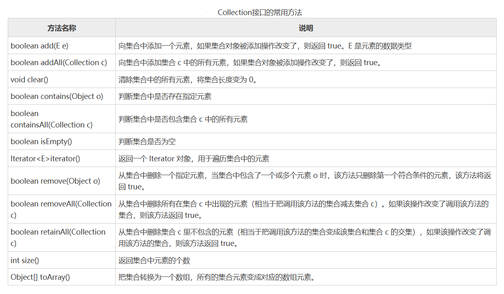

[toc]


# Java笔记11-集合

为了保存数量不确定的数据，以及保存具有映射关系的数据（键值对），Java 提供了集合类。

集合类和数组不一样，数组元素既可以是基本类型的值，也可以是对象（实际上保存的是对象的引用变量），而集合里只能保存对象（实际上只是保存对象的引用变量，但通常习惯上认为集合里保存的是对象）。

Java 所有的集合类都位于 java.util 包下，提供了一个表示和操作对象集合的统一构架，包含大量集合接口，以及这些接口的实现类和操作它们的算法。

Java 集合类型分为 Collection 和 Map，它们是 Java 集合的根接口，这两个接口又包含了一些子接口或实现类。图 1 和图 2 分别为 Collection 和 Map 的子接口及其实现类。


黄色块为集合的接口，蓝色块为集合的实现类。

## Collection接口

Collection 接口是 List、Set 和 Queue 接口的父接口，通常情况下不被直接使用。Collection 接口定义了一些通用的方法，通过这些方法可以实现对集合的基本操作。定义的方法既可用于操作 Set 集合，也可用于操作 List 和 Queue 集合。



例子
```java
public static void main(String[] args) {
    ArrayList list1 = new ArrayList(); // 创建集合 list1
    ArrayList list2 = new ArrayList(); // 创建集合 list2
    list1.add("one");
    list1.add("two");
    list1.add("three");
    System.out.println("list1 集合：" + list1.size()); // 输出list1中的元素数量
    list2.add("two");
    list2.add("four");
    list2.add("six");
    System.out.println("list2 集合：" + list2.size()); // 输出list2中的元素数量
    list2.remove(2); // 删除第 3 个元素
    System.out.println(" removeAll() 方法之后 list2 集合中的元素数量：" + list2.size());
    System.out.println("list2 集合中的元素如下：");
    Iterator it1 = list2.iterator();
    while (it1.hasNext()) {
        System.out.print(it1.next() + "、");
    }
    list1.removeAll(list2);
    System.out.println("\nremoveAll() 方法之后 list1 集合中的元素数量：" + list1.size());
    System.out.println("list1 集合中的元素如下：");
    Iterator it2 = list1.iterator();
    while (it2.hasNext()) {
        System.out.print(it2.next() + "、");
    }
}   
```

由于 Collection 是接口，不能对其实例化，所以上述代码中使用了 Collection 接口的 ArrayList 实现类来调用 Collection 的方法。

## List集合

List 是一个有序、可重复的集合，集合中每个元素都有其对应的顺序索引。List 集合允许使用重复元素，可以通过索引来访问指定位置的集合元素。List 集合默认按元素的添加顺序设置元素的索引，第一个添加到 List 集合中的元素的索引为 0，第二个为 1，依此类推。

List 实现了 Collection 接口，它主要有两个常用的实现类：ArrayList 类和 LinkedList 类。

### ArrayList 类

ArrayList 类实现了可变数组的大小，存储在内的数据称为元素。它还提供了快速基于索引访问元素的方式，对尾部成员的增加和删除支持较好。使用 ArrayList 创建的集合，允许对集合中的元素进行快速的随机访问，不过，向 ArrayList 中插入与删除元素的速度相对较慢。

ArrayList 类的常用构造方法有如下两种重载形式：
* ArrayList()：构造一个初始容量为 10 的空列表。
* ArrayList(Collection<?extends E>c)：构造一个包含指定 Collection 元素的列表，这些元素是按照该 Collection 的迭代器返回它们的顺序排列的。


例子
```java
public class Product {
    // 商品类
    private int id; // 商品编号
    private String name; // 名称
    private float price; // 价格
    public Product(int id, String name, float price) {
        this.name = name;
        this.id = id;
        this.price = price;
    }
    // 这里是上面3个属性的setter/getter方法，这里省略
    public String toString() {
        return "商品编号：" + id + "，名称：" + name + "，价格：" + price;
    }
}

//--------------------------------
public class Test {
    public static void main(String[] args) {
        Product pd1 = new Product(4, "木糖醇", 10);
        Product pd2 = new Product(5, "洗发水", 12);
        Product pd3 = new Product(3, "热水壶", 49);
        List list = new ArrayList(); // 创建集合
        list.add(pd1);
        list.add(pd2);
        list.add(pd3);
        System.out.println("*************** 商品信息 ***************");
        for (int i = 0; i < list.size(); i++) {
            // 循环遍历集合，输出集合元素
            Product product = (Product) list.get(i);
            System.out.println(product);
        }
    }
}
```

### LinkedList类

LinkedList 类采用链表结构保存对象，这种结构的优点是便于向集合中插入或者删除元素。需要频繁向集合中插入和删除元素时，使用 LinkedList 类比 ArrayList 类效果高，但是 LinkedList 类随机访问元素的速度则相对较慢。这里的随机访问是指检索集合中特定索引位置的元素。

LinkedList 类除了包含 Collection 接口和 List 接口中的所有方法之外，还有下图所示的方法。


```java
public class Test {
    public static void main(String[] args) {
        LinkedList<String> products = new LinkedList<String>(); // 创建集合对象
        String p1 = new String("六角螺母");
        String p2 = new String("10A 电缆线");
        String p3 = new String("5M 卷尺");
        String p4 = new String("4CM 原木方板");
        products.add(p1); // 将 p1 对象添加到 LinkedList 集合中
        products.add(p2); // 将 p2 对象添加到 LinkedList 集合中
        products.add(p3); // 将 p3 对象添加到 LinkedList 集合中
        products.add(p4); // 将 p4 对象添加到 LinkedList 集合中
        String p5 = new String("标准文件夹小柜");
        products.addLast(p5); // 向集合的末尾添加p5对象

        System.out.print("*************** 商品信息 ***************");
        System.out.println("\n目前商品有：");
        for (int i = 0; i < products.size(); i++) {
            System.out.print(products.get(i) + "\t");
        }
        System.out.println("\n第一个商品的名称为：" + products.getFirst());
        System.out.println("最后一个商品的名称为：" + products.getLast());
        products.removeLast(); // 删除最后一个元素
        System.out.println("删除最后的元素，目前商品有：");
        for (int i = 0; i < products.size(); i++) {
            System.out.print(products.get(i) + "\t");
        }
    }
}
```

LinkedList`<String>`中的`<String>`是 Java 中的泛型，用于指定集合中元素的数据类型，例如这里指定元素类型为 String，则该集合中不能添加非 String 类型的元素。


### ArrayList 类和 LinkedList 类的区别

ArrayList 与 LinkedList 都是 List 接口的实现类，因此都实现了 List 的所有未实现的方法，只是实现的方式有所不同。

* ArrayList 是基于动态数组数据结构的实现，访问元素速度优于 LinkedList。
* LinkedList 是基于链表数据结构的实现，占用的内存空间比较大，但在批量插入或删除数据时优于 ArrayList。


## Set集合

Set 集合类似于一个罐子，程序可以依次把多个对象“丢进”Set 集合，而 Set 集合通常不能记住元素的添加顺序。也就是说 Set 集合中的对象不按特定的方式排序，只是简单地把对象加入集合。Set 集合中不能包含重复的对象，并且最多只允许包含一个 null 元素。

Set 实现了 Collection 接口，它主要有两个常用的实现类：HashSet 类和 TreeSet类。

### HashSet 类

HashSet 是按照 Hash 算法来存储集合中的元素。因此具有很好的存取和查找性能。

HashSet 具有以下特点：
* 不能保证元素的排列顺序，顺序可能与添加顺序不同，顺序也有可能发生变化。
* HashSet 不是同步的，如果多个线程同时访问或修改一个 HashSet，则必须通过代码来保证其同步。
* 集合元素值可以是 null。

当向 HashSet 集合中存入一个元素时，HashSet 会调用该对象的 hashCode() 方法来得到该对象的 hashCode 值，然后根据该 hashCode 值决定该对象在 HashSet 中的存储位置。如果有两个元素通过 equals() 方法比较返回的结果为 true，但它们的 hashCode 不相等，HashSet 将会把它们存储在不同的位置，依然可以添加成功。

也就是说，两个对象的 hashCode 值相等且通过 equals() 方法比较返回结果为 true，则 HashSet 集合认为两个元素相等。

在 HashSet 类中实现了 Collection 接口中的所有方法。HashSet 类的常用构造方法重载形式如下。
* HashSet()：构造一个新的空的 Set 集合。
* HashSet(Collection<? extends E>c)：构造一个包含指定 Collection 集合元素的新 Set 集合。其中，“< >”中的 extends 表示 HashSet 的父类，即指明该 Set 集合中存放的集合元素类型。c 表示其中的元素将被存放在此 Set 集合中。

```java
HashSet hs = new HashSet();    // 调用无参的构造函数创建HashSet对象
HashSet<String> hss = new HashSet<String>();    // 创建泛型的 HashSet 集合对象
```

例子
```java
public static void main(String[] args) {
    HashSet<String> courseSet = new HashSet<String>(); // 创建一个空的 Set 集合
    String course1 = new String("Java入门教程");
    String course2 = new String("Python基础教程");
    String course3 = new String("C语言学习教程");
    String course4 = new String("Golang入门教程");
    courseSet.add(course1); // 将 course1 存储到 Set 集合中
    courseSet.add(course2); // 将 course2 存储到 Set 集合中
    courseSet.add(course3); // 将 course3 存储到 Set 集合中
    courseSet.add(course4); // 将 course4 存储到 Set 集合中

    System.out.println("C语言中文网教程有：");
    Iterator<String> it = courseSet.iterator();
    while (it.hasNext()) {
        System.out.println("《" + (String) it.next() + "》"); // 输出 Set 集合中的元素
    }
    System.out.println("有" + courseSet.size() + "套精彩教程！");
}
```

<font color="red">
注意：如果向 Set 集合中添加两个相同的元素，则后添加的会覆盖前面添加的元素，即在 Set 集合中不会出现相同的元素。
</font>


### TreeSet 类

TreeSet 类同时实现了 Set 接口和 SortedSet 接口。SortedSet 接口是 Set 接口的子接口，可以实现对集合进行自然排序，因此使用 TreeSet 类实现的 Set 接口默认情况下是自然排序的，这里的自然排序指的是升序排序。

TreeSet 只能对实现了 Comparable 接口的类对象进行排序，因为 Comparable 接口中有一个 compareTo(Object o) 方法用于比较两个对象的大小。例如 a.compareTo(b)，如果 a 和 b 相等，则该方法返回 0；如果 a 大于 b，则该方法返回大于 0 的值；如果 a 小于 b，则该方法返回小于 0 的值。

TreeSet 类除了实现 Collection 接口的所有方法之外，还提供了如图所示的方法。


例子
```java
public class Test08 {
    public static void main(String[] args) {
        TreeSet<Double> scores = new TreeSet<Double>(); // 创建 TreeSet 集合
        Scanner input = new Scanner(System.in);
        System.out.println("------------学生成绩管理系统-------------");
        for (int i = 0; i < 5; i++) {
            System.out.println("第" + (i + 1) + "个学生成绩：");
            double score = input.nextDouble();
            // 将学生成绩转换为Double类型，添加到TreeSet集合中
            scores.add(Double.valueOf(score));
        }
        Iterator<Double> it = scores.iterator(); // 创建 Iterator 对象
        System.out.println("学生成绩从低到高的排序为：");
        while (it.hasNext()) {
            System.out.print(it.next() + "\t");
        }
        System.out.println("\n请输入要查询的成绩：");
        double searchScore = input.nextDouble();
        if (scores.contains(searchScore)) {
            System.out.println("成绩为： " + searchScore + " 的学生存在！");
        } else {
            System.out.println("成绩为： " + searchScore + " 的学生不存在！");
        }
        // 查询不及格的学生成绩
        SortedSet<Double> score1 = scores.headSet(60.0);
        System.out.println("\n不及格的成绩有：");
        for (int i = 0; i < score1.toArray().length; i++) {
            System.out.print(score1.toArray()[i] + "\t");
        }
        // 查询90分以上的学生成绩
        SortedSet<Double> score2 = scores.tailSet(90.0);
        System.out.println("\n90 分以上的成绩有：");
        for (int i = 0; i < score2.toArray().length; i++) {
            System.out.print(score2.toArray()[i] + "\t");
        }
    }
}
```


## Map集合

Map 是一种键-值对（key-value）集合，Map 集合中的每一个元素都包含一个键（key）对象和一个值（value）对象。用于保存具有映射关系的数据。

Map 集合里保存着两组值，一组值用于保存 Map 里的 key，另外一组值用于保存 Map 里的 value，key 和 value 都可以是任何引用类型的数据。Map 的 key 不允许重复，value 可以重复，即同一个 Map 对象的任何两个 key 通过 equals 方法比较总是返回 false。

Map 中的 key 和 value 之间存在单向一对一关系，即通过指定的 key，总能找到唯一的、确定的 value。从 Map 中取出数据时，只要给出指定的 key，就可以取出对应的 value。

Map 接口主要有两个实现类：HashMap 类和 TreeMap 类。其中，HashMap 类按哈希算法来存取键对象，而 TreeMap 类可以对键对象进行排序。

Map 接口中提供的常用方法如表图所示。


Map 集合最典型的用法就是成对地添加、删除 key-value 对，接下来即可判断该 Map 中是否包含指定 key，也可以通过 Map 提供的 keySet() 方法获取所有 key 组成的集合，进而遍历 Map 中所有的 key-value 对。

例子
```java
public class Test09 {
    public static void main(String[] args) {
        HashMap users = new HashMap();
        users.put("11", "张浩太"); // 将学生信息键值对存储到Map中
        users.put("22", "刘思诚");
        users.put("33", "王强文");
        users.put("44", "李国量");
        users.put("55", "王路路");
        System.out.println("******** 学生列表 ********");
        Iterator it = users.keySet().iterator();
        while (it.hasNext()) {
            // 遍历 Map
            Object key = it.next();
            Object val = users.get(key);
            System.out.println("学号：" + key + "，姓名:" + val);
        }
        Scanner input = new Scanner(System.in);
        System.out.println("请输入要删除的学号：");
        int num = input.nextInt();
        if (users.containsKey(String.valueOf(num))) { // 判断是否包含指定键
            users.remove(String.valueOf(num)); // 如果包含就删除
        } else {
            System.out.println("该学生不存在！");
        }
        System.out.println("******** 学生列表 ********");
        it = users.keySet().iterator();
        while (it.hasNext()) {
            Object key = it.next();
            Object val = users.get(key);
            System.out.println("学号：" + key + "，姓名：" + val);
        }
    }
}
```

由于 Map 是接口，不能对其实例化，所以上述代码用 HashMap 实现类来调用 Map 的方法。


<font color="red">注意：TreeMap 类的使用方法与 HashMap 类相同，唯一不同的是 TreeMap 类可以对键对象进行排序</font>


### 遍历Map集合的四种方式

Map 有两组值，因此遍历时可以只遍历值的集合，也可以只遍历键的集合，也可以同时遍历。Map 以及实现 Map 的接口类（如 HashMap、TreeMap、LinkedHashMap、Hashtable 等）都可以用以下几种方式遍历。

1. 在 for 循环中使用 entrySet() 实现 Map 的遍历（最常见和最常用的）。

```java
public static void main(String[] args) {
    Map<String, String> map = new HashMap<String, String>();
    map.put("Java入门教程", "http://c.biancheng.net/java/");
    map.put("C语言入门教程", "http://c.biancheng.net/c/");
    for (Map.Entry<String, String> entry : map.entrySet()) {
        String mapKey = entry.getKey();
        String mapValue = entry.getValue();
        System.out.println(mapKey + "：" + mapValue);
    }
}
```

2. 使用 for-each 循环遍历 key 或者 values，一般适用于只需要 Map 中的 key 或者 value 时使用。性能上比 entrySet 较好。

```java
Map<String, String> map = new HashMap<String, String>();
map.put("Java入门教程", "http://c.biancheng.net/java/");
map.put("C语言入门教程", "http://c.biancheng.net/c/");
// 打印键集合
for (String key : map.keySet()) {
    System.out.println(key);
}
// 打印值集合
for (String value : map.values()) {
    System.out.println(value);
}
```

3. 使用迭代器（Iterator）遍历

```java
Map<String, String> map = new HashMap<String, String>();
map.put("Java入门教程", "http://c.biancheng.net/java/");
map.put("C语言入门教程", "http://c.biancheng.net/c/");
Iterator<Entry<String, String>> entries = map.entrySet().iterator();
while (entries.hasNext()) {
    Entry<String, String> entry = entries.next();
    String key = entry.getKey();
    String value = entry.getValue();
    System.out.println(key + ":" + value);
}
```

4. 通过键找值遍历，这种方式的效率比较低，因为本身从键取值是耗时的操作。

```java
for(String key : map.keySet()){
    String value = map.get(key);
    System.out.println(key+":"+value);
}
```


## Collections工具类

Collections 类是 Java 提供的一个操作 Set、List 和 Map 等集合的工具类。Collections 类提供了许多操作集合的静态方法，借助这些静态方法可以实现集合元素的排序、查找替换和复制等操作。

下面介绍 Collections 类中操作集合的常用方法。

### 排序（正向和逆向）

Collections 提供了如下方法用于对 List 集合元素进行排序。
* void reverse(List list)：对指定 List 集合元素进行逆向排序。
* void shuffle(List list)：对 List 集合元素进行随机排序（shuffle 方法模拟了“洗牌”动作）。
* void sort(List list)：根据元素的自然顺序对指定 List 集合的元素按升序进行排序。
* void sort(List list, Comparator c)：根据指定 Comparator 产生的顺序对 List 集合元素进行排序。
* void swap(List list, int i, int j)：将指定 List 集合中的 i 处元素和 j 处元素进行交换。
* void rotate(List list, int distance)：当 distance 为正数时，将 list 集合的后 distance 个元素“整体”移到前面；当 distance 为负数时，将 list 集合的前 distance 个元素“整体”移到后面。该方法不会改变集合的长度。

例子
```java
public class Test1 {
    public static void main(String[] args) {
        Scanner input = new Scanner(System.in);
        List prices = new ArrayList();
        for (int i = 0; i < 5; i++) {
            System.out.println("请输入第 " + (i + 1) + " 个商品的价格：");
            int p = input.nextInt();
            prices.add(Integer.valueOf(p)); // 将录入的价格保存到List集合中
        }
        Collections.sort(prices); // 调用sort()方法对集合进行排序
        System.out.println("价格从低到高的排列为：");
        for (int i = 0; i < prices.size(); i++) {
            System.out.print(prices.get(i) + "\t");
        }
    }
}
```


### 查找、替换操作

Collections 还提供了如下常用的用于查找、替换集合元素的方法。
* int binarySearch(List list, Object key)：使用二分搜索法搜索指定的 List 集合，以获得指定对象在 List 集合中的索引。如果要使该方法可以正常工作，则必须保证 List 中的元素已经处于有序状态。
* Object max(Collection coll)：根据元素的自然顺序，返回给定集合中的最大元素。
* Object max(Collection coll, Comparator comp)：根据 Comparator 指定的顺序，返回给定集合中的最大元素。
* Object min(Collection coll)：根据元素的自然顺序，返回给定集合中的最小元素。
* Object min(Collection coll, Comparator comp)：根据 Comparator 指定的顺序，返回给定集合中的最小元素。
* void fill(List list, Object obj)：使用指定元素 obj 替换指定 List 集合中的所有元素。
* int frequency(Collection c, Object o)：返回指定集合中指定元素的出现次数。
* int indexOfSubList(List source, List target)：返回子 List 对象在父 List 对象中第一次出现的位置索引；如果父 List 中没有出现这样的子 List，则返回 -1。
* int lastIndexOfSubList(List source, List target)：返回子 List 对象在父 List 对象中最后一次出现的位置索引；如果父 List 中没有岀现这样的子 List，则返回 -1。
* boolean replaceAll(List list, Object oldVal, Object newVal)：使用一个新值 newVal 替换 List 对象的所有旧值 oldVal。

例子
```java
public class Test3 {
    public static void main(String[] args) {
        Scanner input = new Scanner(System.in);
        List products = new ArrayList();
        System.out.println("******** 商品信息 ********");
        for (int i = 0; i < 3; i++) {
            System.out.println("请输入第 " + (i + 1) + " 个商品的名称：");
            String name = input.next();
            products.add(name); // 将用户录入的商品名称保存到List集合中
        }
        System.out.println("重置商品信息，将所有名称都更改为'未填写'");
        Collections.fill(products, "未填写");
        System.out.println("重置后的商品信息为：");
        for (int i = 0; i < products.size(); i++) {
            System.out.print(products.get(i) + "\t");
        }
    }
}
```

### 复制

Collections 类的 copy() 静态方法用于将指定集合中的所有元素复制到另一个集合中。执行 copy() 方法后，目标集合中每个已复制元素的索引将等同于源集合中该元素的索引。

copy() 方法的语法格式如下：
```java
void copy(List <? super T> dest,List<? extends T> src)
//dest 表示目标集合对象，src 表示源集合对象。
```

注意：目标集合的长度至少和源集合的长度相同，如果目标集合的长度更长，则不影响目标集合中的其余元素。如果目标集合长度不够而无法包含整个源集合元素，程序将抛出异常。

例子
```java
public class Test5 {
    public static void main(String[] args) {
        Scanner input = new Scanner(System.in);
        List srcList = new ArrayList();
        List destList = new ArrayList();
        destList.add("苏打水");
        destList.add("木糖醇");
        destList.add("方便面");
        destList.add("火腿肠");
        destList.add("冰红茶");
        System.out.println("原有商品如下：");
        for (int i = 0; i < destList.size(); i++) {
            System.out.println(destList.get(i));
        }
        System.out.println("输入替换的商品名称：");
        for (int i = 0; i < 3; i++) {
            System.out.println("第 " + (i + 1) + " 个商品：");
            String name = input.next();
            srcList.add(name);
        }
        // 调用copy()方法将当前商品信息复制到原有商品信息集合中
        Collections.copy(destList, srcList);
        System.out.println("当前商品有：");
        for (int i = 0; i < destList.size(); i++) {
            System.out.print(destList.get(i) + "\t");
        }
    }
}
```


## Iterator（迭代器）

Iterator（迭代器）是一个接口，它的作用就是用于遍历 Collection 集合中的元素。

Iterator 接口里定义了如下 4 个方法。
* boolean hasNext()：如果被迭代的集合元素还没有被遍历完，则返回 true。
* Object next()：返回集合里的下一个元素。
* void remove()：删除集合里上一次 next 方法返回的元素。
* void forEachRemaining(Consumer action)：这是 Java 8 为 Iterator 新增的默认方法，该方法可使用 Lambda 表达式来遍历集合元素。

例子
```java
import java.util.Collection;
import java.util.HashSet;
import java.util.Iterator;

public class IteratorTest {
    public static void main(String[] args) {
        // 创建一个集合
        Collection objs = new HashSet();
        objs.add("C语言中文网Java教程");
        objs.add("C语言中文网C语言教程");
        objs.add("C语言中文网C++教程");
        // 调用forEach()方法遍历集合
        // 获取books集合对应的迭代器
        Iterator it = objs.iterator();
        while (it.hasNext()) {
            // it.next()方法返回的数据类型是Object类型，因此需要强制类型转换
            String obj = (String) it.next();
            System.out.println(obj);
            if (obj.equals("C语言中文网C语言教程")) {
                // 从集合中删除上一次next()方法返回的元素
                it.remove();
            }
            // 对book变量赋值，不会改变集合元素本身
            obj = "C语言中文网Python语言教程";
        }
        System.out.println(objs);
    }
}
```

从上面代码中可以看出，如果需要创建 Iterator 对象，则必须有一个被迭代的集合。没有集合的 Iterator 没有存在的价值。

<font color="red">注意：Iterator 必须依附于 Collection 对象，若有一个 Iterator 对象，则必然有一个与之关联的 Collection 对象。</font>