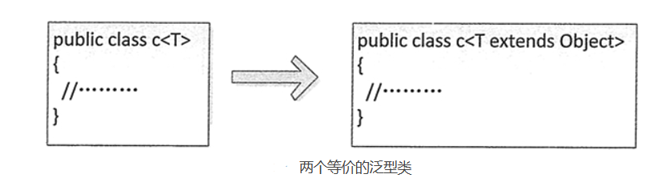

[toc]


# Java笔记12-泛型

Java 集合有个缺点，就是把一个对象“丢进”集合里之后，集合就会“忘记”这个对象的数据类型，当再次取出该对象时，该对象的编译类型就变成了 Object 类型（其运行时类型没变）。

Java 集合之所以被设计成这样，是因为集合的设计者不知道我们会用集合来保存什么类型的对象，所以他们把集合设计成能保存任何类型的对象，只要求具有很好的通用性，但这样做带来如下两个问题：
1. 集合对元素类型没有任何限制，这样可能引发一些问题。例如，想创建一个只能保存 Dog 对象的集合，但程序也可以轻易地将 Cat 对象“丢”进去，所以可能引发异常。
2. 由于把对象“丢进”集合时，集合丢失了对象的状态信息，集合只知道它盛装的是 Object，因此取出集合元素后通常还需要进行强制类型转换。这种强制类型转换既增加了编程的复杂度，也可能引发异常。

所以为了解决上述问题，从 Java 1.5 开始提供了泛型。泛型可以在编译的时候检查类型安全，并且所有的强制转换都是自动和隐式的，提高了代码的重用率。

## 泛型集合

泛型本质上是参数化类型。我们可以为类、接口或方法指定一个类型参数，通过这个参数限制被操作数据的数据类型，从而保证类型转换的绝对安全。

例子
```java
public class Book {
    private int Id; // 图书编号
    private String Name; // 图书名称
    private int Price; // 图书价格
    public Book(int id, String name, int price) { // 构造方法
        this.Id = id;
        this.Name = name;
        this.Price = price;
    }
    public String toString() { // 重写 toString()方法
        return this.Id + ", " + this.Name + "，" + this.Price;
    }
}

//---------------

public class Test14 {
    public static void main(String[] args) {
        // 创建3个Book对象
        Book book1 = new Book(1, "唐诗三百首", 8);
        Book book2 = new Book(2, "小星星", 12);
        Book book3 = new Book(3, "成语大全", 22);
        Map<Integer, Book> books = new HashMap<Integer, Book>(); // 定义泛型 Map 集合
        books.put(1001, book1); // 将第一个 Book 对象存储到 Map 中
        books.put(1002, book2); // 将第二个 Book 对象存储到 Map 中
        books.put(1003, book3); // 将第三个 Book 对象存储到 Map 中
        System.out.println("泛型Map存储的图书信息如下：");
        for (Integer id : books.keySet()) {
            // 遍历键
            System.out.print(id + "——");
            System.out.println(books.get(id)); // 不需要类型转换
        }
        List<Book> bookList = new ArrayList<Book>(); // 定义泛型的 List 集合
        bookList.add(book1);
        bookList.add(book2);
        bookList.add(book3);
        System.out.println("泛型List存储的图书信息如下：");
        for (int i = 0; i < bookList.size(); i++) {
            System.out.println(bookList.get(i)); // 这里不需要类型转换
        }
    }
}

```

在该示例中，创建了一个键类型为 Integer、值类型为 Book 的泛型集合，即指明了该 Map 集合中存放的键必须是 Integer 类型、值必须为 Book 类型，否则编译出错。并且在获取集合中的元素时，不需要把元素强制转换为 Book 类型，程序会隐式转换。


## 泛型类

除了可以定义泛型集合之外，还可以直接限定泛型类的类型参数。

语法格式如下：
```java
public class class_name<data_type1,data_type2,…>{}

// class_name 表示类的名称，
// data_ type1 等表示类型参数。
// Java 泛型支持声明一个以上的类型参数，只需要将类型用逗号隔开即可。
```

泛型类一般用于类中的属性类型不确定的情况下。在泛型类中声明不确定的变量时，使用下面的语句：
```java
private data_type1 property_name1;
private data_type2 property_name2;
```

例子: Stu类中的三个变量的数据类型会根据泛型的改变而改变
```java
public class Stu<N, A, S> {
    private N name; // 姓名
    private A age; // 年龄
    private S sex; // 性别

    // 创建类的构造函数
    public Stu(N name, A age, S sex) {
        this.name = name;
        this.age = age;
        this.sex = sex;
    }

    // 下面是上面3个属性的setter/getter方法
    public N getName() {
        return name;
    }

    public void setName(N name) {
        this.name = name;
    }

    public A getAge() {
        return age;
    }

    public void setAge(A age) {
        this.age = age;
    }

    public S getSex() {
        return sex;
    }

    public void setSex(S sex) {
        this.sex = sex;
    }
}

//-----------------------

public class Test14 {
    public static void main(String[] args) {
        Stu<String, Integer, Character> stu = new Stu<String, Integer, Character>("小明", 28, '女');
        String name = stu.getName();
        Integer age = stu.getAge();
        Character sex = stu.getSex();
        System.out.println("学生信息如下：");
        System.out.println("学生姓名：" + name + "，年龄：" + age + "，性别：" + sex);
    }
}

```


## 泛型方法

泛型同样可以在类中包含参数化的方法。泛型方法使得该方法能够独立于类而产生变化。如果使用泛型方法可以取代类泛型化，那么就应该只使用泛型方法。

定义泛型方法的语法格式如下：
```java
[访问权限修饰符] [static] [final] <类型参数列表> 返回值类型 方法名([形式参数列表])

//例如
public static <T> List find(Class<T> cs,int userId){}
```

<font color="red">一般来说编写 Java 泛型方法，其返回值类型至少有一个参数类型应该是泛型，而且类型应该是一致的，如果只有返回值类型或参数类型之一使用了泛型，那么这个泛型方法的使用就被限制了。</font>

例子
```java
public class Test16 {
    public static <T> void List(T book) { // 定义泛型方法
        if (book != null) {
            System.out.println(book);
        }
    }
    public static void main(String[] args) {
        Book stu = new Book(1, "细学 Java 编程", 28);
        List(stu); // 调用泛型方法
    }
}
```


## 泛型的高级用法


### 限制泛型可用类型

在 Java 中默认可以使用任何类型来实例化一个泛型类对象。当然也可以对泛型类实例的类型进行限制，语法格式如下：

```java
class 类名称<T extends anyClass>
```

其中，anyClass 指某个接口或类。使用泛型限制后，泛型类的类型必须实现或继承 anyClass 这个接口或类。无论 anyClass 是接口还是类，在进行泛型限制时都必须使用 extends 关键字。

例子
```java
// 限制ListClass的泛型类型必须实现List接口
public class ListClass<T extends List> {
    public static void main(String[] args) {
        // 实例化使用ArrayList的泛型类ListClass，正确
        ListClass<ArrayList> lc1 = new ListClass<ArrayList>();
        // 实例化使用LinkedList的泛型类LlstClass，正确
        ListClass<LinkedList> lc2 = new ListClass<LinkedList>();
        // 实例化使用HashMap的泛型类ListClass，错误，因为HasMap没有实现List接口
        // ListClass<HashMap> lc3=new ListClass<HashMap>();
    }
}
```

<font color="red">注意: 当没有使用 extends 关键字限制泛型类型时，其实是默认使用 Object 类作为泛型类型。因此，Object 类下的所有子类都可以实例化泛型类对象。</font>



### 使用类型通配符 ?

Java 中的泛型还支持使用类型通配符，它的作用是在创建一个泛型类对象时限制这个泛型类的类型必须实现或继承某个接口或类。

使用泛型类型通配符的语法格式如下：
```java
泛型类名称<? extends List>a = null;
```

其中，“<? extends List>”作为一个整体表示类型未知，当需要使用泛型对象时，可以单独实例化。

例子
```java
A<? extends List> a = null;
A<? extends List> b = null;
A<? extends List> c = null;
a = new A<ArrayList> ();    // 正确
b = new A<LinkedList> ();    // 正确
c = new A<HashMap> ();    // 错误.HashMap 类没有实现 List 接口
```

### 继承泛型类和实现泛型接口

定义为泛型的类和接口也可以被继承和实现。例如下面的示例代码演示了如何继承泛型类。

```java
public class FatherClass<T1>{}
public class SonClass<T1,T2,T3> extents FatherClass<T1>{}


interface interface1<T1>{}
interface SubClass<T1,T2,T3> implements Interface1<T1>{}
```

