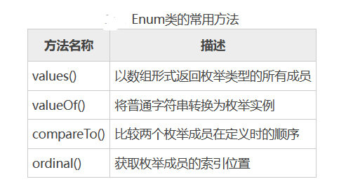

[toc]

# Java笔记13-枚举

枚举是一个被命名的整型常数的集合，用于声明一组带标识符的常数。枚举在曰常生活中很常见，例如一个人的性别只能是“男”或者“女”，一周的星期只能是 7 天中的一个等。

类似这种当一个变量有几种固定可能的取值时，就可以将它定义为枚举类型。

## 声明枚举

声明枚举时必须使用 enum 关键字，然后定义枚举的名称、可访问性、基础类型和成员等。

枚举声明的语法如下：
```java
public enum enumname:enum-base {
    enum-body,
}

// enumname 表示声明的枚举名称；
// enum-base 表示基础类型；默认是int类型
// enum-body 表示枚举的成员，它是枚举类型的命名常数。
```

任意两个枚举成员不能具有相同的名称，且它的常数值必须在该枚举的基础类型的范围之内，多个枚举成员之间使用逗号分隔。

<font color="red">注意：如果没有显式地声明基础类型的枚举，那么意味着它所对应的基础类型是 int。</font>

例子
```java
public enum Signal {
    // 定义一个枚举类型
    GREEN,YELLOW,RED
}
public class TrafficLight {
    Signal color = Signal.RED;
    public void change() {
        switch(color) {
            case RED:
                color = Signal.GREEN;
                break;
            case YELLOW:
                color = Signal.RED;
                break;
            case GREEN:
                color = Signal.YELLOW;
                break;
        }
    }
}
```


## 枚举类

Java 中的每一个枚举都继承自 java.lang.Enum 类。当定义一个枚举类型时，每一个枚举类型成员都可以看作是 Enum 类的实例，这些枚举成员默认都被 final、public, static 修饰，当使用枚举类型成员时，直接使用枚举名称调用成员即可。

所有枚举实例都可以调用 Enum 类的方法，常用方法如表图所示。



例子
```java
enum Signal {
    // 定义一个枚举类型
    GREEN,YELLOW,RED;
}
public static void main(String[] args) {
    for(int i = 0;i < Signal.values().length;i++) {
        System.out.println("枚举成员："+Signal.values()[i]);
    }
}
```

## 为枚举添加方法

Java 为枚举类型提供了一些内置的方法，同时枚举常量也可以有自己的方法。此时要注意必须在枚举实例的最后一个成员后添加分号，而且必须先定义枚举实例。

例子
```java
public enum Color {
    RED("红色",1),GREEN("绿色",2),WHITE("白色",3),YELLOW("黄色",4);
    // 成员变量
    private String name;
    private int index;
    // 构造方法
    private Color(String name,int index) {
        this.name = name;
        this.index = index;
    }
    // 覆盖方法
    @Override
    public String toString() {
        return this.index + "-" + this.name;
    }
}
```
