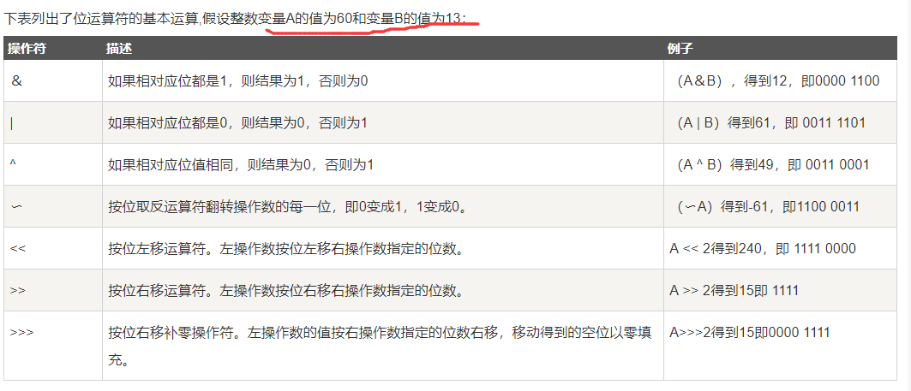

[toc]

# Java笔记2-基础语法

这篇文章主要是对自己的java语言知识的梳理。

## 基本数据类型

java定义了以下几种数据类型
```
> 整数类型（byte ， short ， int , long）
> byte ：占1个字节（8位），范围：-128（-2^7）~ 127（2^7-1）
> short ：占2个字节（16位），范围：-32768（-2^15）~ 32767（2^15 - 1）
> int : 占4个字节（32位），范围: -2^31 ~ 2^31 - 1
> long : 占8个字节（64位），范围：-2^63 ~ 2^63 -1

> 浮点数类型（float ， double）
> float : 用于存储小数数值。
> double : 既可以存储小数，也可以存储整数。

> 字符型（char）
> char : 用于存储一个单一的字符，最小值是 \u0000（即为0）；最大值是 \uffff（即为65,535）

> 布尔型（boolean）
> boolean : 只有两个取值：true 和 false；

```

- 1个字节占8位二进制。
- 整数范围和字节的关系：范围是 -2^N ~ 2^N - 1

下图是各个基本数据类型的默认值：


### 什么是字节？

要了解什么是字节？要先了解计算机内存的基本结构。

计算机内存的最小存储单元是字节（byte），一个字节就是一个8位二进制数，即8个bit。它的二进制表示范围从00000000 ~ 11111111，换算成十进制是0 ~ 255。

8个二进制数是1个字节，一个字节是1byte，1024字节是1K，1024K是1M，1024M是1G，1024G是1T。

### 为什么8个字节的byte范围是-128 ~ 127？

因为计算机是以补码形式储存数据的。所以最高位的字节需要用来表示正负符号（0表示正数，1表示负数）。所以byte的数据范围就是-128（-2^7）~ 127（2^7-1）

计算机之所以是以补码形式存储数据，主要是为了可以把减法当加法算。比如5-3=5+（-3），补码情况下正数和负数可以直接相加。


如上图1为00000001,因为1+(-1)必须等于0,那-1只能为11111111,11111111+00000001=00000000。


### 基本数据类型之间的转换

<font color="red">在java程序中，一种基本数据类型的值赋给另一种基本数据类型的变量时，需要进行数据类型转换。</font>

数据类型转换有两种方式：
- 自动类型转换，目标数据类型的范围大于源数据类型的范围时。
- 强制类型转换，当两种类型彼此不兼容，或者目标数据类型的范围小于源数据类型时，需要使用强制类型转换。

```java
//下面是自动类型转换
byte b = 100;
int a = b;  // byte -> int

//下面是强制数据类型转换的写法
int c=122;
byte d=(byte)c;   //int -> byte , 会导致数据精度的损失。
```

数据类型转换规则：
- 整型、浮点型、字符型数据可以进行混合运算。它们会先转化为范围最大的类型，然后进行运算。
- 不能对boolean类型进行类型转换
- 容量大的类型转换为容量小的类型时必须使用强制类型转换.
- 转换过程中可能导致数据溢出或损失精度.


## 变量

> 什么是变量？
变量是用来描述一条信息的别名，可以在程序代码中使用一个或多个变量。变量中可以存储各种类型的信息，如登录信息、版本名称、文件的大小、某个英文单词以及飞机票价格等。

### 定义变量

在java中可以通过指定数据类型和标识符来定义变量。

```java
//定义变量
byte a = 100;
short b = 100;
int c = 1000;
long d = 100L;    //为long类型变量赋值时，需在数值的后面加上大写的L，表示该类型为long类型。
float e = 234.5f;  //为float类型变量赋值时，需在数值的后面加上F或f，表示该类型为float类型。
double f= 123.4;
boolean g = true;
char h = 'A';
```

变量名称（标识符）的命名规范
* 首字符必须是字母、下划线（―）、美元符号（$）或者人民币符号（¥）。
* 标识符由数字（0~9）、大写字母（A~Z）、小写字母（a~z）、下划线（―）、美元符号（$）、人民币符号（¥）以及所有在十六进制 0xc0 前的 ASCII 码组成。
* 不能把关键字、保留字作为标识符。
* 标识符的长度没有限制。
* 标识符区分大小写。	


初始化变量有两种方式：一种是声明时直接赋值，一种是先声明、后赋值。
```java
//定义变量one
byte one;
//定义变量two并赋初值
byte two = 2;
//声明并初始化多个变量,多个变量中间要使用逗号分隔。
int num1=12,num2=23,num3=35;   
```

### 变量的作用域

变量的作用域规定了变量所能使用的范围，只有在作用域范围内变量才能被使用。根据变量声明地点的不同，变量的作用域也不同。

如下图展示


### 成员变量,静态变量和局部变量

变量根据作用域的不同，可以分为不同的类型：成员变量,静态变量和局部变量。

#### 成员变量与静态变量

成员变量与静态变量都是定义在方法体和语句块之外，作用域是整个类。

静态变量就是用static关键字修饰的成员变量。

```java
public class MyClass {
    String name; // 成员变量
    static String website = "XXX中文网"; // 静态变量
}
```

两者区别？

| 名称 | 修饰 | 访问 | 生命周期 |
| ------ | ------ | ------ | ------ |
| 成员变量 | 无 static 修饰 | 对象名.变量名 | 只要对象存在，实例变量就将存在 |
| 静态变量（类变量） | 用 static 修饰 | 类名.变量名或对象名.变量名 | 其生命周期取决于类的生命周期。类被垃圾回收机制彻底回收时才会被销毁 |


#### 局部变量

局部变量是指在方法或者方法代码块中定义的变量，其作用域是其所在的代码块。可分为以下三种：
* 方法参数变量（形参）：在整个方法内有效。
* 方法局部变量（方法内定义）： 从定义这个变量开始到方法结束这一段时间内有效。
* 代码块局部变量（代码块内定义）：从定义这个变量开始到代码块结束这一段时间内有效。


## 运算符

运算符是控制变量与变量之间如何进行运算。运算符有以下几种：

> 1.算术运算符:


前缀(++a,--a): 先进行自增或者自减运算，再进行表达式运算。
后缀(a++,a--): 先进行表达式运算，再进行自增或者自减运算.

> 2.关系运算符:


> 3.位运算符:



> 4.逻辑运算符：


> 5.赋值运算符：


> 6.Java运算符优先级


## 数组

数组是容纳多个相同数据类型元素的变量。

数组的特点：
- 数组所有元素初始化为默认值，整型都是0，浮点型是0.0，布尔型是false；
- 数组一旦创建后，大小就不可改变。

### 定义数组

```java
int[]  myList;         //推荐的定义方式
int  myList2[];        //C/C++ 语言风格的定义方式。不推荐使用

//定义数组myList3并初始化数组myList3
int[] myList3 = new int[10];
```

注意: 推荐使用`int[] myList;`的方式来数组变量。 

### 使用数组

```java
//打印数组内容，数组作为函数参数
public static void printArray(int[] a) {
    //增强for循环
    for(int x:a) {
        System.out.println("数组值"+x);
    }
}

//逆序输出数组，数组作为函数返回值
public static int[] reverse(int[] a) {
    int[] result = new int[a.length];    //创建一个与a数组等长的数组result
    for (int i = 0, j = result.length - 1; i < a.length; i++, j--) {   //把a数组的逆序赋值到result数组上
    result[j] = a[i];
    }
    return result;
}
```

### 多维数组

多维数组可以看成是数组中的每一个元素也是数组，例如二维数组就是一个特殊的一维数组，其每一行元素都是一个一维数组。

```java
//二维数组的定义
int[][] a = new int[2][3]; //创建一个2行3列的二维数组
int[][] b = new int[3][];  //这样创建的方式，只是数组中每个元素的长度不确定

//二维数组 a 可以看成每一行都是一个一维数组，相当于两个一维数组叠加在一起。其中每一个一维数组都有3个元素

//特别的二维数组定义并初始化
int[][] c = {{5,7,9},{12,14,16},{9,9,9},{2,2}}
```

```java
//例子：二维数组的赋值与遍历
public class test1 {
	  public static void main(String[] args) {
		  int[][] a=new int[3][3];  //创建数组a
		  for(int i=0;i<3;i++) {    //二维数组的赋值
			 for(int j=0;j<3;j++) {
				a[i][j]=i+j;
			 }
		  }
		  for(int i=0;i<3;i++) {    //二维数组的遍历
			 for(int j=0;j<3;j++) {
				System.out.print(" "+a[i][j]);
			 }
			 System.out.println(" ");
		  }
	  }
}

```
