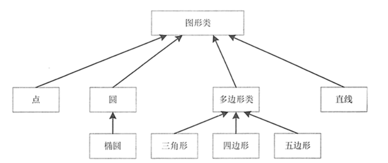

[toc]

# Java笔记8-继承

## 类的封装

封装可以将类的某些信息隐藏在类内部，不允许外部程序直接访问，只能通过该类提供的方法来实现对隐藏信息的操作和访问。

例如：一台计算机内部极其复杂，有主板、CPU、硬盘和内存， 而一般用户不需要了解它的内部细节，不需要知道主板的型号、CPU 主频、硬盘和内存的大小，于是计算机制造商将用机箱把计算机封装起来，对外提供了一些接口，如鼠标、键盘和显示器等，这样当用户使用计算机就非常方便。

封装的特点：
* 只能通过规定的方法访问数据。
* 隐藏类的实例细节，方便修改和实现。

实现封装的具体步骤如下：
1. 修改属性的可见性来限制对属性的访问，一般设为 private。
2. 为每个属性创建一对赋值（setter）方法和取值（getter）方法，一般设为 public，用于属性的读写。
3. 在赋值和取值方法中，可以加入条件语句（用于对属性值的合法性进行判断）。

```java
public class Employee {
    private String name; // 姓名
    private int age; // 年龄
    private String phone; // 联系电话
    private String address; // 家庭住址

    public String getName() {
        return name;
    }
    public void setName(String name) {
        this.name = name;
    }

    public int getAge() {
        return age;
    }
    public void setAge(int age) {
        // 对年龄参数进行限制
        if (age < 18 || age > 40) {
            System.out.println("年龄必须在18到40之间！");
            this.age = 20; // 默认年龄
        } else {
            this.age = age;
        }
    }

    public String getPhone() {
        return phone;
    }
    public void setPhone(String phone) {
        this.phone = phone;
    }

    public String getAddress() {
        return address;
    }
    public void setAddress(String address) {
        this.address = address;
    }
}
```

如上述代码所示，使用private关键字修饰属性，这就意味着除了Employee类本身外，其他任何类都不可以访问这些属性。但是，可以通过这些属性的 setXxx() 方法来对其进行赋值，通过 getXxx() 方法来访问这些属性。

在 age 属性的 setAge() 方法中，首先对用户传递过来的参数 age 进行判断，如果 age 的值不在 18 到 40 之间，则将 Employee 类的 age 属性值默认设置为 20，否则为传递过来的参数值。

```java
//编写测试类 EmployeeTest，在该类的 main() 方法中调用 Employee 属性的 setXxx() 方法对其相应的属性进行赋值，并调用 getXxx() 方法访问属性
public class EmployeeTest {
    public static void main(String[] args) {
        Employee people = new Employee();
        people.setName("王丽丽");
        people.setAge(35);
        people.setPhone("13653835964");
        people.setAddress("河北省石家庄市");
        System.out.println("姓名：" + people.getName());
        System.out.println("年龄：" + people.getAge());
        System.out.println("电话：" + people.getPhone());
        System.out.println("家庭住址：" + people.getAddress());
    }
}
```

运行该示例，输出结果如下：
```
姓名：王丽丽
年龄：35
电话：13653835964
家庭住址：河北省石家庄市
```

通过封装，实现了对属性的数据访问限制，满足了年龄的条件。在属性的赋值方法中可以对属性进行限制操作，从而给类中的属性赋予合理的值， 并通过取值方法获取类中属性的值（也可以直接调用类中的属性名称来获取属性值）。


## 类的继承

Java 中的继承就是在已经存在类的基础上进行扩展，从而产生新的类。已经存在的类称为父类、基类或超类，而新产生的类称为子类或派生类。在子类中，不仅包含父类的属性和方法，还可以增加新的属性和方法。

Java 中子类继承父类的语法格式如下：

```java
修饰符 class class_name extends extend_class {
    // 类的主体
}
```

其中，class_name 表示子类（派生类）的名称；extend_class 表示父类（基类）的名称；extends 关键字直接跟在子类名之后，其后面是该类要继承的父类名称。

<font color="red">类的继承不改变类成员的访问权限，也就是说，如果父类的成员是公有的、被保护的或默认的，它的子类仍具有相应的这些特性，并且子类不能获得父类的构造方法。</font>


### 继承的例子

1. 创建人类 People，并定义 name、age、sex、sn 属性

```java
public class People {
    public String name; // 姓名
    public int age; // 年龄
    public String sex; // 性别
    public String sn; // 身份证号
    //有参构造方法
    public People(String name, int age, String sex, String sn) {
        this.name = name;
        this.age = age;
        this.sex = sex;
        this.sn = sn;
    }
    public String toString() {
        return "姓名：" + name + "\n年龄：" + age + "\n性别：" + sex + "\n身份证号：" + sn;
    }
}
```

2. 创建 People 类的子类 Student 类，并定义 stuNo 和 department 属性。

```java
public class Student extends People {
    private String stuNo; // 学号
    private String department; // 所学专业
    public Student(String name, int age, String sex, String sn, String stuno, String department) {
        super(name, age, sex, sn); // 调用父类中的构造方法
        this.stuNo = stuno;
        this.department = department;
    }
    public String toString() {
        return "姓名：" + name + "\n年龄：" + age + "\n性别：" + sex + "\n身份证号：" + sn + "\n学号：" + stuNo + "\n所学专业：" + department;
    }
}
```

由于 Student 类继承自 People 类，因此，在 Student 类中同样具有 People 类的属性和方法，这里重写了父类中的 toString() 方法。

3. 创建 People 类的另一个子类 Teacher，并定义 tYear 和 tDept 属性。

```java
public class Teacher extends People {
    private int tYear; // 教龄
    private String tDept; // 所教专业
    public Teacher(String name, int age, String sex, String sn, int tYear, String tDept) {
        super(name, age, sex, sn); // 调用父类中的构造方法
        this.tYear = tYear;
        this.tDept = tDept;
    }
    public String toString() {
        return "姓名：" + name + "\n年龄：" + age + "\n性别:" + sex + "\n身份证号：" + sn + "\n教龄：" + tYear + "\n所教专业：" + tDept;
    }
}
```

由于 Teacher 类继承自 People 类，因此，在 Teacher 类中同样具有 People 类的属性和方法，这里重写了父类中的 toString() 方法。

4. 编写测试类 PeopleTest

```java
public class PeopleTest {
    public static void main(String[] args) {
        // 创建Student类对象
        People stuPeople = new Student("王丽丽", 23, "女", "410521198902145589", "00001", "计算机应用与技术");
        System.out.println("----------------学生信息---------------------");
        System.out.println(stuPeople);

        // 创建Teacher类对象
        People teaPeople = new Teacher("张文", 30, "男", "410521198203128847", 5, "计算机应用与技术");
        System.out.println("----------------教师信息----------------------");
        System.out.println(teaPeople);
    }
} 
```

运行程序，输出的结果如下：
```
----------------学生信息---------------------
姓名：王丽丽
年龄：23
性别：女
身份证号：410521198902145589
学号：00001
所学专业：计算机应用与技术
----------------教师信息----------------------
姓名：张文
年龄：30
性别:男
身份证号：410521198203128847
教龄：5
所教专业：计算机应用与技术
```

### 单继承

Java只支持单继承，不支持多继承。只允许一个类直接继承另一个类，即子类只能有一个直接父类，extends 关键字后面只能有一个类名。

单继承的关系图



继承的注意点：
* 子类一般比父类包含更多的属性和方法。
* 父类中的 private 成员在子类中是不可见的，因此在子类中不能直接使用它们。
* 父类和其子类间是一个“is-a”的关系。
* 父类的构造方法不会被子类继承。
* Java 只允许单一继承（即一个子类只能有一个直接父类），C++ 可以多重继承（即一个子类有多个直接父类）。


继承的优点如下：
* 实现代码共享，减少创建类的工作量，使子类可以拥有父类的方法和属性。
* 提高代码维护性和可重用性。
* 提高代码的可扩展性，更好的实现父类的方法。

继承的缺点如下：
* 继承是侵入性的。只要继承，就必须拥有父类的属性和方法。
* 降低代码灵活性。子类拥有父类的属性和方法后多了些约束。
* 增强代码耦合性（开发项目的原则为高内聚低耦合）。当父类的常量、变量和方法被修改时，需要考虑子类的修改，有可能会导致大段的代码需要重构。

## Object类

如果定义一个 Java 类时并未显式指定这个类的直接父类，则这个类默认继承 java.lang.Object 类。因此java.lang.Object 类是所有类的父类，要么是其直接父类，要么是其间接父类。因此所有的 Java 对象都可调用 java.lang.Object 类所定义的实例方法。

##  super 关键字

由于子类不能继承父类的构造方法，因此，如果要调用父类的构造方法，可以使用 super 关键字。super 可以用来访问父类的构造方法、普通方法和属性。

super 关键字的功能：
- 在子类的构造方法中显式的调用父类构造方法
- 访问父类的成员方法和变量。

### super调用父类构造方法

super 关键字可以在子类的构造方法中显式地调用父类的构造方法，基本格式如下：

```
super(parameter-list);
```

其中，parameter-list 指定了父类构造方法中的所有参数。注意super( ) 必须是在子类构造方法的方法体的第一行。

例子：
```java
public class Person {
    public Person(String name, int age) {
    }
    public Person(String name, int age, String sex) {
    }
}

//-------------------
public class Student extends Person {
    public Student(String name, int age, String birth) {
        super(name, age); // 调用父类中含有2个参数的构造方法
    }
    public Student(String name, int age, String sex, String birth) {
        super(name, age, sex); // 调用父类中含有3个参数的构造方法
    }
}
```

<font color="red">
通常情况下，编译器会自动在子类构造方法的第一句加上super(),来调用父类的无参构造方法，所以super()要不必须写在子类构造方法的第一句，要不省略不写。通过 super 来调用父类其它构造方法时，只需要把相应的参数传过去。</font>

### super访问父类成员

当子类的成员变量或方法与父类同名时，可以使用 super 关键字来访问父类的变量与方法。如果子类重写了父类的某一个方法，即子类和父类有相同的方法定义，但是有不同的方法体，此时，我们也可以通过 super 来调用父类里面的这个方法。

使用 super 访问父类中的成员与 this 关键字的使用相似，只不过它引用的是子类的父类，语法格式如下：

```
super.member
```

其中，member 是父类中的属性或方法。使用 super 访问父类的属性和方法时不用位于第一行。


> super调用成员属性

```java
class Person {
    int age = 12;
}
class Student extends Person {
    int age = 18;
    void display() {
        //super调用父类的成员属性
        System.out.println("学生年龄：" + super.age);
    }
}
```

> super调用成员方法

```java
class Person {
    void message() {
        System.out.println("This is person class");
    }
}

class Student extends Person {
    void message() {
        System.out.println("This is student class");
    }
    void display() {
        message();
        //super调用父类的成员方法
        super.message();
    }
}
```

### super关键字和this关键字的区别

this 指的是当前对象的引用，super 是当前对象的父对象的引用。

super 关键字的用法：
* super.父类属性名：调用父类中的属性
* super.父类方法名：调用父类中的方法
* super()：调用父类的无参构造方法
* super(参数)：调用父类的有参构造方法
* 如果构造方法的第一行代码不是 this() 和 super()，则系统会默认添加 super()。

this 关键字的用法：
* this.属性名：表示当前对象的属性
* this.方法名(参数)：表示调用当前对象的方法


## 父类与子类之间的对象类型转换

Java 语言允许父类引用变量引用子类实例对象，而且可以对这个引用变量进行类型转换。主要有两种，分别是向上转型和向下转型。

### 向上转型

父类引用指向子类对象为向上转型，语法格式如下：
```java
fatherClass obj = new sonClass();
//其中，fatherClass 是父类名称或接口名称，obj 是创建的对象，sonClass 是子类名称。
```

向上转型就是把子类对象直接赋给父类引用，不用强制转换。使用向上转型后，obj可以调用父类类型中的所有成员，不能调用子类类型中特有成员，最终运行效果看子类的具体实现。

### 向下转型

与向上转型相反，子类对象指向父类引用为向下转型，语法格式如下：

```java
sonClass obj = (sonClass) fatherClass;
//其中，fatherClass 是父类名称，obj 是创建的对象，sonClass 是子类名称。
```

向下转型后，obj可以调用子类类型中所有的成员。


### 强制对象类型转换

Java 编译器允许在具有直接或间接继承关系的类之间进行类型转换。对于向下转型，必须进行强制类型转换；对于向上转型，不必使用强制类型转换。

```java
Animal animal = new Cat();  // 向上转型
Cat cat = (Cat) animal;     // 向下转型，需要强制类型转换
```

## 方法重载

Java 允许同一个类中定义多个同名方法，只要它们的形参列表不同即可。如果同一个类中包含了两个或两个以上方法名相同的方法，但形参列表不同，这种情况被称为方法重载（overload）。

```java
//如下方法重载
public class TestClass {
    public void max(int a, int b) {
        // 含有两个int类型参数的方法
        System.out.println(a > b ? a : b);
    }
    public void max(double a, double b) {
        // 含有两个double类型参数的方法
        System.out.println(a > b ? a : b);
    }
    public void max(double a, double b, int c) {
        // 含有两个double类型参数和一个int类型参数的方法
        double max = (double) (a > b ? a : b);
        System.out.println(c > max ? c : max);
    }
}
```

<font color="red">方法重载的注意点:同一个类中方法名相同，参数列表不同。至于方法的其他部分，如方法返回值类型、修饰符等，与方法重载没有任何关系。</font>

## 方法重写

在子类中如果创建了一个与父类中相同名称、相同返回值类型、相同参数列表的方法，只是方法体中的实现不同，以实现不同于父类的功能，这种方式被称为方法重写（override），又称为方法覆盖。当父类中的方法无法满足子类需求或子类具有特有功能的时候，需要方法重写。

方法重写的必要性：子类可以根据需要，定义特定于自己的行为。既沿袭了父类的功能名称，又根据子类的需要重新实现父类方法，从而进行扩展增强。

在重写方法时，需要遵循下面的规则：
* 参数列表和必须相同。
* 返回的类型必须相同。
* 访问权限不能比父类中被重写方法的访问权限更低。（public>protected>default>private）。

另外还要注意以下几条：
* 父类的成员方法只能被它的子类重写。
* 声明为 final 的方法不能被重写。
* 声明为 static 的方法不能被重写，但是能够再次声明。
* 构造方法不能被重写。
* 子类和父类在同一个包中时，子类可以重写父类的所有方法，除了声明为 private 和 final 的方法。
* 子类和父类不在同一个包中时，子类只能重写父类的声明为 public 和 protected 的非 final 方法。
* 如果不能继承这个方法，则不能重写这个方法。

```java
public class Animal {
    public String name; // 名字
    public int age;     // 年龄

    public Animal(String name, int age) {
        this.name = name;
        this.age = age;
    }

    public String getInfo() {
        return "我叫" + name + "，今年" + age + "岁了。";
    }
}

//========================
public class Cat extends Animal {
    private String hobby;
    public Cat(String name, int age, String hobby) {
        super(name, age);
        this.hobby = hobby;
    }
    //子类重写父类的getInfo方法
    public String getInfo() {
        return "喵！大家好！我叫" + this.name + "，我今年" + this.age + "岁了，我爱吃" + hobby + "。";
    }

    public static void main(String[] args) {
        Animal animal = new Cat("小白", 2, "鱼");
        System.out.println(animal.getInfo());
    }
}
```