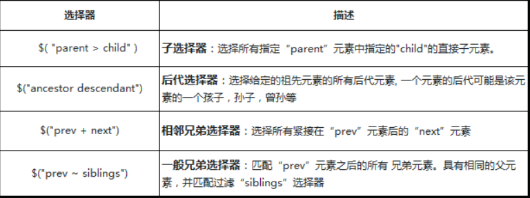
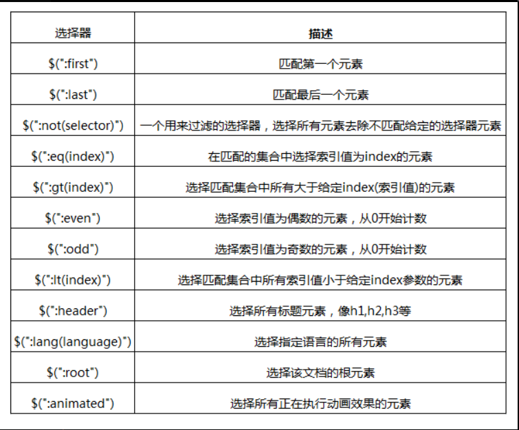
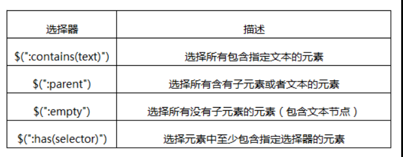
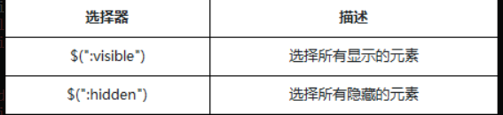
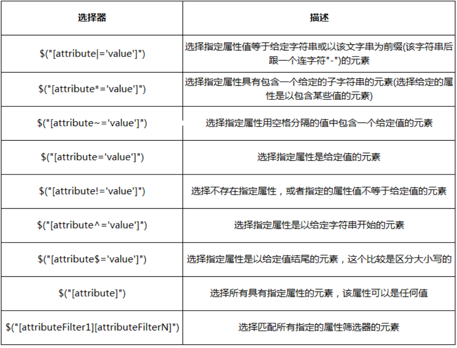
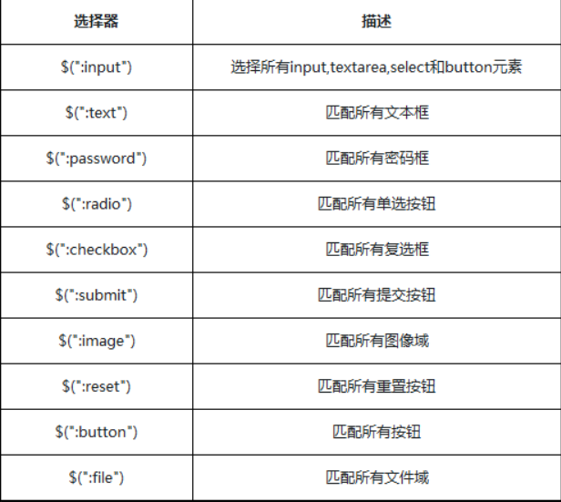
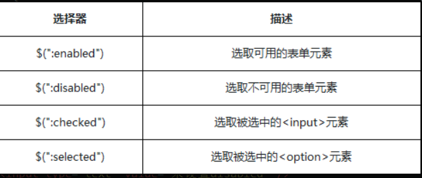
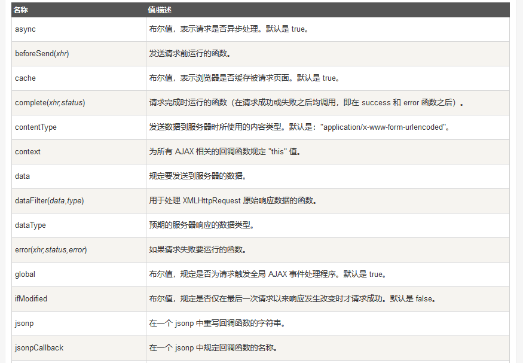
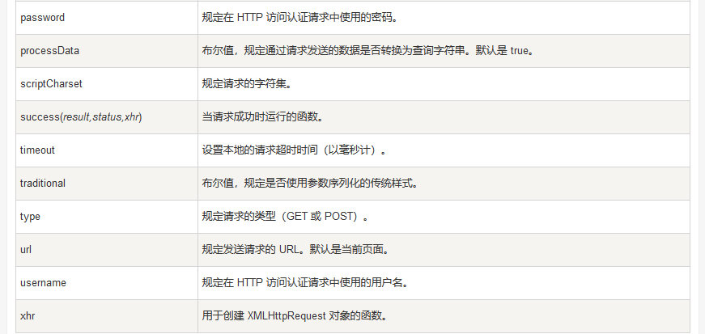

# Jquery基础
jQuery是一个轻量级的JavaScript库。

## 1. Jquery 的引用：

```html
<head>
    <script src="https://cdn.bootcss.com/jquery/3.3.1/jquery.min.js">
    </script>
    <!--这里使用的是在线的jquery库-->
</head> 
```

## 2.jQuery基础

### 1.基础语法

<font color="red">$是jQuery的简写。</font>

```js
$(selector).action();   //也可以写出jQuery(selector).action();
```

（1）$定义jQuery,将被选的DOM对象转换成jQuery对象。
（2）selector是选择器，类似于CSS选择器。
（3）action()是执行的操作

### 2.jquery对象和DOM对象 

jquery对JS中的大量方法进行封装，从而让我们操作更加便利，也规避了很多浏览器兼容问题。

<font color="red">通过jQuery选择器获取的对象就是jQuery对象</font>

>①jquery对象转化为DOM对象：

```html
<div>元素一</div>
<div>元素二</div>
<div>元素三</div>
```

```js
var $div = $('div') // 用jQuery找到所有的div元素（3个），为数组结构
var div = $div[0] //  通过数组下标索引，获取数组中的第一个div元素，返回DOM对象
div.style.color = 'red' //操作dom对象的属性
```

<font color="red">jQuery对象自身提供一个.get() 方法允许我们直接访问jQuery对象中相关的DOM节点，get方法中提供一个元素的索引：</font>

>②DOM对象转换为Jquery对象：

`var a = $(被转换的dom对象);   //将普通的dom对象加工成jQuery对象a`  

```js
var odiv=document.getElementById("#ant");   //返回dom对象
var $div = $(odiv);                     //把dom对象转换为jq对象
```

### 3. `$(document).ready(function(){...})` 与 `$(function(){...})`

```js
$(document).ready(function(){
  // 文档就绪
})

//这是上面代码的简写
$(function(){
  // 文档就绪
});
```

作用就是等文档结构加载完成后再去执行function中的代码。
功能类似于window.onload事件,与DOMContentLoaded事件功能相同。

### 4.$()或jQuery()

```js
jQuery([selector,[context]]);   //接收一个包含CSS选择器的字符串，然后用这个字符串去匹配一组元素
```

注意：
1. 如果没有指定context，$()将在当前的HTML document中查找DOM元素；
2. 如果指定了context参数，如一个DOM元素集或jQuery对象，那就会在这个context中查找。

```js
$("li", $("#box")).css("color","blue");   //在id=box的标签中，把li标签的字体颜色设置为蓝色
```

### 5.jQuery length属性

```js
$(selector).length;    //length属性获取jQuery元素集合中元素的个数。
```

## 3.选择器

### 1.#id选择器

<font color="red">id选择器：一个用来查找标签的ID，即元素的id属性</font>

```js
$( "#id" );   //$("#id_1")
```

### 2. .class选择器

<font color="red">类选择器，顾名思义，通过class样式类名来获取节点</font>

```js
$( ".class" );   //$(".class_1")
```

### 3.element选择器

<font color="red">元素选择器：根据给定（html）标记名称选择所有的元素，有原生方法getElementsByTagName()函数支持</font>
```js
$("element");   //如 $("span")
```

**搜索指定元素标签名的所有节点，这个是一个合集的操作，产生数组对象。**

### 4.全（*）选择器：

jQuery中我们也可以通过传递*选择器来选中文档页面中的元素
```js
$( "*" );    //使用document.getElementsByTagName()中传递"*"同样可以做到
```

### 5.分组选择器

```js
$( "selector1, selector2, selectorN" );  //如：$("p,div,.ant");选择p标签,div标签,class="ant"的标签
```


### 5.层级选择器：
把文档树当作一个家谱，那么节点与节点直接就会存在父子，兄弟，祖孙的关系了。
通过一个列表，显示层级选择器



```js
$(".box>p").css("color", "green");    //将class=box标签的子标签p的字体颜色设置为绿色。
$("div p").css("color", "blue");    //将div元素下的所有p元素字体颜色设置为蓝色
$("p + div").css("color","green");     //将紧跟p元素后面的div字体颜色设置为绿色。
$("p~div").css("color", "green");     //将p元素的兄弟元素中的div的颜色变为绿色
```

### 6.筛选选择器：
jQuery提供了一系列的筛选选择器用来更快捷的找到所需的DOM元素。
筛选选择器的用法与CSS中的伪元素相似，选择器用冒号“：”开头.

>1.基本筛选器的描述：



<font color="red">注意事项：</font>
**注意jQuery合集都是从0开始索引**.

```js
$("li:first").css("color", "blue");   //将li元素中第一个li元素字体颜色设置为蓝色
$("li:last").css("color", "blue");    //将li元素中最后一个li元素中的字体颜色设置为蓝色。
$("li:not(.ant_2)").css("color","blue");  //将li集合中class属性值不是"ant_2"的li元素字体颜色设置为蓝色
$("li:eq(1)").css("color","blue");    //将索引值为1(第二个)的li元素字体颜色设置为绿色。
$("li:gt(2)").css("color", "blue");   //将索引值大于2的li元素字体颜色设置为蓝色
$("li:even").css("color", "blue");    //索引值为偶数的li元素的字体颜色设置为蓝色
$("li:odd").css("color", "blue");       //索引值为奇数的li元素字体颜色设置为蓝色
$("li:lt(2)").css("color", "blue");     //将前两个li元素字体颜色设置为蓝色
$(".ant:header").css("color", "blue");      //将class=ant的标题元素的文本颜色设置为蓝色。
$("div:lang(en-us)").addClass("usa");      
$("div").text($(":root")[0].tagName);         //匹配的是文档的根元素
$("li:animated").css("background-color","blue");      //将动画元素的背景颜色设置为蓝色
```

>2.内容筛选选择器
通过内容来过滤，内容筛选选择器，其规则也会体现在它所包含的子元素或者文本内容上。



```js
$("li:contains('html')").css("color","blue");     //将包含“html”的li元素文本颜色设置为蓝色。如 <li>html专区</li>
$("div:has(span)").css("background-color", "green");   //将含有span元素的div元素背景颜色设置为绿色。<div><span>文本</span></div>
$("div:parent").css("background-color", "green");      //将含有内容的div元素(包括子节点)背景颜色设置为绿色
$("li:empty").animate({ width: "200px"});           //设置没有包含任何内容的li元素的宽度为200px
```

>3.可见性筛选选择器:
元素有显示状态与隐藏状态，jQuery根据元素的状态扩展了可见性筛选选择器:visible与:hidden.



<font color="red">:hidden选择器，不仅仅包含样式是display="none"的元素，还包括隐藏表单、visibility等等</font>

```js
$("div:hidden").css({display: "block",color: "green"})      //将原本隐藏的div元素显示，并将其中的字体颜色设置为绿色
$("div:visible").css({color: "green"})        //将可见的div元素中字体颜色设置为绿色。
```

隐藏一个元素的几种方式：
1. CSS display的值是none。
2. type="hidden"的表单元素。
3. 宽度和高度都显式设置为0。
4. 一个祖先元素是隐藏的，该元素是不会在页面上显示
6. CSS visibility的值是hidden
7. CSS opacity的指是0


>4.属性筛选选择器
属性选择器让你可以基于属性来定位一个元素。可以只指定该元素的某个属性，



```js
$("[title]").css("color","blue"); //将具有title属性的li元素字体颜色设置为蓝色.<li title="ant_1">text</li>
$("li[title='ant_2']").css("color","blue"); //将title属性值为"ant_2"的li元素字体颜色设置为蓝色。
$('[title*="nt"]').css("color", "blue");  //将title属性值为包含"nt"的li元素字体颜色设置为蓝色.<li title="ant_1">一</li>
$('li[title~="c"]').css("color", "blue");  //将title属性用空格分隔的值中包含"c"的li元素字体颜色设置为蓝色.<li title="a b c">二</li>
$('li[title|="ant_1"]').css("color", "blue");  //title属性值为"ant_1"的li元素字体颜色设置为蓝色
$('[title$="_1"]').css("color", "blue");  //title属性值以"_1"结尾的li元素字体颜色设置为蓝色。
$('li[title^="ant"]').css("color", "blue");   //title属性值以"ant"开头的li元素字体颜色设置为蓝色。
$("li[title!=ant_2]").css("color", "blue");   //title属性值不为"ant_2"的li元素字体颜色设置为蓝色.
```

>5.表单元素选择器
表单选择器能够极其方便地获取到某个类型的表单元素



```js
$("textarea").val($(":input").length);  //将匹配的input元素数目写入多行文本域
$("input:text").css("color","red");   //将文本框的value属性值设置为红色。
$("input:password").css("background-color","#ccc");   //将密码框背景颜色设置为#ccc
$(":radio").hide();   //隐藏单选按钮元素
$(":checkbox").hide();    //隐藏checkbox复选框元素
$("input:submit").css("background-color","red");   //将提交按钮背景颜色设置为红色
$(":image").width("100");    //设置图片的尺寸
$("input:reset").css("color", "blue");    //设置重置按钮的字体颜色
$(":button").hide();    //隐藏所有的按钮元素
$(":file").css("background-color","red");   //将文件域的背景颜色设置为红色。
```



```js
$("input:enabled").css("background-color", "red");   //将可用文本框背景颜色设置为红色
$("input:disabled").css("background-color","red");   //将不可用按钮背景色设置为红色
$("input:checked").hide();    //将选中的input元素隐藏
$(".sel :selected").css("color", "red");  //将被选中的option元素的字体颜色设置为红色。
/*
<select name="sel" class="sel">
      <option>一</option>
      <option>二</option>
      <option selected="selected">三</option>
</select>
*/
```

## 4.jq常用方法

### 1.从标签集合筛选出具体的某个标签

```js
$(selector).first();   //获取匹配元素集合中的第一个元素
$(selector).last();    //匹配元素集合中的最后一个元素
$(selector).eq(index);  //匹配元素集上对应索引的元素
$(selector).filter(expr); //筛选出与指定表达式或者方法返回值相匹配的元素或者元素集合
$(selector).not(expr);//从匹配的元素集合中移除指定的元素

$("li").first().css("color","blue");  //将第一个li元素中文本的颜色设置为蓝色
$("li").last().css("color","blue");  //将最后一个li元素的字体颜色设置为蓝色
$("li").eq(1).css("color","blue");  //索引是1的li元素中的字体颜色设置为蓝色
$("li").filter(".ant").css("color","blue");//将类名为"ant"的li元素字体颜色设置为蓝色
$("li").not(".ant");   //将li元素集合中class="ant"的li元素移出
```

### 2.祖先，后代，兄弟

```js
$(selector).parent([selector]);//返回匹配元素集合中，每个元素的直接父元素
.parents([selector]);         //获取包含所有匹配元素的父辈元素的集合,直到文档的根元素 (<html>)
.siblings([selector]);//获取匹配元素集合中每一个元素的同辈元素
.next([selector]);//获得匹配元素集合中每个元素紧邻的下一个同辈元素
.nextAll([selector]); //获取匹配元素集合中每个元素所有后面的同辈元素
.prev([selector]);//匹配元素集合中每个元素紧邻的前一个同辈元素
.prevAll([selector ]);//匹配元素集合之前所有的同辈元素
.children([selector]);//匹配元素集合中每一个元素的所有子元素集合
.find(selector);//匹配元素集合中所有元素的子元素集合
```

```js
$("span").parent().css("background-color", "blue");//获取span元素的第一级父元素，并设置此父元素的背景颜色
$("span").parents().css("border", "5px solid green");//设置span元素的所有父辈元素的边框样式

$(".antzone").siblings().css("color","green");      //将antzone的兄弟元素的字体颜色设置为绿色
$("p").next().css("color","blue");  //将p元素紧邻的下一个同辈元素中的字体颜色设置为蓝色
$("p").nextAll().css("color","blue");//将p元素之后的所有同辈元素中的字体颜色设置蓝色
$("li").prev(".ant").css("color","red");  //将所有li元素集合中每一个li元素前面class属性值为"ant"的元素的字体颜色设置为红色
$(".box div").prevAll("span").css("color", "blue");//将div元素所有前面的同辈元素中的span元素中的字体颜色设置为蓝色。

$(".father").children("p").css("background-color","black");//将class=father的标签中的p元素的字体颜色设置为黑色
$(".box").find("p").css("color", "red");//将class=box元素下的所有p元素的字体颜色设置为红色

```

## 5.jq操控HTML

### 1.jq获得标签属性与内容,text(),html(),val(),attr()

text() - 设置或返回所选元素的文本内容
html() - 设置或返回所选元素的内容（包括 HTML 标记）
val() - 设置或返回表单字段的值
attr() - 用于获取或设置属性值

```js
.html();   //匹配元素的HTML内容
.html(htmlString);   //设置html内容
.html(function());

/*
$("div").html();    //返回div元素的HTML内容
$("div").html("<strong>文本</strong>");   //设置div元素的HTML内容
 $("div").html(function () {
      return "<strong>文本</strong>";     //设置的HTML内容是通过函数返回的
  });
*/

.text();  
.text(text); 
.text(function(index, oldText));

/*
$("li").text();    //返回div元素的文本内容
 $("div").text("<strong>文本</strong>");   //设置div元素的文本内容
 $("div").text(function () {
      return "<strong>文本</strong>";     //设置的HTML内容是通过函数返回的
  });
*/

.val();   //匹配的元素集合中第一个元素的value属性值
.val(value);   //设置html内容
.val(function(index,oldvalue))

/*
$("input:text").val();    //获取匹配元素集合中第一个元素的value属性值
$("input:text").val("蚂蚁部落");  //设置所有匹配元素的value属性值
*/

.attr(attributeName);
.attr(attributeName, value);
.attr(attributes);
.attr(attributeName, function(index,oldValue));

/*
$("div").attr("title")    
$("div").attr("class", "ant");  //给所有的匹配的div元素添加一个class属性，其值为"ant"
$("td").attr({width: "100", height: "50"});   //设置单元格的尺寸，方法的参数是一个对象
$("div").attr("class" ,function(){    //设置div的class属性值，属性值是以函数的返回值方式获得的
      return "reset"   
})
*/
```

### 2.jq添加标签元素,删除标签元素

append() - 向匹配元素集合中的每一个元素内的尾部添加指定内容
appendTo() - 将指定内容插入到目标元素的内部的最后面
prepend() - 将指定内容插入到每个匹配元素内部的前面
prependTo() - 将指定内容插入到目标元素的内部的最前面
after() - 每个元素后面（外部）插入指定内容，作为其兄弟节点
before() - 在匹配元素集合中的每个元素前面（外部）插入指定内容，作为其兄弟节点
remove() - 将匹配元素集合从DOM中删除，同时移除元素上的事件及jQuery数据
empty() - 将匹配元素中的所有内容移除，包括所有文本和子节点


```js
.append(content [,content]);
.append(function(index, oldHtml));  

/*
$("ul").append("<li>文本</li>");   //将新内容添加到ul元素内部的尾部
$("ul").append(function () {
  return "<li>文本</li>";    
});
*/

.appendTo(target);
/*
$("<p>文本</p>").appendTo(".container");    //将创建的p元素插入到容器class=container的内部的尾部
*/

.prepend(content [content]);
.prepend(function(index, oldHtml));
.prependTo(target);

.after(content [content]);
.after(function(index, oldHtml));

.before(content [content]);
.before(function(index, oldHtml));

.remove([selector]);   
.empty();
```

## 6.jq操控CSS

addClass() - 向被选元素添加一个或多个类
removeClass() - 从被选元素删除一个或多个类
toggleClass() - 对被选元素进行添加/删除类的切换操作
css() - 设置或返回样式属性

## 7.jq操控ajax

### 1.ajax()方法

ajax()方法用于通过后台HTTP请求加载远程数据。返回当前该请求的jqXHR对象。

```js
jQuery.ajax( url [settings]);   //一个以"{键:值}"组成的请求设置。所有选项都是可选的
jQuery.ajax([settings]); 
```

下图是settings配置对象属性




```
(1).acceptsObject:
发送的内容类型请求头，用于告诉服务器，浏览器可以接收服务器返回何种类型的响应。
默认值：取决于dataType属性。

（2）.async：
指示是否是异步请求。同步请求将锁定浏览器，直到获取到远程数据后才能执行其他操作。
默认值:true。

（3）.beforeSend:
指定在请求发送前需要执行的回调函数。该函数还有两个参数：第一个是jqXHR对象，第二个是当前settings对象。这是一个Ajax事件，如果该函数返回false，将取消本次ajax请求。

（4）.cache:
指示是否缓存URL请求。如果设为false将强制浏览器不缓存当前URL请求。该参数只对HEAD、GET请求有效(POST请求本身就不会缓存)。
默认值：true(dataType为'script'或'jsonp'时，则默认为false)。

（5）.complete:
指定请求完成(无论成功或失败)后需要执行的回调函数。该函数还有两个参数：一个是jqXHR对象，一个是表示请求状态的字符串('success'、 'notmodified'、 'error'、 'timeout'、 'abort'或'parsererror')。这是一个Ajax事件。

从jQuery 1.5开始，该属性值可以是数组形式的多个函数，每个函数都将被回调执行。

（6）.contents:
一个以"{字符串:正则表达式}"配对的对象，用来确定jQuery将如何解析响应，给定其内容类型。

（7）.contentType:
使用指定的内容编码类型将数据发送给服务器。W3C的XMLHttpRequest规范规定charset始终是UTF-8，你如果将其改为其他字符集，也无法强制浏览器更改字符编码。

默认值：'application/x-www-form-urlencoded; charset=UTF-8'。

（8）.context：
用于设置Ajax相关回调函数的上下文对象(也就是函数内的this指针)。

（9）.converters:
一个数据类型转换器。每个转换器的值都是一个函数，用于返回响应转化后的值。

默认值：{'* text': window.String, 'text html': true, 'text json': jQuery.parseJSON, 'text xml': jQuery.parseXML}。

（10）.crossDomain:
指示是否是跨域请求。如果你想在同一域中强制跨域请求(如JSONP形式)，请设置为true。例如，这允许服务器端重定向到另一个域。

默认值：同域请求为false，跨域请求为true。

（11）.data:
任意类型；发送到服务器的数据，它将被自动转为字符串类型。如果是GET请求，它将被附加到URL后面。

（12）.dataFilter:
Function类型；指定处理响应的原始数据的回调函数。该函数还有两个参数：其一表示响应的原始数据的字符串，其二是dataType属性字符串。

（13）.dataType:字符串类型。
指定返回的数据类型。

默认值：jQuery智能猜测，猜测范围(xml、 json、 script或html)

该属性值可以为：

<1>.'xml' :返回XML文档，可使用jQuery进行处理。

<2>.'html': 返回HTML字符串。

<3>.'script': 返回JavaScript代码。不会自动缓存结果。除非设置了cache参数。注意：在远程请求时(不在同一个域下)，所有POST请求都将转为GET请求。(因为将使用DOM的script标签来加载)。

<4>.'json': 返回JSON数据。JSON数据将使用严格的语法进行解析(属性名必须加双引号，所有字符串也必须用双引号)，如果解析失败将抛出一个错误。从jQuery 1.9开始，空内容的响应将返回null或{}。

<5>.'jsonp': JSONP格式。使用JSONP形式调用函数时，如"url?callback=?"，jQuery将自动替换第二个?为正确的函数名，以执行回调函数。

<6>.'text': 返回纯文本字符串。

（14）.error:  Function或者Array类型。
指定请求失败时执行的回调函数。该函数有3个参数：jqXHR对象、 请求状态字符串(null、 'timeout'、 'error'、 'abort'和'parsererror')、 错误信息字符串(响应状态的文本描述部分，例如'Not Found'或'Internal Server Error')。这是一个Ajax事件。跨域脚本和跨域JSONP请求不会调用该函数。

从jQuery 1.5开始，该属性值可以是数组形式的多个函数，每个函数都将被回调执行。

（15）.global:
指示是否触发全局Ajax事件。将该值设为false将阻止全局事件处理函数被触发，例如ajaxStart()和ajaxStop()。它可以用来控制各种Ajax事件。
默认值：true。

（16）.headers:
以对象形式指定附加的请求头信息。请求头X-Requested-With: XMLHttpRequest将始终被添加，当然你也可以在此处修改默认的XMLHttpRequest值。headers中的值可以覆盖beforeSend回调函数中设置的请求头(意即beforeSend先被调用)。

```