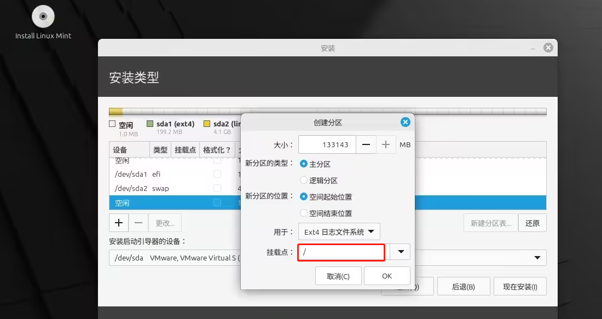
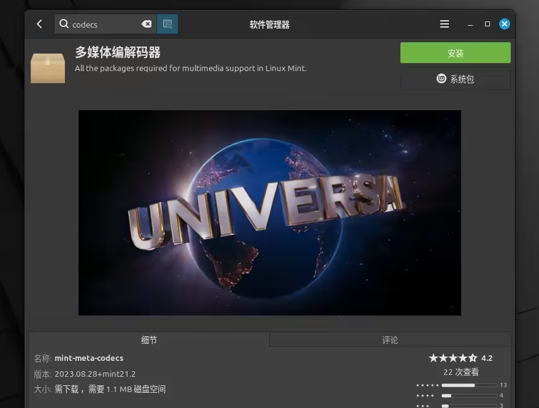
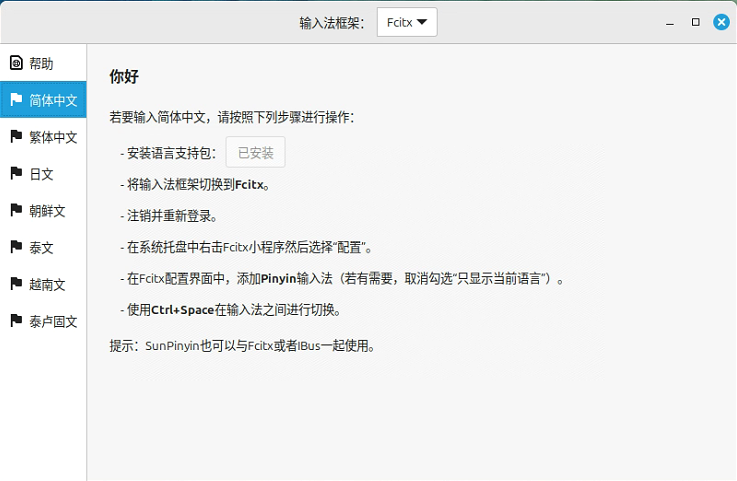

[toc]

# Linux Mint操作系统笔记

Linux Mint 是一款基于 Ubuntu 和 Debian 的知名发行版，它的用户体验非常友好，深受广大 Linux 爱好者和日常用户的青睐，特别适合那些从 Windows「转投」过来的 Linux 新手。

目前最新的Linux Mint 系统版本为22.1

[Linux Mint 官网 https://www.linuxmint.com/](https://www.linuxmint.com/)

Linux Mint 官网截图


> Linux Mint 之所以能在众多 Linux 发行版中火爆出圈，离不开它一系列核心功能和优势。以下是一些让 Mint 备受用户喜爱的独特亮点：
1. Cinnamon 桌面：界面简单易用，优雅可靠。
2. 稳定性：基于 Ubuntu LTS 的可靠保障。
3. 免驱兼容：内置多数硬件驱动，即装即用。
4. 丰富生态：通过软件中心可快速安装开发工具、办公套件等。

> Linux Mint 有三个桌面环境。
- Cinnamon 桌面环境。该桌面环境界面现代、功能丰富，适合大多数用户；
- Xfce 桌面环境，轻量高效，适合老旧设备；
- MATE 桌面环境则介于两者之间，兼顾性能和美观。


## Linux Mint 安装

> Linux Mint 22 硬件要求
- 内存：至少需要 2GB，但建议 4GB 或更大，运行更流畅。
- 处理器：双核处理器起步，性能足够应对日常使用。
- 磁盘空间：最低需要 20GB 可用空间，但建议预留 100GB 或以上，方便后续安装软件和存储文件。
- 显示器：分辨率至少 1024×768，确保显示效果清晰。
- 互联网连接：安装过程推荐连网，以便获取最新更新和驱动。
- U 盘：准备一个 4GB 或更大容量的 U 盘，用于制作启动盘。

### 第一步：下载 Linux Mint 22.1 安装镜像

推荐下载 Linux Mint Cinnamon桌面环境的版本。将`.iso`文件保存到本地，接下来制作 Linux Mint 的启动 U 盘。

### 第二步：制作 Linux Mint 启动 U 盘

在网上下载Linux启动U盘的工具软件，进行制作。自行百度查询。

### 第三步：安装 Linux Mint


> 第一步：先插入 Linux Mint 启动 U 盘并开机，进入 BIOS/UEFI 设置界面，然后选择 U 盘引导。

> 第二步：系统启动后，在 Grub 菜单中选择「Start Linux Mint」并按回车。


> 第三步：桌面加载成功后，双击「Install Linux Mint」启动安装向导。


> 第四步：进入到系统安装界面。选中语言，键盘布局，时区什么的。

> 第五步： 选择系统的安装类型

1. 若要全新安装，请选择「清除整个磁盘并安装 Linux Mint」，再点击「现在安装」。
2. 若有特殊需求，选中高级特性，手动配置磁盘分区等。


> 第六步： 创建磁盘分区

在linux中如果有多个硬盘的话，linux一般会将多个硬盘识别为 /dev/sda,/dev/sab.....


1. 先选择设备列表中的磁盘，例如dev/sda。如果硬盘中已经存在分区，可以先删除后，在重新在硬盘中建立新的分区。


2. 创建 EFI 系统分区：这是 UEFI 系统的必选分区。 它将保存由 UEFI 固件启动的 EFI 引导加载程序和驱动程序。

创建一个新的分区，设置 EFI 分区的属性：
- 大小：100 ~ 500 MB
- 新分区类型：主分区
- 新分区位置：空间起始位置
- 用于：EFI 系统分区


3. 创建 SWAP 交换空间 分区：这个分区相当于虚拟内存。当实际内存即将用完的时候，会启用虚拟内存。平时不启用。

创建一个新的分区，设置 SWAP 交换空间 分区的属性：
- 大小：推荐与内存大小相同。
- 新分区类型：主分区
- 新分区位置：空间起始位置
- 用于：交换空间


4. 创建 保留 BIOS 启动区域 分区：这个分区用于存储BIOS程序代码。当主板的BIOS损坏的时候，用这个可以代替。

创建一个新的分区，设置 保留 BIOS 启动区域 分区的属性：
- 大小：1 MB
- 新分区类型：主分区
- 新分区位置：空间起始位置
- 用于：保留 BIOS 启动区域


5. 创建 根分区: 根分区就是根目录所在的磁盘位置。

创建一个新的分区，设置根分区的属性：
- 大小：剩余的所有空闲空间
- 新分区类型：主分区
- 新分区位置：空间起始位置
- 用于：Ext4 日志文件系统
- 挂载点：`/`



6. 创建好所有分区后，点击现在安装。


> 第七步： 选择当前时区，创建用户账户

> 第八步： 完成Linux Mint 安装之后,重启系统即可。


> 第九步： 重启完成后，就可以登录到 Linux Mint 桌面了。


## Linux Mint 使用

刚装好 Linux Mint，需要对系统进行一些修改，方便更好的使用Linux Mint系统。

### 更换国内软件源

Linux Mint 默认的软件源可能与你远隔重洋，下载速度自然也就慢吞吞的。为了加速下载，我们可以手动切换到国内源。

打开 系统管理 >更新管理器> 软件源。将「主要」和「基础」镜像更改为国内软件源。然后点击右下角的「更新 APT 缓存」并等待更新完成。


### 更新软件包

换好国内软件源后，可以开始更新软件包了。打开「终端」，输入以下 2 条命令，将系统中的所有软件包升级到最新版本。

```sh
sudo apt update   # 更新软件包索引
sudo apt upgrade  # 升级所有软件包
```

### 检查并安装驱动程序

Linux Mint 自带的「驱动管理器」可以自动检测电脑中的硬件，比如显卡、打印机、Wi-Fi 网卡等，并推荐最合适的驱动程序。

打开驱动管理器后，系统会自动扫描硬件，并列出推荐的驱动程序。如果有需要安装的驱动，直接勾选即可。点击 应用更改 ，然后等待驱动安装完成。


### 安装多媒体解码器

如果你在安装 Linux Mint 时跳过了这一步，也可以手动安装多媒体解码器，从而流畅播放 MP4 视频或其他多媒体文件。

打开软件管理器，在搜索栏中输入codecs，找到 多媒体编码器 ，然后点击 安装 。



### 安装中文 pingyin 输入法

选择Linux中的输入法设置，按图所示安装中文 pingyin 输入法

