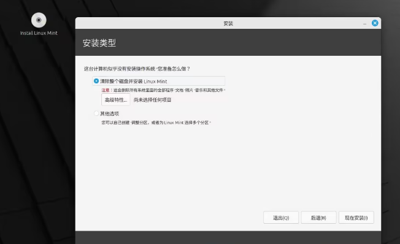
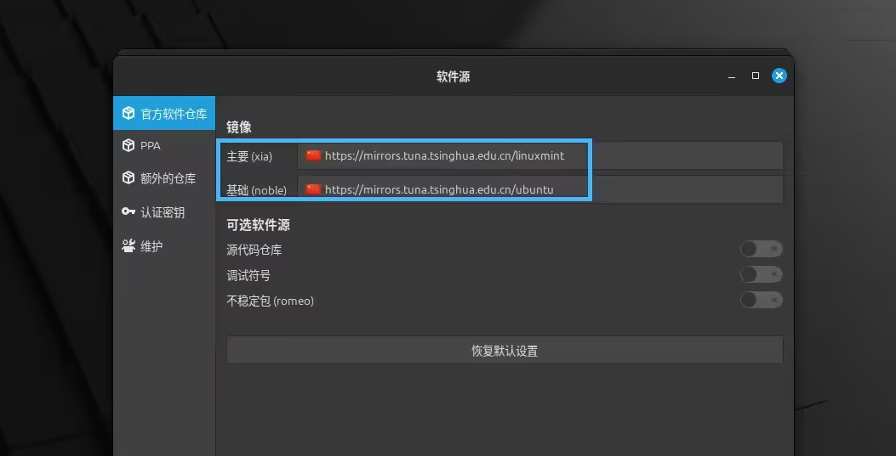

[toc]

# Linux Mint操作系统笔记

Linux Mint 是一款基于 Ubuntu 和 Debian 的知名发行版，它的用户体验非常友好，深受广大 Linux 爱好者和日常用户的青睐，特别适合那些从 Windows「转投」过来的 Linux 新手。

目前最新的Linux Mint 系统版本为22.1

[Linux Mint 官网 https://www.linuxmint.com/](https://www.linuxmint.com/)

Linux Mint 官网截图


> Linux Mint 之所以能在众多 Linux 发行版中火爆出圈，离不开它一系列核心功能和优势。以下是一些让 Mint 备受用户喜爱的独特亮点：
1. Cinnamon 桌面：界面简单易用，优雅可靠。
2. 稳定性：基于 Ubuntu LTS 的可靠保障。
3. 免驱兼容：内置多数硬件驱动，即装即用。
4. 丰富生态：通过软件中心可快速安装开发工具、办公套件等。

> Linux Mint 有三个桌面环境。
- Cinnamon 桌面环境。该桌面环境界面现代、功能丰富，适合大多数用户；
- Xfce 桌面环境，轻量高效，适合老旧设备；
- MATE 桌面环境则介于两者之间，兼顾性能和美观。


## Linux Mint 安装

> Linux Mint 22 硬件要求
- 内存：至少需要 2GB，但建议 4GB 或更大，运行更流畅。
- 处理器：双核处理器起步，性能足够应对日常使用。
- 磁盘空间：最低需要 20GB 可用空间，但建议预留 100GB 或以上，方便后续安装软件和存储文件。
- 显示器：分辨率至少 1024×768，确保显示效果清晰。
- 互联网连接：安装过程推荐连网，以便获取最新更新和驱动。
- U 盘：准备一个 4GB 或更大容量的 U 盘，用于制作启动盘。

### 第一步：下载 Linux Mint 22.1 安装镜像

推荐下载 Linux Mint Cinnamon桌面环境的版本。将`.iso`文件保存到本地，接下来制作 Linux Mint 的启动 U 盘。

### 第二步：制作 Linux Mint 启动 U 盘

在网上下载Linux启动U盘的工具软件，进行制作。自行百度查询。

### 第三步：安装 Linux Mint


> 第一步：先插入 Linux Mint 启动 U 盘并开机，进入 BIOS/UEFI 设置界面，然后选择 U 盘引导。

> 第二步：系统启动后，在 Grub 菜单中选择「Start Linux Mint」并按回车。


> 第三步：桌面加载成功后，双击「Install Linux Mint」启动安装向导。


> 第四步：进入到系统安装界面。选中语言，键盘布局，时区什么的。

> 第五步： 选择系统的安装类型

1. 若要全新安装，请选择「清除整个磁盘并安装 Linux Mint」，再点击「现在安装」。
2. 若有特殊需求，选中高级特性，手动配置磁盘分区等。



> 第六步： 创建磁盘分区

在linux中如果有多个硬盘的话，linux一般会将多个硬盘识别为 /dev/sda,/dev/sab.....

1. 先选择一个设备列表中的磁盘，作为系统盘，类似windows系统的C盘，例如dev/sda。如果硬盘中已经存在分区，可以先删除后，在重新在硬盘中建立新的分区。


2. 在系统盘上创建 EFI 系统分区：这是 UEFI 系统的必选分区。 它将保存由 UEFI 固件启动的 EFI 引导加载程序和驱动程序。

创建一个新的分区，设置 EFI 分区的属性：
- 大小：100 ~ 500 MB
- 新分区类型：主分区
- 新分区位置：空间起始位置
- 用于：EFI 系统分区


3. 在系统盘上创建 SWAP 交换空间 分区：这个分区相当于虚拟内存。当实际内存即将用完的时候，会启用虚拟内存。平时不启用。

创建一个新的分区，设置 SWAP 交换空间 分区的属性：
- 大小：推荐与内存大小相同。
- 新分区类型：主分区
- 新分区位置：空间起始位置
- 用于：交换空间


4. 在系统盘上创建创建 BIOS 启动区域 分区：这个分区用于存储BIOS程序代码。当主板的BIOS损坏的时候，用这个可以代替。

创建一个新的分区，设置 保留 BIOS 启动区域 分区的属性：
- 大小：1 MB
- 新分区类型：主分区
- 新分区位置：空间起始位置
- 用于：保留 BIOS 启动区域


5. 在系统盘上创建 根分区: 根分区就是根目录所在的磁盘位置。

创建一个新的分区，设置根分区的属性：
- 大小：剩余的所有空闲空间
- 新分区类型：主分区
- 新分区位置：空间起始位置
- 用于：Ext4 日志文件系统
- 挂载点：`/`


6. 创建好所有分区后，点击现在安装。


<font color="red">PS：当我们选择一个磁盘作为系统盘之后，linux的系统文件都会在这个系统盘上。其他磁盘会以目录的形式挂载到/dev目录下。</font>


> 第七步： 选择当前时区，创建用户账户

> 第八步： 完成Linux Mint 安装之后,重启系统即可。


> 第九步： 重启完成后，就可以登录到 Linux Mint 桌面了。


## Linux Mint 使用

刚装好 Linux Mint，需要对系统进行一些修改，方便更好的使用Linux Mint系统。

### 更换国内软件源

Linux Mint 默认的软件源可能与你远隔重洋，下载速度自然也就慢吞吞的。为了加速下载，我们可以手动切换到国内源。

打开 系统管理 >更新管理器> 软件源。将「主要」和「基础」镜像更改为国内软件源。然后点击右下角的「更新 APT 缓存」并等待更新完成。



### 更新软件包

换好国内软件源后，可以开始更新软件包了。打开「终端」，输入以下 2 条命令，将系统中的所有软件包升级到最新版本。

```sh
sudo apt update   # 更新软件包索引
sudo apt upgrade  # 升级所有软件包
```

### 检查并安装驱动程序

Linux Mint 自带的「驱动管理器」可以自动检测电脑中的硬件，比如显卡、打印机、Wi-Fi 网卡等，并推荐最合适的驱动程序。

打开驱动管理器后，系统会自动扫描硬件，并列出推荐的驱动程序。如果有需要安装的驱动，直接勾选即可。点击 应用更改 ，然后等待驱动安装完成。


### 安装多媒体解码器

如果你在安装 Linux Mint 时跳过了这一步，也可以手动安装多媒体解码器，从而流畅播放 MP4 视频或其他多媒体文件。

打开软件管理器，在搜索栏中输入codecs，找到 多媒体编码器 ，然后点击 安装 。


### 安装中文 pingyin 输入法

在Linux mint 系统设置中找到输入法设置，按图所示安装中文 pingyin 输入法


### 设置桌面图标不自动排列

默认情况下，桌面的快捷方式图标是自动排列的。如果我们想要将桌面的快捷方式图标进行自由摆放的话。需要如下设置。

在桌面点击右键，选择自定义。进入到显示器布局设置。将自动排列选项关闭即可。


### 安装git 和 SmartGit客户端

Linux Mint 基于 Ubuntu，因此可以使用 apt 包管理器来安装 Git。

安装Git

```sh
# 先更新软件包列表，获取最新的软件信息
sudo apt update

# 安装git
sudo apt install git

# 查询git版本
git --version
```

安装SmartGit客户端

1. 进入到 SmartGit 官网，下载SmartGit deb安装包
2. 可以通过linux mint的图像化安装界面，直接安装。
3. 运行 SmartGit


### 安装向日葵远程控制

先进入到向日葵官网，下载向日葵的linux版本安装包

由于linux mint是基于ubuntu系统的，因此下载ubuntu系统的版本的向日葵软件包即可。可以选择图像界面版本的。


```sh
# 安装软件包
sudo dpkg -i SunloginClient_15.2.0.63064_amd64.deb

# 安装完成后，启动命令
/usr/local/sunlogin/bin/sunloginclient

# 卸载命令
sudo dpkg -r sunloginclient
```

当向日葵安装完成后，可以在系统的程序面板中找到它，将其添加到桌面即可。


> 无法安装的解决办法

情况①：若安装的过程中 缺少依赖包。执行下面命令，然后重新安装即可。

```sh
# 用于修复软件包依赖关系并自动安装缺失依赖的命令
# -f（--fix-missing） 修复依赖包
# -y（--yes） 自动确认
sudo apt-get install -f -y
```

情况②：若使用`sudo apt-get install -f -y`命令，提示有几个软件包无法下载。

```sh
# 更新软件包列表
sudo apt-get update

# 重新修复
sudo apt-get install -f -y
```

情况③：若`sudo apt-get update` 更新失败。则可能需要更换软件源，才能下载缺失的依赖包。

```sh
# 编辑文件
sudo vim /etc/apt/sources.list.d/official-package-repositories.list

# 添加下面内容
# 以 Linux Mint 21.x 为例，基于 Ubuntu 22.04
deb https://mirrors.tuna.tsinghua.edu.cn/linuxmint jammy main upstream import backport
deb http://mirrors.tuna.tsinghua.edu.cn/ubuntu jammy main restricted universe multiverse
deb http://mirrors.tuna.tsinghua.edu.cn/ubuntu jammy-updates main restricted universe multiverse
deb http://mirrors.tuna.tsinghua.edu.cn/ubuntu jammy-backports main restricted universe multiverse
deb http://mirrors.tuna.tsinghua.edu.cn/ubuntu jammy-security main restricted universe multiverse

# 更新软件源
sudo apt update
```

### 安装vim

在linux mint22 自带的软件管理器中搜索vim,下载安装即可。

### 安装微信

目前微信也推出了linux的版本。网址：`https://linux.weixin.qq.com/`

下载微信的deb软件包，使用linux mint 自带软件管理器安装即可。

### 安装网易云音乐

1. 下载 网易云音乐的linux 安装包 

下载链接：`https://d1.music.126.net/dmusic/netease-cloud-music_1.2.1_amd64_ubuntu_20190428.deb`

2. 安装

```sh
sudo dpkg -i netease-cloud-music_1.2.1_amd64_ubuntu_20190428.deb
```

3. 修改配置

当执行完安装命令之后，应用还无法打开。需要去修改配置文件才行。

```sh
## 打开文件
sudo vim /usr/bin/netease-cloud-music


## 编辑文件内容

#!/bin/sh
HERE="$(dirname "$(readlink -f "${0}")")"
export LD_LIBRARY_PATH="${HERE}"/libs
export QT_PLUGIN_PATH="${HERE}"/plugins 
export QT_QPA_PLATFORM_PLUGIN_PATH="${HERE}"/plugins/platforms
cd /lib/x86_64-linux-gnu/  ##添加这行代码
exec "${HERE}"/netease-cloud-music $@
```

4. 运行网易云音乐


### 安装 samba服务 共享文件夹

Samba 是在 Linux 和 Unix 系统上实现 SMB/CIFS 协议的一个免费软件，它可以让 Linux 系统与 Windows 系统之间进行文件和打印机共享。

```sh
sudo apt update

# 安装samba服务
sudo apt install samba

```

### 安装docker

1. 先卸载旧版本docker 或者 任何可能冲突的软件包。

```sh
# 执行以下命令卸载所有冲突的软件包
for pkg in docker.io docker-doc docker-compose docker-compose-v2 podman-docker containerd runc; do sudo apt-get remove $pkg; done
```

2. 在安装docker之前，需要先安装依赖软件包

```sh
sudo apt update
sudo apt install apt-transport-https ca-certificates curl gnupg
```

3. 添加 Docker 官方 GPG 密钥

将 Docker GPG 存储库密钥导入Mint 系统中。用于验证下载的软件包的完整性和真实性

```sh
# 添加Docker 官方 GPG 密钥（国内可能无法访问）
curl -fsSL https://download.docker.com/linux/ubuntu/gpg | sudo gpg --dearmor -o /usr/share/keyrings/docker-archive-keyring.gpg

# 添加阿里云 搭建的 docker 的 GPG 密钥
curl -fsSL http://mirrors.aliyun.com/docker-ce/linux/ubuntu/gpg | sudo gpg --dearmor -o /usr/share/keyrings/docker-archive-keyring.gpg
```


4. 添加 Docker 软件源

由于 Linux Mint 22.1 基于 Ubuntu 24.04（代号 noble），因此需要添加 Docker 的 APT 软件包源如下。

<font color="red">注意命令中的是noble stable。与ubuntu的代号有关。</font>

```sh
# 添加官方的 Docker 软件源（国内可能无法访问）
echo "deb [arch=$(dpkg --print-architecture) signed-by=/usr/share/keyrings/docker-archive-keyring.gpg] https://download.docker.com/linux/ubuntu noble stable" | sudo tee /etc/apt/sources.list.d/docker.list > /dev/null

# 添加阿里云的 Docker 软件源
echo "deb [arch=$(dpkg --print-architecture) signed-by=/usr/share/keyrings/docker-archive-keyring.gpg] http://mirrors.aliyun.com/docker-ce/linux/ubuntu noble stable" | sudo tee /etc/apt/sources.list.d/docker.list > /dev/null

# 刷新软件包列表
sudo apt update
```

5. 在 Linux Mint 22 上安装 Docker

```sh
sudo apt install docker-ce docker-ce-cli containerd.io docker-buildx-plugin docker-compose-plugin
```

该命令会按照下面的Docker组件：
- docker-ce：Docker 引擎本身。
- docker-ce-cli ：一个命令行工具，可让您与 Docker 守护程序通信。
- `containerd.io` ：管理容器生命周期的容器运行时。
- docker-buildx-plugin：Docker 的这个扩展增强了构建镜像的能力，主要集中在多平台构建上。
- docker-compose-plugin：一个配置管理插件，可帮助使用单个 YAML 文件管理多容器 Docker 应用程序。

6. 检查docker版本并设置docker 开机自启动

```sh
# docker版本查询
docker version  

# 设置开机启动
sudo systemctl is-active docker
```


#### 有时候无法下载某个国内镜像，可以修改 Docker 配置文件

使用文本编辑器打开 /etc/docker/daemon.json 文件，如果该文件不存在则创建它。

文件内容如下，下面的链接都算能够访问的。否则就进行替换。

```json
{
    "registry-mirrors": [
        "https://docker-0.unsee.tech",
        "https://docker-cf.registry.cyou",
        "https://docker.1panel.live",
        "https://hub.fast360.xyz"
    ]
}
```

然后重启docker服务，让配置生效。

```sh
sudo systemctl restart docker
```
