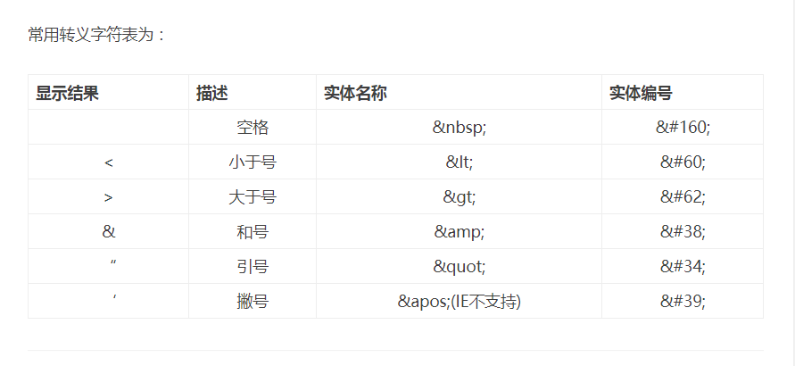

[toc]

# Markdown基础语法

## 概述：

&emsp;Markdown 是一种用来写作的轻量级「标记语言」，它用简洁的语法代替排版，而不像一般我们用的字处理软件 Word 或 Pages 有大量的排版、字体设置。它使我们专心于码字，用「标记」语法，来代替常见的排版格式。例如此文从内容到格式，甚至插图，键盘就可以通通搞定了。
**注意：**
①<font color="red">兼容 HTML</font>，不在 Markdown 涵盖范围之内的标签，都可以直接在文档里面用 HTML 撰写。不需要额外标注这是 HTML 或是 Markdown；只要直接加标签就可以了。

## 在markdown中打出标签：
常用转义字符表为：




## 标题:

```markdown
# 这是 <h1> 一级标题
## 这是 <h2> 二级标题
### 这是 <h3> 三级标题
#### 这是 <h4> 四级标题
##### 这是 <h5> 五级标题
###### 这是 <h6> 六级标题
```
## 强调:

```
*这会是 斜体 的文字*
_这会是 斜体 的文字_
**这会是 粗体 的文字**
__这会是 粗体 的文字__
_你也 **组合** 这些符号_
~~这个文字将会被横线删除~~
```

*这会是 斜体 的文字*

_这会是 斜体 的文字_

**这会是 粗体 的文字**

__这会是 粗体 的文字__

_你也 **组合** 这些符号_

~~这个文字将会被横线删除~~

## 列表

### 无序列表

```
* Item 1
* Item 2
  * Item 2a
  * Item 2b
```

* Item 1
* Item 2
  * Item 2a
  * Item 2b

### 有序列表

```markdown
1. Item 1
1. Item 2
1. Item 3
   1. Item 3a
   1. Item 3b
```
1. Item 1
1. Item 2
1. Item 3
   1. Item 3a
   1. Item 3b

## 添加图片

```markdown

Format: 
```


Format: 

## 链接

```markdown
http://github.com
[GitHub](http://github.com)
```
http://github.com

[GitHub](http://github.com)

## 引用

正如 Kanye West 所说：
```markdown
> We're living the future so
> the present is our past.
```

> We're living the future so

> the present is our past.

**多层引用**

```markdown
> 1
> 2
>> 2.1
>> 2.2
```

> 1
> 2
  >> 2.1
  >> 2.2


## 分割线

如下，三个或者更多的
```markdown
---
连字符

***
星号

___
下划线
```
---
连字符
***
星号
___
下划线

## 行内代码与代码块:

1. 行内代码：
```markdown
`student stu=new Student();`
```
`student stu=new Student();`

2. 代码块：

你可以在你的代码上面和下面添加 ```来表示代码块。


```markdown
student stu=new Student();
```

```java
student stu=new Student();
```


## 语法高亮

你可以给你的代码块添加任何一种语言的语法高亮

例如，给 java 代码添加语法高亮：

<pre>
```java
int i=0;
Student stu=new Student();
stu.add(i);
```
</pre>


会得到下面的效果：

```java
int i=0;
Student stu=new Student();
stu.add(i);
```

## 任务列表

```markdown
- [x] @mentions, #refs, [links](), **formatting**, and <del>tags</del> supported
- [x] list syntax required (any unordered or ordered list supported)
- [x] this is a complete item
- [ ] this is an incomplete item
```

- [x] @mentions, #refs, [links](), **formatting**, and <del>tags</del> supported
- [x] list syntax required (any unordered or ordered list supported)
- [x] this is a complete item
- [ ] this is an incomplete item

## 表格

```markdown
First Header | Second Header
------------ | -------------
Content from cell 1 | Content from cell 2
Content in the first column | Content in the 
```

First Header | Second Header
------------ | -------------
Content from cell 1 | Content from cell 2
Content in the first column | Content in the 

## 标记

```markdown
==marked==
```
==marked==

## 脚注

```markdown
Content [^1]
[^1]: Hi! This is a footnote
```
Content [^1]
[^1]: Hi! This is a footnote