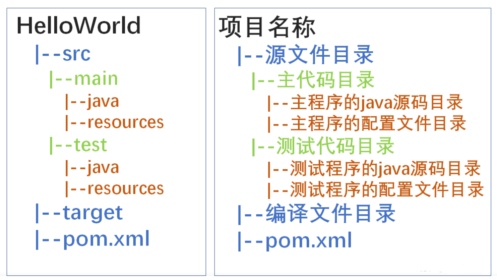
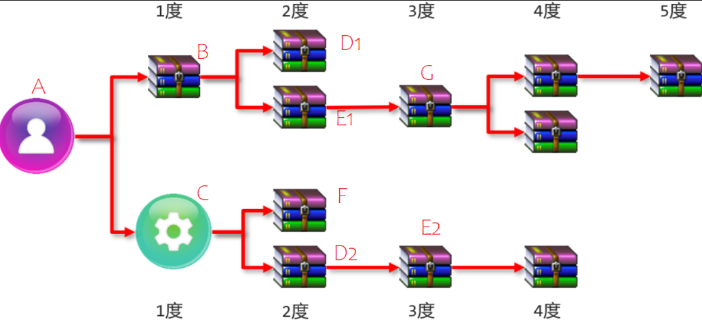
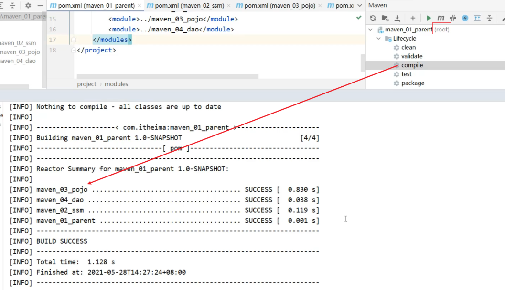
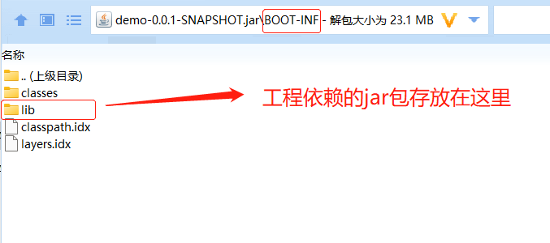

[toc]

## maven笔记

当前maven最新的版本为3.8.6

### 1.maven介绍

Maven是一个项目管理工具。可以对Java项目进行构建、管理jar包，编译代码，自动运行单元测试，打包，甚至帮你部署项目。

Maven的四大特点：
* 依赖管理
* 多模块构建
* 一致的项目结构
* 一致的构建模型和插件机制

> 依赖管理

Maven引入了一个新的依赖管理系统。在maven配置文件中可以用gropId、artifactId、version组成Coordination(坐标),每个坐标表示为一个依赖。当需要更换依赖包时，只需修改配置文件即可。

```xml
<dependency>
    <groupId>com.xxx</groupId>
    <artifactId>xxx</artifactId>
    <version>x.x.x</version>
</dependency>

groupId：公司名称
artifactId：项目名称
version：版本号
```

<font color="red">任何一个maven项目自身也必须有这三个属性。依赖管理的好处是能够大大减少我们对jar包下载和管理的难度。</font>


> 多模块构建

针对多模块的项目，maven可以针对模块进行管理。

> 一致的项目结构

maven项目的目录结构在不同的编辑器中是一致的。

### 2 maven的安装

```
1、从官网中下载对应的版本
2、解压安装，然后配置环境变量，需要配置MAVEN_HOME或M2_HOME,并且将bin目录添加到path路径下。
3、在命令行中输入mvn -v,看到版本信息表示安装成功
```

<font color="red">

* 注意电脑环境变量是否配置了JAVA_HOME,否则maven项目容易报错。
* 在Maven1.x版本时，使用MAVEN_HOME，在Maven2.x及更高版本，使用M2_HOME。

</font>

### 3. maven项目的目录结构



<font color="red">pom.xml是maven项目的核心配置文件,包含了项目的基本信息，用于描述项目如何构建，声明项目依赖等等。</font>

#### pom.xml

```xml
<project xmlns="http://maven.apache.org/POM/4.0.0" xmlns:xsi="http://www.w3.org/2001/XMLSchema-instance"
    xsi:schemaLocation="http://maven.apache.org/POM/4.0.0http://maven.apache.org/maven-v4_0_0.xsd">
    <!--父项目的坐标。
    如果项目中没有规定某个元素的值，那么父项目中的对应值即为项目的默认值。 
    坐标包括group ID，artifact ID和version。 -->
    <parent>
        <!--被继承的父项目的构件标识符 -->
        <artifactId />
        <!--被继承的父项目的全球唯一标识符 -->
        <groupId />
        <!--被继承的父项目的版本号 -->
        <version />
        <!--描述父项目的pom.xml文件相对于子项目的pom.xml文件的位置。默认值是../pom.xml。
        Maven首先在当前项目的地方寻找父项目的pom，其次在relativePath位置，
        然后在本地仓库，最后在远程仓库寻找父项目的pom。 
        -->
        <relativePath>../ParentProject/pom.xml</relativePath>  
    </parent>

    <!--声明项目描述符遵循哪一个POM模型版本。默认 -->
    <modelVersion>4.0.0</modelVersion>

    <!--当前项目的全球唯一标识符，通常使用公司或者组织的唯一标志-->
    <groupId>com.xxxx</groupId>
    <!--当前项目构件标识符，不能有两个不同的项目拥有同样的artifact ID和groupID-->
    <artifactId>aaa-project</artifactId>
    <!--当前项目版本-->
    <version>1.0-SNAPSHOT</version>
    <!--当前项目打包类型，例如jar、war、ear、pom。-->
    <packaging>jar</packaging>
    
    <!--当前项目的名称, Maven产生的文档用 可选 -->
    <name>banseon-maven</name>
    <!--当前项目主页的URL, Maven产生的文档用 可选-->
    <url>http://www.baidu.com/banseon</url>
    <!--当前项目的详细描述, Maven 产生的文档用。可选-->
    <description>A maven project to study maven.</description>
   
    <!--模块（有时称作子项目） 被构建成项目的一部分。列出的每个子模块是指向父模块的相对路径
        若当前项目是父项目，则父项目的packing打包类型必须设置为pom -->
    <modules>
        <module>child1-project</module>
        <module>child2-project</module>
    </modules>

    <!--properties定义全局常量。 这些常量可以用在pom文件其他元素标签上
        使用方式：${file.encoding}
    -->
    <properties>
        <file.encoding>UTF-8</file_encoding>
        <java.source.version>1.5</java_source_version>
        <java.target.version>1.5</java_target_version>
    </properties>

    <!--描述当前项目相关的所有依赖 -->
    <dependencies>
        <!--一个依赖就有一个dependency标签-->
        <dependency>
            <!--依赖的group ID -->
            <groupId>org.apache.maven</groupId>
            <!--依赖的artifact ID -->
            <artifactId>maven-artifact</artifactId>
            <!--依赖的版本号。-->
            <version>3.8.1</version>
            <!--依赖类型，默认类型是jar。它通常表示依赖的文件的扩展名。可选-->
            <type>jar</type>
            <!--依赖范围。在项目发布过程中，帮助决定哪些构件被包括进来。
                - compile ：默认范围，用于编译 
                - provided：类似于编译，但支持你期待jdk或者容器提供，类似于classpath 
                - runtime: 在执行时需要使用 
                - test: 用于test任务时使用 
                - system: 需要外在提供相应的元素。通过systemPath来取得 
                - systemPath: 仅用于范围为system。提供相应的路径 
                - optional: 当项目自身被依赖时，标注依赖是否传递。用于连续依赖时使用 -->
            <scope>test</scope>
            <!--如果X需要依赖A,A包含B依赖，那么X可以声明不要B依赖，只要在exclusions中声明将B从依赖树中删除.-->
            <exclusions>
                <exclusion>
                    <artifactId>spring-core</artifactId>
                    <groupId>org.springframework</groupId>
                </exclusion>
            </exclusions>
            <!--可选依赖，如果你在项目B中把C依赖声明为可选，你就需要在依赖于B的子项目中显式的引用对C的依赖。可选依赖阻断依赖的传递性。 -->
            <optional>true</optional>
        </dependency>
    </dependencies>

    <!-- 可选依赖，当前项目的子项目不会主动继承可选依赖，需要子项目主动显示添加可选依赖，注意不要填写版本号。-->
    <dependencyManagement>
        <dependencies>
            <!--参见dependencies/dependency元素 -->
            <dependency>
                ......
            </dependency>
        </dependencies>
    </dependencyManagement>


    <!--构建项目需要的信息 -->
    <build>
        <!--该元素设置了项目源码目录，当构建项目的时候，构建系统会编译目录里的源码。该路径是相对于pom.xml的相对路径。 -->
        <sourceDirectory />
        <!--该元素设置了项目脚本源码目录，该目录和源码目录不同：绝大多数情况下，该目录下的内容 会被拷贝到输出目录(因为脚本是被解释的，而不是被编译的)。 -->
        <scriptSourceDirectory />
        <!--该元素设置了项目单元测试使用的源码目录，当测试项目的时候，构建系统会编译目录里的源码。该路径是相对于pom.xml的相对路径。 -->
        <testSourceDirectory />
        <!--被编译过的应用程序class文件存放的目录。 -->
        <outputDirectory />
        <!--被编译过的测试class文件存放的目录。 -->
        <testOutputDirectory />
        <!--使用来自该项目的一系列构建扩展 -->
        <extensions>
            <!--描述使用到的构建扩展。 -->
            <extension>
                <!--构建扩展的groupId -->
                <groupId />
                <!--构建扩展的artifactId -->
                <artifactId />
                <!--构建扩展的版本 -->
                <version />
            </extension>
        </extensions>
        <!--当项目没有规定目标（Maven2 叫做阶段）时的默认值 -->
        <defaultGoal />
        <!--这个元素描述了项目相关的所有资源路径列表，例如和项目相关的属性文件，这些资源被包含在最终的打包文件里。 -->
        <resources>
            <!--这个元素描述了项目相关或测试相关的所有资源路径 -->
            <resource>
                <!-- 描述了资源的目标路径。该路径相对target/classes目录（例如${project.build.outputDirectory}）。举个例 
                    子，如果你想资源在特定的包里(org.apache.maven.messages)，你就必须该元素设置为org/apache/maven /messages。然而，如果你只是想把资源放到源码目录结构里，就不需要该配置。 -->
                <targetPath />
                <!--是否使用参数值代替参数名。参数值取自properties元素或者文件里配置的属性，文件在filters元素里列出。 -->
                <filtering />
                <!--描述存放资源的目录，该路径相对POM路径 -->
                <directory />
                <!--包含的模式列表，例如**/*.xml. -->
                <includes />
                <!--排除的模式列表，例如**/*.xml -->
                <excludes />
            </resource>
        </resources>
        <!--这个元素描述了单元测试相关的所有资源路径，例如和单元测试相关的属性文件。 -->
        <testResources>
            <!--这个元素描述了测试相关的所有资源路径，参见build/resources/resource元素的说明 -->
            <testResource>
                <targetPath />
                <filtering />
                <directory />
                <includes />
                <excludes />
            </testResource>
        </testResources>
        <!--构建产生的所有文件存放的目录 -->
        <directory />
        <!--产生的构件的文件名，默认值是${artifactId}-${version}。 -->
        <finalName />
        <!--当filtering开关打开时，使用到的过滤器属性文件列表 -->
        <filters />
        <!--子项目可以引用的默认插件信息。该插件配置项直到被引用时才会被解析或绑定到生命周期。给定插件的任何本地配置都会覆盖这里的配置 -->
        <pluginManagement>
            <!--使用的插件列表 。 -->
            <plugins>
                <!--plugin元素包含描述插件所需要的信息。 -->
                <plugin>
                    <!--插件在仓库里的group ID -->
                    <groupId />
                    <!--插件在仓库里的artifact ID -->
                    <artifactId />
                    <!--被使用的插件的版本（或版本范围） -->
                    <version />
                    <!--是否从该插件下载Maven扩展（例如打包和类型处理器），由于性能原因，只有在真需要下载时，该元素才被设置成enabled。 -->
                    <extensions />
                    <!--在构建生命周期中执行一组目标的配置。每个目标可能有不同的配置。 -->
                    <executions>
                        <!--execution元素包含了插件执行需要的信息 -->
                        <execution>
                            <!--执行目标的标识符，用于标识构建过程中的目标，或者匹配继承过程中需要合并的执行目标 -->
                            <id />
                            <!--绑定了目标的构建生命周期阶段，如果省略，目标会被绑定到源数据里配置的默认阶段 -->
                            <phase />
                            <!--配置的执行目标 -->
                            <goals />
                            <!--配置是否被传播到子POM -->
                            <inherited />
                            <!--作为DOM对象的配置 -->
                            <configuration />
                        </execution>
                    </executions>
                    <!--项目引入插件所需要的额外依赖 -->
                    <dependencies>
                        <!--参见dependencies/dependency元素 -->
                        <dependency>
                            ......
                        </dependency>
                    </dependencies>
                    <!--任何配置是否被传播到子项目 -->
                    <inherited />
                    <!--作为DOM对象的配置 -->
                    <configuration />
                </plugin>
            </plugins>
        </pluginManagement>
        <!--使用的插件列表 -->
        <plugins>
            <!--参见build/pluginManagement/plugins/plugin元素 -->
            <plugin>
                <groupId />
                <artifactId />
                <version />
                <extensions />
                <executions>
                    <execution>
                        <id />
                        <phase />
                        <goals />
                        <inherited />
                        <configuration />
                    </execution>
                </executions>
                <dependencies>
                    <!--参见dependencies/dependency元素 -->
                    <dependency>
                        ......
                    </dependency>
                </dependencies>
                <goals />
                <inherited />
                <configuration />
            </plugin>
        </plugins>
    </build>
    <!--在列的项目构建profile，如果被激活，会修改构建处理 -->
    <profiles>
        <!--根据环境参数或命令行参数激活某个构建处理 -->
        <profile>
            <!--构建配置的唯一标识符。即用于命令行激活，也用于在继承时合并具有相同标识符的profile。 -->
            <id />
            <!--自动触发profile的条件逻辑。Activation是profile的开启钥匙。profile的力量来自于它 能够在某些特定的环境中自动使用某些特定的值；这些环境通过activation元素指定。activation元素并不是激活profile的唯一方式。 -->
            <activation>
                <!--profile默认是否激活的标志 -->
                <activeByDefault />
                <!--当匹配的jdk被检测到，profile被激活。例如，1.4激活JDK1.4，1.4.0_2，而!1.4激活所有版本不是以1.4开头的JDK。 -->
                <jdk />
                <!--当匹配的操作系统属性被检测到，profile被激活。os元素可以定义一些操作系统相关的属性。 -->
                <os>
                    <!--激活profile的操作系统的名字 -->
                    <name>Windows XP</name>
                    <!--激活profile的操作系统所属家族(如 'windows') -->
                    <family>Windows</family>
                    <!--激活profile的操作系统体系结构 -->
                    <arch>x86</arch>
                    <!--激活profile的操作系统版本 -->
                    <version>5.1.2600</version>
                </os>
                <!--如果Maven检测到某一个属性（其值可以在POM中通过${名称}引用），其拥有对应的名称和值，Profile就会被激活。如果值 字段是空的，那么存在属性名称字段就会激活profile，否则按区分大小写方式匹配属性值字段 -->
                <property>
                    <!--激活profile的属性的名称 -->
                    <name>mavenVersion</name>
                    <!--激活profile的属性的值 -->
                    <value>2.0.3</value>
                </property>
                <!--提供一个文件名，通过检测该文件的存在或不存在来激活profile。missing检查文件是否存在，如果不存在则激活 profile。另一方面，exists则会检查文件是否存在，如果存在则激活profile。 -->
                <file>
                    <!--如果指定的文件存在，则激活profile。 -->
                    <exists>/usr/local/hudson/hudson-home/jobs/maven-guide-zh-to-production/workspace/
                    </exists>
                    <!--如果指定的文件不存在，则激活profile。 -->
                    <missing>/usr/local/hudson/hudson-home/jobs/maven-guide-zh-to-production/workspace/
                    </missing>
                </file>
            </activation>
            <!--构建项目所需要的信息。参见build元素 -->
            <build>
                <defaultGoal />
                <resources>
                    <resource>
                        <targetPath />
                        <filtering />
                        <directory />
                        <includes />
                        <excludes />
                    </resource>
                </resources>
                <testResources>
                    <testResource>
                        <targetPath />
                        <filtering />
                        <directory />
                        <includes />
                        <excludes />
                    </testResource>
                </testResources>
                <directory />
                <finalName />
                <filters />
                <pluginManagement>
                    <plugins>
                        <!--参见build/pluginManagement/plugins/plugin元素 -->
                        <plugin>
                            <groupId />
                            <artifactId />
                            <version />
                            <extensions />
                            <executions>
                                <execution>
                                    <id />
                                    <phase />
                                    <goals />
                                    <inherited />
                                    <configuration />
                                </execution>
                            </executions>
                            <dependencies>
                                <!--参见dependencies/dependency元素 -->
                                <dependency>
                                    ......
                                </dependency>
                            </dependencies>
                            <goals />
                            <inherited />
                            <configuration />
                        </plugin>
                    </plugins>
                </pluginManagement>
                <plugins>
                    <!--参见build/pluginManagement/plugins/plugin元素 -->
                    <plugin>
                        <groupId />
                        <artifactId />
                        <version />
                        <extensions />
                        <executions>
                            <execution>
                                <id />
                                <phase />
                                <goals />
                                <inherited />
                                <configuration />
                            </execution>
                        </executions>
                        <dependencies>
                            <!--参见dependencies/dependency元素 -->
                            <dependency>
                                ......
                            </dependency>
                        </dependencies>
                        <goals />
                        <inherited />
                        <configuration />
                    </plugin>
                </plugins>
            </build>
            <!--模块（有时称作子项目） 被构建成项目的一部分。列出的每个模块元素是指向该模块的目录的相对路径 -->
            <modules />
            <!--发现依赖和扩展的远程仓库列表。 -->
            <repositories>
                <!--参见repositories/repository元素 -->
                <repository>
                    <releases>
                        <enabled />
                        <updatePolicy />
                        <checksumPolicy />
                    </releases>
                    <snapshots>
                        <enabled />
                        <updatePolicy />
                        <checksumPolicy />
                    </snapshots>
                    <id />
                    <name />
                    <url />
                    <layout />
                </repository>
            </repositories>
            <!--发现插件的远程仓库列表，这些插件用于构建和报表 -->
            <pluginRepositories>
                <!--包含需要连接到远程插件仓库的信息.参见repositories/repository元素 -->
                <pluginRepository>
                    <releases>
                        <enabled />
                        <updatePolicy />
                        <checksumPolicy />
                    </releases>
                    <snapshots>
                        <enabled />
                        <updatePolicy />
                        <checksumPolicy />
                    </snapshots>
                    <id />
                    <name />
                    <url />
                    <layout />
                </pluginRepository>
            </pluginRepositories>
            <!--该元素描述了项目相关的所有依赖。 这些依赖组成了项目构建过程中的一个个环节。它们自动从项目定义的仓库中下载。要获取更多信息，请看项目依赖机制。 -->
            <dependencies>
                <!--参见dependencies/dependency元素 -->
                <dependency>
                    ......
                </dependency>
            </dependencies>
            <!--不赞成使用. 现在Maven忽略该元素. -->
            <reports />
            <!--该元素包括使用报表插件产生报表的规范。当用户执行"mvn site"，这些报表就会运行。 在页面导航栏能看到所有报表的链接。参见reporting元素 -->
            <reporting>
                ......
            </reporting>
            <!--参见dependencyManagement元素 -->
            <dependencyManagement>
                <dependencies>
                    <!--参见dependencies/dependency元素 -->
                    <dependency>
                        ......
                    </dependency>
                </dependencies>
            </dependencyManagement>
            <!--参见distributionManagement元素 -->
            <distributionManagement>
                ......
            </distributionManagement>
            <!--参见properties元素 -->
            <properties />
        </profile>
    </profiles>
</project>
```

### 4. maven依赖管理

* 依赖指当前项目运行所需的jar包，一个项目可以设置多个依赖。

#### 1 依赖格式
```xml
<!--设置当前项目所依赖的所有jar-->
<dependencies>
    <!--设置具体的依赖-->
    <dependency>
        <!--依赖所属群组id-->
        <groupId>org.springframework</groupId>
        <!--依赖所属项目id-->
        <artifactId>spring-webmvc</artifactId>
        <!--依赖版本号-->
        <version>5.2.10.RELEASE</version>
    </dependency>
</dependencies>
```

#### 2 依赖具有传递性



**说明:** 
A代表自己的项目；B,C,D,E,F,G代表的是项目所依赖的jar包；D1和D2 E1和E2代表是相同jar包的不同版本。

(1)A依赖了B和C,B和C有分别依赖了其他jar包，所以在A项目中就可以使用上面所有jar包，这就是所说的依赖传递。

(2)依赖传递有直接依赖和间接依赖

* 相对于A来说，A直接依赖B和C,间接依赖了D1,E1,G，F,D2和E2
* 相对于B来说，B直接依赖了D1和E1,间接依赖了G

(3)依赖冲突是指项目依赖的某一个jar包，有多个不同的版本，因而造成类包版本冲突。有3种情况:

* 特殊优先：若配置了相同jar包的不同版本，pom文件中后配置的会覆盖先配置的。
* 路径优先：当依赖传递中有相同的jar包时，层级越深，优先级越低，层级越浅，优先级越高。
    * A通过B间接依赖到E1
    * A通过C间接依赖到E2
    * A就会间接依赖到E1和E2,Maven会按照层级来选择，E1是2度，E2是3度，所以最终会选择E1
* 声明优先：当资源在相同层级被依赖时，配置顺序靠前的覆盖配置顺序靠后的。
    * A通过B间接依赖到D1
    * A通过C间接依赖到D2
    * D1和D2都是两度，这个时候就不能按照层级来选择，需要按照声明来，谁先声明用谁，也就是说B在C之前声明，这个时候使用的是D1，反之则为D2


#### 3 可选依赖`<optional>`和排除依赖`<exclusions>`

> 可选依赖：指对外隐藏当前所依赖的资源

案例：

依赖传递模型：A->B->C

在项目B的pom文件中，设置C的依赖为可选依赖。此时C依赖不在具有传递性。
```xml
<dependency>
    <groupId>com.example</groupId>
    <artifactId>C</artifactId>
    <version>1.0-SNAPSHOT</version>
    <!--可选依赖是隐藏当前工程所依赖的资源，隐藏后对应资源将不具有依赖传递-->
    <optional>true</optional>
</dependency>
```

* 由于在B项目pom文件中将C依赖设置成可选依赖，导致A项目无法引用到C依赖内容。B项目仍然可以使用C依赖内容。

> 排除依赖：指主动断开依赖的资源，被排除的资源无需指定版本

例如：排除maven_04_dao依赖中的maven_03_pojo依赖，log4j依赖。
```xml
<dependency>
    <groupId>com.itheima</groupId>
    <artifactId>maven_04_dao</artifactId>
    <version>1.0-SNAPSHOT</version>
    <!--排除依赖是隐藏当前资源对应的依赖关系-->
    <exclusions>
        <exclusion>
            <groupId>com.itheima</groupId>
            <artifactId>maven_03_pojo</artifactId>
        </exclusion>
        <exclusion>
            <groupId>log4j</groupId>
            <artifactId>log4j</artifactId>
        </exclusion>
    </exclusions>
</dependency>
```

> 小结

依赖传递模型：A->B->C

* A依赖B,B依赖C,C通过依赖传递会被A使用到，现在要想办法让A不去依赖C
    * 可选依赖是在B上设置`<optional>`,A不知道有C的存在，
    * 排除依赖是在A上设置`<exclusions>`,A知道有C的存在，主动将其排除掉。


#### 4. `<properties>`属性标签

```xml
<properties>
    <spring.version>5.2.10.RELEASE</spring.version>
</properties>
<dependency>
    <groupId>org.springframework</groupId>
    <artifactId>spring-core</artifactId>
    <version>${spring.version}</version>
</dependency>
```

properties标签用于定义属性。依赖中可用${xxx}使用这个属性标签代替版本号。


### 5. maven仓库

maven仓库能帮助我们管理jar包的地方。

maven仓库有三种，
* 本地仓库
* 中央仓库：maven官方社区提供的仓库，其中包含了大量常用的库。需要通过网络访问。
* 远程仓库：开发人员自己定制的maven仓库


maven寻找依赖的顺序：本地仓库-》中央仓库-》远程仓库。通常maven会把找到的依赖下载到本地仓库中。

#### 修改本地仓库地址
修改settings.xml 文件

```xml
<localRepository>C:/MyLocalRepository</localRepository>
```


#### 修改中央仓库地址，改为阿里云的仓库
修改settings.xml文件，在mirrors节点上，添加内容如下：

```xml
<mirror>
  <id>aliyunmaven</id>
  <mirrorOf>*</mirrorOf>
  <name>阿里云公共仓库</name>
  <url>https://maven.aliyun.com/repository/public</url>
</mirror>
```

#### 修改远程仓库地址
修改settings.xml文件，在repositories节点上，添加内容如下：

```xml
<repositories>
    <repository>
        <id>companyname.lib1</id>
        <url>http://xxx/maven2/lib1</url>
    </repository>
    <repository>
        <id>companyname.lib2</id>
        <url>http://xxx/maven2/lib2</url>
    </repository>
</repositories>
```


### 6.maven命令

运行maven命令时，先定位为到maven项目的根目录中（即pom文件所在目录）。否则就需要添加目录参数来运行命令。

命令 | 描述
------------ | -------------
mvn –version |	显示版本信息
mvn clean	 |	清理项目生产的临时文件,一般是模块下的target目录
mvn compile	 |	编译源代码，作用是将src/main/java下的文件编译为class文件输出到target目录下。
mvn package	 |	package是maven工程的打包命令，对于java工程执行package打成jar包，对于web工程打成war包。
mvn test	 |	测试命令,或执行src/test/java/下junit的测试用例.
mvn install	 |	将打包的jar/war文件复制到你的本地仓库中,供其他模块使用
mvn deploy	 |	将打包的文件发布到远程仓库,提供其他人员进行下载依赖
mvn site	 |	生成项目相关信息的网站
mvn tomcat:run | 在tomcat容器中运行web应用

### 7.maven中的继承

继承是指父子两个项目间的关系，与java中的继承相似，子项目可以继承父项目中的配置信息。当项目中有多个子模块的时候，继承可以用于简化配置，减少版本冲突的问题。

继承的优点：
* 简化重复配置，可把公共依赖配置在父项目中。并且当父项目中所依赖的jar包版本发生变化，所有子项目中对应的jar包版本也会跟着更新。
* 减少版本冲突。

#### 1.如何继承

> 1. 假设一个空的父项目projectA，其pom.xml如下

```xml
<project xmlns="http://maven.apache.org/POM/4.0.0" xmlns:xsi="http://www.w3.org/2001/XMLSchema-instance"  
  xsi:schemaLocation="http://maven.apache.org/POM/4.0.0 http://maven.apache.org/maven-v4_0_0.xsd">  
  <modelVersion>4.0.0</modelVersion>  
  <groupId>com.tiantian.mavenTest</groupId>  
  <artifactId>projectA</artifactId>  
  <packaging>jar</packaging>  
  <version>1.0-SNAPSHOT</version>  
</project>
```

> 2. 假设有一个子项目projectB

```xml
<project xmlns="http://maven.apache.org/POM/4.0.0" xmlns:xsi="http://www.w3.org/2001/XMLSchema-instance"  
  xsi:schemaLocation="http://maven.apache.org/POM/4.0.0 http://maven.apache.org/maven-v4_0_0.xsd">  
  <parent>  
    <groupId>com.tiantian.mavenTest</groupId>  
    <artifactId>projectA</artifactId>  
    <version>1.0-SNAPSHOT</version>
    <!--父项目pom文件的位置，默认值为../pom.xml-->
    <relativePath>../projectA/pom.xml</relativePath>
  </parent>  
  <modelVersion>4.0.0</modelVersion>  
  <groupId>com.tiantian.mavenTest</groupId>  
  <artifactId>projectB</artifactId>  
  <packaging>jar</packaging>  
  <version>1.0-SNAPSHOT</version>  
</project>
```

* `<parent>`标签，用于标注父工程的信息。
* `<relativePath>`标签，用于描述父pom文件的绝对路径。

```
<relativePath>../projectA/pom.xml</relativePath>
relativePath描述父项目pom文件的位置，默认值为../pom.xml
若子项目和父项目的pom.xml文件是在同一目录下，则可不写relativePath标签。
```

> 3. 此时可以把子项目共同使用的依赖jar包都抽取出来，维护在父项目的pom.xml中

#### 2. 优化继承的问题

如果把所有用到的jar包都管理在父项目的pom.xml，看上去更简单些，但是这样就会导致有很多子项目继承了过多自己不需要的jar包。

解决方法：在父项目pom中设置dependencyManagement标签

①：在父项目中定义dependencyManagement依赖管理标签。
```xml
<!--在父项目中定义dependencyManagement-->
<dependencyManagement>
    <dependencies>
        <dependency>
            <groupId>junit</groupId>
            <artifactId>junit</artifactId>
            <version>4.12</version>
        </dependency>
    </dependencies>
</dependencyManagement>
```
②：子项目中主动添加dependencyManagement中的依赖
```xml
<dependency>
    <groupId>junit</groupId>
    <artifactId>junit</artifactId>
</dependency>
```

<font color="red">

总结：
1. dependencyManagement的依赖不会主动继承到子项目中。需要让子项目选择的。
2. 当子项目主动添加该依赖时，才会继承到子项目中。注意：这里就不需要添加版本号了，好处就是当父工程dependencyManagement标签中的依赖版本发生变化后，子项目中的依赖版本也会跟着发生变化。
3. 若添加了版本号，则这个依赖就不在是从父项目中继承的了。

</font>

#### 3. 继承总结

1. 将所有项目公共的jar包依赖提取到父工程的pom.xml中，子项目就可以不用重复编写，简化开发。
2. 对于子项目各自使用的依赖，可以将其加入到父项目中的dependencyManagement标签下，然后子项目主动继承其中的依赖。


### 8.maven中的聚合

* 聚合就是将多个模块组织成一个聚合父工程，主要是通过一个父项目来管理其余子模块项目。
* 聚合工程：通常是一个不具有业务功能的"空"工程（有且仅有一个pom文件，没有源代码文件）
* 聚合作用：当对聚合父工程使用命令时，实际上这些命令都会在它的子模块项目上使用。用来实现对所包含的子模块进行同步构建。
    * 当工程中某个模块发生更新（变更）时，必须保障工程中与已更新模块关联的模块同步更新，此时可以使用聚合工程来解决批量模块同步构建的问题。


#### 1. 如何聚合

①：创建一个聚合父工程，通常为一个空的maven工程。

* 修改父工程的pom.xml中的packaging元素的值为pom（将父工程项目的打包方式改为pom）。
* 在父工程的pom.xml中的modules元素下指定它的子模块项目

**PS:** 项目的打包方式有三种，分别是
* jar:默认情况，说明该项目为java项目
* war:说明该项目为web项目
* pom:说明该项目为聚合或继承项目

②：创建一个个子模块工程，并在父工程pom文件中添加子模块

父工程pom
```xml
<?xml version="1.0" encoding="UTF-8"?>
<project xmlns="http://maven.apache.org/POM/4.0.0"
         xmlns:xsi="http://www.w3.org/2001/XMLSchema-instance"
         xsi:schemaLocation="http://maven.apache.org/POM/4.0.0 http://maven.apache.org/xsd/maven-4.0.0.xsd">
    <modelVersion>4.0.0</modelVersion>
    <groupId>com.itheima</groupId>
    <artifactId>maven_01_parent</artifactId>
    <version>1.0-RELEASE</version>
    <packaging>pom</packaging>
    
    <!--子模块工程的相对路径-->
    <modules>
        <module>../maven_02_ssm</module>
        <module>../maven_03_pojo</module>
        <module>../maven_04_dao</module>
    </modules>
</project>
```

③:使用聚合统一管理项目



当maven_01_parent父工程的compile被点击后，所有被其管理的子项目都会被执行编译操作。这就是聚合工程的作用。

<font color="red">PS: 聚合工程管理的项目在运行的时候，会按照项目与项目之间的依赖关系来自动决定执行的顺序和配置的顺序无关。</font>

### 9.maven工程同时设置继承与聚合

#### 1 聚合与继承的区别

继承与聚合的作用:
* 聚合通过父项目来对子模块项目进行管理，并批量构建子模块项目。
* 继承通过父项目来快速配置和管理子项目中所使用依赖jar版本。

聚合和继承的不同点:
* 聚合是在当前父模块中配置关系，聚合可以感知到参与聚合的子模块有哪些。
* 继承是在子模块中配置关系，父模块无法感知哪些子模块继承了自己。

#### 2 如何同时进行聚合和继承

> ①：创建空的父工程projectA

* 设置packaging为pom
* 添加子模块projectB
* 设置公开依赖

```xml
<project xmlns="http://maven.apache.org/POM/4.0.0" xmlns:xsi="http://www.w3.org/2001/XMLSchema-instance"  
  xsi:schemaLocation="http://maven.apache.org/POM/4.0.0 http://maven.apache.org/xsd/maven-4.0.0.xsd">  
    <modelVersion>4.0.0</modelVersion>  
    <groupId>com.xxx.xxx</groupId>  
    <artifactId>projectA</artifactId>  
    <version>1.0-SNAPSHOT</version>  
    <packaging>pom</packaging>  
    <modules>  
        <module>../projectB</module>  
    </modules>  

    <!--设置公共依赖，子项目会继承这些依赖-->
    <dependencies>
        <dependency>
            <groupId>com.companyname.groupname1</groupId>
            <artifactId>Lib1</artifactId>
            <version>1.0</version>
        </dependency>
    </dependencies>
    <!--设置可选依赖，子项目若要引入，则需要主动添加这些依赖-->
    <dependencyManagement>
        <dependencies>
            <dependency>
                <groupId>junit</groupId>
                <artifactId>junit</artifactId>
                <version>4.12</version>
            </dependency>
        </dependencies>
    </dependencyManagement>
</project>
```

> ② 创建子项目projectB

* 在其pom.xml文件中设置parent标签。设置projectA为父项目。
* 该子项目projectB会继承父项目的依赖，对于父项目中的可选依赖，需要子项目主动去添加（不用写版本号）

```xml
<project xmlns="http://maven.apache.org/POM/4.0.0" xmlns:xsi="http://www.w3.org/2001/XMLSchema-instance"  
  xsi:schemaLocation="http://maven.apache.org/POM/4.0.0 http://maven.apache.org/xsd/maven-4.0.0.xsd">  
    <modelVersion>4.0.0</modelVersion>  
    <parent>  
        <groupId>com.xxx.xxx</groupId>  
        <artifactId>projectA</artifactId>  
        <version>1.0-SNAPSHOT</version>  
        <relativePath>../projectA/pom.xml</relativePath>  
    </parent>  
    <groupId>com.xxx.xxx</groupId>  
    <artifactId>projectB</artifactId>  
    <version>1.0-SNAPSHOT</version>  
    <packaging>jar</packaging>

    <dependencies>
    ....
    </dependencies>

</project>
```


### 10.问题：如何将工程依赖的jar包也打包到maven工程里？

通常情况下，某个项目工程打包为jar包，不会将该项目的依赖jar包也打包到jar包中。

若想连依赖jar包也打包到工程jar包中，则在工程pom.xml文件中加入下面的插件就行
```xml
<build>
    <plugins>
        <plugin>
            <groupId>org.springframework.boot</groupId>
            <artifactId>spring-boot-maven-plugin</artifactId>
        </plugin>
    </plugins>
</build>
```

工程依赖的jar包存放路径：/BOOT-INF/lib

