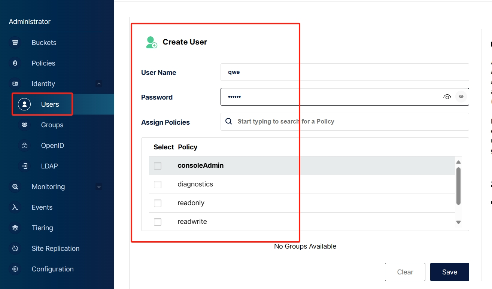
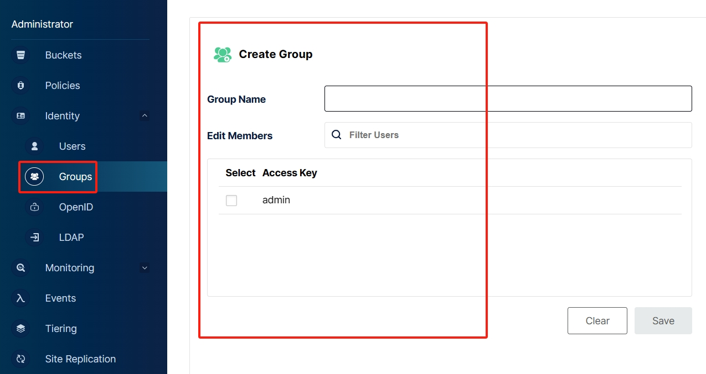
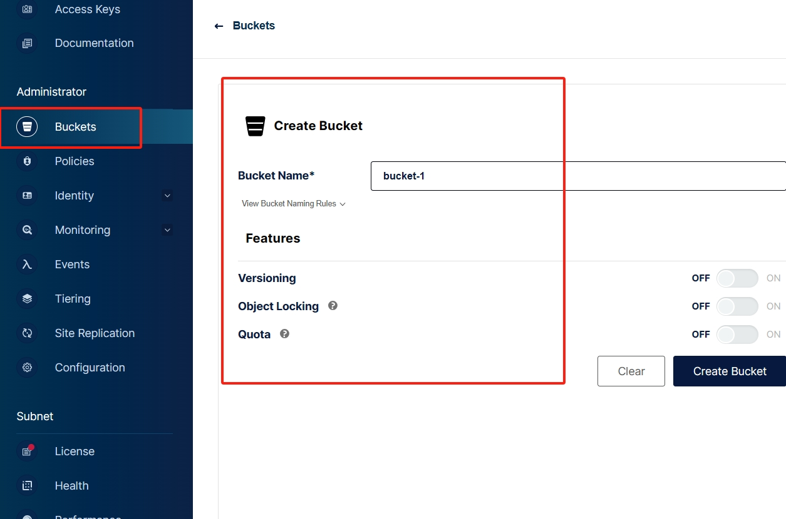
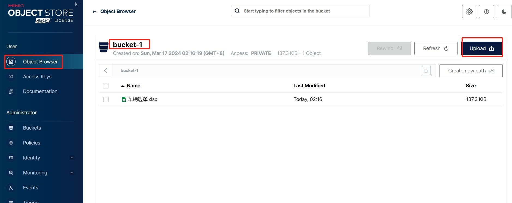
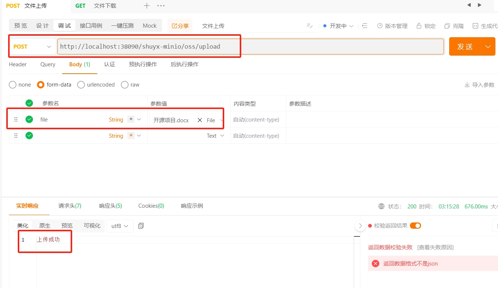

[toc]

# MinIO笔记

MinIO 是一个开源的对象存储服务器，它兼容 Amazon S3 API，可用于构建私有云存储。Minio 提供高度可扩展性、易于部署和管理的特点，使其成为存储大量数据的理想选择。


[MinIO官网](https://www.minio.org.cn/)

[MinIO中文文档](https://www.minio.org.cn/docs/minio/kubernetes/upstream/)

> 为什么选择MinIO？

Minio是GO语言开发的，性能很好，安装简单，可分布式存储海量图片、音频、视频等文件，且拥有自己的管理后台界面，十分友好。

## Docker环境下安装启动MinIO

> 步骤① 先安装docker环境，自行百度。

> 步骤② 下载MinIO镜像文件。最新版或某个版本

```shell
# 下载最新版的MinIO镜像
docker pull minio/minio
# 下载某个版本的MinIO镜像
docker pull minio/minio:RELEASE.2024-03-10T02-53-48Z。
# 查询镜像
docker images
```

> 步骤③ 创建MinIO的容器的存储目录，即容器数据卷

需要创建一个data目录，存储MinIO容器的配置和数据。例如在/d/DockerVolumes/minio/data

> 步骤④ 创建并启动MinIO容器

```shell
# 创建容器并启动

docker run -d --name="myMinIO" -p 39000:9000 -p 39001:9001 -v /d/DockerVolumes/minio/data:/data  -e "MINIO_ROOT_USER=minio" -e "MINIO_ROOT_PASSWORD=minio123" minio/minio:RELEASE.2024-03-10T02-53-48Z server /data --console-address ":9001"

# 查询容器日志，看是否成功启动。
docker logs myMinIO
```

> 步骤⑤ 访问MinIO管理界面

访问地址：`http://127.0.0.1:39001/login`。


## MinIO管理界面使用

> 创建用户

创建用户并分配权限。



> 创建组

创建组并分配权限，并且可以把多个用户加入到同一个组内。一个组内的用户，都拥有相同的权限



> 创建对象桶



> 文件上传

创建对象桶之后，再上传文件。文件会作为对象，存储再对象桶中。



## SpringBoot 与 minio 搭配

1. 先创建springboot工程。
2. 导入minio客户端依赖

```xml
<!-- MinIO 客户端 -->
<dependency>
    <groupId>io.minio</groupId>
    <artifactId>minio</artifactId>
    <version>8.5.7</version>
</dependency>
```

3. minio配置

```yml
minio:
  url: http://127.0.0.1:19000  # minio服务端地址
  accessKey: minioadmin # 用户名
  secretKey: minioadmin # 密码
  bucketName: xxxx # 创建的对象桶名称
```

4. minio配置类

```java
@Data
@Configuration
public class MinioConfig {
    /**
     * 访问地址
     */
    @Value("${minio.url}")
    private String minioUrl;

    /**
     * accessKey 账户
     */
    @Value("${minio.accessKey}")
    private String accessKey;

    /**
     * secretKey 密码
     */
    @Value("${minio.secretKey}")
    private String secretKey;

    /**
     * 默认存储桶
     */
    @Value("${minio.bucketName}")
    private String bucketName;

    @Bean
    public MinioClient minioClient() {
        MinioClient minioClient = MinioClient.builder()
                .endpoint(minioUrl)
                .credentials(accessKey, secretKey)
                .build();
        return minioClient;
    }
}
```

5. minio工具类

```java
/**
 * MinIO工具类
 *
 */
@Slf4j
@Component
@RequiredArgsConstructor
public class MinioUtils {

    private final MinioClient minioClient;

    public MinioUtils(MinioClient minioClient) {
        this.minioClient = minioClient;
    }

    /******************************  Operate Bucket Start  ******************************/
    

    /**
     * 判断Bucket是否存在，true：存在，false：不存在
     * @param bucketName
     * @return
     */
    @SneakyThrows(Exception.class)
    public boolean bucketExists(String bucketName) {
        return minioClient.bucketExists(BucketExistsArgs.builder().bucket(bucketName).build());
    }


    /**
     * 获得所有Bucket列表
     *
     * @return
     */
    @SneakyThrows(Exception.class)
    public List<Bucket> getAllBuckets() {
        return minioClient.listBuckets();
    }

    /**
     * 根据bucketName获取其相关信息
     *
     * @param bucketName
     * @return
     */
    @SneakyThrows(Exception.class)
    public Optional<Bucket> getBucket(String bucketName) {
        return getAllBuckets().stream().filter(b -> b.name().equals(bucketName)).findFirst();
    }

    /**
     * 根据bucketName删除Bucket，true：删除成功； false：删除失败，文件或已不存在
     * @param bucketName
     * @throws Exception
     */
    @SneakyThrows(Exception.class)
    public void removeBucket(String bucketName) {
        minioClient.removeBucket(RemoveBucketArgs.builder().bucket(bucketName).build());
    }

    /******************************  Operate Bucket End  ******************************/


    /******************************  Operate Files Start  ******************************/

    /**
     * 判断文件是否存在
     *
     * @param bucketName
     * @param objectName
     * @return
     */
    public boolean isObjectExist(String bucketName, String objectName) {
        boolean exist = true;
        try {
            minioClient.statObject(StatObjectArgs.builder().bucket(bucketName).object(objectName).build());
        } catch (Exception e) {
            log.error("[Minio工具类]>>>> 判断文件是否存在, 异常：", e);
            exist = false;
        }
        return exist;
    }

    /**
     * 判断文件夹是否存在
     *
     * @param bucketName
     * @param objectName
     * @return
     */
    public boolean isFolderExist(String bucketName, String objectName) {
        boolean exist = false;
        try {
            Iterable<Result<Item>> results = minioClient.listObjects(
                    ListObjectsArgs.builder().bucket(bucketName).prefix(objectName).recursive(false).build());
            for (Result<Item> result : results) {
                Item item = result.get();
                if (item.isDir() && objectName.equals(item.objectName())) {
                    exist = true;
                }
            }
        } catch (Exception e) {
            log.error("[Minio工具类]>>>> 判断文件夹是否存在，异常：", e);
            exist = false;
        }
        return exist;
    }


    /**
     * 获取文件流
     *
     * @param bucketName 存储桶
     * @param objectName 文件名
     * @return 二进制流
     */
    @SneakyThrows(Exception.class)
    public InputStream getObject(String bucketName, String objectName) {
        return minioClient.getObject(
                GetObjectArgs.builder()
                        .bucket(bucketName)
                        .object(objectName)
                        .build());
    }

    /**
     * 断点下载
     *
     * @param bucketName 存储桶
     * @param objectName 文件名称
     * @param offset     起始字节的位置
     * @param length     要读取的长度
     * @return 二进制流
     */
    @SneakyThrows(Exception.class)
    public InputStream getObject(String bucketName, String objectName, long offset, long length) {
        return minioClient.getObject(
                GetObjectArgs.builder()
                        .bucket(bucketName)
                        .object(objectName)
                        .offset(offset)
                        .length(length)
                        .build());
    }

    /**
     * 获取路径下文件列表
     *
     * @param bucketName 存储桶
     * @param prefix     文件名称
     * @param recursive  是否递归查找，false：模拟文件夹结构查找
     * @return 二进制流
     */
    public Iterable<Result<Item>> listObjects(String bucketName, String prefix, boolean recursive) {
        return minioClient.listObjects(
                ListObjectsArgs.builder()
                        .bucket(bucketName)
                        .prefix(prefix)
                        .recursive(recursive)
                        .build());
    }

    /**
     * 使用MultipartFile进行文件上传
     *
     * @param bucketName  存储桶
     * @param file        文件名
     * @param objectName  对象名
     * @param contentType 类型
     * @return
     */
    @SneakyThrows(Exception.class)
    public ObjectWriteResponse uploadFile(String bucketName, MultipartFile file, String objectName, String contentType) {
        InputStream inputStream = file.getInputStream();
        return minioClient.putObject(
                PutObjectArgs.builder()
                        .bucket(bucketName)
                        .object(objectName)
                        .contentType(contentType)
                        .stream(inputStream, inputStream.available(), -1)
                        .build());
    }

    /**
     * 图片上传
     * @param bucketName
     * @param imageBase64
     * @param imageName
     * @return
     */
    public ObjectWriteResponse uploadImage(String bucketName, String imageBase64, String imageName) {
        if (!StringUtils.isEmpty(imageBase64)) {
            InputStream in = base64ToInputStream(imageBase64);
            String newName = System.currentTimeMillis() + "_" + imageName + ".jpg";
            String year = String.valueOf(new Date().getYear());
            String month = String.valueOf(new Date().getMonth());
            return uploadFile(bucketName, year + "/" + month + "/" + newName, in);

        }
        return null;
    }

    public static InputStream base64ToInputStream(String base64) {
        ByteArrayInputStream stream = null;
        try {
            byte[] bytes = new BASE64Decoder().decodeBuffer(base64.trim());
            stream = new ByteArrayInputStream(bytes);
        } catch (Exception e) {
            e.printStackTrace();
        }
        return stream;
    }


    /**
     * 上传本地文件
     *
     * @param bucketName 存储桶
     * @param objectName 对象名称
     * @param fileName   本地文件路径
     * @return
     */
    @SneakyThrows(Exception.class)
    public ObjectWriteResponse uploadFile(String bucketName, String objectName, String fileName) {
        return minioClient.uploadObject(
                UploadObjectArgs.builder()
                        .bucket(bucketName)
                        .object(objectName)
                        .filename(fileName)
                        .build());
    }

    /**
     * 通过流上传文件
     *
     * @param bucketName  存储桶
     * @param objectName  文件对象
     * @param inputStream 文件流
     * @return
     */
    @SneakyThrows(Exception.class)
    public ObjectWriteResponse uploadFile(String bucketName, String objectName, InputStream inputStream) {
        return minioClient.putObject(
                PutObjectArgs.builder()
                        .bucket(bucketName)
                        .object(objectName)
                        .stream(inputStream, inputStream.available(), -1)
                        .build());
    }

    /**
     * 创建文件夹或目录
     *
     * @param bucketName 存储桶
     * @param objectName 目录路径
     * @return
     */
    @SneakyThrows(Exception.class)
    public ObjectWriteResponse createDir(String bucketName, String objectName) {
        return minioClient.putObject(
                PutObjectArgs.builder()
                        .bucket(bucketName)
                        .object(objectName)
                        .stream(new ByteArrayInputStream(new byte[]{}), 0, -1)
                        .build());
    }

    /**
     * 获取文件信息, 如果抛出异常则说明文件不存在
     *
     * @param bucketName 存储桶
     * @param objectName 文件名称
     * @return
     */
    @SneakyThrows(Exception.class)
    public String getFileStatusInfo(String bucketName, String objectName) {
        return minioClient.statObject(
                StatObjectArgs.builder()
                        .bucket(bucketName)
                        .object(objectName)
                        .build()).toString();
    }

    /**
     * 拷贝文件
     *
     * @param bucketName    存储桶
     * @param objectName    文件名
     * @param srcBucketName 目标存储桶
     * @param srcObjectName 目标文件名
     */
    @SneakyThrows(Exception.class)
    public ObjectWriteResponse copyFile(String bucketName, String objectName, String srcBucketName, String srcObjectName) {
        return minioClient.copyObject(
                CopyObjectArgs.builder()
                        .source(CopySource.builder().bucket(bucketName).object(objectName).build())
                        .bucket(srcBucketName)
                        .object(srcObjectName)
                        .build());
    }

    /**
     * 删除文件
     *
     * @param bucketName 存储桶
     * @param objectName 文件名称
     */
    @SneakyThrows(Exception.class)
    public void removeFile(String bucketName, String objectName) {
        minioClient.removeObject(
                RemoveObjectArgs.builder()
                        .bucket(bucketName)
                        .object(objectName)
                        .build());
    }

    /**
     * 批量删除文件
     *
     * @param bucketName 存储桶
     * @param keys       需要删除的文件列表
     * @return
     */
    public void removeFiles(String bucketName, List<String> keys) {
        List<DeleteObject> objects = new LinkedList<>();
        keys.forEach(s -> {
            objects.add(new DeleteObject(s));
            try {
                removeFile(bucketName, s);
            } catch (Exception e) {
                log.error("[Minio工具类]>>>> 批量删除文件，异常：", e);
            }
        });
    }

    /**
     * 获取文件外链
     *
     * @param bucketName 存储桶
     * @param objectName 文件名
     * @param expires    过期时间 <=7 秒 （外链有效时间（单位：秒））
     * @return url
     */
    @SneakyThrows(Exception.class)
    public String getPresignedObjectUrl(String bucketName, String objectName, Integer expires) {
        GetPresignedObjectUrlArgs args = GetPresignedObjectUrlArgs.builder().expiry(expires).bucket(bucketName).object(objectName).build();
        return minioClient.getPresignedObjectUrl(args);
    }

    /**
     * 获得文件外链
     *
     * @param bucketName
     * @param objectName
     * @return url
     */
    @SneakyThrows(Exception.class)
    public String getPresignedObjectUrl(String bucketName, String objectName) {
        GetPresignedObjectUrlArgs args = GetPresignedObjectUrlArgs.builder()
                .bucket(bucketName)
                .object(objectName)
                .method(Method.GET).build();
        return minioClient.getPresignedObjectUrl(args);
    }

    /**
     * 将URLDecoder编码转成UTF8
     *
     * @param str
     * @return
     * @throws UnsupportedEncodingException
     */
    public String getUtf8ByURLDecoder(String str) throws UnsupportedEncodingException {
        String url = str.replaceAll("%(?![0-9a-fA-F]{2})", "%25");
        return URLDecoder.decode(url, "UTF-8");
    }
}
```

6. minio接口

```java
@Slf4j
@RestController
@RequestMapping("/shuyx-minio")
public class OSSController {

    @Autowired
    private MinioUtils minioUtils;

    @Autowired
    private MinioConfig minioConfig;

    /**
     * 文件上传
     *
     * @param file
     */
    @PostMapping("/oss/upload")
    public String upload(@RequestParam("file") MultipartFile file) {
        try {
            //文件名
            String newFileName = System.currentTimeMillis() + "." + file.getOriginalFilename();
            //类型
            String contentType = file.getContentType();
            minioUtils.uploadFile(minioConfig.getBucketName(), file, newFileName, contentType);
            return "上传成功";
        } catch (Exception e) {
            log.error("上传失败");
            return "上传失败";
        }
    }

    /**
     * 删除文件
     * @param fileName
     */
    @DeleteMapping("/oss/delete")
    public void delete(@RequestParam("fileName") String fileName) {
        minioUtils.removeFile(minioConfig.getBucketName(), fileName);
    }

    /**
     * 获取文件信息
     * @param fileName
     * @return
     */
    @GetMapping("/oss/info")
    public String getFileStatusInfo(@RequestParam("fileName") String fileName) {
        return minioUtils.getFileStatusInfo(minioConfig.getBucketName(), fileName);
    }

    /**
     * 获取文件外链
     * @param fileName
     * @return
     */
    @GetMapping("/oss/url")
    public String getPresignedObjectUrl(@RequestParam("fileName") String fileName) {
        return minioUtils.getPresignedObjectUrl(minioConfig.getBucketName(), fileName);
    }

    /**
     * 文件下载
     *
     * @param fileName
     * @param response
     */
    @GetMapping("/oss/download")
    public void download(@RequestParam("fileName") String fileName, HttpServletResponse response) {
        try {
            InputStream fileInputStream = minioUtils.getObject(minioConfig.getBucketName(), fileName);
            response.setHeader("Content-Disposition", "attachment;filename=" + fileName);
            response.setContentType("application/force-download");
            response.setCharacterEncoding("UTF-8");
            IOUtils.copy(fileInputStream, response.getOutputStream());
        } catch (Exception e) {
            log.error("下载失败");
        }
    }

}
```

7. 测试

文件上传测试截图如下


浏览器中测试文件下载接口地址：`http://localhost:38090/shuyx-minio/oss/download?fileName=1710616528112.开源项目.docx`