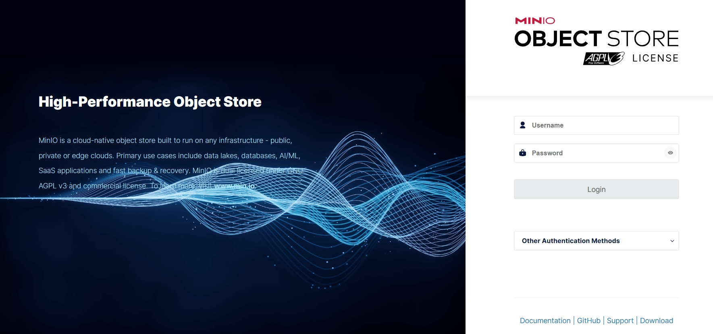

[toc]

# MinIO笔记

MinIO 是一个开源的对象存储服务器，它兼容 Amazon S3 API，可用于构建私有云存储。Minio 提供高度可扩展性、易于部署和管理的特点，使其成为存储大量数据的理想选择。


[MinIO官网](https://www.minio.org.cn/)

[MinIO中文文档](https://www.minio.org.cn/docs/minio/kubernetes/upstream/)

> 为什么选择MinIO？

Minio是GO语言开发的，性能很好，安装简单，可分布式存储海量图片、音频、视频等文件，且拥有自己的管理后台界面，十分友好。

## Docker环境下安装启动MinIO

> 步骤① 先安装docker环境，自行百度。

> 步骤② 下载MinIO镜像文件。最新版或某个版本

```shell
# 下载最新版的MinIO镜像
docker pull minio/minio
# 下载某个版本的MinIO镜像
docker pull minio/minio:RELEASE.2024-03-10T02-53-48Z。
# 查询镜像
docker images
```

> 步骤③ 创建MinIO的容器的存储目录，即容器数据卷

需要创建一个data目录，存储MinIO容器的配置和数据。例如在/d/DockerVolumes/minio/data

> 步骤④ 创建并启动MinIO容器

```shell
# 创建容器并启动

docker run -d --name="myMinIO" -p 39000:9000 -p 39001:9001 -v /d/DockerVolumes/minio/data:/data  -e "MINIO_ROOT_USER=minio" -e "MINIO_ROOT_PASSWORD=minio123" minio/minio:RELEASE.2024-03-10T02-53-48Z server /data --console-address ":9001"

# 查询容器日志，看是否成功启动。
docker logs myMinIO
```

> 步骤⑤ 访问MinIO管理界面

访问地址：`http://127.0.0.1:39001/login`。



## MinIO管理界面使用

> 创建用户

创建用户并分配权限。


> 创建AccessKey

minio客户端可以通过AccessKey来访问minio服务端。


> 创建组

创建组并分配权限，并且可以把多个用户加入到同一个组内。一个组内的用户，都拥有相同的权限


> 创建对象桶


> 文件上传

创建对象桶之后，再上传文件。文件会作为对象，存储再对象桶中。


## 本地查看MinIO中上传的文件

当我们把文件上传到minio中时。可以通过链接来本地查看上传的文件。

链接格式：`http://${ip}:{port}/bucket-name/{resourceName}`

注意：
1. 如果你的minio是docker容器部署的，那么port应该是宿主机可以访问minio容器的端口。
2. 如果你是远程访问，那么ip是宿主机的ip。并不是你本地服务器的ip。
3. 你需要先把对象桶的访问权限设置为public。

例如下图所示的图片


该图片的访问链接为：`http://localhost:39000/media-cover-bucket/1712730772556.ddd.jpg`

- localhost是因为宿主机就是我本地的服务器。
- 39000是宿主机访问minio容器的端口。

> 对象桶访问权限问题

如果你本地访问文件，minio确提示权限问题。大概率是因为没有给对象桶设置访问权限。你需要设置对象桶的权限为public才行。


设置对象桶权限为public
