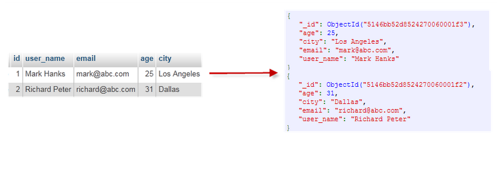
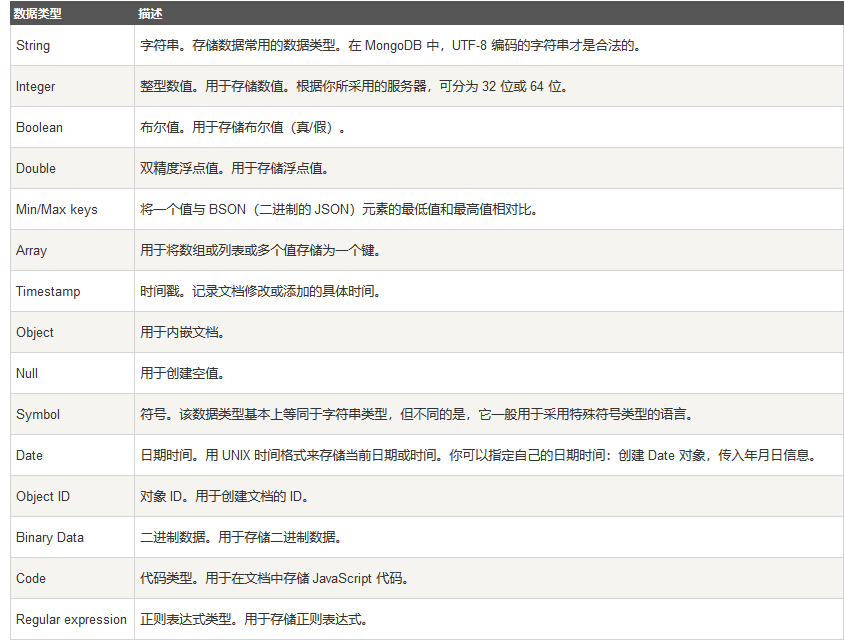
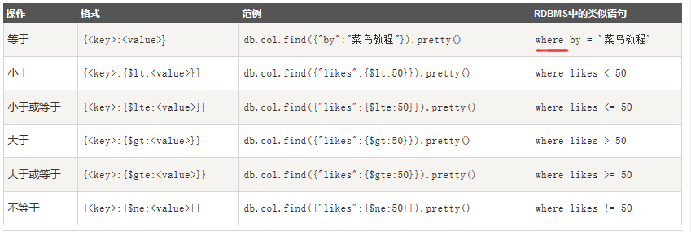
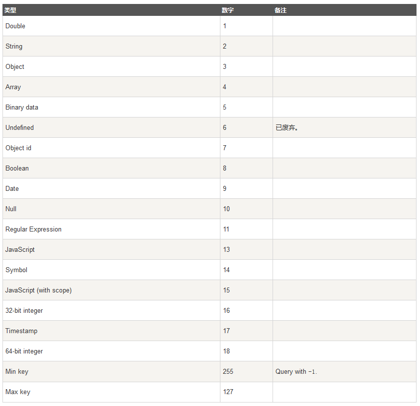
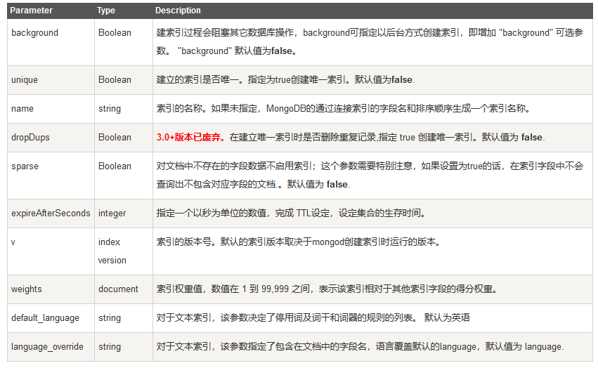
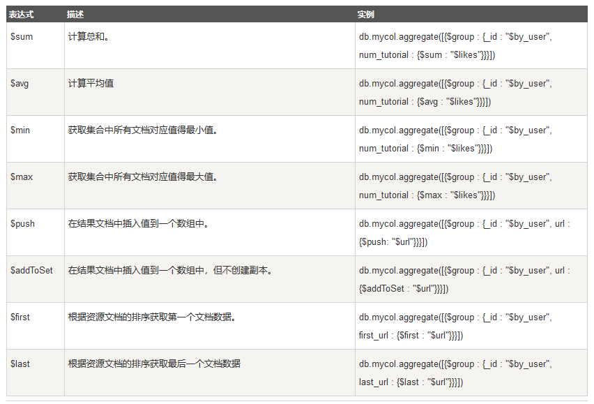

# MongoDB基础

MongoDB的官方网站是：[http://www.mongodb.com/](http://www.mongodb.com/)

# 1.MongoDB的介绍

MongoDB支持的数据结构非常松散，是类似json的bson格式，因此可以存储比较复杂的数据类型。

Mongo最大的特点是它支持的查询语言非常强大，其语法类似于面向对象的查询语言，几乎可以实现类似关系数据库单表查询的绝大部分功能，而且还支持对数据建立索引。

# 2.MongoDB的安装（Windows 下的）以及安装出现的问题

>① MongoDB的安装，百度搜索。注意要在windows 环境变量中配置MongoDB
PS:MongoDB将数据目录存储在 db 目录下。但是这个数据目录不会主动创建，我们在安装完成后需要在data目录中创建它。
② 安装出现的问题（Windows 下的）

1. 若用控制台启动MongoDB出现，`发生系统错误 5 拒绝访问 `

<font color="red">解决方法：使用管理员的方式打开MongoDB</font>

2. 若用控制台启动MongoDB出现，`服务没有响应控制功能`

参考链接: [将MongoDB作为windows服务来安装，出现“服务没有响应控制功能”错误](https://blog.csdn.net/u013905744/article/details/52787226)


<font color="red">

解决方法：
1.首先配置MongoDB的环境变量。
2.其次，控制台运行以下命令（命令中的MongoDB的安装位置来进行更改）

mongod -install -serviceName MongoDB -serviceDisplayName MongoDB -logpath F:\MongoDB\log\MongoDB.Log -dbpath F:\MongoDB\data -directoryperdb

3.再次打开MongoDB,在浏览器输入：`http://localhost:27017`
若成功进去表示MongoDB启动成功。

</font>


# 3.MongoDB与SQL的不同

SQL概念 | MongoDB概念 | 描述
-- | -- | --
database  |	database  |	数据库
table |	collection |	表/集合（<font color="red">在MongoDB中表被称为集合</font>）
row    |	document |  表中的一行（表中的一个记录）/ 文档
column |	field |	数据字段/域
index |	index  |	索引
table joins | XXX	|  	表连接,MongoDB不支持
primary key  |	primary key  |	主键,MongoDB自动将_id字段设置为主键

**MongoDB支持的数据结构非常松散，是类似json的bson格式，因此可以存储比较复杂的数据类型。**



# 4.MongoDB 数据类型




# 5.MongoDB 的各种命令(windows下，以管理员身份运行命令行)

## 1.开启和关闭服务

```
>net start MongoDB    # 启动MongoDB服务
>net stop MongoDB      # 关闭MongoDB服务
```

## 2.mongo 命令,进入到 MongoDB的后台管理shell，从而管理数据库

MongoDB Shell是MongoDB自带的交互式Javascript shell,用来对MongoDB进行操作和管理的交互式环境。

```
>mongo
```


## 3.数据库的命令

<font color="red">

PS:
1.MongoDB 中默认的数据库为 test，如果你没有创建新的数据库，集合将存放在 test 数据库中。
2.在 MongoDB 中，集合（表）只有在内容插入后才会创建。 就是说，创建集合（表）后要再插入一个文档(记录)，集合(表)才会真正创建。

</font>

>1. use dbname : 切换到指定数据库，否则创建数据库
>2. db  : 用于查看当前数据库
>3. show dbs : 查看所有数据库
>4. db.dropDatabase() : 删除当前数据库,db表示当前数据库

```
> use demo1
switched to db demo1
> db
demo1

> show dbs
admin   0.000GB
config  0.000GB
local   0.000GB     
test1   0.000GB  

> db.dropDatabase()
{ "ok" : 1 }

```

## 4.集合（表）的命令

<font color="red">
PS:
在 MongoDB 中，你不需要直接创建集合（表）。当你插入一些文档（记录）时，MongoDB 会自动创建集合(表)。
</font>

>1. db.createCollection(name, options)   // name是集合名称，options是可选参数

options可选参数 | 类型 | 描述
-- | -- | --
capped |  布尔 | （可选）若为 true，则创建有着固定大小的集合，当达到最大值时，它会自动覆盖最早的文档。当该值为 true 时，必须指定 size 参数。
autoIndexId  | 	布尔  | （可选）如为 true，自动在 _id 字段创建索引。默认为 false。
size | 	数值 | （可选）为集合指定一个最大值（以字节计）。如果 capped 为 true，也需要指定该字段。
max | 	数值  | （可选）指定固定集合中包含文档的最大数量。

>2. show collections 或 show tables 命令  : 查看已有集合
>3. db.collectionName.drop()         : 删除指定集合

```
> db.createCollection("goods")      //创建集合（表）goods
{ "ok" : 1 }

> db.createCollection("user", { capped : true, autoIndexId : true, size : 
   6142800, max : 10000 } )
{ "ok" : 1 }                        //创建user表，并设置了参数

> show collections
goods
> show tables
goods

> db.goods.drop()     //删除goods 集合
true
> show collections
>
```

## 5.文档（记录）的命令

>1. db.collectionNAME.insert(document)    : 使用 insert() 向集合中插入文档
>2. db.collection.save( `<` document >,{ writeConcern: `<` document > })    : 使用 save() 方法通过传入的文档来替换已有文档
>3. db.collectionNAME.find()    : 查看集合中的数据
>4. document=({~ ~ ~})      :先把一条数据包装为文档，在用insert()命令插入

```
>5. 使用 update() 和 save() 方法来更新集合中的文档
db.collection.update(
   <query>,
   <update>,
   {
     upsert: <boolean>,
     multi: <boolean>,
     writeConcern: <document>
   }
)

参数说明：
query : update的查询条件，类似sql update查询内where后面的。
update : update的对象和一些更新的操作符（如$,$inc...）等，也可以理解为sql update查询内set后面的
upsert : 可选，这个参数的意思是，如果不存在update的记录，是否插入objNew,true为插入，默认是false，不插入。
multi : 可选，mongodb 默认是false,只更新找到的第一条记录，如果这个参数为true,就把按条件查出来多条记录全部更新。
writeConcern :可选，抛出异常的级别。
```

```
>6. 移除集合中的数据
db.collectionName.remove(
    < query >,
    { justOne: < boolean >,
      writeConcern: < document > 
    }) 

参数说明：
query :（可选）删除的文档的条件。
justOne : （可选）如果设为 true 或 1，则只删除一个文档，如果不设置该参数，或使用默认值 false，则删除所有匹配条件的文档。
writeConcern :（可选）抛出异常的级别。

```
>7. db.collectionName.remove({})      : //删除当前集合中的所有文档

```
>8.查询文档 
db.collectionName.find(query, projection)

参数说明：
query ：可选，使用查询操作符指定查询条件
projection ：可选，使用投影操作符指定返回的键。查询时返回文档中所有键值， 只需省略该参数即可（默认省略）。

```

>9. db.collectionName.find().pretty()   : //以易读的方式查询文档

>10. db.collectionName.findOne()    : //查询文档，只返回第一个文档

```
> db.user.insert({id:001,name:"xiaoming",age:12})   //向user集合插入一条文档（记录）
WriteResult({ "nInserted" : 1 })     
> db.user.save({id:002,name:"xiaohong",age:15})
WriteResult({ "nInserted" : 1 })

> db.user.find()
{ "_id" : ObjectId("5cfcf68336c46018670f0d01"), "id" : 1, "name" : "xiaoming", "age" : 12 }
{ "_id" : ObjectId("5cfcf74736c46018670f0d02"), "id" : 2, "name" : "xiaohong", "age" : 15 }


> document=({id:003,"name":"xiaoqiang",age:17})
{ "id" : 3, "name" : "xiaoqiang", "age" : 17 }
> db.user.insert(document)
WriteResult({ "nInserted" : 1 })

//修改文档中的数据
>db.user.update({'name':'xiaoming'},{$set:{'name':'xiaobing'}})    //把name属性更改
WriteResult({ "nMatched" : 1, "nUpserted" : 0, "nModified" : 1 })
> db.user.find()
{ "_id" : ObjectId("5cfcf68336c46018670f0d01"), "id" : 1, "name" : "xiaobing", "age" : 12 }
{ "_id" : ObjectId("5cfcf74736c46018670f0d02"), "id" : 2, "name" : "xiaohong", "age" : 15 }
{ "_id" : ObjectId("5cfcf92d36c46018670f0d04"), "id" : 3, "name" : "xiaoqiang", "age" : 17 }

//删除文档的数据
> db.user.remove({'name':'xiaobing'})     //删除name=xiaobing的数据
WriteResult({ "nRemoved" : 1 })
> db.user.find()
{ "_id" : ObjectId("5cfcf74736c46018670f0d02"), "id" : 2, "name" : "xiaohong", "age" : 15 }
{ "_id" : ObjectId("5cfcf92d36c46018670f0d04"), "id" : 3, "name" : "xiaoqiang", "age" : 17 }

>db.user.remove({})        //删除所有的文档数据

//查询集合中的所有文档数据
> db.user.find()
{ "_id" : ObjectId("5cfcf74736c46018670f0d02"), "id" : 2, "name" : "xiaohong", "age" : 15 }
{ "_id" : ObjectId("5cfcf86c36c46018670f0d03"), "title" : "MongoDB 教程", "description" : "MongoDB 是一个 Nosql 数据库", "by" : "菜鸟教程", "url" : "http://www.runoob.com", "tags" : [ "mongodb", "database", "NoSQL" ], "likes" : 100 }
{ "_id" : ObjectId("5cfcf92d36c46018670f0d04"), "id" : 3, "name" : "xiaoqiang", "age" : 17 }


```

## 6.文档查询find的（and ,where ,or）条件

① where 条件：



② and 条件：就相当于传入多个键值对

> db.collectionName.find( {key1:value1, key2:value2 })

```
> db.user.find({"name":"xiaoqiang", age:17})
{ "_id" : ObjectId("5cfcf92d36c46018670f0d04"), "id" : 3, "name" : "xiaoqiang", "age" : 17 }
```

③ or 条件,使用了关键字 $or

>db.collectionName.find({ $or: [ {key1: value1}, {key2:value2} ] })

```
> db.user.find({ $or: [ {"name": "xiaoming"}, {id:3} ] })
{ "_id" : ObjectId("5cfcf92d36c46018670f0d04"), "id" : 3, "name" : "xiaoqiang", "age" : 17 }
```

④：and 和 or 联合使用

```
>db.user.find({age: { $gt:10}, $or: [{"name": "xiaoming"},{id: 3}]})

类似于sql:
where age>50 AND (name = 'xiaoming' OR id = 3)
```

## 7.条件操作符(>,<,>=,<=)

在MongoDB中条件操作符有：
1. (>) 大于 --- $gt
2. (<) 小于 --- $lt
3. (>=) 大于等于 --- $gte
4. (<=) 小于等于 --- $lte

```
//大于>
db.user.find({age : {$gt : 10}})    //Select * from user where age > 10;

//小于<
db.user.find({age : {$lt : 15}})    //Select * from user where age < 15;

//大于等于>=
db.user.find({age : {$gte : 10}})   //Select * from user where age >=10;

//小于等于 
db.user.find({age : {$lte : 15}})   //Select * from user where age <= 150;

```

示例：同时使用 (<) 和 (>) 查询

```
db.user.find({age : {$lt : 20, $gt : 10}})   //Select * from user where age >10 AND age<20;
```

## 8.数据类型条件符 $type

MongoDB 中可以使用的数据类型：



使用示例：找出name为string类型的数据
```
db.user.find({"name" : {$type : 2}})    //2 表示为 string 类型
或
db.user.find({"name" : {$type : 'string'}})   
```

## 9.读取一定数量之内或之外的数据---Limit与Skip方法

<font color="red">注:若没有指定limit()方法中的参数则显示集合中的所有数据 </font>

①：limit() 方法---读取指定数量的数据记录

>db.colectionNAME.find().limit(number)

```
> db.user.find().limit(2)  //查询两条数据
```

②：skip() 方法---跳过指定数量的数据记录

<font color="red">注:skip()方法默认参数为 0 </font>

>db.colectionNAME.find().limit(number).skip(number)

```
//查询第一条，且跳过第一条数据。则只会显示第二条文档数据
>db.user.find().limit(1).skip(1)
```

## 10.排序----sort() 方法

在 MongoDB 中 sort() 方法可以通过参数指定排序的字段，其中 1 为升序排列，而 -1 是用于降序排列。

>db.colectionNAME.find().sort({KEY:1})

```
//在user集合中按字段 name 的降序排列
>db.user.find().sort({"name":-1})
```

## 11.索引----createIndex() 方法

索引通常能够极大的提高查询的效率，索引是特殊的数据结构，索引存储在一个易于遍历读取的数据集合中，索引是对数据库表中一列或多列的值进行排序的一种结构。

>db.colectionNAME.createIndex(keys, options)
 // Key 值为你要创建的索引字段，options = 1 为指定按升序创建索引， -1 为降序。

```
// 设置使用多个字段创建索引
>db.user.createIndex({id:1,"name":-1})
```

**createIndex() 还可以接收可选参数，参数列表：**



```
示例：在后台创建索引
db.user.createIndex({id: 1}, {background: true})   
```

## 12.聚合 --- aggregate() 方法

MongoDB中聚合(aggregate)主要用于处理数据(诸如统计平均值,求和等)，并返回计算后的数据结果。 

>db.colectionNAME.aggregate(operation)

```
示例：计算每个作者所写的文章数
db.user.aggregate([{$group : {_id : "$by_user", num_tutorial : {$sum : 1}}}])
//  select by_user, count(*) from mycol group by by_user
```

**operation的参数列表**



---

# 6.Node.js + MongoDB

<font color="red">PS：创建一个文件夹，用于存放相关的文件，以下操作都在该文件夹中执行。</font>

>① node.js 安装 MongoDB的驱动依赖文件

```
$ cnpm install mongodb     // cnpm 是使用的淘宝镜像
```

>② 创建demo.js 文件。连接MongoDB数据库。**若数据库存在就连接,不存在就创建**

demo.js
```js 
var MongoClient = require('mongodb').MongoClient;    //获取MongoClient
var url = "mongodb://localhost:27017/demoDB";       
 
MongoClient.connect(url, { useNewUrlParser: true }, function(err, db) {
  if (err) throw err;
  console.log('数据库已创建或已连接');
  db.close();                                       //关闭数据库
});
```

>③ 创建集合（表）与删除集合

```js
//创建集合
var MongoClient = require('mongodb').MongoClient;
var url = 'mongodb://localhost:27017/demoDB';
MongoClient.connect(url, { useNewUrlParser: true }, function (err, db) {
    if (err) throw err;
    console.log('数据库已创建或已连接');

    //创建集合（表）
    var dbase = db.db("demoDB");
    dbase.createCollection('user', function (err, res) {    //创建user 集合
        if (err) throw err;
        console.log("创建集合!");
        db.close();
    });
});

//删除集合
var MongoClient = require('mongodb').MongoClient;
var url = "mongodb://localhost:27017/";
MongoClient.connect(url, { useNewUrlParser: true }, function(err, db) {
    if (err) throw err;
    var dbo = db.db("demoDB");
    // 删除 user 集合
    dbo.collection("user").drop(function(err, delOK) {  // 执行成功 delOK 返回 true，否则返回 false
        if (err) throw err;
        if (delOK) console.log("集合已删除");
        db.close();
    });
});
```

>④ 对集合（表）的CRUD

```js
//插入一条数据 insertOne()
var dbo = db.db("demoDB");
var myobj = { name: "小明", age: 16 };
dbo.collection("user").insertOne(myobj, function(err, res) {
    if (err) throw err;
    console.log("文档插入成功");
    db.close();
});

//插入多条数据 insertMany()
var dbo = db.db("demoDB");
var myobj =  [
    { name: "小明", age: 16},
    { name: "小华", age: 12},
    { name: "小黑", age: 15}
    ];
dbo.collection("user").insertMany(myobj, function(err, res) {
    if (err) throw err;
    console.log("插入的文档数量为: " + res.insertedCount);
    db.close();
});

//删除一条数据 deleteOne()，把第一个查询出来的数据进行删除
  var dbo = db.db("demoDB");
  var whereStr = {name: "小明", age: 16};  // 被删除数据的where条件
  dbo.collection("user").deleteOne(whereStr, function(err, obj) {
      if (err) throw err;
      console.log("文档删除成功");
      db.close();
  });

//删除多条数据 deleteMany()
var dbo = db.db("demoDB");
var whereStr = {  age: 16 };  // 被删除数据的where条件
dbo.collection("user").deleteMany(whereStr, function(err, obj) {
    if (err) throw err;
    console.log(obj.result.n + " 条文档被删除");
    db.close();
});

//更新一条数据 updateOne(),把第一个查询出来的数据进行更新
var dbo = db.db("demoDB");
var whereStr = { age: 16};  // 查询条件
var updateStr = {$set: { "address" : "earth" }};
dbo.collection("user").updateOne(whereStr, updateStr, function(err, res) {
    if (err) throw err;
    console.log("文档更新成功");
    db.close();
});

//更新多条数据 updateMany()
var dbo = db.db("demoDB");
var whereStr = {age: 16 };  // 查询条件
var updateStr = {$set: { "address" : "earth" }};
dbo.collection("user").updateMany(whereStr, updateStr, function(err, res) {
    if (err) throw err;
      console.log(res.result.nModified + " 条文档被更新");
    db.close();
});

//查询数据 find()，把表中的数据全部查询出来
var dbo = db.db("demoDB");
dbo.collection("user"). find({}).toArray(function(err, result) { // 返回集合中所有数据
    if (err) throw err;
    console.log(result);
    db.close();                 //关闭数据库连接
});

//查询指定条件的数据
var dbo = db.db("demoDB");
var whereStr = {"address" : "earth"};  // 查询条件
dbo.collection("user").find(whereStr).toArray(function(err, result) {
  if (err) throw err;
  console.log(result);
  db.close();
});

```

>④ 对查询出来的数据按照规则排序

使用 sort() 方法进行排序，该方法接受一个参数，规定是升序(1)还是降序(-1)。

例如：
{ type: 1 }  // 按 type 字段升序
{ type: -1 } // 按 type 字段降序

```js
//按name字段进行升序排序

var dbo = db.db("demoDB");
var mysort = { "name": 1 };
dbo.collection("user").find().sort(mysort).toArray(function(err, result) {    
    if (err) throw err;
    console.log(result);
    db.close();
});

```

>⑤ 分页

设置指定的返回条数可以使用 limit() 方法，该方法只接受一个参数，指定了返回的条数。

```js
//返回两条数据
var dbo = db.db("demoDB");
dbo.collection("user").find().limit(2).toArray(function(err, result) {
    if (err) throw err;
    console.log(result);
    db.close();
});
```