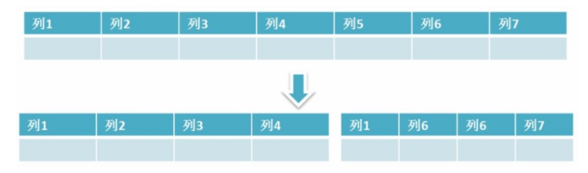
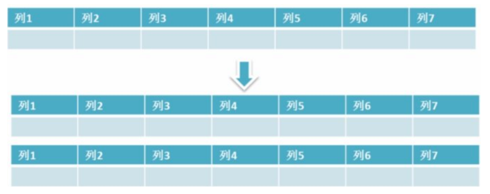

[toc]

# MySQL优化

主要记载一些数据库方面的优化措施。

## sql优化

### 限定SQL语句的查询条件

任何查询语句都需要带上限制条件。比如：我们当用户在查询订单历史的时候，我们可以控制在一个月的范围内；否则就会查询全部订单历史，从而给数据库添加压力。就算是要查询全部数据，也要通过分页查询的方式来减轻数据库的压力。

### 限定查询结果字段个数

在查询语句中不要使用select * 。若无必要，不要查询全部字段。

### 多表查询优化

1. 在需要多表查询的情况下，减少使用子查询，多使用关联查询（left join,right join,inner join）替代。
2. 减少使用 IN 或者 NOT IN ,使用exists，not exists或者关联查询语句替代
3. or 的查询尽量用 union或者union all 代替(在确认没有重复数据或者不用剔除重复数据时，union all会更好)

### 查询条件中触发索引

1. 应尽量避免在 where 子句中使用!=或<>操作符，否则存储引擎会放弃使用索引而进行全表扫描。
2. 应尽量避免在 where 子句中对字段进行 null 值判断，否则将导致引擎放弃使用索引而进行全表扫描，如： select id from t where num is null 可以在num上设置默认值0，确保表中num列没有null值，然后这样查询： select id from t where num=0

## 数据库表优化

当MySQL单表记录数过大时，数据库的CRUD性能会明显下降，一些常见的优化措施如下。

### 读写分离

经典的数据库拆分方案，主库负责写，从库负责读；

### 垂直分区（分表）

根据数据库里面数据表的相关性进行拆分。例如，用户表中既有用户的登录信息又有用户的基本信息，可以将用户表拆分成两个单独的表，甚至放到单独的库做分库。

简单来说垂直拆分是指数据表列的拆分。把一张列比较多的表拆分为多张表。如图所示。

- 垂直分区的优点：可以使表的字段更少。在查询表的时候会减少数据库的I/O次数。并且由于将表拆分开，简化了表的结构，从而更加容易维护表。
- 垂直分区的缺点：由于将一个表拆分为多个表，为了维持表与表的关系。则外键字段会出现冗余。让以前查询一个表，变得需要查询多个表，从而让事务变得复杂起来。

### 水平分区（分库）

保持数据表结构不变，通过某种方式将数据表的数据分散存储。即把数据分散到不同的表或者库中，达到了分布式的目的。 

简单来说水平拆分是指数据表行的拆分。把数据行很多的表，拆分为多个相同的表，每个表存储在不同的数据库中。如图所示

例如表的行数超过200万行时，就会变慢，这时可以把一张的表的数据拆成多张表来存放。举个例子：我们可以将用户信息表拆分成多个用户信息表，把每个信息表存储在不同数据库中，这样就可以避免单一表数据量过大对数据库性能造成影响。

注意：水平拆分能够 支持非常大的数据量存储，应用端改造也少，但分片事务难以解决 ，跨节点Join性能较差，逻辑复杂。并且分库存储表会带来逻辑、部署、运维的各种复杂度 ，一般的数据表在优化得当的情况下支撑千万以下的数据量是没有太大问题的。

