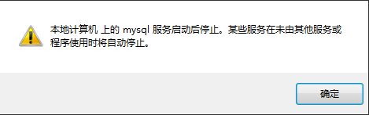
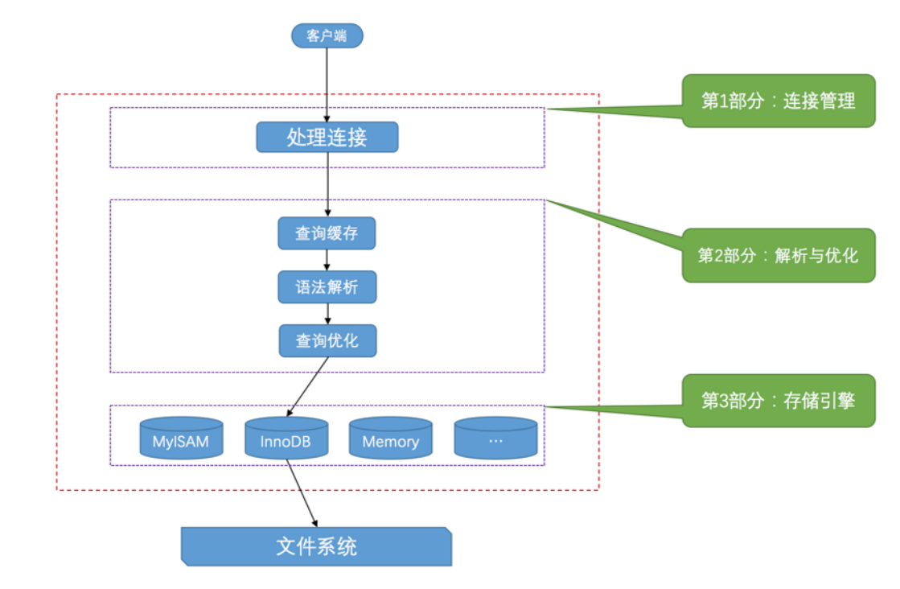

[toc]

## MySQL的常见问题

### Windows下,修改mysql配置文件并重启mysql服务

<font color="red">下面的命令都必须在MySQL的bin目录下运行，并且是管理员身份打开命令窗口CMD</font>

MySQL配置文件my.ini的位置：C:\ProgramData\MySQL\MySQL Server 8.0\my.ini

```
0. 管理员身份打开命令行窗口
1. 进入到mysql的bin目录: cd C:\Program Files\MySQL\MySQL Server 8.0\bin
2. 停止mysql服务：net stop mysql
3. 修改my.ini配置文件
4. 启动服务：net start mysql
```

### Windows下，net stop mysql,net start mysql 命令系统无法识别

```
解决办法：需要安装mysqld命令服务才行
--安装mysqld命令服务
0. 管理员身份打开命令行窗口
1. 进入到mysql的bin目录: cd C:\Program Files\MySQL\MySQL Server 8.0\bin 
2. mysqld.exe –install
```

### windows下，mysql重启方式


```
第一种：命令行
> net stop mysql 关闭服务
> net start mysql 开启服务

第二种：计算机管理界面
我的电脑——(右键)管理——服务与应用程序——服务——MYSQL——开启(停止、重启动)
```


### windows下Mysql服务启动后停止的解决方法

问题来源：当你想要修改mysql的配置文件my.ini。若你是通过计算机管理界面哪里停止了mysql服务，修改配置文件，然后重启mysql服务。此时就有可能会出现该问题。

PS: my.ini配置文件的位置：C:\ProgramData\MySQL\MySQL Server 8.0 这是一个隐藏文件夹



解决方法：

<font color="red">下面的命令都必须在MySQL的bin目录下运行，并且是管理员身份</font>

```
1. 以管理员身份运行CMD,进入到mysql安装目录的bin目录
cd C:\Program Files\MySQL\MySQL Server 8.0\bin

2. 用命令把原来的服务删除，mysql是名称，也有可能是其他名称。
mysqld --remove mysql

3. 在mysql的安装根目录下，删除data目录，如果没有data目录，则新建一个data空目录

4. 运行初始化mysql服务命令
mysqld --initialize-insecure --user=mysql

5. 运行更新配置文件命令
mysqld --install mysql --defaults-file=C:\ProgramData\MySQL\MySQL Server 8.0\my.ini

6. 安装mysql服务命令
mysqld.exe –install

7.  启动服务
net start mysql

8.  注意新的mysql服务,root用户的密码是空的
mysql -u root –p

```

### Mysql 5.x版本修改root密码的4种方法(以windows为例)

<font color="red">下面的命令都必须在MySQL的bin目录下运行，并且是管理员身份打开命令窗口CMD</font>

```
方法1： 用SET PASSWORD命令
首先登录MySQL。
格式：mysql> set password for 用户名@localhost = password('新密码');
例子：mysql> set password for root@localhost = password('123');
```

```
方法2：用mysqladmin
格式：mysqladmin -u用户名 -p旧密码 password 新密码
例子：mysqladmin -uroot -p123456 password 123
```

```
方法3：用UPDATE直接编辑user表
首先登录MySQL。
mysql> use mysql;
mysql> update user set password=password('123') where user='root' and host='localhost';
mysql> flush privileges;
```

```
方法4：在忘记root密码的时候

以windows为例：
1. 关闭正在运行的MySQL服务。
2. 打开DOS窗口，转到mysql\bin目录。
3. 输入mysqld --skip-grant-tables 回车。--skip-grant-tables 的意思是启动MySQL服务的时候跳过权限表认证。
4. 再开一个DOS窗口（因为刚才那个DOS窗口已经不能动了），转到mysql\bin目录。
5. 输入mysql回车，如果成功，将出现MySQL提示符 >。
6. 连接权限数据库： use mysql; 。
6. 改密码：update user set password=password("123") where user="root";（别忘了最后加分号） 。
7. 刷新权限（必须步骤）：flush privileges;　。
8. 退出 quit。
9. 注销系统，再进入，使用用户名root和刚才设置的新密码123登录。
```

### Mysql 8.X版本修改root密码的方法(以windows为例)

<font color="red">
mysql 5.7.9以后废弃了password字段和password()函数；在user表加了authentication_string字段，该字段表示用户加密密码。因此MySql 从8.0开始修改密码有了变化，修改密码需要前先检查authentication_string是否为空
</font>

<font color="red">注意：下面的命令都必须在MySQL的bin目录下运行，并且是管理员身份打开命令窗口CMD</font>

```
1. 若 authentication_string 不为空

-- 切换数据库
>use mysql; 
-- 将字段置为空
>update user set authentication_string='' where user='root';
-- 修改密码为root
>ALTER user 'root'@'localhost' IDENTIFIED BY 'root';

2. 若 authentication_string 为空

-- 切换数据库
>use mysql; 
-- 直接修改密码为root
>ALTER user 'root'@'localhost' IDENTIFIED BY 'root';

3. 若出现以下错误

ERROR 1290 (HY000): The MySQL server is running with the --skip-grant-tables option so it cannot execute this statement

则执行
-- 123为旧密码
> GRANT ALL PRIVILEGES ON *.* TO IDENTIFIED BY '123' WITH GRANT OPTION;
> flush privileges;

4. 然后执行
-- 修改密码为root
ALTER user 'root'@'localhost' IDENTIFIED BY 'root';

```

### windows系统下修改mysql字符集为utf8的方法

最简单的修改方法，就是修改mysql的配置文件my.ini文件中的字符集键值

PS: my.ini配置文件的位置：C:\ProgramData\MySQL\MySQL Server 8.0 这是一个隐藏文件夹

<font color="red">注意：下面的命令都必须在MySQL的bin目录下运行，并且是管理员身份打开命令窗口CMD</font>

```
## 注意：windows下的mysql没有重启，只有关闭和开启
1. 停止mysql服务：net stop mysql
2. 修改配置文件
default-character-set = utf8
character_set_server = utf8

3. 开启服务 net start mysql
4. 登录mysql查看
mysql> SHOW VARIABLES LIKE 'character%';
```

### Linux系统下修改mysql默认字符集的方法

最简单的修改方法，就是修改mysql的my.ini文件中的字符集键值

```
default-character-set = utf8
character_set_server = utf8
```

修改完后，重启mysql的服务，service mysql restart

之后 mysql> SHOW VARIABLES LIKE 'character%';查看


### Mysql编写存储过程大批量插入数据

通过mysql快速创建数据

```
//批量插入数据
DROP PROCEDURE IF EXISTS proc_initData; -- 如果存在此存储过程则删掉
DELIMITER $
CREATE PROCEDURE proc_initData()
BEGIN
    DECLARE i INT DEFAULT 1;
    WHILE i<=40 DO
        INSERT INTO `chiltoonv2`.`shu_traincamp_file` (`name`, `daka_num`, `file_url`) VALUES ('童书图片', '20', CONCAT('/tongshu_img/20-' , i , '.jpg'));
        SET i = i+1;
    END WHILE;
END $
CALL proc_initData();
```

### Navicat用SSH方式连接远程数据库

<font color="red">当navicat常规方式连接远程数据库失败时。可使用SSH方式来连接远程数据库。</font>

<font color="blue">SSH方式：主要是navicat先连接到服务器上,之后再连接到服务器上的数据库上。</font>

1. 在SSH界面，填写远程服务器的ip,端口,用户名（服务器用户名）,密码（服务器密码）
2. 之后在常规界面，填写主机名（相对服务器的主机名，就是localhost，127.0.0.1等）。用户名（数据库用户名），密码（数据库密码）
3. 之后点击确认即可。


### mysql从一个表中查询数据，插入到另一个表中。

>1.若表t_a和表t_b字段相同

```
insert into t_a  select * from t_b;
```

>2.若只插入指定字段(相对应字段的类型必须保持一致)

```
insert into t_a (name,age) select name,age from t_b where age > 10;
```

>3.若只导入目标表中不存在的记录

```
insert into t_a (name) select name from t_b where not exists (select * from t_a where t_a.name = t_b.name);
```


### 彻底卸载MySQL5.X的方法

如何完整的卸载MySQL 5.1的卸载方法：

1. 控制面板里的进行程序卸载
2. 删除安装目录中MySQL文件夹的my.ini文件，如果备份好，可以直接将文件夹全部删除
3. 开始->运行-> regedit 看看注册表里这几个地方删除没有
    HKEY_LOCAL_MACHINE\SYSTEM\ControlSet001\Services\Eventlog\Application\MySQL 目录删除
    HKEY_LOCAL_MACHINE\SYSTEM\ControlSet002\Services\Eventlog\Application\MySQL 目录删除
    HKEY_LOCAL_MACHINE\SYSTEM\CurrentControlSet\Services\Eventlog\Application\MySQL 目录删除（我卸载的时候没有找到，略过后仍达到完全卸载的目的。）
4. 这一条是很关键的:
    C:\Documents and Settings\All Users\Application Data\MySQL。或者 C:\ProgramData\MySQL 这里还有MySQL的文件，必须要删除
    注意：Application Data这个文件夹是隐藏的。
    
以上4步完成，重启电脑 OK！再次安装吧 


### CentOS7安装mysql提示“No package mysql-server available

原因是：CentOS7带有MariaDB而不是MySQL，MariaDB和MySQL一样也是开元的数据库，可以使用yum -y install mariadb-server mariadb命令安装mariadb

解决方案：

1. 如果必须要安装MySQL，首先必须添加mysql社区仓库。输入命令：`sudo rpm -Uvh http://dev.mysql.com/get/mysql-community-release-el7-5.noarch.rpm`
2. 最后使用像安装MySQL的常规方法一样安装mysql： yum install mysql mysql-server mysql-libs mysql-server


### mysql服务端如何处理客户端的请求？



服务器程序处理来自客户端的查询请求大致需要经过三个部分，分别是连接管理,解析与优化,存储引擎 。

> 第一部分：连接管理

* mysql客户端通过 TCP/IP，命名管道或共享内存，Unix域套接字 这几种方式之一来与mysql服务器建立连接。
* 在mysql客户端发起连接的时候，会携带主机信息、用户名、密码,mysql服务器会对客户端程序提供的这些信息进行认证。

> 第二部分：解析与优化

1. 查询缓存
    若mysql客户端发送过来的请求是查询请求。先在缓存中查询是否有一摸一样的请求。若有则直接将该请求的查询结果返回给客户端。若无则往下面流程走。
2. 语法解析
    MySQL服务器对请求文本做分析，判断请求的语法是否正确，然后从文本中把要查询的表、查询条件都提取出来。
3. 查询优化
    语法解析之后，mysql服务器把请求文本中表，条件等信息提取出来。之后mysql服务器会吧这些提取出来的信息进行优化。转化为一个执行计划。根据计划来执行sql语句。

> 第三部分：存储引擎

存储引擎根据执行计划来对文件系统进行数据操作。

mysql中存储引擎是负责对表中的数据进行提取和写入工作的，不同的存储引擎对数据的物理存储结构不同。数据的提取算法也不同。提供的各项特色功能也不同。

<font color="red">InnoDB是MySQL默认的存储引擎。</font>

> PS:查询缓存原理

1. mysql会将刚刚处理过的查询请求和对应的查询结果，缓存起来。若下次有一摸一样的查询请求，则直接从缓存中查询结果。
2. 两个查询请求在任何字符上的不同都会被mysql认为这是两个不同的查询请求。会导致不走缓存。
3. 若查询请求中包含系统函数，用户自定义变量和函数等。都会导致mysql不对这个查询请求进行缓存。
4. MySQL的缓存系统会监测涉及到的每张表,只要某个表的结构或者数据被修改。那使用该表的缓存都将变为无效并从缓存中删除。

<font color="red">从MySQL5.7.20开始，不推荐使用查询缓存，并在MySQL 8.0中删除。</font>


### mysql中的utf8和utf8mb4字符集

* utf8mb3 ：阉割过的 utf8 字符集，只使用1～3个字节表示字符。 
* utf8mb4 ：正宗的 utf8 字符集，使用1～4个字节表示字符。 
* 在 MySQL 中 utf8 是 utf8mb3 的别名，如果有使用4字节编码一个字符的情况，比如存储一些emoji表情啥的，那就使用utf8mb4