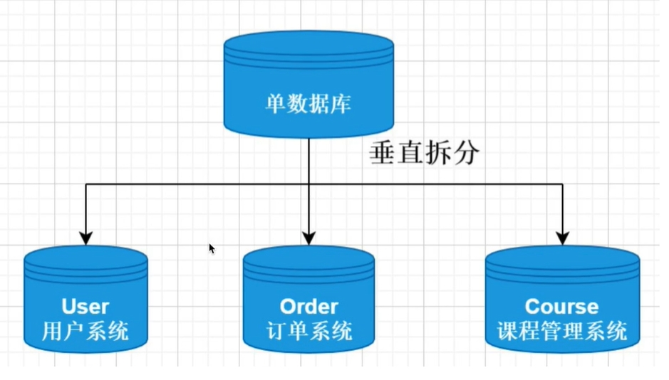
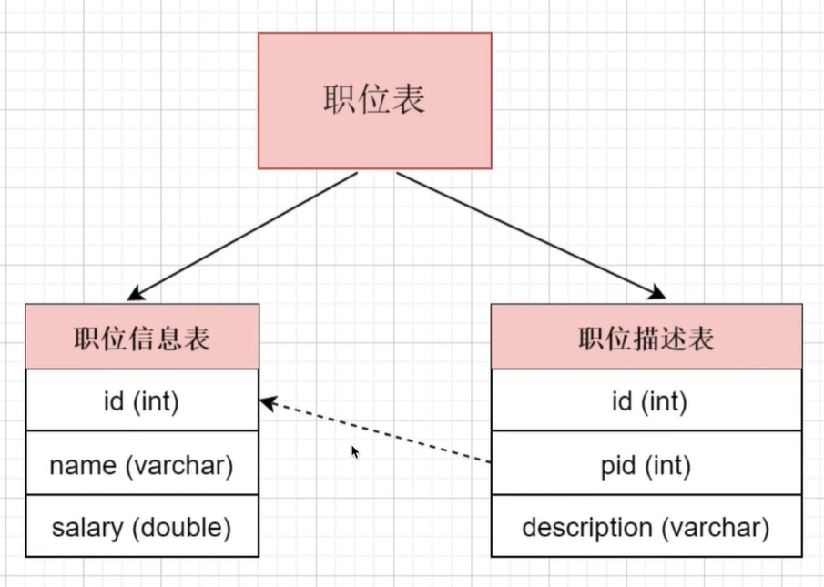
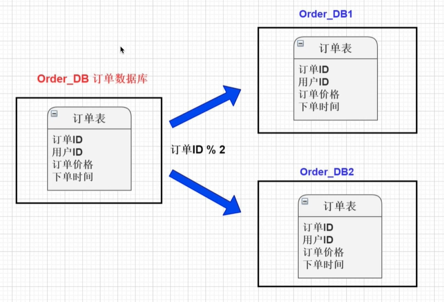
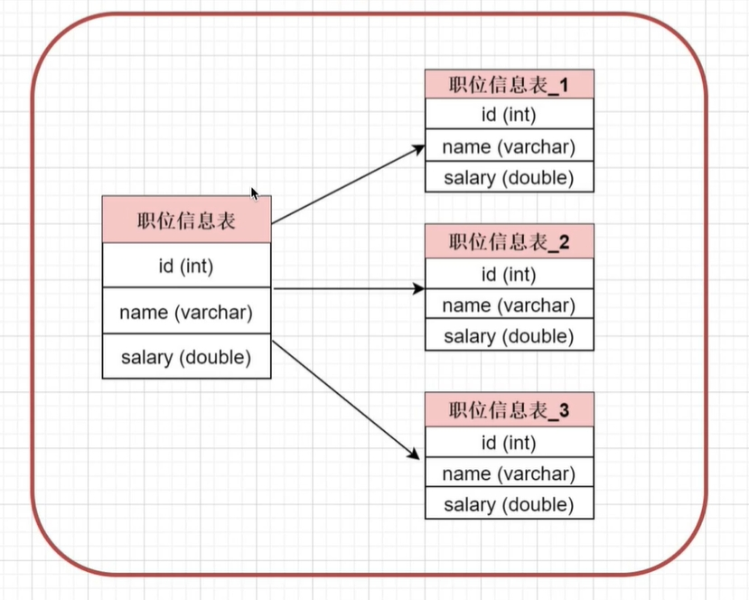
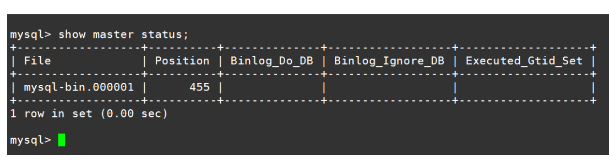

[toc]

# MySQL的笔记13-优化

主要记载一些数据库方面的优化措施。

## sql优化

### 限定SQL语句的查询条件

任何查询语句都需要带上限制条件。比如：我们当用户在查询订单历史的时候，我们可以控制在一个月的范围内；否则就会查询全部订单历史，从而给数据库添加压力。就算是要查询全部数据，也要通过分页查询的方式来减轻数据库的压力。

### 限定查询结果字段个数

在查询语句中不要使用select * 。若无必要，不要查询全部字段。

### 多表查询优化

1. 在需要多表查询的情况下，减少使用子查询，多使用关联查询（left join,right join,inner join）替代。
2. 减少使用 IN 或者 NOT IN ,使用exists，not exists或者关联查询语句替代
3. or 的查询尽量用 union或者union all 代替(在确认没有重复数据或者不用剔除重复数据时，union all会更好)

### 查询条件中触发索引

1. 应尽量避免在 where 子句中使用!=或<>操作符，否则存储引擎会放弃使用索引而进行全表扫描。
2. 应尽量避免在 where 子句中对字段进行 null 值判断，否则将导致引擎放弃使用索引而进行全表扫描，如： select id from t where num is null 可以在num上设置默认值0，确保表中num列没有null值，然后这样查询： select id from t where num=0

### limit分页查询优化

一般的分页查询使用简单的limit语句就能实现。

```sql
# limit语法如下
select * from 表名 limit [offset,] rows 

# offset 偏移量，从0开始，可选。
# rows 返回记录数。
# 如果只有rows参数，那么就返回从0开始的指定行数据。
```

据统计：
- 如果偏移量固定，当返回记录数低于100的时候，查询时间差距不大。但是随着返回记录数越大，查询时间越大。

```sql
select * from user limit 100,1
select * from user limit 100,10
select * from user limit 100,100
select * from user limit 100,1000
select * from user limit 100,10000
```

- 如果返回记录数不变，当偏移量超过100的时候，随着偏移量越大，查询时间会急剧增加。

```sql
select * from user limit 1,100
select * from user limit 10,100
select * from user limit 100,100
select * from user limit 1000,100
select * from user limit 10000,100
```

问题原因总结：limit的分页查询机制，是每次都会从表的第一条记录开始搜索，因此就算返回记录数只有100，但是随着偏移量越大，那么搜索的时间就越长，查询时间就越长。

> 优化方式1：通过索引来进行分页。

由于limit分页查询总是会从表的第一条记录开始搜索。因此我们可以通过索引来直接跳到偏移量的位置上，然后再开始分页查询。

例如，我们想要查询从第1000条开始的100条记录。假设id是自增的。我们可以通过where查询语句，直接跳到1000条。然后再进行分页查询。
```sql
# 下面两条查询语句的效果是一样的
select * from studeng limit 1000,100 
select * from studeng where id >=1000 limit 100 
```

> 优化方式2：利用子查询进行优化

首先利用子查询，跳到偏移量开始的地方。然后再进行分页查询。

```sql
# 先定位到偏移量开始的记录上
select id from studeng where id = 1000

# 然后再进行分页查询
select * from studeng where id >=(select id from studeng where id = 1000) limit 100 
```

## 分库分表

分库是指将存储再同一个数据库的数据，分散存储到不同数据库上，以达到缓解数据库负载的效果。

分表是指将存储再同一个表上的数据，分散存储到不同表上，以达到缓解表负载的效果。

分库分表的目的是解决由于数据量过大，从而导致数据库系统性能降低的问题。将原来单个的数据库进行拆分成多个数据库，将原来单个表进行拆分成多个表。从而达到提高数据库系统的性能。

分库分表有四种方式：垂直分库，垂直分表，水平分库，水平分表。

> 垂直分库

由于数据库中不同的表对于不同的业务。垂直分库是指将单个数据库中的数据表，按照业务的不同将表进行分类。然后把各个业务的数据表拆分到各个数据库中。并将各个数据库部署再各个服务器上。



> 垂直分表

当表中字段太多时，会影响表的性能。垂直分表是指将单个表的拆分成多个表，每个表存储一部分的字段。这样一个大表就变成了多个小表。

例如可以将职位表拆分为职位信息表和职位描述表。


> 水平分库

水平分库是指将一个数据库中的数据，切分到多个数据库上。水平分库并不是将数据库中的表按照业务不同进行拆分，而是将表中的数据按照某种逻辑进行分开存储。

例如将订单表的数据，根据id是奇数还是偶数，来分别存储再不同的数据库上。


水平分库可以有效缓解单个数据库的性能瓶颈和压力。

> 水平分表

针对某个数据量特别大的单张表，按照某种规则将一个表的数据水分开存储到多个表上。这些表还是存在一个数据库中。

水平分表可以缓解单个表的性能瓶颈和压力，但是由于还是再一个数据库中，对于数据库的性能还是存在瓶颈的。

如图将一个职位信息表，水平拆分为多个职位信息表。



总结：
- 垂直分表：将一个表按照字段拆分为多个表，每个表存储其中一部分字段。
- 垂直分库：将数据库中的表，按照业务逻辑的不同，将表分开存储到不同的数据库上。这些数据库部署再各自的服务器上。
- 水平分表：将一个表的数据按照一定规则，分开存储再同一个数据库的多个表中，每个表只存储一部分数据。
- 水平分库：将一个表的数据按照一定规则，分库存储在不同数据的同一个表中（即每个数据库都有一个相同名称的表）。每一个表都存储一部分数据。


## 数据库表优化

当MySQL单表记录数过大时，数据库的CRUD性能会明显下降，一些常见的优化措施如下。

### 读写分离

经典的数据库拆分方案，主库负责写，从库负责读；

### 垂直分区（分表）

根据数据库里面数据表的相关性进行拆分。例如，用户表中既有用户的登录信息又有用户的基本信息，可以将用户表拆分成两个单独的表，甚至放到单独的库做分库。

简单来说垂直拆分是指数据表列的拆分。把一张列比较多的表拆分为多张表。如图所示。


- 垂直分区的优点：可以使表的字段更少。在查询表的时候会减少数据库的I/O次数。并且由于将表拆分开，简化了表的结构，从而更加容易维护表。
- 垂直分区的缺点：由于将一个表拆分为多个表，为了维持表与表的关系。则外键字段会出现冗余。让以前查询一个表，变得需要查询多个表，从而让事务变得复杂起来。

### 水平分区（分库）

保持数据表结构不变，通过某种方式将数据表的数据分散存储。即把数据分散到不同的表或者库中，达到了分布式的目的。 

简单来说水平拆分是指数据表行的拆分。把数据行很多的表，拆分为多个相同的表，每个表存储在不同的数据库中。如图所示


例如表的行数超过200万行时，就会变慢，这时可以把一张的表的数据拆成多张表来存放。举个例子：我们可以将用户信息表拆分成多个用户信息表，把每个信息表存储在不同数据库中，这样就可以避免单一表数据量过大对数据库性能造成影响。

注意：水平拆分能够 支持非常大的数据量存储，应用端改造也少，但分片事务难以解决 ，跨节点Join性能较差，逻辑复杂。并且分库存储表会带来逻辑、部署、运维的各种复杂度 ，一般的数据表在优化得当的情况下支撑千万以下的数据量是没有太大问题的。


## mysql 主从复制

### 为什么要主从复制？

例如：在业务复杂的系统中，有这么一个情景，有一句sql语句需要锁表，导致暂时不能使用读的服务，那么就很影响运行中的业务，使用主从复制，让主库负责写，从库负责读，这样，即使主库出现了锁表的情景，通过读从库也可以保证业务的正常运作。

另外，主从复制有以下特点。
* 数据冗余和备份：通过主从复制，从服务器上的数据是主服务器的冗余副本。
* 高可用性：通过主从复制。当主服务器发生故障时，可以手动或自动将某个从服务器提升为新的主服务器，继续提供数据库服务，从而实现快速的故障恢复。
* 提高读写性能：主服务器负责处理写操作，从服务器负责处理读操作，从而降低主服务器的负载，提升整个系统的吞吐量。
* 数据分析和报表生成：由于从服务器可以处理读操作，可以将其用于数据库的数据分析和报表生成等工作。这样可以避免对主服务器造成额外的负载，同时提供实时的数据分析和报表服务。

### mysql支持的的复制类型

MySQL支持以下几种常见的复制类型：

1. 基于语句的复制：基于语句的复制是MySQL最早支持的复制方式，它通过复制和执行SQL语句来实现数据的复制和同步，即：在主服务器上执行SQL语句，在从服务器上执行同样的语句。这种方式简单高效，但在一些特殊情况下可能会导致数据不一致。默认情况下都是基于语句的复制。
2. 基于行的复制：基于行的复制是MySQL较新支持的复制方式，它将每一行的改变记录下来，然后在备库上重放这些改变以实现数据的复制和同步，即:把改变的内容复制过去，而不是把命令在从服务器上执行一遍。这种方式可以更精确地复制数据的改变，但会增加网络传输和存储成本。从MySQL5.0开始支持。
3. 混合复制：混合复制是基于语句的复制和基于行的复制的结合，MySQL会根据具体情况自动选择使用哪种方式进行复制。默认采用基于语句的复制不行就采用基于行的复制。

### mysql主从复制的原理机制

主从复制的原理机制是通过日志的复制方式来实现数据的同步。当主服务器上发生数据变更时，会将这些变更写入二进制日志（Binary Log）中。从服务器通过连接到主服务器，请求从主服务器获取二进制日志，并将这些日志应用到自己的数据库中。

主从复制的机制
1. 主服务器生成二进制日志：在主服务器上，所有的写操作（例如插入、更新、删除）都会被记录在二进制日志中。二进制日志包含了数据库变更的详细信息。
2. 从服务器连接到主服务器：从服务器通过连接到主服务器。在连接建立时，从服务器会获取到主服务器上当前的二进制日志文件名和位置，作为复制的起点。
3. 从服务器请求复制数据：从服务器会向主服务器发送一个复制请求，请求从当前的二进制日志位置之后的写操作事件。主服务器根据复制请求，将二进制日志中的事件发送给从服务器。
4. 从服务器应用复制日志：从服务器接收到主服务器发送的二进制日志后，会解析并应用这些事件到自己的数据库中。从服务器会按照顺序依次执行，以保持数据的一致性。
5. 复制链路的维护和监控：主从复制过程中，主服务器会持续记录二进制日志，而从服务器会持续请求和应用这些日志。复制链路需要进行监控和维护，以确保复制的正常运行和数据的可靠性。

<font color="red">
注：主从复制是异步的，从服务器在应用写操作之前，并不等待主服务器的确认。因此，从服务器上的数据可能会有一定的延迟。
</font>

### 如何实现主从复制

主从复制的步骤：
1. 配置主服务器：在主服务器上，需要开启二进制日志（Binary Log）功能，该功能记录了主服务器上的所有写操作，包括更新、删除和插入。同时需要配置主服务器的唯一标识（server_id）。
2. 配置从服务器：在从服务器上，需要配置主服务器的IP地址、端口号、用户名和密码等。同时需要配置从服务器的唯一标识（server_id）。
3. 启动复制：在从服务器上启动复制进程，连接到主服务器并请求复制数据。主服务器将发送二进制日志文件中的写操作事件（event）给从服务器，从服务器接收并应用这些事件，将数据复制到自己的数据库。
4. 复制过程：复制过程主要包括两个步骤：从服务器请求主服务器的二进制日志，主服务器将日志发送给从服务器；从服务器解析并应用日志中的事件到自己的数据库，保持与主服务器的数据一致性。
5. 复制链路的监控和维护：可以通过监控工具或命令来查看主从服务器的复制状态和延迟情况。同时，也需要定期备份和维护从服务器，确保数据的安全性和可恢复性。

### 搭建mysql主从复制

1. 环境准备

```
两台机器，一主一从。
主（master）：192.168.136.134 port：3306
从（slave）：192.168.136.135 port：3306
```

2. 配置主库

```shell
# 修改配置文件
vim /etc/my.cnf

# my.cnf配置文件内容修改如下。设置server-id值并开启二进制日志
[mysqld]
log-bin=mysql-bin
server_id=120

# 重启mysql服务器，让配置生效
systemctl restart mysqld

```

3. 在主库上创建一个主从复制用户

在主库上创建一个主从复制用户。之后从库需要使用这个用户的账户密码，登录到主库上进行主从复制。

```shell
# 创建一个主从复制用户
mysql> grant replication slave on *.* to 'slave_test'@'192.168.136.%' identified by 'qwe123456789';
Query OK, 0 rows affected (0.00 sec)

# 刷新权限
mysql> flush privileges;
Query OK, 0 rows affected (0.00 sec)

# 创建主从复制用户后，查询一下该用户的权限。
mysql> show grants for 'slave_test'@'192.168.136.%';
```

* grant replication slave: 授予复制数据到从服务器权限
* on *.*: 应用于所有数据库
* to ‘slave_test’@‘192.168.136.%’: 授权给用户名为’slave_test’，只能从IP地址为192.168.136.开头的主机访问
* identified by ‘qwe123456789’: 设置用户的密码为’qwe123456789’

4. 查询主库的二进制日志文件及其偏移量

```shell
mysql> show master status;
```



二进制日志文件名称及其偏移量，会在从库配置上用到。


5. 给主库进行一次数据备份

这步可做可不做，注意生产环境需要提前申请停机时间。

```shell
# 锁定所有表，让表处于只读状态
#提示：如果超过设置时间不操作会自动解锁。
mysql> flush tables with read lock;

# 先给主库做一次全部数据备份
mysqldump -uroot -p -A -B | gzip > /home/mysqlbackup/mysql_bak.$(date +%F).sql.gz

# 解锁
# 释放表的锁定状态。这样其他会话才能对表进行写入操作。
mysql> unlock tables;

# 将数据备份从主库传输到从库
scp /home/mysqlbackup/mysql_bak.2023-07-17.sql.gz 192.168.136.135:/home/mysqlbackup/

```

* FLUSH TABLES WITH READ LOCK; 它的作用是在当前会话中锁定所有表，并使它们处于只读状态。这个命令常用于备份数据库或进行一些需要确保数据一致性的操作。
* mysqldump: 是一个MySQL提供的工具，用于导出数据库结构和数据。
* -A: 表示导出所有数据库。
* -B: 表示导出全部表结构和数据。
* |: 管道操作符，将前一个命令的输出作为后一个命令的输入。
* gzip: 使用gzip工具对数据进行压缩。
* `>` : 重定向操作符，将输出结果保存到指定的文件中。
* /home/mysqlbackup/mysql_bak.$(date +%F).sql.gz: 指定了备份文件的路径和名称
* scp: 是一个用于在不同主机之间安全地进行文件传输的命令。
* 192.168.136.135: 是从库所属的服务器的IP地址。
* /home/mysqlbackup/: 是从库所属的服务器上接收文件的目录路径。


6. 从库配置

```shell
# 修改从库配置文件
vim /etc/my.cnf

# 修改内容如下
[mysqld]
server_id=130

# 重启数据库
systemctl restart mysqld
```


7. 在从库服务器中将主库备份数据还原

```shell
cd /home/mysqlbackup/
gzip -d mysql_bak.2023-07-17.sql.gz
mysql -uroot -p < mysql_bak.2023-07-17.sql
#查询从库的数据库，看看是否与主库的数据库一样
mysql -uroot -p -e 'show databases;'
```

8. 在从库服务器中设置主从库数据同步

```shell
# 执行change master to 语句
mysql> change master to
MASTER_HOST='192.168.136.134',              #主库ip
MASTER_PORT=3306,                           #主库端口
MASTER_USER='slave_test',                   #主库授权的用户
MASTER_PASSWORD='qwe123456789',             #主库授权的用户密码
MASTER_LOG_FILE='mysql-bin.000001',         #主库的二进制文件名称
MASTER_LOG_POS=455;                         #主库的二进制文件的偏移量

# 启动从库的同步
mysql> start slave;

# 查看主从复制状态
mysql> show slave status\G

# Slave_IO_Running:Yes和Slave_YES_Running:Yes 都是yes的时候表示同步正常。
```

其他相关的命令
```shell
# 开启主从复制
start slave;

# 关闭主从复制:
stop slave;

# 重置主从复制：
stop slave;
reset slave all;
```