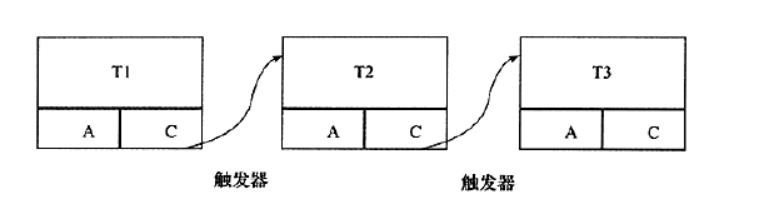
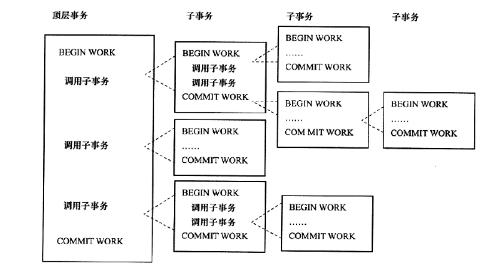
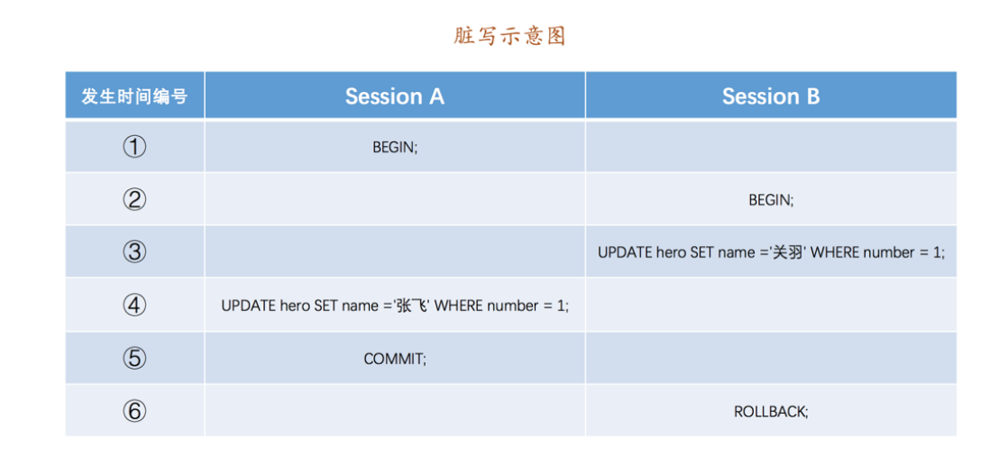
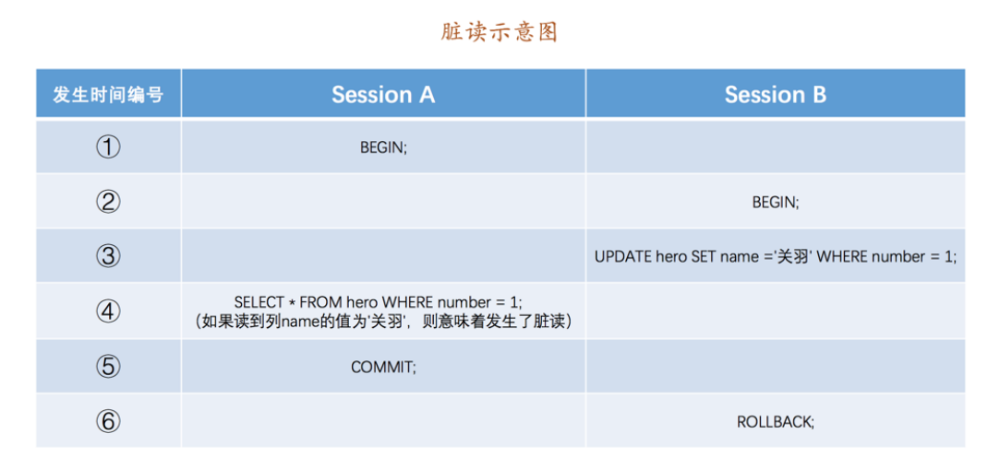
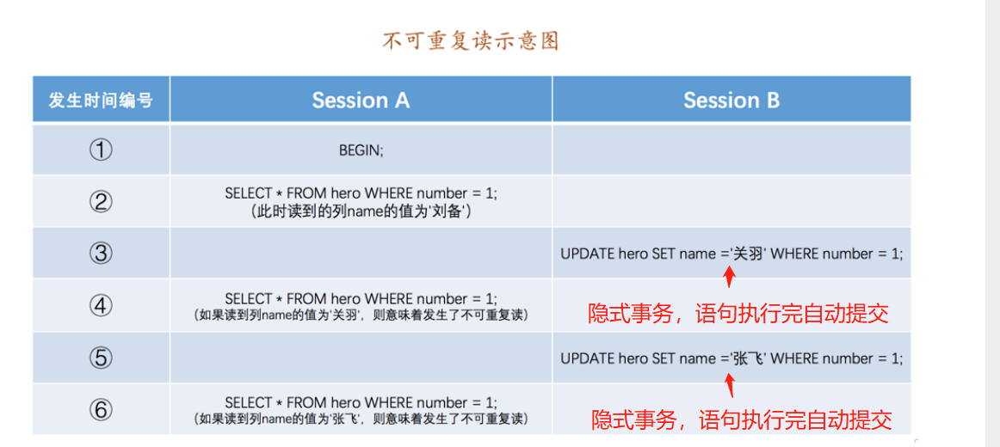
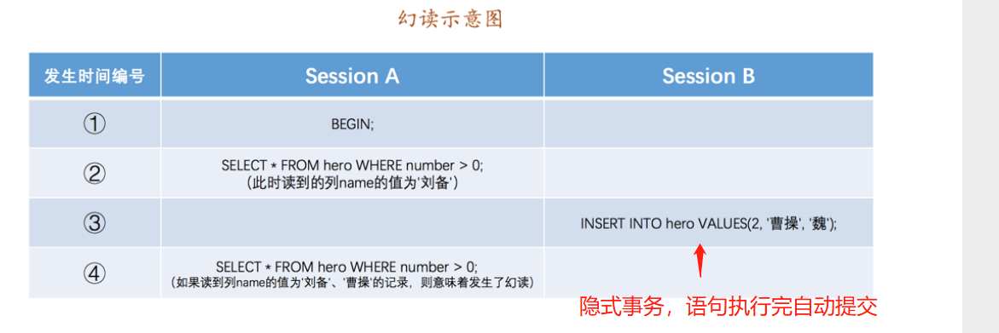
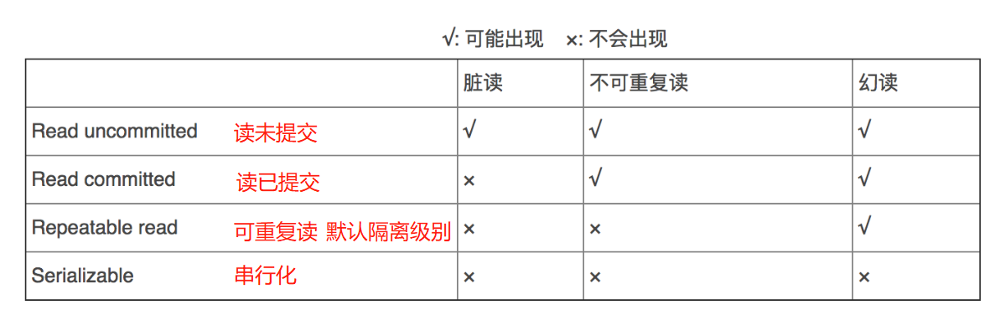

[toc]

# MySQL笔记10-事务

当多个用户访问同一数据时，一个用户在更改数据的过程中可能有其它用户同时发起更改请求，为保证数据的一致性状态，MySQL 引入了事务。

## 事务的介绍

数据库的事务（Transaction）是一种机制。事务会把一组数据库命令作为一个整体进行操作，即这一组数据库命令要么都执行，要么都不执行。因此事务是一个不可分割的工作逻辑单元。在数据库系统上执行并发操作时，事务是作为最小的控制单元来使用的，特别适用于多用户同时操作的数据库系统。

事务可以由一条非常简单的SQL语句组成，也可以由一组复杂的SQL语句组成。

事务处理可以用来维护数据库的完整性，保证多个SQL语句要么全部执行，要么全部不执行。

## 事务执行的语法和流程

在MySQL中，InnoDB存储引擎支持事务，MyISAM 存储引擎不支持事务。其中InnoDB 存储引擎事务主要通过 UNDO 日志和 REDO 日志实现。

* UNDO 日志：复制事务执行前的数据，用于在事务发生异常时回滚数据。
* REDO 日志：记录在事务执行中对每条对数据进行的操作，当事务提交时，该内容将被刷新到磁盘。若事务发生异常则进行反向操作。


> 在MySQL中使用下列语句来管理事务。

```sql
-- 开始事务语法1如下
BEGIN;
-- 或者，开始事务语法2如下
START TRANSACTION;

-- 提交事务语法如下
COMMIT;

-- 回滚事务语法如下
ROLLBACK;

```

> 例子
```sql
-- 开启事务
BEGIN;
-- 事务中的sql语句
UPDATE bank SET currentMoney = currentMoney-500 WHERE customerName='张三';
-- 提交事务
COMMIT;
-- 回滚事务
ROLLBACK;

```


## 事务的四大特性(ACID)

### ACID介绍

1. 原子性（atomicity）： 事务是最小的执行单位，不允许分割。原子性保证了事务中的操作要么全部完成，要么全部不完成；
2. 一致性（consistency）： 执行事务前后，数据总数保持一致。例如：A和B互相转账。一致性就是要保证转账前后，A和B的账号金额总体一样。
3. 隔离性（isolation）： 并发访问数据库时，一个事务不被其他事务所干扰，各并发事务之间数据库是独立的；
4. 持久性（durability）： 一个事务被提交之后。它对数据库中数据的改变是持久的，即使数据库发生故障也不会丢失。

> 使用事务的注意事项
* 事务应该简短。
* 事务中访问的数据量尽量最少。
* 查询语句尽量不要使用事务。因为查询语句不会更新数据库。

### A（atomicity）原子性实现原理

mysql的InnoDB引擎实现回滚靠的是undo.log日志文件，当事务对数据库进行修改时，InnoDB会生成对应的undo.log日志文件。如果事务执行失败或调用了rollback，导致事务需要回滚，便可以利用undo.log日志文件中的信息将数据回滚到修改之前的样子。

undo.log属于逻辑日志，它记录的是sql执行相关的信息。当发生回滚时，InnoDB引擎会根据undo.log的内容做与之前相反的工作。对于insert，回滚时会执行delete。对于delete，回滚时会执行insert。对于update，回滚时则会执行相反的update，把数据改回去。

### D（durability）持久性实现原理

事务的一致性原理关系到InnoDB引擎的BufferPool机制。

InnoDB引擎的BufferPool机制:
InnoDB存储引擎中数据是存放在磁盘中的，但如果每次读写数据都需要磁盘IO，效率会很低。因此InnoDB提供了缓存(BufferPool)。BufferPool中包含了磁盘中部分数据页的映射，作为访问数据库的缓冲。当从数据库读取数据时，会首先从Buffer Pool中读取，如果Buffer Pool中没有，则从磁盘读取后放入Buffer Pool。当向数据库写入数据时，会首先写入Buffer Pool，Buffer Pool中修改的数据会定期刷新到磁盘中（这一过程称为刷脏）。Buffer Pool的使用大大提高了读写数据的效率，但是也带了新的问题：如果MySQL宕机，而此时Buffer Pool中修改的数据还没有刷新到磁盘，就会导致数据的丢失，事务的持久性无法保证。

于是，redo.log日志文件被引入来解决这个问题。当数据修改时，除了修改BufferPool中的数据，还会在redo.log日志文件记录这次操作。如果MySQL宕机，重启时可以读取redo.log日志文件中的数据，对数据库进行恢复。redo.log采用的是所有修改先写入日志，再更新到Buffer Pool，保证了数据不会因MySQL宕机而丢失，从而满足了持久性要求。

### I（isolation）隔离性实现原理

mysql的InnoDB引擎通过锁机制和MVCC机制来保证事务的隔离性

* 锁机制：控制(一个事务)写操作对(另一个事务)写操作的影响
事务在修改数据之前，需要先获得相应的锁。获得锁之后，事务便可以修改数据。该事务操作期间，这部分数据是锁定的，其他事务如果需要修改数据，需要等待当前事务提交或回滚后释放锁。

锁可以分为表锁，行锁，二者中间的锁。表锁在操作数据时会锁定整张表，并发性能较差。行锁则只锁定需要操作的数据，并发性能好。MySQL中不同的存储引擎支持的锁是不一样的，例如MyIsam只支持表锁，而InnoDB同时支持表锁和行锁，且出于性能考虑，绝大多数情况下使用的都是行锁。

* MVVC机制：控制(一个事务)写操作对(另一个事务)读操作的影响

暂无

### C（consistency）一致性实现原理

原子性、持久性和隔离性，最终都是为了保证数据库状态的一致性。

## 事务的分类

事务的分类：扁平事务（即普通事务）,带有保存点的扁平事务,链事务,嵌套事务,分布式事务。

>扁平事务（即普通事务）
扁平事务是事务类型中最简单最常用的一种事务。其由BEGIN WORK开始，由COMMIT WORK或ROLLBACK WORK结束。扁平事务中的操作是原子的，要么都执行，要么都回滚。

>带有保存点的扁平事务
该事务通过保存点（Savepoint）来通知系统应该记住事务当前的状态，允许在事务执行过程中回滚到同一事务中较早的一个状态。

>链事务
链事务的思想是：在提交一个事务时，将必要的处理上下文隐式地传给下一个要开始的事务。注意，提交事务操作和开始下一个事务操作将合并为一个原子操作。这意味着下一个事务将看到上一个事务的结果，就好像在一个事务中进行的。



<font color="red">

链事务与带有保存点的扁平事务不同的是：
1. 带有保存点的扁平事务能回滚到任意正确的保存点。而链事务中的回滚只限于当前事务，即只能恢复到最近一个的保存点。
2. 链事务在执行COMMIT后即释放了当前事务所持有的锁，而带保存点的扁平事务不影响迄今为止所有的锁。

</font>

>嵌套事务
由一个顶层事务（top-level transaction）控制着各个层次的事务。顶层事务之下嵌套的事务被称为子事务（subtransaction），其控制每一个局部的变换。



>分布式事务
是在分布式环境下运行的扁平事务。对于分布式事务，同样需要满足ACID特性，要么都发生，要么都失效

<font color="red">MySQL的InnoDB存储引擎来说，它支持扁平事务、带有保存点的扁平事务、链事务、分布式事务。对于嵌套事务，MySQL数据库并不是原生的，但是可以通过带有保存点的事务来模拟串行的嵌套事务。</font>

## 事务并发执行时会遇到的4种问题

当多个事务并发执行数据库操作时会遇到以下4种问题。

4种问题的严重程度：脏写 > 脏读 > 不可重复读 > 幻读

### 脏写

如果一个事务A修改了另一个未提交事务B修改过的数据，若事务B之后进行回滚，则事务A中的更新操作会失效。这就是脏写。



### 脏读

如果一个事务A读到了另一个未提交事务B修改过的数据，若事务B之后进行回滚，则事务A读取的值是一个不存在的值。这就是脏读。




### 不可重复读
若一个事务A在执行过程中多次查询某个数据。在事务A还没有结束时，另一个已经提交的事务B修改了那个数据。那么由于事务B的修改，在事务A中两次读到的数据可能不一样。即某个事务执行期间，多次查询结果值不一样。这就是不可重复读。




### 幻读
幻读强调的是一个事务A按照某个相同条件多次读取记录时，之后读到了之前没有读到的记录。

如果事务A先根据某些条件查询出一些记录，之后另一个已提交的事务B又向表中插入记录，事务A再次按照该条件查询时，会把事务B插入的记录也读出来。即事务执行期间，多次查询结果的条数不相同。这就是幻读




> 不可重复读和幻读的区别：
1. 不可重复读的重点是修改。比如多次读取一条记录发现其中某些列的值被修改。
2. 幻读的重点在于新增或者删除；比如多次读取一条记录发现记录增多或减少了


## 事务的4种隔离性级别

事务的隔离性用于防止多个事务并发执行时由于交叉执行而导致数据的不一致。

理论上只要事务进行排队执行，则可以保证事务的隔离性。但是事务排队执行又会对性能影响很大。

为了解决事务并发运行时出现的4种问题。mysql设计了4种隔离级别。

> 4种隔离级别

<font color="red">

1. 由于脏写是最严重的问题，所以4种隔离级别都会禁止脏写问题的出现。
2. Mysql中InnoDB存储引擎默认的支持隔离级别是可重复读

</font>



* READ-UNCOMMITTED(读取未提交)： 最低的隔离级别，允许读取尚未提交的数据变更，可能会导致脏读、幻读或不可重复读，但是脏写问题解决了。
* READ-COMMITTED(读取已提交)： 允许读取并发事务已经提交的数据，可以阻止脏读问题，但是幻读或不可重复读仍有可能发生。
* REPEATABLE-READ(可重复读)： 对同一字段的多次读取结果都是一致的，除非数据是被本身事务自己所修改，可以解决脏读和不可重复读问题，但幻读仍有可能发生。
* SERIALIZABLE(可串行化)： 最高的隔离级别，完全服从ACID的隔离级别。所有的事务依次逐个执行，这样事务之间就完全不可能产生干扰，也就是说，该级别可以防止脏读、不可重复读以及幻读。