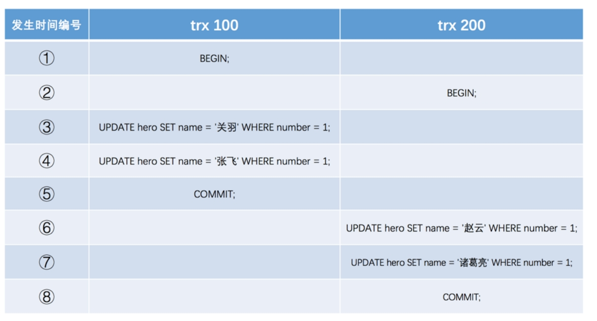

[toc]

# MySQL笔记14-MVCC

## 什么是MVCC？

MVCC全称是多版本并发控制 (Multi-Version Concurrency Control)。

## 为什么要有MVCC？

在数据库中，当多事务（多线程）并发访问同一个数据的时候，我们通常使用锁来保证线程的安全性。

但是由于读锁和写锁是具有互斥性的。因此只有读读之间的操作才可以让多线程并发执行。读写，写读，写写操作都只能让一个线程执行，其余线程进入阻塞状态。这样就会导致MySQL的并发性能极差。

而数据库使用MVCC机制后，可以让多线程在读写，写读操作中并发执行。虽然写写操作还是相互阻塞，但是能够大大提高了MySQL的并发性能。

即：
- 使用MVCC之前：读读并发执行。读写，写读，写写阻塞。
- 使用MVCC之后：读读，读写，写读并发执行。写写阻塞。

小结：MVCC可以让数据库在并发执行读写操作的时候，读写操作不互相阻塞。从而提高了数据库的并发性能。

## MVCC的实现原理

MVCC的实现原理主要是通过 隐藏字段,undo-log 日志,ReadView 来实现的。

### 隐藏字段

对于使用 InnoDB 存储引擎的表来说，每个表都有隐藏字段。如下

- DB_ROW_ID字段： 隐藏主键ID字段。如果表没有设置主键字段，InnoDB会创建DB_ROW_ID字段作为主键字段。
- DB_TRX_ID : 写事务ID字段。如果一个事务对行记录进行了写操作（插入/更新/删除），那么这个字段会记录这个写事务的ID。如果是读操作，那么记录的事务ID是0。
- IDDB_ROLL_PTR : 回滚指针字段。指向这条记录的上一个版本。

如图所示

### undo-log 日志

当数据库对行记录进行写操作（插入/更新/删除）的时候。为了保证事务回滚的时候，能够还原行记录。因此数据库会生成一个undo-log日志，然后把行记录的数据保存到undo-log日志中，然后再对行记录进行写操作。当事务进行回滚的时候，数据库就读取undo日志中的行记录，来进行数据还原。

undo日志分为3种：
- Insert undo-log ：插入一条行记录时，先把这条记录的主键值记下来，之后事务回滚的时候把这个主键值对应的记录删掉即可。
- Update undo-log：修改一条行记录时，先把修改这条记录前的旧值都记录下来，之后事务回滚时再用旧值替换新值即可。
- Delete undo-log：删除一条记录时，先把这条记录保存下来，之后事务回滚时再把记录插入到表中即可。

### undo-log日志链

由于事务对行记录进行写操作的时候，数据库会生成一个undo-log日志记录事务对行记录的操作。

当多个事务并发操作同一条行记录的时候，数据库会为每一个事务创建一个undo-log日志。并将这些事务对行记录的操作按事务执行的先后顺序和链表的方式，将每个事务的undo-log日志串连起来。形成了一个undo-log日志链。这个undo-log日志链，记录了这条行记录的所有版本信息。

例如：有一个表，表中已经存在一条记录。有两个事务id分别为100，200的事务对某条记录进行写操作。

图中的刘备数据，是由ID为80的事务插入到数据库的，是行记录最初的信息。

如上图所示，每次对行记录进行改动，数据库都会生成一个undo日志,undo日志记录了行记录的版本信息。所有的undo日志都通过roll_pointer指针互相连接起来，串成一个undo日志链表。

### ReadView

当一个事务对行记录进行读操作的时候，由于undo-log日志链中存在行记录的各个版本信息。那么这个读事务该读取行记录那个版本呢？

因此数据库提供了一个ReadView的概念。用于判断事务应该读取undo-log日志链中的哪个版本。

PS:当一个事务读取行记录的时候，数据库会为该事务创建一个ReadView。ReadView有四个重要的参数。

#### ReadView的四个参数

- creator_trx_id：是指创建这个ReadView的事务的trx_id。
- m_ids：是指在创建ReadView时，当前系统中活跃的事务的ID集合 (“活跃"是指事务启动了但还没提交)。可以理解为undo-log日志链中所有未提交事务的ID集合。
- min_trx_id：是指最小的事务id。也就是 m_ids 中的最小值。
- max_trx_id：表示生成 ReadView 时，系统中应该分配给下一个事务的 id 值。

#### 对creator_trx_id的详细解释

当某个事务对行记录进行写操作的时候，数据库才会为这个事务分配一个事务id。如果这个事务一直都是读操作的话，那么数据库不会为这个事务分配事务ID，即只读只读事务中的事务id都默认为0。

例如一个事务A，先读，再写，再读。
1. 事务A第一次读的时候，数据库不会为事务A分配id,即id默认为0。此时事务A的ReadView的creator_trx_id是0。
2. 当事务A再写的时候，数据库会为事务A分配id,例如100。
3. 当事务A再读的时候，此时事务A的ReadView的creator_trx_id是100。

#### 对max_trx_id 的详细解释

max_trx_id并不是m_ids中的最大值。例如undo-log日志链中有id为1，2，3这三个未提交事务。

当id为3的事务提交后。那么一个新的读事务在生成ReadView时，m_ids就包括1和2，min_trx_id的值是1，max_trx_id的值就是4。

一般而言，max_trx_id就是m_ids的最大值+1

#### 小结

当一个事务读取行记录的时候。数据库会为该事务创建一个ReadView。通过这个ReadView来判断这个事务，应该读取这个行记录所对应的undo-log日志链中哪一个版本数据。

### ReadView的可见性判断算法

当一个事务读取行记录的时候。数据库会为该事务创建一个ReadView。通过这个ReadView来判断这个事务，应该读取这个行记录所对应的undo-log日志链中哪一个版本数据。

打个比方：有一个事务A要读取一个行记录R1，这个行记录R1有对应的undo-log日志链。并且数据库会为事务A创建一个ReadView。

> 判断步骤如下：

1. 事务A首先读取undo-log日志链中的第一个版本节点（最新版本数据）。
2. 然后事务A将节点的 trx_id 与 事务A的ReadView进行对比。
3. 对比方式是ReadView的可见性判断算法。如下文。
4. 如果通过可见性判断算法，判断出事务A不能读取该节点。那么事务A开始读取undo-log日志链中的下一个节点。然后进入到步骤2，依次类推。
5. 最后如果事务A都不能读取undo-log日志链中所有的节点。那么表示事务A无法读取该行记录。

小结：即事务A依次读取undo-log日志链中每个节点的数据，并判断该节点数据能否被事务A读取。从头节点到尾节点开始判断，直到找到能读取的节点为止。如果所有节点都不能被事务A可见。那么表示事务A不能读取这条行记录，查询结果就不包含该行记录。

> 可见性判断算法如下：

注意：trx_id是指undo-log日志链表中某个版本节点的trx_id。事务A是指当前读事务。

1. 当 trx_id = creator_trx_id 时，表示这个版本节点的数据是该事务A修改的，因此这个节点对于事务A可见。
2. 当 trx_id < min_trx_id 时: 表示这个节点已经被其他事务提交了。因此该节点的trx_id不在m_ids数组中。因此这个节点对于事务A可见。
3. 当 trx_id >= max_trx_id 时: 表示这个节点是在事务A创建ReadView之后出现的。因此这个节点对于事务A不可见。
4. 当 min_trx_id <= trx_id < max_trx_id 时：有两个情况。
   1. trx_id 在 m_ids 列表里面：表示该节点数据还没有被事务提交，那么事务A不能读取未提交节点数据。则表示该节点对于事务A不可见。
   2. trx_id 不在 m_ids 列表里面: 表示该节点已经被事务提交了，因此事务A可以读取该节点数据。则表示该节点对于事务A可见。

## MVCC和隔离级别的关系

数据库事务有四种隔离级别，其中读已提交和可重复读这两个隔离级别与MVCC相关。即读已提交和可重复读这两个隔离级别的实现方式就是通过MVCC来实现的。

读已提交和可重复读这两个隔离级别，它们最大的区别是内部的MVCC机制中生成ReadView的时机不同。

- 读已提交：事务A在每次读取行记录的时候，都会生成一个新的ReadView。
- 可重复读：事务A只在第一次读取行记录的时候，会生成一个ReadView。之后事务A再次读取行记录，都会复用第一次生成的ReadView。

注意：不同事务生成的ReadView是独立的。即事务A和事务B生成的ReadView不能混用。

### 读已提交中的MVCC-每次生成新的ReadView

若事务是读已提交的隔离级别，那么MVCC机制会在事务每次读取行记录的时候，都会生成一个新的ReadView。

#### 模拟多事务执行流程

>假设1: 目前有一个行记录R1，该记录中name字段的值为`小明`。该记录是由已提交事务80插入到表中的。
>假设2: 现在有四个事务，同时并发读写这个行记录R1。事务执行顺序如下表所示。

事务100，200，300，400的执行顺序如下表所示

模拟多事务并发的流程如下：

1. 首先经过了T1,T2,T3时刻。此时行记录R1的undo-log日志链如下图所示。

2. 当来到T4时刻，事务300要读取行记录R1。读取流程如下：
   1. 事务300读取行记录R1的时候，由于事务300的读已提交隔离级别。数据库会为事务300生成一个ReadView。这个ReadView的m_ids = [100,200], min_trx_id = 100, max_trx_id = 201, creator_trx_id = 0 。并且由于事务300第一次是读操作，所以数据库没有为事务300分配事务id,所以creator_trx_id的值为0。
   2. 然后事务300开始读取undo-log日志链的第一个节点（头节点，最新版本）。
   3. 由于第1个节点的trx_id为200，在m_ids数组中。即该节点数据未被事务提交。所以该节点对于事务300不可见。根据roll_pointer指针,读取下一个节点。
   4. 由于第2个节点的trx_id为100，在m_ids数组中。即该节点数据未被事务提交。所以该节点对于事务300不可见。根据roll_pointer指针,读取下一个节点。
   5. 由于第3个节点的trx_id为100，在m_ids数组中。即该节点数据未被事务提交。所以该节点对于事务300不可见。根据roll_pointer指针,读取下一个节点。
   6. 由于第4个节点的trx_id为80，不在m_ids数组中。并且80 < min_trx_id。表示这个节点的数据在事务300生成ReadView之前，就已经被事务80提交了。所以该节点对于事务300可见。
   7. 最后事务300读取行记录R1的结果就是小明。

3. 当经过了T5,T6时刻。此时行记录R1的undo-log日志链如下图所示。

T5时刻事务100提交。T6时刻事务300修改行记录R1。

4. 当来到T7时刻，事务400要读取行记录R1。读取流程如下：
   1. 事务400在读取行记录R1的时候，由于事务400的读已提交隔离级别。数据库会为事务400重新生成一个ReadView。此时这个ReadView的m_ids = [200,300], min_trx_id = 200, max_trx_id = 301, creator_trx_id = 0 。
   2. 然后事务400开始读取undo-log日志链的第一个节点。
   3. 由于第1个节点的trx_id为300，在m_ids数组中。即该节点数据未被事务提交。所以该节点对于事务400不可见。根据roll_pointer指针,读取下一个节点。
   4. 由于第2个节点的trx_id为200，在m_ids数组中。即该节点数据未被事务提交。所以该节点对于事务400不可见。根据roll_pointer指针,读取下一个节点。
   5. 由于第3个节点的trx_id为100，不在m_ids数组中。并且100 < min_trx_id。表示这个节点的数据在事务400生成ReadView之前，就已经被事务100提交了。所以该节点对于事务400可见。
   6. 最后事务400读取行记录R1的结果就是B。

5. 当经过了T8,T9时刻。此时行记录R1的undo-log日志链如下图所示。

T8时刻事务200修改行记录R1。T9时刻事务200提交。

6. 当来到T10时刻，事务300要读取行记录R1。读取流程如下：
   1. 事务300在读取行记录R1的时候，由于事务300的读已提交隔离级别。数据库会为事务300重新生成一个ReadView。此时这个ReadView的m_ids = [300], min_trx_id = 300, max_trx_id = 301, creator_trx_id = 300 。由于此时的事务300之前进行了写操作，所以数据库为事务300分配了事务id，所以creator_trx_id = 300。
   2. 然后事务300开始读取undo-log日志链的第一个节点。
   3. 由于第1个节点的trx_id为200，不在m_ids数组中。并且200 < min_trx_id。表示这个节点的数据在事务300生成ReadView之前，就已经被事务200提交了。所以该节点对于事务300可见。
   4. 最后事务300读取行记录R1的结果是E。

### 可重复读中的MVCC-每次使用第一次生成的ReadView

若事务是可重复读的隔离级别，那么MVCC机制会在事务每次读取行记录的时候，每次复用该事务第一次生成的ReadView。

注意：ReadView中的creator_trx_id 不会被复用。

#### 模拟多事务执行流程

可重复读的MVCC模拟过程与读已提交的MVCC模拟过程前面相同。并且这两个模拟过程的undo-log日志链是相同的。

模拟多事务并发的流程如下：
1. T4时刻, 事务300第一次读行记录R1的分析和结果与上文相同。
2. T7时刻, 事务400第一次读行记录R1的分析和结果与上文相同。
3. 当经过了T8,T9时刻。此时行记录R1的undo-log日志链如下图所示。

T8时刻事务200修改行记录R1。T9时刻事务200提交。

4. 当来到T10时刻。事务300要读取行记录R1。读取流程如下：
   1. 事务300在读取行记录R1的时候，由于事务300是可重复读隔离级别，因此事务300的ReadView是之前第一次生成的ReadView。即这个ReadView的m_ids = [100,200], min_trx_id = 100, max_trx_id = 201, creator_trx_id = 300。由于此时的事务300之前进行了写操作，所以数据库为事务300分配了事务id，所以creator_trx_id = 300。
   2. 然后事务300开始读取undo-log日志链的第一个节点。
   3. 由于第1个节点的trx_id为200，在m_ids数组中。所以该节点对于事务300不可见。根据roll_pointer指针,读取下一个节点。
   4. 由于第2个节点的trx_id为300，300 = creator_trx_id 。因此表示这个节点是由当前事务300更改的。因此该节点对于事务300可见/
   5. 最后事务300读取行记录R1的结果是D。

## 什么是当前读和快照读

有了MVCC机制，可以让数据库的读写操作并发执行，即读写操作不互斥了。

- 当前读：当数据库执行`select lock in share mode(共享锁), select for update ; update, insert ,delete `等SQL操作的时候，数据库会对读取的记录进行加锁，从而确保其他并发事务不能修改当前记录。

- 快照读：对于不加锁的select操作就是快照读，即不加锁的非阻塞读。快照读的实现方式就是MVCC(多版本并发控制)。

