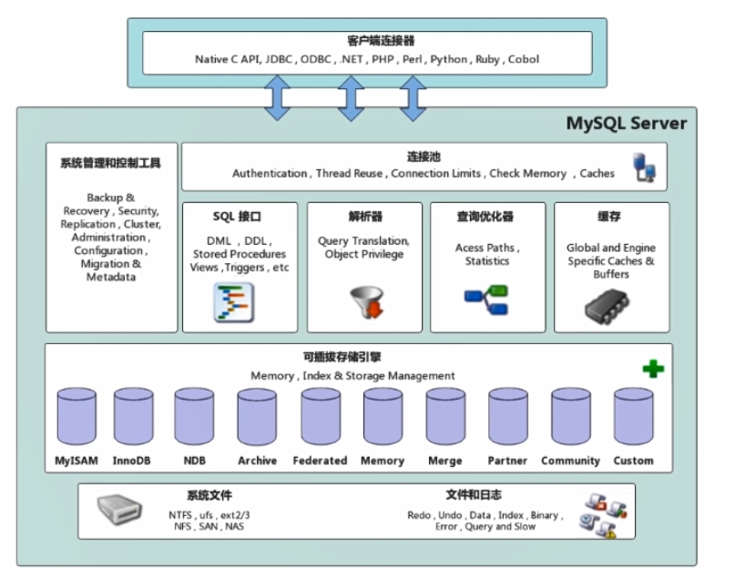

[toc]

# MySQL笔记15-底层

## MySQL架构

MySQL架构图如下所示

### 客户端连接器

客户端连接器负责与客户端进行通信。客户端连接器主要对接各个MySQL客户端。例如JDBC，navicat等。

### 连接池

连接池主要是存储和管理，客户端与服务端的数据库连接，一个数据库连接代表一个线程。。

当客户端与服务端建立好连接后，客户端就可以向服务端发送SQL语句了。

### 缓存

缓存会记录Mysql执行过的查询语句，以key-value键值对的方式存储在缓存中。key是查询语句，value是查询结果。

1. 当Mysql服务端接收到客户端发过来的SQL语句后，如果是一个查询SQL语句，那么服务端会首先到缓存中查找是否存在过这个查询SQL语句。
2. 如果SQL语句在缓存中，则直接从缓存中把查询结果返回给客户端。
3. 如果SQL语句不在缓存中，则执行后面步骤。并将查询结果存入缓存中。

缓存的缺点：建议不要使用查询缓存，因为查询缓存的失效非常频繁

注意：MySQL 8.0版本直接将缓存的整块功能删掉了，标志着MySQL8.0开始彻底没有缓存这个功能了。

### 解析器

如果SQL语句没有命中查询缓存，那么服务端中的解析器会对客户端传来的SQL语句进行解析。

1. 服务端中的解析器会对SQL语句进行解析。
2. 解析器会对SQL语句进行解析。例如把关键字从SQL语句中提取出来。
3. 解析器也会判断SQL语句是否出现语法错误。

如果解析器对SQL语句解析后，没有报错。此时SQL语句会进入优化器。

### 优化器

当解析器将SQL语句解析完成后，如果没有报错。说明SQL语句是符合语法并且可以执行的。此时解析器会把SQL语句传递给优化器。

优化器会对SQL语句进行优化。

若表有个组合索引（A,B,C）。当SQL语句是`select ... where B=x and A=x and C=x`。如果按照最左前缀原则，这个查询语句是不会触发组合索引的。但是优化器会把这个SQL语句优化为`select ... where A=x and B=x and C=x`。

当优化器将SQL语句优化完之后，会把优化后的SQL语句传递给执行器。

### 执行器

当执行器接收到优化器传递的SQL语句后，执行器会调用对应的存储引擎执行 SQL语句。主流的是MyISAM 和 Innodb 存储引擎。

### 存储引擎

存储引擎是真正执行SQL语句的。

### 物理文件存储层

物理存储层主要是将数据库的数据和日志存储在文件中，并与存储引擎打交道。

物理文件主要包括：数据文件，日志文件，配置文件，pid文件等。

数据文件是指：.ibd文件或.ibdata文件等，这些是存放数据或存放索引的文件。

日志文件是指：错误日志，bin日志等。

配置文件是指：存放MySQL所有的配置信息的文件，比如：my.cnf、my.ini等。

pid文件是指：进程文件，即mysql中的可执行文件等。

