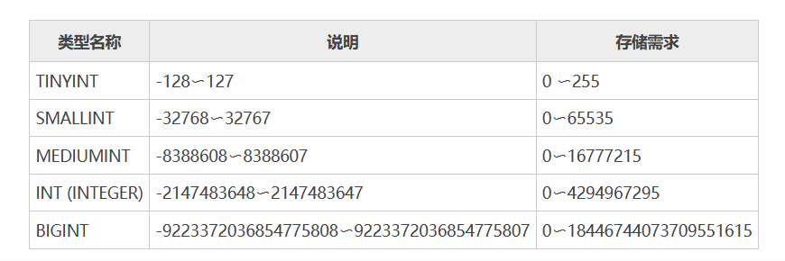
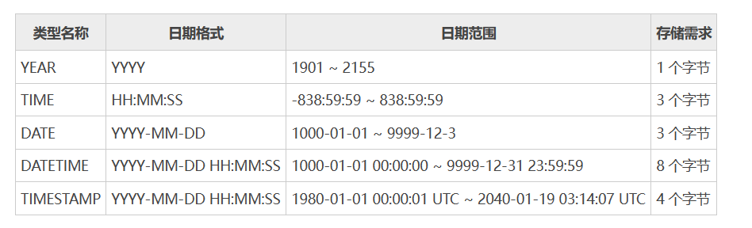
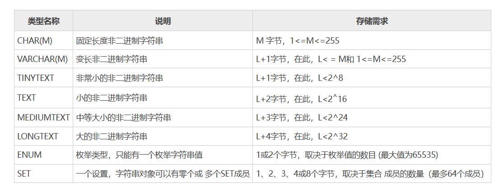
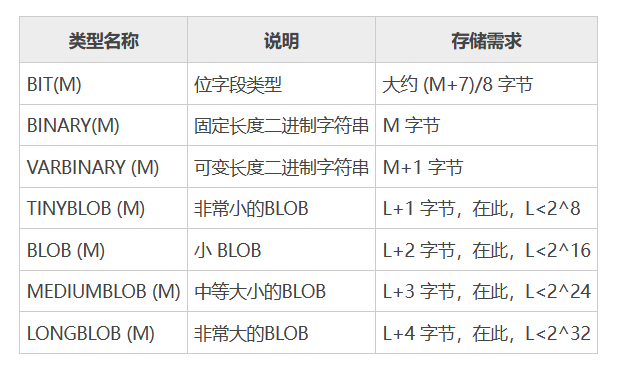
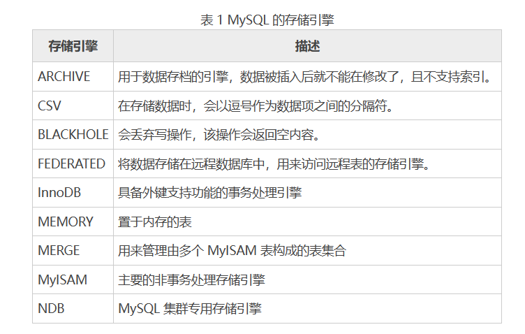
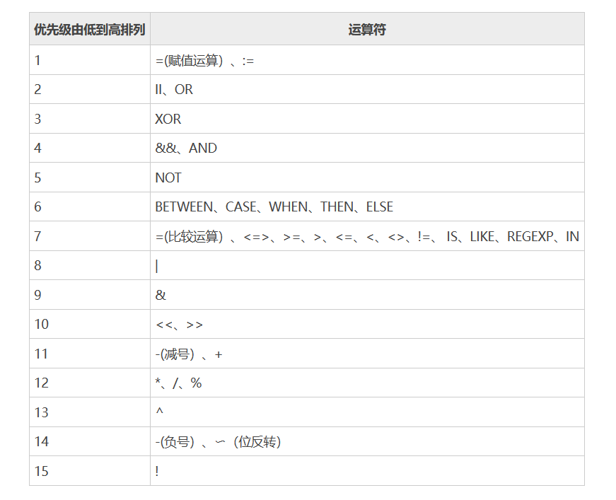
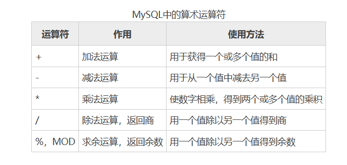
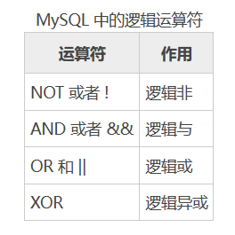
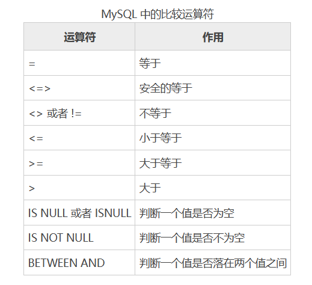
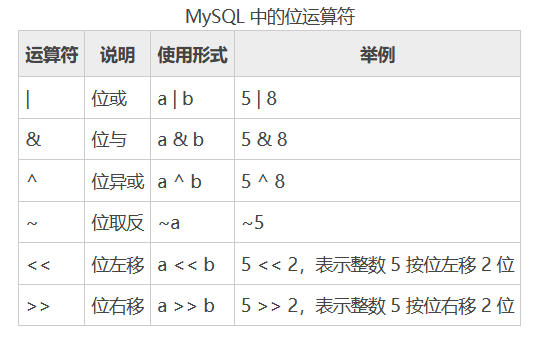

[toc]

# MySQL笔记2

## SQL是什么？

SQL是一种数据库查询和程序设计语言，用于存取数据以及查询、更新和管理关系数据库系统。

SQL 具有如下优点。
* 不区分大小写：SQL 语句不区分大小写
* 一体化：SQL 集数据定义、数据操作和数据控制于一体，可以完成数据库中的全部工作。
* 使用方式灵活：SQL 具有两种使用方式，可以直接以命令方式交互使用；也可以嵌入使用，嵌入C、C++、Fortran、COBOL、Java 等语言中使用。
* 语言简洁、语法简单：该语言的语句都是由描述性很强的英语单词组成，而且这些单词的数目不多。

<font color="red">

注意：

大多数数据库都支持通用的 SQL 语句，同时不同的数据库具有各自特有的 SQL 语言特性。

标准 SQL 是指符合国际标准的 SQL，而非某个数据库厂商的 SQL 语法（如：Microsoft SQL Server 的 T-SQL，Oracle 的 PL/SQL，MySQL）。

标准 SQL 可以在任何数据库中使用，而数据库厂商的 SQL 只适合它们对应的数据库，如 T-SQL 只适合 Microsoft SQL Server。

</font>

## 数据库

在 MySQL 数据库中存在系统数据库和自定义数据库，系统数据库是在安装 MySQL 后系统自带的数据库，自定义数据库是由用户定义创建的数据库。

下面是操作数据库的Mysql语法

### 创建数据库

在 MySQL 中，可以使用 CREATE DATABASE 语句创建数据库，语法格式如下：

```sql
## 语法格式
CREATE DATABASE <数据库名>
[[DEFAULT] CHARACTER SET <字符集名>] 
[[DEFAULT] COLLATE <校对规则名>];

## 创建school_db数据库
create database school_db;

## 创建数据库指定字符集和校对规则
CREATE DATABASE IF NOT EXISTS school_db_2
DEFAULT CHARACTER SET utf8
DEFAULT COLLATE utf8_chinese_ci;

```

* `[DEFAULT] CHARACTER SET`：指定数据库的字符集。指定字符集的目的是为了避免在数据库中存储的数据出现乱码的情况。如果在创建数据库时不指定字符集，那么就使用系统的默认字符集。
* `[DEFAULT] COLLATE`：指定字符集的默认校对规则。


### 显示数据库

在 MySQL中，可使用SHOW DATABASES 语句来查看或显示当前用户权限范围以内的数据库。查看数据库的语法格式为：

```sql
## like用于匹配数据库名称
SHOW DATABASES [LIKE '数据库名'];

## 查询名称为school_db的数据库
SHOW DATABASES LIKE 'school_db';

## 显示所有数据库
show databases;
```

### 修改数据库

在 MySQL 中，可以使用 ALTER DATABASE 来修改已经被创建或者存在的数据库的相关参数。修改数据库的语法格式为：

```sql
ALTER DATABASE [数据库名] { 
[ DEFAULT ] CHARACTER SET <字符集名> |
[ DEFAULT ] COLLATE <校对规则名>}

## 修改数据库 test_db 的指定字符集修改为 gb2312
## 默认校对规则修改为 gb2312_unicode_ci
ALTER DATABASE test_db
DEFAULT CHARACTER SET gb2312
DEFAULT COLLATE gb2312_chinese_ci;
```

### 删除数据库

在MySQL中，当需要删除已创建的数据库时，可以使用 DROP DATABASE 语句。其语法格式为：

```sql
DROP DATABASE <数据库名>

# 删除数据库test_db
DROP DATABASE test_db;
```

<font color="red">注意：MySQL 安装后，系统会自动创建名为 information_schema 和 mysql 的两个系统数据库，系统数据库存放一些和数据库相关的信息，如果删除了这两个数据库，MySQL 将不能正常工作。</font>

### 连接或切换数据库

在 MySQL 中，USE 语句用来完成一个数据库到另一个数据库的跳转。

```sql
use 数据库名;

# 当前数据库切换为test_db
USE test_db;
```

### 显示当前使用的数据库名称

```sql
## 该语句会显示当前使用的数据库是什么
select database();
```

## 注释

MySQL 注释分为单行注释和多行注释。

注释在 SQL 语句中用来标识说明或者注意事项的部分，对 SQL 的执行没有任何影响。因此，注释内容中无论是英文字母还是汉字都可以随意使用。

<font color="red">任何注释都可以放在 SQL 语句中的任意位置。</font>

### 单行注释

单行注释可以使用`#`注释符，`#`注释符后直接加注释内容。格式如下

```sql
# 单行注释内容
USE test_db;
```

单行注释还可以使用--注释符，--注释符后需要加一个空格，注释才能生效。格式如下

```sql
-- 注释内容
USE test_db;
```

### 多行注释

多行注释使用`/* */`注释符。`/*`用于注释内容的开头，`*/`用于注释内容的结尾。多行注释格式如下：

```sql
/*
  第一行注释内容
  第二行注释内容
*/
USE test_db;
```

## MySQL数据类型

在MySQL中数据类型定义表中的字段可以存储什么数据以及该数据怎样存储的规则。

表中的每个字段都应该有适当的数据类型，用于限制或允许该字段存储的数据。例如，年龄字段存储数字，则相应的数据类型应该为数值类型。

如果使用错误的数据类型可能会严重影响应用程序性能以及导致数据丢失，所以在设计表时，必须为每个字段设置正确的数据类型和长度。

> MySQL 的数据类型有大概可以分为下面 5 种。

```
数值类型
   - 整数类型： tinyint、smallint、mediumint、int、bigint
   - 浮点数类型：float 和 double
   - 定点数类型：decimal
日期时间类型：year、time、date、datetime,timestamp
字符串类型： char、varchar、binary、varbinary、blob、text、enum ，set 等。
二进制类型：bit、binary、varbinary、tinyblob、blob、mediumblob 和 longblob
```

<font color="red">注意：定义字段的数据类型对数据库的优化是十分重要的。</font>


### 整数类型

整数类型： TINYINT、SMALLINT、MEDIUMINT、INT、BIGINT

```
tinyInt         1个字节(8位二进制)
smallint        2个字节
mediumint       3个字节
int             4个字节
bigint          8个字节
```

取值范围：


### 浮点数和定点数类型

浮点数类型：FLOAT 和 DOUBLE。定点数类型：DECIMAL

```
float     单精度浮点数    4个字节
double    双精度浮点数    8个字节
```

定点数以字符串形式存储，在对精度要求比较高的时候（如货币、科学数据），使用 定点数 DECIMAL 的类型比较好，

### 日期时间类型

日期时间类型：YEAR、TIME、DATE、DATETIME,TIMESTAMP

取值范围：



TIMESTAMP 与 DATETIME 除了存储字节和支持的范围不同外，还有一个最大的区别是：
* DATETIME 在存储日期数据时，按实际输入的格式存储，即输入什么就存储什么，与时区无关；
* TIMESTAMP 值的存储是以 UTC（世界标准时间）格式保存的，存储时对当前时区进行转换，检索时再转换回当前时区。即查询时，根据当前时区的不同，显示的时间值是不同的。

### 字符串类型

字符串类型：CHAR、VARCHAR、BINARY、VARBINARY、BLOB、TEXT、ENUM ，SET 等。

下表中列出了 MySQL 中的字符串数据类型，括号中的M表示可以为其指定长度。


VARCHAR 和 TEXT 类型是变长类型，其存储需求取决于列值的实际长度（在前面的表格中用 L 表示），而不是取决于类型的最大可能尺寸。

例如，一个 VARCHAR(10) 列能保存一个最大长度为 10 个字符的字符串，实际的存储需要字符串的长度 L 加上一个字节以记录字符串的长度。对于字符 “abcd”，L 是 4，而存储要求 5 个字节。

> varchar与char的区别?
* char表示定长字符串，长度是固定的；如果插入数据的长度小于char的固定长度时，则用空格填充；因为长度固定，所以存取速度要比varchar快很多，甚至能快50%，但正因为其长度固定，所以会占据多余的空间，是空间换时间的做法；
* varchar表示可变长字符串，长度是可变的；插入的数据是多长，就按照多长来存储；varchar在存取方面与char相反，它存取慢，因为长度不固定，但正因如此，不占据多余的空间，是时间换空间的做法；
* 总之，结合性能角度（char更快）和节省磁盘空间角度（varchar更小），具体情况还需具体来设计数据库才是妥当的做法。


### 二进制类型

二进制类型：BIT、BINARY、VARBINARY、TINYBLOB、BLOB、MEDIUMBLOB 和 LONGBLOB

下表中列出了 MySQL 中的二进制数据类型，括号中的M表示可以为其指定长度。



### 数据类型如何选择？

MySQL 提供了大量的数据类型，为了优化存储和提高数据库性能，在任何情况下都应该使用最精确的数据类型。

一般来说，用数值类型列存储数字、用字符类型列存储字符串、用时态类型列存储日期和时间。

> 数值

* 如果要存储的数字是整数（没有小数部分），则根据整数的范围来选择合适的整数类型。
* 如果要存储的数字是小数（有小数部分），一般选择 FLOAT 类型。

> 货币

如果存储的数据为货币，并且需要计算时。FLOAT 和 DOUBLE 类型都存在四舍五入的误差问题，因此不太适合。可以把货币表示成 DECIMAL(M,2) 类型，其中 M 为所需取值范围的最大宽度。这种类型的数值可以精确到小数点后 2 位。DECIMAL定点数类型的优点在于不存在舍入误差，计算是精确的。

> 日期和时间

* 如果只需要记录年份，则使用 YEAR 类型即可。
* 如何只记录年份与日期。则使用 DATE 类型即可。
* 如果只记录时间，可以使用 TIME 类型。
* 如果同时需要记录日期和时间，则可以使用 TIMESTAMP 或者 DATETIME 类型。存储较大的日期最好使用 DATETIME。

> 字符串

字符串类型都有长度的概念。

* 如果需要存储的字符串短于 256 个字符，那么可以使用 CHAR、VARCHAR 或 TINYTEXT。
* 如果需要存储更长一点的字符串，则可以选用 VARCHAR 或某种更长的 TEXT 类型。
* 如果某个字符串列用于表示某种固定集合的值，那么可以考虑使用数据类型 ENUM 或 SET。

> 二进制数据

BLOB 是二进制字符串，TEXT 是非二进制字符串，两者均可存放大容量的信息。BLOB 主要存储图片、音频信息等，而 TEXT 只能存储纯文本文件。


## MySQL存储引擎

数据库的存储引擎决定了表在计算机中的存储方式。不同的存储引擎提供不同的存储机制、索引技巧、锁定水平等功能，使用不同的存储引擎还可以获得特定的功能。

MySQL 目前支持的存储引擎有 InnoDB、MyISAM、Memory、Merge、Archive、CSV、BLACKHOLE 等。我们可以针对具体的要求，可以对每一个表使用不同的存储引擎。




### MyISAM 存储引擎

mysql-5.1版本之前默认存储引擎是MyISAM，之后是innoDB。

MyISAM 存储引擎不支持事务，也不支持行级锁和外键。所以访问速度比较快。如果系统主要以读取和写入为主，只有少量的更新和删除操作，并且对事务的完整性、并发性要求不是很高，那么选择 MyISAM 存储引擎是非常适合的。

MyISAM 是在 Web 数据仓储环境下是最常使用的存储引擎之一。

### Innodb 存储引擎

MySQL 5.5 版本之后默认的事务型引擎修改为 InnoDB。
 
InnoDB 存储引擎提供了对数据库ACID事务的支持。并且还提供了行级锁和外键的约束。它的设计的目标就是处理大数据容量的数据库系统。

如果系统对事务的完整性有比较高的要求，在并发条件下要求数据的一致性，数据操作除了插入和查询以外，还包括很多的更新、删除操作，那么 InnoDB 存储引擎是比较合适的选择。
 
InnoDB 存储引擎除了可以有效地降低由于删除和更新导致的锁定，还可以确保事务的完整提交和回滚，对于类似计费系统或者财务系统等对数据准确性要求比较高的系统，InnoDB 都是合适的选择。

### MEMORY 存储引擎

MEMORY 存储引擎将所有数据保存在内存中，所以该存储引擎的数据访问速度快，但是安全上没有保障。
 
MEMORY 对表的大小有限制，太大的表无法缓存在内存中。由于使用 MEMORY 存储引擎没有安全保障，所以要确保数据库异常终止后表中的数据可以恢复。
 
如果系统中涉及数据比较少，且需要进行快速访问，则适合使用 MEMORY 存储引擎。

### 查看和临时修改默认存储引擎

```
## 该语句会查询mysql当前默认存储引擎
SHOW VARIABLES LIKE 'default_storage_engine%';

## 该语句会临时修改mysql当前默认存储引擎
## 重启mysql后就恢复了
SET default_storage_engine= <存储引擎名>

```

如果希望永久修改mysql默认的存储引擎，就需要修改my.ini配置文件。在my.ini配置文件的`[mysqld]`后面加入以下语句：

```
default-storage-engine=存储引擎名称
```

### 修改表的存储引擎

MySQL 中修改数据表的存储引擎的语法格式如下：

```sql
ALTER TABLE <表名> ENGINE=<存储引擎名>;

## 将 student 表的存储引擎修改为 MyISAM 类型
ALTER TABLE student ENGINE=MyISAM;
```


## MySQL运算符

MySQL中的运算符可以直接对表中数据或字段进行运算。

MySQL支持4种运算符，分别是:
* 算术运算符
* 比较运算符
* 逻辑运算符
* 位运算符

下图是各个运算符的优先级



### 算术运算符

算术运算符用于执行算术运算，例如：加、减、乘、除等。



```sql
## 对表中的 num 字段的值进行加法和减法的运算
SELECT num,num+10,num-3+5,num+36.5 FROM test_db;
## 对表中的 num 进行乘法、除法运算
SELECT num,num*2,num/2,num/3,num%3 FROM temp;
## 取余运算，还可以使用 MOD(a,b) 函数，MOD(a,b) 相当于 a%b
SELECT MOD(num,3) FROM temp;
```

### 逻辑运算符

逻辑运算符包括与、或、非等。其返回值为布尔型，真值（1 或 true）和假值（0 或 false）。



> 逻辑非（NOT 或者 !）

NOT和!都是逻辑非运算符，返回和操作数相反的结果。具体语法规则为：
* 当操作数为 0（假）时，返回值为 1；
* 当操作数为非零值时，返回值为 0；
* 当操作数为 NULL 时，返回值为 NULL。

>例子
```sql
mysql> SELECT NOT 10,NOT(1-1),NOT-5,NOT NULL,NOT 1+1;
+--------+----------+-------+----------+---------+
| NOT 10 | NOT(1-1) | NOT-5 | NOT NULL | NOT 1+1 |
+--------+----------+-------+----------+---------+
|      0 |        1 |     0 |     NULL |       0 |
+--------+----------+-------+----------+---------+

mysql> SELECT !10,!(1-1),!-5,!NULL,!1+1;
+-----+--------+-----+-------+------+
| !10 | !(1-1) | !-5 | !NULL | !1+1 |
+-----+--------+-----+-------+------+
|   0 |      1 |   0 |  NULL |    1 |
+-----+--------+-----+-------+------+
```

> 逻辑与（AND 或者 &&）

AND 和 && 都是逻辑与运算符，具体语法规则为：
* 当所有操作数都为非零值并且不为 NULL 时，返回值为 1；
* 当一个或多个操作数为 0 时，返回值为 0；
* 操作数中有任何一个为 NULL 时，返回值为 NULL。

>例子
```sql
mysql> SELECT 1 AND -1,1 AND 0,1 AND NULL, 0 AND NULL;
+----------+---------+------------+------------+
| 1 AND -1 | 1 AND 0 | 1 AND NULL | 0 AND NULL |
+----------+---------+------------+------------+
|        1 |       0 |       NULL |          0 |
+----------+---------+------------+------------+

mysql> SELECT 1 && -1,1&&0,1&&NULL,0&&NULL;
+---------+------+---------+---------+
| 1 && -1 | 1&&0 | 1&&NULL | 0&&NULL |
+---------+------+---------+---------+
|       1 |    0 |    NULL |       0 |
+---------+------+---------+---------+
```


> 逻辑或（OR 或者 ||）

OR 和 || 都是逻辑或运算符，具体语法规则为：
* 当两个操作数都为非 NULL 值时，如果有任意一个操作数为非零值，则返回值为 1，否则结果为 0；
* 当有一个操作数为 NULL 时，如果另一个操作数为非零值，则返回值为 1，否则结果为NULL；
* 假如两个操作数均为 NULL 时，则返回值为 NULL。

>例子
```sql
mysql> SELECT 1 OR -1 OR 0,1 OR 2,1 OR NULL, 0 OR NULL, NULL OR NULL;
+--------------+--------+-----------+-----------+--------------+
| 1 OR -1 OR 0 | 1 OR 2 | 1 OR NULL | 0 OR NULL | NULL OR NULL |
+--------------+--------+-----------+-----------+--------------+
|            1 |      1 |         1 |      NULL |         NULL |
+--------------+--------+-----------+-----------+--------------+

mysql> SELECT 1 || -1 || 0,1||2,1||NULL,0||NULL,NULL||NULL;
+--------------+------+---------+---------+------------+
| 1 || -1 || 0 | 1||2 | 1||NULL | 0||NULL | NULL||NULL |
+--------------+------+---------+---------+------------+
|            1 |    1 |       1 |    NULL |       NULL |
+--------------+------+---------+---------+------------+
```


> 异或运算（XOR 运算符）

XOR 表示逻辑异或，具体语法规则为：
* 当任意一个操作数为 NULL 时，返回值为 NULL；
* 对于非 NULL 的操作数，如果两个操作数都是非 0 值或者都是 0 值，则返回值为 0；
* 如果一个为0值，另一个为非 0 值，返回值为 1。

>例子
```sql
mysql> SELECT 1 XOR 1,0 XOR 0,1 XOR 0,1 XOR NULL,1 XOR 1 XOR 1;
+---------+---------+---------+------------+---------------+
| 1 XOR 1 | 0 XOR 0 | 1 XOR 0 | 1 XOR NULL | 1 XOR 1 XOR 1 |
+---------+---------+---------+------------+---------------+
|       0 |       0 |       1 |       NULL |             1 |
+---------+---------+---------+------------+---------------+
```


### 比较运算符

比较运算符包括大于、小于、等于之类。主要用于数值的比较、字符串的匹配等方面。比较结果为真，则返回 1，为假则返回 0，比较结果不确定则返回 NULL。




> 等于运算（=）

> = 运算符用来比较两边的操作数是否相等，相等的话返回 1，不相等的话返回 0。具体的语法规则如下：
* 若有一个或两个操作数为 NULL，则比较运算的结果为 NULL。
* 若两个操作数都是字符串，则按照字符串进行比较。
* 若两个操作数均为整数，则按照整数进行比较。
* 若一个操作数为字符串，另一个操作数为数字，则 MySQL 可以自动将字符串转换为数字。

> 例子
```
mysql> SELECT 1=0,'2'=2,2=2,'0.02'=0,'b'='b',(1+3)=(2+2),NULL=null;
+-----+-------+-----+----------+---------+-------------+-----------+
| 1=0 | '2'=2 | 2=2 | '0.02'=0 | 'b'='b' | (1+3)=(2+2) | NULL=null |
+-----+-------+-----+----------+---------+-------------+-----------+
|   0 |     1 |   1 |        0 |       1 |           1 |      NULL |
+-----+-------+-----+----------+---------+-------------+-----------+
```

> 安全等于运算符（<=>）

> <=> 操作符和 = 操作符类似，不过 <=> 可以用来判断 NULL 值，具体语法规则为：
* 当两个操作数均为 NULL 时，其返回值为 1 而不为 NULL；
* 当一个操作数为 NULL 时，其返回值为 0 而不为 NULL。

> 例子
```
mysql> SELECT 1<=>0,'2'<=>2,2<=>2,'0.02'<=>0,'b'<=>'b',(1+3) <=> (2+1),NULL<=>NULL;
+-------+---------+-------+------------+-----------+-----------------+-------------+
| 1<=>0 | '2'<=>2 | 2<=>2 | '0.02'<=>0 | 'b'<=>'b' | (1+3) <=> (2+1) | NULL<=>NULL |
+-------+---------+-------+------------+-----------+-----------------+-------------+
|     0 |       1 |     1 |          0 |         1 |               0 |           1 |
+-------+---------+-------+------------+-----------+-----------------+-------------+
```

> 不等于运算符（<> 或者 !=）

与 = 的作用相反，<> 和 != 用于判断数字、字符串、表达式是否不相等。对于 <> 和 !=，如果两侧操作数不相等，返回值为 1，否则返回值为 0；如果两侧操作数有一个是 NULL，那么返回值也是 NULL。

> 例子
```
mysql> SELECT 'good'<>'god',1<>2,4!=4,5.5!=5,(1+3)!=(2+1),NULL<>NULL;
+---------------+------+------+--------+--------------+------------+
| 'good'<>'god' | 1<>2 | 4!=4 | 5.5!=5 | (1+3)!=(2+1) | NULL<>NULL |
+---------------+------+------+--------+--------------+------------+
|             1 |    1 |    0 |      1 |            1 |       NULL |
+---------------+------+------+--------+--------------+------------+
```


> 小于等于（<=） 和  小于（<）

* `<=` 是小于等于运算符，用来判断左边的操作数是否小于或者等于右边的操作数；如果小于或者等于，返回值为 1，否则返回值为 0；如果两侧操作数有一个是 NULL，那么返回值也是 NULL。
* `<` 是小于运算符，用来判断左边的操作数是否小于右边的操作数；如果小于，返回值为 1，否则返回值为 0；如果两侧操作数有一个是 NULL，那么返回值也是 NULL。

> 例子
```
# 小于等于
mysql> SELECT 'good'<='god',1<=2,4<=4,5.5<=5,(1+3)<=(2+1),NULL<=NULL;
+---------------+------+------+--------+--------------+------------+
| 'good'<='god' | 1<=2 | 4<=4 | 5.5<=5 | (1+3)<=(2+1) | NULL<=NULL |
+---------------+------+------+--------+--------------+------------+
|             0 |    1 |    1 |      0 |            0 |       NULL |
+---------------+------+------+--------+--------------+------------+

# 小于
mysql> SELECT 'good'<'god'，1<2，4<4，5.5<5，(1+3)<(2+1)，NULL<NULL；
+--------------+-----+-----+-------+-------------+-----------+
| 'good'<'god' | 1<2 | 4<4 | 5.5<5 | (1+3)<(2+1) | NULL<NULL |
+--------------+-----+-----+-------+-------------+-----------+
|            0 |   1 |   0 |     0 |           0 |      NULL |
+--------------+-----+-----+-------+-------------+-----------+
```


> 大于等于（>=）和 大于（>）

* `>=` 是大于等于运算符，用来判断左边的操作数是否大于或者等于右边的操作数；如果大于或者等于，返回值为 1，否则返回值为 0；如果两侧操作数有一个是 NULL，那么返回值也是 NULL。
* `>` 是大于运算符，用来判断左边的操作数是否大于右边的操作数；如果大于，返回值为 1，否则返回值为 0；如果两侧操作数有一个是 NULL，那么返回值也是 NULL。

> 例子
```
# 大于等于
mysql> SELECT 'good'>='god'，1>=2，4>=4，5.5>=5，(1+3)>=(2+1)，NULL>=NULL；
+---------------+------+------+--------+--------------+------------+
| 'good'>='god' | 1>=2 | 4>=4 | 5.5>=5 | (1+3)>=(2+1) | NULL>=NULL |
+---------------+------+------+--------+--------------+------------+
|             1 |    0 |    1 |      1 |            1 |       NULL |
+---------------+------+------+--------+--------------+------------+

# 大于
mysql> SELECT 'good'>='god'，1>=2，4>=4，5.5>=5，(1+3)>=(2+1)，NULL>=NULL；
+---------------+------+------+--------+--------------+------------+
| 'good'>='god' | 1>=2 | 4>=4 | 5.5>=5 | (1+3)>=(2+1) | NULL>=NULL |
+---------------+------+------+--------+--------------+------------+
|             1 |    0 |    1 |      1 |            1 |       NULL |
+---------------+------+------+--------+--------------+------------+
```

> IS NULL 和 IS NOT NULL 运算符

* IS NULL 运算符用来检测一个值是否为 NULL，如果为 NULL，返回值为 1，否则返回值为 0。
* IS NOT NULL 运算符用来检测一个值是否为非 NULL，如果是非 NULL，返回值为 1，否则返回值为 0。

```sql
mysql> SELECT NULL IS NULL，ISNULL(NULL)，ISNULL(10)，10 IS NOT NULL;
+--------------+--------------+------------+----------------+
| NULL IS NULL | ISNULL(NULL) | ISNULL(10) | 10 IS NOT NULL |
+--------------+--------------+------------+----------------+
|            1 |            1 |          0 |              1 |
+--------------+--------------+------------+----------------+
```

> BETWEEN AND 运算符

* BETWEEN AND 运算符用来判断表达式的值是否位于两个数之间，或者说是否位于某个范围内

```sql
mysql> SELECT 4 BETWEEN 2 AND 5,4 BETWEEN 4 AND 6,12 BETWEEN 9 AND 10;
+-------------------+-------------------+---------------------+
| 4 BETWEEN 2 AND 5 | 4 BETWEEN 4 AND 6 | 12 BETWEEN 9 AND 10 |
+-------------------+-------------------+---------------------+
|                 1 |                 1 |                   0 |
+-------------------+-------------------+---------------------+
```


### 位运算符

程序中所有的数据在内存中都是以二进制形式存储的，位运算就是对这些二进制数据进行运算。



> 或运算符 |

参与|运算的两个二进制位有一个为 1 时，结果就为 1，两个都为 0 时结果才为 0。例如1|1结果为 1，0|0结果为0，1|0结果为1，这和逻辑运算中的||非常类似。

```sql
mysql> SELECT 10|15,9|4|2;
+-------+-------+
| 10|15 | 9|4|2 |
+-------+-------+
|    15 |    15 |
+-------+-------+
```

> 与运算符 &

参与&运算的两个二进制位都为 1 时，结果就为 1，否则为 0。例如1|1结果为 1，0|0结果为 0，1|0结果为 0，这和逻辑运算中的&&非常类似。

```sql
mysql> SELECT 10 & 15,9 & 4 & 2;
+---------+-----------+
| 10 & 15 | 9 & 4 & 2 |
+---------+-----------+
|      10 |         0 |
+---------+-----------+
```

> 异或运算符 ^

参与^运算的两个二进制位不同时，结果为 1，相同时，结果为 0。例如1|1结果为 0，0|0结果为 0，1|0结果为1。

```sql
mysql> SELECT 10^15,1^0,1^1;
+-------+-----+-----+
| 10^15 | 1^0 | 1^1 |
+-------+-----+-----+
|     5 |   1 |   0 |
+-------+-----+-----+
```

> 左移运算符 << , 右移运算符 >>

* 位左移是按指定值的补码形式进行左移，左移指定位数之后，左边高位的数值被移出并丢弃，右边低位空出的位置用 0 补齐。
* 位右移是按指定值的补码形式进行右移，右移指定位数之后，右边低位的数值被移出并丢弃，左边高位空出的位置用 0 补齐。

```sql
# 左移语法如下，n是expr要移位的位数
expr << n

# 右移语法如下，n是expr要移位的位数
expr >> n

# 例子
mysql> SELECT 1<<2,4<<2;
+------+------+
| 1<<2 | 4<<2 |
+------+------+
|    4 |   16 |
+------+------+

mysql> SELECT 1>>1,16>>2;
+------+-------+
| 1>>1 | 16>>2 |
+------+-------+
|    0 |     4 |
+------+-------+
```

> 取反运算符 ~ 

位取反是将参与运算的数据按对应的补码进行反转，也就是做 NOT 操作，即 1 取反后变 0，0 取反后变为 1。

```sql
mysql> SELECT ~1,~18446744073709551614;
+----------------------+-----------------------+
| ~1                   | ~18446744073709551614 |
+----------------------+-----------------------+
| 18446744073709551614 |                     1 |
+----------------------+-----------------------+
```
