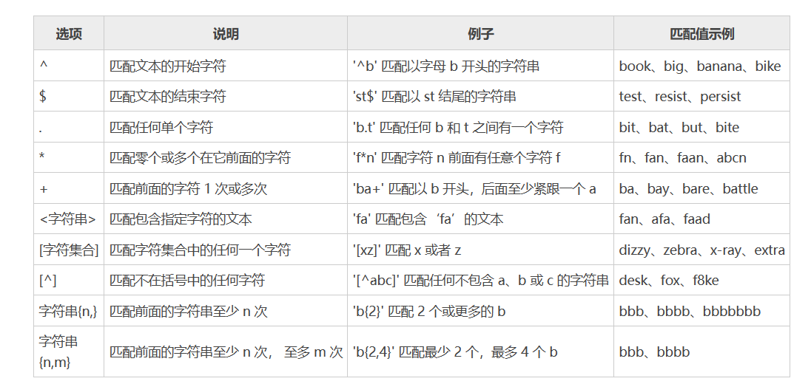

[toc]

# MySQL笔记4-表的数据

MySQL 提供了功能丰富的数据库管理语句，用来操作数据表中的记录。表中数据的增删改查是数据库中最常用的操作。

下面是用来管理表中数据的mysql语句

## 查询数据

### select 查询语句

在MySQL中，可以使用SELECT语句来查询数据。

> 使用通配符`*`查找表中所有字段的数据

```sql
# 语法如下
SELECT * FROM 表名;

# 从 tb_students_info 表中查询所有字段的数据
SELECT * FROM tb_students_info;
```

* 使用`*`通配符时，将返回所有列，数据列按照创建表时的顺序显示。
* 一般情况下，除非需要使用表中所有的字段数据，否则最好不要使用通配符`*`。虽然使用通配符可以节省输入查询语句的时间，但是获取不需要的列数据通常会降低查询的效率。


> 查询表中指定的字段

```sql
# 语法如下
SELECT <字段名1>,<字段名2>,…,<字段名n> FROM <表名>;

# 从 tb_students_info 表中查询 id、name 和 height 三列数据
SELECT id,name,height FROM tb_students_info;
```

### distinct 过滤重复数据

使用 SELECT 语句查询数据时。如果表中的某些字段没有唯一性约束，那么这些字段就可能存在重复值。

为了实现查询不重复的数据，MySQL 提供了 DISTINCT 关键字。DISTINCT 关键字的主要作用就是对数据表中一个或多个字段重复的数据进行过滤，只返回其中的一条数据给用户。

> DISTINCT 关键字的语法如下
```sql
# 语法如下
SELECT DISTINCT <字段名> FROM <表名>;
```

注意：
* 字段名是需要被去重的字段名称。
* distinct 只能返回它的目标字段，而无法返回其它字段。
* distinct 关键字只能在 SELECT 语句中使用。
* 如果 distinct 关键字后有多个字段，则会对多个字段进行组合去重。

>例子

```sql
# student表中数据如下
mysql> SELECT * FROM student;
+----+----------+------+-------+
| id | name     | age  | stuno |
+----+----------+------+-------+
|  1 | zhangsan |   18 |    23 |
|  2 | lisi     |   19 |    24 |
|  3 | wangwu   |   18 |    25 |
|  4 | zhaoliu  |   18 |    26 |
|  5 | zhangsan |   18 |    27 |
|  6 | wangwu   |   20 |    28 |
+----+----------+------+-------+

# 对 student 表的 age 字段进行去重。结果如下
mysql> SELECT DISTINCT age FROM student;
+------+
| age  |
+------+
|   18 |
|   19 |
|   20 |
+------+

# 对 student 表的 name 和 age 字段进行组合去重
mysql> SELECT DISTINCT name,age FROM student;
+----------+------+
| name     | age  |
+----------+------+
| zhangsan |   18 |
| lisi     |   19 |
| wangwu   |   18 |
| zhaoliu  |   18 |
| wangwu   |   20 |
+----------+------+

# 对 student 表中的所有字段进行去重
mysql> SELECT DISTINCT * FROM student;
+----+----------+------+-------+
| id | name     | age  | stuno |
+----+----------+------+-------+
|  1 | zhangsan |   18 |    23 |
|  2 | lisi     |   19 |    24 |
|  3 | wangwu   |   18 |    25 |
|  4 | zhaoliu  |   18 |    26 |
|  5 | zhangsan |   18 |    27 |
|  6 | wangwu   |   20 |    28 |
+----+----------+------+-------+


select distinct age from students;  //从学生表中查询所有年龄，重复的年龄只会出现一次

select distinct age,name from students; //从学生表中查询所有年龄和姓名的组合不重复的记录。
```

### as 设置别名

当表名或字段名称很长的时候，可以指定一个别名，用这个别名代替原来的名称。

> MySQL 提供了 AS 关键字来为表和字段指定别名。语法格式
```sql
# 语法如下
<表名> [AS] <别名>
<字段名> [AS] <别名>
```

* AS关键字可以省略，省略后需要将表名和别名用空格隔开。 
* 注意：表的别名不能与该数据库的其它表同名。
* 注意：字段的别名不能与该表的其它字段同名。
* 注意：表别名只在执行查询时使用，并不在返回结果中显示。而字段别名会在返回结果中显示。

> 例子

```sql
# 为 tb_students_info 表指定别名 stu
SELECT stu.name,stu.height FROM tb_students_info AS stu;

# 为 name 指定别名 student_name，为 age 指定别名 student_age
SELECT name AS student_name, age AS student_age FROM tb_students_info;
```

### limit 限制查询条数

当数据表中有上万条数据时，一次性查询出表中的全部数据会降低查询的速度，同时给数据库服务器造成很大的压力。

mysql提供 limit 关键字来限制查询结果返回的条数。主要可以用于sql分页查询。

limit 关键字有 3 种使用方式，即指定初始位置、不指定初始位置以及与 offset 组合使用。

#### 指定初始位置

limit 关键字可以指定查询结果从哪条记录开始显示，显示多少条记录。

> limit 指定初始位置的语法
```sql
# 语法如下
LIMIT 初始位置,记录数
```

* 初始位置表示从那条记录开始显示。第一条记录的位置是 0，第二条记录的位置是 1。后面的记录依次类推。
* 记录数表示显示的记录数目
  
> 例子

```sql
# 使用 LIMIT 子句返回从第 4 条记录开始的5行记录结果
SELECT * FROM tb_students_info LIMIT 3,5;

select name from students limit 0,1; //从行0开始，查询一个记录
select name from students limit 3,5; //从行3(第4行记录)开始，查询5个记录
```

#### 不指定初始位置

limit 关键字不指定初始位置时，记录从第一条记录开始显示。

```sql
# 语法如下
LIMIT 记录数

# 查询 tb_students_info 表的前4行记录
SELECT * FROM tb_students_info LIMIT 4;
# 查询 tb_students_info 表的前15行记录
SELECT * FROM tb_students_info LIMIT 15;

select name from students limit 5;   //查询前5行记录，从第一行开始查询
```

* 如果“记录数”的小于全部数据的总数，则会从第一条记录开始，显示指定条数的记录。
* 如果“记录数”的大于全部数据的总数，则会直接显示查询出来的所有记录。


#### limit 和 offset 组合使用

```sql
# 语法如下
LIMIT 记录数 OFFSET 初始位置

# 使用 LIMIT OFFSET 返回从第 4 条记录开始的行数为 5 的记录
SELECT * FROM tb_students_info LIMIT 5 OFFSET 3;

select name from students limit 3 offset 5; //从行5(第6行记录)开始，查询3个记录
```

<font color="red">PS： limit x offset y 是 mysql 5 开始支持 limit 的另一种替代语法。</font>


### order by 查询结果排序

查询到的数据一般都是按照数据最初被添加到表中的顺序来显示。为了使查询结果的顺序满足自己的要求，MySQL 提供了 ORDER BY 关键字来对查询结果按照一定的顺序进行排序。

> 语法格式
```sql
# 语法如下

select 字段 from 表名 order by 字段1, [字段2...] [asc|desc]
```

* ASC表示字段按升序排序，ASC为默认值。
* DESC表示字段按降序排序。
* 当 ORDER BY 对多个字段进行排序时，会按照字段的顺序从左到右依次进行排序。

> 例子
```sql
### 查询 tb_students_info 表的所有记录，并对 height 字段进行排序
SELECT * FROM tb_students_info ORDER BY height;

### 先按 height 排序，再按 name 排序
SELECT * FROM tb_students_info ORDER BY height,name;

### 先按 height 降序排序，再按 name 升序排序
SELECT * FROM tb_student_info ORDER BY height DESC,name ASC;

## order by 对单个列进行排序
select * from students order by name; //根据name排序查询出来的学生表记录

## order by 对多个列进行排序
select * from students order by name,age; //先对name进行排序，若有相同的多个记录，再对age进行排序

## order by xxx ASC
select * from students order by name ASC; //ASC升序排序，默认是可以不写的。升序：从小到大

## order by xxx DESC
select * from students order by name DESC; //DESC降序排序。升序：从大到小

## 针对多个列中的一个列进行降序排序
select * from students order by name DESC,age; //针对name进行降序排序,age则是升序排序

## 针对多个列都进行降序排序
select * from students order by name DESC,age DESC; //针对name和age进行降序排序
```

1.  order by name,age 意思是首先对name进行排序，当存在name相同的多个记录时，这多个记录再针对age进行排序。若表中不存在name相同的多个记录，则不会按照age进行排序了。
2. order by name 和 order by name ASC 都是升序排序。因为升序排序是默认的（如果既不指定ASC也不指定DESC，则假定为ASC）。
3. <font color="red">DESC关键字只应用到直接位于其前面的列名。如果想在多个列上进行降序排序，必须对每个列指定DESC关键字。</font>
4. ORDER BY子句的位置保证它位于FROM子句之后。如果使用LIMIT，它必须位于ORDER BY之后。使用子句的次序不对将产生错误消息。
5. 注意：在对多个字段进行排序时，排序的第一个字段必须有相同的值，才会对第二个字段进行排序。如果第一个字段数据中所有的值都是唯一的，MySQL 将不再对第二个字段进行排序。


### where 条件查询

在 MySQL 中，可以使用 WHERE 关键字来指定查询条件。

在SELECT语句中，数据根据WHERE子句中指定的搜索条件进行过滤。 WHERE子句在表名（FROM子句）之后给出。

> 什么是查询条件
* 带比较运算符和逻辑运算符的表达式
* 带 BETWEEN AND 关键字的表达式
* 带 IS NULL 关键字的表达式
* 带 IN 关键字的表达式
* 带 LIKE 关键字的表达式


> 语法格式
```sql
# 语法如下
WHERE 查询条件
```

#### 单个查询条件

单个条件指的是在 WHERE 关键字后只有一个查询条件。

```sql
# 查询身高为 170cm 的学生数据
SELECT * FROM tb_students_info WHERE height = 170;
# 查询年龄小于 22 的学生数据
SELECT * FROM tb_students_info WHERE age < 22;

select name from students where name = 'jack';  //查询所有名字为jack的记录
select age from students where age <> 12;       //查询所有年龄不为12的记录
select age from students where age != 12;       //查询所有年龄不为12的记录
```

#### 多个查询条件

多个查询条件的表达式之间需要用逻辑运算符 AND、OR 或 XOR 隔开。

* AND：记录满足所有查询条件时，才会被查询出来。
* OR：记录满足任意一个查询条件时，才会被查询出来。
* XOR：记录满足其中一个条件，并且不满足另一个条件时，才会被查询出来。


```sql
# 查询 age 大于 21，并且 height 大于等于 175 的学生信息
SELECT * FROM tb_students_info  WHERE age>21 AND height>=175;

# 查询 age 大于 21，或者 height 大于等于 175 的学生信息
SELECT * FROM tb_students_info WHERE age>21 OR height>=175;

# 查询 age 大于 21，并且 height 小于 175 的学生信息和 age 小于 21，并且 height 大于等于 175 的学生信息
SELECT * FROM tb_students_info WHERE age>21 XOR height>=175;
```


### like 模糊查询

在 MySQL 中，LIKE 关键字主要用于搜索匹配字段中的指定内容。

默认情况下，LIKE 关键字匹配字符的时候是不区分大小写的。如果需要区分大小写，可以加入 BINARY 关键字。

> 语法格式
```sql
//语法,不区分大小写
select * 表名 where 字段1  [not] like 字符串

//语法，区分大小写
select * 表名 where 字段1  [not] like BINARY 字符串
```

* not是可选参数，若字段中的内容与指定的字符串不匹配时满足条件。
* 字符串：指定用来匹配的字符串。“字符串”可以是一个很完整的字符串，也可以包含通配符。


> like 模糊查询可以使用的通配符如下

通配符 | 说明 | 举例
------------ | -------------  | ------------- 
% | 包含零个或多个字符的任意字符串。| where bookname LIKE '%computer%' 将查找在书名中任意位置包含单词 "computer" 的所有书名。
_（下划线）| 任何单个字符。| where name LIKE '_ean' 将查找以 ean结尾的所有 4 个字母的名字（例如 Dean、Sean等）
[ ]  | 指定范围 ([a-f]) 或集合([abcdef]) 中的任何单个字符。 | where name LIKE '[C-P]arsen' 将查找以 arsen 结尾并且以介于 C 与 P 之间的任何单个字符开始的作者姓氏，（例如Carsen、Larsen、Karsen 等。）
[^]  |  不属于指定范围 ([a-f]) 或集合([abcdef]) 的任何单个字符。 | where au_lname LIKE 'de[^l]%' 将查找以de 开始并且其后的字母不为 l 的所有作者的姓氏。

> 例子
```sql
# 查找所有以字母“T”开头的学生姓名
SELECT * FROM tb_students_info WHERE name LIKE 'T%';

# 查找所有不以字母“T”开头的学生姓名
SELECT * FROM tb_students_info WHERE name NOT LIKE 'T%';

# 查找所有包含字母“e”的学生姓名
SELECT * FROM tb_students_info WHERE name LIKE '%e%';

# 查找所有以字母“y”结尾，且“y”前面只有4个字母的学生姓名
SELECT * FROM tb_students_info WHERE name LIKE '____y';

# 查找所有以字母“t”开头的学生姓名，不区分大小写
SELECT * FROM tb_students_info WHERE name LIKE 't%';

# 查找所有以字母“t”开头的学生姓名，区分大小写
SELECT * FROM tb_students_info WHERE name LIKE BINARY 't%';

//查询name以ack结尾的记录
select * from students where name LIKE '%ack';
//查询name以jac开头的记录
select * from students where name LIKE 'jac%';
//查询name中包含ac的记录
select * from students where name LIKE '%ac%';  
```


### between and 范围查询

MySQL 提供了 BETWEEN AND 关键字，用来判断字段是否在指定范围内。

```sql
# 语法如下
[NOT] BETWEEN 范围起始值 AND 范围终止值

# 查询年龄在 20 到 23 之间的学生
SELECT * FROM tb_students_info WHERE age BETWEEN 20 AND 23;

# 查询年龄不在 20 到 23 之间的学生
SELECT * FROM tb_students_info WHERE age NOT BETWEEN 20 AND 23;

//查询age在5-10岁的学生
select age from students where age between 5 and 10;  

```

* NOT：可选参数，表示指定范围之外的值。如果字段值不满足指定范围内的值，则这些记录被返回。
* between 5 and 10 就相当于 age >= 5 and age <= 10

### NULL值处理

* is null: 当字段的值是NULL,此运算符返回true。
* is not null: 当字段的值不为NULL,此运算符返回true。
* <=>: 比较操作符（不同于=运算符），当比较的的两个值为NULL时返回true。
* 不能使用 = NULL 或 != NULL 在列中查找 NULL 值 。
* 在MySQL中，NULL值与任何其它值的比较（即使是NULL）永远返回false，即 NULL = NULL 返回false 。
* MySQL中判断字段的值是否是NULL，需要使用is null和is not null。

### is null 空值查询

MySQL 提供了 IS NULL 关键字，用来判断字段的值是否为空值（NULL）。空值不同于 0，也不同于空字符串。

NULL无值（no value），它与 0、空字符串或空格不同。当一个列不包含值时，则称其为包含空值NULL。

```sql
# 语法如下
IS [NOT] NULL

# 查询login_date 字段是 NULL 的记录。
SELECT * FROM tb_students_info WHERE login_date IS NULL;

# 查询login_date 字段不是 NULL 的记录。
SELECT * FROM tb_students_info WHERE login_date IS NOT NULL;

//从students表中查询tel没有填写的学生
select * from students where tel is null;  
```

* NOT：可选参数，表示字段值不是空值时满足条件。

### group by 分组查询

在 MySQL 中，GROUP BY 关键字可以根据一个或多个字段对查询结果进行分组。

group by 根据字段来对数据进行分组。通常配合聚合函数来用，分组之后你可以计数（count），求和（sum），求平均数（avg）等

```sql
# 语法如下
GROUP BY <字段名>

//统计每个年级的学生人数
select grade,count(*) as num from students group by grade; 

//解析：
// group by grade 将数据按年级分组
// count(*) as num 统计每个年级分组的学生个数

select * from students group by grade,name; //根据grade,name来对数据进行分组
```

* group by子句必须出现在 where子句之后，order by子句之前。
* group by grade,name  对多个字段进行分组时，需要将name和grade看成一个整体，只要是name和grade相同的可以分成一组；如果只是name相同，grade不同就不是一组。


#### group by 与 聚合函数

GROUP BY 关键字经常和聚合函数一起使用。

聚合函数包括 COUNT()，SUM()，AVG()，MAX() 和 MIN()。其中，COUNT() 用来统计记录的条数；SUM() 用来计算字段值的总和；AVG() 用来计算字段值的平均值；MAX() 用来查询字段的最大值；MIN() 用来查询字段的最小值。

```sql
# 根据 tb_students_info 表的 sex 字段进行分组查询，使用 COUNT() 函数计算每一组的记录数。
mysql> SELECT sex,COUNT(sex) FROM tb_students_info GROUP BY sex;
+------+------------+
| sex  | COUNT(sex) |
+------+------------+
| 女   |          5 |
| 男   |          5 |
+------+------------+


### 使用 GROUP BY 语句 把表按名字进行分组，并统计每个人有多少条记录
SELECT sname, COUNT(*) FROM  student group by sname;
```


### having 过滤分组数组

在 MySQL 中，可以使用 HAVING 关键字对分组后的数据进行过滤。

> 语法
```sql
# 语法如下
HAVING <查询条件>
```

> having 与 where 的区别
* WHERE 用于过滤数据行，而 HAVING 用于过滤分组。
* WHERE 不可以使用聚合函数，而 HAVING 中可以使用聚合函数。
* WHERE 在数据分组前进行过滤，而 HAVING 在数据分组后进行过滤 。
* WHERE 根据字段直接进行过滤，而 HAVING 是根据前面已经查询出的字段进行分组过滤。


> 例子
```sql
// 统计每个年级的学生人数，过滤人数小于10人的年级
select grade,count(*) as num from students group by grade having count(*) >10; 

// 统计3年级以上的学生人数，过滤人数小于10人的年级
select grade,count(*) as num from students where grade > 3 group by grade having count(*) >10; 

// 统计3年级以上的学生人数，过滤人数小于10人的年级,按人数从大到小的顺序排序
select grade,count(*) as s_num from students where grade > 3 group by grade having count(*) >10 order by s_num desc; 

# 查询表中身高大于 150 的学生姓名，性别和身高
SELECT name,sex,height FROM tb_students_info HAVING height>150;

# 查询表中身高大于 150 的学生姓名，性别和身高
SELECT name,sex,height FROM tb_students_info WHERE height>150;

### 根据 height 字段对查询结果进行分组
### 并使用 HAVING 关键字分别查询出分组后平均身高大于 170 的学生姓名、性别和身高。
SELECT GROUP_CONCAT(name),sex,height FROM tb_students_info  GROUP BY height HAVING AVG(height)>170;

# 这句话有错误
mysql> SELECT name,sex FROM tb_students_info HAVING height>150;
ERROR 1054 (42S22): Unknown column 'height' in 'having clause'
```

* where子句应该在group by前， having子句在group by 之后
* 聚合函数（avg、sum、max、min、count），不能作为条件放在where之后，但可以放在having之后
* where子句是过滤具体的行，having子句过滤的是某个具体的分组数据。

<font color="red">注意：由于HAVING 是根据查询结果进行分组过滤。所以如果 SELECT 后没有HAVING 查询条件中使用的 height 字段，那么整个sql语句就会报错。</font>

### join 多表查询

在关系型数据库中，表与表之间是有联系的，多表查询就是同时查询两个或两个以上的表。

join 语句按照功能大致分为如下四类：
* cross join (交叉连接)：用来返回多个表的笛卡尔积。
* inner join（内连接）：获取两个表中字段匹配关系的记录。
* left join（左连接）：获取左表所有记录，即使右表没有对应匹配的记录。
* right join（右连接）：用于获取右表所有记录，即使左表没有对应匹配的记录。

#### cross join 交叉连接

交叉连接（CROSS JOIN）一般用来返回连接表的笛卡尔积。当表的数量较多时，交叉连接会非常非常慢。一般情况下不建议使用交叉连接。。

```sql
# 语法如下
SELECT <字段名> FROM <表1> CROSS JOIN <表2> [WHERE子句]
# 或
SELECT <字段名> FROM <表1>, <表2> [WHERE子句] 
```

<font color="red">注意：多个表交叉连接时，使用 `CROSS JOIN` 或`,`即可。以上两种语法的返回结果是相同的，但是第一种语法才是官方建议的标准写法。</font>

> 例子
```sql
# 使用 CROSS JOIN 查询出两张表中的笛卡尔积
SELECT * FROM tb_course CROSS JOIN tb_students_info;

select st.name,sc.course,sc.num from students st ,scores sc;
// 直接从两个表中查询所有两两组合的结果

select st.name,sc.course,sc.num from students st ,scores sc where st.sid = sc.sid;
//从学生表和分数表中查询姓名，课程，分数的结果
```

<font color="red">

1. 如果一张表有10000条数据，另一张表有10000条数据，两表交叉连接就是100W条数据，是非常消耗内存的。
2. 保证所有连接都有WHERE子句，否则MySQL将查询许多无用数据

</font>

> 什么是笛卡尔积？

笛卡尔积是指两个集合 X 和 Y 的乘积。

```
例如，有 A 和 B 两个集合，它们的值如下：
A = {1,2}
B = {3,4,5}

集合 A×B 和 B×A 的结果集分别表示为：
A×B={(1,3), (1,4), (1,5), (2,3), (2,4), (2,5) };
B×A={(3,1), (3,2), (4,1), (4,2), (5,1), (5,2) };

以上 A×B 和 B×A 的结果就叫做两个集合的笛卡尔积。
```

#### inner join 内连接

内连接使用 INNER JOIN 关键字连接两张表，并使用 ON 子句来设置连接条件。如果没有连接条件，INNER JOIN 和 CROSS JOIN 在语法上是等同的。

内连接查询，就是取左连接和右连接的交集，如果两边不能匹配条件，则都不取出。

```sql
# 语法如下
SELECT <字段名> FROM <表1> INNER JOIN <表2> [ON子句]

# 在 tb_students_info 表和 tb_course 表之间，使用内连接查询学生姓名和相对应的课程名称
SELECT s.name,c.course_name FROM tb_students_info as s INNER JOIN tb_course as c ON s.course_id = c.id;

# 读取 tbl表中所有 author字段在tb2表对应的 count字段值
select a.id, a.author, b.count from tbl a inner join tb2 b on a.author = b.author;
```

* INNER JOIN ：内连接中可以省略 INNER 关键字，只用关键字 JOIN。
* ON 子句：用来设置内连接的连接条件。


#### left join 左外连接

左外连接又称为左连接，使用 left outer join 或者 left join 关键字连接两个表，并使用 on 子句来设置连接条件。

左连接查询是以左表为主表，会先将左表所有数据查询出来，而右表则根据条件去匹配，如果右表没有满足条件的行，则查询出来的右表字段默认显示NULL。

> 语法
```sql
# 语法1
SELECT <字段名> FROM <表1> LEFT OUTER JOIN <表2> <ON子句>
# 语法2
SELECT <字段名> FROM <表1> LEFT JOIN <表2> <ON子句>
```

1. 左连接查询速度快，消耗内存小，而且使用了索引。左连接查询效率相比于交叉连接的查询效率快了10+倍以上
2. left join ... on ... 和 left outer join ... on ...写法是一样的。


> 例子
```sql
mysql> SELECT * FROM tb_course;
+----+-------------+
| id | course_name |
+----+-------------+
|  1 | Java        |
|  2 | MySQL       |
|  3 | Python      |
|  4 | Go          |
|  5 | C++         |
|  6 | HTML        |
+----+-------------+

mysql> SELECT * FROM tb_students_info;
+----+--------+------+------+--------+-----------+
| id | name   | age  | sex  | height | course_id |
+----+--------+------+------+--------+-----------+
|  1 | Dany   |   25 | 男   |    160 |         1 |
|  2 | Green  |   23 | 男   |    158 |         2 |
|  3 | Henry  |   23 | 女   |    185 |         1 |
|  4 | Jane   |   22 | 男   |    162 |         3 |
|  5 | Jim    |   24 | 女   |    175 |         2 |
|  6 | John   |   21 | 女   |    172 |         4 |
|  7 | Lily   |   22 | 男   |    165 |         4 |
|  8 | Susan  |   23 | 男   |    170 |         5 |
|  9 | Thomas |   22 | 女   |    178 |         5 |
| 10 | Tom    |   23 | 女   |    165 |         5 |
| 11 | LiMing |   22 | 男   |    180 |         7 |
+----+--------+------+------+--------+-----------+


# 在 tb_students_info 表和 tb_course 表中查询所有学生姓名和相对应的课程名称，包括没有课程的学生。

mysql> SELECT s.name,c.course_name FROM tb_students_info s LEFT OUTER JOIN tb_course c ON s.`course_id`=c.`id`;
+--------+-------------+
| name   | course_name |
+--------+-------------+
| Dany   | Java        |
| Henry  | Java        |
| NULL   | Java        |
| Green  | MySQL       |
| Jim    | MySQL       |
| Jane   | Python      |
| John   | Go          |
| Lily   | Go          |
| Susan  | C++         |
| Thomas | C++         |
| Tom    | C++         |
| LiMing | NULL        |
+--------+-------------+

// 学生表为左表，分数表为右表
select st.name,sc.course,sc.num from students st left join scores sc on st.sid = sc.sid;


```

#### right join 右外连接

右外连接又称为右连接。使用 right outer join 关键字 或者 right join 关键字 连接两个表，并使用 ON 子句来设置连接条件。

右连接查询是以右表为主表，会先将右表所有数据查询出来，而左表则根据条件去匹配，如果左表没有满足条件的行，则查询出来的左表字段默认显示NULL。

> 语法
```sql
# 语法1
SELECT <字段名> FROM <表1> RIGHT OUTER JOIN <表2> <ON子句>
# 语法2
SELECT <字段名> FROM <表1> RIGHT JOIN <表2> <ON子句>
```

1. right join ... on ... 和 right outer join ... on ...写法是相同的。

```sql
# 在 tb_students_info 表和 tb_course 表中查询所有课程，包括没有学生的课程
mysql> SELECT s.name,c.course_name FROM tb_students_info s RIGHT OUTER JOIN tb_course c ON s.`course_id`=c.`id`;
+--------+-------------+
| name   | course_name |
+--------+-------------+
| Dany   | Java        |
| Green  | MySQL       |
| Henry  | Java        |
| Jane   | Python      |
| Jim    | MySQL       |
| John   | Go          |
| Lily   | Go          |
| Susan  | C++         |
| Thomas | C++         |
| Tom    | C++         |
| NULL   | HTML        |
+--------+-------------+

// 学生表为左表，分数表为右表
select st.name,sc.course,sc.num from students st right join scores sc on st.sid = sc.sid;

```

<font color="red">使用外连接查询时，一定要分清需要查询的结果，是需要显示左表的全部记录还是右表的全部记录，然后选择相应的左连接和右连接。</font>


### 子查询

子查询是指将一个查询语句嵌套在另一个查询语句中。子查询可以在 SELECT、UPDATE 和 DELETE 语句中使用，而且可以进行多层嵌套。

> 语法格式
```sql
WHERE <表达式> <操作符> (子查询)
```

* 操作符可以是比较运算符和 IN、NOT IN、EXISTS、NOT EXISTS 等关键字。

> 例子
```sql
# 使用子查询在 tb_students_info 表和 tb_course 表中查询学习 Java 课程的学生姓名
SELECT name FROM tb_students_info WHERE course_id IN (SELECT id FROM tb_course WHERE course_name = 'Java');

# 使用=运算符，在 tb_course 表和 tb_students_info 表中查询出所有学习 Python 课程的学生姓名
SELECT name FROM tb_students_info WHERE course_id = (SELECT id FROM tb_course WHERE course_name = 'Python');

# 使用<>运算符，在 tb_course 表和 tb_students_info 表中查询出没有学习 Python 课程的学生姓名
SELECT name FROM tb_students_info WHERE course_id <> (SELECT id FROM tb_course WHERE course_name = 'Python');

# 查询 tb_course 表中是否存在 id=1 的课程，如果存在，就查询出 tb_students_info 表中的记录
SELECT * FROM tb_students_info WHERE EXISTS(SELECT course_name FROM tb_course WHERE id=1);

# 查询 tb_course 表中是否存在 id=1 的课程，如果存在，就查询出 tb_students_info 表中 age 字段大于 24 的记录
SELECT * FROM tb_students_info WHERE age>24 AND EXISTS(SELECT course_name FROM tb_course WHERE id=1);

```

#### and，or关键字

and关键字需要同时满足左右两个条件的记录，才能查询出来
```sql
select * from students where age > 12 and name = 'jack'; 
```

OR 关键字，只要左右两个条件满足其中一个都可以查询出来
```sql
select * from students where age > 12 or age < 6;
```

and 和 or 混合使用
```sql
select * from students where age > 12 or age < 6 and name = 'jack';
select * from students where ( age > 12 or age < 6 ) and name = 'jack';
```

<font color="red">操作符计算次序： 括号（） > AND 操作符 > OR 操作符</font>


####  in和 not关键字

IN操作符用来指定条件范围，范围中的每个条件都可以进行匹配。
```sql
select * from students where age in (12,13); //查询age为12和13的记录
```

* in操作符和or操作符的功能相当。age in (12,13) 就相当于 age = 12 or age = 13

NOT操作符有且只有一个功能，那就是否定它之后所跟的任何条件。
```sql
select * from students where age NOT in (12,13); //查询age不为12和13的记录
```

<font color="red">MySQL支持使用NOT对IN、BETWEEN和 EXISTS子句取反。</font>

### 组合查询 union，unoin all 

union可以将多条select语句组合在一起。并把多个SELECT语句的查询结果组合到一个结果集中。

```sql
-- 语法如下
SELECT * FROM table1 [WHERE conditions] 
UNION [ALL]
SELECT * FROM table2 [WHERE conditions];

--例子
-- 查询年龄大于5的学生和学号为111与112的学生，会过滤重复的行
select name,age from students where age > 5 
union 
select name,age from student where sid in (111,222)

-- 不会过滤重复的行
select name,age from students where age > 5 
union all 
select name,age from student where sid in (111,222)
```

1. UNION中的每个查询必须包含相同的列、表达式或聚集函数。
2. UNION从查询结果集中自动去除了重复的行。
3. UNION ALL不会过滤查询出来的重复的行


### regexp 正则表达式

MySQL 中对正则表达式提供了初步的支持，允许你指定正则表达式， 过滤SELECT检索出的数据。

REGEXP关键字的使用和LIKE关键字相似。REGEXP后所跟的东西作为正则表达式处理。

> 语法格式
```sql
字段名 REGEXP '匹配方式'
```

>下表列出了 REGEXP 操作符中常用的匹配方式。



> 例子

* 字符^用来匹配以特定字符或字符串开头的记录。
* 字符$用来匹配以特定字符或字符串结尾的记录。
* 字符`.`用来替代字符串中的任意一个字符。
* 字符`*`和`+`都可以匹配多个字符。不同的是，`+`表示至少一个字符，而`*`可以表示 0 个字符。
* 指定多个字符串时，需要用`|`隔开。只要匹配这些字符串中的任意一个即可。
* 使用方括号[ ]可以将需要查询的字符组成一个字符集合。只要记录中包含方括号中的任意字符，该记录就会被查询出来。

```sql
# 查询 name 字段以“J”开头的记录
SELECT * FROM tb_students_info WHERE name REGEXP '^J';

# 查询 name 字段以“y”结尾的记录
SELECT * FROM tb_students_info WHERE name REGEXP 'y$';

# 查询 name 字段值包含“a”和“y”，且两个字母之间只有一个字母的记录
SELECT * FROM tb_students_info WHERE name REGEXP 'a.y';

# 查询 name 字段值包含字母“T”，且“T”后面出现字母“h”的记录
SELECT * FROM tb_students_info WHERE name REGEXP 'Th*';

# 查询 name 字段值包含字母“T”，且“T”后面至少出现“h”一次的记录
SELECT * FROM tb_students_info WHERE name REGEXP 'Th+';

# 查询 name 字段值包含字符串“an”的记录
SELECT * FROM tb_students_info WHERE name REGEXP 'an';

# 查询 name 字段值包含字符串“an”或“en”的记录
SELECT * FROM tb_students_info WHERE name REGEXP 'an|en';

# 查询 name 字段值包含字母“i”或“o”的记录
SELECT * FROM tb_students_info WHERE name REGEXP '[io]';

# 查查询 name 字段值中包含 1、2 或 3 的记录
SELECT * FROM tb_students_info WHERE name REGEXP '[123]';

```


## 插入数据

数据库与表创建成功以后，需要向数据库的表中插入数据。在 MySQL 中可以使用 INSERT 语句向数据库已有的表中插入一行或者多行数据。

### 基本语法

INSERT 语句有两种语法形式，分别是 INSERT…VALUES 语句和 INSERT…SET 语句。

```sql
# 语法1
insert into table_name (列1, 列2,...) values (值1, 值2,....)

# 语法2
INSERT INTO <表名>
SET <列名1> = <值1>,
    <列名2> = <值2>,
     …
```

* 列名：需要插入数据的字段名称。
* VALUES ：该子句包含要插入的数据清单。数据清单中数据的顺序要和前面列的顺序相对应。


### 例子

```sql
# 在tb_courses 表中插入一条新记录，course_id 值为 1，course_name 值为“Network”，course_grade 值为 3，info 值为“Computer Network”。
INSERT INTO tb_courses (course_id,course_name,course_grade,course_info) VALUES(1,'Network',3,'Computer Network');

# 在 tb_courses 表中插入一条新记录，course_id 值为 3，course_name 值为“Java”，course_grade 值为 4，info 值为“Jave EE”
INSERT INTO tb_courses VLAUES(3,'Java',4,'Java EE');

INSERT INTO Persons VALUES ('Gates', 'Bill', 'Xuanwumen 10', 'Beijing')

INSERT INTO Persons (LastName, age) VALUES ('Wilson', null)

//一次插入多行
INSERT INTO Persons (LastName, age) VALUES ('Wilson', null),('bill', 12),('jack', 12)

```

* 如果某个列没有值，应该使用NULL值。NULL值会被MySQL忽略。
* MySQL用单条INSERT语句处理多个插入比使用多条INSERT语句快。
* 若INSERT 语句中有指定插入列表，那么插入数据时，不需要按照表定义的顺序插入，只要保证值的顺序与列字段的顺序相同就可以。
* 若INSERT 语句中没有指定插入列表，只有一个值列表。在这种情况下，值列表为每一个字段列指定插入的值，并且这些值的顺序必须和 tb_courses 表中字段定义的顺序相同。


### insert into ..select.. from 语句复制表数据

INSERT INTO…SELECT…FROM 语句用于快速地从一个或多个表中取出数据，并将这些数据作为行数据插入另一个表中。

```sql
# 从 tb_courses 表中查询所有的记录，并将其插入 tb_courses_new 表中。

INSERT INTO tb_courses_new (course_id,course_name,course_grade,course_info) SELECT course_id,course_name,course_grade,course_info FROM tb_courses;
```

1. insert into ... select 语句主要用于从一个表复制数据，然后把数据插入到一个已存在的表中。
2. 两个表的列名不一定要求列名匹配。它使用的是列的位置，因此SELECT中的第一列（不管其列名）将用来填充表列中指定的第一个列，第二列将用来填充表列中指定的第二个列，如此等等。


## 修改数据（更新数据）

在 MySQL 中，可以使用 UPDATE 语句来修改、更新一个或多个表的数据。

> 语法
```sql
update <表名> set 字段1=值1 ,字段2=值2, ... [WHERE 子句 ][ORDER BY 子句] [LIMIT 子句]

update 表名 set 字段=新值,… 
```

* SET: 用于指定表中要修改的列名及其列值。可以同时更新一个或多个字段。
* 修改一行数据的多个列值时，SET 子句的每个值用逗号分开即可。
* WHERE 子句：可选项。用于限定表中要修改的行。若不指定，则修改表中所有的行。
* ORDER BY 子句：可选项。用于限定表中的行被修改的次序。
* LIMIT 子句：可选项。用于限定被修改的行数。


> 例子
```sql
# 在 tb_courses_new 表中，更新所有记录的 course_grade 字段值为 4
UPDATE tb_courses_new SET course_grade=4;

# 在 tb_courses 表中，更新 course_id 值为 2 的记录，将 course_grade 字段值改为 3.5
UPDATE tb_courses_new SET course_grade=3.5 WHERE course_id=2;
```

## 删除数据

在 MySQL 中，可以使用 DELETE 语句来删除表的一行或者多行数据。

> 语法
```sql
delete from <表名> [WHERE 子句] [ORDER BY 子句] [LIMIT 子句]
```

* ORDER BY 子句：可选项。表示删除时，表中各行将按照子句中指定的顺序进行删除。
* WHERE 子句：可选项。表示为删除操作限定删除条件，若没有该子句，则代表删除该表中的所有行。
* LIMIT 子句：可选项。用于告知服务器在控制命令被返回到客户端前被删除行的最大值。


> 例子
```sql
# 删除 tb_courses_new 表中的全部数据
DELETE FROM tb_courses_new;

# 在 tb_courses_new 表中，删除 course_id 为 4 的记录
DELETE FROM tb_courses WHERE course_id=4;
```

## truncate 清空表中数据

MySQL 提供了 TRUNCATE 关键字来完全清空一个表。

```sql
# 语法
TRUNCATE [TABLE] 表名;

# 使用 TRUNCATE 语句清空 tb_student_course 表中的记录
TRUNCATE TABLE tb_student_course;
```

* TABLE 关键字可省略。

> TRUNCATE 和 DELETE 的区别

* DELETE 是逐行一条一条删除记录的；TRUNCATE 则是直接删除原来的表，再重新创建一个一模一样的新表，而不是逐行删除表中的数据，执行数据比 DELETE 快。因此需要删除表中全部的数据行时，尽量使用 TRUNCATE 语句， 可以缩短执行时间。
* DELETE 的使用范围更广，因为它可以通过 WHERE 子句指定条件来删除部分数据；而 TRUNCATE 不支持 WHERE 子句，只能删除整体。

<font color="red">当不需要该表时，用 DROP；当仍要保留该表，但要删除所有记录时，用 TRUNCATE；当要删除部分记录时，用 DELETE。</font>


## 聚合函数


<font color="red">聚合函数（avg、sum、max、min、count），不能作为条件放在where子句之后，但可以放在having子句之后</font>

聚集函数主要用于汇总数据。例如查询表中的记录数，查询某个列的最大最小值等。这些都是对表中数据的汇总，并不是想要获取实际查询出来的数据。

> ① AVG()函数：返回特定列的平均值。

```sql
select AVG(age) as average from students; //查询表中学生的平均年龄

``` 

1. AVG()只能用来确定特定数值列的平均值，而 且列名必须作为函数参数给出。为了获得多个列的平均值， 必须使用多个AVG()函数。
2. AVG()函数忽略列值为NULL的行。


> ② COUNT()函数：用于计算表中行的数目或符合特定条件的行的数目。

1. 使用COUNT(*)会对表中行的数目进行计数，不管表列中包含的是空 值（NULL）还是非空值。 
2. 使用COUNT(column)对特定列中具有值的行进行计数，忽略NULL值。


```sql
select COUNT(*) as num from students;     //查询表中有多少条记录，即有多少个学生
```

> ③ max()，min(),sum()函数

```sql
select max(age) as max_age from students;   //查询出最大的年龄
select min(age) as min_age from students;   //查询最小的年龄
select sum(age) as sum_age from students;   //查询年龄的总和
```

1. max()函数：返回指定列的最大值。忽略列值为NULL的行。
2. min()函数：返回指定列的最小值。忽略列值为NULL的行。
3. sum()函数：返回指定列的总和。忽略列值为NULL的行。


## 计算字段

什么是计算字段？

有的时候，存储在表中的数据不是程序马上需要的。我们需要将从数据库中检索出的数据，经过转换格式、计算后，才能给应用程序使用。为什么不直接在程序中进行转换和计算的工作，是因为在数据库服务器上完成这些操作比在程序中完成要快得多。

<font color="red">计算字段就是将查询出来的数据，经过二次加工。再把加工后的数据返回给应用程序。</font>

### concat()函数拼接字段

```sql
select concat(name,'(',age,')') from students;  //从表中查询名字和年龄的数据，并转换成name(age)的格式。
```

### 其余数据处理函数

UPPER()函数：将文本转换为大写
DATE()函数：返回日期时间中的日期部分

```sql
select UPPER(name) FROM students; //将name转变为大写
select * FROM students where DATE(birth) = '2000-02-02'; //查询2000年2月2日出生的学生记录
```

<font color="red">其实还有许多函数，请自行百度。</font>


