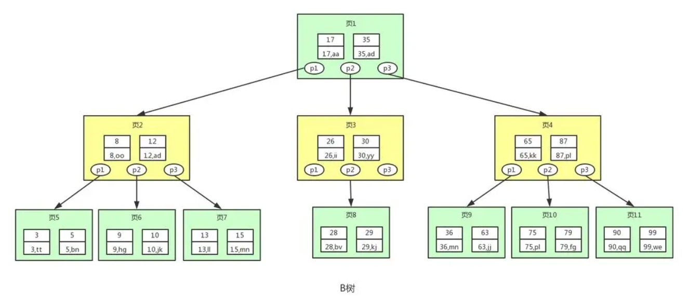

[toc]

# MySQL笔记7-索引

## 索引的介绍

> 索引是什么?

索引是一种特殊的文件(表的索引是表空间的一个组成部分)，它们包含着对数据表里所有记录的引用指针。它也是要占据物理空间的。

可以把数据表中的一个字段或多个字段设置为索引，从而用来快速查询数据表中的记录。使用索引字段的查询速度比非索引字段查询速度要更快，更方便。

索引的建立可以大大提高MySQL的检索速度。通俗的说，索引就相当于目录。为了方便查找书中的内容，通过对书本内容建立索引形成目录。

> 为什么要使用索引？

MySQL中，通常有以下两种方式查询数据库的数据。
* 逐行访问：即全表扫描，逐行查询，直到查到数据。但是当表中存在大量数据的时候，效率非常低下，会花费大量时间。
* 索引访问：通过遍历索引来查询表中的数据。使用这种方式的前提是表中存在索引，在列上创建了索引之后，查找数据时可以直接根据该列上的索引找到对应记录行的位置，从而快捷地查找到数据。

例如，在学生信息表 tb_students 中，如果基于 student_id 建立了索引，mysql系统就建立了一张索引列到实际记录的映射表。当用户需要查找 student_id 为 12022 的数据的时候，系统先在 student_id 索引上找到该记录，然后通过映射表直接找到数据行，并且返回该行数据。因为扫描索引的速度一般远远大于扫描实际数据行的速度，所以采用索引的方式可以大大提高数据库的工作效率。

> 索引的优缺点
* 优点：索引可以大大减小系统需要扫描的数据量，从而大大加快数据的检索速度。
* 缺点：索引需要占物理空间，除了数据表占用数据空间之外，每一个索引还要占用一定的物理空间。
* 缺点：过多的索引会大大提高了查询速度，但同时却会降低表的更新速度（增，删，改）。因为MySQL不仅要更新表中的数据，还要更新对应的索引文件。

> 应该被作为索引的列
* WHERE子句中的常用的列应该创建索引。若常用列有许多重复值则不必创建索引。
* 在排序（order by）语句常用的列上应该创建索引，加快排序查询时间。

> 不应该被作为索引的列
* 避免对经常更新的表使用过多的索引
* 在查询条件中很少使用的列不应该创建索引。
* 若表中某个列包含许多重复值(例如性别)，为它建立索引就没有太大的实际效果。
* 数据量小的表最好不要使用索引。
* 参与计算的列字段不适合建索引

> 索引什么情况下会失效？
* like %aaa% 不会使用索引而like aaa% 可以使用索引。
* 不在索引列上做任何操作，例如计算、函数、类型转换，这将导致索引失效。
* 少用or，用它来连接时会索引失效。
* MySQL在使用不等于（!=或者<>）的时候，索引会失效导致全表扫描。

## mysql索引的分类

mysql中的索引可以根据不同的方面进行分类。
* 按字段个数分类：单列索引、组合索引。
* 按字段特性分类：普通索引、唯一索引、主键索引、全文索引，空间索引。
* 按物理存储分类：聚集索引、非聚集索引。
* 按数据结构分类：B+tree索引、Hash索引、Full-text索引。

### 按字段个数分类

* 单列索引：一个索引只包含一个字段。
* 组合索引：一个索引包含两个或两个以上的字段。

#### 组合索引是什么？为什么需要注意组合索引中的顺序？

MySQL可以使用多个字段建立的一个索引，叫做组合索引。由于组合索引是由多个字段共同组成，如果想要高效率用到组合索引中的每一个字段，那么需要按照建立组合索引时的字段顺序挨个使用，否则无法高效率使用组合索引。

具体原因为 MySQL使用索引时需要索引有序，假设现在建立了"name，age，school"的组合索引，那么组合索引的排序为: 先按照name排序，如果name相同，则按照age排序，如果age的值也相等，则按照school进行排序。

当进行查询时，此时索引仅仅按照name严格有序，因此必须首先使用name字段进行等值查询，之后对于匹配到的列而言，其按照age字段严格有序，此时可以使用age字段用做索引查找，以此类推。

因此在建立组合索引的时候应该注意索引列的顺序。一般情况下，将查询需求频繁或者字段选择性高的列放在前面。此外可以根据查询语句或者表结构进行单独的调整。

#### 组合索引中的最左前缀原则

最佳左前缀法则只适用于组合索引上。

首先组合索引中字段会与where子句中的字段，会根据最左前缀原则来匹配，匹配上的where子句就能使用组合索引，否则无法使用组合索引。

最左前缀原则如下：
* 按从左到右的顺序依次进行匹配。直到遇到范围查询（>,<,between,like）就停止匹配。
* 例如组合索引index_name(a,b,c)，只会匹配where子句中的a、a,b、a,b,c 三种类型的查询。
* <font color="red">注意若where子句中abc三个字段都存在，无论什么顺序。mysql会将where子句优化为a,b,c查询。</font>
* <font color="red">注意如果where子句中的各个字段通过>,<,between,like连接。则不会触发组合索引</font>

```
例如：某个组合索引包含三个字段（姓名，年龄，性别）。即aaa_index(name,age,gender)

select * from table where name = '小明'
select * from table where name = '小明' and age = 12
select * from table where name = '小明' and age = 12 and gender = '男'
select * from table where name = '小明' and gender = '男'

只有上面这三个语句能够使用到索引aaa_index。其余的查询语句无法使用到组合索引aaa_index。
第四个语句只能匹配到name，gender字段索引，不能匹配到name,age,gender字段索引。

原因解释：
组合索引index_name(a,b,c)，只会走a、a,b、a,b,c 三种类型的查询。a,c顺序只能匹配a,c字段组合索引，不会匹配a,b,c字段组合索引。
```

### 按字段特性分类：普通索引、唯一索引、主键索引、全文索引，空间索引

* 主键索引: 数据列不允许重复，不允许为NULL，一个表只能有一个主键。
* 唯一索引: 数据列不允许重复，允许为NULL值，一个表可以多个列创建唯一索引。
* 普通索引: 基本的索引类型，没有唯一性的限制，允许为NULL值。
* 全文索引: 用于支持数据值的全文查找，允许插入重复值和空值。
* 空间索引: 用于对空间数据类型的字段建立的索引，空间索引只能在存储引擎为MyISAM的表中创建。

### 按存储方式分类：聚集索引、非聚集索引

* 聚集索引：将数据和索引存储在一起。找到索引也就找到了数据行。
* 非聚集索引：将数据和索引分开存储,找到索引只是找到了数据行的地址。然后再通过地址找到对应的数据行。


> 聚集索引（聚簇索引）

以innodb作为存储引擎的表，表中的数据都会有一个主键，即使表中不创建主键，系统也会创建一个隐式的主键。因为innodb存储引擎是把数据存放在B+树存储结构中的，而B+树的键值就是主键。在B+树的叶子节点中，存储了表中所有的数据。

> 非聚集索引（非聚簇索引）

在MyISAM存储引擎中，所有索引都是非聚集索引。因为B+树的叶子节点存储着数据行的地址。其余节点存储数据行的键值。

### 按数据结构分类：B+树索引，Hash索引，Full-text索引

由于索引的数据结构类型和存储引擎有关，因此每种存储引擎所支持的索引数据结构类型不一定完全相同。

下表是MySQL常见的存储引擎 InnoDB，MyISAM 和 Memory 分别支持的索引类型

存储引擎 | InnoDB(默认) | MyISAM | Memory
------------ | ------------- | ------------- | ------------- 
B+树索引 | yes | yes | yes
Hash索引 | no | no | yes
Full-text索引 | yes | yes | no

> B+树索引

暂无

> Hash索引

暂无

> Full-text索引

暂无

## B+树的演化

介绍B+树，就不得不提二叉排序树，平衡二叉树和B树这三种数据结构。B+树就是从它们一步一步演化来的。

### 二叉排序树


二叉排序树中存储了键(key)和数据(data)。

二叉排序树是具有下列性质的二叉树：
* 若左子树不空，则左子树上所有结点的值均小于它的根结点的值。
* 若右子树不空，则右子树上所有结点的值均大于它的根结点的值。
* 左、右子树也分别为二叉排序树。

二叉排序树的优点：查找的最大次数 就是 二叉排序树的高度。
二叉排序树的缺点：当左/右子树太长，会导致查找性能大打折扣，几乎变成了线性查找。

若二叉排序树出现这样的构造：


对于上面的二叉排序树，若查找id=17的用户信息，需要查找7次，也就相当于全表扫描了。导致这个现象的原因其实是二叉排序树变得不平衡了，也就是高度太高了，从而导致查找效率的不稳定。

因此为了需要二叉排序树一直保持平衡。出现了平衡二叉树。

### 平衡二叉树 

平衡二叉树又称AVL树，在二叉排序树的基础上，要求每个节点的左右子树的高度差不能超过1。

下面是平衡二叉树和非平衡二叉树的对比：


平衡二叉树保证了树的构造是平衡的，当插入或删除数据导致不满足平衡二叉树不平衡时，平衡二叉树会进行调整树上的节点来保持平衡。

平衡二叉树相比于二叉树来说，查找效率更稳定，总体的查找速度也更快。

### B树

为了数据的安全性。通常数据库的数据和索引都是存储在磁盘上的。需要注意的是，电脑从磁盘中读取数据时，是按照磁盘块来读取的，并不是一条一条的读。因此理论上把尽量多的数据放进一个磁盘块中，那一次磁盘读取操作就会读取更多数据，那查找数据的时间也会大幅度降低。

若用平衡二叉树作为索引的数据结构，那么每查找一次数据就需要从磁盘中读取一个节点，也就是一个磁盘块。由于平衡二叉树每个节点只存储一个键值对，当存在海量数据的时候，会导致平衡二叉树的节点会非常多，高度会非常高。查找数据时也会进行很多次磁盘IO读取，查找数据的效率将会极低。


因此为了解决平衡二叉树每个节点只存储一个键值对的问题，出现了B树。

B树（Balance Tree）即为平衡树的意思，下图即是一颗B树。



图中的每个节点称为页，页就是上面说的磁盘块。从图中看，B树相对于平衡二叉树，每个节点存储了更多的键值(key)和数据(data)，并且每个节点拥有更多的子节点。子节点的个数一般称为阶，上图中的B树每个节点中最多只能有3个子节点，因此称为3阶B树，高度也会很低。

基于这个特性，B树查找数据读取磁盘的次数将会很少，数据的查找效率也会比平衡二叉树高很多。

> B树查询流程：例如查询id为28的用户信息。
1. 先找到根节点也就是页1，判断28在键值17和35之间，我们那么我们根据页1中的指针p2找到页3。
2. 将28和页3中的键值相比较，28在26和30之间，我们根据页3中的指针p2找到页8。
3. 将28和页8中的键值相比较，发现有匹配的键值28，键值28对应的用户信息为(28,bv)。

### B+树

B+树是对B树的进一步优化。下图是B+树的结构图：


B+树和B树的区别：
1. B树的每个节点都存储键值对数据。而B+树的非叶子节点只存储键值，叶子节点存储键值对数据。之所以这么做是因为在数据库中页的大小是固定的。如果不存储数据，那么就会存储更多的键值，相应的树的阶数（节点的子节点树）就会更大，树就会更矮更胖，如此查找数据进行磁盘的IO次数有会再次减少，数据查询的效率也会更快。

PS: B+树的阶数是等于键值的数量的，如果B+树一个节点可以存储1000个键值(即1000阶B+树)，那么3层B+树可以存储1000×1000×1000=10亿个数据。一般根节点是常驻内存的，所以查找10亿数据，只需要2次磁盘IO。

2. B+树中每个节点（数据页）通过双向链表互相连接。每个叶子节点中键值对数据通过单向链表连接。这样使得数据按照顺序排序，会让B+树使得范围查找，排序查找，分组查找以及去重查找变得异常简单。而B树因为数据分散在各个节点，要实现这一点是很不容易的。

> innodb存储引擎中B+树索引实现方式：

B+树中的每个数据页通过双向链表连接。每个叶子节点中数据之间通过单向链表连接。如上图。

> MyISAM存储引擎中的B+树索引实现方式：

在MyISAM存储引擎中，B+树索引的叶子节点并不存储数据，而是存储数据的文件地址。

> B+树索引查询数据步骤：例如查询id>=18并且id<40的用户数据,如下图


1. 一般根节点都是常驻内存的，此时直接从内存中读取页1即可。从页1中可以找到键值18，根据指针p2，定位到页3。
2. 从磁盘中读取页3后将页3放入内存中，然后进行查找，可以找到键值18，然后拿到页3中的指针p1，定位到页8。
3. 再从磁盘中将页8读取到内存中。因为页8中的数据是单向链表进行连接的，而且键值是按照顺序存放的，此时根据二分查找法定位到键值18。然后依次进行遍历查找并匹配满足条件的数据。一直找到键值为22的数据，然后页8中就没有数据了，此时根据页8中的p指针去读取页9中的数据。
4. 再从磁盘中将页9读取到内存中，并通过和页8中一样的方式进行数据的查找，直到将页12加载到内存中，发现41大于40，此时不满足条件。查找到此终止。最终找到满足条件的12条数据。


## 创建索引

ALTER TABLE 语句也可以在一个已有的表上创建索引。

### 设置表中字段为普通索引
```sql
# 语法如下
alter table 表名 add index 索引名 (字段名1[，字段名2 …]);

alter table employee add index emp_name (name);
```

### 设置表中字段为主键索引
```sql
# 语法如下
alter table 表名 add primary key (字段名);

alter table employee add primary key(id);
```

### 设置表中字段为唯一索引
```sql
# 语法如下
alter table 表名 add unique 索引名 (字段名);

alter table employee add unique emp_name2(cardnumber);
```

### 设置表中字段为全文索引

```sql
# 语法如下
alter table 表名 add FULLTEXT 索引名 (字段名);

alter table employee add fulltext emp_name2(cardnumber);
```

## 查看索引

在 MySQL 中，可以使用 SHOW INDEX 语句查看表中创建的索引。

```sql
# 语法如下
SHOW INDEX FROM <表名>

# 查看表tb_stu的索引信息
SHOW INDEX FROM tb_stu
```

## 删除和修改索引

在 MySQL 中修改索引可以通过删除原索引，再根据需要创建一个同名的索引，从而实现修改索引的操作。

有两种语法用于删除索引。
```sql
# 语法1如下
DROP INDEX 索引名 ON 表名;
# 语法2如下
alter table 表名 drop index 索引名;

# 删除表中索引emp_name
drop index emp_name on employee;
# 删除表中索引emp_name
alter table employee drop index emp_name;
```

## EXPLAIN语句

explain语句可以模拟mysql执行sql查询语句，从而查看sql查询语句的执行情况。

<font color="red">注意explain语句是针对的查询语句，而不是更新，删除语句。</font>


```sql
# explain语句的语法如下
explain + sql语句

# 例如： 给TTL字段创建一个索引aaa。
# 下面用explain语句来查询下面这个sql语句的执行情况
explain select * from pol_law_d where TTL = '111';
```


通过explain语句，我们可以获取sql查询语句的执行情况。如上图所示。

上图字段描述：
- id:标识符
- select_type:表示sql语句的类型.(SIMPLE表示简单sql语句)
- table:查询语句涉及到的表名
- partitions:查询语句涉及到的分区
- type:表示查询语句的连接类型，可以了解该语句的连接性能
- possible_keys:表示查询语句可能使用的索引
- key:表示查询语句实际使用的索引
- key_len:表示使用的索引字段的长度
- ref:列与索引的比较
- rows:扫描出的行数(估算的行数)
- filtered:按表条件过滤的行百分比
- Extra:查询语句的执行情况的描述和说明

### type字段

type字段表示连接类型，表示查询语句是通过什么方式查询到数据的。

type字段的值如下所示
```sql
# 从最佳连接类型到最坏连接类型
system > const > eq_ref > ref > range > index > ALL
```

type类型 | 解释
------------ | ------------- 
system | 不进行磁盘IO,查询系统表，仅仅返回一条数据
const | 表示语句只用到了主键索引，最多返回1条数据，属于精确查询
eq_ref | 只用到了唯一性索引，属于精确查询
ref | 只用到了非唯一性索引，返回多条数据，属于精确查询
range | 用到了索引树中的一部分索引，属于范围查询。例如 >,<,between等范围查询
index | 用到了索引树中的所有索引，仅仅比ALL快一些。因为索引文件比数据文件小。
ALL | 不适用索引，直接进行了全表扫描。


<font color="red">当type值为index或ALL的情况下，表示该sql查询语句需要进行优化，至少要达到range或者ref的级别才能使用。</font>

### Extra字段

Extra字段表示语句的执行情况类型。

Extra类型 | 解释
------------ | ------------- 
Using filesort | 表示该语句进行排序查询的时候，没有使用到索引。
Using index  | 表示语句用到了索引
Using index condition | 表示语句用到了部分索引
Using join buffer | 表示语句用到了连接缓存。使用join的时候会显示
Using temporary | 表示语句用到了临时表。使用分组和排序查询的时候会显示
Using where | 表示语句需要全表扫描，没有用到索引。