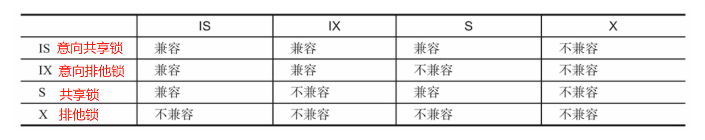
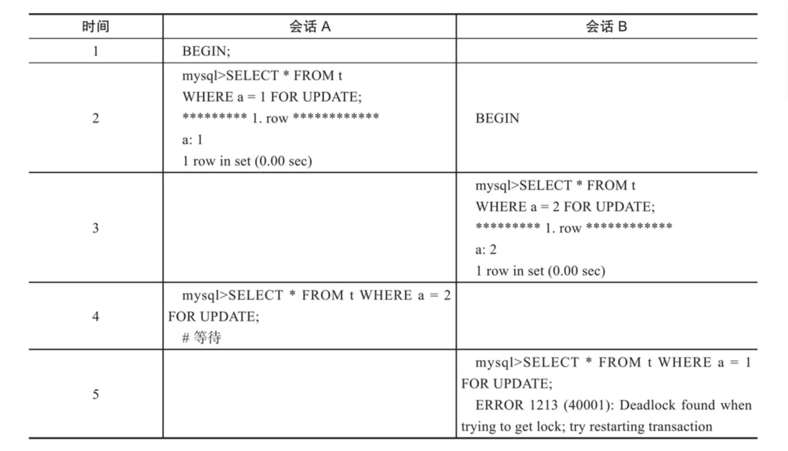

[toc]

## Mysql 锁

### 1.锁的分类

事务的隔离级别: 读未提交，读已提交，可重复读，串行化

<font color="red">锁机制是为了解决数据库的并发控制问题而产生的。事务的隔离级别通过锁的机制来实现。</font>

锁的分类：
* 根据读写分类：共享锁（读锁，S锁）,排他锁（写锁，X锁）
* 根据颗粒度分类：行锁，表锁，页锁等
* 根据锁的状态分类：意向共享锁，意向排他锁。

#### 1. 共享锁（读锁，S锁）
当一个事务为数据加上读锁后，其他事务只能对该数据加读锁而不能对数据加写锁，直到所有的读锁释放之后其他事务才能对其加写锁。

共享锁的目的主要是为了支持并发的读取数据，读取数据的时候不支持对数据进行任何修改。

#### 2. 排他锁（写锁，X锁）
当一个事务为数据加上写锁后，其他事务将不能再为数据加任何锁，直到该锁释放之后其他事务才能对数据进行加锁。

排他锁的目的是在数据修改的时候，不允许其他人同时修改，也不允许其他人读取，避免出现脏数据和脏读的问题。

#### 3. 行锁
行锁是指上锁的时候锁住的是表中的某一行或多行记录，其他事务不能访问被锁住的记录，但可以访问未被锁住的记录。

其特点是：粒度小，加锁比表锁麻烦，但不容易冲突，相比表锁可以支持更高的并发。

#### 4. 表锁
表锁是指上锁的时候锁住的是整个表，当下一个事务访问该表的时候，必须等前一个事务释放了锁，才能进行对表的访问。

其特点是：粒度大，加锁简单，容易冲突，所以支持的并发较低。

#### 5. 页锁
页级锁是MySQL中锁定粒度介于行级锁和表级锁中间的一种锁。表级锁加锁速度快，但冲突多，行级锁冲突少，但是加锁速度慢，而页级锁相对折中，一次锁定一页的数据。

其特点是：锁定粒度、开销和加锁时间介于表锁和行锁之间，并发度一般，和行锁一样也会出现死锁。

#### 6. 意向锁
InnoDB存储引擎支持多粒度锁定，即允许事务在行级上的锁和表级上的锁同时存在。为了支持在不同粒度上进行加锁操作。InnoDB存储引擎支持一种额外的锁方式，称之为意向锁。意向锁是将锁定的对象分为多个层次，意向锁意味着事务可以在更细粒度上进行加锁。


意向锁分为：意向共享锁，意向排他锁。

意向共享锁：事务想要获取到一张表中某几行的共享锁。即若事务想要在获得表中某些记录的共享锁，需要在表上先加意向共享锁。

意向排他锁：事务想要获取到一张表中某几行的排他锁。即若事务想要在获得表中某些记录的互斥锁，需要在表上先加意向互斥锁。


#### 7. 各种锁的兼容性




### 2. 锁的算法

暂无

### 3. 死锁现象

死锁是指多个事务在执行过程中，因互相争夺锁资源而造成的一种互相等待的现象。若无外力作用，多个事务都将无法推进下去。

下图演示了死锁的一种经典的情况，即A等待B、B等待A，这种死锁问题被称为AB-BA死锁。



> 死锁的解决方法

方法1：等待事务超时。当其中一个事务等待时间超过阈值时，该事务会进行回滚，另一个等待的事务就能继续进行。

方法2：InnoDB存储引擎使用wait-for graph（等待图）的方式来主动进行死锁检测。

```
wait-for graph（等待图）方式需要数据库保存两种信息：锁的信息链表，事务等待链表

通过这两种链表可以构造出一张图，而在这个图中若存在回路，就代表存在死锁。这是一种较为主动的死锁检测机制，在每个事务请求锁并发生等待时都会判断是否存在回路，若存在则有死锁。
```

