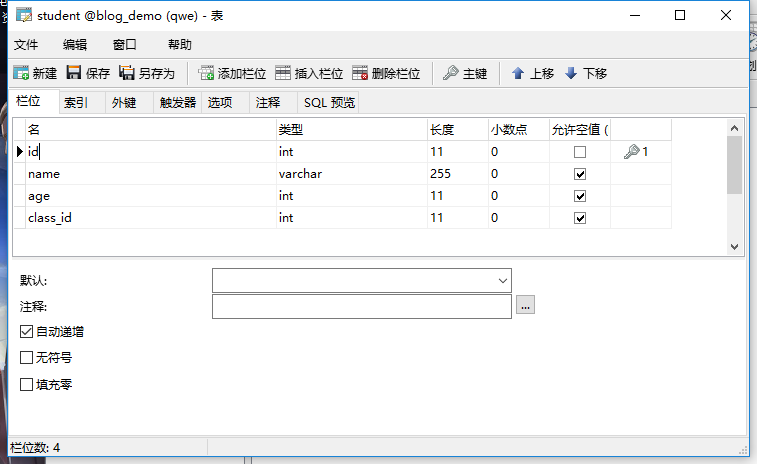

# Mybatis基础

## 概述：
&emsp;&emsp;MyBatis 是支持定制化 SQL、存储过程以及高级映射的优秀的持久层框架。MyBatis 避免了几乎所有的 JDBC 代码和手动设置参数以及获取结果集。MyBatis 可以对配置和原生Map使用简单的 XML 或注解，将接口和 Java 的 POJOs(Plain Old Java Objects,普通的 Java对象)映射成数据库中的记录。

## ORM框架：
目前流行的ORM框架：
JPA , [Hibernate](https://baike.baidu.com/item/Hibernate/206989?fr=aladdin) , <font color="red">Mybatis(半ORM框架)</font>

Hibernate： 会根据数据库的表的结构，自动生成SQL语句，它提供全面的数据库封装机制。
Mybatis：这里的半ORM框架，是相对与Hibernate 这种提供全面的数据库封装机制的“全自动化ORM框架”而言。mybatis不会为程序员在运行期间自动生成 sql 语句执行，具体的sql 语句需要程序员自己编写，然后通过映射配置文件，把sql语句与持久化类进行一一对应。

### 1.概述：
&emsp;&emsp;**对象关系映射**(<font color="red">Object Relational Mapping</font>，简称ORM，或O/RM，或O/R mapping），是一种程序技术，用于实现面向对象编程语言里不同类型系统的数据之间的转换。从效果上说，它其实是创建了一个可在编程语言里使用的--“虚拟对象数据库”。
&emsp;&emsp;对象关系映射技术:**<font color="red">用来把对象模型表示的对象映射到基于S Q L 的关系模型数据库结构中去</font>**。这样，我们在具体的操作实体对象的时候，就<strong color="blue">不需要再去和复杂的 SQ L 语句打交道，只需简单的操作实体对象的属性和方法</strong>。
O R M 技术是在对象和关系之间提供了一条桥梁，前台的对象型数据和数据库中的关系型的数据通过这个桥梁来相互转化。

### 2.ORM框架的基本映射方式：
1. 数据表映射类（持久化类/实体类/entity/pojo）：
&emsp;&emsp;数据库的一个表对应一个映射类（普通的javaBean类),程序对持久话类的操作，ORM框架会转化为对应的数据库表的操作（<font color="red">当程序使用这个持久化类生成实例化对象，删除对象，修改对象中的属性值时，会被自动转化为对数据表的对应的CRUD操作。</font>）。 
2. 数据表的行映射对象：
&emsp;&emsp;持久化类对产生许多实例化对象，<font color="red">每个实例化对象对应数据表的一行记录。</font>当程序操作对象，就相当与操作表中对应的一行记录。
3. 数据表的列（字段）映射对象的属性：
&emsp;&emsp;**当程序修改某个持久化类的某个实例化对象的属性时，就相当与修改某数据表的某一条记录的某一个列（字段）的数据。**


## mybatis的使用前提：

①要使用 MyBatis， 只需将 mybatis-x.x.x.jar 文件置于应用程序的 classpath 中即可。<font color="red">由于Mybatis的底层是基于JDBC 的，因此还要还少不了JDBC驱动的，不同的数据库使用不同的数据库驱动。我这里使用的是MySQL数据库。</font>

Mysql的数据库驱动 ： mysql-connector-java-5.1.42-bin.jar
Mybatis jar包：mybatis-3.4.3.jar

②如果使用 Maven 来构建项目，则需将下面的 dependency 代码置于 pom.xml 文件中：
```xml
<dependencies>    
<dependency>  
<groupId>org.mybatis</groupId>
<artifactId>mybatis</artifactId>  
<version>x.x.x</version>     <!--mybatis的版本号-->
</dependency>

<dependency>
    <groupId>mysql</groupId>
    <artifactId>mysql-connector-java</artifactId>
    <version>x.x.x</version>
</dependency>
</dependencies>
```
## Mybatis的配置文件（全局配置文件，SQL映射配置文件）讲解：
参考链接：
[推荐使用官方settings的文档](http://www.mybatis.org/mybatis-3/zh/configuration.html)

### 1.Mybatis 全局配置文件 Mybatis—config.xml:

**注意:**
<font color="red">全局配置文件中的各个标签的先后位置，不能弄错，否则报错。</font >
各个标签先后顺序：
properties, settings, typeAliases, typeHandlers, objectFactory, objectWrapperFactory, reflectorFactory, plugins, environments, databaseIdProvider, mappers


#### ①.规定Mybatis的xml标签语法规则的dtd文件（主要用于代码提示）：
<font color="red">dtd文件分为两种，全局配置dtd文件，sql映射配置dtd文件。</font>

Mybatis-config.xml
```xml
<?xml version="1.0" encoding="UTF-8"?>
<!DOCTYPE configuration
 PUBLIC "-//mybatis.org//DTD Config 3.0//EN"
 "http://mybatis.org/dtd/mybatis-3-config.dtd">
<configuration>
....
</configuration>
```
上面代码中的`"http://mybatis.org/dtd/mybatis-3-config.dtd"`，用于代码提示。

StudentMapper.xml
```xml
<?xml version="1.0" encoding="UTF-8"?>
<!DOCTYPE mapper
 PUBLIC "-//mybatis.org//DTD Mapper 3.0//EN"
 "http://mybatis.org/dtd/mybatis-3-mapper.dtd">
<!-- 为mapper指定唯一的命名空间，在不用接口式编程的情况下，随便取名 -->
<mapper namespace="com.dao.studentdao">
~ ~ ~
</mapper>
```

上面代码中的`"http://mybatis.org/dtd/mybatis-3-mapper.dtd"`，用于代码提示。


#### ②.引入外部配置文件：
**Mybatis通过 properties 标签来引入外部 properties配置文件。**


config.properties(外部 properties配置文件):
```
jdbc.driver=com.mysql.jdbc.Driver
jdbc.url=jdbc:mysql://localhost:3306/blog_demo?useUnicode=true&amp;characterEncoding=utf8
jdbc.username=root
jdbc.password=123456
```

Mybatis2_config.xml(<font color="red">讲解Mybtis配置文件时使用，临时的</font>) :
```xml
<properties resource="config.properties"/>
<!-- 
	resource 属性： 引入类路径下的配置文件。
	url 属性: 引入网上，磁盘上的配置文件。
-->
<!--环境配置： 指定要连接的数据库-->
<environments default="mysql">
 	<environment id="mysql">
 		<transactionManager type="JDBC"/>   
		 <dataSource type="POOLED">  
		 		<!--${jdbc.driver} 从配置文件获取driver的信息  -->
		 		<property name="driver" value="${jdbc.driver}"/>
		 		<property name="url" value="${jdbc.url}"/>   
		 		<property name="username" value="${jdbc.username}"/>
		 		<property name="password" value="${jdbc.password}"/>
		 </dataSource>
	</environment>
</environments>
```

#### ③.settings标签，设置Mybatis的主要配置标签：

参考链接：
[推荐使用官方settings的文档](http://www.mybatis.org/mybatis-3/zh/configuration.html)


一个配置完整的 settings 元素的示例如下：
Mybatis2_config.xml
```xml

<settings>
  <setting name="cacheEnabled" value="true"/>
  <setting name="lazyLoadingEnabled" value="true"/>
  <setting name="multipleResultSetsEnabled" value="true"/>
  <setting name="useColumnLabel" value="true"/>
  <setting name="useGeneratedKeys" value="false"/>
  <setting name="autoMappingBehavior" value="PARTIAL"/>
  <setting name="autoMappingUnknownColumnBehavior" value="WARNING"/>
  <setting name="defaultExecutorType" value="SIMPLE"/>
  <setting name="defaultStatementTimeout" value="25"/>
  <setting name="defaultFetchSize" value="100"/>
  <setting name="safeRowBoundsEnabled" value="false"/>
  <setting name="mapUnderscoreToCamelCase" value="false"/>
  <setting name="localCacheScope" value="SESSION"/>
  <setting name="jdbcTypeForNull" value="OTHER"/>
  <setting name="lazyLoadTriggerMethods" value="equals,clone,hashCode,toString"/>
</settings>
```

#### ④.typeAliases标签（不推荐使用）：
typeAliases标签是为 Java 类型设置一个短的名字，<font color="blue">别名(不区分大小写)</font>。它只和 XML 配置有关，存在的意义仅在于用来减少类完全限定名的冗余。
Mybatis2_config.xml

```xml
<typeAliases>
  <typeAlias alias="stu" type="com.entity.Student"/>
  <typeAlias alias="sclass" type="com.entity.School_class"/>
  <typeAlias alias="tea" type="com.entity.Teacher"/>
	<!--当没有设置 alies 属性(指定新的别名)时，默认别名为 类名的小写，如student，school_class,teacher-->
</typeAliases>

```
**当这样配置时，stu可以用在任何使用com.entity.Student的地方。**


如果要批量起别名，也可以指定一个包名，MyBatis 会在包名下面搜索需要的 Java Bean，比如:
```xml
<typeAliases>
  <package name="com.entity"/>
</typeAliases>
```

<font color="red">每一个在包 com.entity 中的 Java Bean，在没有注解的情况下，会使用 Bean 的首字母小写的非限定类名来作为它的别名。 比如com.entity.Student 的别名为 student；若有注解，则别名为其注解值。</font>
看下面的例子：
```java
@Alias("stu")
public class Student {
    ...
}
```


#### ⑤.environments标签，运行环境配置：
参考链接：
[推荐使用官方settings的文档](http://www.mybatis.org/mybatis-3/zh/configuration.html)

**MyBatis 可以配置成适应多种环境，这种机制有助于将 SQL 映射应用于多种数据库之中**， 现实情况下有多种理由需要这么做。例如，开发、测试和生产环境需要有不同的配置；或者共享相同 Schema 的多个生产数据库， 想使用相同的 SQL 映射。许多类似的用例。
**不过要记住：尽管可以配置多个环境，每个 SqlSessionFactory 实例只能选择其一。**
所以，如果你想连接两个数据库，就需要创建两个 SqlSessionFactory 实例，每个数据库对应一个。而如果是三个数据库，就需要三个实例，依此类推

```xml
<!--environments 运行环境配置，
   mybatis可以配置多种不同的 environment标签，每个environment标签对于不同的运行环境（数据库，...）,
   但一次只能选择一种运行环境。
	default="mysql" ：指定的运行环境为 mysql，一次只能选一种。该属性的值为 environment的id属性值
	<transactionManager type="JDBC"/> ： mybatis的事务管理的选择，详情请看事务文档 
	 <dataSource type="POOLED">  ：数据源配置。
	 		mybatis自带的数据源：该配置的type 有三个值可选： type=“[UNPOOLED|POOLED|JNDI]”。
	 		若想使用自定义数据源（c3p0，dbcp）：实现DateSource接口，type 的值为自定义数据源的全类名。
-->
<environments default="mysql">

	<!-- mybatis 运行oracle的环境配置 -->
	<environment id="oracle">
		<!-- environment 标签中必须有 transactionManager，dataSource 标签 -->
		<transactionManager type="JDBC"/>  
		 <dataSource type="POOLED">  
		 		<!--${oracle.driver} 从配置文件获取driver的信息  
				 	注意：不同的数据库，你的 驱动jar包要齐全。
				 
				 -->
		 		<property name="driver" value="${oracle.driver}"/>
		 		<property name="url" value="${oracle.url}"/>   
		 		<property name="username" value="${oracle.username}"/>
		 		<property name="password" value="${oracle.password}"/>
		 </dataSource>
	</environment>
	
	<!-- mybatis 运行mysql的环境配置 -->
 	<environment id="mysql">
 		<transactionManager type="JDBC"/>   
		 <dataSource type="POOLED">  
		 		<!--${jdbc.driver} 从配置文件获取driver的信息  -->
		 		<property name="driver" value="${jdbc.driver}"/>
		 		<property name="url" value="${jdbc.url}"/>   
		 		<property name="username" value="${jdbc.username}"/>
		 		<property name="password" value="${jdbc.password}"/>
		 </dataSource>
	</environment>
</environments>
```
其中的一些标签：
`<dataSource type="POOLED">` 
该配置的type 有三个值可选： type=“[UNPOOLED|POOLED|JNDI]”。

**UNPOOLED**: 这个数据源的实现只是每次被请求时打开和关闭连接。虽然一点慢，它对在及时可用连接方面没有性能要求的简单应用程序是一个很好的选择。 不同的数据库在这方面表现也是不一样的，所以对某些数据库来说使用连接池并不重要，这个配置也是理想的

**POOLED** 这种数据源的实现利用“池”的概念将 JDBC 连接对象组织起来，避免了创建新的连接实例时所必需的初始化和认证时间。 这是一种使得并发 Web 应用快速响应请求的流行处理方式.

**JNDI** 这个数据源的实现是为了能在如 EJB 或应用服务器这类容器中使用，容器可以集中或在外部配置数据源，然后放置一个 JNDI 上下文的引用。


#### ⑥.databaseIdProvider标签,支持多数据库运行：

MyBatis 可以根据不同的数据库厂商执行不同的语句，这种多厂商的支持是基于~Mapper.xml映射文件的sql标签语句中的 databaseId 属性。 
<font color="red">MyBatis 会加载不带 databaseId 属性和带有匹配当前数据库 databaseId 属性的所有语句。如果同时找到带有 databaseId 和不带 databaseId 的相同语句，则后者会被舍弃。</font> 

为支持多厂商特性只要像在 mybatis-config.xml 文件中加入 databaseIdProvider 即可：
 
mybatis-config.xml 
```xml
<databaseIdProvider type="DB_VENDOR">
  <property name="SQL Server" value="sqlserver"/>
  <property name="MySQL" value="mysql"/>        
  <property name="Oracle" value="oracle" />
  <!--为不同的数据库厂商标识起别名-->
</databaseIdProvider>
```
type="DB_VENDOR" ：<font color="blue">得到不同数据库厂商的标识，通过标识来执行不同数据库对应的Mapper映射文件的sql语句。</font> 

studentMapper.xml:
```xml
<select id="selectClass" databaseId="mysql" resultType="com.entity.School_class" parameterType="com.entity.School_class">
	select * from school_class where id=#{id}
</select>
<!--
	注意若没有 databaseId 的属性，不管运行环境是那个调用此方法时，sql语句都会执行。
	上面是当运行环境为 mysql 时，会调用该sql语句。
	下面是当运行环境为 oracle 时，会调用该sql语句。
-->
<select id="selectClass" databaseId="oracle" resultType="com.entity.School_class" parameterType="com.entity.School_class">
	select * from school_class where id=#{id}
</select>

```

#### ⑦.mappers标签：
告诉 MyBatis 到哪里去找映射文件。
```xml
	<!-- mappers标签告诉mybatis去哪里找sql（持久化类的）映射文件 -->
		 <mappers>
		 		<!-- 引用类路径下的Mapper映射文件 -->
		 		<mapper resource="com/dao/studentMapper.xml"/> 
		 		<!-- 引用Mapper映射文件对应的接口文件，在基于注解方式使用mybatis时 -->
		 		<mapper  class="com.dao3.studentdao_dynamicSQL"/>
		 		<!--  引用磁盘路径下的Mapper映射文件  -->
		 		<mapper url="file:///c/mappers/studentMapepr.xml"/>
		</mappers>
```

### 2.Mapper映射文件 ~Mapper.xml: 

&emsp;&emsp;MyBatis 的真正强大在于它的映射语句,如果拿它跟具有相同功能的 JDBC 代码进行对比，你会立即发现省掉了将近 95% 的代码。

SQL 映射文件有很少的几个顶级元素（按照它们应该被定义的顺序）：
>cache – 给定命名空间的缓存配置。
>cache-ref – 其他命名空间缓存配置的引用。
>resultMap – 是最复杂也是最强大的元素，用来描述如何从数据库结果集中来加载对象。
>sql – 可被其他语句引用的可重用语句块。
>insert – 映射插入语句
>update – 映射更新语句
>delete – 映射删除语句
>select – 映射查询语句

#### ①.select

简单查询的 select 元素是非常简单的。比如：
```xml
<select id="selectPerson" parameterType="int" resultType="hashmap">
  SELECT * FROM PERSON WHERE ID = #{id}
</select>
```
这个语句被称作 selectPerson，接受一个 int（或 Integer）类型的参数，并返回一个 HashMap 类型的对象，其中的键是列名，值便是结果行中的对应值。


**select 元素有很多属性允许你配置，来决定每条语句的作用细节。**
```xml
<select
  id="selectPerson"   
  parameterType="int"
  parameterMap="deprecated"
  resultType="hashmap"
  resultMap="personResultMap"
  flushCache="false"
  useCache="true"
  timeout="10000"
  fetchSize="256"
  statementType="PREPARED"
  resultSetType="FORWARD_ONLY">

```
id:命名空间中唯一的标识符.
>parameterType： <font color="blue">将会传入这条语句的参数类的完全限定名或别名。这个属性是可选的，因为 MyBatis 可以通过TypeHandler 推断出具体传入语句的参数，默认值为 unset。</font>
>resultType:	从这条语句中返回的期望类型的类的完全限定名或别名。注意如果是集合情形，那应该是集合可以包含的类型，而不能是集合本身。使用 resultType 或 resultMap，但不能同时使用。
resultMap:	外部 resultMap 的命名引用。结果集的映射是 MyBatis 最强大的特性，对其有一个很好的理解的话，许多复杂映射的情形都能迎刃而解。使用 resultMap 或 resultType，但不能同时使用.
flushCache :将其设置为 true，任何时候只要语句被调用，都会导致本地缓存和二级缓存都会被清空，默认值：false。
useCache: 将其设置为 true，将会导致本条语句的结果被二级缓存，默认值：对 select 元素为 true。
timeout	:这个设置是在抛出异常之前，驱动程序等待数据库返回请求结果的秒数。默认值为 unset（依赖驱动）。
fetchSize:这是尝试影响驱动程序每次批量返回的结果行数和这个设置值相等。默认值为 unset（依赖驱动）。
statementType: STATEMENT，PREPARED 或 CALLABLE 的一个。这会让 MyBatis 分别使用 Statement,PreparedStatement 或 CallableStatement，默认值：PREPARED。
resultSetType: FORWARD_ONLY，SCROLL_SENSITIVE 或 SCROLL_INSENSITIVE 中的一个，默认值为 unset （依赖驱动）。
databaseId	:如果配置了 databaseIdProvider，MyBatis 会加载所有的不带 databaseId 或匹配当前 databaseId 的语句；如果带或者不带的语句都有，则不带的会被忽略。
resultOrdered :这个设置仅针对嵌套结果 select 语句适用：如果为 true，就是假设包含了嵌套结果集或是分组了，这样的话当返回一个主结果行的时候，就不会发生有对前面结果集的引用的情况。这就使得在获取嵌套的结果集的时候不至于导致内存不够用。默认值：false。
resultSets :这个设置仅对多结果集的情况适用，它将列出语句执行后返回的结果集并每个结果集给一个名称，名称是逗号分隔的。

#### ②.insert, update 和 delete
简单的insert, update 和 delete例子：
```xml
<insert id="insertAuthor">
  insert into Author (id,username,password,email,bio)
  values (#{id},#{username},#{password},#{email},#{bio})
</insert>

<update id="updateAuthor">
  update Author set
    username = #{username},
    password = #{password},
    email = #{email},
    bio = #{bio}
  where id = #{id}
</update>

<delete id="deleteAuthor">
  delete from Author where id = #{id}
</delete>
```


insert, update 和 delete 元素有很多属性允许你配置，来决定每条语句的作用细节。
```xml
<insert
  id="insertAuthor"
  parameterType="domain.blog.Author"
  flushCache="true"
  statementType="PREPARED"
  keyProperty="id"
  keyColumn=""
  useGeneratedKeys=""           
  timeout="20">

<!--
useGeneratedKeys="":获取自动生成的主键的值。
 keyProperty="id" ：把获取到的主键的值，交给javaBean的那个属性。
-->

<update
  id="updateAuthor"
  parameterType="domain.blog.Author"
  flushCache="true"
  statementType="PREPARED"
  timeout="20">

<delete
  id="deleteAuthor"
  parameterType="domain.blog.Author"
  flushCache="true"
  statementType="PREPARED"
  timeout="20">
```
useGeneratedKeys :<font color="red">（仅对 insert 和 update 有用）这会令 MyBatis 使用 JDBC 的 getGeneratedKeys 方法来取出由数据库内部生成的主键（比如：像 MySQL 和 SQL Server 这样的关系数据库管理系统的自动递增字段），默认值：false。</font>

keyProperty	:（仅对 insert 和 update 有用）唯一标记一个属性，MyBatis 会通过 getGeneratedKeys 的返回值或者通过 insert 语句的 selectKey 子元素设置它的键值，默认：unset。如果希望得到多个生成的列，也可以是逗号分隔的属性名称列表。

keyColumn:（仅对 insert 和 update 有用）通过生成的键值设置表中的列名，这个设置仅在某些数据库（像 PostgreSQL）是必须的，当主键列不是表中的第一列的时候需要设置。如果希望得到多个生成的列，也可以是逗号分隔的属性名称列表。

#### ③.参数处理(单个参数，多个参数,对象，集合)：
```xml
<insert id="insertUser" parameterType="User">
  insert into users (id, username, password)
  values (#{id}, #{username}, #{password})
</insert>

```
**如果 User 类型的参数对象传递到了语句中，id、username 和 password 属性将会被查找，然后将它们的值传入预处理语句的参数中。**

**①.单个单数：**
当代理接口的参数为单个时，Mybatis不会做特殊处理。
	#{参数名} ： 取出参数值。

School_classMapper.xml:
```xml
<select id="selectClass_canshu" resultType="com.entity.School_class">
	select * from school_class where name=#{name}
</select>

```
School_classdao.java:
```java
public School_class selectClass_canshu(String name);
```

**②.多个单数：**
当代理接口的参数为多个时。Mybatis就不太清楚，怎么把参数与sql语句的#{}，#{}，...一一对应：
<font color="red">此时，需要使用@Param</font>
@Param：明确绑定接口参数与sql语句的#{xxx}

School_classMapper.xml:
```xml
<select id="selectClass_canshu" resultType="com.entity.School_class">
	select * from school_class where id=#{id} and name=#{name}
</select>

```
School_classdao.java:
```java
public School_class selectClass_canshu(@Param("id")Integer id,@Param("name")String name);
```
<font color="blue">上面这段代码中的@Param，明确的把sql的#{id},绑定为参数的id ，把sql的#{name},绑定为参数的name</font>

**③.对象：**
```java
public int insertUser(User user);
```

```xml
<insert id="insertUser" parameterType="User">
  insert into users (id, username, password)
  values (#{id}, #{username}, #{password})
</insert>

```
<font color="red">如果 User 类型的代理接口的参数对象传递到了sql语句中，id、username 和 password 属性将会被查找，然后将它们的值传入预处理语句的参数中。</font>

**④.集合（List）：**
&emsp;&emsp;如果返回集合对象，

```xml
<select id="selectAllSchool_class" resultType="com.entity.School_class">
	select * from student 
</select>
```


```java
public List<School_class> selectAllSchool_class();
```

<font color="bule">当代理接口的某个方法返回集合类型时，sql语句的 resultType="com.entity.School_class"，写为集合内每个元素的类型，则mybatis，会把多个查询出来的元素，自动封装为集合。</font>


### 3."#{} 与 ${} 的区别"：
&emsp; #{} :以预编译的方式，把参数设置到sql语句中，类似JDBC的PreparedStatement;用于防止sql注入。
&emsp; ${} :直接把参数的值，拼接在sql语句中，有安全问题。
&emsp;其他方面，没有问题。


## Mybatis的XML方式使用：

porject 类视图(所建项目为Dynamic web project)：


### ①安装MySQL,创建数据库,创建数据表：
安装mysql，===》<font color="red">请自行百度</font>
推荐一个数据库图形界面工具：[Navicat](http://www.navicat.com.cn/)

数据库截图：

数据表截图：


### ②创建持久化类（数据库映射类/javaBean/实体类）：
Student.java
```java
package com.entity;
public class Student {
	private Integer id;
	private String name;
	private Integer age;

	public Student(){}

	public Integer getId() {
		return id;
	}
	public void setId(Integer id) {
		this.id = id;
	}
	public String getName() {
		return name;
	}
	public void setName(String name) {
		this.name = name;
	}
	public Integer getAge() {
		return age;
	}
	public void setAge(Integer age) {
		this.age = age;
	}
	@Override
	public String toString() {
		return "Student [id=" + id + ", name=" + name + ", age=" + age + "]";
	}
}

```
### ③创建Mybatis_config.xml ， 数据库名字：blog_demo

Mybatis_config.xml ---<strong>通过mybatis配置文件来告诉mybatis 连接那个数据库，以及连接数据库的用户名，密码等信息。</strong>

```xml
<?xml version="1.0" encoding="UTF-8"?>
<!DOCTYPE configuration
 PUBLIC "-//mybatis.org//DTD Config 3.0//EN"
 "http://mybatis.org/dtd/mybatis-3-config.dtd">
<configuration>

<!--环境配置： 指定要连接的数据库-->
 <environments default="mysql">
 	<environment id="mysql">
 		<transactionManager type="JDBC"/>    <!-- 事务管理 -->
		 <dataSource type="POOLED">   <!-- datasource 数据源配置-->
		 		<property name="driver" value="com.mysql.jdbc.Driver"/>
		 		<property name="url" value="jdbc:mysql://localhost:3306/blog_demo?useUnicode=true&amp; characterEncoding=utf8"/>   
		 		<property name="username" value="root"/>
		 		<property name="password" value="123456"/>
		 </dataSource>
	</environment>
</environments>
 		
		<!-- mappers标签告诉mybatis去哪里找sql（持久化类的）映射文件 -->
		 <mappers>
		 		<mapper resource="com/dao/studentMapper.xml"/> 
		 </mappers>
		
</configuration>


```

### ④创建studentMapper.xml  ，数据表名字：student

studentMapper.xml----(<font color="red">Mybatis 通过XML 文件去完成持久化类与数据库表之间的映射关系</font>)

```xml
<?xml version="1.0" encoding="UTF-8"?>
<!DOCTYPE mapper
 PUBLIC "-//mybatis.org//DTD Mapper 3.0//EN"
 "http://mybatis.org/dtd/mybatis-3-mapper.dtd">

<!-- 为mapper指定唯一的命名空间，在不用接口式编程的情况下，随便取名 -->
<mapper namespace="com.dao.StudentMapper">

<!--#{id}:从传递过来的参数取出id值-->

<!--动态插入数据-->
<insert id="insertStudent" parameterType="com.entity.Student">         
insert into student
    <trim prefix="(" suffix=")" suffixOverrides="," >
		
    <if test='name != null and name != "" '>
             name,
    </if>
    <if test='age != null and age != "" '>
             age,
    </if>
     
    </trim>

	<trim prefix="values (" suffix=")" suffixOverrides="," >
		    <if test='name != null and name != "" '>
            		 #{name},
		    </if>
		    <if test='age != null and age != "" '>
		              #{age},
		    </if>
	</trim>
</insert>

<!-- 动态删除的sql语句 -->
<delete id="deleteStudent" parameterType="com.entity.Student">
delete from student where 1=1
		<if test="id !=null">and id=#{id}</if>
		<if test="name !=null">and name=#{name}</if>
		<if test="age !=null">and age=#{age}</if>
</delete>
		

<!--动态更新数据-->		
<update id="updateStudent" parameterType="com.entity.Student">
update student
	<trim prefix="set" suffixOverrides=",">
		<if test="name !=null">name=#{name},</if>
		<if test="age !=null">age=#{age},</if>
	</trim>
	where id=#{id}
</update>

<!--动态查询数据-->
<select id="selectStudent" resultType="com.entity.Student" parameterType="com.entity.Student">
	select * from student where 1=1
	 	<if test="id !=null">and id=#{id}</if>
		<if test="name !=null">and name=#{name}</if>
		<if test="age !=null">and age=#{age}</if>
</select>

<!-- 查询全部数据 -->
<select id="selectAllStudent" resultType="com.entity.Student">
		select * from student
</select>

</mapper>

```
### ⑤创建test类，main.java

main.java ---测试mybatis的CRUD操作：

```java
package com.test;

import java.io.IOException;
import java.io.InputStream;

import org.apache.ibatis.io.Resources;
import org.apache.ibatis.session.SqlSession;
import org.apache.ibatis.session.SqlSessionFactory;
import org.apache.ibatis.session.SqlSessionFactoryBuilder;

import com.entity.Student;

public class main {
	public static void main(String[] args) throws IOException {
		/*
		 * 1.通过输入流来读取mybatis的配置文件信息。告诉程序连接的数据库，用户名，密码。以及到哪里去寻找 持久化类与数据表的映射文件
		 * 2.通过xml配置文件信息，初始化mybatis ， 创建SqlSessionFactory
		 * 3.通过SqlSessionFactory，实例化session 对象
		 * 4.创建你要操作的数据对象
		 * 5.找到Mapper映射文件的对应的sql语句，通过映射文件袋命名空间+对应SQL语句的id ，例如："com.dao.StudentMapper.insertStudent"
		 * 6.对操作对象实行CRUD 方法
		 * */
		
		
		//通过这句来读取xml 配置文件的信息
		InputStream inputs=Resources.getResourceAsStream("mybatis_config.xml");
		//初始化mybatis ， 创建SqlSessionFactory，通过xml配置文件信息
		SqlSessionFactory ssf=new SqlSessionFactoryBuilder().build(inputs);
		//实例化session 对象，通过SqlSessionFactory,

//SqlSession session=ssf.openSession(true);  若实例化openSeeion的构造方法，就可以自动提交，不用手动提交。
		SqlSession session=ssf.openSession();
		
		Student stu=new Student();
		stu.setName("xiaoming");
		stu.setAge(12);
		
		//找到Mapper映射文件的对应的sql语句，通过映射文件袋命名空间+对应SQL语句的id
		
		
//		session.insert("com.dao.StudentMapper.insertStudent", stu);
//		session.commit();         //提交到数据库，查询数据不用提交,对数据库的数据不修改的话，不用提交
		
		stu.setId(2);               //修改数据要知道id
		stu.setAge(33);
		session.update("com.dao.StudentMapper.updateStudent", stu);
		session.commit();        //提交到数据库，查询数据不用提交,对数据库的数据不修改的话，不用提交
		
		Student sa=session.selectOne("com.dao.StudentMapper.selectStudent", stu);
		System.out.println(sa);
		
		int a=session.delete("com.dao.StudentMapper.deleteStudent", stu);
		System.out.println(a);
		session.commit();        //提交到数据库，查询数据不用提交,对数据库的数据不修改的话，不用提交
		
		
		session.close();
		System.out.println("ss");
		
	}
}

```

## Mybatis 接口式编程方式， （相比之前调用数据库的方式，接口式编程的方式只要改动几个地方）：
&emsp;&emsp;接口式编程，我们可以简单的理解是<font color="red"> Mybatis 为连接持久化类与数据表之间的映射文件定义了一个代理接口，以后全部通过这个接口来和映射文件交互，而不再是使用以前方法。</font>
&emsp;&emsp;映射文件如何知道自己被哪个接口代理呢？这里就是通过名称空间来实现的，<strong>映射文件的名称空间再也不是随心所欲的定义的了，而是要使用代理接口的全限定名作为其名称空间。所谓全限定名，就是接口所在的包名加上接口名称。</strong>

<strong>类路径图：</strong>


### ①：增加代理接口： studentdao.java 

```java
package com.dao;

import java.util.List;

import com.entity.Student;

public interface studentdao {
	/*
	 * mybatis的代理接口，
	 * 1.是一个接口，并且接口的全类名，必须是映射文件的命名空间的值
	 * 2.接口的方法名与映射文件的SQL语句的id值一一对应。
	 * 3.方法的参数，也与SQL语句的的参数一一对应。
	 * */
	
	public int insertStudent(Student stu);
	public int deleteStudent(Student stu);
	public int updateStudent(Student stu);
	public Student selectStudent(Student stu);
	public List<Student> selectAllStudent();
	
}

```

### ②：修改映射文件的命名空间的值---studentMapper.xml 的命名空间：
```xml
<?xml version="1.0" encoding="UTF-8"?>
<!DOCTYPE mapper
 PUBLIC "-//mybatis.org//DTD Mapper 3.0//EN"
 "http://mybatis.org/dtd/mybatis-3-mapper.dtd">

<!-- 为mapper指定唯一的命名空间，在不用接口式编程的情况下，随便取名,用接口式编程的情况时，应该为代理接口的全类名 -->
<mapper namespace="com.dao.studentdao">
......

```

###  ③测试类 ，main.java 
```java
package com.test;

import java.io.IOException;
import java.io.InputStream;

import org.apache.ibatis.io.Resources;
import org.apache.ibatis.session.SqlSession;
import org.apache.ibatis.session.SqlSessionFactory;
import org.apache.ibatis.session.SqlSessionFactoryBuilder;

import com.dao.studentdao;
import com.entity.Student;

public class main {
	public static void main(String[] args) throws IOException {
		/*
		 * 1.通过输入流来读取mybatis的配置文件信息。告诉程序连接的数据库，用户名，密码。以及到哪里去寻找 持久化类与数据表的映射文件
		 * 2.通过xml配置文件信息，初始化mybatis ， 创建SqlSessionFactory
		 * 3.通过SqlSessionFactory，实例化session 对象
		 * 4.: 通过session对象，用反射的方式，获取代理接口的实例化对象。
		 * 5.创建你要操作的数据对象
		 * 6.用代理接口的方法，实现对数据库的CRUD
		 * 
		 * */
		
		
		//通过这句来读取xml 配置文件的信息
		InputStream inputs=Resources.getResourceAsStream("mybatis_config.xml");
		//初始化mybatis ， 创建SqlSessionFactory，通过xml配置文件信息
		SqlSessionFactory ssf=new SqlSessionFactoryBuilder().build(inputs);
		//实例化session 对象，通过SqlSessionFactory
	//SqlSession session=ssf.openSession(true);  若实例化openSeeion的构造方法，就可以自动提交，不用手动提交。
		SqlSession session=ssf.openSession();
		
		//通过session对象，用反射的方式，获取代理接口的实例化对象，这段代码，相当于实例化接口对象
		studentdao studao=session.getMapper(studentdao.class);
		
		
		Student stu=new Student();
		stu.setName("xiaoming");
		stu.setAge(12);
		
//		int a=studao.insertStudent(stu);
//		System.out.println(a);
//		session.commit();            //提交到数据库，查询数据不用提交,对数据库的数据不修改的话，不用提交
		
		stu.setId(3);               
		stu.setAge(33);
		studao.updateStudent(stu);  //修改数据要知道id
		session.commit();        //提交到数据库，查询数据不用提交,对数据库的数据不修改的话，不用提交
		
		Student sa=studao.selectStudent(stu);
		System.out.println(sa);
		
		int asc=studao.deleteStudent(stu);
		System.out.println(asc);
		session.commit();        //提交到数据库，查询数据不用提交,对数据库的数据不修改的话，不用提交
		
		session.close();
		System.out.println("ss");
		
	}
}

```

## <font color="red">ResultMap（注释很重要）</font>:

### 1.ResultMap的作用概述：
&emsp;&emsp;MyBatis中在查询进行select映射的时候，返回类型可以用resultType，也可以用resultMap，resultType是直接表示返回类型的，而resultMap则是对外部ResultMap的引用（<font color="red">相当于自定义结果集映射规则</font>），但是<strong>resultType跟resultMap不能同时存在</strong>。

&emsp;&emsp;在MyBatis进行查询映射时,<font color="blue">由于Mybatis的底层是JDBC，其实查询出来的每一个属性都是放在一个对应的Map里面的，其中键是属性名，值则是其对应的值。</font>

&emsp;&emsp;①当提供的返回类型属性是resultType时，<font color="red">MyBatis会将Map里面的键值对取出赋给resultType所指定的对象对应的属性。所以其实MyBatis的每一个查询映射的返回类型都是ResultMap，只是当提供的返回类型属性是resultType的时候，MyBatis对自动的给把对应的值赋给resultType所指定对象的属性。</font>
&emsp;&emsp;②当提供的返回类型是resultMap时，因为Map不能很好表示领域模型，就需要自己再进一步的把它转化为对应的对象，这常常在复杂查询中很有作用<font color="green">(需要程序员自定义结果集映射规则，手动的把查询的结果一个一个转化为想要对应的对象)</font>。

### 2.若表的列名与持久化类的属性名不相同，可用ResultMap解决：

<font color="red">这段代码中，student表的列名为 sid,sname,sage,而持久化类(实体类)的属性为 id, name,age</font>

studentMapper.xml
```xml

<select id="selectStudentByid" resultMap="rem">
		select * where id=#{id}
</select>

<!--resultMap 的 id值与 select标签的resultMap的值相同,表明这两个标签互相联系-->

<resultMap type="com.entity.Student" id="rem">
	<id property="id" column="sid"/>  <!-- id 标签指的是该列为主键列，result标签代表普通列-->
	<result property="name" column="sname"/>
	<result property="age" column="sage"/>
</resultMap>

```

### 3.一对一关联查询（association标签）：

参考链接：
[MyBatis两张表字段名相同产生的问题](http://blog.csdn.net/lee4037/article/details/16798941)

&emsp;&emsp;生活中有许多涉及到一对一关联查询的例子，例如，<font color="red">把学生作为中心，一个学生只能有一个班级。查询某个学生时，把他所在的班级也查出来。</font>

1. 增加school_class表：


2. 修改student表（增加class_id 列,class_id 列与school_class的id列 对应。没有设置外键）:

2.5，修改Student的javaBean：
```java
private School_class sclass;       //这个字段用来表示学生的班级,其对应的列名为class_id

public School_class getSclass() {
		return sclass;
}

public void setSclass(School_class sclass) {
		this.sclass = sclass;
}

@Override
public String toString() {
		return "Student [id=" + id + ", name=" + name + ", age=" + age
				+ ", sclass=" + sclass + "]";
}

```

3. 编写School_class的javaBean对象，这个对应school_class表的持久化类，


4. 在StudentMapper的映射文件中使用ResultMap：
&emsp;&emsp;<font color="red">执行select标签时，会根据与其相联系的resultMap 标签来进行结果集映射</font>
<strong>有三种方法：</strong>

数据库中执行sql语句：


<font color="red">①不使用association标签，使用级联属性封装结果集</font>
StudentMapper.xml
```xml
<select id="selectStudent" resultMap="one_one_select_gai" parameterType="com.entity.Student">
	SELECT s.*,sc.id scid,sc.name scname from student s LEFT JOIN 
	
	school_class sc on s.class_id=sc.id where 1=1 
	
	<if test="id !=null">and s.id=#{id}</if>
	 <if test="name !=null">and s.name=#{name}</if>
</select>

<resultMap type="com.entity.Student" id="one_one_select_gai">
	<id property="id" column="id"/>
	<result property="name" column="name"/>
	<result property="age" column="age"/>
	<!--property="sclass.id"表示Student的sclass属性的id属性，把查询出来的scid的列的值，赋值给它  -->
 	<result property="sclass.id" column="scid"/>
 	<result property="sclass.name" column="scname"/>
 	
</resultMap>
```

<font color="red">②：association 使用别名（嵌套查询）</font>

```xml

<select id="selectStudent" resultMap="one_one_select" parameterType="com.entity.Student">
	SELECT s.*,sc.id scid,sc.name scname from student s LEFT JOIN 
	
<!--这里的sql语句使用了 left join...on..关联查询，，scid 是sid的别名，scname是sc.name的别名，s 是student表的别名，sc 是school——class的别名-->

	school_class sc on s.class_id=sc.id where 1=1 
	
	<if test="id !=null">and s.id=#{id}</if>
	 <if test="name !=null">and s.name=#{name}</if>
</select>

<!--resultMap 的 id值与 select标签的resultMap的值相同,表明这两个标签互相联系-->


<resultMap type="com.entity.Student" id="one_one_select">
	<id property="id" column="id"/>
	<result property="name" column="name"/>
	<result property="age" column="age"/>
 	
 <!-- association 用来指定联合的javaBean对象，
 property="sclass"告诉标签那个属性是联合的对象
 javaType 表示联合的对象的类型，不能省略。
 
 association标签内的id,result标签，表示查询出来的列名的值，放到联合对象的那个属性中
  -->	
 	
   <association property="sclass" javaType="com.entity.School_class">
	 <id property="id" column="scid"/>
	 <!--查询出来的列名scid 的值，放到联合对象的id属性中  -->
	 <!--scid 是sid的别名，scname是sc.name的别名-->
     <result property="name" column="scname"/>
   </association> 
	
</resultMap>

```

<font color="red">③：association 分步查询（在sql语句执行时，在执行另一个sql语句）</font>

```xml
<select id="selectStudent2" resultMap="one_one_select2" parameterType="com.entity.Student">
	SELECT s.*,sc.id scid,sc.name scname from student s LEFT JOIN 
	school_class sc on s.class_id=sc.id where 1=1 
	
	<if test="id !=null">and s.id=#{id}</if>
	<if test="name !=null">and s.name=#{name}</if>
</select>

<resultMap type="com.entity.Student" id="one_one_select2">
	<id property="id" column="id"/>
	<result property="name" column="name"/>
	<result property="age" column="age"/>
	<!--association标签中
		使用select指定的方法（传入column指定的列的参数的值），查询出来的结果，封装给property 指定的对象中
	
	-->
   <association property="sclass" column="class_id" javaType="com.entity.School_class" select="selectClass"/>
 <!--select的值，表示执行一条sql语句，select的值指向id为select属性值的select标签。并把执行sql语句的结果，封装到property 代表的对象中。-->
  	
</resultMap>
```

School_classMapper.xml

```xml
<select id="selectClass" resultType="com.entity.School_class" parameterType="com.entity.School_class">
	select * from school_class where id=#{id}
</select>
```


5. 测试：

main.java:
```java
		//通过这句来读取xml 配置文件的信息
		InputStream inputs=Resources.getResourceAsStream("mybatis_config.xml");
		//初始化mybatis ， 创建SqlSessionFactory，通过xml配置文件信息
		SqlSessionFactory ssf=new SqlSessionFactoryBuilder().build(inputs);
		//实例化session 对象，通过SqlSessionFactory
		//SqlSession session=ssf.openSession(true);  若实例化openSeeion的构造方法，就可以自动提交，不用手动提交。
		SqlSession session=ssf.openSession();
		
		//通过session对象，用反射的方式，获取代理接口的实例化对象，这段代码，相当于实例化接口对象
		studentdao studao=session.getMapper(studentdao.class);
		
		Student stu=new Student();
		stu.setName("xiao");
		
		Student s = studao.selectStudent(stu); //selectStudent为代理接口（studentdao）的动态查询数据的方法。
		System.out.println(s);
		System.out.println(s.getSclass());

```
6. 结果截图：


### 4.一对多关联查询（collection标签）：
参考链接：
[一对多表关系详解](http://blog.csdn.net/xzm_rainbow/article/details/15336933)

&emsp;&emsp;生活中，如果以班级为中心的话,<font color="red">一个班级可以有多个学生，这相当与一对多的关系。查询某个班级时，把班级所在的多个学生也查询出来。</font>

1. 添加代码，School_class 的javaBean
```java
private List<Student> stulist;    //一个班可以有多个学生，使用list集合

public List<Student> getStulist() {
		return stulist;
}	
public void setStulist(List<Student> stulist) {
		this.stulist = stulist;
}
@Override
public String toString() {
		return "School_class [id=" + id + ", name=" + name + ", stulist="+ stulist + "]";
}
```
2. 添加代码到mybatis的配置文件：
```xml
<mappers>
	<mapper resource="com/dao/studentMapper.xml"/> 
	<mapper resource="com/dao/School_classMapper.xml"/> 
</mappers>
```
3. 添加代码，到School_classMapper.xml(**这里有两种写法，①使用嵌套查询，②使用分部查询**)
 
**①：嵌套查询**
<strong>测试sql语句：</strong>


```xml
<mapper namespace="com.dao.School_classdao">

<!--#{id}:从传递过来的参数取出id值-->
<select id="selectclass_stu" resultMap="one_to_more">
select sc.* ,s.id sid,s.name sname, s.age sage, s.class_id scid from 
school_class sc LEFT JOIN student s on sc.id=s.class_id where 1=1
		<if test=" id!=null ">and sc.id=#{id}</if>
		<!-- 这段表示，如果传来的参数中的id 不为null，则参数的id的值赋值给sql语句的sc.id -->
		<if test=" name!=null ">and sc.name=#{name}</if>
		
</select>

<resultMap type="com.entity.School_class" id="one_to_more">
	<id property="id" column="id"/>
	<!-- 这段表示，把查询出来的id列的值赋值给School_class的id属性 -->
	<result property="name" column="name"/>
	<collection property="stulist" ofType="com.entity.Student">  
	<!-- ofType:表示集合当中的类型，本例子为Student类型，sid在sql语句中为s.id的别名 ，-->
		<id property="id" column="sid"/>
		<!-- 这段表示，把查询出来的sid列的值赋值给Student的id属性 -->
		<result property="name" column="sname"/>
		<result property="age" column="sage"/>
		<result property="sclass.id" column="scid"/>
		<!-- 这段表示，查询出来的scid列的值，赋值给Student的sclass属性的id字段 -->
		<result property="sclass.name" column="sname"/>
	</collection>

</resultMap>
```

**②分布查询：**

```xml
<!-- 一对多关联查询的分布查询 -->
<select id="selectclass_stu2" resultMap="one_more_aprat">
	select * from school_class where id=#{id}

</select>

<resultMap type="com.entity.School_class" id="one_more_aprat">
	<id property="id" column="id"/>
	<result property="name" column="name"/>
	<collection property="stulist" column="id" select="selectstudent"/>
	<!-- 
		执行select="selectstudent"的sql语句，(把column的值当做参数)，
		查询的结果封装到property="stulist"的属性中。
	 -->

</resultMap>


<!--id="selectstudent" 的select查询，应该写在StudentMapper.xml中,这里是为了方便  -->
<select id="selectstudent" resultType="com.entity.School_class" parameterType="com.entity.School_class">
	select * from student where class_id=#{id}
</select>

```


4. 测试(以嵌套查询为例)：
```java
...
School_classdao mapper =session.getMapper(School_classdao.class);
School_class sc=new School_class();
sc.setName("A");
School_class selectclass_stu = mapper.selectclass_stu(sc);
System.out.println(selectclass_stu);
```
<strong>运行结果：</strong>
School_class [id=1, name=A, stulist=[Student [id=5,name=xiao, age=12, sclass=School_class [id=1, name=null,stulist=null]]]]


### 5.多对多关联查询：
参考链接：
[Mybatis多对多关联查询](https://www.cnblogs.com/hnlictmso/p/6363277.html)

&emsp;&emsp;生活中，如果以班级与老师的关系的话,<font color="red">一个班级可以有多个老师，一个老师可以教多个班级，这就是多对多的关系。①查询某个班级时，把班级所在的多个老师也查询出来。②查询某个老师时，把老师所在的多个班级也查询出来。③把老师全查询出来时，把所以老师的所教的班级都查询出来。</font>
&emsp;&emsp;<strong>一般进行多对多的关联查询，要用到中间表（存放两表达的公共信息，如id，通过公共信息，使得两表产生连接）</strong>

1. 创建老师表：teacher


2. 编写老师表的持久化类（javaBean）,代理接口（方法名与映射文件的id值相同）


3. 添加TeacherMapper.xml到mybatis的配置文件中:
```xml
<!-- mappers标签告诉mybatis去哪里找sql（持久化类的）映射文件 -->
		 <mappers>
		 		<mapper resource="com/dao/studentMapper.xml"/> 
		 		<mapper resource="com/dao/School_classMapper.xml"/> 
		 		<mapper resource="com/dao/TeacherMapper.xml"/> 
		 </mappers>
```

4. 修改School_class表的持久化类，代理接口：


5. 创建中间表：class_teacher（不用编写其javaBean与代理接口）


#### ①查询某个班级时，把班级所在的多个老师也查询出来：


School_classMapper.xml
```xml
<select id="select_class_tescher" resultMap="more_to_more">
SELECT sc.id,sc.name,t.id tid,t.name tname 
from school_class sc,teacher t,class_teacher ct 
where ct.c_id=sc.id and ct.t_id=t.id and sc.id=#{id};

</select>
<!-- tid 是t.id的别名，tname是t.name的别名，ct 是中间表class_teacher的别名， -->
<resultMap type="com.entity.School_class" id="more_to_more">
		<id property="id" column="id"/>
		<result property="name" column="name"/>
		<!-- 把结果的name列的值赋值给School_class的name属性 -->
		<collection property="tealist" ofType="com.entity.Teacher">
			<id property="id" column="tid"/>
			<result property="name" column="tname"/>
			<!-- 把结果的tname列的值赋值给School_class的tealist属性的name字段 -->
		</collection>
</resultMap>

```
测试 main.java:
```java
@Test
	public void test() throws Exception{
		//通过这句来读取xml 配置文件的信息
		InputStream inputs=Resources.getResourceAsStream("mybatis_config.xml");
		//初始化mybatis ， 创建SqlSessionFactory，通过xml配置文件信息
		  SqlSessionFactory ssf=new SqlSessionFactoryBuilder().build(inputs);
		//实例化session 对象，通过SqlSessionFactory
		//SqlSession session=ssf.openSession(true);  若实例化openSeeion的构造方法，就可以自动提交，不用手动提交。
		SqlSession session=ssf.openSession();
		
		//通过session对象，用反射的方式，获取代理接口的实例化对象，这段代码，相当于实例化接口对象
		School_classdao scdao =session.getMapper(School_classdao.class);
		School_class sc=new School_class();
		sc.setId(1);
		School_class selectclass_stu = scdao.select_class_tescher(sc); //代理接口的方法与对应的xml映射文件的CRUD标签的id值相同。
		System.out.println(selectclass_stu);
		
	}
```
测试结果：
School_class [id=1, name=A, stulist=null, tealist=[Teacher [id=1, name=tom, stulist=null, sclass=null], Teacher [id=2, name=jim, stulist=null, sclass=null]]]


#### ②查询某个老师时，把老师所在的多个班级也查询出来：


TeacherMapper.xml
```xml
<!-- 为mapper指定唯一的命名空间，在不用接口式编程的情况下，随便取名 -->
<mapper namespace="com.dao.Teacherdao">

<!--#{id}:从传递过来的参数取出id值-->
<select id="select_teacher_class" resultMap="more_to_more">
SELECT t.id,t.name,sc.id scid ,sc.name scname from 
teacher t,school_class sc ,class_teacher ct 
where t.id=ct.t_id and ct.c_id=sc.id and t.id=#{id};

</select>

<resultMap type="com.entity.Teacher" id="more_to_more">
	<id property="id" column="id"/>
	<result property="name" column="name"/>
	<collection property="sclass" ofType="com.entity.School_class">
		<id property="id" column="scid"/>
		<result property="name" column="scname"/>
	</collection>
</resultMap>
```

测试代码 main.java:
```java
@Test
	public void test2() throws Exception{
		//通过这句来读取xml 配置文件的信息
		InputStream inputs=Resources.getResourceAsStream("mybatis_config.xml");
		//初始化mybatis ， 创建SqlSessionFactory，通过xml配置文件信息
		  SqlSessionFactory ssf=new SqlSessionFactoryBuilder().build(inputs);
		//实例化session 对象，通过SqlSessionFactory
		//SqlSession session=ssf.openSession(true);  若实例化openSeeion的构造方法，就可以自动提交，不用手动提交。
		SqlSession session=ssf.openSession();
		
		//通过session对象，用反射的方式，获取代理接口的实例化对象，这段代码，相当于实例化接口对象
		Teacherdao mapper =session.getMapper(Teacherdao.class);
		Teacher t=new Teacher();
		t.setId(1);
		
		Teacher select_teacher_class = mapper.select_teacher_class(t); //代理接口的方法与对应的xml映射文件的CRUD标签的id值相同。
		System.out.println(select_teacher_class);
		
	}
```

测试结果：
Teacher [id=1, name=tom, stulist=null, sclass=[School_class [id=1, name=A, stulist=null, tealist=null], School_class [id=2, name=B, stulist=null, tealist=null], School_class [id=3, name=C, stulist=null, tealist=null]]]


#### ③把查询全部老师的同时，把所有老师的所教的班级都查询出来：


TeacherMapper.xml:
```xml
<select id="select_teacher_class2" resultMap="more_to_more2">
SELECT t.id,t.name,sc.id scid ,sc.name scname from 
teacher t,school_class sc ,class_teacher ct 
where t.id=ct.t_id and ct.c_id=sc.id ;

</select>
<resultMap type="com.entity.Teacher" id="more_to_more2">
	<id property="id" column="id"/>
	<result property="name" column="name"/>
	<!-- 把查询出来的的name列的值赋值给Teacher类的name属性 -->
	<collection property="sclass" ofType="com.entity.School_class">
		<id property="id" column="scid"/>
		<result property="name" column="scname"/>
		<!-- 把查询出来的的scname列的值赋值给Teacher类sclass属性的name字段 -->
	</collection>
</resultMap>

```

测试代码：
```java
@Test
	public void test3() throws Exception{
		//通过这句来读取xml 配置文件的信息
		InputStream inputs=Resources.getResourceAsStream("mybatis_config.xml");
		//初始化mybatis ， 创建SqlSessionFactory，通过xml配置文件信息
		  SqlSessionFactory ssf=new SqlSessionFactoryBuilder().build(inputs);
		//实例化session 对象，通过SqlSessionFactory
		//SqlSession session=ssf.openSession(true);  若实例化openSeeion的构造方法，就可以自动提交，不用手动提交。
		SqlSession session=ssf.openSession();
		
		//通过session对象，用反射的方式，获取代理接口的实例化对象，这段代码，相当于实例化接口对象
		Teacherdao mapper =session.getMapper(Teacherdao.class);
		Teacher t=new Teacher();
		t.setId(1);
		
		List<Teacher> select_teacher_class = mapper.select_teacher_class2(t);
		System.out.println(select_teacher_class);
		
	}
```
测试结果：
[Teacher [id=1, name=tom, stulist=null, sclass=[School_class [id=1, name=A, stulist=null, tealist=null], School_class [id=2, name=B, stulist=null, tealist=null], School_class [id=3, name=C, stulist=null, tealist=null]]], Teacher [id=2, name=jim, stulist=null, sclass=[School_class [id=1, name=A, stulist=null, tealist=null], School_class [id=3, name=C, stulist=null, tealist=null]]], Teacher [id=3, name=jack, stulist=null, sclass=[School_class [id=4, name=D, stulist=null, tealist=null]]]]

### 6.关联查询补充：

#### 1.懒加载（延迟加载）：
&emsp;&emsp;resultMap可实现高级映射（使用association、collection实现一对一及一对多映射），association、collection具备延迟加载功能。
&emsp;&emsp;如果查询订单并且关联查询用户信息。如果先查询订单信息即可满足要求，当我们需要查询用户信息时再查询用户信息。把对用户信息的按需去查询就是延迟加载。<strong>白话文：不会立即发送sql语句去查询用户信息，而是等到要用用户信息时，才会发送sql语句查询订单对应的用户信息。</strong>
<font color="red">延迟加载：先从单表查询，需要时再从关联表去关联查询，大大提高数据库性能，因为查询单表要比关联查询多张表速度要快。</font>

&emsp;&emsp;<strong>在实际开发中，一对多关系通常映射为集合对象，而由于多的一方的数据量可能很大，所以通常使用懒加载；而多对一只是关联到一个对象，所以通常使用多表连接，直接把数据提取出来即可。</strong>

School_classMapper.xml
```xml

<resultMap type="com.entity.School_class" id="one_to_more">
	<id property="id" column="id"/>

	<result property="name" column="name"/>
	<collection property="stulist" ofType="com.entity.Student" fetchType="lazy">  
	<!--fetchType="lazy" ,fetchType的取值有eager，lazy，
	eager：表示立即加载。
	lazy：表示懒加载。

	注意：当使用fetchType="lazy" 时，使用懒加载时，要在mybatis的配置文件中增加配置：

	
	-->
		<id property="id" column="sid"/>
		
		<result property="name" column="sname"/>
		<result property="age" column="sage"/>
		<result property="sclass.id" column="scid"/>
		<!-- 这段表示，查询出来的scid列的值，赋值给Student的sclass属性的id字段 -->
		<result property="sclass.name" column="sname"/>
	</collection>

</resultMap>
```

mybatis_config.xml:
```xml
<settings>
		<!-- 使用懒加载生效，必须配置的属性
		lazyLoadingEnabled：表示懒加载的的全局开关，所有的关联对象，都会懒加载，默认为false。
		lazyLoadingEnabled：开启时，会使带有懒加载属性的对象立即加载；反之，每种属性都会按需加载，默认为true
		
		 -->
		<setting name="lazyLoadingEnabled" value="true"/>
		<setting name="aggressiveLazyLoading" value="false"/>
</settings>	 
```

#### 2.使用association，collection 标签进行分布查询时，可以传多列的值：
注意：<font color="red">需要把多列的值封装为map，传过去</font>：
&emsp;&emsp;column="{key1=column1,key2=column2,...}"
```xml

 <association property="sclass" column="{id=class_id}" javaType="com.entity.School_class" select="selectClass"/>

```

#### 3.MyBatis的鉴别器（discriminator）:
&emsp;&emsp;使用鉴别器，进行分段查询时，根据表中某个字段区别数据，根据查询的结果，选择不同的封装结果集的规则，将查询出的数据自动封装成不同类型的对象（选择不同的分段查询，类似switch）。
参考链接：
[MyBatis鉴别器](http://blog.csdn.net/ykzhen2015/article/details/51249963)


## 动态SQL:
&emsp;&emsp;Mybatis的动态sql是基于OGNL的表达式来完成的，OGNL表达式可以被用在任意的sql映射语句中。
常用的动态SQL元素：
1. if 语句 (简单的条件判断)
2. choose (when,otherwize) ,相当于java 语言中的 switch ,与 jstl 中的choose 很类似.
3. trim (对包含的内容加上 prefix,或者 suffix 等，前缀，后缀)
4. where (主要是用来简化sql语句中where条件判断的，能智能的处理 and , or ,不必担心多余导致语法错误)
5. set (主要用于更新时)
6. foreach (在实现 mybatis in 语句查询时特别有用)
7. bind
8. sql标签；

参考链接：
[OGNL](https://baike.baidu.com/item/OGNL/10365326?fr=aladdin)

### 1.if 语句 (简单的条件判断)：
```xml

<select id="select1" resultType="Student">  
  select * from User Where 1=1  
  <if test="name != null and phone != null">  
    and name like #{name} and phone = #{phone} 
  </if>  
  <if test="gender != null">  
    and gender = #{gender}  
  </if>  
....
</select>  
```
### 2.choose (when,otherwize)语句：
<font color="red">如果传入了id,就根据id查询，没有传入id，就根据name查询，否则就根据 gender="男" 查询。<font color="red">只会进入其中一个分支（条件）去查询</font>。**例如传入了id，name，还是按id查询。**</font>
```xml
<select id="select2"  resultType="Student">  
  select * from student Where 1=1   

  <choose>  
    <when test="id != null">  
      AND id =#{id}  
    </when>

	<when test="name != null">  
      AND name =#{name}  
    </when>    

    <otherwise>  
      	AND gender="男"  
    </otherwise>  
  </choose>  

</select>   
```

### 3.trim标签（常用，三种用法）
1. 第一种用法：
```xml
<select id="select2" resultType="com.entity.user">
select * from user 
	<trim prefix="where" prefixoverride="AND | OR">

　　	<if test="name != null"> 	
		AND name=#{name}
		</if>

　　	<if test="gender != null">
 		AND gender=#{gender}
    	</if>

	</trim>

</select>
```
<font color="red">假如说name和gender的值都不为null的话.打印的SQL为：
&emsp;&emsp;select * from user where name = 'xx' and gender = 'xx'
在where 与name 之间是不存在第一个and的，上面两个属性的意思如下：
&emsp;&emsp;prefix：前缀　　　　　　
&emsp;&emsp;prefixoverride：去掉第一个and或者是or
</font>


2. 第二种用法：
```xml
<update id="update2" parameterType="com.entity.user">
	update user

<trim prefix="set" suffixoverride="," suffix=" where id = #{id} ">

	<if test="name != null">
 	name=#{name} ,
 	 </if>

	<if test="gender != null"> 
	gender=#{gender} ,  
	</if>

</trim>

</update>
```
<font color="red">假如说name和gender的值都不为null的话打印的SQL为：
update user set name='xx' , gender='xx'    where id='x'
在gender='xx' 与where 的地方不存在逗号，而且自动加了一个set前缀和where后缀，上面三个属性的意义如下，
&emsp;&emsp;prefix：前缀。
&emsp;&emsp;suffixoverride：去掉最后一个逗号（也可以是其他的标记，就像是上面前缀中的and一样）
&emsp;&emsp;suffix：后缀.可直接写在sql语句末尾。
</font>

3. 第三种方法：
```xml
<insert id="insertGoods" parameterType="com.entity.Goods">         
insert into goods
	<trim prefix="(" suffix=")" suffixOverrides="," >	
	<if test='name != null and name != "" '>
             name,
    </if>
    <if test='price != null and price != "" '>
             price,
    </if>
    <if test='introduce != null and introduce != "" '>
             introduce,
    </if>
    </trim>
	
	<trim prefix="values (" suffix=")" suffixOverrides="," >
		
		    <if test='name != null and name != "" '>
            		 #{name},
		    </if>
		    <if test='price != null and price != "" '>
		              #{price},
		    </if>
		    <if test='introduce != null and introduce != "" '>
		              #{introduce},
		    </if>
		
	</trim>

</insert>
```
<strong>如果if的条件都符合的话,sql语句：
insert into goods（ name, price, introduce）values （ 'xx' , 'xx', 'xx' ）
</strong>

### 4.where 
&emsp;&emsp;where 元素知道在有一个及一个以上的if语句成立的情况下，才去插入where子句，而且若最后的内容为 and 或 or 开头，则where元素会将其去除。

```xml
<select id="select3"  resultType="user">  
  SELECT * FROM User  
<where>  
  
  <if test="age != null">  
    age = #{age}  
  </if>  
  <if test="name != null">  
    and name like #{name}  
  </if>  
  
<where> 

</select>  
```
若没有传入 age ,它会自动清除最近内容的and或者or，SQL语句为：<font color="red">
SELECT * FROM User  where  name like #{name}  </font>

### 5.set语句（适用与动态更新）：
```xml
<update id="update1" parameterType="user"> 
  update User  
    <set>  
      <if test="username !=null">
	  username=#{username},
	  </if>  
      <if test="password !=null">
	  password=#{password},
	  </if>  
      <if test="Age != null">
	  Age =#{Age}
	  </if>  
    </set>  
  where id=#{id}  
</update>  
```
set 元素会前置set 关键字，同时会消除多出来的无关的逗号。sql语句：<font color="red">
 update user  set  username=#{username},password=#{password}, Age =#{Age}  where id=#{id}  </font>

### 6.foreach语句：
&emsp;&emsp;关于动态sql的另一个常用的操作就是对集合进行遍历，通常发生在构建 in 条件语句时。
&emsp;&emsp;<font color="red">foreach 的元素功能非常强大。它允许指定一个集合，声明可以用在元素体内的集合项和索引变量。它也允许指定开闭匹配的字符串以及在迭代中间放置分隔符。</font>

<strong>foreach 标签中：</strong>

<font color="red">collection</font> ：指定要遍历的集合，list类型的会特殊处理封装在map中，map的key就叫list。

<font color="red">item</font> ：把当前遍历的元素赋值给指定的变量

<font color="red">separator </font>：每个元素之间的分隔符。

<font color="red">open</font>：遍历条件中，以什么符号开始的。

<font color="red">close</font>：遍历条件中，以什么符号结束的。

<font color="red">index</font>：遍历list时，index表示为索引，item是当前值。遍历map时，index表示为map的key，item为map的value。

<font color="red">"#{item_ids}"</font>: item_ids是变量名，表示取出变量的值，也就是当前遍历出的元素。 

<strong>1. 批量查询：</strong>

```xml

<select id="select5" resultType="user">  
    select * from User where id in  
<foreach collection="list" index="index" item="item_ids" open="(" separator="," close=")">  
        #{item_ids}  
</foreach>  
    
</select>  
    
```

```java
public List<User> select5(List<Integer> ids);  //给这个sql语句传入一个集合，集合的每个元素都为id 
```
SQL语句(一个？表示一个id)：
<font color="red">select * from User where id in （?,?,....）</font>


<strong>2. 批量插入数据：</strong>
mysql支持<font color="red"> insert into tbale_name() values (),(),(),...这种语法</font>

Studentdao.java
```java
	public void addstulist(List<Student> stulist);

```

StudentMapper.xml
```xml
	<insert id="addstulist">
		insert into student (id,name,gender) values
		<foreach collection="list" item="stulist" separator="," >
	    	(#{stulist.id},#{stulist.name},#{stulist.gender})
		</foreach>
	</insert>
```

SQL语句(一个？表示一个id)：

<font color="red">insert into student(id,name,gender) values (?,?,?) ,(?,?,?)...</font>


### 7.bind语句(我也不太会)：
&emsp;&emsp;bind元素可以从OGNL表达式中创建一个变量并将其绑定到上下文中。

bind元素允许你在自定义变量（不用符合OGNL规范），并且应用到上下文中。把OGNL表达式的值绑定到一个变量中，方便后来引用这个变量。
例如：
```xml
<select id="select_bind" resultType="com.entity.user">
  <bind name="name" value="'%' + name + '%'" />
  SELECT * FROM user
  WHERE name LIKE #{name}
</select>
```

bind标签：
name="name" :被绑定的属性，变量。
value="'%' + _parameter.getName() + '%'" ：对被绑定的属性，变量，左右增加'%'。

<font color="red">以后传入的参数的name属性在sql语句中都会左右加上'%',这样就变成了根据 name 进行模糊查询。</font>


```java
 user us=new user();
 us.setName("o");
 ...
 userdao.select_bind(us);
 ...
```
SQL语句：
<font color="red"> SELECT * FROM user WHERE name LIKE '%o%' </font>


### 8.sql，include 标签（抽取可重复使用的sql片段，方便引用）：

sql标签  :抽取sql片段。
inculde标签  :引用被抽取的sql片段。

```xml
<insert id="addstulist">
 insert into student (id,name,gender) values (#{id},#{name},#{gender});
</insert>


<sql id="sql_1">
  id,name,gender
</sql>


<insert id="addstulist">
 insert into student (  <include refid="sql_1"></include>  ) values (#{id},#{name},#{gender});
</insert>

```

## Mybatis的缓存机制：
&emsp;&emsp;在大型项目开发，由于涉及到的表多，数据量大，通常对数据库查询的性能要求很高。Mybatis提供了<font color="red">查询缓存机制，用于缓存查询出来的数据，减轻数据库的压力。从而提高数据库的查询性能。</font>
&emsp;&emsp;Mybatis的查询缓存分为：<font color="blue">一级缓存（SqlSession 级别的缓存），二级缓存（mapper 级别的缓存）</font>。其中，二级缓存是多个SqlSession 共享的。

### 一级缓存（SqlSession 级别）：
&emsp;&emsp;<font color="blue">Mybatis默认开启一级缓存，不需要进行任何配置。</font>
在之前的例子中可以知道，操作数据库之前，需要以下几步：

> 1.通过输入流来读取mybatis的配置文件信息。告诉程序连接的数据库，用户名，密码。以及到哪里去寻找 持久化类与数据表的映射文件
> 2.通过xml配置文件信息，初始化mybatis ， 创建SqlSessionFactory
> 3.通过SqlSessionFactory，实例化session 对象
> 4.创建你要操作的数据对象
> 5.找到Mapper映射文件的对应的sql语句，通过映射文件袋命名空间+对应SQL语句的id ，例如："com.dao.StudentMapper.insertStudent"
> 6.对操作对象实行CRUD 方法

其中第三步，通过<font color="red">SqlSessionFactory，实例化session 对象</font>。<font color="blue">当我们构造session 对象时，在对象中会产生一个 HashMap 用于存储缓存数据</font>。<strong>不同的 SqlSession 之间的缓存数据区域（HashMap）是互相不影响的。</strong>

一级缓存原理及实现过程：
&emsp;&emsp;由于以及一级缓存的作用域是 SqlSession级别的，当同一个SqlSession中执行两次相同的sql语句时，第一次执行sql完毕，会把查询的数据写到缓存（内存）中。当第二次执行相同的sql 查询语句时，会直接从缓存中获取查询数据。不会去底层数据库中进行查询。从而减轻了数据库的压力，提高了查询效率。

<font color="red">注意：</font>
①：如果SqlSession 执行了对数据库的数据进行了修改（如：update，insert，delete）等sql语句，并提交到数据库时。该SqlSession的一级缓存会被清空，保证缓存中的数据是最新的。
②：Mybatis的缓存机制是基于 id 进行缓存的，当HashMap缓存数据时，是使用对象的id，作为key，而对象作为 value 保存的。

当一个SqlSession关闭后，其缓存消失。


### 二级缓存（mapper 级别）：
&emsp;&emsp;<font color="blue">Mybatis默认没有开启二级缓存，需要在Mybatis的配置文件中setting 全局参数中配置开启二级缓存。</font>

二级缓存原理及实现过程：
&emsp;&emsp;在上面的操纵数据库的过程中的第五步中，我们需要通过操作Mapper映射文件的sql语句，实现CRUD操作。由于二级缓存是mapper级别的缓存，当多个不同 SqlSession 使用同一个Mapper的sql 语句去操作数据库时，查询的数据会存在二级缓存区域，该区域同样是由HashMap 进行数据存储。多个不同 SqlSession 可以共享二级缓存，二级缓存是跨SqlSession。

&emsp;&emsp;多个不同 SqlSession 共享二级缓存，其作用域是mapper的同一个namespace。<font color="red">当不同的SqlSession，执行同一个 namespace 下相同的sql语句，并且向 sql语句 传递的参数也相同（即最终执行相同的sql语句）。第一次执行sql完毕，会把查询的数据写到缓存（内存）中。当第二次执行相同的sql 查询语句时，会直接从缓存中获取查询数据。不会去底层数据库中进行查询。</font> 

Mybatis-config.xml
```xml
<settings>
	<!--开启二级缓存 ，该属性默认为 false-->
	<setting name="cacheEnabled" value="true"/>
</settings>
```
UserMapper.xml
```xml

<cache eviction="LRU" flushInterval="60000" size="512" readOnly="true"/>
<!--
以上创建了以后 LRU 缓存，并每隔60 s 刷新，最大存储对象为 512 个，并且返回的对象为只读。

cache元素用于开启当前 mapper 的 namespace 下的二级缓存：

eviction：收回策略（当缓存爆满时），默认为LRU，
	LRU:最近最少使用的策略，移除最长时间不使用的对象缓存。
	FIFO：先进先出策略，按对象进入缓存的顺序来移除它们。
	SOFT：软引用策略，移除基于垃圾回收器状态和软引用规则的对象。
	WEAK：弱引用策略，跟快的移除基于垃圾回收器状态和弱引用规则的对象。

fulshInterval：刷新间隔，缓存多长时间清空一次。
size: 缓存数目，默认值为1024.
readOnly:只读，属性值为 true，false，默认为false。 
	
	当为true 时，mybatis会认为所有从缓存中获取数据的操作，都是只读的操作。给使用者返回缓存对象的数据引用，该引用无法被修改。
	
	当为false 时，mybatis会认为所有从缓存中获取数据的操作都是非只读的操作。会返回缓存对象的拷贝（通过序列化与反序列化），该对象的拷贝可以修改数据，速度慢，会比只读安全些。

-->
```

禁用当前Mapper映射文件中的sql语句是否开启二级缓存。
UserMapper.xml
```xml
<select id="..." resultMap="..." useCache='false'>
```

<strong>注意：</strong>
<font color="red">查询出来的数据默认会放在一级缓存中，只有当SqlSession 提交，关闭时，一级缓存的数据转移到二级缓存中，并清空一级缓存。</font>


## Mybatis的基于注解的方式的使用：

### 1.配置与使用：

&emsp;&emsp;Mybatis提供了比使用XML更加简便的基于注解（Annotation）的方式使用Mybatis。
<font color="red">当使用注解的方式使用Mybatis时，相比XML方式：</font>


>1. 不需要编写持久化类与数据表之间的~Mapper.xml映射文件，
>2. 只需要编写dao接口（代理接口）文件，sql语句写在注解中，放到dao接口（代理接口）文件中，
>3. 只需要在Mybatis-config配置文件中修改配置，告诉Mybatis去哪寻找dao接口文件（代理接口）即可。而不是寻找Mapper.xml映射文件（基于XML方式）。


在基于XMl使用Mybatis的项目中加入了 com.entity.dao2 包，专门存放使用注解的dao接口（代理接口）。

com.entity.dao2.Studentdao_Annotation.java
```java
package com.dao2;

import org.apache.ibatis.annotations.Delete;
import org.apache.ibatis.annotations.Insert;
import org.apache.ibatis.annotations.Options;
import org.apache.ibatis.annotations.Param;
import org.apache.ibatis.annotations.Result;
import org.apache.ibatis.annotations.Results;
import org.apache.ibatis.annotations.Select;
import org.apache.ibatis.annotations.Update;

import com.entity.Student;

public interface Studentdao_Annotation {
	
	@Insert("insert into student(name,age) values(#{name},#{age})")
	public int insertstudent(Student stu);
	
	@Insert("insert into student(name,age) values(#{name},#{age})")
	@Options(useGeneratedKeys=true,keyProperty="id")
	public int insertstudent_2(Student stu);
	
	
	@Delete(" delete from student where id=#{id}")
	public int deletestudentByid(Student stu);
	
	@Delete(" delete from student where id=#{id}")
	public int deletestudentByid_2(@Param("id") Integer id);
	
	@Update("update student set name=#{name},age=#{age} where id=#{id}")
	public int updatestudentByid(Student stu);
	
	@Select("select * from student where id=#{id}")
	public Student selectByid(Student stu);
	
	@Select("select * from student where id=#{id}")
	@Results({
		
		@Result(id=true,column="id",property="id"),
		@Result(column="name",property="name"),
		@Result(column="age",property="age")

	})
	public Student selectByid_2(Student stu);
	
}

```
Mybatis-config.xml
```xml
<!-- mappers标签告诉mybatis去哪里找sql（持久化类的）映射文件,哪里找代理接口文件 -->
		 <mappers>
		 		<mapper resource="com/dao/studentMapper.xml"/> 
		 		<mapper resource="com/dao/School_classMapper.xml"/> 
		 		<mapper resource="com/dao/TeacherMapper.xml"/> 
		 		
		 		<!-- 这是当mybatis使用注解的方式的配置，上面是mybatis使用xml方式配置 -->
		 		<mapper class="com.dao2.Studentdao_Annotation"/>
		</mappers>

```

main2.java(用于测试基于注解的Mybatis的使用方式)
```java
@Test
	public void test1() throws Exception{
		
		//通过这句来读取xml 配置文件的信息
		InputStream inputs=Resources.getResourceAsStream("mybatis_config.xml");
		//初始化mybatis ， 创建SqlSessionFactory，通过xml配置文件信息
		  SqlSessionFactory ssf=new SqlSessionFactoryBuilder().build(inputs);
		//实例化session 对象，通过SqlSessionFactory
		//SqlSession session=ssf.openSession(true);  若实例化openSeeion的构造方法，就可以自动提交，不用手动提交。
		SqlSession session=ssf.openSession();
		
		//通过session对象，用反射的方式，获取代理接口的实例化对象，这段代码，相当于实例化接口对象
		Studentdao_Annotation mapper =session.getMapper(Studentdao_Annotation.class);
		Student stu=new Student();
		stu.setId(5);
		Student a=mapper.selectByid(stu);
		session.commit();
		System.out.println(a);
	
		
	}
```
***

### 2.Mybatis常用注解：

在上面代码中：

```java
	@Insert("insert into student(name,age) values(#{name},#{age})")
	public int insertstudent(Student stu);
	
	@Insert("insert into student(name,age) values(#{name},#{age})")
	@Options(useGeneratedKeys=true,keyProperty="id")
	public int insertstudent_2(Student stu);
```

@Insert：用于映射插入的sql语句。
@Options：在映射语句上作为附加功能的配置出现。
&emsp;&emsp;useGeneratedKeys：该属性为true 表示使用数据库自动增长的主键。该操作需要数据库的支持。
&emsp;&emsp;keyProperty="id" ：表示将插入数据生成的主键设置到 stu对象的id中。

***

```java
	@Delete(" delete from student where id=#{id}")
	public int deletestudentByid(Student stu);
	
	@Delete(" delete from student where id=#{id}")
	public int deletestudentByid_2(@Param("id") Integer id);
```
@Delete ：用于映射删除的sql语句。
@Param ：<font color="red">当方法需要多个参数时，该注解用于给每个参数取一个名字。否则，默认多参数将会以它们的顺序位置和方法对应注解中的sql语句的表达式（#{xxx},#{xxx},...），进行映射。</font>
&emsp;&emsp;@Param("id") Integer id  ： @Param("id") 表示给该注解后面的变量取一个参数名称，对应注解中的#{id}。

***
```java
	@Select("select * from student where id=#{id}")
	public Student selectByid(Student stu);
	
	@Select("select * from student where id=#{id}")
	@Results({
		
		@Result(id=true,column="id",property="id"),
		@Result(column="name",property="name"),
		@Result(column="age",property="age")

	})

	public Student selectByid_2(Student stu);
```
@Select: 用于映射查询的sql语句。
@Results :多个结果映射（@Result）的列表。
@Result：<font color="red">用于列与结果的单独映射关系。如果查询结果的列与属性名称相同，可以省略，Mybatis会进行自动映射。</font>
&emsp;&emsp;id 属性：true/false，表示是否用于主键映射。
&emsp;&emsp;column属性：查询结果数据中对应的列名。
&emsp;&emsp;one 属性：是单独的联系，类似与XML配置的 &lt;association&gt;标签。
&emsp;&emsp;many属性：对集合而言，，类似与XML配置的 &lt;collection&gt; 标签。


### 2.基于注解方式的关联查询：

#### 1.一对一关联查询：
参考链接：
[注解关联查询](http://blog.csdn.net/gluawwa/article/details/53289162)

Studentdao_Annotation.java
```java
//注解方式的一对一关联查询============================

	@Select("SELECT s.*,sc.id scid,sc.name scname from student s LEFT JOIN school_class sc on s.class_id=sc.id where s.id=#{id}")
	@Results({
		@Result(id=true,column="id",property="id"),
		@Result(property="name",column="name"),
		@Result(property="age",column="age"),
		@Result(property="sclass",
				column="class_id",one=@One(
				select="com.dao2.School_classdao_Annotation.selectByid"
				)
		)
	})
	public Student select_stu_class(Integer id);
```

<font color="red">其中：</font>
```java
@Result(property="sclass",
	column="class_id",one=@One(
	select="com.dao2.School_classdao_Annotation.selectByid"
				)
		)
```
one 属性：是单独的联系，类似与XML配置的 &lt;association&gt;标签。

这段代码表示为关联对象的结果集映射规则。含义为：把 column属性的值作为参数，传给select 属性的值指向的方法中，方法返回的结果封装给property 属性值所代表的对象中。

com.dao2.School_classdao_Annotation.selectByid:
```java
@Select("select * from school_class where id=#{id}")
	public School_class selectByid(Integer id);
```


main2.java
```java
//注解方式的一对一关联查询
	@Test
	public void test2() throws Exception{
		....

		Studentdao_Annotation mapper =session.getMapper(Studentdao_Annotation.class);
		
		Student a=mapper.select_stu_class(7);
		session.commit();
		System.out.println(a);
	
		
	}
```


#### 2.一对多关联查询 ？：
参考链接：
[注解关联查询](http://blog.csdn.net/linhaiyun_ytdx/article/details/68947723)

通过班级查询班级下的多个学生：

School_classdao_Annotation.java
```java
//通过班级号查询单个班级，以及多个学生，一对多关联查询
	@Select("select sc.* ,s.id sid,s.name sname, s.age sage, s.class_id scid from school_class sc LEFT JOIN student s on sc.id=s.class_id where sc.id=#{id}")
	@Results({
		@Result(id=true,property="id",column="id"),
		@Result(property="name",column="name"),
		@Result(property="stulist",column="id",many=@Many(
				select="com.dao2.Studentdao_Annotation.selectByclass_id"
				))
	})
	public List<School_class> select_class_student(Integer id);
```

@Result 的 many属性：对集合而言，，类似与XML配置的 &lt;collection&gt; 标签。
这段代码表示为关联对象的结果集映射规则。含义为：把 column属性的值作为参数，传给select 属性的值指向的方法中，方法返回的结果封装给property 属性值所代表的对象中。


```java
 public List<School_class> select_class_student(Integer id);   
```
<font color="red">这段代码返回了两个School_class对象，两个对象一摸一样。暂时不知为什么。</font>

com.dao2.Studentdao_Annotation.selectByclass_id :
```java
@Select("select id,name,age from student where class_id=#{id}")
public Student selectByclass_id(Integer id);
	
```

测试：
```java
//通过session对象，用反射的方式，获取代理接口的实例化对象，这段代码，相当于实例化接口对象
	School_classdao_Annotation mapper =session.getMapper(School_classdao_Annotation.class);
	List<School_class> a=mapper.select_class_student(2);    //由于会查询多条数据
	session.commit();
	System.out.println(a);
	session.close();
```

控制台打印的sql语句：
>[School_class [id=2, name=B, stulist=[Student [id=7, name=xiaoming, age=12, sclass=null, tealist=null], Student [id=8, name=hui, age=22, sclass=null, tealist=null]], tealist=null], 
>School_class [id=2, name=B, stulist=[Student [id=7, name=xiaoming, age=12, sclass=null, tealist=null], Student [id=8, name=hui, age=22, sclass=null, tealist=null]], tealist=null]]

**这段代码返回了两个School_class对象，两个对象一摸一样。暂时不知为什么.**

#### 3.多对多关联查询(懒得写，好麻烦):
参考链接：
[基于注解多对多关联查询](http://blog.csdn.net/linhaiyun_ytdx/article/details/68947739)


### 3.基于注解方式的动态SQL：
1. 新建一个代理接口：

com.dao3.studentdao_dynamicSQL:
```java
public interface studentdao_dynamicSQL {
	//其中的 type 属性指定一个类，method 属性指定该类的某个方法，方法根据参数返回不同的sql语句。

	@SelectProvider(type=student_DynamicSQL.class,method="selectstudent_dynamic")
	public List<Student> selectstudent(Student stu);
	
	@InsertProvider(type=student_DynamicSQL.class,method="insertstudent_dynamic")
	public int insertstudent(Student stu);

	@UpdateProvider(type=student_DynamicSQL.class,method="updatestudent_dynamic")
	public int updatestudent(Student stu);
	
	@DeleteProvider(type=student_DynamicSQL.class,method="deletestudent_dynamic")
	public int deletestudent(Student stu);
	
}
```
**@SelectProvider,@InsertProvider,@UpdateProvider,@DeleteProvider 这四个注解支持动态sql，<font color="red">其中的 type 属性指定一个类，method 属性指定该类的某个方法，方法根据参数返回不同的sql语句。</font>**

2. 创建注解指向的类与方法：

com.dao3.student_DynamicSQL:
```java
public class student_DynamicSQL {
	//基于注解方式的动态查询，根据传入的参数，返回不同的sql语句
	public String selectstudent_dynamic(Student stu){
		return new SQL(){
			{
				SELECT("*");
				FROM("student");
				if(stu.getId()!=null){
					WHERE(" id = #{id} ");
				}
				if(stu.getName()!=null){
					WHERE(" name = #{name} ");
				}
				if(stu.getAge()!=null){
					WHERE(" age = #{age} ");
				}
			
			}
			
		}.toString();
		
	}
	
	//基于注解方式的动态insert，根据传入的参数，返回不同的sql语句
	public String insertstudent_dynamic(Student stu){
		return new SQL(){
			{
				INSERT_INTO("student");
				if(stu.getId()!=null){
					VALUES("id","#{id}");
				}
				if(stu.getName()!=null){
					VALUES("name","#{name}");
				}
				if(stu.getAge()!=null){
					VALUES("age","#{age}");
				}
			
			}
			
		}.toString();
		
	}
	
	//基于注解方式的动态update,根据传入的参数，返回不同的sql语句
	public String updatestudent_dynamic(Student stu){
		return new SQL(){
			{
				UPDATE("student");
				if(stu.getName()!=null){
					SET("name = #{name}");
				}
				if(stu.getAge()!=null){
					SET("age = #{age}");
				}
				WHERE("id = #{id} ");
			}
			
		}.toString();
	}

	//基于注解方式的动态delete,根据传入的参数，返回不同的sql语句
		public String deletestudent_dynamic(Student stu){
			return new SQL(){
				{
					DELETE_FROM("student");
					if(stu.getId()!=null){
						WHERE("id = #{id}");
					}
					if(stu.getName()!=null){
						WHERE("name = #{name}");
					}
					if(stu.getAge()!=null){
						WHERE("age = #{age}");
					}	
				}	
			}.toString();
	}
}

```
其中的<font color="red">WHERE,SET,INSERT,VALUES,INSERT_INTO</font>,...这些函数是由Mybatis提供。
Mybatis中有一个SQL 工具类org.apache.ibatis.jdbc.SQL ,该类不适用字符串拼接的方式，并且会以合适的空格前缀，后缀来构造SQL语句。

3. 测试：
```java
@Test	
public void test1() throws Exception{
		//通过这句来读取xml 配置文件的信息
		InputStream inputs=Resources.getResourceAsStream("mybatis_config.xml");
		//初始化mybatis ， 创建SqlSessionFactory，通过xml配置文件信息
			SqlSessionFactory ssf=new SqlSessionFactoryBuilder().build(inputs);
		//实例化session 对象，通过SqlSessionFactory
		//SqlSession session=ssf.openSession(true);  若实例化openSeeion的构造方法，就可以自动提交，不用手动提交。
		SqlSession session=ssf.openSession();
		//通过session对象，用反射的方式，获取代理接口的实例化对象，这段代码，相当于实例化接口对象
		studentdao_dynamicSQL mapper =session.getMapper(studentdao_dynamicSQL.class);
		Student stu=new Student();
		stu.setId(14);
	
		List<Student> a=mapper.selectstudent(stu);
		//session.commit();
		System.out.println(a);
		session.close();
	}
```


## Mybatis的事务(看参考链接)：
&emsp;&emsp;**多条sql语句访问数据库的过程叫事务，事务是一个最小的逻辑执行单元，整个事务不能分开执行，要么同时执行，要么同时不执行，绝不能执行一部分（比如：当你从银行转账，如果你的账户钱少了，那别人的账户钱多了。一定不能出现你的钱少了，别人的钱不变。）。**

参考链接：
[MyBatis事务管理机制](http://blog.csdn.net/luanlouis/article/details/37992171)


## Spring 与 Mybatis 的整合 ：
<font color="red">整合过程写在 Spring 教程 中的Mybatis 与Spring 之间的整合中，请去哪里观看</font>


## Mybatis的逆向工程：

**mybaits需要程序员自己编写sql语句,mybatis官方提供逆向工程,可以针对单表自动生成mybatis执行所需要的代码（entity,mapper接口文件，mapper映射文件）**

官网：
[mybatis_逆向工程](http://www.mybatis.org/generator/index.html)


<h3>1.导入需要的jar包：</h3>

mybatis-3.4.3.jar
mybatis-generator-core-1.3.5.jar   这是mybatis逆向工程必须的核心jar包
mysql-connector-java-5.1.42-bin.jar

<br/>

<h3>2. 创建数据表（orders表 ， goods表）：</h3>


<br/>

<h3>3. 创建逆向工程的配置文件（MybatisGenerator.xml）</h3>

```xml
<?xml version="1.0" encoding="UTF-8"?>
<!DOCTYPE generatorConfiguration
  PUBLIC "-//mybatis.org//DTD MyBatis Generator Configuration 1.0//EN"
  "http://mybatis.org/dtd/mybatis-generator-config_1_0.dtd">

<generatorConfiguration>
	<!-- 通过路径名指定jar包的位置，如果jar包已经导入到类路径，则不需要该标签 ：
 		 <classPathEntry location="/Program Files/IBM/SQLLIB/java/db2java.zip" />   
  	-->
  	
  	<!-- 
  		 <context>标签用于指定生成mybatis代码的环境，
  			 targetRuntime="MyBatis3Simple"  :表示是生成mybatis3版本的简化版的CRUD代码，注意：默认值是 MyBatis3。 
  			 id:唯一标识符	
  	 	 <jdbcConnection> : 指定如何连接目标数据库。
  	 -->
  <context id="DB2Tables" targetRuntime="MyBatis3">
  	
  	<commentGenerator>
            <!-- 是否去除自动生成的注释 true：是 ： false:否 -->
            <property name="suppressAllComments" value="true" />
    </commentGenerator>
  
  
    <jdbcConnection driverClass="com.mysql.jdbc.Driver"
        connectionURL="jdbc:mysql:///test"
        userId="root"
        password="root">
    </jdbcConnection>

	<!-- 
		<javaTypeResolver> :java类型解析器。    forceBigDecimals属性 ：表示这里是是否强制转换Bigdecimal类型
    <javaTypeResolver >
      <property name="forceBigDecimals" value="false" />
    </javaTypeResolver>
    -->
    
    <!-- 生成javabean的策略：
    		targetPackage="test.model"             ：表示 生成javabean的目标包名
    		targetProject=".\src"    ： 表示生成在那个工程项目下 ,这里表示为当前工程的src目录下
    		enableSubPackages:是否让schema作为包的后缀
    		trimStrings      :从数据库返回的值被清理前后的空格
     -->
    <javaModelGenerator targetPackage="com.model" targetProject=".\src">
      <property name="enableSubPackages" value="true" />
      <property name="trimStrings" value="true" />
    </javaModelGenerator>

	<!-- 生成mapper映射文件的策略：
		targetPackage="com.mapper"    
		targetProject=".\src"    ： 表示生成在那个工程项目下 ,这里表示为当前工程的src目录下
	 -->
    <sqlMapGenerator targetPackage="com.mapper"  targetProject=".\src">
      <property name="enableSubPackages" value="true" />
    </sqlMapGenerator>

	<!-- 生成mapper接口文件的策略-->
    <javaClientGenerator type="XMLMAPPER" targetPackage="com.dao"  targetProject=".\src">
      <property name="enableSubPackages" value="true" />
    </javaClientGenerator>


	<!-- 指定要通过那些表生成mybatis  domainObjectName: 通过表生成的bean名字-->
	<table tableName="orders" domainObjectName="Orders"></table>
	<table tableName="goods" domainObjectName="Goods"></table>


  </context>
</generatorConfiguration>
```

<h3>4. 编写运行逆向工程的主方法test_main ,里面有其他的test方法：</h3>

```java
package com.main;

import java.io.File;
import java.io.IOException;
import java.io.InputStream;
import java.sql.SQLException;
import java.util.ArrayList;
import java.util.List;

import org.apache.ibatis.io.Resources;
import org.apache.ibatis.session.SqlSession;
import org.apache.ibatis.session.SqlSessionFactory;
import org.apache.ibatis.session.SqlSessionFactoryBuilder;
import org.junit.Test;
import org.mybatis.generator.api.MyBatisGenerator;
import org.mybatis.generator.config.Configuration;
import org.mybatis.generator.config.xml.ConfigurationParser;
import org.mybatis.generator.exception.InvalidConfigurationException;
import org.mybatis.generator.exception.XMLParserException;
import org.mybatis.generator.internal.DefaultShellCallback;

import com.dao.OrdersMapper;
import com.model.Orders;
import com.model.OrdersExample;
import com.model.OrdersExample.Criteria;

public class Index {

	@Test
	public void test_main()throws IOException, XMLParserException, InvalidConfigurationException, SQLException, InterruptedException {
		List<String> warnings = new ArrayList<String>();
		boolean overwrite = true;
		// 指定逆向工程配置文件
		File configFile = new File("MybatisGenerator.xml");
		ConfigurationParser cp = new ConfigurationParser(warnings);
		Configuration config = cp.parseConfiguration(configFile);
		DefaultShellCallback callback = new DefaultShellCallback(overwrite);
		MyBatisGenerator myBatisGenerator = new MyBatisGenerator(config, callback, warnings);
		myBatisGenerator.generate(null);

		System.out.println("ok");
	}

	/*
	 * 简单查询
	 * */
	@Test
	public void test_select() throws Exception {
		InputStream inputs = Resources.getResourceAsStream("mybatis_config.xml");
		SqlSessionFactory ssf = new SqlSessionFactoryBuilder().build(inputs);
		SqlSession session = ssf.openSession();
		OrdersMapper ordersmapper=session.getMapper(OrdersMapper.class);
		
		Orders orders = ordersmapper.selectByPrimaryKey(80);
		System.out.println(orders);
	}

	
	/** 复杂查询
	 * @throws Exception
	 */
	@Test
	public void test_selectlike() throws Exception {
		InputStream inputs = Resources.getResourceAsStream("mybatis_config.xml");
		SqlSessionFactory ssf = new SqlSessionFactoryBuilder().build(inputs);
		SqlSession session = ssf.openSession(); 
		OrdersMapper ordersmapper=session.getMapper(OrdersMapper.class);
		
		/* select * from orders where name like '%b%'
		 * 
		 * OrdersExample : 用于封装查询条件的example，例子.
		 * Criteria : 在 Criteria对象中 拼写查询条件
		 * */
		OrdersExample oe=new OrdersExample();
		Criteria criteria = oe.createCriteria();
		criteria.andNameLike("%a%");       // where name like '%b%'
		
		List<Orders> orders = ordersmapper.selectByExample(oe);  //通过封装查询条件的example，来查询数据。
		System.out.println(orders);
		
		
	}
}

```

<h3>5. 运行截图：</h3>

<font color="red">

注意：
①：mybatis_config.xml 是测试用的.不是自动生成的。
②：index.java 是test类。
③：com.dao,com.model,com.mapper 需要自己创建，里面的代码自动生成的。
④：com.model包中的XxxExample类是用于复杂查询使用的，在测试方法中有说明。

</font>


## PS:Mybatis的关联查询补充：

### 1.一对一关联查询 和 一对多关联查询

orders--->t_user：一个订单只由一个用户创建，一对一关系
t_user---->orders：一个用户可以创建多个订单，一对多关系

数据库查询语句:

```
SELECT t1.*,t2.username,t2.sex,t2.address FROM orders t1,t_user t2  WHERE t1.user_id=t2.id
```

实体类：

```java
public class User {
    private Integer id;
    private String username;
    private String sex;
    private String address;
    private Date birthday;
    //用户所属订单列表 一对多关系
    private List<Orders> ordersList;
}

public class Orders {
    private Integer id;
    private Integer userid;
    private String number;
    private Date createTime;
    private String note;
	//订单所属用户 一对一关系
    private User user;
}
```

Mapperxml写法:

<font color="red">查询订单信息并关联所属用户信息。即一对一关联查询的Mapper写法,使用association标签</font>

```xml
<resultMap type="com.mybatis.entity.Orders" id="OrdersUserResultMap">
	<id column="id" property="id"/>
	<result column="user_id" property="userid"/>
	<result column="number" property="number"/>
	<result column="createtime" property="createTime"/>
	<result column="note" property="note"/>
	<association property="user" javaType="com.mybatis.entity.User">
		<!-- id:关联查询用户的唯一标识
			column:指定唯一标识用户信息的列
			property:映射到user的那个属性
		-->
		<id column="user_id" property="id"/>
		<result column="username" property="username"/>
		<result column="sex" property="sex"/>
		<result column="address" property="address"/>
	</association>
</resultMap>
```

<font color="red">查询用户信息并关联所属订单信息。即一对多关联查询的Mapper写法,collection</font>

```xml
<resultMap type="com.mybatis.entity.User" id="UserOrdersResultMap" >
	<collection property="orders" ofType="com.mybatis.entity.Orders">
		<result column="user_id" property="userid"/>
		<result column="number" property="number"/>
		<result column="createtime" property="createTime"/>
		<result column="note" property="note"/>
	</collection>
</resultMap>
```

总结：

>association：
作用：将关联查询信息映射到一个pojo对象中。
场合：为了方便查询关联信息可以使用association将关联订单信息映射为用户对象的pojo属性中，比如：查询订单及关联用户信息。

>collection：
作用：将关联查询信息映射到一个list集合中。
场合：为了方便查询遍历关联信息可以使用collection将关联信息映射到list集合中，比如：查询用户权限范围模块及模块下的菜单，可使用collection将模块映射到模块list中，将菜单列表映射到模块对象的菜单list属性中，这样的作的目的也是方便对查询结果集进行遍历查询。