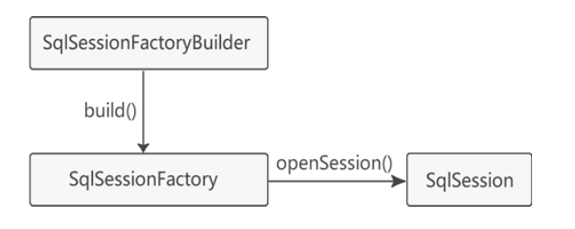

[toc]

# Mybatis笔记1

## Mybatis介绍

MyBatis 是一个开源、轻量级的数据持久化框架，是 JDBC 和 Hibernate 的替代方案。

MyBatis 支持定制化 SQL、存储过程以及高级映射，可以在实体类和 SQL 语句之间建立映射关系，是一种半自动化的 ORM 框架。

MyBatis 的主要思想是将程序中的大量 SQL 语句剥离出来，使用 XML 文件或注解的方式实现 SQL 的灵活配置，将 SQL 语句与程序代码分离，可以在不修改程序代码的情况下，直接在配置文件中修改 SQL 语句。

## ORM框架是什么

ORM（Object Relational Mapping，对象关系映射），是一种数据持久化技术，它可以在对象模型和关系型数据库之间建立起对应关系，并且提供了一种机制，通过操控 JavaBean 对象来间接操控数据库的数据。

> ORM的映射机制

1. 一个表对应一个普通的java类,程序对类的操作，ORM框架会转化为对应的数据库表的操作（例如当程序使用这个持久化类创建对象，删除对象，修改对象中的属性值时，会被自动转化为对数据表的对应的增删改查操作。）。 
2. 表的列（字段）对应类的属性：
3. 表中的一行记录对应类中的一个对象。每个实例化对象对应数据表的一行记录。当程序操作对象，就相当与操作表中的一行记录。

**简而言之，当程序修改某个类的某个实例化对象的属性时，就相当与修改某数据表的某一条记录的某一个列（字段）的数据。**


## Hibernate与Mybatis的区别

Hibernate 和 MyBatis 都是目前业界中主流的对象关系映射（ORM）框架。主要区别如下。

* Hibernate： 全ORM框架，使用 HQL 语句，独立于数据库。不需要编写大量的 SQL。会根据数据库的表的结构，自动生成SQL语句，它提供全面的数据库封装机制。
* Mybatis：半ORM框架。mybatis不会为程序员在运行期间自动生成 sql 语句执行，具体的sql 语句需要程序员自己编写，然后通过映射配置文件，把sql语句与持久化类进行一一对应。

## 第一个Mybtais程序

> 一个完整的 MyBatis 程序的步骤如下
1. 创建数据库表。
2. 项目中导入Mybatis依赖jar包。
3. 创建持久化类。
4. 创建接口类。
5. 创建映射文件。
6. 创建MyBatis配置文件。
7. 编写测试类。

> 步骤1：创建数据库表

创建website表，表结构如下。

```sql
CREATE TABLE `website` (
  `id` int(11) NOT NULL AUTO_INCREMENT,
  `name` varchar(20) COLLATE utf8_unicode_ci NOT NULL,
  `url` varchar(30) COLLATE utf8_unicode_ci DEFAULT '',
  `age` tinyint(3) unsigned NOT NULL,
  `country` char(3) COLLATE utf8_unicode_ci NOT NULL DEFAULT '',
  `createtime` timestamp NULL DEFAULT NULL,
  PRIMARY KEY (`id`)
) ENGINE=InnoDB DEFAULT CHARSET=utf8 COLLATE=utf8_unicode_ci;
```

> 步骤2：导入Mybatis依赖jar包

由于Mybatis的底层是基于JDBC的，因此除了Mybatis依赖jar包，还需要对应的JDBC驱动jar包。

Mysql的数据库驱动jar包：mysql-connector-java
Mybatis依赖jar包：mybatis-3.5.5.jar

```xml
<dependencies>
    <!--mysql-connector-java 用于java连接mysql的JDBC依赖jar包-->
    <dependency>
        <groupId>org.mybatis</groupId>
        <artifactId>mybatis</artifactId>
        <version>3.5.5</version>
    </dependency>
    <!--mysql-connector-java 用于java连接mysql的JDBC依赖jar包-->
    <dependency>
        <groupId>mysql</groupId>
        <artifactId>mysql-connector-java</artifactId>
        <version>5.1.49</version>
    </dependency>
</dependencies>
```

> 步骤3. 创建持久化类。

在 src 目录下创建 com.java.entity 包,该包下Website类

注意，在持久化类中的属性与数据表 website 的字段要一致对应。

```java
public class Website {
    private int id;
    private String name;
    private String url;
    private int age;
    private String country;
    private Date createtime;

    /*省略setter和getter方法*/

    @Override
    public String toString() {
        return "id" + id + "name" + name + "url" + url + "age" + age + "country" + country + "createtime" + createtime;
    }
}
```


> 步骤4. 创建接口类。

在 src 目录下创建 com.java.dao 包,该包下创建WebsiteMapper接口

```java
public interface WebsiteMapper {
    // 新增加一个网站
    public List<Website> addWebsite(Website website);
    // 查询所有网站
    public List<Website> selectAllWebsite();
}
```

> 步骤5. 创建映射文件

在 src 目录下创建 com.java.mapper 包，在该包下创建映射文件 WebsiteMapper.xml。

```xml
<?xml version="1.0" encoding="UTF-8"?>
<!DOCTYPE mapper
PUBLIC "-//mybatis.org//DTD Mapper 3.0//EN"
"http://mybatis.org/dtd/mybatis-3-mapper.dtd">

<mapper namespace="com.java.dao.WebsiteMapper">
    <!-- addWebsite 添加网站 -->
    <insert id="addWebsite" parameterType="com.java.entity.Website">
        insert into website
        (name,url,age,country)
        values(#{name},#{url},#{age},#{country})
    </insert>

    <!-- selectAllWebsite 查询所有网站信息 -->
    <select id="selectAllWebsite"
        resultType="com.java.entity.Website">
        select * from website
    </select>
</mapper>
```

映射文件中，`<mapper>` 元素是配置文件的根元素，它包含了 namespace 属性，该属性值通常为接口的全名。子元素`<select>`和`<insert>`的id属性值通常为接口中的方法名。

子元素`<select>`和`<insert>`分别表示select语句和insert语句。语句中的“#{}”表示一个占位符，相当于“?”，而“#{name}”表示该占位符待接收参数的名称为 name。

当namespace属性和id属性分别是接口的类名和方法名时。mybatis才能把接口中的方法和映射文件中的sql语句绑定在一起。这样可以不用写该接口的实现类，MyBatis 会通过接口的完整限定名查找到对应的 mapper 配置来执行 SQL 语句。因此 namescape 的命名必须要跟接口同名。

简而言之，在程序中调用接口的方法，就相当于执行对应的sql语句。

> 步骤6. 创建MyBatis核心配置文件。

在 src 目录下创建 MyBatis 的核心配置文件 mybatis-config.xml，在该文件中配置数据库环境和映射文件的位置。

```xml
<?xml version="1.0" encoding="UTF-8"?>
<!DOCTYPE configuration PUBLIC "-//mybatis.org//DTD Config 3.0//EN"
"http://mybatis.org/dtd/mybatis-3-config.dtd">
<configuration>
    <settings>
        <setting name="logImpl" value="LOG4J" />
    </settings>
    <!-- 配置mybatis运行环境 -->
    <environments default="development">
        <environment id="development">
            <!-- 使用JDBC的事务管理 -->
            <transactionManager type="JDBC" />
            <dataSource type="POOLED">
                <!-- MySQL数据库驱动 -->
                <property name="driver" value="com.mysql.jdbc.Driver" />
                <!-- 连接数据库的URL -->
                <property name="url"
                    value="jdbc:mysql://localhost:3306/test?characterEncoding=utf8" />
                <property name="username" value="root" />
                <property name="password" value="root" />
            </dataSource>
        </environment>
    </environments>
    <!-- 在配置文件中添加mapper映射文件的路径 -->
    <mappers>
        <mapper resource="com/java/mapper/WebsiteMapper.xml" />
    </mappers>
</configuration>
```

> 步骤6. 编写测试类Test

在 src 目录下创建一个名为 com.java.test 的包，在该包中创建 MyBatisTest 测试类。
1. 在测试类中首先使用输入流读取配置文件，
2. 然后根据配置信息构建 SqlSessionFactory 对象。
3. 接下来通过 SqlSessionFactory 对象创建 SqlSession 对象。
4. 然后使用 SqlSession 对象中的方法执行数据库操作。

```java
public class Test {
    public static void main(String[] args) throws IOException {
        // 读取配置文件mybatis-config.xml
        InputStream config = Resources.getResourceAsStream("mybatis-config.xml");
        // 根据配置文件构建SqlSessionFactory
        SqlSessionFactory ssf = new SqlSessionFactoryBuilder().build(config);
        // 通过SqlSessionFactory创建SqlSession
        SqlSession ss = ssf.openSession();
        //通过SqlSession对象的getMapper方法来获取WebsiteMapper接口的实例化对象
        WebsiteMapper websiteMapper = ss.getMapper(WebsiteMapper.class);

        // 添加网站
        Website website = new Website();
        website.setName("小明的网站");
        website.setUrl("https://www.xiaoming.com/");
        website.setAge(21);
        website.setCountry("CN");
        //调用WebsiteMapper接口的addWebsite方法
        websiteMapper.addWebsite(website);

        // 查询所有网站
        List<Website> websitelist = websiteMapper.selectAllWebsite();
        for (Website site : websitelist) {
            System.out.println(site);
        }
        // 提交事务
        ss.commit();
        // 关闭 SqlSession
        ss.close();
    }

        
}

// 运行结果如下
// DEBUG [main] - ==>  Preparing: insert into website (name,url,age,country) values(?,?,?,?)
// DEBUG [main] - ==> Parameters: 编程帮(String), https://www.biancheng.net/(String), 21(Integer), CN(String)
// DEBUG [main] - <==    Updates: 1
// DEBUG [main] - ==>  Preparing: select * from website
// DEBUG [main] - ==> Parameters:
// DEBUG [main] - <==      Total: 1
// Website[id=1,name=编程帮,url=https://www.biancheng.net/,age=21,country=CN,createtime=Tue Feb 23 10:20:40 CST 2021]
```


## Mybatis核心概念

> MyBatis 有三个核心概念
* 核心接口和类
* MyBatis核心配置文件（mybatis-config.xml）
* 映射器(例如 mapper.xml)

### Mybatis的核心接口和类

Mybatis的核心接口和类，如图所示



Mybatis的执行流程如下
1. 每个 MyBatis 应用程序开始运行的时候。
2. MyBatis 应用根据 XML 配置文件或者 配置类的开始构建SqlSessionFactoryBuilder 对象。
3. 然后通过SqlSessionFactoryBuilder 对象的build()方法来创建SqlSessionFactory 对象。
4. 然后通过SqlSessionFactory 对象来创建SqlSession 对象。
5. SqlSession 类似于 JDBC 中的 Connection。它提供了面向数据库执行 SQL 命令所需的所有方法，可以通过 SqlSession 实例对象直接运行已映射的 SQL 语句。

### MyBatis 配置文件（mybatis-config.xml）

MyBatis 配置文件的结构如下。<font color="red">注意，配置文件中的各个标签的先后位置，不能弄错，否则报错。</font >

```xml
<?xml version="1.0" encoding="utf-8"?>
<!DOCTYPE configuration PUBLIC "-//mybatis.org//DTD Config 3.0//EN"
"http://mybatis.org/dtd/mybatis-3-config.dtd">
<configuration><!-- 配置 -->
    <properties /><!-- 属性 -->
    <settings /><!-- 设置 -->
    <typeAliases /><!-- 类型命名 -->
    <typeHandlers /><!-- 类型处理器 -->
    <objectFactory /><!-- 对象工厂 -->
    <plugins /><!-- 插件 -->
    <environments><!-- 配置环境 -->
        <environment><!-- 环境变量 -->
            <transactionManager /><!-- 事务管理器 -->
            <dataSource /><!-- 数据源 -->
        </environment>
    </environments>
    <databaseIdProvider /><!-- 数据库厂商标识 -->
    <mappers /><!-- 映射器 -->
</configuration>
```

① 下面这段主要是mybatis-config.xml的文档说明。

```xml
<?xml version="1.0" encoding="utf-8"?>
<!DOCTYPE configuration PUBLIC "-//mybatis.org//DTD Config 3.0//EN"
"http://mybatis.org/dtd/mybatis-3-config.dtd">
```

① `<configuration>`标签

configuration 标签是整个 XML 配置文件的根节点。

② `<properties>`标签

properties 标签可以通过 resource 或 url 属性导入外部 properties 文件。

例子
```xml
<properties resource="config.properties"/>
<!-- 
	resource 属性： 引入src目录下的配置文件。
	url 属性: 引入网上，磁盘上的配置文件。
-->
<!--环境配置： 指定要连接的数据库-->
<environments default="mysql">
 	<environment id="mysql">
 		<transactionManager type="JDBC"/>   
		 <dataSource type="POOLED">  
		 		<!--${jdbc.driver} 从外部配置文件上获取driver的信息  -->
		 		<property name="driver" value="${jdbc.driver}"/>
		 		<property name="url" value="${jdbc.url}"/>   
		 		<property name="username" value="${jdbc.username}"/>
		 		<property name="password" value="${jdbc.password}"/>
		 </dataSource>
	</environment>
</environments>
```

③ `<settings >`标签

[参考链接：官方settings的文档](http://www.mybatis.org/mybatis-3/zh/configuration.html)

一个配置完整的 settings 的示例如下
```xml
<settings>
    <!--配置缓存的全局开关-->
    <setting name="cacheEnabled" value="true"/>
    <!--延迟加载的全局开关-->
    <setting name="lazyLoadingEnabled" value="true"/>
    <!--是否允许单一语句返回多结果集-->
    <setting name="multipleResultSetsEnabled" value="true"/>
    <!--使用列标签代替列名-->
    <setting name="useColumnLabel" value="true"/>
    <!--支持自动生成主键-->
    <setting name="useGeneratedKeys" value="false"/>
    <setting name="autoMappingBehavior" value="PARTIAL"/>
    <setting name="autoMappingUnknownColumnBehavior" value="WARNING"/>
    <setting name="defaultExecutorType" value="SIMPLE"/>
    <!--设置超时时间-->
    <setting name="defaultStatementTimeout" value="25"/>
    <!--设置数据库驱动程序默认返回的条数限制-->
    <setting name="defaultFetchSize" value="100"/>
    <setting name="safeRowBoundsEnabled" value="false"/>
    <!--是否开启自动驼峰命名规则映射-->
    <setting name="mapUnderscoreToCamelCase" value="false"/>
    <setting name="localCacheScope" value="SESSION"/>
    <setting name="jdbcTypeForNull" value="OTHER"/>
    <setting name="lazyLoadTriggerMethods" value="equals,clone,hashCode,toString"/>
</settings>
```

④ `<typeAliases>`标签

typeAliases 标签用于给类的全名定义一个别名。

```xml
<typeAliases>
    <!-- 给com.java.po.Student 定义一个别名 stu  -->
    <typeAlias alias = "stu" type = "com.entity.Student"/>
</typeAliases>
```

当这样配置时，在xml配置文件中 stu可以用在任何使用com.entity.Student的地方。

⑤ `<typeHandlers>`标签

typeHandlers 主要将获取的值合理地转化为 Java 类型。主要作用就是承担 数据库类型 和  Java 类型 之间的相互转换。

⑥ `<environments>`标签

environments 标签可以配置 MyBatis 的多套运行环境，将 SQL 映射到多个不同的数据库上。注意必须指定其中一个为默认运行环境（通过default指定）。

```xml
<!--环境配置： 指定要连接的数据库,default指定默认允许环境-->
<environments default="mysql">
    <!-- mybatis 运行oracle的环境配置 -->
	<environment id="oracle">
		<!-- environment 标签中必须有 transactionManager，dataSource 标签 -->
		<transactionManager type="JDBC"/>  
		 <dataSource type="POOLED">  
		 		<property name="driver" value="${oracle.driver}"/>
		 		<property name="url" value="${oracle.url}"/>   
		 		<property name="username" value="${oracle.username}"/>
		 		<property name="password" value="${oracle.password}"/>
		 </dataSource>
	</environment>
    <!-- mybatis 运行mysql的环境配置 -->
 	<environment id="mysql">
 		<transactionManager type="JDBC"/>   
		 <dataSource type="POOLED">  
		 		<!--${jdbc.driver} 从外部配置文件上获取driver的信息  -->
		 		<property name="driver" value="${jdbc.driver}"/>
		 		<property name="url" value="${jdbc.url}"/>   
		 		<property name="username" value="${jdbc.username}"/>
		 		<property name="password" value="${jdbc.password}"/>
		 </dataSource>
	</environment>
</environments>
```

`<dataSource type="POOLED">`：用于数据源设置，有三个值可选。

* UNPOOLED: 每次进行sql请求时，会重新打开和关闭sql连接。虽然一点慢，它对没有性能要求的简单应用程序是一个很好的选择。
* POOLED: 这种数据源的实现利用“池”的概念将sql连接组织起来，避免了创建新的sql连接时,必需的初始化和认证时间。 这是一种使得并发 Web 应用快速响应请求的流行处理方式.
* JNDI: 这个数据源的实现是为了能在如 EJB 或应用服务器这类容器中使用，容器可以集中或在外部配置数据源，然后放置一个 JNDI 上下文的引用。

⑦ `<mappers>`标签

mappers 标签用于指定 MyBatis SQL 映射文件的路径。

```xml
<!-- mappers标签告诉mybatis去哪里找sql映射文件 -->
<mappers>
    <!-- 引用类路径下的Mapper映射文件 -->
    <mapper resource="com/dao/studentMapper.xml"/> 
    <!-- 引用Mapper映射文件对应的接口文件，在基于注解方式使用mybatis时 -->
    <mapper class="com.dao.studentdao_dynamicSQL"/>
    <!--  引用磁盘路径下的Mapper映射文件  -->
    <mapper url="file:///c/mappers/studentMapepr.xml"/>
</mappers>
```

### MyBatis 映射器

映射器是 MyBatis 中最重要的文件，文件中包含一组 SQL 语句（例如查询、添加、删除、修改），这些语句称为映射语句或映射 SQL 语句。<font color="red">注意：映射器需要与Java接口搭配使用。</font>

> 映射器有以下两种实现方式。
* 通过 XML 文件方式实现。
* 通过注解的方式实现。

#### XML方式实现Mapper映射器的例子

步骤1：先定义一个接口

```java
public interface WebsiteMapper {
    // 查询所有网站
    public List<Website> selectAllWebsite();
}
```

步骤2：创建映射文件 WebsiteMapper.xml

```xml
<?xml version="1.0" encoding="UTF-8"?>
<!DOCTYPE mapper
PUBLIC "-//mybatis.org//DTD Mapper 3.0//EN"
"http://mybatis.org/dtd/mybatis-3-mapper.dtd">
<!--namespace的属性值就是接口的全名-->
<mapper namespace="com.java.mapper.WebsiteMapper">
    <!-- 查询所有网站信息，对应WebsiteMapper接口的selectAllWebsite方法 -->
    <!--id的属性值就是接口中的方法名称-->
    <select id="selectAllWebsite"
        resultType="com.java.entity.Website">
        select * from website
    </select>
</mapper>
```

* namescape 的命名必须跟接口同名，并且xml映射文件与接口应放置在同一包中。
* `<select>`元素表明这是一条查询语句，属性id必须要与接口中的方法名称对应。resultType 表示返回类型。

当namespace属性和id属性分别是接口的类名和方法名时。mybatis才能把接口中的方法和映射文件中的sql语句绑定在一起。这样可以不用写该接口的实现类，MyBatis 会通过接口的完整限定名查找到对应的 mapper 配置来执行 SQL 语句。因此 namescape 的命名必须要跟接口同名。

简而言之，在程序中调用接口的方法，就相当于执行对应的sql语句。

步骤3：在Mybatis配置文件中，添加Mapper映射文件的位置

```xml
<?xml version="1.0" encoding="UTF-8"?>
<!DOCTYPE configuration PUBLIC "-//mybatis.org//DTD Config 3.0//EN"
"http://mybatis.org/dtd/mybatis-3-config.dtd">
<configuration>
    <!-- ........................ -->
    <!-- 将mapper映射文件加入到配置文件中 -->
    <mappers>
        <mapper resource="com/java/mapper/WebsiteMapper.xml" />
    </mappers>
</configuration>
```

当mybatis应用启动后，mybatis会读取到配置文件中映射文件的位置。根据mapper映射文件，来生成映射器。

步骤4：测试启动类

```java
public class Test {
    public static void main(String[] args) throws IOException {
        //输入流获取到mybatis配置文件
        InputStream config = Resources.getResourceAsStream("mybatis-config.xml");
        //SqlSessionFactoryBuilder对象通过配置文件来创建SqlSessionFactory对象
        SqlSessionFactory ssf = new SqlSessionFactoryBuilder().build(config);
        //SqlSessionFactory对象生成SqlSession对象
        SqlSession ss = ssf.openSession();
        WebsiteMapper websiteMapper = ss.getMapper(WebsiteMapper.class);
        List<Website> websitelist = websiteMapper.selectAllWebsite();
        for (Website site : websitelist) {
            System.out.println(site);
        }
        // 提交事务
        ss.commit();
        // 关闭 SqlSession
        ss.close();
    }
}

//运行结果
// DEBUG [main] - ==>  Preparing: select * from website
// DEBUG [main] - ==> Parameters:
// DEBUG [main] - <==      Total: 1
// Website[id=1,name=小明,url=https://www.xxx.net/,age=21,country=CN,createtime=Tue Feb 23 10:20:40 CST 2021]
```

#### 注解方式实现Mapper映射器的例子

步骤1：先定义一个接口

```java
public interface WebsiteMapper2 {
    //使用 @Select 注解，并且注入了和 XML 映射文件中相同的 select 语句。
    @Select(value = "select * from website")
    public List<Website> selectAllWebsite();
}
```

* 注解的方式相当于将接口和xml映射文件结合在一起了。
* 注意：如果使用注解和 XML 文件两种方式同时定义，那么 XML 方式将覆盖掉注解方式。

步骤2：在Mybatis配置文件中，添加Mapper接口文件的位置

```xml
<mappers>
    <!-- 这是mybatis使用注解的方式的配置,用class属性指向接口的路径-->
    <mapper class="com.dao.WebsiteMapper2"/>
</mappers>
```

当mybatis应用启动后，mybatis会读取到配置文件中接口文件的位置。根据mapper映射接口文件，来生成映射器。


步骤3：测试启动类

```java
public class Test {
    public static void main(String[] args) throws IOException {
        //读取xml 配置文件的信息
		InputStream inputs=Resources.getResourceAsStream("mybatis_config.xml");
		//初始化mybatis,通过xml配置文件信息来创建SqlSessionFactory对象
		SqlSessionFactory ssf=new SqlSessionFactoryBuilder().build(inputs);
		//SqlSessionFactory对象生成SqlSession对象
		SqlSession ss=ssf.openSession();
		//通过session对象，用反射的方式，获取WebsiteMapper2接口的实例化对象
        WebsiteMapper2 websiteMapper2 = ss.getMapper(WebsiteMapper2.class);
        List<Website> websitelist = websiteMapper2.selectAllWebsite();
        for (Website site : websitelist) {
            System.out.println(site);
        }
        // 提交事务
        ss.commit();
        // 关闭 SqlSession
        ss.close();
    }
}

//运行结果
// DEBUG [main] - ==>  Preparing: select * from website
// DEBUG [main] - ==> Parameters:
// DEBUG [main] - <==      Total: 1
// Website[id=1,name=小明,url=https://www.xxx.net/,age=21,country=CN,createtime=Tue Feb 23 10:20:40 CST 2021]
```

上述代码中，通过session对象的getMapper方法，获取WebsiteMapper2接口的实例化对象。然后调用接口中的方法，就相当于调用方法对应注解的sql语句。


> 注解方式实现映射器的缺点

虽然注解的方式 比 XML的方式 省略了许多代码，但是现实中的 SQL 会比该例子复杂得多。如果 SQL 语句中有多个表的关联、多个查询条件、级联、条件分支等，显然这条 SQL 语句就会复杂的多，所以并不建议使用注解这种方式。

例如下面的sql语句，涉及多个表，很长很复杂。
```sql
select * from t_user u
left join t_user_role ur on u.id = ur.user_id
left join t_role r on ur.role_id = r.id
left join t_user_info ui on u.id = ui.user_id
left join t_female_health fh on u.id = fh.user_id
left join t_male_health mh on u.id = mh.user_id
where u.user_name like concat('%', ${userName},'%')
and r.role_name like concat('%', ${roleName},'%')
and u.sex = 1
and ui.head_image is not null;
```

如果把以上 SQL 语句放到 @Select 注解中，无疑会大大降低代码的可读性，不利于日后的维护和修改。因此在一些比较复杂的场景下，使用 XML 方式会更加灵活和方便。