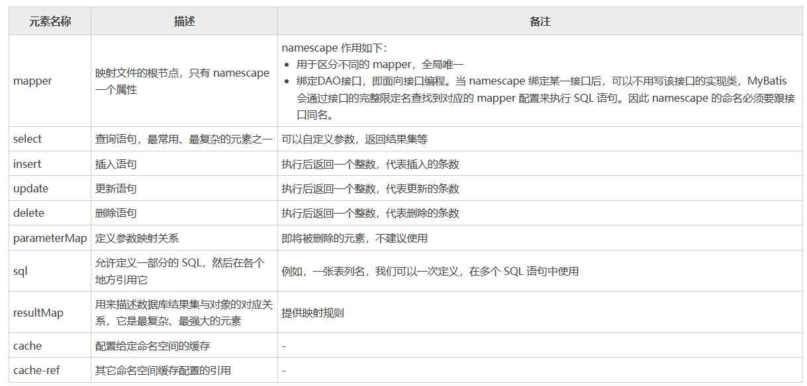
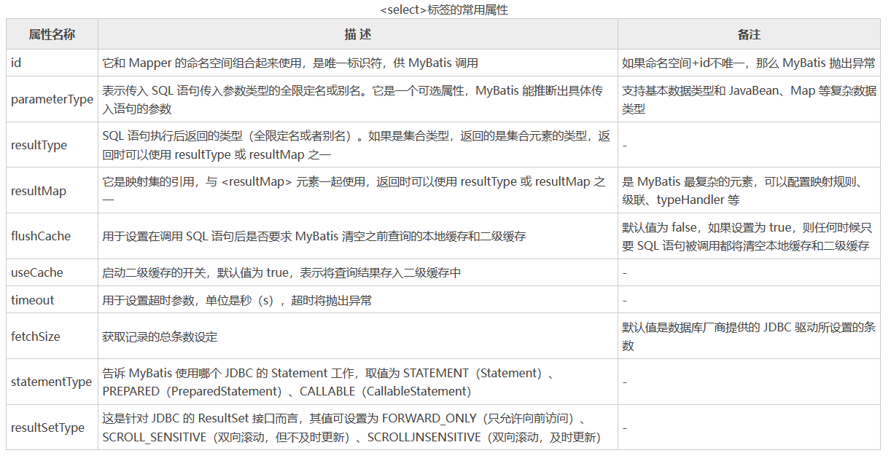
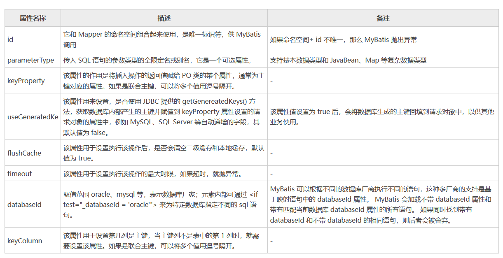
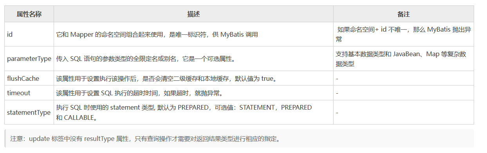
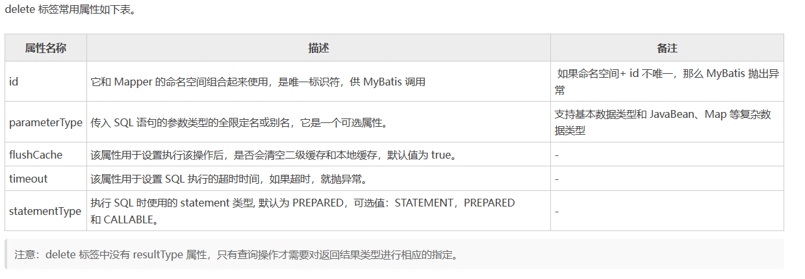
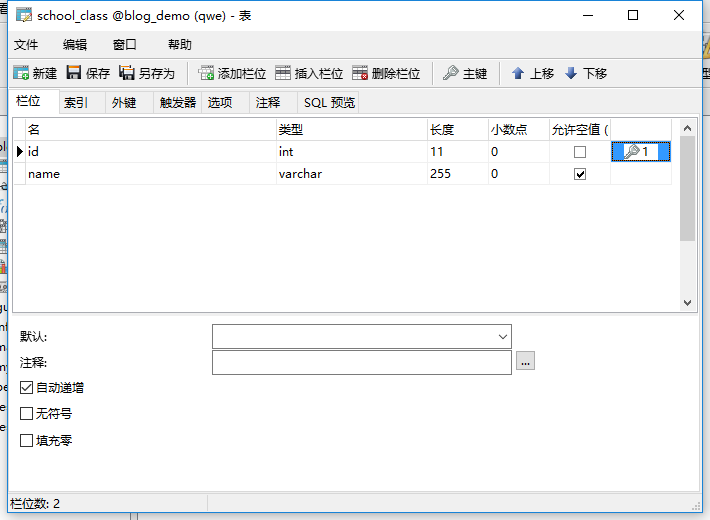
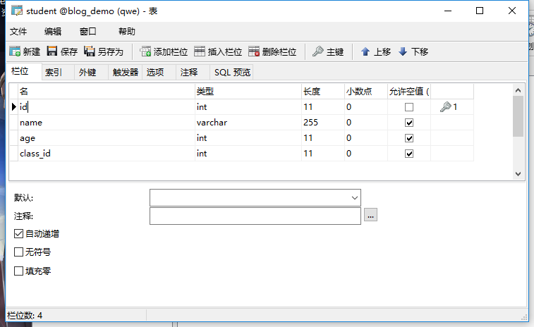
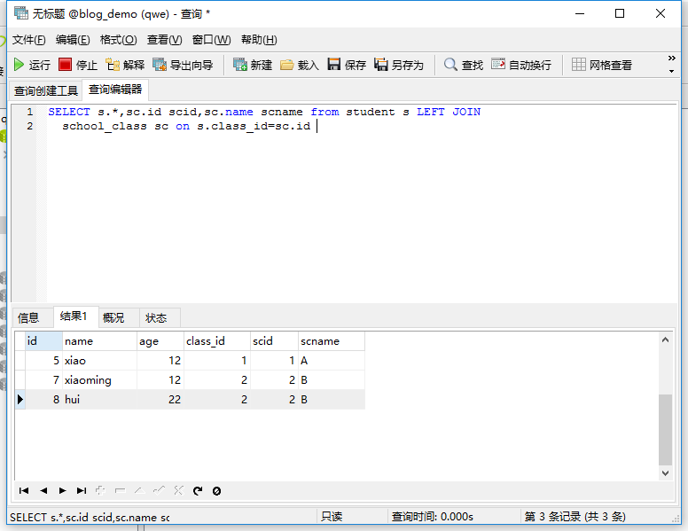
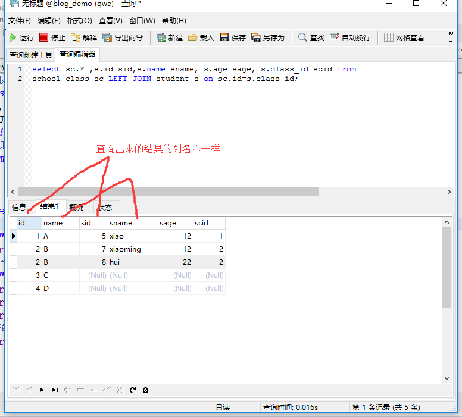

[toc]

# Mybatis笔记2

## MyBatis 映射文件中的主要元素

用xml的方式实现映射文件时，映射文件本质上就是一个xml文件。例如WebsiteMapper.xml

```xml
<?xml version="1.0" encoding="UTF-8"?>
<!DOCTYPE mapper
PUBLIC "-//mybatis.org//DTD Mapper 3.0//EN"
"http://mybatis.org/dtd/mybatis-3-mapper.dtd">
<!--namespace的属性值就是接口的全名-->
<mapper namespace="com.java.mapper.WebsiteMapper">
    <!-- 查询所有网站信息，对应WebsiteMapper接口的selectAllWebsite方法 -->
    <!--id的属性值就是接口中的方法名称-->
    <select id="selectAllWebsite"
        resultType="com.java.entity.Website">
        select * from website
    </select>
</mapper>
```

除了上述代码之外，映射文件还有许多其他的元素。如下图




### select标签

在映射文件中select标签用于执行查询操作。

select标签的属性如图所示



> 示例如下

```xml
<!-- 一个 id 为 selectAllWebsite 的select查询语句，接收的参数类型为 string，返回结果类型为 Website。    -->
<select id="selectAllWebsite" resultType="net.biancheng.po.Website" parameterType="string">
    SELECT id,NAME,url FROM website WHERE NAME LIKE CONCAT ('%',#{name},'%')
</select>
```

参数的传递使用#{参数名}，相当于告诉 MyBatis 生成 PreparedStatement 参数。对于 JDBC，该参数会被标识为“?”。以上 SQL 语句使用 JDBC 实现，代码如下。

```java
String sql = "SELECT id,NAME,url FROM website WHERE NAME LIKE CONCAT ('%',?,'%')";
PreparedStatement ps = conn.prepareStatement(sql);
ps.setString(1,userName);
```

> select标签通过@Param注解来传递参数

WebsiteMapper.xml映射文件如下
```xml
<!-- 根据name和url模糊查询网站信息 -->
<select id="selectWebsiteByAn" resultType="com.java.entity.Website">
    SELECT id,NAME,url FROM website
    WHERE name LIKE CONCAT ('%',#{name},'%')
    AND url LIKE CONCAT ('%',#{url},'%')
</select>
```

WebsiteMapper 接口中的方法如下
```java
public List<Website> selectWebsiteByAn(@Param("name") String name, @Param("url") String url);
```

使用 @Param 注解传递参数会受到参数个数的影响。当 n≤5 时，它是最佳的传参方式，因为它更加直观；当 n>5 时，多个参数将给调用带来困难。

> select标签通过JavaBean传递参数

WebsiteMapper.xml映射文件如下
```xml
<!-- 根据name和url模糊查询网站信息 -->
<select id="selectWebsiteByAn" resultType="com.java.entity.Website">
    SELECT id,NAME,url FROM website
    WHERE name LIKE CONCAT ('%',#{name},'%')
    AND url LIKE CONCAT ('%',#{url},'%')
</select>
```

WebsiteMapper 接口中的方法如下
```java
public List<Website> selectWebsiteByAn(Website website);
```

当参数个数大于5个时，建议使用 JavaBean 方式。


### insert标签

insert 标签用来定义插入语句，执行插入操作。当 MyBatis 执行完一条插入语句后，就会返回其影响数据库的行数。

insert标签的常用属性如下


> insert标签通过@Param注解传递参数

映射文件如下
```xml
<!--接收 @Param 注解传递的参数-->
<insert id="addWebsiteByParam">
    insert into Website (name, url)  values (#{name}, #{url})
</insert>
```

接口如下
```java
int addWebsiteByParam(@Param("name") String name, @Param("url") String url);
```

测试代码如下
```java
int i = websiteMapper.addWebsiteByParam("xiaoming", "www.xiaoming.net");
```

使用 @Param 注解传递参数会受到参数个数的影响。当 n≤5 时，它是最佳的传参方式，因为它更加直观；当 n>5 时，多个参数将给调用带来困难。

> insert标签通过 JavaBean 传递参数

映射文件如下
```xml
<!--接收通过 JavaBean 传递的参数-->
<insert id="addWebsiteByJavaBean" parameterType="com.java.entity.Website">
    insert into Website (name, url) values (#{name}, #{url})
</insert>
```

接口如下
```java
int addWebsiteByJavaBean(Website website);
```

测试代码如下
```java
//创建 JavaBean 对象
Website website = new Website();
//通过 setter 方法将参数封装
website.setName("xiaoming");
website.setUrl("www.xiaoming.net");
int i = websiteMapper.addWebsiteByJavaBean(website);
System.out.println("通过 JavaBean 成功向数据库中添加了 " + i + " 条记录");
```

当参数个数大于 5 个时，建议使用 JavaBean 方式。


### insert标签与主键自动递增

MySQL 数据库表可以采用自动递增的字段作为其主键，当向这样的数据库表插入数据时，即使不指定自增主键的值，数据库也会根据自增规则自动生成主键并插入到表中。

一些特殊情况下，我们可能需要获取将这个刚刚生成的主键，供其他业务使用。此时，我们就可以通过在 insert 标签中添加  keyProperty 和 useGeneratedKeys 属性，来实现该功能。

映射文件如下
```xml
<!--添加一个网站信息，成功后将主键值返回填给id(java bean的id属性)-->
<insert id="addWebsite" parameterType="com.java.entity.Website" keyProperty="id" useGeneratedKeys="true">
    insert into Website (name,url) values(#{name},#{url})
</insert>
```

接口如下
```java
int addWebsite(Website website);
```

测试代码如下
```java
// 添加一个网站信息
Website addsite = new Website();
//插入的对象中不包含主键 id 
addsite.setName("xiaoming");
addsite.setUrl("https://www.xiaoming.net/");
//执行插入
int num = websiteMapper.addWebsite(addsite);
System.out.println("添加了 " + num + " 条记录");
//获取回填的主键
System.out.println("添加记录的主键是:" + addsite.getId());

// 添加了 1 条记录
// 添加记录的主键是:3
```

### update标签

update 标签用于定义更新语句，执行更新操作。当 MyBatis 执行完一条更新语句后，会返回一个整数，表示受影响的数据库记录的行数。

update 标签的常用属性如下



> update 标签通过@Param注解传递参数

映射文件如下
```xml
<!--更新语句接收 @Param 注解传递的参数-->
<update id="updateWebsiteByParam">
    update website set name = #{name},url= #{url} where id = #{id}
</update>
```

接口如下
```java
int updateWebsiteByParam(@Param("name") String name, @Param("url") String url, @Param("id") Integer id);
```

测试代码如下
```java
// 使用@Param 注解传递参数到更新语句中
String name = "xiaoming";
String url = "www.xiaoming.net";
Integer id = 2;
int i = websiteMapper.updateWebsiteByParam(name, url, id);
System.out.println("通过 @Param 注解传递参数，共更新了 " + i + " 条记录");
```

使用 @Param 注解传递参数会受到参数个数的影响。当 n≤5 时，它是最佳的传参方式，因为它更加直观；当 n>5 时，多个参数将给调用带来困难。

> update 标签通过 JavaBean 传递参数

映射文件如下
```xml
<!--更新语句接收 JavaBean 传递的参数-->
<update id="updateWebsiteByJavaBean" parameterType="com.java.entity.Website">
    update website set name = #{name},url= #{url} where id = #{id}
</update>
```

接口如下
```java
int updateWebsiteByJavaBean(Website website);
```

测试代码如下
```java
//使用 JavaBean 传递参数到更新语句中
Website website = new Website();
website.setName("xiaoming");
website.setUrl("www.xiaoming.net");
website.setId(3);
int i = websiteMapper.updateWebsiteByJavaBean(website);
System.out.println("通过 JavaBean 传递参数，共更新了 " + i + " 条记录");
```

当参数个数大于 5 个时，建议使用 JavaBean 方式。


### delete标签

delete 标签用于定义 delete 语句，执行删除操作。当 MyBatis 执行完一条更新语句后，会返回一个整数，表示受影响的数据库记录的行数。

delete 标签的常用属性如下



> delete 标签通过@Param注解传递参数

映射文件如下
```xml
<!--通过 @Param 注解传递参数，执行删除操作-->
<delete id="deleteWebsiteByParam">
    delete from website where name = #{name} and url = #{url}
</delete>
```

接口如下
```java
int deleteWebsiteByParam(@Param("name") String name, @Param("url") String url);
```

测试代码如下
```java
//使用 @Param 注解传递参数
String name = "xiaoming";
String url = "www.xiaoming.net";
int i = websiteMapper.deleteWebsiteByParam(name, url);
System.out.println("通过 @Param 注解传递参数，共删除了 " + i + " 条记录");
```

使用 @Param 注解传递参数会受到参数个数的影响。当 n≤5 时，它是最佳的传参方式，因为它更加直观；当 n>5 时，多个参数将给调用带来困难。

> delete 标签通过 JavaBean 传递参数

映射文件如下
```xml
<!--通过 JavaBean 传递参数，执行删除操作-->
<delete id="deleteWebsiteByJavaBean" parameterType="com.java.entity.Website">
    delete from website where name = #{name} and url = #{url}
</delete>
```

接口如下
```java
int deleteWebsiteByJavaBean(Website website);
```

测试代码如下
```java
//使用 JavaBean 传递参数到更新语句中
Website website = new Website();
website.setName("xiaoming");
website.setUrl("https://www.xiaoming.net/");
int i = websiteMapper.deleteWebsiteByJavaBean(website);
System.out.println("通过 JavaBean 传递参数，共删除了 " + i + " 条记录");
```

当参数个数大于 5 个时，建议使用 JavaBean 方式。

### resultMap标签

通常情况下，实体类的属性名称要与表的字段名称要保持一致。这样的话，`resultType="com.java.entity.Website"`就能够把`<select>`标签查询出来的结果转换为实体对象。如下所示。

```java
public class Website {
    private int id;
    private String name;
    private String url;
    /*省略setter和getter方法*/
}
```
```xml
<!--此处使用resultType来将查询结果转换为实体对象。-->
<select id="selectALLWebsite" resultType="com.java.entity.Website">
    SELECT id,name,url FROM website
</select>
```

但是总会出现实体类属性名与数据库表中字段名不一致的情况。

resultMap 主要用于解决实体类属性名与数据库表中字段名不一致的情况，可以手动将查询结果映射成实体对象。

> resultMap 标签的构成

```xml
<!-- id属性表示唯一标识符。 type属性表示对应的实体类型对象-->
<resultMap id="" type="">
    <constructor><!-- 类再实例化时用来注入结果到构造方法 -->
        <idArg/><!-- ID参数，结果为ID -->
        <arg/><!-- 注入到构造方法的一个普通结果 --> 
    </constructor>
    <id/><!-- 用于表示哪个列是主键 -->
    <result/><!-- 注入到字段或JavaBean属性的普通结果 -->
    <association property=""/><!-- 用于一对一关联 -->
    <collection property=""/><!-- 用于一对多、多对多关联 -->
    <discriminator javaType=""><!-- 使用结果值来决定使用哪个结果映射 -->
        <case value=""/><!-- 基于某些值的结果映射 -->
    </discriminator>
</resultMap>
```

> resultMap 标签的示例

例如将实体类的name属性改为username属性。

```java
public class Website {
    private int id;
    private String username;
    private String url;
    /*省略setter和getter方法*/
}
```

此时由于实体类的username属性和表中的name字段，名称不一致。此时需要用到resultMap标签，将查询结果与实体类属性进行对应。

```xml
<!-- 使用自定义结果集类型，将查询结果和实体类属性一一对应。-->
<!-- id属性代表resultMap标签的唯一标识符。 -->
<resultMap type="com.java.entity.Website" id="myResult">
    <!-- property 是 Website 类中的属性 -->
    <!-- column是查询结果的列名，可以来自不同的表。-->
    <id property="id" column="id" />
    <result property="username" column="name"/>
    <result property="url" column="url"/>
</resultMap>

<!--不适用resultType属性。更换为resultMap属性，然后指向myResult -->
<select id="selectALLWebsite" resultMap="myResult">
    SELECT id,name,url FROM website
</select>
```

> select标签中 resultMap属性 和 resultType属性的区别

在MyBatis把查询结果映射为java对象时,由于Mybatis的底层是JDBC，其实查询出来的每一个属性都是放在一个对应的Map里面的，其中键是属性名，值则是其对应的值。

- ①当属性是resultType时，MyBatis会将Map里面的键值对取出赋给resultType指定对象的属性中。
- ②当属性是resultMap时，需要程序员自定义结果集映射规则，手动把查询的结果字段一个一个转化为想要对应的对象。

所以其实MyBatis的每一个查询映射的返回类型都是ResultMap，只是当提供的返回类型属性是resultType的时候，MyBatis对自动的给把对应的值赋给resultType所指定对象的属性。

<font color="red">注意的是，resultMap 和 resultType 不能同时使用。</font>

### 映射文件中`#{}`与`${}`的区别

```xml
<insert id="addWebsite" parameterType="com.java.entity.Website">
    insert into Website (name,url) values(#{name},#{url})
</insert>
<delete id="deleteWebsiteByParam">
    delete from website where name = #{name} and url = #{url}
</delete>
```

`#{}` :以预编译的方式，把参数设置到sql语句中，类似JDBC的PreparedStatement。用于防止sql注入。
`${}` :直接把参数的值，拼接在sql语句中，有安全问题。


## 关联查询

在关联中存在 3 种对应关系。
* 一对一的关系。每个学生都有一个身份证（ID），一个身份证只能对应一个学生。学生与身份证是一对一的关系。
* 一对多的关系，如学校和学生的关系。一个学校会存在许多学生，学校和学生就是一对多的关系。
* 多对多的关系，通俗的说，一个订单可以有多种商品，一种商品可以对应多个订单，这就是多对多的关系。

### 一对一关联查询（association标签）

在 MyBatis 中，主要通过 `<resultMap>` 元素的子元素 `<association>` 处理一对一级联关系。

> 在 `<association>` 元素中通常使用以下属性。
* property：指定映射到实体类的对象属性。
* column：指定表中对应的字段（即查询返回的列名）。
* javaType：指定映射到实体对象属性的类型。
* select：指定引入嵌套查询的子SQL语句，该属性用于关联映射中的嵌套查询。

#### 例子

例如，有两个表分别是学生表和班级表。把学生作为中心，一个学生只能有一个班级。查询某个学生时，把所在的班级也查出来。

步骤1：创建数据表

school_class表


student表（增加class_id 列,class_id 列与school_class的id列对应。没有设置外键）



步骤2：创建持久化类

```java
public class Student {
    private int id;
    private String name;
    private int age;
    //这个字段用来表示学生的班级,其对应的字段为class_id
    private School_class sclass;       
    /*省略setter和getter方法*/
}
public class School_class {
    private int id;
    private String name;
    /*省略setter和getter方法*/
}
```

步骤3：映射文件中编写sql语句。有3种写法。

sql语句查询结果如图所示，前4个字段对应Student类的，后2个字段需要对应School_class类。


> 方式① 不使用association标签，手动自定义结果集

StudentMapper.xml
```xml
<select id="selectStudent" resultMap="one_one_select_gai" parameterType="com.entity.Student">
    SELECT s.id,s.name,s.age,sc.id scid,sc.name scname 
    from student s LEFT JOIN school_class sc on s.class_id=sc.id 
    where 1=1 and s.id=#{id} and s.name=#{name}
</select>
<resultMap id="one_one_select_gai" type="com.entity.Student">
	<id property="id" column="id"/>
	<result property="name" column="name"/>
	<result property="age" column="age"/>
	<!--property="sclass.id"表示Student的sclass属性的id属性，把查询出来的scid的列的值，赋值给它  -->
 	<result property="sclass.id" column="scid"/>
 	<result property="sclass.name" column="scname"/>
</resultMap>
```

`property="sclass.id"`表示Student类的sclass属性的id属性，把查询出来的scid字段的值，赋值给它。

<font color="red">注意，这种方式是通过resultMap标签，手动将sql语句查询的字段和实体类的属性一一关联对应。</font>

> 方式② 使用association标签，关联查询

StudentMapper.xml
```xml
<select id="selectStudent" resultMap="one_one_select" parameterType="com.entity.Student">
	SELECT s.id,s.name,s.age,sc.id scid,sc.name scname 
    from student s LEFT JOIN school_class sc on s.class_id=sc.id 
    where 1=1 and s.id=#{id} and s.name=#{name}
</select>
<resultMap id="one_one_select" type="com.entity.Student">
    <!--将sql语句查出来的的id字段,namae字段,age字段分别对应为Student类的id,name,age属性-->
	<id property="id" column="id"/>
	<result property="name" column="name"/>
	<result property="age" column="age"/>
    <!--下面这段`<association>`标签的意思是，将sql语句查出来的的scid字段和scname字段，赋值给Student的sclass属性。sclass属性的类型是School_class类。-->
    <association property="sclass" javaType="com.entity.School_class">
        <id property="id" column="scid"/>
        <result property="name" column="scname"/>
    </association> 
</resultMap>
```

下面这段`<association>`标签的意思是，将sql语句查出来的的scid字段和scname字段，赋值给Student的sclass属性。sclass属性的类型是School_class类。
```xml
<association property="sclass" javaType="com.entity.School_class">
    <id property="id" column="scid"/>
    <result property="name" column="scname"/>
</association> 
```

> 方式③ 使用association标签，分步查询（执行一个sql语句的同时，再在执行另一个sql语句）

School_classMapper.xml
```xml
<select id="selectClass" resultType="com.entity.School_class" parameterType="com.entity.School_class">
	select * from school_class where id=#{id}
</select>
```

StudentMapper.xml
```xml
<select id="selectStudent2" resultMap="one_one_select2" parameterType="com.entity.Student">
	SELECT s.id,s.name,s.age,sc.id scid,sc.name scname 
    from student s LEFT JOIN school_class sc on s.class_id=sc.id 
    where 1=1 and s.id=#{id} and s.name=#{name}
</select>

<resultMap id="one_one_select2" type="com.entity.Student">
	<id property="id" column="id"/>
	<result property="name" column="name"/>
	<result property="age" column="age"/>
	<!--association标签中
        select的值指向另外一个select标签。
        column="class_id"的意思是执行另一个sql语句，传入的参数为class_id字段的值。这个class_id字段是上一个sql语句的查询结果的class_id字段。

        javaType="com.entity.School_class"的意思是将另一个sql语句的查询结果转换为School_class对象。

        property="sclass"的意思是把另一个sql语句查询结果，赋值到School_class对象的sclass属性中。
	-->
   <association property="sclass" column="class_id" javaType="com.entity.School_class" select="com.java.mapper.School_classMapper.selectClass"/>
</resultMap>
```

* association标签中select属性表示另外一个sql语句。
* property="sclass"的意思是把另一个sql语句查询结果，赋值到sclass字段中。
* javaType="com.entity.School_class"的意思是将另一个sql语句的查询结果转换为School_class对象。
* 总结: 该association标签的作用是，执行另外一个sql语句，class_id字段值作为sql语句的参数。执行结果先转换为School_class类型对象，然后赋值给Student的sclass属性。


### 一对多关联查询（collection标签）

在 MyBatis 中，通过`<resultMap>`元素的子元素`<collection>`处理一对多级联关系，`<collection>`元素标签可以将关联查询的多条记录映射到一个 list 集合属性中。

> 在 `<collection>` 元素中通常使用以下属性。
* property：指定映射到实体类的对象属性。
* column：指定表中对应的字段（即查询返回的列名）。
* ofType：指定映射到实体对象属性的类型。
* select：指定引入嵌套查询的子SQL语句，该属性用于关联映射中的嵌套查询。

> 一对多关联查询可采用以下两种方式：
* 多次查询，通过两次或多次查询，为一对多关系的实体 Bean 赋值。
* 单次查询，通过关联查询实现。

#### 例子

例如，班级表和学生表。一个班级可以有多个学生，而一个学生只能属于一个班级。这相当与一对多的关系。查询某个班级时，把班级所在的多个学生也查询出来。

步骤1：创建数据表

school_class表


student表（增加class_id 列,class_id 列与school_class的id列对应。没有设置外键）


步骤2：创建持久化类

```java
public class Student {
    private int id;
    private String name;
    private int age;
    //这个字段用来表示学生的班级,其对应的字段为class_id
    private School_class sclass;       
    /*省略setter和getter方法*/
}
public class School_class {
    private int id;
    private String name;
    //一个班可以有多个学生，使用list集合
    private List<Student> stulist;   
    /*省略setter和getter方法*/
}
```

步骤3：映射文件中编写sql语句。有2种写法。

sql语句执行结果,前两个字段与School_class的id和name属性对应。后4个字段要与Student类的4个属性对应。


> 方式① 单次查询

School_classMapper.xml
```xml
<select id="selectclass_stu" resultMap="one_to_more">
    select sc.id,sc.name ,s.id sid,s.name sname, s.age sage, s.class_id scid 
    from school_class sc LEFT JOIN student s on sc.id=s.class_id 
    where 1=1 and sc.id=#{id} and sc.name=#{name}
</select>
<resultMap type="com.entity.School_class" id="one_to_more">
    <!-- 把sql查询结果中的id,name字段的值赋值School_class类对象的id,name属性 -->
	<id property="id" column="id"/>
	<result property="name" column="name"/>
	<collection property="stulist" ofType="com.entity.Student">  
		<id property="id" column="sid"/>
		<result property="name" column="sname"/>
		<result property="age" column="sage"/>
		<result property="sclass.id" column="scid"/>
		
		<result property="sclass.name" column="sname"/>
	</collection>
</resultMap>
```

下面`<collection>`标签的意思是，将sql查询结果的sid,sname,sage,scid,分别赋值给Student对象的四个属性。然后再把Student对象赋值给School_class类的stulist属性。
```xml
<collection property="stulist" ofType="com.entity.Student">  
    <id property="id" column="sid"/>
    <result property="name" column="sname"/>
    <result property="age" column="sage"/>
    <!-- 这段表示，查询出来的scid列的值，赋值给Student的sclass属性的id字段 -->
    <result property="sclass.id" column="scid"/>
</collection>
```

> 方式② 多次查询

StudentMapper.xml
```xml
<select id="selectstudent" resultType="com.entity.Student" parameterType="com.entity.School_class">
	select * from student where class_id= #{id}
</select>
```

School_classMapper.xml
```xml
<!-- 一对多关联查询的多次查询 -->
<select id="selectclass_stu2" resultMap="one_more_aprat">
	select * from school_class where id= #{id}
</select>
<resultMap type="com.entity.School_class" id="one_more_aprat">
    <!-- 把sql查询结果中的id,name字段的值赋值School_class类对象的id,name属性 -->
	<id property="id" column="id"/>
	<result property="name" column="name"/>
	<collection property="stulist" column="id" select="com.java.mapper.StudentMapper.selectstudent"/>
</resultMap>
```

下面`<collection>`标签的意思是，执行`select="selectstudent"`的sql语句，column属性的值当做sql参数。然后把sql查询结果赋值给School_class类的stulist属性。
```xml
<collection property="stulist" column="id" select="com.java.mapper.StudentMapper.selectstudent"/>
```

### 多对多关联查询

MyBatis 没有实现多对多级联，推荐通过两个一对多级联替换多对多级联，以降低关系的复杂度，简化程序。

例如，一个订单可以有多种商品，一种商品可以对应多个订单，订单与商品就是多对多的关系。可以使用一个中间表（订单记录表）将多对多级联转换成两个一对多的关系。

步骤1：创建数据表
```
order订单表，字段有oid,ordernum,userid。
product商品表，字段有pid,name,price。
order_details订单明细表（订单和商品的中间表），字段有id,orderid,productid。
```

步骤2：持久化类。中间表不需要对应的持久化类。因为中间表的
```java
public class Order {
    private int oid;
    private int ordernum;
    //一个订单对应多个商品
    private List<Product> products;
    /*省略setter和getter方法*/
}

public class Product {
    private int pid;
    private String name;
    private Double price;
    //一个商品对应多个订单
    private List<Order> orders;
    /*省略setter和getter方法*/
}
```

步骤3：编写映射文件

OrderMapper.xml
```xml
<?xml version="1.0" encoding="UTF-8"?>
<!DOCTYPE mapper
PUBLIC "-//mybatis.org//DTD Mapper 3.0//EN"
"http://mybatis.org/dtd/mybatis-3-mapper.dtd">

<mapper namespace="com.java.mapper.OrderMapper">
    <select id="selectAllOrdersAndProducts" parameterType="Integer" resultMap="orderMap">
        SELECT o.oid,o.ordernum,p.pid,p.name,p.price FROM
        order o INNER JOIN orders_detail od ON o.oid=od.orderId
        INNER JOIN product p ON p.pid = od.productId
    </select>

    <resultMap type="com.java.entity.Order" id="orderMap">
        <!--查询结果的oid,ordernum字段赋值给Order类的oid和ordernum属性。-->
        <id property="oid" column="oid" />
        <result property="ordernum" column="ordernum" />
        <!--
            先把查询结果的pid,name,price字段赋值给Product类对象。
            然后把Product类对象赋值给Order类的products属性。
        -->
        <collection property="products"
            ofType="com.java.entity.Product">
            <id property="pid" column="pid" />
            <result property="name" column="name" />
            <result property="price" column="price" />
        </collection>
    </resultMap>
</mapper>
```

上面sql语句中，通过orders_detail中间表来查询数据。


### 懒加载

resultMap标签的association、collection具备懒加载功能。

> 什么是懒加载功能？

例如查询订单并且关联查询用户信息。如果先查询订单信息即可满足要求，当我们需要查询用户信息时再查询用户信息。把对用户信息的按需去查询就是延迟加载。

简而言之，就是不会立即发送sql语句去查询用户信息，而是等到要用用户信息时，才会发送sql语句查询订单对应的用户信息。

> 懒加载的好处

懒加载功能可以先从单表查询，需要时再从关联表去关联查询，大大提高数据库性能，因为查询单表要比关联查询多张表速度要快。

在实际开发中，一对多关系通常映射为集合对象，而由于多的一方的数据量可能很大，所以通常使用懒加载；而多对一只是关联到一个对象，所以通常使用多表连接，直接把数据提取出来即可。

> 开启懒加载的例子

步骤1：在mybatis配置文件中开启懒加载。

mybatis_config.xml:
```xml
<settings>
        <!-- 
        使用懒加载生效，必须配置的属性
        lazyLoadingEnabled：表示懒加载的的全局开关，所有的关联对象，都会懒加载，默认为false。
        lazyLoadingEnabled：开启时，会使带有懒加载属性的对象立即加载；反之，每种属性都会按需加载，默认为true
        -->
        <setting name="lazyLoadingEnabled" value="true"/>
        <setting name="aggressiveLazyLoading" value="false"/>
</settings>	 
```

步骤2：在映射文件中给关联查询，使用懒加载功能。

OrderMapper.xml
```xml
<?xml version="1.0" encoding="UTF-8"?>
<!DOCTYPE mapper
PUBLIC "-//mybatis.org//DTD Mapper 3.0//EN"
"http://mybatis.org/dtd/mybatis-3-mapper.dtd">

<mapper namespace="com.java.mapper.OrderMapper">
    <select id="selectAllOrdersAndProducts" parameterType="Integer" resultMap="orderMap">
        SELECT o.oid,o.ordernum,p.pid,p.name,p.price FROM
        order o INNER JOIN orders_detail od ON o.oid=od.orderId
        INNER JOIN product p ON p.pid = od.productId
    </select>

    <resultMap type="com.java.entity.Order" id="orderMap">
        <id property="oid" column="oid" />
        <result property="ordernum" column="ordernum" />
        <!--fetchType="lazy",这个关联查询使用懒加载功能。-->
        <collection property="products" ofType="com.java.entity.Product" fetchType="lazy">
            <id property="pid" column="pid" />
            <result property="name" column="name" />
            <result property="price" column="price" />
        </collection>
    </resultMap>
</mapper>
```

fetchType属性的取值有2种。
* lazy:表示懒加载
* eager：表示立即加载。


## Mybatis 注解

为了简化 XML 的配置，MyBatis 提供了注解的实现方式。注解主要分为三大类，即 SQL 语句映射、结果集映射和关系映射。

### SQL语句映射注解

在xml的实现方式中，通常需要把映射文件中的sql语句与接口中的方法进行一一对应。而注解的实现方式是将注解和接口方法进行一一对应。然后再注解中编写SQL语句。

这些注解统称SQL语句映射注解。分为如下几种。

* @Insert：实现新增功能。
* @Select：实现查询功能。
* @Insert：实现插入功能。
* @Update：实现更新功能。
* @Delete：实现删除功能。
* @Param：映射多个参数。
* @SelectKey：插入后，获取id的值
  * @SelectKey 注解中的各个属性含义如下。
  * statement：表示要运行的 SQL 语句；
  * keyProperty：可选项，表示将查询结果赋值给代码中的哪个对象；
  * keyColumn：可选项，表示将查询结果赋值给数据表中的哪一列；
  * resultType：指定 SQL 语句的返回值；
  * before：默认值为 true，在执行插入语句之前，执行 select last_insert_id()。值为flase，则在执行插入语句之后，执行 select last_insert_id()。

UserMapper.class 接口
```java
public interface UserMapper {
    @Insert("insert into user(id,name) values(#{id},#{name})")
    public int insert(User user);

    @Select("Select * from user")
    List<User> queryAllUser();

    @Insert("insert into user(name,sex,age) values(#{name},#{sex},#{age}")
    int saveUser(User user);

    @Update("update user set name= #{name},sex = #{sex},age =#{age} where id = #{id}")
    void updateUserById(User user);

    @Update("update user set name= #{name},sex = #{sex},age =#{age} where id = #{id}")
    void updateUserById(User user);

    int saveUser(@Param(value="user") User user,@Param("name") String name,@Param("age") Int age);

    @Insert("insert into user(id,name) values(#{id},#{name})")
    @SelectKey(statement = "select last_insert_id()", keyProperty = "id", keyColumn = "id", resultType = int,before = false)
    public int insert(User user);    
    }
```

上面代码，通过给接口方法加上注解，从而把注解的sql语句和接口方法进行一一对应。省略了再映射文件中进行sql语句配置。


### 结果集映射注解

在xml的实现方式中，通过在映射文件中使用`<resultMap>`标签来将sql的查询结果和java对象进行转换。但在注解的实现方式中，是通过注解来实现这个转换。

@Result、@Results、@ResultMap 是结果集映射的三大注解。

> @Results的属性如下

* id：表示当前结果集声明的唯一标识；
* value：表示结果集映射关系；
* @Result：代表一个字段的映射关系。其中，column 指定数据库字段的名称，property 指定实体类属性的名称，jdbcType 数据库字段类型，id 为 true 表示主键，默认 false。

> 例子

UserMapper.class 接口
```java
public interface UserMapper {
    @Select({"select id, name, class_id from student"})
    @Results(id="studentMap", value={
        @Result(column="id", property="id", jdbcType=JdbcType.INTEGER, id=true),
        @Result(column="name", property="name", jdbcType=JdbcType.VARCHAR),
        @Result(column="class_id ", property="classId", jdbcType=JdbcType.INTEGER)
    })
    List<Student> selectAll();


    @Select({"select id, name, class_id from student where id = #{id}"})
    @ResultMap(value="studentMap")
    Student selectById(Integer id);
}
```

### 关联映射注解

在xml是实现方式中，通过`<association>`标签来进行一对一关联查询的转换，通过`<collection>`标签来进行一对多关联查询的转换。

但在注解的实现方式中，是通过@one和@mant注解来实现。

* @one注解：用于处理一对一关系的映射。
* @many注解：用于处理一对多关系的映射。

> 例子

UserMapper.class 接口
```java
public interface UserMapper {
    @Select("select * from student") 
    @Results({ 
        @Result(id=true,property="id",column="id"), 
        @Result(property="name",column="name"), 
        @Result(property="age",column="age"), 
        @Result(property="address",column="address_id",one=@One(select="net.biancheng.mapper.AddressMapper.getAddress")) 
    }) 
    public List<Student> getAllStudents();  


    @Select("select * from t_class where id=#{id}") 
    @Results({ 
        @Result(id=true,column="id",property="id"), 
        @Result(column="class_name",property="className"), 
        @Result(property="students", column="id", many=@Many(select="net.biancheng.mapper.StudentMapper.getStudentsByClassId")) 
        }) 
    public Class getClass(int id); 
}
```
