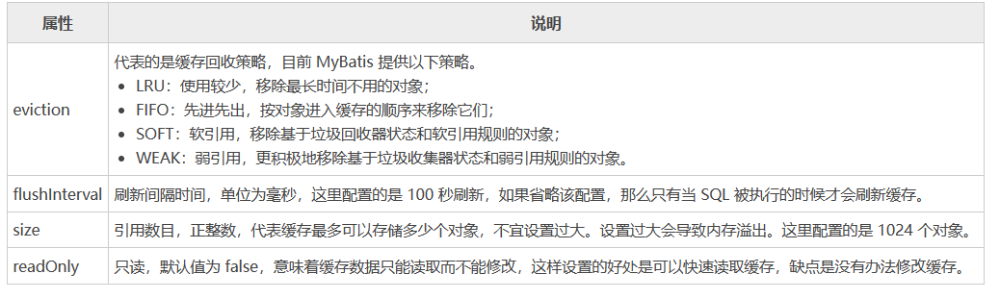
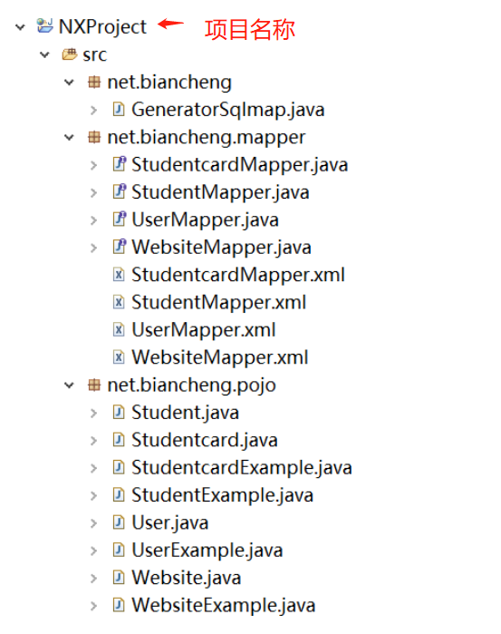

[toc]

# Mybatis笔记3

## 动态SQL

动态 SQL 是 MyBatis 的强大特性之一。

MyBatis 的动态 SQL 包括以下几种元素，如下图所示。


### if 标签

当判断条件为 true 时，才会执行所包含的 SQL 语句。语法如下。
```xml
<if test="判断条件">
    SQL语句
</if>
```

> 例子

```xml
<select id="selectAllWebsite" resultType="com.java.entity.Website">
    select id,name,url from website where 1=1
    <if test="name != null">
        AND name like #{name}
    </if>
    <if test="url!= null">
        AND url like #{url}
    </if>
</select>
```


### choose,when,otherwize 标签

MyBatis 中动态语句 choose-when-otherwise 类似于 Java 中的 switch-case-default 语句。

语法如下
```xml
<choose>
    <when test="判断条件1">
        SQL语句1
    </when >
    <when test="判断条件2">
        SQL语句2
    </when >
    <when test="判断条件3">
        SQL语句3
    </when >
    <otherwise>
        SQL语句4
    </otherwise>
</choose>
```

choose 标签按顺序判断其内部 when 标签中的判断条件是否成立，如果有一个成立，则执行相应的 SQL 语句，choose 执行结束；如果都不成立，则执行 otherwise 中的 SQL 语句。


> 例子

```xml
<select id="select2"  resultType="Student">  
  select * from student Where 1=1   
  <choose>  
    <when test="id != null">  
      AND id = #{id}  
    </when>
	<when test="name != null">  
      AND name = #{name}  
    </when>    
    <otherwise>  
      	AND sex="男"  
    </otherwise>  
  </choose>  
</select>   
```


### where 标签 

where 标签相当于 where 关键字。主要用来简化 SQL 语句中的条件判断，可以自动处理 AND/OR 条件，语法如下。

```xml
<where>
    <if test="判断条件">
        AND/OR ...
    </if>
</where>
```

if 语句中判断条件为 true 时，where 关键字才会加入到组装的 SQL 里面，否则就不加入。并且 where标签 会检索语句，它会将 where关键字后的第一个 SQL 条件语句的 AND 或者 OR 关键词去掉。


```xml
<select id="selectWebsite" resultType="com.java.entity.Website">
    select id,name,url from website
    <where>
        <if test="name != null">
            AND name like #{name}
        </if>
        <if test="url!= null">
            AND url like #{url}
        </if>
    </where>
</select>
```

如果传入name,url参数,则SQL语句变为 

```
select id,name,url from website where name like #{name} AND url like #{url} 
```


### set 标签

在 Mybatis 中，update 语句可以使用 set 标签动态更新列。set 标签可以为 SQL 语句动态的添加 set 关键字，并且剔除追加到条件末尾多余的逗号。

```xml
<update id="update1" parameterType="user"> 
  update User  
    <set>  
        <if test="username !=null">
        username=#{username},
        </if>  
        <if test="password !=null">
        password=#{password},
        </if>  
        <if test="Age != null">
        Age =#{Age},
        </if>  
    </set>  
  where id=#{id}  
</update>  
```

当3个参数都传入sql语句中。则SQL语句变为 
```
update user set username= #{username}, password=#{password}, Age=#{Age}  where id=#{id}
```

### foreach 标签

Mybatis foreach 标签用于循环语句，它很好的支持了数据和 List、set 接口的集合，并对此提供遍历的功能。语法格式如下。

```xml
<foreach item="item" index="index" collection="list|array|map key" open="(" separator="," close=")">
    参数值
</foreach>
```

foreach 标签主要有以下属性，说明如下。
* item：表示集合中每一个元素进行迭代时的别名。
* index：指定一个名字，表示在迭代过程中每次迭代到的位置。
* open：表示该语句以什么开始（既然是 in 条件语句，所以必然以(开始）。
* separator：表示在每次进行迭代之间以什么符号作为分隔符（既然是 in 条件语句，所以必然以,作为分隔符）。
* close：表示该语句以什么结束（既然是 in 条件语句，所以必然以)开始）。
* collection 属性: 表示迭代集合的类型。
  - 如果传入的是单参数且参数类型是一个 List，collection 属性值为 list。
  - 如果传入的是单参数且参数类型是一个 array 数组，collection 的属性值为 array。
  - 如果传入的参数是多个，需要把它们封装成一个 Map，当然单参数也可以封装成 Map。Map 的 key 是参数名，collection 属性值是传入的 List 或 array 对象在自己封装的 Map 中的 key。

> 例子

映射文件部分代码如下
```xml
<select id="selectWebsite" parameterType="com.java.entity.Website" resultType="com.java.entity.Website">
    SELECT id,name,url,age,country
    FROM website WHERE age in
    <foreach item="age" index="index" collection="list" open="(" separator="," close=")">
        #{age}
    </foreach>
</select>
```

测试部分代码如下
```java
//.............上面代码省略
List<Integer> ageList = new ArrayList<Integer>();
ageList.add(10);
ageList.add(12);
List<Website> siteList = ss.selectList("net.biancheng.mapper.WebsiteMapper.selectWebsite", ageList);
for (Website ws : siteList) {
    System.out.println(ws);
}

//运行的sql语句如下
// SELECT id,name,url,age,country FROM website WHERE age in ( ? , ? )
```

### bind 标签

bind 标签可以通过表达式自定义一个上下文变量。然后方便的在sql语句中使用这个变量。

比如，按照网站名称进行模糊查询，SQL 映射文件如下。
```xml
<select id="selectWebsite" resultType="net.biancheng.po.Website">
    <bind name="pattern_name" value="'%'+name+'%'" />
    <bind name="pattern_url" value="'%'+url+'%'" />
    SELECT id,name,url,age,country
    FROM website
    WHERE name like #{pattern_name}
    AND url like #{pattern_url}
</select>
```

通过bind标签，把value属性的值和name属性的值，进行了绑定。之后就可以在sql语句中使用name属性值。

### trim 标签

trim 一般用于去除 SQL 语句中多余的 AND 关键字、逗号`，`或者给 SQL 语句前拼接 where、set 等后缀，可用于选择性插入、更新、删除或者条件查询等操作。trim 语法格式如下。

```xml
<trim prefix="前缀" suffix="后缀" prefixOverrides="忽略前缀字符" suffixOverrides="忽略后缀字符">
    SQL语句
</trim>
```

* prefix: 给SQL语句拼接的前缀，为 trim 包含的内容加上前缀。
* suffix: 给SQL语句拼接的后缀，为 trim 包含的内容加上后缀。
* prefixOverrides: 去除 SQL 语句前面的关键字或字符，该关键字或者字符由 prefixOverrides 属性指定。
* suffixOverrides: 去除 SQL 语句后面的关键字或者字符，该关键字或者字符由 suffixOverrides 属性指定。

> 例子

```xml
<select id="selectWebsite" resultType="net.biancheng.po.Website">
    SELECT id,name,url,age,country
    FROM website
    <trim prefix="where" prefixOverrides="and">
        <if test="name != null and name !=''">
            AND name LIKE CONCAT ('%',#{name},'%')
        </if>
        <if test="url!= null">
            AND url like concat ('%',#{url},'%')
        </if>
    </trim>
</select>
```

如果name和url参数都存在时，则sql语句变为
```
SELECT id,name,url,age,country FROM website where name LIKE CONCAT ('%',?,'%') AND url like concat ('%',?,'%')
```

### sql,include 标签

* sql标签: 用于抽取sql片段。
* inculde标签: 引用被抽取的sql片段。

```xml
<sql id="sql_1">
  id,name,gender
</sql>
<insert id="addstulist" parameterType="com.java.entity.Website">
 insert into student ( <include refid="sql_1"></include> ) values (#{id},#{name},#{gender});
</insert>
```

上面的sql语句为
```
insert into student (id,name,gender) values (#{id},#{name},#{gender});
```

## Mybatis 分页

分页可分为逻辑分页和物理分页。

- 逻辑分页是指一次性把全部数据查询出来加载进内存中，然后通过逻辑操作将全部数据进行分页。优点是减少了数据库I/O次数（只查询一次），适合频繁访问、数据量少的情况。缺点是不适合大数据量，全部数据加载到内存中容易造成内存溢出。
- 物理分页是指利用SQL的limit 关键字。直接在数据库中进行分页查询。优点是适合大数据量。缺点是频繁查询数据库，增大了数据库的I/O次数，从而消耗数据库的性能。

> mybatis 实现分页的方式有3种
1. 直接在SQL语句中使用 limit 关键字进行分页。（物理分页）
2. 使用RowBounds来分页。（逻辑分页）
3. 使用第三方分页插件 PageHelper 来进行分页。（物理分页）

### limit关键字分页（物理分页）

通过SQL语法的limit关键字实现分页。需要注意limit的语法。

limit语法如下：
```sql
-- limit语法： limit pageNum pageSize
-- pageNum是指第几页。其中0表示第一页，1表示第二页，依此类推。
-- pageSize是每页有多少条数据。

-- 例子
select * from student limit 0 10;  --每页10条数据，查询第一页的数据。
select * from student limit 1 20;  --每页20条数据，查询第二页的数据。
```

> 使用例子

1. 接口

WebsiteMapper.class
```java
public List<Website> selectWebsite(@Param("name") String name, @Param("pageNo") Integer currentPageNo, @Param("pageSize") Integer pageSize);
```

2. 接口对应的sql映射文件

WebsiteMapper.xml
```xml
<select id="selectWebsite" resultType="net.biancheng.po.Website">
    SELECT id,name,url,age,country
    FROM website where name = #{name}
    limit #{pageNo},#{pageSize}
</select>
```

3. 测试类Test

```java
public static void main(String[] args) throws IOException {
    // 读取配置文件mybatis-config.xml
    InputStream config = Resources.getResourceAsStream("mybatis-config.xml");
    // 根据配置文件构建
    SqlSessionFactory ssf = new SqlSessionFactoryBuilder().build(config);
    // 通过SqlSessionFactory创建SqlSession
    SqlSession ss = ssf.openSession();
    // 通过反射的方式，实例化接口
    WebsiteDao websiteDao = ss.getMapper(WebsiteMapper.class);
    //分页参数
    Integer pageSize = 3;
    Integer currentPageNo = 0;
    String name = "xiaoming"
    //开始分页
    List<Website> siteList = websiteDao.selectWebsite(name, currentPageNo, pageSize);
    for (Website ws : siteList) {
        System.out.println(ws);
    }
    //提交sql连接和关闭sql连接
    ss.commit();
    ss.close();
}
```

### RowBounds 分页（逻辑分页）

不推荐使用

### 第三方分页插件 PageHelper（物理分页）

在springboot + mybatis 中使用 PageHelper 分页插件。

1. 先导入依赖

```xml
<!-- pagehelper 分页插件 -->
<dependency>
    <groupId>com.github.pagehelper</groupId>
    <artifactId>pagehelper-spring-boot-starter</artifactId>
    <version>1.4.7</version>
</dependency>
```

2. 分页插件配置

```yml
# PageHelper分页插件
pagehelper:
  helperDialect: mysql
  supportMethodsArguments: true
  params: count=countSql
```

3. 测试

mapper接口
```java
public interface StudentMapper{
    @Select("select * from student")
    public List<Student> pagelist();
}
```

测试类
```java
private StudentMapper studentMapper

@Test
public void test1(){
    //分页设置，设置查询的页数和每页记录数
    PageHelper.startPage(1, 3);
    //开始SQL查询
    List<Student> list = studentMapper.pagelist();
    System.out.println(list);
    //分页信息类
    PageInfo<Student> pageInfo = new PageInfo<>(list);
    System.out.println(pageInfo.getNextPage());  //下一页
    System.out.println(pageInfo.getPrePage());  //上一页
    System.out.println(pageInfo.getPageNum());  //当前页
    System.out.println(pageInfo.getPageSize());  //每页多少条
    System.out.println(pageInfo.getSize());  //当前页的条数
    System.out.println(pageInfo.getTotal());  //总条数
    System.out.println(pageInfo.getPages());  //总页数
}
```

分页原理：在执行SQL查询之前，先进行分页设置。当进行SQL查询的时候，PageHelper会拦截`studentMapper.pagelist();`方法。把设置的分页参数插入到SQL的limit语句中。


## Mybatis的缓存机制

在大型项目开发，由于涉及到的表多，数据量大，通常对数据库查询的性能要求很高。Mybatis提供了查询缓存机制，用于缓存查询出来的数据，减轻数据库的压力。从而提高数据库的查询性能。

Mybatis的查询缓存机制分为：一级缓存（SqlSession 级别的缓存），二级缓存（ mapper 级别的缓存）。其中，二级缓存是多个SqlSession 共享的。默认情况下，MyBatis 只开启一级缓存。

<font color="red">
注意：对于 MyBatis 缓存仅作了解即可，因为面对一定规模的数据量，Mybatis内置的 Cache 方式就派不上用场了，并且对查询结果集做缓存并不是 MyBatis 所擅长的，它专心做的应该是 SQL 映射。对于缓存，采用 OSCache、Memcached 等专门的缓存服务器来做更为合理。
</font>

### 一级缓存（SqlSession 级别）

Mybatis默认开启一级缓存，不需要进行任何配置。一级缓存的作用范围为 session 域内。当 session flush（刷新）或者 close（关闭）之后，该 session 中所有的 cache（缓存）就会被清空。

> 一级缓存原理及实现过程

由于以及一级缓存的作用域是 SqlSession级别的，当同一个SqlSession中执行两次相同的sql语句时，第一次执行sql完毕，会把查询的数据写到缓存（内存）中。当第二次执行相同的sql 查询语句时，会直接从缓存中获取查询数据。不会去底层数据库中进行查询。从而减轻了数据库的压力，提高了查询效率。

由于 SqlSession 是相互隔离的，所以如果你使用不同的 SqlSession 对象，即使调用相同的 Mapper、参数和方法，MyBatis 还是会再次发送 SQL 到数据库执行，返回结果。

### 二级缓存（mapper 级别）

二级缓存是全局缓存，作用域超出 session 范围之外，可以被所有 SqlSession 共享。

> 二级缓存原理及实现过程

当不同的SqlSession，执行同一个mapper映射文件下的sql语句，并且传递的参数也相同。第一次执行sql完毕，会把查询的数据写到二级缓存（内存）中。当第二次执行相同的sql 查询语句时，会直接从缓存中获取查询数据。不会去底层数据库中进行查询。

多个 SqlSession 可以共享二级缓存，二级缓存是跨SqlSession。

> 二级缓存需要通过`<cache>`标签来配置。

`<cache>`标签的属性如下


> 例子：实现二级缓存

1. 在mybatis配置文件中开启二级缓存

Mybatis-config.xml
```xml
<settings>
	<!--开启二级缓存 ，该属性默认为 false-->
	<setting name="cacheEnabled" value="true"/>
</settings>
```

2. 在映射文件中设置二级缓存

```xml
<?xml version="1.0" encoding="UTF-8"?>
<!DOCTYPE mapper
PUBLIC "-//mybatis.org//DTD Mapper 3.0//EN"
"http://mybatis.org/dtd/mybatis-3-mapper.dtd">
<mapper namespace="com.java.mapper.WebsiteMapper">
    <!-- 二级 cache配置 -->
    <cache eviction="FIFO" flushInterval="60000" size="512" readOnly="true" />
    <select id="selectAllWebsite"
        resultType="com.java.entity.Website">
        select * from website
    </select>
</mapper>
```

注意的是，二级缓存的作用域是针对 mapper 的 namescape 而言，即只有在这个 namescape 内的查询才能共享这个缓存。

3. 在 mapper 文件配置支持 cache 后，如果需要对个别查询进行调整，可以单独设置 cache。

```xml
<!--usecache="true" 是否使用缓存 -->
<select id="getWebsiteList" resultType="net.biancheng.po.Website" usecache="true">
    ...
</select>
```


## Mybatis的逆向工程

Mybatis 提供了一个逆向工程工具，该工具可以根据数据表自动生成针对单表的java bean类、mapper 映射文件和 mapper 接口。大大缩减了开发时间，可以让开发人员将更多的精力放在繁杂的业务逻辑上。

之所以强调单表两个字，是因为 MyBatis 逆向工程生成的 Mapper 中的操作都是针对单表的。在大型项目中，很少有复杂的多表关联查询，所以该工具作用还是很大的。

[mybatis_官方的逆向工程文档](http://www.mybatis.org/generator/index.html)


> 步骤1：创建一个新的项目，导入mybatis 关于逆向工程的依赖包

```xml
<dependencies>
    <!--mysql-connector-java 用于java连接mysql的JDBC依赖jar包-->
    <dependency>
        <groupId>org.mybatis</groupId>
        <artifactId>mybatis</artifactId>
        <version>3.5.5</version>
    </dependency>
    <!--mysql-connector-java 用于java连接mysql的JDBC依赖jar包-->
    <dependency>
        <groupId>mysql</groupId>
        <artifactId>mysql-connector-java</artifactId>
        <version>5.1.49</version>
    </dependency>
    <!--这是mybatis逆向工程必须的核心jar包-->
    <dependency>
        <groupId>org.mybatis.generator</groupId>
        <artifactId>mybatis-generator-core</artifactId>
        <version>1.4.0</version>
    </dependency>
</dependencies>
```

> 步骤2：创建数据表

```sql
DROP TABLE IF EXISTS `student`;

CREATE TABLE `student` (
  `id` int(11) NOT NULL AUTO_INCREMENT,
  `name` varchar(20) CHARACTER SET utf8 COLLATE utf8_unicode_ci DEFAULT NULL,
  `sex` tinyint(4) DEFAULT NULL,
  `cardId` int(20) DEFAULT NULL,
  PRIMARY KEY (`id`),
  KEY `cardId` (`cardId`),
  CONSTRAINT `student_ibfk_1` FOREIGN KEY (`cardId`) REFERENCES `studentcard` (`id`)
) ENGINE=InnoDB AUTO_INCREMENT=7 DEFAULT CHARSET=utf8;

DROP TABLE IF EXISTS `studentcard`;

CREATE TABLE `studentcard` (
  `id` int(20) NOT NULL AUTO_INCREMENT,
  `studentId` int(20) DEFAULT NULL,
  `startDate` date DEFAULT NULL,
  `endDate` date DEFAULT NULL,
  PRIMARY KEY (`id`),
  KEY `studentId` (`studentId`)
) ENGINE=InnoDB AUTO_INCREMENT=6 DEFAULT CHARSET=utf8;

DROP TABLE IF EXISTS `user`;

CREATE TABLE `user` (
  `id` int(11) NOT NULL AUTO_INCREMENT,
  `name` varchar(20) DEFAULT NULL,
  `pwd` varchar(20) DEFAULT NULL,
  PRIMARY KEY (`id`)
) ENGINE=InnoDB AUTO_INCREMENT=7 DEFAULT CHARSET=utf8;

DROP TABLE IF EXISTS `website`;

CREATE TABLE `website` (
  `id` int(11) NOT NULL AUTO_INCREMENT,
  `name` varchar(20) COLLATE utf8_unicode_ci NOT NULL,
  `url` varchar(30) COLLATE utf8_unicode_ci DEFAULT '',
  `age` tinyint(3) unsigned NOT NULL,
  `country` char(3) COLLATE utf8_unicode_ci NOT NULL DEFAULT '',
  `createtime` timestamp NULL DEFAULT CURRENT_TIMESTAMP,
  PRIMARY KEY (`id`)
) ENGINE=InnoDB AUTO_INCREMENT=9 DEFAULT CHARSET=utf8 COLLATE=utf8_unicode_ci;
```


> 步骤3：在项目根目录下新建config目录，在 config 目录下创建     MybatisGenertorConfig.xml 文件，用于配置及指定数据库及表等。

MybatisGenertorConfig.xml
```xml
<?xml version="1.0" encoding="UTF-8"?>
<!DOCTYPE generatorConfiguration PUBLIC "-//mybatis.org//DTD MyBatis Generator Configuration 1.0//EN" "http://mybatis.org/dtd/mybatis-generator-config_1_0.dtd">

<generatorConfiguration>
    <context id="DB2Tables" targetRuntime="MyBatis3">
        <commentGenerator>
            <!-- 是否去除自动生成的注释 -->
            <property name="suppressAllComments" value="true" />
        </commentGenerator>

        <!-- Mysql数据库连接的信息：驱动类、连接地址、用户名、密码 -->
        <jdbcConnection driverClass="com.mysql.jdbc.Driver"
            connectionURL="jdbc:mysql://localhost:3306/test" userId="root"
            password="root">
        </jdbcConnection>

        <!-- 默认为false，把JDBC DECIMAL 和NUMERIC类型解析为Integer，为true时 把JDBC DECIMAL 和NUMERIC类型解析为java.math.BigDecimal -->
        <javaTypeResolver>
            <property name="forceBigDecimals" value="false" />
        </javaTypeResolver>

        <!-- targetProject：生成POJO类的位置 -->
        <javaModelGenerator
            targetPackage="net.biancheng.pojo" targetProject=".\src">
            <!-- enableSubPackages:是否让schema作为包的后缀 -->
            <property name="enableSubPackages" value="false" />
            <!-- 从数据库返回的值被清理前后的空格 -->
            <property name="trimStrings" value="true" />
        </javaModelGenerator>

        <!-- targetProject：mapper映射文件生成的位置 -->
        <sqlMapGenerator targetPackage="net.biancheng.mapper"
            targetProject=".\src">
            <!-- enableSubPackages:是否让schema作为包的后缀 -->
            <property name="enableSubPackages" value="false" />
        </sqlMapGenerator>

        <!-- targetProject：mapper接口生成的的位置 -->
        <javaClientGenerator type="XMLMAPPER"
            targetPackage="net.biancheng.mapper" targetProject=".\src">
            <!-- enableSubPackages:是否让schema作为包的后缀 -->
            <property name="enableSubPackages" value="false" />
        </javaClientGenerator>

        <!-- 指定数据表 -->
        <table tableName="website"></table>
        <table tableName="student"></table>
        <table tableName="studentcard"></table>
        <table tableName="user"></table>
    </context>

</generatorConfiguration>
```

> 步骤4：创建启动类，来运行mybatis逆向工程。

```java
public class GeneratorSqlmap {
    //生成方法
    public void generator() throws Exception {
        List<String> warnings = new ArrayList<String>();
        boolean overwrite = true;
        // 指定项目中的逆向工程配置文件
        File configFile = new File("./config/MybatisGenertorConfig.xml");
        ConfigurationParser cp = new ConfigurationParser(warnings);
        Configuration config = cp.parseConfiguration(configFile);
        DefaultShellCallback callback = new DefaultShellCallback(overwrite);
        MyBatisGenerator myBatisGenerator = new MyBatisGenerator(config, callback, warnings);
        myBatisGenerator.generate(null);
    }

    // 执行main方法，运行方法。开始逆向生成代码
    public static void main(String[] args) {
        try {
            GeneratorSqlmap generatorSqlmap = new GeneratorSqlmap();
            generatorSqlmap.generator();
        } catch (Exception e) {
            e.printStackTrace();
        }
    }
}
```

> 步骤5 效果图



根据图片可以看出，实体类，接口，映射文件都自动生成出来了。其中XxxExample实体类是用于复杂查询使用的。


