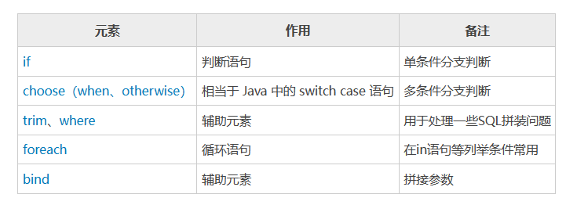

[toc]

# Mybatis笔记3

## 动态SQL

动态 SQL 是 MyBatis 的强大特性之一。

MyBatis 的动态 SQL 包括以下几种元素，如下图所示。


### if 标签

当判断条件为 true 时，才会执行所包含的 SQL 语句。语法如下。
```xml
<if test="判断条件">
    SQL语句
</if>
```

> 例子

```xml
<select id="selectAllWebsite" resultType="com.java.entity.Website">
    select id,name,url from website where 1=1
    <if test="name != null">
        AND name like #{name}
    </if>
    <if test="url!= null">
        AND url like #{url}
    </if>
</select>
```


### choose,when,otherwize 标签

MyBatis 中动态语句 choose-when-otherwise 类似于 Java 中的 switch-case-default 语句。

语法如下
```xml
<choose>
    <when test="判断条件1">
        SQL语句1
    </when >
    <when test="判断条件2">
        SQL语句2
    </when >
    <when test="判断条件3">
        SQL语句3
    </when >
    <otherwise>
        SQL语句4
    </otherwise>
</choose>
```

choose 标签按顺序判断其内部 when 标签中的判断条件是否成立，如果有一个成立，则执行相应的 SQL 语句，choose 执行结束；如果都不成立，则执行 otherwise 中的 SQL 语句。


> 例子

```xml
<select id="select2"  resultType="Student">  
  select * from student Where 1=1   
  <choose>  
    <when test="id != null">  
      AND id = #{id}  
    </when>
	<when test="name != null">  
      AND name = #{name}  
    </when>    
    <otherwise>  
      	AND sex="男"  
    </otherwise>  
  </choose>  
</select>   
```


### where 标签 

where 标签相当于 where 关键字。主要用来简化 SQL 语句中的条件判断，可以自动处理 AND/OR 条件，语法如下。

```xml
<where>
    <if test="判断条件">
        AND/OR ...
    </if>
</where>
```

if 语句中判断条件为 true 时，where 关键字才会加入到组装的 SQL 里面，否则就不加入。并且 where标签 会检索语句，它会将 where关键字后的第一个 SQL 条件语句的 AND 或者 OR 关键词去掉。


```xml
<select id="selectWebsite" resultType="com.java.entity.Website">
    select id,name,url from website
    <where>
        <if test="name != null">
            AND name like #{name}
        </if>
        <if test="url!= null">
            AND url like #{url}
        </if>
    </where>
</select>
```

如果传入name,url参数,则SQL语句变为 

```
select id,name,url from website where name like #{name} AND url like #{url} 
```


### set 标签

在 Mybatis 中，update 语句可以使用 set 标签动态更新列。set 标签可以为 SQL 语句动态的添加 set 关键字，并且剔除追加到条件末尾多余的逗号。

```xml
<update id="update1" parameterType="user"> 
  update User  
    <set>  
        <if test="username !=null">
        username=#{username},
        </if>  
        <if test="password !=null">
        password=#{password},
        </if>  
        <if test="Age != null">
        Age =#{Age},
        </if>  
    </set>  
  where id=#{id}  
</update>  
```

当3个参数都传入sql语句中。则SQL语句变为 
```
update user set username= #{username}, password=#{password}, Age=#{Age}  where id=#{id}
```

### foreach 标签

Mybatis foreach 标签用于循环语句，它很好的支持了数据和 List、set 接口的集合，并对此提供遍历的功能。语法格式如下。

```xml
<foreach item="item" index="index" collection="list|array|map key" open="(" separator="," close=")">
    参数值
</foreach>
```

foreach 标签主要有以下属性，说明如下。
* item：表示集合中每一个元素进行迭代时的别名。
* index：指定一个名字，表示在迭代过程中每次迭代到的位置。
* open：表示该语句以什么开始（既然是 in 条件语句，所以必然以(开始）。
* separator：表示在每次进行迭代之间以什么符号作为分隔符（既然是 in 条件语句，所以必然以,作为分隔符）。
* close：表示该语句以什么结束（既然是 in 条件语句，所以必然以)开始）。
* collection 属性: 表示迭代集合的类型。
  - 如果传入的是单参数且参数类型是一个 List，collection 属性值为 list。
  - 如果传入的是单参数且参数类型是一个 array 数组，collection 的属性值为 array。
  - 如果传入的参数是多个，需要把它们封装成一个 Map，当然单参数也可以封装成 Map。Map 的 key 是参数名，collection 属性值是传入的 List 或 array 对象在自己封装的 Map 中的 key。

> 例子

映射文件部分代码如下
```xml
<select id="selectWebsite" parameterType="com.java.entity.Website" resultType="com.java.entity.Website">
    SELECT id,name,url,age,country
    FROM website WHERE age in
    <foreach item="age" index="index" collection="list" open="(" separator="," close=")">
        #{age}
    </foreach>
</select>
```

测试部分代码如下
```java
//.............上面代码省略
List<Integer> ageList = new ArrayList<Integer>();
ageList.add(10);
ageList.add(12);
List<Website> siteList = ss.selectList("net.biancheng.mapper.WebsiteMapper.selectWebsite", ageList);
for (Website ws : siteList) {
    System.out.println(ws);
}

//运行的sql语句如下
// SELECT id,name,url,age,country FROM website WHERE age in ( ? , ? )
```

### bind 标签

bind 标签可以通过表达式自定义一个上下文变量。然后方便的在sql语句中使用这个变量。

比如，按照网站名称进行模糊查询，SQL 映射文件如下。
```xml
<select id="selectWebsite" resultType="net.biancheng.po.Website">
    <bind name="pattern_name" value="'%'+name+'%'" />
    <bind name="pattern_url" value="'%'+url+'%'" />
    SELECT id,name,url,age,country
    FROM website
    WHERE name like #{pattern_name}
    AND url like #{pattern_url}
</select>
```

通过bind标签，把value属性的值和name属性的值，进行了绑定。之后就可以在sql语句中使用name属性值。

### trim 标签

trim 一般用于去除 SQL 语句中多余的 AND 关键字、逗号`，`或者给 SQL 语句前拼接 where、set 等后缀，可用于选择性插入、更新、删除或者条件查询等操作。trim 语法格式如下。

```xml
<trim prefix="前缀" suffix="后缀" prefixOverrides="忽略前缀字符" suffixOverrides="忽略后缀字符">
    SQL语句
</trim>
```

* prefix: 给SQL语句拼接的前缀，为 trim 包含的内容加上前缀。
* suffix: 给SQL语句拼接的后缀，为 trim 包含的内容加上后缀。
* prefixOverrides: 去除 SQL 语句前面的关键字或字符，该关键字或者字符由 prefixOverrides 属性指定。
* suffixOverrides: 去除 SQL 语句后面的关键字或者字符，该关键字或者字符由 suffixOverrides 属性指定。

> 例子

```xml
<select id="selectWebsite" resultType="net.biancheng.po.Website">
    SELECT id,name,url,age,country
    FROM website
    <trim prefix="where" prefixOverrides="and">
        <if test="name != null and name !=''">
            AND name LIKE CONCAT ('%',#{name},'%')
        </if>
        <if test="url!= null">
            AND url like concat ('%',#{url},'%')
        </if>
    </trim>
</select>
```

如果name和url参数都存在时，则sql语句变为
```
SELECT id,name,url,age,country FROM website where name LIKE CONCAT ('%',?,'%') AND url like concat ('%',?,'%')
```

### sql，include 标签（抽取可重复使用的sql片段，方便引用）：

* sql标签: 用于抽取sql片段。
* inculde标签: 引用被抽取的sql片段。
 
```xml
<sql id="sql_1">
  id,name,gender
</sql>
<insert id="addstulist" parameterType="com.java.entity.Website">
 insert into student ( <include refid="sql_1"></include> ) values (#{id},#{name},#{gender});
</insert>
```

上面的sql语句为
```
insert into student (id,name,gender) values (#{id},#{name},#{gender});
```

