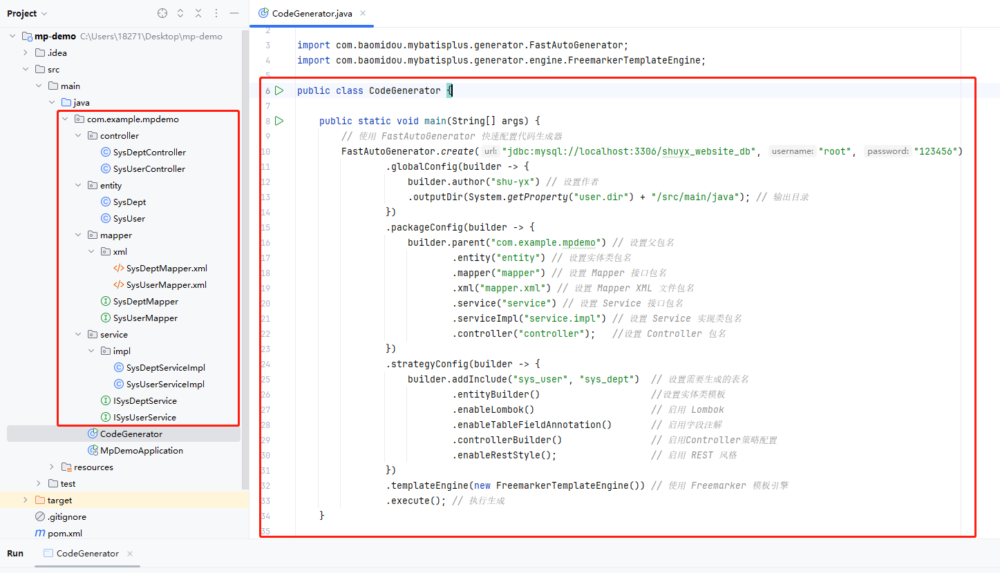
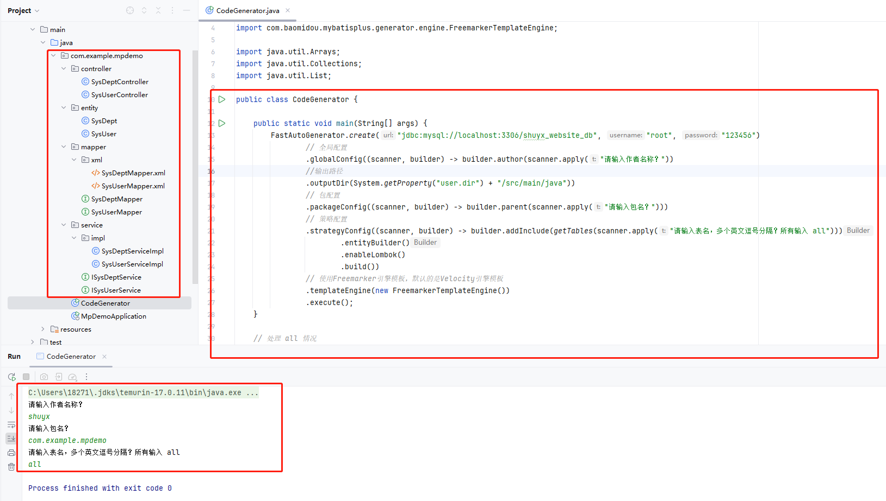

[toc]

# MybatisPlus代码生成器笔记

MyBatis Plus中的代码生成器是一个非常强大且实用的工具，旨在提高开发效率，减少重复性代码的编写。

通过 MyBatis-Plus 的代码生成器，可以快速生成 Entity、Mapper、Mapper XML、Service、Controller 等各个模块的代码，极大的提升了开发效率。

## 添加依赖

MyBatis-Plus 从 3.0.3 之后移除了代码生成器与模板引擎的默认依赖，需要手动添加相关依赖。

```xml
<!-- 代码生成器依赖 -->
<dependency>
    <groupId>com.baomidou</groupId>
    <artifactId>mybatis-plus-generator</artifactId>
    <version>3.5.7</version>
</dependency>

<!-- 下面的模板引擎依赖，选择其中一个即可。 -->

<!-- Velocity（默认） -->
<dependency>
    <groupId>org.apache.velocity</groupId>
    <artifactId>velocity-engine-core</artifactId>
    <version>最新版本</version>
</dependency>
<!-- 最新版本的Freemarker -->
<dependency>
    <groupId>org.freemarker</groupId>
    <artifactId>freemarker</artifactId>
    <version>2.3.32</version>
</dependency>
<!-- Beetl -->
<dependency>
    <groupId>com.ibeetl</groupId>
    <artifactId>beetl</artifactId>
    <version>最新版本</version>
</dependency>

```

## 使用代码生成器

目前有两种形式使用代码生成器。
- 快速生成。即添加生成器代码，并进行相关配置，然后直接运行即可生成代码。
- 交互式生成。即在运行之后，会提示您输入相应的内容，等待配置输入完整之后就自动生成相关代码。


### 快速生成

1. 在启动类所在目录下创建一个CodeGenerator.java类
2. 在该类中编写如下main方法。

```java
package com.example.mpdemo;

import com.baomidou.mybatisplus.generator.FastAutoGenerator;
import com.baomidou.mybatisplus.generator.engine.FreemarkerTemplateEngine;

public class CodeGenerator {

    public static void main(String[] args) {
        // 使用 FastAutoGenerator 快速配置代码生成器
        FastAutoGenerator.create("jdbc:mysql://localhost:3306/shuyx_website_db", "root", "123456")
                .globalConfig(builder -> {
                    builder.author("shu-yx") // 设置作者
                    .outputDir(System.getProperty("user.dir") + "/src/main/java"); // 输出目录
                })
                .packageConfig(builder -> {
                    builder.parent("com.example.mpdemo") // 设置父包名
                            .entity("entity") // 设置实体类包名
                            .mapper("mapper") // 设置 Mapper 接口包名
                            .xml("mapper.xml") // 设置 Mapper XML 文件包名
                            .service("service") // 设置 Service 接口包名
                            .serviceImpl("service.impl") // 设置 Service 实现类包名
                            .controller("controller");   //设置 Controller 包名
                })
                .strategyConfig(builder -> {
                    builder.addInclude("sys_user", "sys_dept")  // 设置需要生成的表名
                            .entityBuilder()                    //设置实体类模板
                            .enableLombok()                     // 启用 Lombok
                            .enableTableFieldAnnotation()       // 启用字段注解
                            .controllerBuilder()                // 启用Controller策略配置
                            .enableRestStyle();                 // 启用 REST 风格
                })
                .templateEngine(new FreemarkerTemplateEngine()) // 使用 Freemarker 模板引擎
                .execute(); // 执行生成
    }

}

```

3. 生成效果

如图所示，通过代码生成器自动创建出了各个层的代码。



### 交互式生成

1. 在启动类所在目录下创建一个CodeGenerator.java类
2. 在该类中编写如下main方法。

```java
package com.example.mpdemo;

import com.baomidou.mybatisplus.generator.FastAutoGenerator;
import com.baomidou.mybatisplus.generator.engine.FreemarkerTemplateEngine;

import java.util.Arrays;
import java.util.Collections;
import java.util.List;

public class CodeGenerator {

    public static void main(String[] args) {
        FastAutoGenerator.create("jdbc:mysql://localhost:3306/shuyx_website_db", "root", "123456")
                // 全局配置
                .globalConfig((scanner, builder) -> builder.author(scanner.apply("请输入作者名称？"))
                //输出路径
                .outputDir(System.getProperty("user.dir") + "/src/main/java"))
                // 包配置
                .packageConfig((scanner, builder) -> builder.parent(scanner.apply("请输入包名？")))
                // 策略配置
                .strategyConfig((scanner, builder) -> builder.addInclude(getTables(scanner.apply("请输入表名，多个英文逗号分隔？所有输入 all")))
                        .entityBuilder()
                        .enableLombok()
                        .build())
                // 使用Freemarker引擎模板，默认的是Velocity引擎模板
                .templateEngine(new FreemarkerTemplateEngine())
                .execute();
    }

    // 处理 all 情况
    protected static List<String> getTables(String tables) {
        return "all".equals(tables) ? Collections.emptyList() : Arrays.asList(tables.split(","));
    }
}

```

3. 生成效果

如图所示，通过代码生成器自动创建出了各个层的代码。



## 测试

当我们通过代码生成器，自动创建代码的时候。此时的代码还不能使用。

1. 在配置文件中添加数据库配置

```yml
spring:
  datasource:
    driver-class-name: com.mysql.cj.jdbc.Driver
    url: jdbc:mysql://localhost:3306/shuyx_website_db
    username: root
    password: 123456
```

mysql 8.x 以上的版本的driver-class-name的属性值使用com.mysql.cj.jdbc.Driver


2. 我们还需要在各个Mapper层（dao层）的接口上，添加@Mapper注解。该@Mapper注解能把接口注入到spring容器中。

案例代码如下所示
```java
// 添加@Mapper注解
@Mapper
public interface SysDeptMapper extends BaseMapper<SysDept> {

}
```

3. 编写测试类

案例代码如下
```java
package com.example.mpdemo;
//.........

@SpringBootTest
class MpDemoApplicationTests {

    @Autowired
    private ISysUserService userService;

    @Test
    void test01() {
        List<SysUser> list = userService.list();
        for (SysUser sysUser : list) {
            System.out.println(sysUser.toString());
        }
    }

}

```