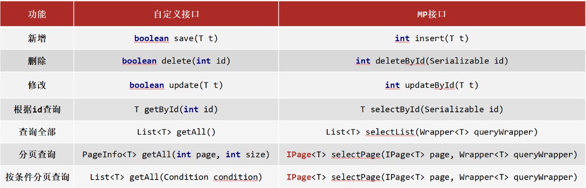
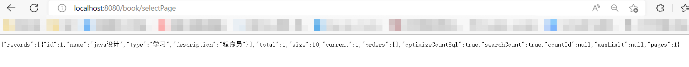
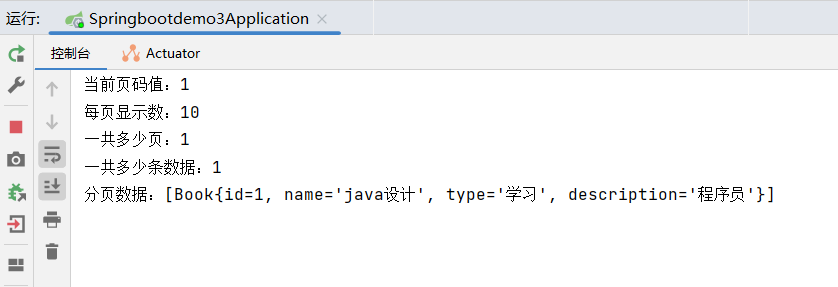
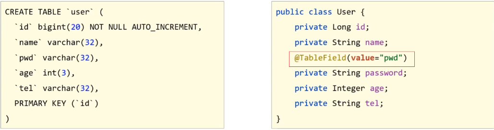
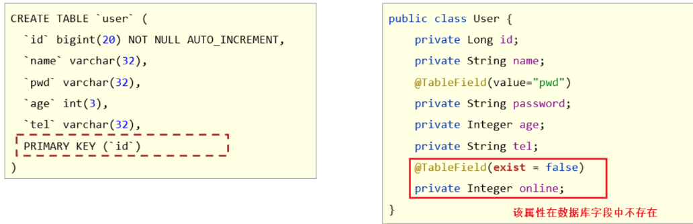
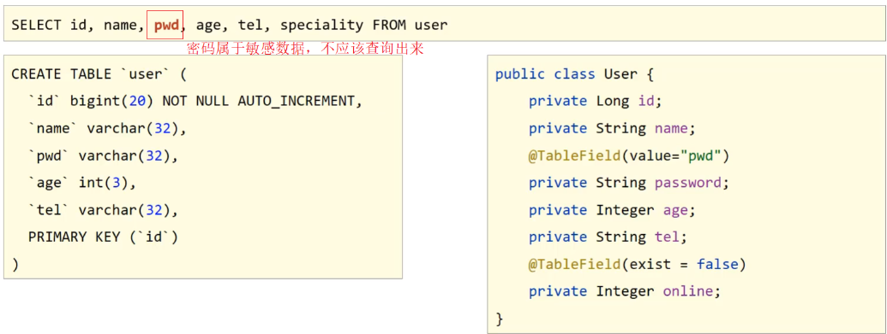
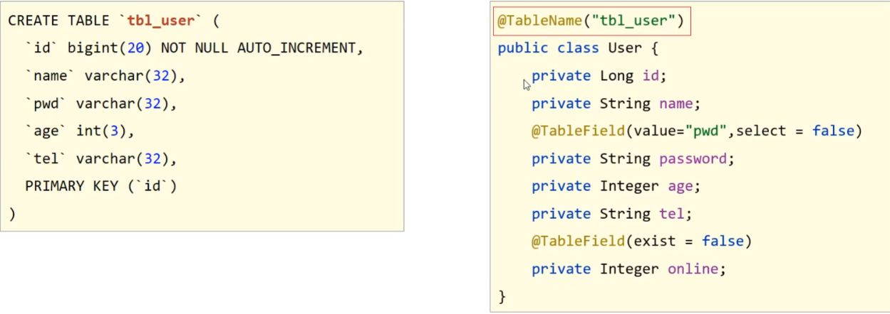
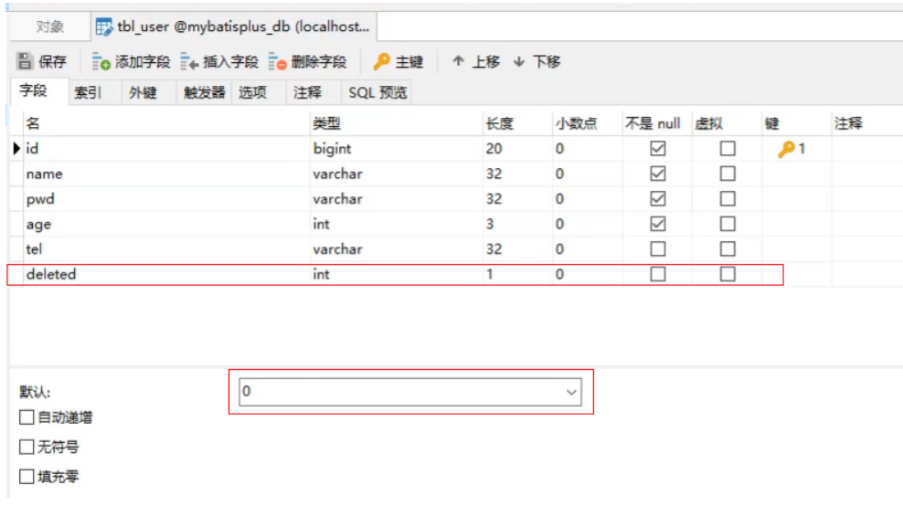

[toc]

# MybatisPlus笔记 版本3.5.2

当前MybatisPlus版本为3.5.2

MyBatisPlus（简称MP）是基于MyBatis框架基础上开发的增强型工具，旨在简化开发、提高效率。

MP的特性:
- 无侵入：只做增强不做改变，不会对现有工程产生影响。
- 强大的 CRUD 操作：内置通用 Mapper，少量配置即可实现单表CRUD 操作。
- 支持 Lambda：编写查询条件无需担心字段写错。
- 支持主键自动生成。
- 内置分页插件。


# 1 MybatisPlus入门案例

## 1 创建SpringBoot项目

创建SpringBoot项目，选择导入Spring Web,Mysql,MybatisPlus相关依赖

* MybatisPlus依赖包含了Mybatis依赖，无须二次引入Mybatis依赖。

完整依赖
```xml
<dependencies>
    <!-- spring web依赖 -->
    <dependency>
        <groupId>org.springframework.boot</groupId>
        <artifactId>spring-boot-starter-web</artifactId>
    </dependency>
    <!-- MybatisPlus依赖 -->
    <dependency>
        <groupId>com.baomidou</groupId>
        <artifactId>mybatis-plus-boot-starter</artifactId>
        <version>3.5.2</version>
    </dependency>
    <!-- Mysql依赖 -->
    <dependency>
        <groupId>mysql</groupId>
        <artifactId>mysql-connector-java</artifactId>
        <scope>runtime</scope>
    </dependency>
</dependencies>
```

## 2 创建数据库表，实体类

1. 创建数据库test,其中创建表book

```
CREATE TABLE `book` (
  `id` int NOT NULL,
  `name` varchar(255) DEFAULT NULL,
  `type` varchar(255) DEFAULT NULL,
  `description` varchar(255) DEFAULT NULL,
  PRIMARY KEY (`id`)
) ENGINE=InnoDB DEFAULT CHARSET=utf8mb4;
```

2. 创建entity包下。其中根据表book创建实体类Book，内容如下

```java
public class Book {
    private Integer id;
    private String name;
    private String type;
    private String description;
    //setter and  getter
    //toString
}
```

## 3  定义dao接口与@Mapper注解

创建BookDao接口，接口继承BaseMapper接口，内容如下

```java
//@Mapper让该dao接口能注入到spring容器
@Mapper 
public interface BookDao extends BaseMapper<Book>{
    //无须编写具体的方法
    //BookDao接口从BaseMapper接口中继承了许多通用的CRUD方法
}
```

* <font color="red">dao接口继承BaseMapper接口，会继承许多通用的CRUD方法。</font>

说明:Dao接口要想被SpringIOC容器扫描到，有两种解决方案:
* 方案一:在Dao接口上添加@Mapper注解，并且确保Dao处在引导类（启动类）所在包或其子包中。该方案的缺点是需要在每个Dao接口中添加注解。
* 方案二:在引导类上添加@MapperScan注解，其属性为所要扫描的Dao所在包。该方案的好处是只需要写一次，则指定包下的所有Dao接口都能被扫描到，@Mapper注解就可以不写。
* 通常使用更多的是方案一。
```Java
//通过@MapperScan注解扫描包。把dao接口注入到spring容器中
@SpringBootApplication
@MapperScan("com.example.springbootdemo3.dao")
public class Springbootdemo3Application {
    public static void main(String[] args) {
        SpringApplication.run(Springbootdemo3Application.class, args);
    }
}
```

## 4 定义service接口及其实现类

创建service包下。其中创建BookService接口及其实现类，内容如下

```java
public interface BookService {
    public Book getById(Integer id);
}

//////////////////

@Service
public class BookServiceImpl implements BookService {
    @Autowired
    private BookDao dao;
    @Override
    public Book getById(Integer id) {
        //selectById方法是dao接口从BaseMapper接口中继承过来的方法
        return dao.selectById(id);
    }
}
```

* <font color="red">dao接口继承BaseMapper接口，会继承许多通用的CRUD方法。</font>

## 5 定义controller层

创建controller包下。其中创建BookController实现类，内容如下

```java
@RestController
@RequestMapping("/book")
public class BookController {
    @Autowired
    private BookService bookService;

    @RequestMapping("/getById/{id}")
    public Book getById(@PathVariable("id") Integer id){
        return bookService.getById(id);
    }
}
```

## 6 添加数据源配置信息

```yaml
spring:
  datasource:
    driver-class-name: com.mysql.jdbc.Driver
    url: jdbc:mysql://localhost:3306/test?serverTimezone=UTC
    username: root
    password: root
```

## 7 运行启动类，测试接口


# 2 MybatisPlus数据层（dao层）开发

* MyBatisPlus的BaseMapper接口提供了一些标准的CRUD方法。可以直接让dao接口继承。从而简化dao接口代码。

如下案例：
```java
//@Mapper让该dao接口能注入到spring容器
@Mapper 
public interface BookDao extends BaseMapper<Book>{
    //无须编写具体的方法
    //BookDao接口从BaseMapper接口中继承了许多通用的CRUD方法
}
```

下图是BaseMapper接口中部分提供的标准CRUD方法：


以下是BaseMapper接口源代码：
```java
public interface BaseMapper<T> extends Mapper<T> {
    //int:返回值，新增成功后返回1，没有新增成功返回的是0
    //T:泛型，新增数据
    int insert(T entity);

    //int:返回值类型，数据删除成功返回1，未删除数据返回0
    int deleteById(Serializable id);

    //T:泛型，需要修改的数据内容，注意因为根据ID进行修改，所以传入的对象entity中需要有ID属性值
    //int:返回值，修改成功后返回1，未修改数据返回0
    //注意：修改的时候，只修改实体对象entity中有值的字段。
    int updateById(@Param("et") T entity);

    //Serializable：参数类型,主键ID的值
    //T:根据ID查询只会返回一条数据
    T selectById(Serializable id);

    //Wrapper：查询条件对象，没有可直接传为Null
    //List:因为查询的是所有，所以返回的数据是一个集合
    List<T> selectList(@Param("ew") Wrapper<T> queryWrapper);

    //分页方法
    <P extends IPage<T>> P selectPage(P page, @Param("ew") Wrapper<T> queryWrapper);
}
```

## 1 分页功能

MP中如何实现分页功能?

BaseMapper接口中分页查询使用的方法是:

```java
<P extends IPage<T>> P selectPage(P page, @Param("ew") Wrapper<T> queryWrapper);
```
- IPage:用来构建分页查询条件
- Wrapper：用来构建条件查询的条件，没有可直接传为Null
- IPage:返回值，形参和方法的返回值都是IPage


① 步骤1：编写分页方法。

```java
public interface BookService {
    public IPage<Book> selectPage();
}

///////////

@Service
public class BookServiceImpl implements BookService {
    @Autowired
    private BookDao dao;

    //测试分页方法
    public IPage<Book> selectPage(){
        //1 创建IPage分页对象,设置分页参数,1为当前页码，3为每页显示的记录数
        IPage<Book> page=new Page<>(1,10);
        //2 执行分页查询
        IPage<Book> bookIPage = dao.selectPage(page, null);
        //3 获取分页结果
        System.out.println("当前页码值："+page.getCurrent());
        System.out.println("每页显示数："+page.getSize());
        System.out.println("一共多少页："+page.getPages());
        System.out.println("一共多少条数据："+page.getTotal());
        System.out.println("分页数据："+page.getRecords());
        return page;
    }
}

////////
@RequestMapping("/book")
public class BookController {
    @Autowired
    private BookService bookService;
    
    @RequestMapping("/selectPage")
    public IPage<Book> selectPage(){
        return bookService.selectPage();
    }
}
```

② 步骤2：设置分页拦截器

这个拦截器MP已经为我们提供好了，我们只需要将其配置成Spring管理的bean对象即可。

```java
@Configuration
public class MybatisPlusConfig {
    @Bean
    public MybatisPlusInterceptor mybatisPlusInterceptor(){
        //1 创建MybatisPlusInterceptor拦截器对象
        MybatisPlusInterceptor mpInterceptor=new MybatisPlusInterceptor();
        //2 添加分页拦截器
        mpInterceptor.addInnerInterceptor(new PaginationInnerInterceptor());
        return mpInterceptor;
    }
}
```

③ 步骤3 测试





# 3 条件构造器Wrapper

MyBatisPlus将书写复杂的SQL条件进行了封装。Wrapper类就是用来封装条件的。<font color="red">具体用法参考官方文档。</font>

## 1 查询条件构造器QueryWrapper

```java
@Service
public class BookServiceImpl implements BookService {
    @Autowired
    private BookDao dao;

    public void test(){
        QueryWrapper qw = new QueryWrapper();
        qw.lt("id",10);
        qw.gt("id",5);
        List<Book> bookList = dao.selectList(qw);
        System.out.println(bookList);
    }
}
```

* lt: 小于(<)
* gt: 大于(>)

```sql
//最终的SQL语句如下
SELECT * FROM book WHERE (age < 10 AND age > 5)
```

## 2 查询指定字段

在查询数据的时候，什么都没有做默认就是查询表中所有字段的内容，select(...)方法用来设置查询的字段列。

```java
void test(){
    QueryWrapper<User> lqw = new QueryWrapper<User>();
    lqw.select("id","name","age","tel");
    List<User> userList = userDao.selectList(lqw);
    System.out.println(userList);
}
```

* 最终的sql语句为: SELECT id,name,age,tel FROM user

## 3 聚合查询

select(...)方法可以用来设置聚合函数查询。

```
count:总记录数
max:最大值
min:最小值
avg:平均值
sum:求和
```

```java
void test(){
    QueryWrapper<User> lqw = new QueryWrapper<User>();
    //lqw.select("count(*) as count");
    //SELECT count(*) as count FROM user

    //lqw.select("max(age) as maxAge");
    //SELECT max(age) as maxAge FROM user

    //lqw.select("min(age) as minAge");
    //SELECT min(age) as minAge FROM user

    //lqw.select("sum(age) as sumAge");
    //SELECT sum(age) as sumAge FROM user

    lqw.select("avg(age) as avgAge");
    //SELECT avg(age) as avgAge FROM user

    List<Map<String, Object>> userList = userDao.selectMaps(lqw);
    System.out.println(userList);
}
```

## 4 分组查询

select()方法与groupBy()方法可用于分组查询。

```java
void test(){
    QueryWrapper<User> lqw = new QueryWrapper<User>();
    lqw.select("count(*) as count,tel");
    lqw.groupBy("tel");
    List<Map<String, Object>> list = userDao.selectMaps(lqw);
    System.out.println(list);
}
```

* groupBy为分组，最终的sql语句如下：
```sql
SELECT count(*) as count,tel FROM user GROUP BY tel
```

**注意:**
* 聚合与分组查询，无法使用lambda表达式来完成
* MP只是对MyBatis的增强，如果MP实现不了，可以直接在DAO接口中使用MyBatis的方式实现。


## 5 其余查询条件

除了lt()和gt()方法外。MP的查询条件方法有很多:
* 范围匹配（> 、 = 、between）
* 模糊匹配（like）
* 空判定（null）
* 包含性匹配（in）
* 分组（group）
* 排序（order）

### 1 等值查询

```java
void testGetAll(){
    LambdaQueryWrapper<User> lqw = new LambdaQueryWrapper<User>();
    lqw.eq(User::getName, "Jerry").eq(User::getPassword, "jerry");
    User loginUser = userDao.selectOne(lqw);
    System.out.println(loginUser);
}
```

* eq()： 相当于 `=`,对应的sql语句为

```sql
SELECT * FROM user WHERE (name = ? AND password = ?)
```

### 2 范围查询

```java
void test(){
    LambdaQueryWrapper<User> lqw = new LambdaQueryWrapper<User>();
    lqw.between(User::getAge, 10, 30);
    //SELECT * FROM user WHERE (age BETWEEN ? AND ?)
    List<User> userList = userDao.selectList(lqw);
    System.out.println(userList);
}
```

* gt():大于(>)
* ge():大于等于(>=)
* lt():小于(<)
* lte():小于等于(<=)
* between():between ? and ?

### 3 模糊查询

```java
void testGetAll(){
    LambdaQueryWrapper<User> lqw = new LambdaQueryWrapper<User>();
    lqw.likeLeft(User::getName, "J");
    //SELECT * FROM user WHERE (name LIKE ?)

    List<User> userList = userDao.selectList(lqw);
    System.out.println(userList);
}
```

* like():前后加百分号,如 %J%
* likeLeft():前面加百分号,如 %J
* likeRight():后面加百分号,如 J%

### 4 排序查询

```java
void testGetAll(){
    LambdaQueryWrapper<User> lwq = new LambdaQueryWrapper<>();
    /**
    * condition ：条件，返回boolean，
        当condition为true，进行排序，如果为false，则不排序
    * isAsc:是否为升序，true为升序，false为降序
    * columns：需要操作的列
    */
    lwq.orderBy(true,false, User::getId);

    List<User> userList = userDao.selectList(lwq);
    System.out.println(userList);
}
```

* orderBy排序
  * condition:条件，true则添加排序，false则不添加排序
  * isAsc:是否为升序，true升序，false降序
  * columns:排序字段，可以有多个
* orderByAsc/Desc(单个column):按照指定字段进行升序/降序
* orderByAsc/Desc(多个column):按照多个字段进行升序/降序
* orderByAsc/Desc
  * condition:条件，true添加排序，false不添加排序
  * 多个columns：按照多个字段进行排序


# 4 实体类属性名和表的列名之间的映射关系

查询出来的数据能够成功的从表中获取并封装到实体类对象中，原因是表的字段列名和实体类的属性名一样。

## 问题1:若表字段与编码属性设计不同步

当表的列名和模型类的属性名发生不一致，就会导致数据封装不到模型对象，这个时候就需要其中一方做出修改，那如果前提是两边都不能改又该如何解决?

MP给我们提供了一个注解@TableField,使用该注解可以实现模型类属性名和表的列名之间的映射关系



## 问题2:若编码中添加了数据库中未定义的属性

当模型类中多了一个数据库表不存在的字段，就会导致生成的sql语句中在select的时候查询了数据库不存在的字段，程序运行就会报错，错误信息为:

<font color="red">Unknown column '多出来的字段名称' in 'field list'</font>

具体的解决方案用到的还是@TableField注解，它有一个属性叫exist，设置该字段是否在数据库表中存在，如果设置为false则不存在，生成sql语句查询的时候，就不会再查询该字段了。



## 问题3:若采用默认查询开放了更多的字段查看权限

查询表中所有的列的数据，就可能把一些敏感数据查询到返回给前端,例如密码。这个时候我们就需要限制哪些字段默认不要进行查询。解决方案是@TableField注解的一个属性叫select，该属性设置默认是否需要查询该字段的值，true(默认值)表示默认查询该字段，false表示默认不查询该字段。



## 问题4:若表名与模型类名称不同

该问题主要是表的名称和模型类的名称不一致，会导致查询失败。解决方案是使用MP提供的另外一个注解@TableName来设置表与模型类之间的对应关系。



## 小结：@TableField，@TableName注解

@TableField注解
类型：属性注解
位置：属性上方定义
作用：设置当前属性对应的数据库表中的字段关系

@TableName注解
类型：类注解
位置：类上方定义
作用：设置当前类对应于数据库表关系


# 5  ID生成策略与@TableId注解

MybatisPlus提供以下几种ID生成策略：

* AUTO: id自增长策略。需要对应表设置了ID主键自增，否则无效。
* NONE: 不设置id生成策略
* INPUT:用户手工输入id
* ASSIGN_ID:雪花算法生成id(可兼容数值型与字符串型)
* ASSIGN_UUID:以UUID生成算法作为id生成策略

## AUTO: id自增长策略

当新增数据到表中的时候。无须传入id值。MybatisPlus框架会读取表中最大的id值，在其基础上自增+1。作为新增数据的id值。

* AUTO的作用是使用数据库ID自增，在使用该策略的时候一定要确保对应的数据库表设置了ID主键自增，否则无效。

```java
@Data
@TableName("tbl_user")
public class User {
    //设置tbl_user表的id，为AUTO策略
    @TableId(type = IdType.AUTO)
    private Long id;
    private String name;
    @TableField(value="pwd",select=false)
    private String password;
    private Integer age;
    private String tel;
    @TableField(exist=false)
    private Integer online;
}
//////////////////////////
public void testSave(){
    //新增数据的时候，不用设置id值
    User user = new User();
    user.setName("xiaoming");
    user.setPassword("123456");
    user.setAge(12);
    user.setTel("4006184000");
    userDao.insert(user);
}
```

## INPUT策略

INPUT策略：插入数据的时候需要主动输入id。否则报错。
* 使用INPUT策略的时候要确保对应的数据库表取消ID主键自增设置，否则报错。

```java
@TableName("tbl_user")
public class User {
    //设置INPUT策略
    @TableId(type = IdType.INPUT)
    private Long id;
    private String name;
    @TableField(value="pwd",select=false)
    private String password;
    private Integer age;
    private String tel;
    @TableField(exist=false)
    private Integer online;
}

////////////////////

@Test
public void testSave(){
    User user = new User();
    //需要主动设置主键ID的值。否则报错。
    user.setId(6666L);
    user.setName("xiaoming");
    user.setPassword("itheima");
    user.setAge(12);
    user.setTel("4006184000");
    userDao.insert(user);
}
```

## ASSIGN_ID策略

ASSIGN_ID策略：通过雪花算法自动生成id(可兼容数值型与字符串型)

* 使用INPUT策略的时候要确保对应的数据库表取消ID主键自增设置，否则报错。
* 注意:这种生成策略，不需要手动设置ID，如果手动设置ID，则会使用自己设置的值。

```java
@TableName("tbl_user")
public class User {
    //设置ASSIGN_ID策略
    @TableId(type = IdType.ASSIGN_ID)
    private Long id;
    private String name;
    @TableField(value="pwd",select=false)
    private String password;
    private Integer age;
    private String tel;
    @TableField(exist=false)
    private Integer online;
}

////////////////////

@Test
void testSave(){
    User user = new User();
    user.setName("小明");
    user.setPassword("itheima");
    user.setAge(12);
    user.setTel("4006184000");
    userDao.insert(user);
}
```

## ASSIGN_UUID策略

ASSIGN_UUID策略：以UUID生成算法作为id生成策略。

* 使用ASSIGN_UUID策略注意的是，主键的类型不能是Long，而应该改成String类型。
* 主键对应的数据库表主键字段需要设置为varchar，长度要大于32，因为UUID生成的主键为32位，如果长度小的话就会导致插入失败。

```java
@TableName("tbl_user")
public class User {
    //设置为ASSIGN_UUID策略
    //需要把主键的类型改为String类型。
    @TableId(type = IdType.ASSIGN_UUID)
    private String id;
    private String name;
    @TableField(value="pwd",select=false)
    private String password;
    private Integer age;
    private String tel;
    @TableField(exist=false)
    private Integer online;
}

////////////////////

@Test
void testSave(){
    User user = new User();
    user.setName("小明");
    user.setPassword("itheima");
    user.setAge(12);
    user.setTel("4006184000");
    userDao.insert(user);
}
```

## 小结 @TableId注解

* NONE: 不设置id生成策略，MP不自动生成，约等于INPUT,所以这两种方式都需要用户手动设置，但是手动设置第一个问题是容易出现相同的ID造成主键冲突，为了保证主键不冲突就需要做很多判定，实现起来比较复杂。
* AUTO:数据库ID自增,这种策略适合在数据库服务器只有1台的情况下使用,多台数据库服务器的情况下，容易导致id重复。
* ASSIGN_UUID:可以在分布式的情况下使用，而且能够保证唯一，但是生成的主键是32位的字符串，长度过长占用空间而且还不能排序，查询性能也慢
* ASSIGN_ID:可以在分布式的情况下使用，生成的是Long类型的数字，可以排序性能也高，但是生成的策略和服务器时间有关，如果修改了系统时间就有可能导致出现重复主键
* 综上所述，每一种主键策略都有自己的优缺点，根据自己项目业务的实际情况来选择使用才是最明智的选择。

@TableId注解
类型：属性注解
位置：模型类中用于表示主键的属性上方定义
作用：设置当前类中主键属性的生成策略


# 6 逻辑删除

* 物理删除:业务数据从数据库中删除，执行的是delete操作。
* 逻辑删除:为数据设置是否可用状态字段，删除时设置状态字段为不可用状态，数据保留在数据库中，执行的是update操作。

① 步骤1:给数据库表添加deleted列字段

字段名可以任意，内容也可以自定义，比如0代表正常，1代表删除，可以在添加列的同时设置其默认值为0正常。



② 步骤2:给实体类添加deleted属性

(1)添加与数据库表的列对应的一个属性名，名称可以任意，如果和数据表列名对不上，可以使用@TableField进行关系映射，如果一致，则会自动对应。
(2)标识新增的字段为逻辑删除字段，使用`@TableLogic`

```java
@TableName("tbl_user")
public class User {
    @TableId(type = IdType.ASSIGN_UUID)
    private String id;
    private String name;
    private String password;
    private Integer age;
    private String tel;
    //可用状态属性
    private Integer deleted;
}
```

③ 步骤3:运行删除方法

```java
@Test
public void testDelete(){
    //删除数据，内部实现上是更新操作
    userDao.deleteById(1L);
}
```

<font color="red">逻辑删除的本质其实是修改操作。如果加了逻辑删除字段，查询数据时也要自动带上逻辑删除字段。</font>


# mybatisplus中手写SQL

由于mybatisplus底层是封装的mybatis。因此mybatisplus中手写SQL，本质上是调用mybatis。

环境：springboot + mybatisplus

1. 先配置mapper.xml文件的位置

```yml
mybatis-plus:
  mapper-locations: classpath:mapper/*.xml                # mybatis的手写 sql xml文件的位置。即resources目录中
```

2. 在resources目录中创建mapper目录，然后再创建各个xxxMapper.xml文件

3. mapper.xml文件

```xml
<?xml version="1.0" encoding="UTF-8"?>
<!DOCTYPE mapper
        PUBLIC "-//mybatis.org//DTD Mapper 3.0//EN"
        "http://mybatis.org/dtd/mybatis-3-mapper.dtd">
<mapper namespace="com.shuyx.shuyxuser.mapper.UserMapper">

    <!--查询用户列表，并且关联查询出用户所属的组织机构信息-->
    <select id="selectUserOrgList" resultMap="UserDTO" parameterType="com.shuyx.shuyxuser.dto.UserDTO">
        select u.user_id, u.org_id, u.user_name, u.email, u.avatar, u.phone,u.birthday,
        u.gender, u.status, u.create_time, o.org_name
        from t_user u
        left join t_org o on u.org_id = o.org_id
    </select>

    <!--UserDTO 结果映射集合-->
    <resultMap id="UserDTO" type="com.shuyx.shuyxuser.dto.UserDTO">
        <!--将sql语句查出来的的字段赋值到对应的对象属性上。 -->
        <id property="userId" column="user_id"/>
        <result property="userName" column="user_name"/>
        <result property="orgId" column="org_id"/>
        <result property="email" column="email"/>
        <result property="phone" column="phone"/>
        <result property="gender" column="gender"/>
        <result property="avatar" column="avatar"/>
        <result property="password" column="password"/>
        <result property="status" column="status"/>
        <result property="createTime" column="create_time"/>
        <result property="updateTime" column="update_time"/>
        <!-- 使用<association>标签将一对一关联查询的数据，赋值到指定的结果集中-->
        <association property="org" javaType="com.shuyx.shuyxuser.entity.OrgEntity">
            <id property="orgId" column="org_id"/>
            <result property="parentId" column="parent_id"/>
            <result property="orgName" column="org_name"/>
            <result property="orgPath" column="org_path"/>
            <result property="status" column="status"/>
        </association>
    </resultMap>
</mapper>

```

4. mapper.xml文件对应的mapper接口

```java
@Repository
public interface UserMapper extends BaseMapper<UserEntity> {
    /**
     * 分页查询用户信息
     * @param dto
     * @return
     */
    public List<UserDTO> selectUserOrgList(UserDTO dto);
}
```

5. 测试

```java
private UserMapper userMapper
@Test
public void test1(dto){
    //开始SQL查询
    List<Student> list = userMapper.selectUserOrgList(dto);
    System.out.println(list);
}
```
