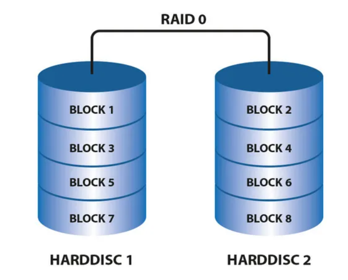
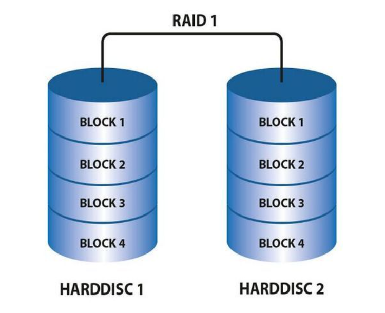
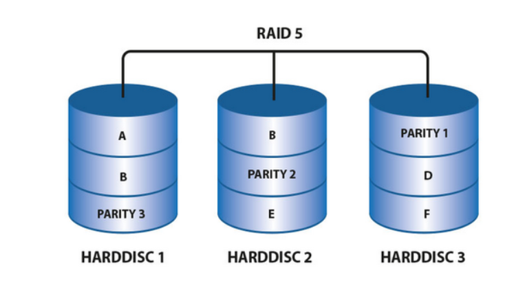
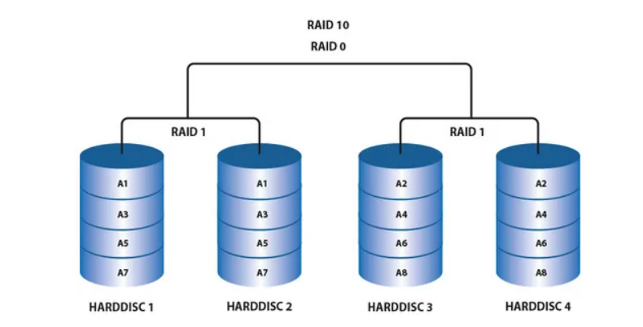

[toc]

# RAID介绍

RAID （ Redundant Array of Independent Disks ）即独立磁盘冗余阵列，简称为「磁盘阵列」，本质上就是用多个独立的磁盘组成在一起形成一个大的磁盘系统，从而实现比单块磁盘更好的存储性能和更高的可靠性。

RAID方案常见的可以分为：
- RAID0
- RAID1
- RAID3
- RAID5
- RAID6
- RAID10

## RAID0

RAID0 是一种非常简单的的方式，它将多块磁盘组合在一起形成一个大容量的存储。当我们要写数据的时候，首先会将数据分为N份，然后同时并发的写到多块磁盘中。当我们要读取数据的时候，会从多块磁盘上同时并发的读取出来。因此执行性能非常的高。

简单来说：RAID0存储数据的方式是将一份文件拆分开，并发写到所有硬盘上，RAID0读取数据的方式是从所有硬盘中并发读取数据。

RAID0的优点：RAID0的读写性能理论上是单块磁盘的N倍（理论上，实际中磁盘的寻址时间也是性能占用的大头）

RAID0的缺点：RAID0并不提供数据校验或冗余备份，因此一旦组成RAID0的一块磁盘损坏了，数据就直接丢失，无法恢复了。因此RAID0就不可能用于高要求的业务中，但可以用在对可靠性要求不高，对读写性能要求高的场景中。

## RAID1

RAID1 是磁盘阵列中单位成本最高的一种方式。因为它的原理是在往磁盘写数据的时候，将同一份数据无差别的写两份到磁盘，分别写到工作磁盘和镜像磁盘，那么它的实际空间使用率只有50%了，两块磁盘当做一块用，这是一种比较昂贵的方案。

优点：数据的安全性非常强，除非组成RAID1的两块硬盘同时坏掉。

缺点：成本非常高，读写性能也不强。 

## RAID3

RAID3用的很少.

RAID3的方式是：将数据按照RAID0的形式，分成多份同时写入多块磁盘，但是还会另外再留出一块磁盘用于写「奇偶校验码」。例如总共有N块磁盘，那么就会让其中额度N-1块用来并发的写数据，第N块磁盘用记录校验码数据。一旦某一块磁盘坏掉了，就可以利用其它的N-1块磁盘去恢复数据。

但是由于第N块磁盘是校验码磁盘，因此有任何数据的写入都会要去更新这块磁盘，导致这块磁盘的读写是最频繁的，也就非常的容易损坏。

## RAID5

RAID5是在RAID3的基础上进行了改进。不再需要用单独的磁盘写校验码了,它把校验码信息分布到各个磁盘上。

例如，总共有N块磁盘，那么会将要写入的数据分成N份，并发的写入到N块磁盘中，同时还将数据的校验码信息也写入到这N块磁盘中（数据与对应的校验码信息必须得分开存储在不同的磁盘上）。一旦某一块磁盘损坏了，就可以用剩下的硬盘和对应的奇偶校验码信息去恢复损坏的数据。

RAID5的方式，最少需要三块磁盘来组建磁盘阵列，允许最多同时坏一块磁盘。如果有两块磁盘同时损坏了，那数据就无法恢复了。

## RAID6

RAID6在RAID5的基础上再次改进，引入了双重校验的概念。可以在有两块磁盘同时损坏的情况下，也能保障数据可恢复。

RAID6除了每块磁盘上都有同级数据校验区以外，还有针对每个数据块的校验区，这样的话，相当于每个数据块有两个校验保护措施，因此数据的冗余性更高了。

但是RAID6的这种设计也带来了很高的复杂度，虽然数据冗余性好，读取的效率也比较高，但是写数据的性能就很差。因此RAID6在实际环境中应用的比较少。

## RAID10

RAID10 其实就是RAID1 + RAID0

如果有四块硬盘，那么先对硬盘进行RAID1，然后再进行RAID0

RAID10兼备了RAID1和RAID0的优点。首先基于RAID1模式将磁盘分为2份，当要写入数据的时候，将所有的数据在两份磁盘上同时写入，相当于写了双份数据，起到了数据保障的作用。且在每一份磁盘上又会基于RAID0技术讲数据分为N份并发的读写，这样也保障了数据的读写效率。

但也可以看出RAID10模式是有一半的磁盘空间用于存储冗余数据的，浪费的很严重，因此用的也不是很多。

## RAID和JBOD区别

JBOD（Just a bunch of disk）严格上来说不是一种RAID，因为它只是简单将多个磁盘合并成一个大的逻辑盘，并没有任何的数据冗余。数据的存放机制就是从第一块磁盘开始依序向后存储数据。如果某个磁盘损毁，则该盘上的数据就会丢失。