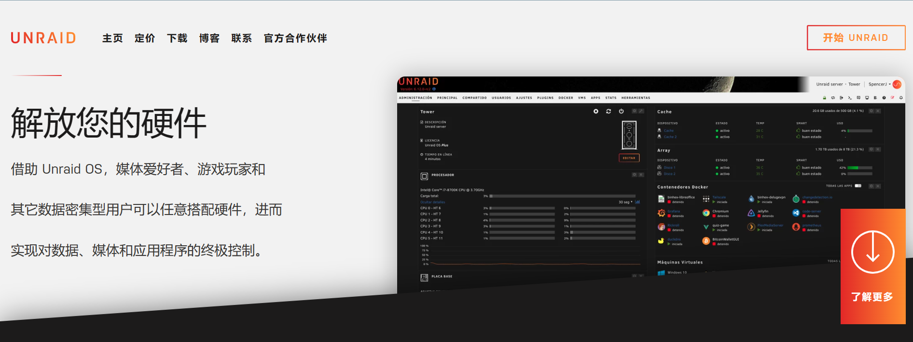
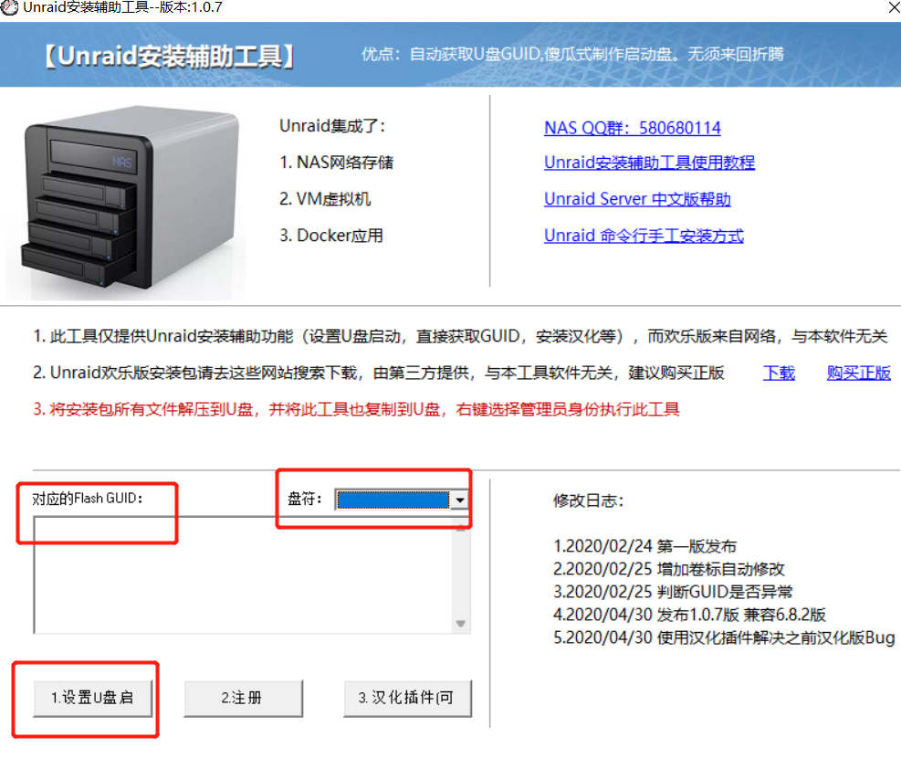
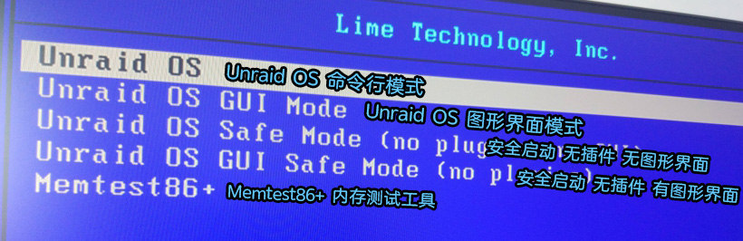
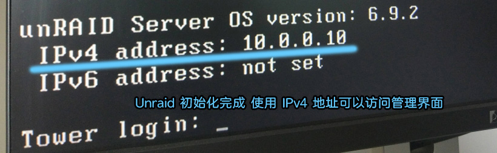
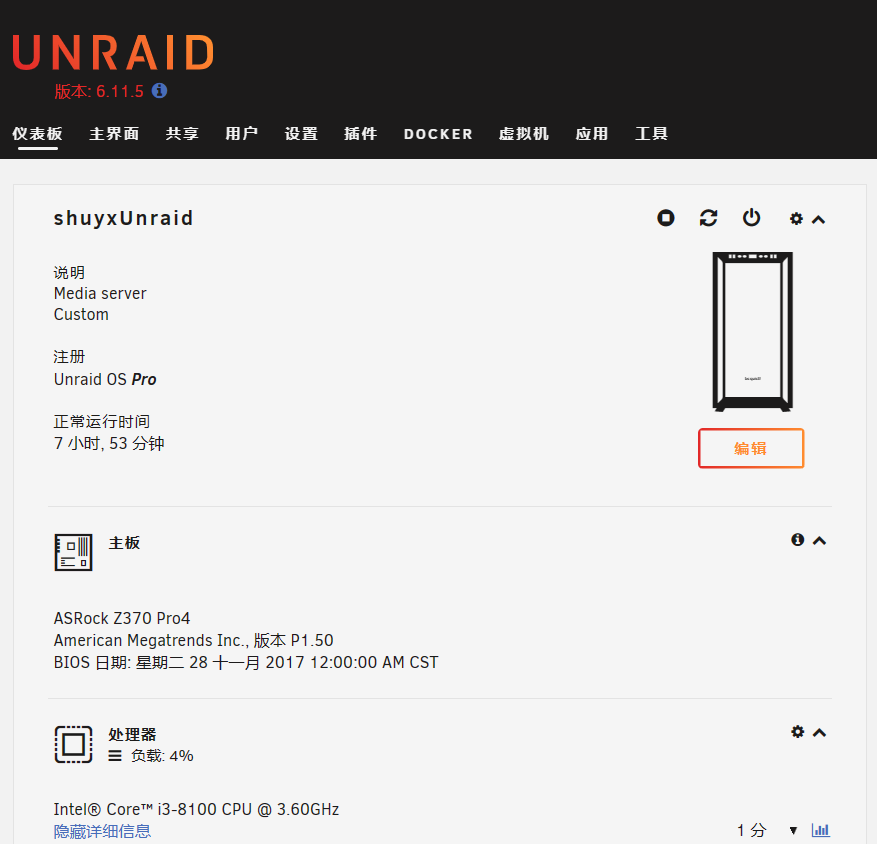

[toc]

# unraid笔记1-介绍与安装

## unraid介绍

[unraid官网](https://unraid.net/zh)



Unraid 的本体其实是 Linux，它主要安装在 NAS 和 All in One 服务器上，与群晖DSM系统相比，Unraid的硬件兼容性更好，原生支持 Docker 和 VM 虚拟机，硬件直通的设置十分方便，这让 Unraid 可以发挥硬件的极致性能。此外它内置的插件中心可以下载的插件和 Docker 功能种类都十分丰富，可以满足使用者不同的需求。

>unraid的特点：
1 unraid不支持RAID阵列。因为不支持RAID阵列，导致读写速度没有其他支持raid阵列的系统块。
2 由于unraid不支持组RAID阵列，可以灵活的增加不同容量大小不同读写速度的硬盘，不会对其它硬盘造成影响，所以扩容真的非常方便。
3 unraid原生支持docker,配合Portainer甚至可以达到准生产级别的效率和稳定性。
4 unraid自带的虚拟机功能十分强大。可以任意虚拟其他系统，并且虚拟系统的性能相比原生系统几乎没有损失。
5 ......

>unraid如何保证数据安全性？
关于数据的安全存储，通过 Unraid 这个系统的命名也可以看出来它是不支持 RAID 的。Unraid 系统采用了校验盘的机制来保证数据安全，最多支持2块磁盘作为校验盘，实现了类似于 RAID5/6 的冗余模式。
例如，当插入2块磁盘作为校验盘，就可以在同时有两块硬盘损坏的极端情况下确保数据不会丢失。
唯一的要求就是校验盘的容量要是所有硬盘当中容量最大的。用同容量或者更大容量（不能大于校验盘）的硬盘换下损坏的硬盘就能恢复数据。

>总结：
unraid相比群晖系统，拥有很高的底层虚拟效率。并且UNRAID对于docker支持相比群晖更完善，可以通过docker扩展非常多的应用场景，也可以通过安装插件扩展功能。综合来看，UNRAID就是这样一个门槛够低，但上限又足够高，功能、性能和稳定性比较平衡的底层虚拟系统。

## unraid安装

unraid系统本身是需要付费的，试用版也只能免费使用30天。于是出现了unraid开心版（unraid破解版）

目前最新的unraid系统版本是6.11.5

### unraid开心版6.11.5安装过程

1. 下载unraid开心版6.11.5

[俄罗斯softroom网站](https://softoroom.org/topic89043.html)

从俄罗斯softroom网站中下载两个压缩包，分别是part1和part2,里面是系统包和修改文件。解压密码是softoroom。

2. 准备一个U盘。以fat32格式进行格式化，注意U盘名称必须是大写的UNRAID。
3. 将下载下来的两个文件一起解压，解压后找到unRAIDServer-6.11.5-x86_64.zip压缩包，然后再次解压，并把其中的所有文件复制到U盘根目录下。
4. 找到crack文件夹内unraider-main.tar.gz解压，找到unraider-main目录下src内hook.c文件复制到U盘config文件夹内。
5. 回到crack文件夹，将unraider文件复制到U盘config文件夹内。
6. 打开u盘中的config目录的go文件。复制下面命令到go文件内

```
#!/bin/bash
# Start the Management Utility
export UNRAID_GUID=改为你U盘的GUID
export UNRAID_NAME=改为你想要的UNRAID名称
export UNRAID_DATE=1654646400
export UNRAID_VERSION=Pro
/lib64/ld-linux-x86-64.so.2 /boot/config/unraider
/usr/local/sbin/emhttp &
```

7. 把unraid辅助安装工具UnraidTool.exe复制到u盘根目录中，然后右键-管理员身份运行-选择U盘盘符。就可以显示你U盘的GUID。之后把U盘的GUID写到go文件中。
8. 设置U盘启动-命令窗口-Y-回车-再回车，关闭窗口，拔除U盘。

不要点注册按钮。


9. 将u盘插入电脑上，bois中设置u盘启动。重启电脑后，unraid系统会自动开始安装。
10. 可以在显示屏上看到unraid系统的安装过程




12. 等到显示器中出现ip地址。在浏览器输入ip地址，设置密码，就可以进入到unraid的操作界面了。



<font color="red">目前unraid6.11.5开心版的文本已备份到个人电脑的个人文件目录中了,用来以后重装unraid系统使用。</font>

## unraid的其他知识点

* 基本上所有的系统设置都可以通过 Unraid 网页端的界面来进行，是不需要外接显示器的。
* 注意 Unraid 通过U盘引导，所以引导U盘不能随意拔出来。
