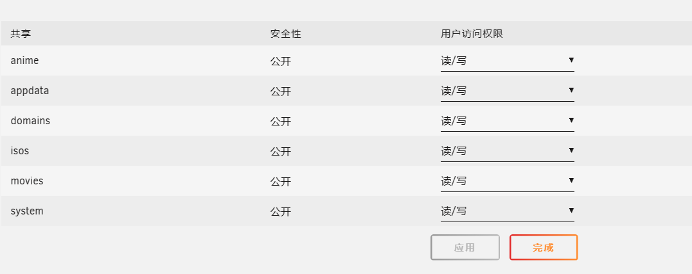
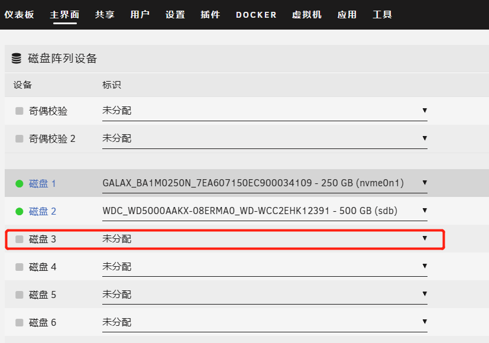
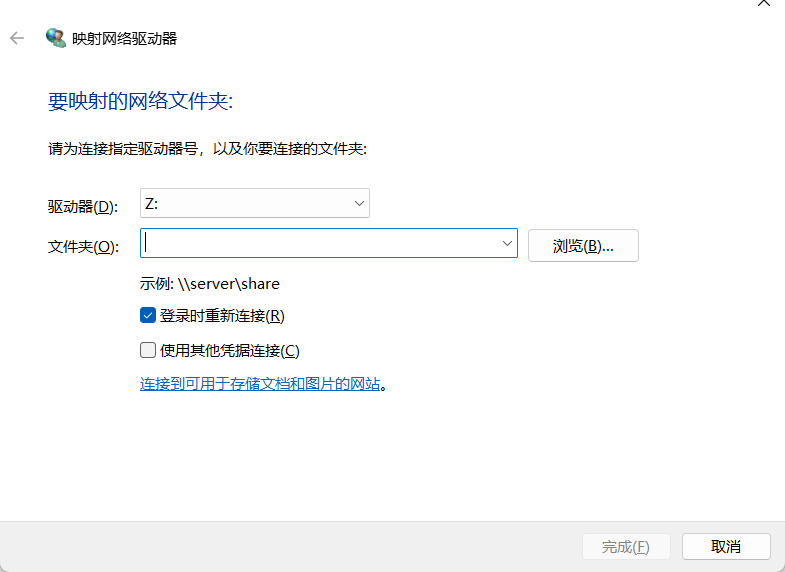

[toc]

# unraid笔记2-系统基础配置

## 安装加速插件

由于unraid系统的插件和docker有很多都在github等国外网站上。因此在unraid服务器无法科学上网的情况下。安装插件和docker经常会失败。

解决方法：修改unraid系统的hosts文件,添加国内的镜像源,安装加速插件等

>如何安装插件？
unraid系统安装插件有两种方法。
1: 在插件界面，输入插件的链接地址。点击安装即可。
2: 在应用界面，先安装应用市场插件，然后就可以在应用市场种下载插件进行安装了。

### unraid modify插件

unraid modify插件可以修改unraid系统的hosts文件来加快Docker，应用市场的加载速度。

插件地址：`http://plg.unraid.site:8/plg/UNRAID_Modify.plg`

>如何安装插件？
插件界面->安装插件-》输入插件地址-》点击安装按钮

### Community Applications 插件   

你只有安装了应用市场插件,才能下载其余的插件.

插件地址：`https://raw.githubusercontent.com/Squidly271/community.applications/master/plugins/community.applications.plg`

### 简体中文插件

1. 当安装好应用市场插件后,在应用界面搜索简体中文插件安装.
2. 设置->显示设置->语言选择简体中文即可.
3. 浏览器刷新页面,就会显示中文界面了.

## 新建用户

Unraid安装完成后，系统默认只有root用户。 因为root用户拥有最高权限，可以控制整个系统，密码泄露出去会带来安全隐患，所以为了安全考虑，需要新建一个或多个用户。

USER界面,点击 ADD USER ，设置用户名、描述、头像、密码，点击 ADD按钮即可创建用户。

注意：unraid web管理界面只能用root账户登录。其他用户是给smb和docker使用的。

### 设置用于对共享文件夹的访问权限

当创建好共享文件夹后，可以设置用户对共享文件夹的权限。

用户界面-》选择某个用户

## 设置为静态ip

Unraid 默认自动获取 IP 地址，由路由器自动分配，这个 IP 地址是会变化的，最好将其设置为静态，使用固定的 IP 地址，方便后续的各种系统配置和应用软件配置。

设置-》网络设置-》修改ipv4分配模式为静态-》点击应用按钮即可

## 修改系统时区信息

设置-》日期和时间-》时区选择 (UTC +8:00)beijing时区

## 开机自动启动阵列

SETTINGS -> Disk Setting -> Enable auto start 选中Yes，点击下方Apply保存设置。这样就不用每次重启点一下启动阵列。

## 添加磁盘到阵列中

1. 在主界面先停止磁盘阵列（若有磁盘阵列正在运行）
2. 磁盘阵列停止后，选择一个硬盘添加到阵列中
3. 点击格式化按钮，对磁盘进行格式化。只有格式化后的硬盘才能被系统使用。
4. 然后点击启动按钮，开始运行磁盘阵列
5. 这样一个新的硬盘就添加到磁盘阵列中了。

停止磁盘阵列的界面：

开启磁盘阵列的界面：

磁盘只有格式化后才能显示具体信息。没有被格式化的磁盘无法被unraid系统使用。

## 创建共享文件夹

在磁盘添加到阵列后，就可以共享界面创建共享文件夹了。

Unraid系统默认自动创建4个共享文件夹：

* appdata 默认存放App/Docker配置文件config的内容
* domains 默认存放虚拟机的磁盘映像
* isos    在安装虚拟机时用来上传系统安装镜像的目录
* system  存放Unraid系统文件，VM模板，Docker映像

选择添加共享按钮，填写名称，包含磁盘，不包含磁盘，其余默认配置，点击添加共享按钮即可创建一个共享文件夹

具体的共享文件夹配置，会在另一个文章中详细描写。

### 配置共享文件夹权限

当创建某个共享文件夹后，再次选择共享文件夹，可以修改配置和权限。

例如在smb安全设置上选择共享为是。就表示把该共享文件夹共享出去。

图片上的安全性配置有3种：公开，安全，私有

公开：访客拥有文件读写权限。
安全：访客拥有文件读取权限。
私有：访客没有文件的读写权限。

### 如何访问共享文件夹

1. 在Windows系统中。选择计算机—》映射网络驱动器
2. 填入共享文件夹的网络位置。例如\\192.168.0.164\movies
3. 点击完成，输入账户密码即可。
4. 映射成功后，共享文件夹会显示在我的电脑

