[toc]

# unraid笔记3-应用

unraid提供丰富的插件和docker容器作为应用可供选择，下面是我用到的一些。

## 网络加速：unraid modify插件

unraid modify插件可以修改unraid系统的hosts文件来加快Docker，应用市场的加载速度。

插件地址：`http://plg.unraid.site:8/plg/UNRAID_Modify.plg`

>如何安装插件？
插件界面->安装插件-》输入插件地址-》点击安装按钮

## 应用市场：Community Applications 插件   

你只有安装了应用市场插件,才能下载其余的插件.

插件地址：`https://raw.githubusercontent.com/Squidly271/community.applications/master/plugins/community.applications.plg`

## 简体中文插件

1. 当安装好应用市场插件后,在应用界面搜索简体中文插件安装.
2. 插件安装成功后，设置界面->显示设置->语言选择简体中文即可.
3. 浏览器刷新页面,就会显示中文界面了.

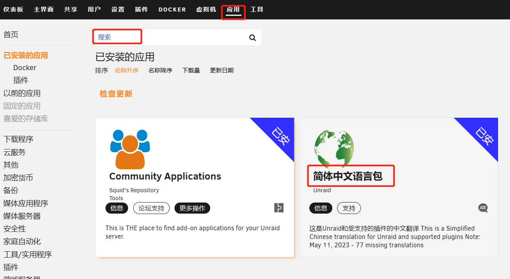

## 文件管理：Dynamix File Manager 插件

Unraid 默认并没有带文件管理器，而是以插件的形式提供给用户来安装，可以在 Unraid 的应用中心搜索 Dynamix File Manager 进行安装。

安装之后，会在 Unraid 的右上角多出一个文件管理器图标。
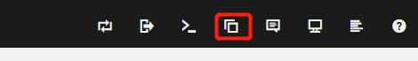

点击之后，就可以进入文件管理界面了。
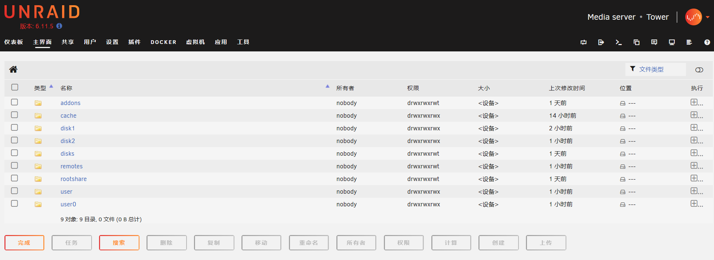


基本的文件管理功能都有，可以满足绝大部分需求。

## 文件管理：FileBrowser docker容器

如果Dynamix File Manager插件不够好用，或者不够好看。那么可以试试这款简洁轻量易用的第三方管理器 - FileBrowser。

1. 在应用市场搜索FileBrowser。找到下载量多的那个安装。
2. 容器配置
    1. HostPath1配置修改为/mnt/user，共享文件夹基本上都存放在这个目录中。
    2. 把webui界面的IP地址修改为固定ip。
    3. HostPath2和其余配置默认。

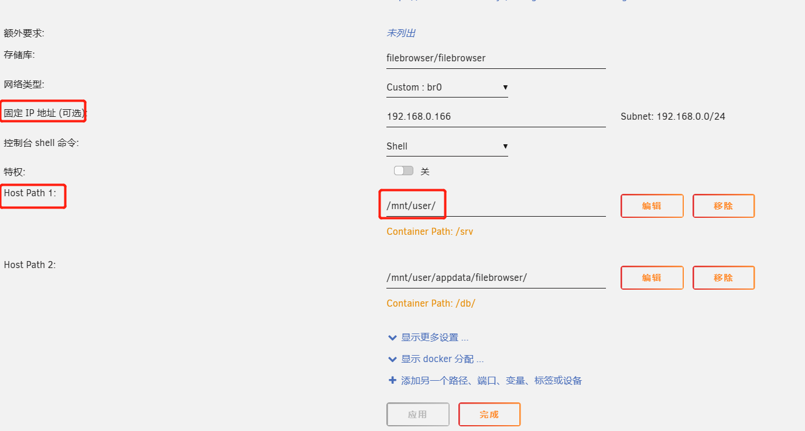

3. 安装好后，在docker界面点击FileBrowser容器图标，进入到webui管理界面。

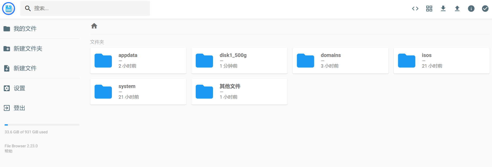

4. 在FileBrowser的设置选项中，可以设置简体中文。
5. 然后就可以进行文件管理了。

## 内网穿透：安装Zerotier docker容器

1. 直接在应用市场中搜索Zerotier
2. 安装Zerotier docker容器
3. 在docker配置页面，填写在Zerotier网站中你注册的NETWORK ID即可。点击应用，该docker容器会自动下载安装。
4. 登录Zerotier官网，把nas端设备添加到你的网络中即可。
5. 然后再浏览器中访问nas端设备分配到的ip地址，即可远程访问nas

注意设置自动启动
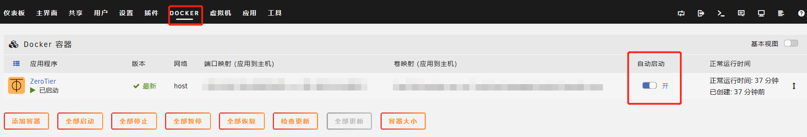

## 未分配硬盘管理：Unassigned Devices 插件

直接在应用市场中搜索Unassigned Devices，点击安装即可。

这个插件有两个功能：
1. 在主界面显示未分配的磁盘设备
2. 在主界面中可以添加局域网中的其他smb，nfs分享。

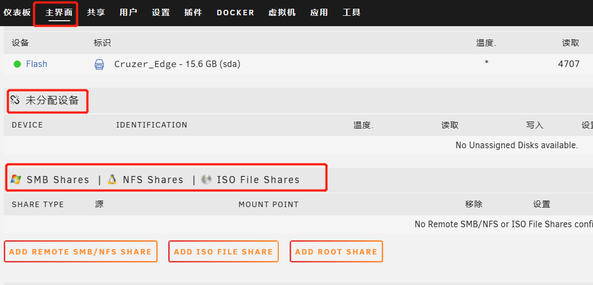


## 包管理工具：NerdTools 插件

Unraid 是基于 Slackware Linux 发行版进行定制的。Slackware Linux 不提供类似 apt 或者 yum 的包管理工具，当需要安装一些软件工具包时候就相对比较麻烦。

NerdTools插件可以简单的理解为一个比较粗糙的 Unraid 包管理工具。它可以帮你预编译好了相关软件包，只需要下载即可使用。

1. 在应用市场中搜索NerdTools
2. 选择 设置-》NerdTools。就能进入到NerdTools管理界面
3. 选择你要下载的工具包，点击下载即可使用。


## 显示主板、CPU传感器温度：Dynamix System Temperature插件

这个插件需要先安装perl工具包才能使用，但是6.11.x版本的unraid系统已经集成了perl工具包。所以直接在应用市场下载该插件即可。

1. 在应用市场下载该插件
1. 选择 设置-》System Temperature。就能进入到System Temperature管理界面
2. 点击检测驱动，保存，加载驱动
3. 选择处理器和主板的温度传感器。
4. 最后就可以在仪表板上看到cpu和主板的显示温度了。

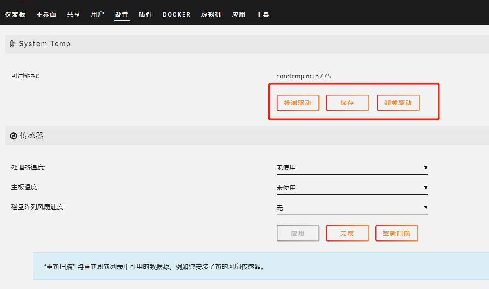

## 显示磁盘空间，读写速度和系统信息：Dynamix System Stats插件

1. 在应用市场下载该插件
2. 下载完后，刷新页面，可以看到出现了一个stats界面
3. stats界面会显示磁盘利用率和一些系统等信息

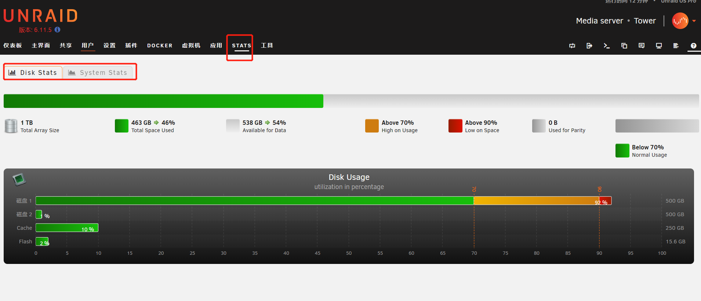

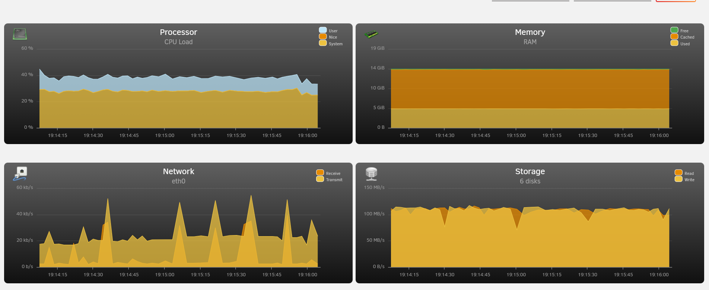

## 检查并修复问题：Fix Common Problems 插件

Fix Common Problems 插件可以检测我们unraid系统的设置是否有问题，并给出建议。

1. 安装插件
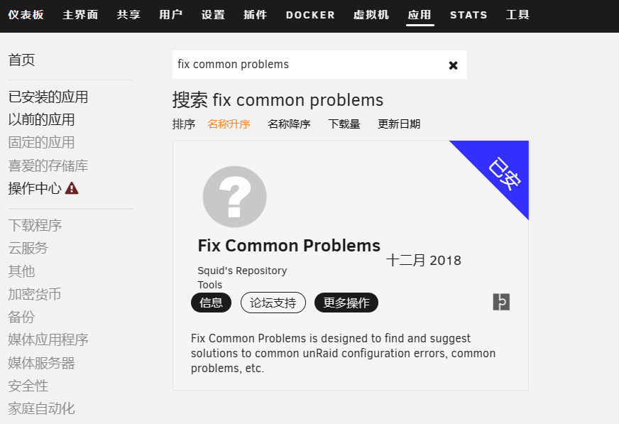
2. 插件界面-》选择Fix Common Problems 插件
3. 可以看到该插件显示的建议，中文翻译。
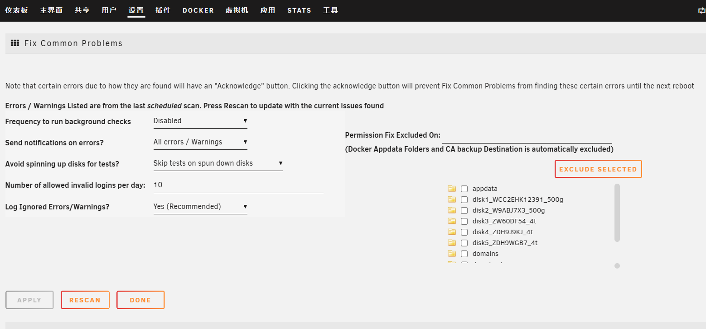
4. 对于插件给出的建议，可以自行选择是否采纳。

建议主要包括，unraid系统更新通知，插件更新通知，docker更新通知，磁盘阵列情况通知等。通知方式有浏览器通知或邮件通知等。


## 家庭影音服务器： jellyfin  docker容器

1. 在应用市场下载jellyfin
2. 安装linuxserver's Repository的jellyfin（纯净版）
3. 编辑jellyfin配置,把硬盘上的媒体数据映射到docker容器中。添加核心设备，用于硬解码。
4. 点击应用
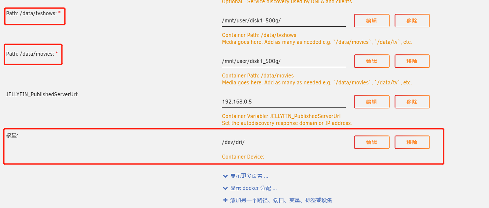

5. 进入webui界面，设置密码，添加媒体库。之后就可以在jellyfin上观看影音了。

### unraid开启核显 renderD128 驱动

1. 点击右上角终端。输入以下代码：`modprobe i915`
2. 检测是否开启核显：
   输入以下代码：`ls /dev/dri` 如果出现了 renderD128 表示开启核显成功。
3. 设置开机启动项，让每次开机就会自动加载核显驱动。

```
# 进入到该目录
cd /boot/config
# 编辑go配置文件 
vi go
# 添加核显到文件中
modprobe i915
# 退出并保存文件即可。
```

### 设置 Jellyfin 硬件加速

硬件加速功能需要unraid系统先开启核显驱动。

选择控制台-》播放-》按图中进行设置开启硬件加速功能。

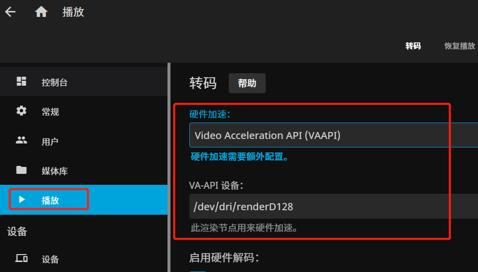


## BT下载工具：qBittorrent docker容器

qbittorrent是一款基于linux的标准BT下载工具。

1. 在应用市场搜索qBittorrent，选择linuxserver源的qBittorrent容器下载
2. 在容器配置页面配置端口，下载路径,网络类型选择host。之前选择bridge会导致qb界面无法访问。
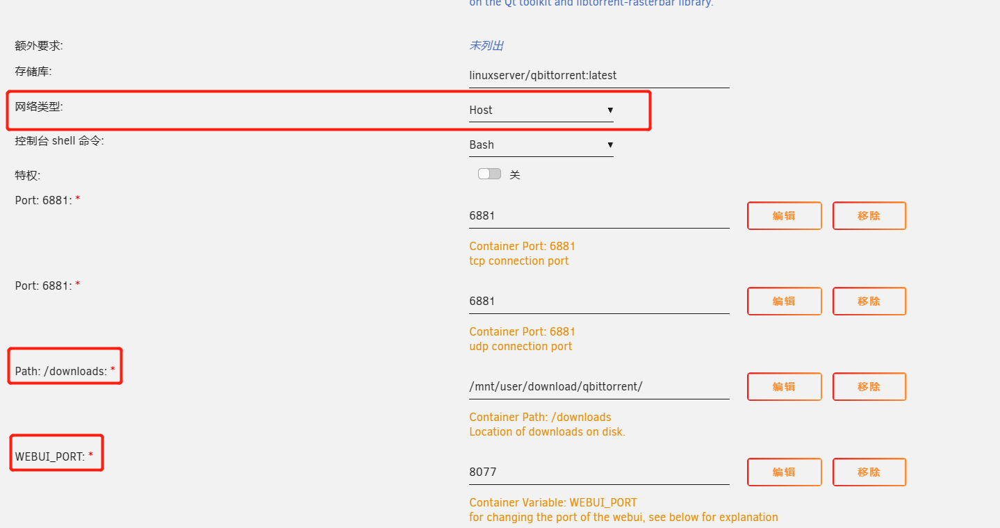
3. 访问qb界面，默认账户密码（admin/adminadmin）。
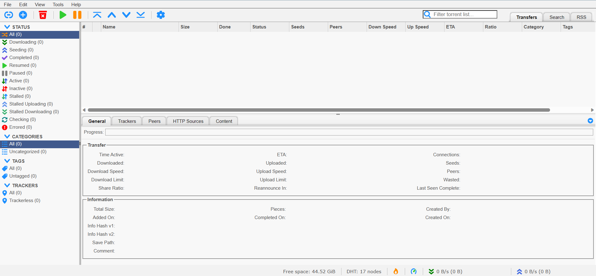
4. 具体用法自行百度

### qBittorrent设置中文

设置-》webui->语言选择中文

### qBittorrent 添加 trackers 优化下载速度

在 GitHub 中搜索 trackers list 获取列表，添加到 qBittorrent 中。trackers 是用来优化下载速度的，多多益善。

设置-》bitTorrent-》添加tracker。

## 影音信息刮削器：tinyMediaManager docker容器

tinyMediaManager能帮助我们下载电影电视剧的元数据到本地。例如电影的封面，字幕，剧情介绍等。

1. 在unraid应用市场搜索tinyMediaManager。
2. 安装官方版本的。
3. 进行docker配置。主要配置如图，注意：容器的网络类型要选择host。

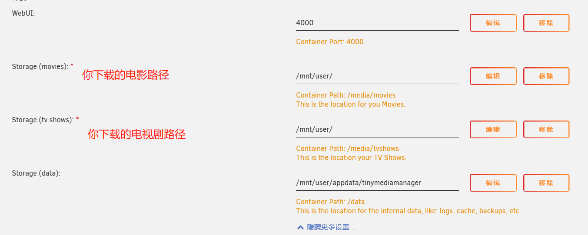

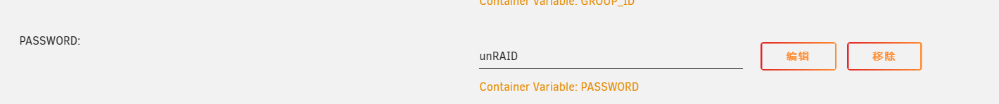

4. 运行容器。
5. 浏览器搜索网址，输入密码进入设置界面
6. 刚开始的电影电视剧文件夹的路径和元数据平台先不选。一路点击next
7. 点击设置-》语言选择为中文。然后重启容器
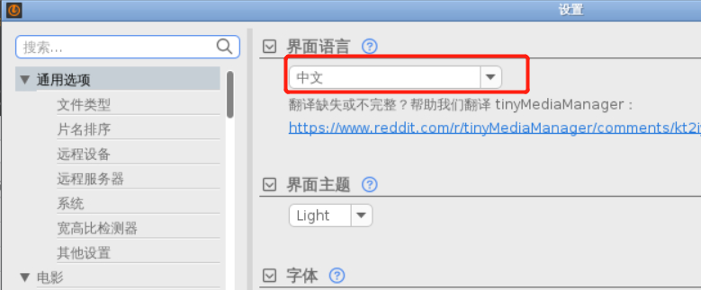
8. 设置-》电影-》媒体库。添加电影路径
9. 刮削器平台，主要选择TMDB。它支持中文比较好。
10. 刮削器选项：首先语言选择中文
11. 元数据默认设置：看情况选择。
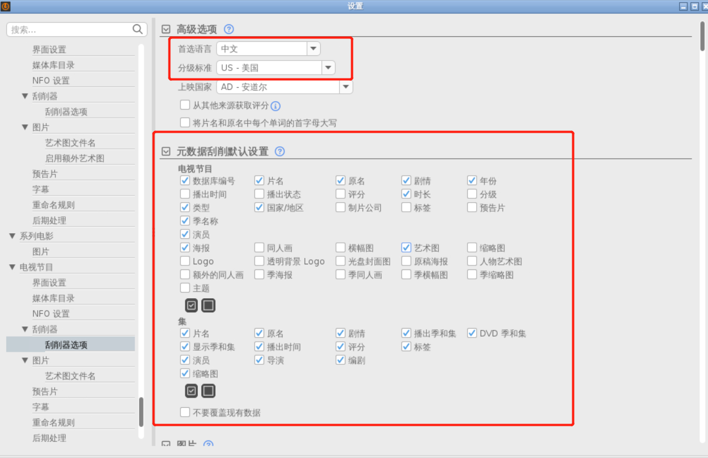
12. 设置好后，点击更新媒体库。就可以看到刮削的结果了。
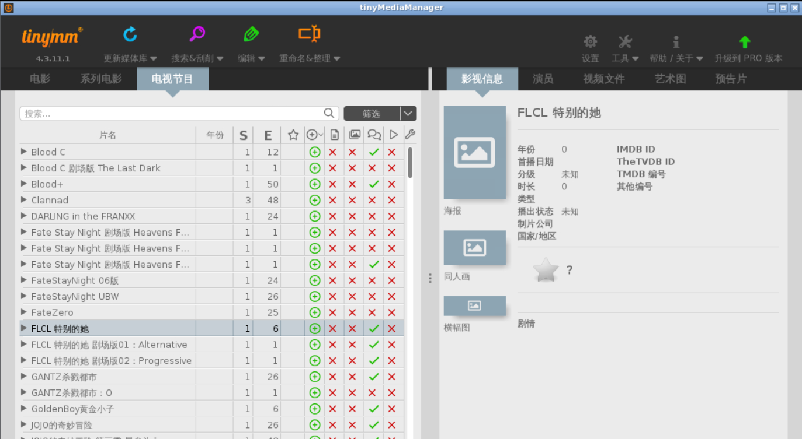
13. 其余用法自行查询。

### tinyMediaManager显示超时 刮削失败

当你使用tinyMediaManager刮削影音数据的时候，可能会超时连接失败。

解放方法：
1. 先修改容器的网络模式，修改为host模式(让容器使用unraid系统的网络)
2. 修改unraid的hosts文件，让tinyMediaManager连接上正确的网址。

/etc/hosts文件
```
# 具体的ip需要自行查询
13.227.219.97 api.themoviedb.org
18.164.130.112 api.thetvdb.com
```

## 配置文件编辑器：CA Config Editor 插件（该插件已被弃用）

CA Config Editor是一款可以编辑配置文件的编辑器插件，最常用的就是编辑U盘中的go文件，可以不需要命令行编辑。

该插件可以通过文件管理器FileBrower来实现相同功能。

## 显示GPU仪表盘：GPU Statistics 插件

这个插件可以显示GPU信息在仪表盘。

1. 先装 Intel-GPU-TOP 这个插件，目的就是开启 GPU，不用再输入脚本开启，什么都不用打开，然后再装 GPU Statistics插件。
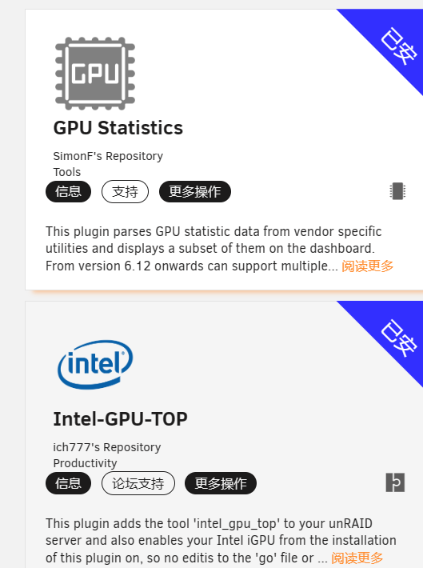

2. 对GPU Statistics插件进行设置，Intel-GPU-TOP 插件不需要进行设置。
3. 主要设置这两项。
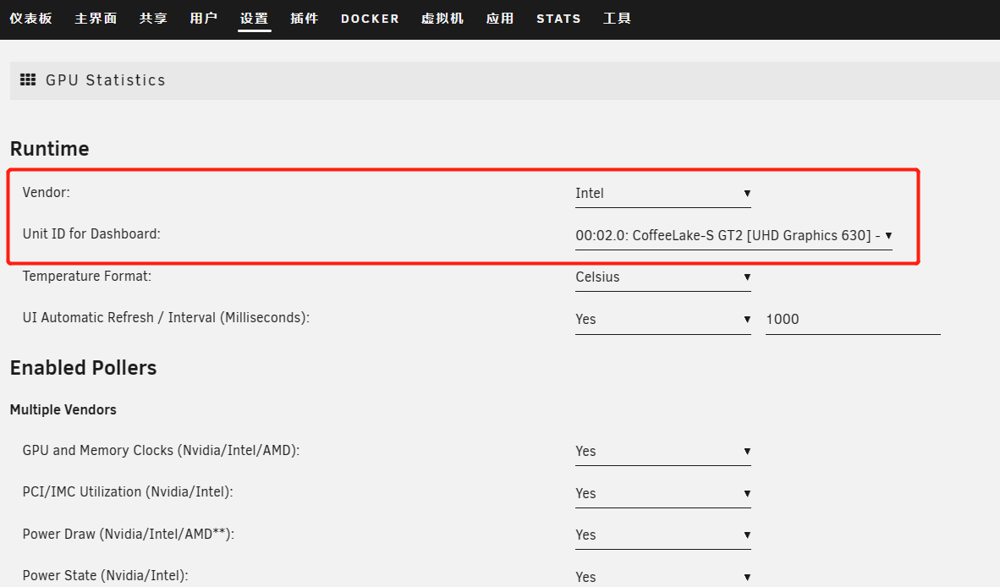
4. 设置好后，刷新仪表盘页面，就可以看到GPU信息了。
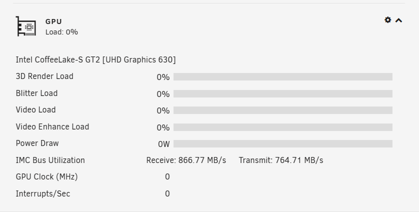


## 定时运行脚本：User Scripts脚本 插件

User Scripts插件可以自动运行一下脚本命令，比如emby的打开核显，定时开启某个docker应用或者虚拟机，又或者定时使用rsync进行数据备份。

1. 在应用市场搜索User Scripts并安装
   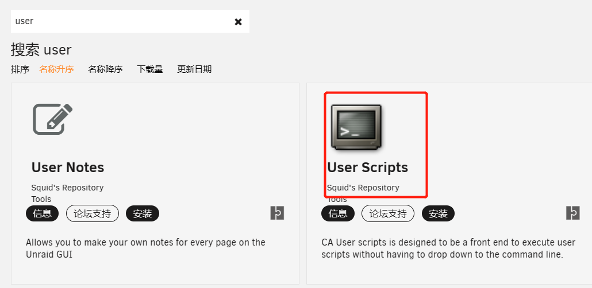
2. 在插件界面中找到User Scripts插件并点击，进入User Scripts页面。
3. 在页面中可以新建，删除，编辑，运行，后台运行脚本等功能
   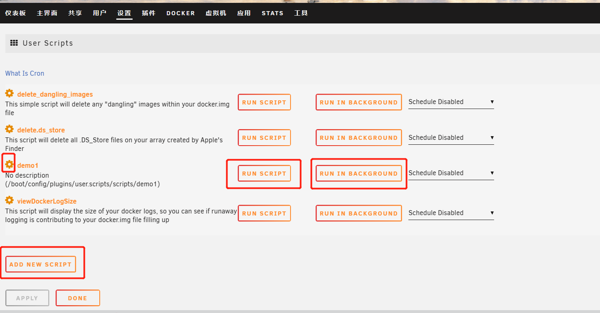
   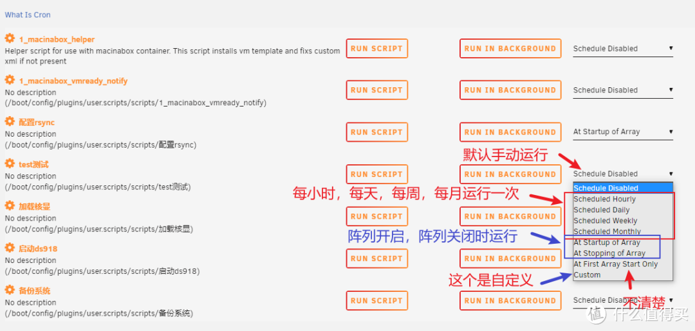
    自定义时间规则：分 时 天 月 周。例如: 50 11 * * 1 就是每周一11:50执行

4. 其他具体用法自行百度

### 开机添加DNS数据到hosts脚本中

由于UNRAID重启之后修改的host文件会被清空。因此使用User Scripts插件创建脚本每次开机自动运行添加dns数据到hosts中。

1. 创建脚本，脚本代码如下：
```bash
#!/bin/bash
echo "185.199.108.133 raw.github.com" >> /etc/hosts
```
2. 选择后台允许。运行规则选择：At First Array Start Only（第一次阵列启动时，就是每次重启系统时运行）


## 数据库： mariadb docker容器

1. 应用市场搜索mariadb，安装linuxserver的。
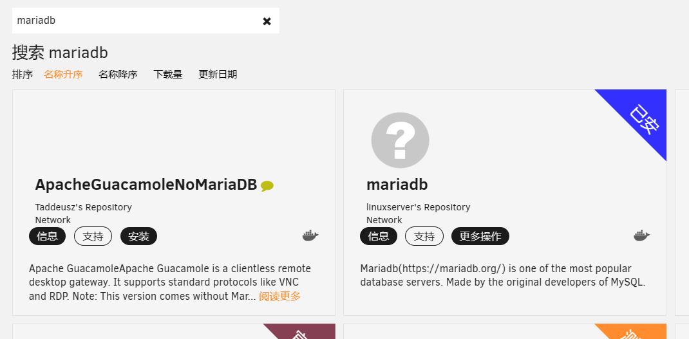
2. docker配置默认即可。默认密码可以点击编辑按钮看到默认值。
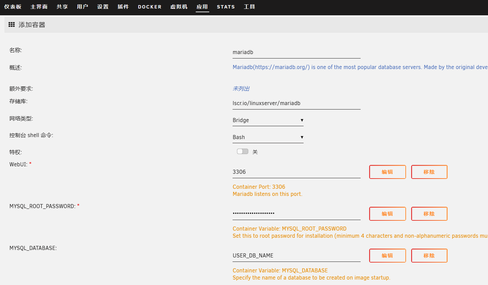
1. 安装好后，点击图标进入console控制台。
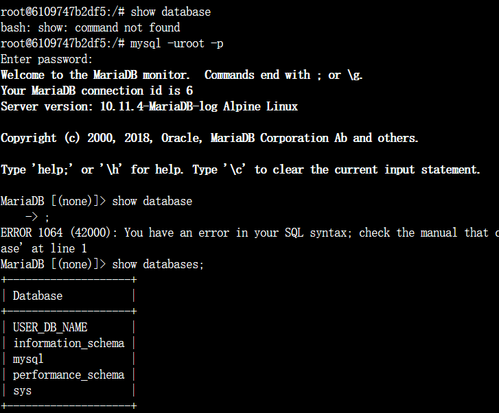
1. 更多用法请参考mysql

## 数据库图形化工具：Adminer docker容器

1. 应用市场搜索Adminer并安装
2. docker配置默认即可，端口换一个，以免占用。
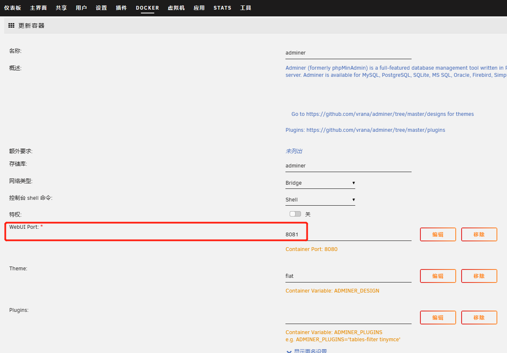
3. 点击图标，进入到webui界面。输入信息登录
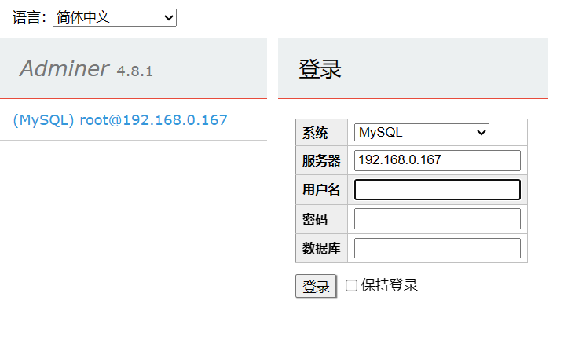
1. 登录后，就可以在ui界面上对库表进行增删改查等操作。
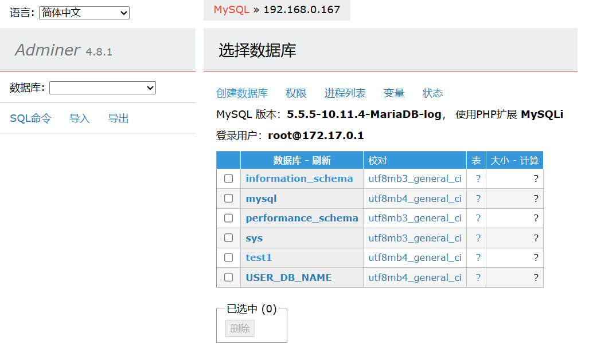

## 个人网盘：可道云 docker容器

可道云的docker镜像：kodcloud/kodbox
镜像地址：[https://hub.docker.com/r/kodcloud/kodbox](https://hub.docker.com/r/kodcloud/kodbox)


1. 因为应用市场没有可道云，所以直接创建docker容器安装。
2. 由于不是插件，因此需要手动添加映射端口和数据目录，并把webui的地址也填上。
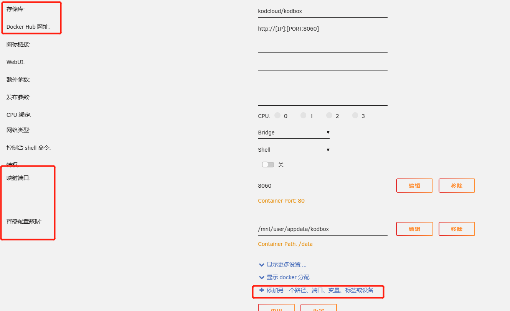
3. 输入webui网址。进行在线配置。
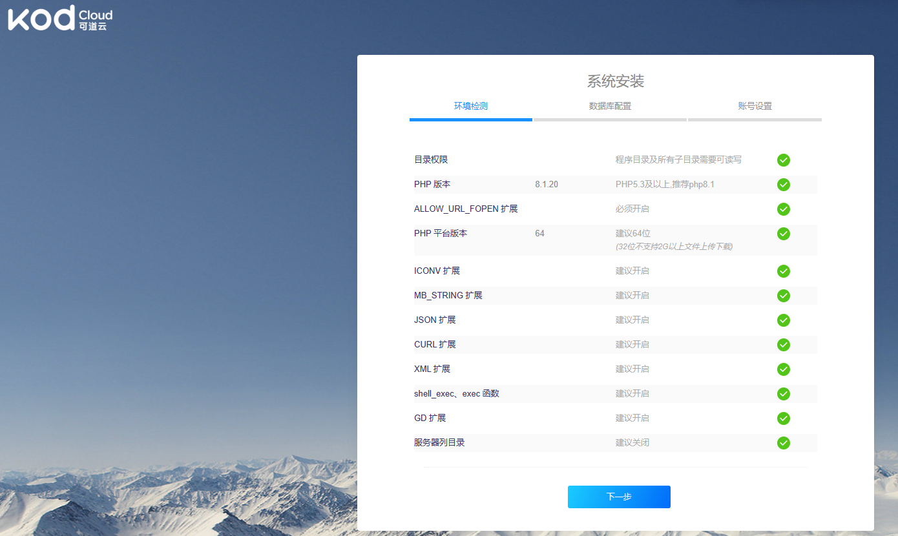
4. 可以使用自带的SQLite轻量数据库，自带的性能和稳定性都会差一点。也可以使用其他的数据库。注意：使用其他数据库需要先把kodbox数据库创建好。系统缓存使用自带的就行。
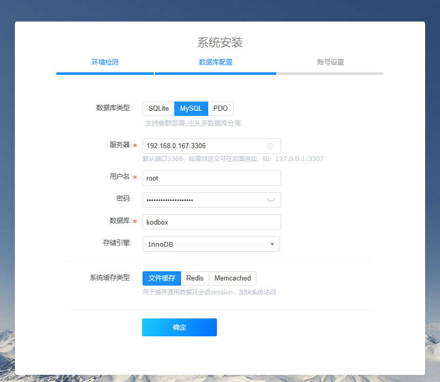
5. 设置账户密码。然后登录。
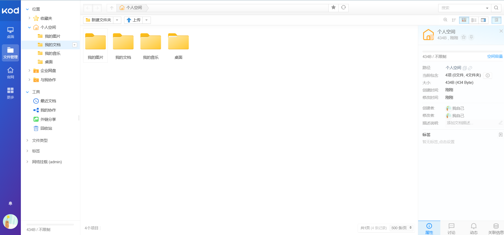

## 音乐播放器：navidrome docker容器

Navidrome 是一开源的音乐服务器，可以用来自建云端音乐播放器，让你在任何地方通过浏览器或者手机来收听自己的音乐。

1. 应用市场搜索并安装
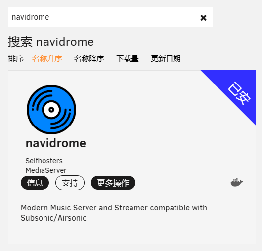
2. docker配置，指定存储音乐的路径，其余默认即可。
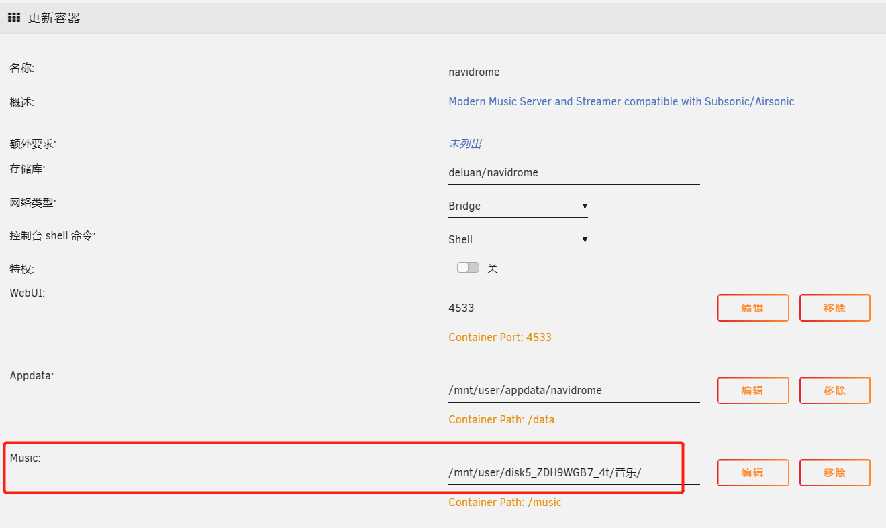
3. 安装运行后，访问网址，设置好账户密码。
4. 下图是navidrome界面，在设置中可以设置为中文。
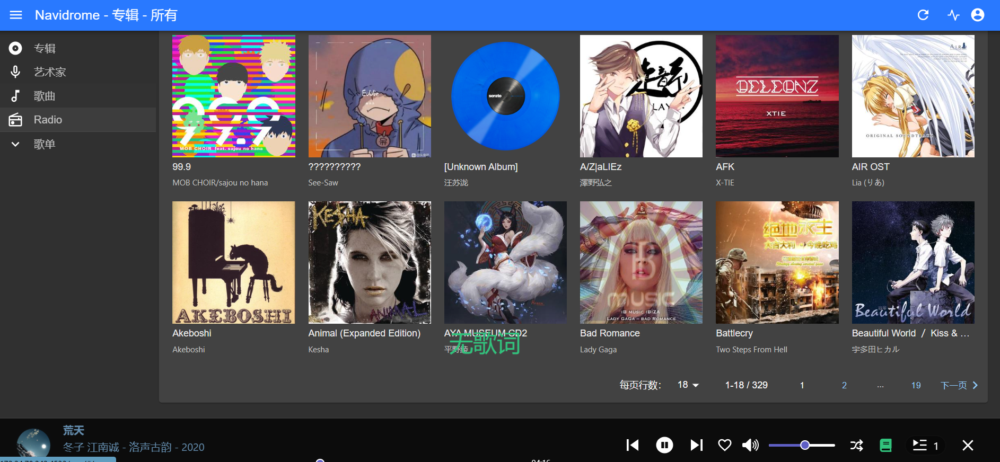