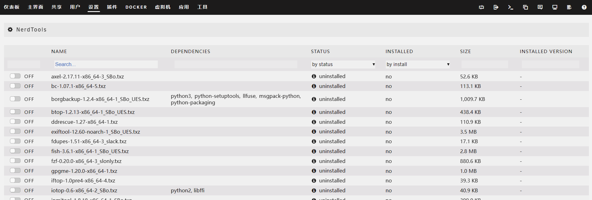

[toc]

# unraid笔记3-应用

unraid提供丰富的插件和docker容器作为应用可供选择，下面是我用到的一些。

## 网络加速：unraid modify插件

unraid modify插件可以修改unraid系统的hosts文件来加快Docker，应用市场的加载速度。

插件地址：`http://plg.unraid.site:8/plg/UNRAID_Modify.plg`

>如何安装插件？
插件界面->安装插件-》输入插件地址-》点击安装按钮

## 应用市场：Community Applications 插件   

你只有安装了应用市场插件,才能下载其余的插件.

插件地址：`https://raw.githubusercontent.com/Squidly271/community.applications/master/plugins/community.applications.plg`

## 简体中文插件

1. 当安装好应用市场插件后,在应用界面搜索简体中文插件安装.
2. 插件安装成功后，设置界面->显示设置->语言选择简体中文即可.
3. 浏览器刷新页面,就会显示中文界面了.


## 文件管理：Dynamix File Manager 插件

Unraid 默认并没有带文件管理器，而是以插件的形式提供给用户来安装，可以在 Unraid 的应用中心搜索 Dynamix File Manager 进行安装。

安装之后，会在 Unraid 的右上角多出一个文件管理器图标。


点击之后，就可以进入文件管理界面了。


基本的文件管理功能都有，可以满足绝大部分需求。

## 文件管理：FileBrowser docker容器

如果Dynamix File Manager插件不够好用，或者不够好看。那么可以试试这款简洁轻量易用的第三方管理器 - FileBrowser。

1. 在应用市场搜索FileBrowser。找到下载量多的那个安装。
2. 容器配置
    1. HostPath1配置修改为/mnt/user，共享文件夹基本上都存放在这个目录中。
    2. 把webui界面的IP地址修改为固定ip。
    3. HostPath2和其余配置默认。


3. 安装好后，在docker界面点击FileBrowser容器图标，进入到webui管理界面。


4. 在FileBrowser的设置选项中，可以设置简体中文。
5. 然后就可以进行文件管理了。

## 内网穿透：安装Zerotier docker容器

1. 直接在应用市场中搜索Zerotier
2. 安装Zerotier docker容器
3. 在docker配置页面，填写在Zerotier网站中你注册的NETWORK ID即可。点击应用，该docker容器会自动下载安装。
4. 登录Zerotier官网，把nas端设备添加到你的网络中即可。
5. 然后再浏览器中访问nas端设备分配到的ip地址，即可远程访问nas

注意设置自动启动


## 未分配硬盘管理：Unassigned Devices 插件

直接在应用市场中搜索Unassigned Devices，点击安装即可。

这个插件有两个功能：
1. 在主界面显示未分配的磁盘设备
2. 在主界面中可以添加局域网中的其他smb，nfs分享。


## 包管理工具：NerdTools 插件

Unraid 是基于 Slackware Linux 发行版进行定制的。Slackware Linux 不提供类似 apt 或者 yum 的包管理工具，当需要安装一些软件工具包时候就相对比较麻烦。

NerdTools插件可以简单的理解为一个比较粗糙的 Unraid 包管理工具。它可以帮你预编译好了相关软件包，只需要下载即可使用。

1. 在应用市场中搜索NerdTools
2. 选择 设置-》NerdTools。就能进入到NerdTools管理界面
3. 选择你要下载的工具包，点击下载即可使用。



## 显示主板、CPU传感器温度：Dynamix System Temperature插件

这个插件需要先安装perl工具包才能使用，但是6.11.x版本的unraid系统已经集成了perl工具包。所以直接在应用市场下载该插件即可。

1. 在应用市场下载该插件
1. 选择 设置-》System Temperature。就能进入到System Temperature管理界面
2. 点击检测驱动，保存，加载驱动
3. 选择处理器和主板的温度传感器。
4. 最后就可以在仪表板上看到cpu和主板的显示温度了。


## 显示磁盘空间，读写速度和系统信息：Dynamix System Stats插件

1. 在应用市场下载该插件
2. 下载完后，刷新页面，可以看到出现了一个stats界面
3. stats界面会显示磁盘利用率和一些系统等信息


## 家庭影音服务器： jellyfin  docker容器

1. 在应用市场下载jellyfin
2. 安装linuxserver's Repository的jellyfin（纯净版）
3. 编辑jellyfin配置,把硬盘上的媒体数据映射到docker容器中。添加核心设备，用于硬解码。
4. 点击应用


5. 进入webui界面，设置密码，添加媒体库。之后就可以在jellyfin上观看影音了。

### unraid开启核显 renderD128 驱动

1. 点击右上角终端。输入以下代码：`modprobe i915`
2. 检测是否开启核显：
   输入以下代码：`ls /dev/dri` 如果出现了 renderD128 表示开启核显成功。
3. 设置开机启动项，让每次开机就会自动加载核显驱动。

```
# 进入到该目录
cd /boot/config
# 编辑go配置文件 
vi go
# 添加核显到文件中
modprobe i915
# 退出并保存文件即可。
```

### 设置 Jellyfin 硬件加速

硬件加速功能需要unraid系统先开启核显驱动。

选择控制台-》播放-》按图中进行设置开启硬件加速功能。


