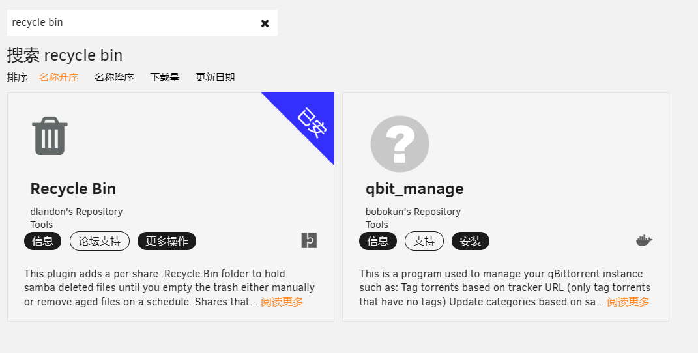
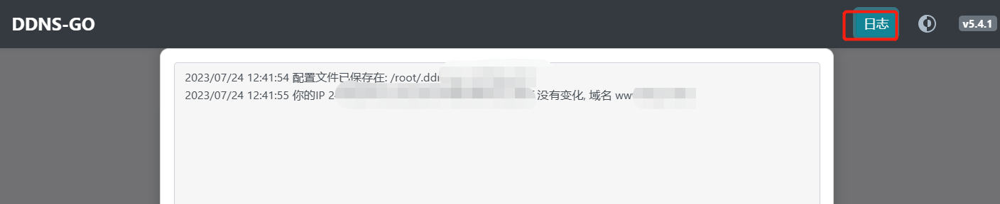

[toc]

# unraid笔记3-应用

unraid提供丰富的插件和docker容器作为应用可供选择，下面是我用到的一些。

* 20230729补充：在给docker容器选中映射端口的时候，端口号最好选中10000以上的号码。

## 网络加速：unraid modify插件

unraid modify插件可以修改unraid系统的hosts文件来加快Docker，应用市场的加载速度。

插件地址：`http://plg.unraid.site:8/plg/UNRAID_Modify.plg`

>如何安装插件？
插件界面->安装插件-》输入插件地址-》点击安装按钮

## 应用市场：Community Applications 插件   

你只有安装了应用市场插件,才能下载其余的插件.

插件地址：`https://raw.githubusercontent.com/Squidly271/community.applications/master/plugins/community.applications.plg`

## 简体中文插件

1. 当安装好应用市场插件后,在应用界面搜索简体中文插件安装.
2. 插件安装成功后，设置界面->显示设置->语言选择简体中文即可.
3. 浏览器刷新页面,就会显示中文界面了.


## 文件管理：Dynamix File Manager 插件

Unraid 默认并没有带文件管理器，而是以插件的形式提供给用户来安装，可以在 Unraid 的应用中心搜索 Dynamix File Manager 进行安装。

安装之后，会在 Unraid 的右上角多出一个文件管理器图标。


点击之后，就可以进入文件管理界面了。


基本的文件管理功能都有，可以满足绝大部分需求。

## ★★★神器 文件管理：FileBrowser docker容器

如果Dynamix File Manager插件不够好用，或者不够好看。那么可以试试这款简洁轻量易用的第三方管理器 - FileBrowser。

1. 在应用市场搜索FileBrowser。找到下载量多的那个安装。
2. 容器配置
    1. 首先将网络类型改为bridge桥接。
    2. /srv是管理目录，修改为/mnt/user，共享文件夹基本上都存放在这个目录中。
    3. /db/是配置目录，修改为/mnt/user/appdata/filebrowser/
    4. 添加映射端口，主机端口为8083，容器端口为80。


3. 安装好后，访问ip+8083端口，进入到管理界面。初始密码为admin/admin


4. 在FileBrowser的设置选项中，可以设置简体中文，修改登录密码。
5. FileBrowser显示的文件就是/mnt/user下的文件。如果想让FileBrowser管理更多的文件，需要重新映射管理目录即可。
6. 之后就可以开始进行文件管理了。

## 内网穿透：安装Zerotier docker容器

1. 直接在应用市场中搜索Zerotier
2. 安装Zerotier docker容器
3. 在docker配置页面，填写在Zerotier网站中你注册的NETWORK ID即可。点击应用，该docker容器会自动下载安装。
4. 登录Zerotier官网，把nas端设备添加到你的网络中即可。
5. 然后再浏览器中访问nas端设备分配到的ip地址，即可远程访问nas

注意设置自动启动


## 未分配硬盘管理：Unassigned Devices 插件

直接在应用市场中搜索Unassigned Devices，点击安装即可。

这个插件有两个功能：
1. 在主界面显示未分配的磁盘设备
2. 在主界面中可以添加局域网中的其他smb，nfs分享。


## 包管理工具：NerdTools 插件

Unraid 是基于 Slackware Linux 发行版进行定制的。Slackware Linux 不提供类似 apt 或者 yum 的包管理工具，当需要安装一些软件工具包时候就相对比较麻烦。

NerdTools插件可以简单的理解为一个比较粗糙的 Unraid 包管理工具。它可以帮你预编译好了相关软件包，只需要下载即可使用。

1. 在应用市场中搜索NerdTools
2. 选择 设置-》NerdTools。就能进入到NerdTools管理界面
3. 选择你要下载的工具包，点击下载即可使用。


## 显示主板、CPU传感器温度：Dynamix System Temperature插件

这个插件需要先安装perl工具包才能使用，但是6.11.x版本的unraid系统已经集成了perl工具包。所以直接在应用市场下载该插件即可。

1. 在应用市场下载该插件
1. 选择 设置-》System Temperature。就能进入到System Temperature管理界面
2. 点击检测驱动，保存，加载驱动
3. 选择处理器和主板的温度传感器。
4. 最后就可以在仪表板上看到cpu和主板的显示温度了。


## 显示磁盘空间，读写速度和系统信息：Dynamix System Stats插件

1. 在应用市场下载该插件
2. 下载完后，刷新页面，可以看到出现了一个stats界面
3. stats界面会显示磁盘利用率和一些系统等信息


## 检查并修复问题：Fix Common Problems 插件

Fix Common Problems 插件可以检测我们unraid系统的设置是否有问题，并给出建议。

1. 安装插件

2. 插件界面-》选择Fix Common Problems 插件
3. 可以看到该插件显示的建议，中文翻译。

4. 对于插件给出的建议，可以自行选择是否采纳。

建议主要包括，unraid系统更新通知，插件更新通知，docker更新通知，磁盘阵列情况通知等。通知方式有浏览器通知或邮件通知等。


## 家庭影音服务器： jellyfin  docker容器

1. 在应用市场下载jellyfin
2. 安装linuxserver's Repository的jellyfin（纯净版）
3. 编辑jellyfin配置,把硬盘上的媒体数据映射到docker容器中。添加核心设备，用于硬解码。
4. 点击应用


5. 进入webui界面，设置密码，添加媒体库。之后就可以在jellyfin上观看影音了。

### unraid开启核显 renderD128 驱动

1. 点击右上角终端。输入以下代码：`modprobe i915`
2. 检测是否开启核显：
   输入以下代码：`ls /dev/dri` 如果出现了 renderD128 表示开启核显成功。
3. 设置开机启动项，让每次开机就会自动加载核显驱动。

```
# 进入到该目录
cd /boot/config
# 编辑go配置文件 
vi go
# 添加核显到文件中
modprobe i915
# 退出并保存文件即可。
```

### 设置 Jellyfin 硬件加速

硬件加速功能需要unraid系统先开启核显驱动。

选择控制台-》播放-》按图中进行设置开启硬件加速功能。


### 解决中文字幕显示为方块的问题

问题：在播放视频的时候字幕中的汉字全是方块。

解决方式：为字幕添加中文备用字体。

1. 在Jellyfin容器挂载的config目录中，新建一个文件夹fonts。
2. 从网上下载Noto Sans SC woff2 字体包。从中找到NotoSansCJKsc-Medium.woff2 这个字体文件，复制到 fonts 目录中。
3. 在jellyfin 控制台-播放中设置启用备用字体。
4. 然后点击保存，保存该设置。


## BT下载工具：qBittorrent docker容器

qbittorrent是一款基于linux的标准BT下载工具。

1. 在应用市场搜索qBittorrent，选择linuxserver源的qBittorrent容器下载
2. 在容器配置页面配置端口，下载路径,网络类型选择host。之前选择bridge会导致qb界面无法访问。

3. 访问qb界面，默认账户密码（admin/adminadmin）。

4. 具体用法自行百度

### qBittorrent设置中文

设置-》webui->语言选择中文

### qBittorrent 添加 trackers 优化下载速度

在 GitHub 中搜索 trackers list 获取列表，添加到 qBittorrent 中。trackers 是用来优化下载速度的，多多益善。

设置-》bitTorrent-》添加tracker。

## 影音信息刮削器：tinyMediaManager docker容器

tinyMediaManager能帮助我们下载电影电视剧的元数据到本地。例如电影的封面，字幕，剧情介绍等。

1. 在unraid应用市场搜索tinyMediaManager。
2. 安装官方版本的。
3. 进行docker配置。主要配置如图，注意：容器的网络类型要选择host。


此处可以修改tmm的密码。


4. 运行容器。
5. 浏览器搜索网址，输入密码进入设置界面
6. 刚开始的电影电视剧文件夹的路径和元数据平台先不选。一路点击next
7. 点击设置-》语言选择为中文。然后重启容器

8. 设置-》电影-》媒体库。添加电影路径
9. 刮削器平台，主要选择TMDB。它支持中文比较好。
10. 刮削器选项：首先语言选择中文
11. 元数据默认设置：看情况选择。

12. 设置好后，点击更新媒体库。就可以看到刮削的结果了。

13. 其余用法自行查询。

### tinyMediaManager显示超时 刮削失败

当你使用tinyMediaManager刮削影音数据的时候，可能会超时连接失败。主要是因为网络问题，或则DNS问题。

解放方法：
1. 先修改容器的网络模式，修改为host模式(让容器使用unraid系统的网络)
2. 修改unraid的hosts文件，让tinyMediaManager连接上正确的网址。

/etc/hosts文件
```
# 具体的ip需要自行查询
13.227.219.97 api.themoviedb.org
18.164.130.112 api.thetvdb.com
```


## 配置文件编辑器：CA Config Editor 插件（该插件已被弃用）

CA Config Editor是一款可以编辑配置文件的编辑器插件，最常用的就是编辑U盘中的go文件，可以不需要命令行编辑。

该插件可以通过文件管理器FileBrower来实现相同功能。

## 显示GPU仪表盘：GPU Statistics 插件

这个插件可以显示GPU信息在仪表盘。

1. 先装 Intel-GPU-TOP 这个插件，目的就是开启 GPU，不用再输入脚本开启，什么都不用打开，然后再装 GPU Statistics插件。


2. 对GPU Statistics插件进行设置，Intel-GPU-TOP 插件不需要进行设置。
3. 主要设置这两项。

4. 设置好后，刷新仪表盘页面，就可以看到GPU信息了。


## 定时运行脚本：User Scripts脚本 插件

User Scripts插件可以自动运行一下脚本命令，比如emby的打开核显，定时开启某个docker应用或者虚拟机，又或者定时使用rsync进行数据备份。

1. 在应用市场搜索User Scripts并安装
   
2. 在插件界面中找到User Scripts插件并点击，进入User Scripts页面。
3. 在页面中可以新建，删除，编辑，运行，后台运行脚本等功能
   
   
    自定义时间规则：分 时 天 月 周。例如: 50 11 * * 1 就是每周一11:50执行

4. 其他具体用法自行百度

### 开机添加DNS数据到hosts脚本中

<font color="red">该脚本已被unraid modify插件替代。unraid modify插件也可以实现更新hosts脚本的功能</font>

由于UNRAID重启之后修改的host文件会被清空。因此使用User Scripts插件创建脚本每次开机自动运行添加dns数据到hosts中。

1. 创建脚本，脚本代码如下：
```bash
#!/bin/bash
echo "185.199.108.133 raw.github.com" >> /etc/hosts
```
2. 选择后台允许。运行规则选择：At First Array Start Only（第一次阵列启动时，就是每次重启系统时运行）

### 统计和同步共享文件夹中的资源

1. 创建脚本，脚本代码如下

```bash
#!/bin/bash

# 同步思路
# 1. 每个磁盘都有一个同步目录，其中disk5_ZDH9WGB7_4t磁盘中的是主同步目录，其余几个磁盘中的是分同步目录
# 2. 用rsync命令将主同步目录中的文件，复制到分同步目录中
# 3. 每周运行一次

# 整理资源名称文本思路
# 1. 用tree命令打印所有共享文件夹中的目录或文件名称，将打印内容整理为一个资源文本中。
# 2. 该文本用于整理收集到的资源，方便后期磁盘损毁后，可以根据文本内容重新下载一份。
# 3. 资源文本存储在主同步目录中
# 4. 每周运行一次

# 主同步目录路径
mainFilePath=/mnt/user/disk5_ZDH9WGB7_4t/主同步/

# 分同步目录路径数组
brancheFilePaths=(
/mnt/user/disk1_WCC2EHK12391_500g/分同步
/mnt/user/disk2_W9ABJ7X3_500g/分同步
/mnt/user/disk3_ZW60DF54_4t/分同步
/mnt/user/disk4_ZDH9J9KJ_4t/分同步
)

# 资源文本路径
resourceListFilePath=/mnt/user/disk5_ZDH9WGB7_4t/主同步/resourceList/$(date +%Y-%m-%d).txt

# 创建资源文本
createFile(){
    echo ========== `date` ========== START  > $resourceListFilePath
    tree -N -L 3 /mnt/user/ >> $resourceListFilePath
    echo ========== `date` ==========  END   >> $resourceListFilePath
}

# 同步方法
syncFile(){
    echo "==========开始同步到 $1" 
    rsync -a $mainFilePath $1
    echo "==========结束同步"
}

# 脚本运行入口处===========================================

# 1.先执行创建资源文本方法
createFile

# 2.执行for循环，遍历数组，每次调用syncFile方法并传递数组参数给syncFile方法
for i in ${brancheFilePaths[*]}
do
    syncFile $i
done

```

2. 选择后台允许。运行规则选择：Scheduled Weekly（每周运行一次）


该脚本有两个功能：
* 统计共享文件夹中所有资源目录的名称。记录到一个txt中，用来防止后期数据丢失后，在重新下载回来。
* 将磁盘5中的主同步目录中的文件，同步到其他磁盘的分同步目录中。用来对重要数据文件进行备份。防止一个磁盘损毁后，数据文件还能从其他磁盘中找回。


## 数据库： mariadb docker容器

1. 应用市场搜索mariadb，安装linuxserver的。

2. docker配置默认即可。默认密码可以点击编辑按钮看到默认值。

1. 安装好后，点击图标进入console控制台。

1. 更多用法请参考mysql

## 数据库图形化工具：Adminer docker容器

1. 应用市场搜索Adminer并安装
2. docker配置默认即可，端口换一个，以免占用。

3. 点击图标，进入到webui界面。输入信息登录

1. 登录后，就可以在ui界面上对库表进行增删改查等操作。


## 音乐播放器：navidrome docker容器

Navidrome 是一开源的音乐服务器，可以用来自建云端音乐播放器，让你在任何地方通过浏览器或者手机来收听自己的音乐。

1. 应用市场搜索并安装

2. docker配置，指定存储音乐的路径，其余默认即可。

3. 安装运行后，访问网址，设置好账户密码。
4. 下图是navidrome界面，在设置中可以设置为中文。


## ★★★神器 个人网盘：可道云 docker容器

可道云的dockerhub镜像：kodcloud/kodbox
镜像地址：[https://hub.docker.com/r/kodcloud/kodbox](https://hub.docker.com/r/kodcloud/kodbox)

1. 因为应用市场没有可道云，所以直接创建docker容器安装。
2. 由于不是插件，因此需要手动添加映射端口和数据目录，图中可以把webui的地址也填上。

3. 输入webui网址。进行在线配置。

4. 可以使用自带的SQLite轻量数据库，自带的性能和稳定性都会差一点。也可以使用其他的数据库。
   - 个人使用的话，数据库和系统缓存直接默认自带的即可。企业使用才需要特别配置。
   - 使用mysql数据库需要先在mysql中把kodbox数据库创建好。


1. 设置账户密码。然后登录。


### 通过可道云进行文件管理

由于unraid的文件管理很垃圾，我们也可以通过可道云来帮助我们进行文件管理。

可道云功能如下：
- 可以直接通过拖拽的方式来上传下载文件。
- 可以直接播放音乐，视频。
- 可以直接打开word文档等文件

1. 编辑可道云docker配置，新增一个路径映射。

主机路径：/mnt/user。 /mnt/user是unraid系统中所有共享文件夹的父目录。

容器路径：/myData。随便起个名字。


2. 重启docker容器。输入网页登录。可以看到刚刚映射的目录。

3. 进入目录，可以看到unraid系统的所有共享文件夹。

4. 我们可以直接上传下载文件到某个共享文件夹中，也可以直接播放音乐视频，也可以在线编辑文本文档等。


## 定时任务脚本工具：青龙面板 docker容器

青龙面板是定时任务脚本管理工具，可以通过青龙面板管理定时任务脚本。

1. 应用市场搜索qinglong,安装青龙面板
2. docker配置默认即可。
3. 安装后，根据端口访问青龙面板页面

<font color="red">
后续青龙面板用法参考《群晖docker安装青龙面板》这篇文章。
</font>

## 照片管理工具：PhotoPrism docker容器

PhotoPrism 是一个开源的照片管理工具，是一款 AI 驱动的应用程序，用于浏览、组织和分享您的照片集。

1. 在应用市场搜索PhotoPrism,安装PhotoPrism
2. docker配置如图，设置相册映射路径和密码，其他配置默认即可。


3. 安装后，访问相册页面。账户默认是admin,密码是之前设置的。

4. 登录后，可以在设置中将语言改为简体中文。
5. 然后再资料库中进行扫描，就可以看到照片了。


## 文件同步：Resilio Sync docker容器

[Resilio Sync官网](https://www.resilio.com/)

Resilio Sync是由Resilio推出的全平台文件同步产品。其有手机端，电脑端，NAS端应用。可以在多个设备之间互相同步文件数据。

1. 在应用市场搜索resilio sync ,安装resilio-sync 


2. docker配置如图,主要配置缓存目录和同步目录的路径


3. 安装后，访问Resilio Sync 页面。设置一个账户密码。

4. 选中sync-home 家用版本

5. 然后给当前的设备取个名字。

6. 之后就可以进入到主页面了


具体的使用方法自行百度。


## 回收站： recycle bin 插件

这个插件主要是为了避免误删重要文件。使用这个插件删除文件操作，并不会直接删除文件，而是将文件移到垃圾箱（“.Recycle.Bin”文件夹）。用户可以设置定时清空垃圾箱操作。

1. 在应用市场搜索recycle bin,安装recycle bin

2. 在插件页面，双击该插件，进入到插件设置界面

3. 设置后，回收站就生效了。

## 漫画阅读：komga漫画库 docker容器

komga漫画库 使用 gotson/komga 这个镜像，功能强大，它不仅可以看漫画，更适合看杂志、电子书等。

1. 在应用市场搜索komga,安装komga

2. docker配置。主要是端口和漫画目录。配置目录默认存储在appdata中。

3. 安装后，访问ip端口。进入管理界面。

4. 设置账号密码（账号是邮箱）。
5. 进入后，添加库，然后等待漫画加载。docker映射的目录在books目录中


6. 之后就可以使用kogma阅读漫画了。

## DDNS解析工具： ddns-go docker容器

由于家用宽带普及了公网ipv6，但是公网ipv6的确实不断变换的，动态的。因此需要DDNS将动态公网ipv6与域名进行绑定。

DDNS:动态域名解析。DDNS系统是将主机的动态IP地址映射到一个固定的域名解析服务上，用户每次连接网络时，DDNS程序把该主机的动态IP地址传送给域名服务商，从而实现动态域名解析。

ddns-go这个工具，可用自动获得你的服务器上的公网 IPv4 或 IPv6 地址，解析到对应的域名服务上。

ddns-go支持的域名服务商有 Alidns(阿里云) Dnspod(腾讯云) Cloudflare 华为云 Callback 百度云等。

ddns-go的dockerhub镜像：jeessy/ddns-go
镜像地址：[https://hub.docker.com/r/jeessy/ddns-go](https://hub.docker.com/r/jeessy/ddns-go)

1. 因为unraid应用市场没有ddns-go，所以创建docker容器安装。
2. 由于不是插件，因此需要手动映射端口和配置目录，图中可以把webui的地址也填上。


* 一个是界面访问端口
* 另一个是配置文件的路径。

3. 点击应用。创建完容器后，访问webui地址。开始进行ddns-go的配置。


4. 首先配置账户密码，公网访问。


* 公网访问：ddns-go默认只能通过内网访问。取消后，就可以通过公网访问。
* 默认没有账户密码。设置后，下次登录需要账户密码。

### 腾讯云购买域名并添加DDNS解析

1. 在腾讯云上购买一个想要的域名。
2. 购买后可在我的域名上查询域名。


3. 然后点击解析。开始将域名和自己主机的公网ip进行绑定。
4. 点击添加记录，添加一条解析记录。


* @表示直接解析主域名。例如 aaa.xyz
* www是子域名的名称，例如 www.aaa.xyz
* 最下面的解析记录用于申请SSL证书的时候用到的。当申请SSL证书成功后，可以删除。
* 记录值就是你当前主机的公网ip地址。
* 多个记录可以填同一个公网ip，无非是不用的域名都对应同一个公网ip而已。

5. 当解析记录添加成功后，等一会。然后ping域名。当ping域名成功之后，若能ping通，则表示解析成功。

```bash
ping 域名
## 例如
ping www.aaa.xyz
ping aaa.xyz
```

### DDNS-go设置DDNS动态域名解析

目前域名与公网ip通过DNSpod绑定在了一起，但是由于公网ip是动态的，因此还需要将DNSpod与ddns-go绑定在一起。

ddns-go动态域名解析过程：
```
ddns-go通过网卡等形式获取到主机的公网ip地址-》然后将公网ip发送到DNSpod上-》DNSpod获取到公网ip地址，更新域名解析记录。-》从而最新的公网ip与域名始终绑定在一起。
```

1. 在设置之前，需要在DNSpod上创建API密钥。选择我的账户-》API密钥-》DNSpod token-》创建密钥

2. 在ddns-go上选择域名解析商。输入刚刚创建的id和token。点击保存。


* 由于我是在腾讯云旗下的DNSpod上添加域名解析记录的。因此在ddns-go上选择的域名解析商也要是DNSpod。
* 当保存id和token后，ddns-go就可以通过API密钥来修改dnspod中的域名解析记录。

3. 进行ipv6设置，输入自己想动态解析的域名。将域名和动态ip绑定


* 例如域名这这处填写为www.aaa.xyz。那么当ddns-go获取到最新的公网ipv6的时候，则会更新dnspod中www.aaa.xyz解析记录的公网ip,而不会更新其他子域名记录上的公网ip
* 因此建议这个的域名设置最好和dnspod上的记录一一对应起来。

4. 当都设置好后，可以查询日志。来判断ddns是否成功。

5. 并且你也可以通过重启主机，让主机获得新的ipv6。查看dnspod中的公网ip是不是最新的ip。从而判断ddns-go是否完成了ddns域名解析工作。


### DDNS-go ipv6无法读取出网卡。

当你的DDNS-go在ipv6选项中无法读取网卡时，你可以将docker的网络类型从bridge桥接，改为host连接试试。


## 定时签到工具：qiandao docker容器

qiandao 是 一个 基于 HAR 编辑器和 Tornado 服务端的 HTTP 定时任务自动执行 Web 框架。

qiandao官方网站 [https://qd-today.github.io/qd/zh_CN/](https://qd-today.github.io/qd/zh_CN/)   

qiandao的dockerhub镜像：asdaragon/qiandao

docker镜像地址：[https://hub.docker.com/r/asdaragon/qiandao](https://hub.docker.com/r/asdaragon/qiandao)
 

1. 因为unraid应用市场没有qiandao，所以需要创建docker容器安装。
2. 开始配置，手动映射端口和配置目录和webui地址。


* 映射端口，容器内端口80，主机端口38923
* 映射配置目录，如图所示。
* webui地址：`http://[IP]:[PORT:38923]`

3. 点击创建完容器后，访问webui地址。开始进行使用。需要先注册账户。


4. 具体用法，自行百度。


## 直播推流工具：KPlayer docker容器

KPlayer是由ByteLang Studio设计开发的一款用于在Linux环境下进行媒体资源推流的应用程序。目前kplayer没有UI界面。

KPlayer官方网站 [https://docs.kplayer.net/v0.5.8/](https://docs.kplayer.net/v0.5.8/)   

KPlayer的dockerhub镜像：bytelang/kplayer

docker镜像地址：[https://hub.docker.com/r/bytelang/kplayer](https://hub.docker.com/r/bytelang/kplayer)
 

1. 因为unraid应用市场没有kplayer，所以需要创建docker容器安装。
2. 开始配置，手动配置映射目录。一个是配置目录，一个是视频目录。


3. 创建完容器后，在主机上找到你映射的配置目录路径，手动创建配置文件config.json。


具体的config.json配置文件如何编写，需要参考官方文档。

下面是最简化的config.json
```json
{
    "version": "2.0.0",
    //这里是需要直播的影视文件
    "resource": {
        "lists": [
            "/video/侏罗纪公园1/侏罗纪公园1.mkv"
        ]
    },
    //播放模式为循环播放
    "play": {
        "play_model": "loop"
    },
    //设置直播间推流的链接地址
    "output": {
        "lists": [
            {
                "path": "rtmp://xxx.xxx.com/live-bvc/?streamname=xxxxx"
            }
        ]
    }
}
```

`/video/侏罗纪公园1/侏罗纪公园1.mkv`是容器内的路径，对应的容器外路径就是`/mnt/user/disk5_ZDH9WGB7_4t/电影/侏罗纪公园1/侏罗纪公园1.mkv`

> 如何获取直播间的推流链接。

以B站直播为例。打开直播中心，直播间管理，选择你想要的分类就开始直播。然后就会有一个rtm链接和串流密钥链接，把这两个链接拼接起来就是你的推流链接了。

4. config.json文件编辑好后，开始运行kplayer容器。然后看你的直播间是否播放视频即可。
