[toc]

# unraid笔记5-共享文件夹

[转载文章：小刻也能看懂的Unraid系统使用手册](https://www.cnblogs.com/frozensky-alpha/p/15013572.html)

为了使用磁盘所组成的庞大存储空间，需要使用 Shares 共享（共享文件夹）功能。创建 Shares 共享非常容易，但作为 Unraid NAS 系统重要的功能之一，使用者应该了解 Shares 的文件和磁盘使用机制，在配置 Shares 共享和存储文件的时候，有一个清晰有条理的策略，这对文件完整性、磁盘扩展性、数据安全性都有很重要的意义。

## unraid自带的共享文件夹

unraid自带的共享文件夹有4个。

* appdata 默认存放App/Docker配置文件config的内容
* domains 默认存放虚拟机的磁盘映像
* isos 在安装虚拟机时用来上传系统安装镜像的目录（非必须在此共享目录）
* system 存放Unraid系统文件，VM模板，Docker映像

这四个共享文件夹都挂载在/mnt/user目录下。

## 创建共享文件夹

当创建共享文件夹的时候，需要对共享文件夹进行配置，下面讲解一些关键的配置。其余设置默认即可

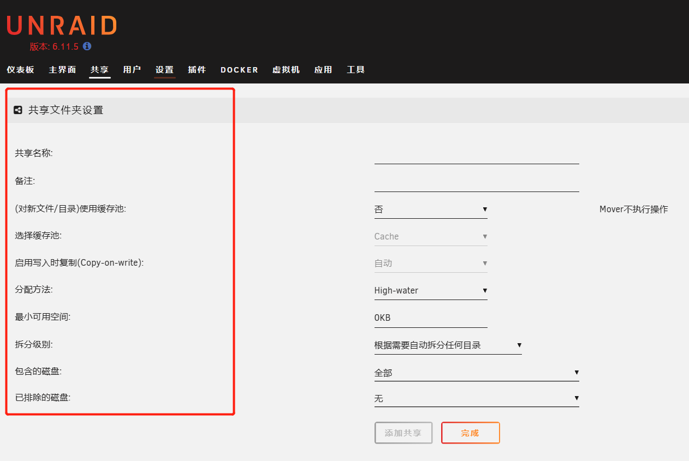

### 1 缓存池

Unraid 提供了四种选项来指定哪些文件该使用缓存、该怎样使用缓存。在安装了缓存盘后，新建共享文件夹时就可以看到这四种缓存选项：

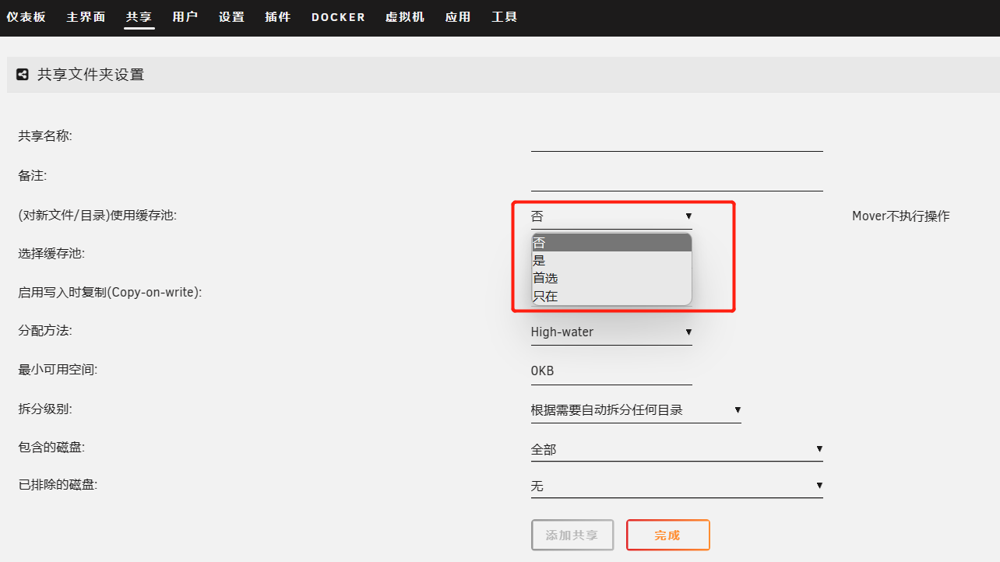

#### No 否

向该共享文件夹内的文件读写时不使用缓存，直接从序列磁盘上读写。适合存放大文件的文件夹，如电影，剧集等。

#### Yes 是

向该共享文件夹写入文件时优先使用缓存，文件将首先写入到缓存上，缓存空间不够则会再写入到磁盘上。

可以通过Unraid 内置的 Mover 机制。定期或手动将文件从缓存中写入数据盘上。

Yes 机制文件先写入缓存，再移动到数据盘，提高了写入速度。适合零碎的小文件，如文档。

#### Prefer 首选

向共享文件夹写入文件时会优先写入缓存，当缓存池剩余空间不足时才会将新文件写入数据盘中。在 Mover 启动时，会尽可能把数据盘中的文件移动到缓存中，下次访问这些文件就会从缓存上读取了。

Prefer这种机制不仅提高了文件的写入速度，也尽可能提高了文件的读取速度。Prefer很适合需要频繁访问，频繁修改的文件，也适合存放虚拟机映像和 Docker 应用的文件夹。

#### Only 只在

文件只存放在缓存上，Unraid 也不会使用 Mover 移动缓存文件到数据盘上。和 Prefer一样提高了读写速度，但不会写入数据盘上意味着在使用单个缓存盘时，没有冗余，也没有校验盘来保护数据，不适合用来存储重要文件，只适合存储虚拟机镜像和 Docker 的容器。

#### 缓存注意事项

由于在使用 Yes 和 Prefer 机制时文件优先写入缓存盘，在一定时间后才会由 Mover 机制将其写入数据盘中。当只有一个缓存盘时，存储在缓存中的数据在还没有被写入数据盘之前是存在风险的。

对于这个问题有下面几种解决方案：
1. 减少 Mover 触发所需的时间。这样缓存内的文件会在短时间内就移动到数据盘。
2. 只使用缓存加速系统文件、虚拟机和 Docker。不用来加速数据盘内文件的读写。
3. 添加第二个缓存盘，启用多设备模式，形成冗余备份。

* 第一种方法可行，但也不能 100% 保证安全。
* 第二种方案让文件不经过缓存直接写入序列，缓存只用于系统相关文件的加速，这样传输文件到序列时是无法享受到缓存的加速的，适合对传输速度没有要求的情况。
* 第三种方案是最稳妥安全的，但是要购买额外的缓存盘。

虽然几种方案各有利弊，但它们都能减少硬盘的频繁读写，可以增加硬盘的休眠时间，在一定程度上减小了系统整体功耗，提高了硬盘的使用寿命。

### 2 硬盘选项

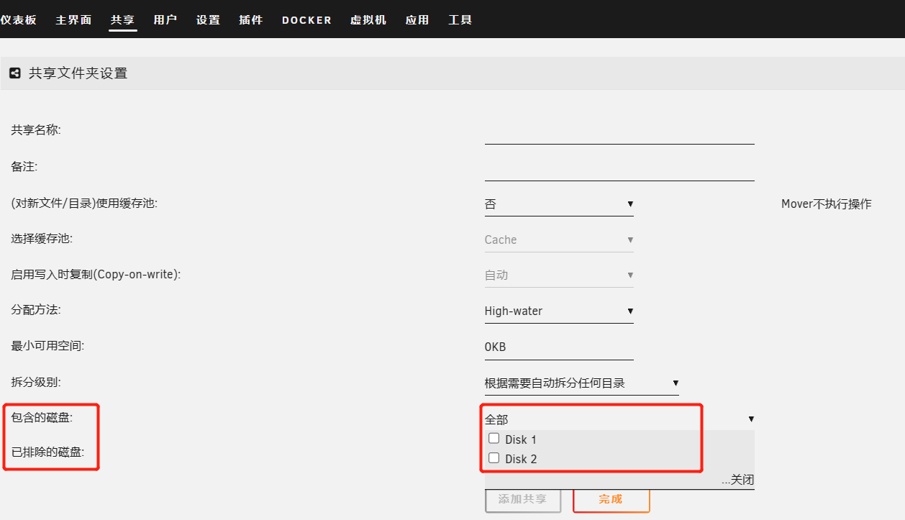

包含的硬盘和排除的硬盘。意思是该共享文件夹中的文件和目录可以存储在那个硬盘中，不可以存储在那个硬盘中。

首先需要讲解一下，Unraid 的共享文件夹功能是通过 Linux 聚合文件系统来实现的，它允许共享文件夹中的文件或目录存放在不同的磁盘中。举个例子，从用户的视角看，文件 Ma 和 Mb 都在同一个共享文件夹Movies中，但在物理层面，文件 Ma 实际存放在 Disk1 上，文件 Mb 实际存放在 Disk2 上。

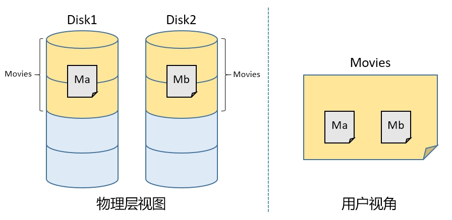

当创建一个包含多个磁盘的共享目录时，通过聚合文件系统，共享目录下的文件可以跨磁盘存放。

那么判断文件应该存放在哪个磁盘就需要 最小可用空间,分配方法, 拆分级别 这三个选项的设置来决定了。

### 3 分配方法

分配方法选项有3种： High-Water，填满，高可用。

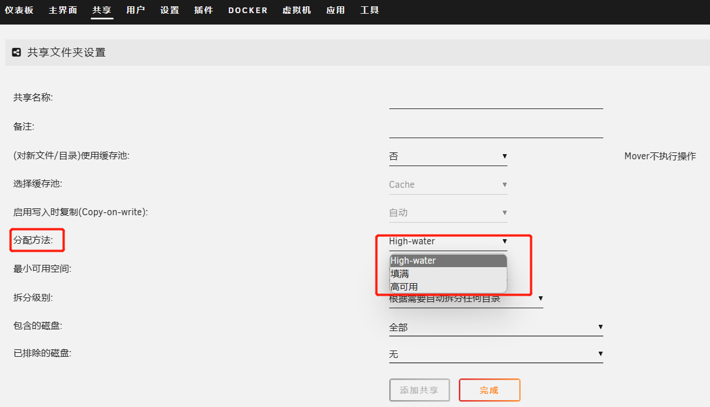

当共享文件夹包含了多个硬盘的时候：
1. Fill-Up 填满 : 是持续向一个硬盘写入直到填满，再向另一个磁盘写入；
2. Most Free 高可用 : 是每次写入都向剩余空间最多的那个磁盘写入；
3. High Water : 是一种均匀各个磁盘剩余空间的写入方式，它基于容量最大的磁盘，使用二分法创建多个“水位线”，举个例子，容量 8TB 硬盘的水位线分别为 4TB, 2TB, 1TB, 512GB...使用 High Water 时，会依次将每个硬盘写入到剩余 4TB 的空间，然后再依次写入到剩余 2TB，1TB...

如图所示，当共享文件夹包含了 8TB, 3TB, 2TB 三个硬盘时，High Water 模式的磁盘写入方式：最开始只会在浅绿色区域进行存储，浅绿色区域存满后，继续在两个深绿色区域进行存储，以此类推。

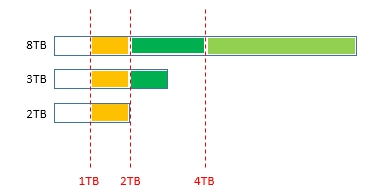

以上三种文件分配方法互有优劣，取决于所创建的共享具体要存放的文件类型和使用者的文件管理习惯。

### 4 最小可用空间 Minimum free space

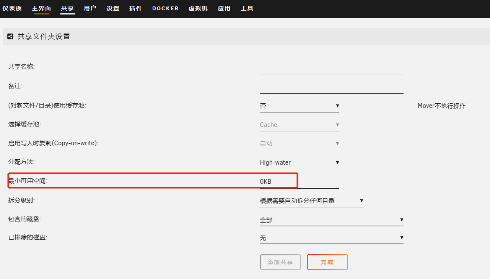

Minimum free space（最小可用空间）设置一个值，当共享文件夹所包含某个磁盘剩余容量低于该值时，就不向这个磁盘写入文件了，转而向共享文件夹包含的其他磁盘写入，当所有磁盘都无法写入时会报错。

这个值一般设置为 0，如果使用者想要为某个磁盘保留一些空间的话，可以根据实际情况进行设置。

### 5 拆分级别 Split level

拆分级别是 Unraid 系统为了防止共享文件夹中的目录和文件过于混乱地分散在各个磁盘而设置的限制。

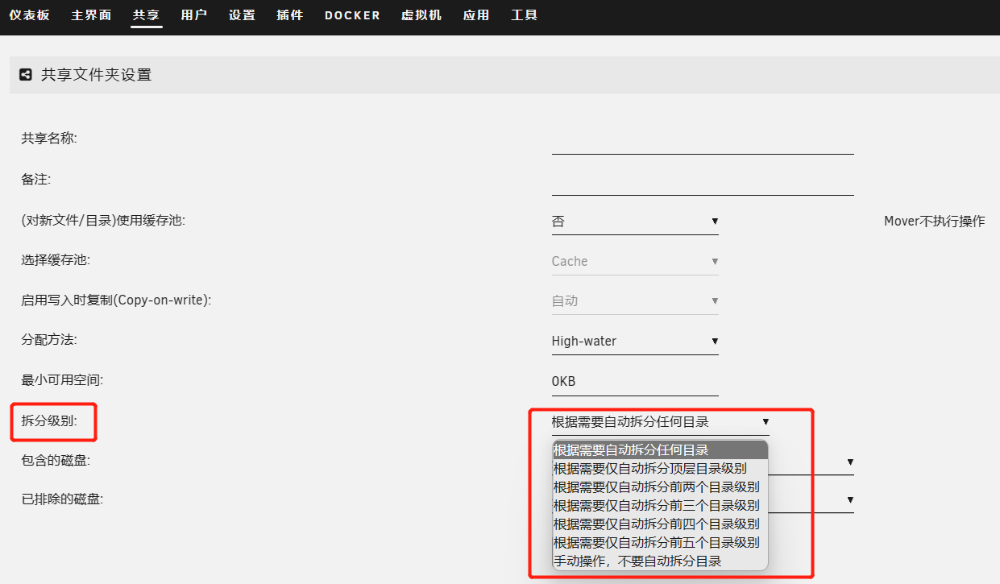

Split level（拆分级别）选项可选 7 个层级，从 level-any， level-1 到 level-5，no。

举个栗子：有两个冰箱（磁盘），冰箱 A 快满了但还没有完全满，冰箱 B 还有很多空间。有一天买来一盒蜜饼（文件），想把它们放到冰箱里，如果都放到 A 中，放不下。这时可以选择把一部分蜜饼放进 A 冰箱，剩余的放到 B 里面；另一个选择是把所有蜜饼放到冰箱 B 里。考虑到数据完整性，很明显会选择第二种。而在 Unraid 中 Split level（拆分级别） 就是来做这个选择的。

当设置 level-1 (level-top) 时，只有根目录（1级目录）可以被分散在不同的磁盘，其子目录（2级目录）以及目录下的所有文件则必须存储在同一个磁盘上，Unraid 系统不会对 2 级目录进行分割。Split level 的其他几个选项以此类推，其中 level-any 代表数据可以被任意分割在不同磁盘上，no 代表 Unraid 不自动分割数据，而是需要使用者手动去设置，需要涉及命令行的操作。

Split level 的选择和共享中存放的数据类别有很大的关系，比如，本次创建的是用于存储电影文件的共享 "Movies"，那么共享中的文件结构大概是图中这样，Movies 是 1 级目录，每部电影的文件存放在以电影名称命名的文件夹中，是 2 级目录。虽然因为聚合文件系统的关系，用户不需要知道文件存放在哪个磁盘，但实际上用户肯定不希望同一个电影文件夹中的电影文件被分散在不同的磁盘上。这种情况下，将 Split level 选项设置为 level-top(level-1) 就限制了 Unraid 不可以对 2 级以下的目录进行分割，电影文件就老老实实地存放在它自己的文件夹里了。

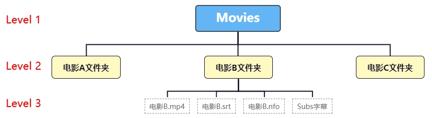

## 我的共享文件夹设置

目前不安装校验盘
   
固态硬盘作为缓存盘
把系统自带的4个共享文件夹设置只存储在缓存池中
然后把系统共享文件夹中的目录或文件移动到缓存池中。（通过文件管理工具）

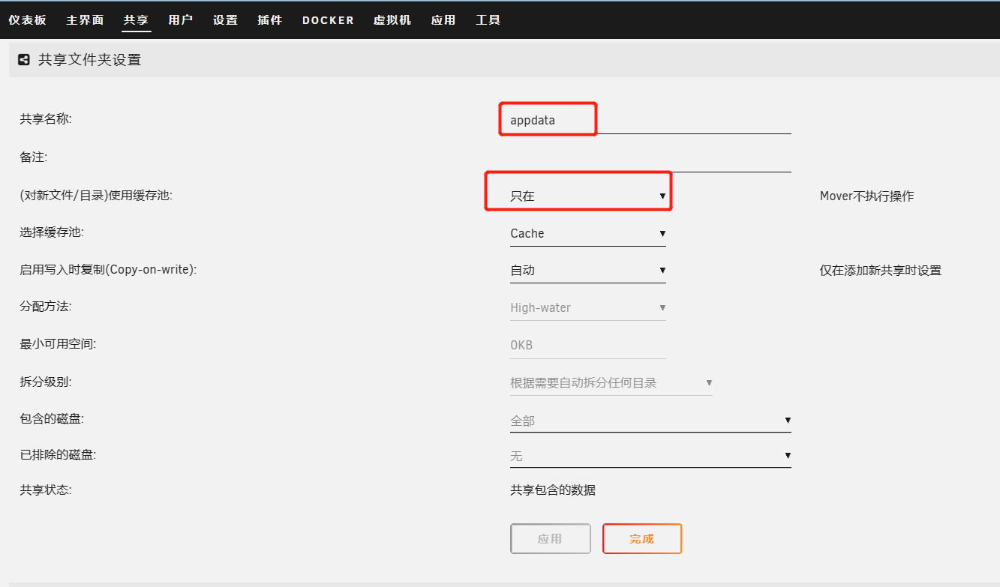

其余的硬盘都加入到阵列中。然后一个硬盘对应一个共享文件夹。设置如下。
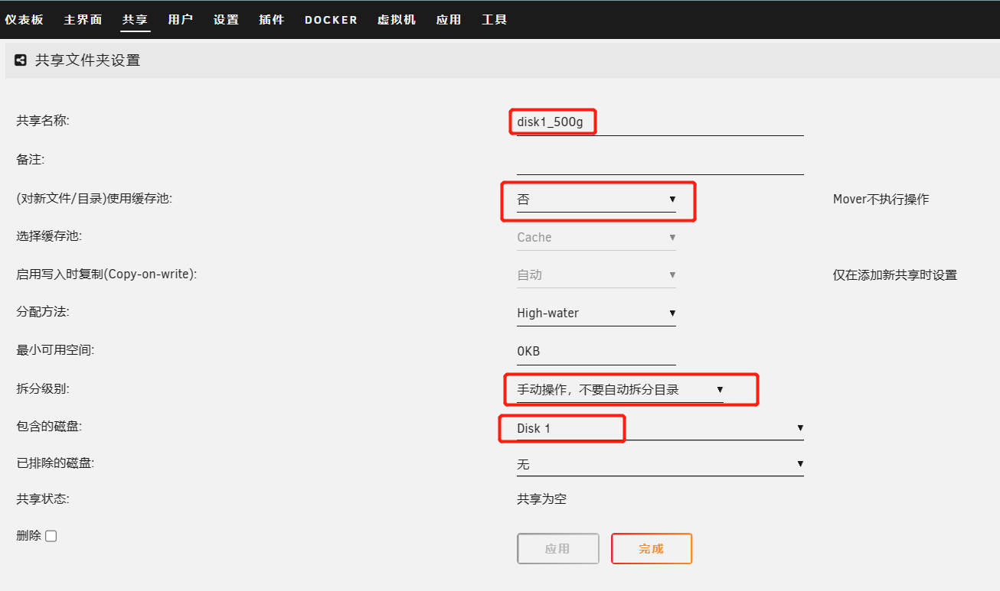