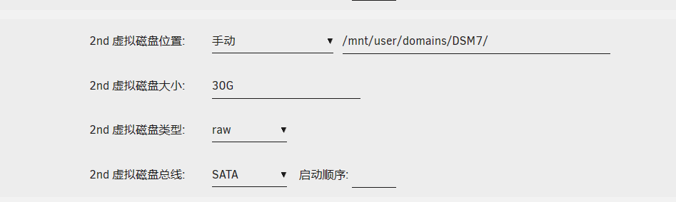
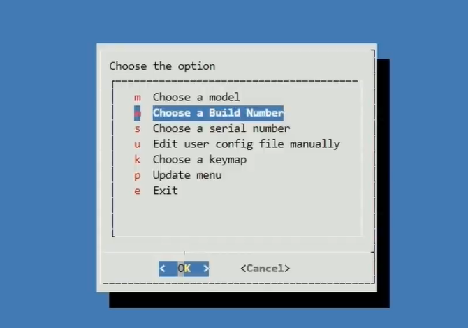
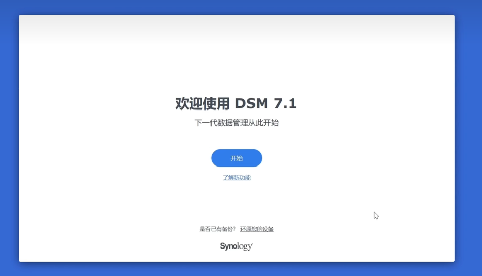
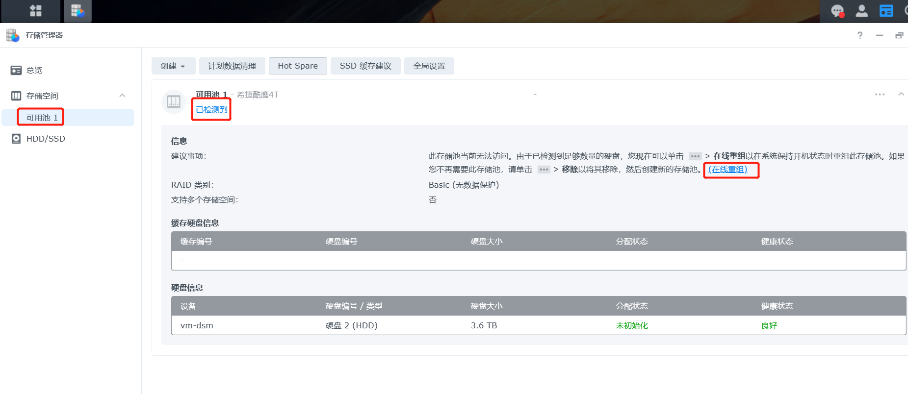

[toc]

# unraid笔记6-迁移数据

## 如何将群晖系统的数据快速迁移到unraid系统中？

方法1：unraid系统挂载群晖的smb共享文件夹。复制群晖的数据到unraid系统中。优点：不需要做额外的工作。缺点：速度太慢，一般为10m/s，需要花费大量时间迁移数据。

方法2：在unraid系统中通过虚拟机的方式安装群晖系统。把原先群晖的硬盘直通到虚拟机群晖系统中。然后再unraid系统挂载群晖虚拟机的smb共享文件夹。然后通过unraid的文件管理器，复制群晖硬盘的数据到unraid系统中。优点：速度快，一般为100m/s左右。缺点：需要先以虚拟机的方式安装群晖，然后直通群晖硬盘给群晖虚拟机。

通过Unassigned Devices 插件可以挂载虚拟机群晖系统的共享文件夹。这样就能把群晖虚拟机的硬盘数据迁移到unraid的硬盘上。

## 如何将unraid系统的数据快速迁移到群晖系统中？

方法：
1. 在unraid系统中通过虚拟机的方式安装群晖系统。
2. 安装准备一个新的闲置硬盘。将该硬盘直通给群晖系统。
3. 在群晖系统中格式化该硬盘并创建共享文件夹。在unraid系统中挂载群晖的共享文件夹。
4. 然后通过unraid的文件管理器，直接把unraid系统的数据拷贝到群晖系统中。
5. 每次拷贝完一块unraid硬盘的数据，就把该硬盘退出阵列中，挂载到群晖中，再次创建共享文件夹。
6. 依次重复上面的步骤。最终把所有的unraid系统硬盘转换为群晖硬盘。
7. 然后把硬盘全部取下来。将宿主机的系统从unraid换成群晖。然后把硬盘都安装到宿主机中。
8. 群晖系统可以识别群晖的硬盘。只不过需要进行数据重组。
9. 群晖系统-》硬盘管理-》数据重组。（数据重组不会格式化硬盘数据）

可以在虚拟机群晖系统中挂载unraid的共享文件夹。这样就能把unraid系统硬盘数据迁移到群晖硬盘上。

## unraid系统虚拟机安装群晖7.1

注意：如果要直通硬盘给群晖虚拟机，那么这个硬盘就不能加入到unraid阵列中。必须先从阵列中退出来才行。可以通过Unassigned Devices 插件查看不在阵列中的硬盘名称。

准备工作：
1. 准备好群晖的引导文件arpl.img和安装文件DSM_DS920+_42962.pat。这两个文件已经备份在个人电脑中了。
2. 上传群晖的引导文件arpl.img 到共享文件夹中。一般选择isos共享文件夹。
3. 点击unraid终端中，进入到命令行中。输入以下命令：`cd /dev/disk/by-id`,可以查看硬盘id信息

### 开始安装群晖虚拟机：

1. 虚拟机界面-》添加虚拟机-》选择linux虚拟机
2. 进行虚拟机配置。

3. 主要硬盘（第一块硬盘）配置：路径选择引导文件arpl.img的位置。总线选择为usb,启动顺序改为1.

4. 第二块硬盘配置：第二块硬盘手动选择一个文件夹作为虚拟硬盘。并给虚拟硬盘30g空间。硬盘类型要选择raw,不能选择qcow2。

磁盘类型qcow2的意思是动态空间，磁盘的空间会随着数据的增长而增长。
磁盘类型raw的意思是固定空间，硬盘空间大小是固定的。

注意：群晖在安装的时候必须要有一个固定大小的硬盘用来初始化系统。所以第二块硬盘的空间必须要大。太小了会导致系统安装失败（提示格式化硬盘失败）。所以第二块硬盘最好就是一个大空间的虚拟硬盘即可。

5. 上面设置完了后，下面的其他设置默认即可。然后点击创建按钮。
6. 当虚拟机创建好后，重新编辑虚拟机设置，再右上角选择表单视图，然后更改网卡。

7. 更改完后，重启虚拟机。点击虚拟机图标 选择VNC远程操控。

8. 浏览器访问ip地址，就可以进入到引导配置界面

    1. 点击choose a model，选择ds920+版本
    2. 点击 choose a build number ,选择42962固件
    3. 点击 choose a serial number,选择随机生成序列号
9. 此时会多处一些选择。
    
    1. 点击 build the loader。开始编译引导程序。
    2. 成功编译完引导程序。会出现boot the loader选择，点击它。
    3. 最后会显示这个界面，表示群晖引导成功。

10.  输入界面上的ip地址，进入群晖安装界面。

11.  手动上传DSM_DS920+_42962.pat文件。该文件可以在群晖官网上下载。上传后点击下一步。
12.  之后格式化硬盘，自动安装，等待即可。

### unraid如何直通硬盘给群晖虚拟机？

如果要直通硬盘给群晖虚拟机，那么这个硬盘就不能加入到unraid阵列中。必须先从阵列中退出来才行。可以通过Unassigned Devices 插件查看不在阵列中的硬盘名称。

1. 编辑虚拟机的硬盘设置，在设置中新添加一块硬盘，硬盘的路径如下图所示。路径：`/dev/disk/by-id/硬盘完整名称`。这个路径就是硬盘在系统中的位置。

2. 硬盘的完整名称可以通过终端在`/dev/disk/by-id`路径中查看。
3. 直通几个硬盘就要添加几个硬盘设置。

### 群晖虚拟机如何添加群晖硬盘

1. 当你重新安装了群晖系统。先把硬盘直通给群晖虚拟机。
2. 之后重启群晖系统可以直接检测出安装了群晖系统的硬盘。只不过该硬盘暂时无法使用。
3. 需要在存储管理器中-》选择硬盘重组。让群晖系统开始识别硬盘即可。
4. 之后就可以在共享文件夹页面显示群晖硬盘中共享文件夹

硬盘重组不会格式化硬盘的数据的。

> 如果硬盘重组失败？
>如果硬盘重组失败，可能是系统之前残留的存储池数据导致的。先把硬盘不直通给群晖虚拟机。然后运行群晖虚拟机，在存储管理器中，删除残留的存储池数据。删除干净后。在把硬盘直通给群晖虚拟机。然后再运行群晖系统，再进行硬盘重组试试看。

