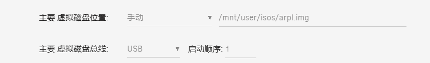
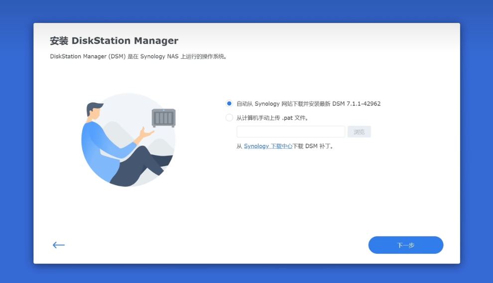

[toc]

# unraid笔记7-虚拟机

unraid提供丰富的虚拟机模板可供创建。

## 安装win10虚拟机

为什么创建win10虚拟机？
1. 用于没有windows环境时执行一些轻量级的应用，比如在NAS和Linux服务器上运行QQ等
2. 用于运行需要长时间（比如7x24小时）运行的windows应用，比如运行购票软件, bt客户端等。

使用的镜像文件是荒野无灯大佬的精简版windows10系统镜像，文件名为win10.qcow2

win10.qcow2镜像：
* 文件大小： 8.4 GiB
* 运行时内存占用： ~ 600 MB
* 运行时系统磁盘占用：7.9 GiB 
* 系统是英文的（不可添加中文语言）
* 中文字体已内置
* 非unicode程序的编码已调整为cp936 (中国)
* VC Redist 运行时库已安装
* .NET 4.0 运行时已安装
* 由于该镜像过度精简，qemu guest agent无法安装
* 输入法暂时默认是英文的，得手动点击切换

### 开始安装

1. 先把win10.qcow2上传到isos共享文件夹中。
2. 进入到unraid 的虚拟机界面，创建虚拟机。
3. 选择win10虚拟机模板
4. 虚拟机配置如图，内存4g左右，主要磁盘选择镜像文件所在路径。注意磁盘总线选择virtio 类型。

5. 其他配置默认即可。注意网卡的类型选择为virtio-net或者virbr0，建议virbr0。

6. 点击安装。安装好后，点击图标进行vnc remote远程桌面。
7. 这个win10镜像内置了一些工具。

## 安装群晖虚拟机：

1. 虚拟机界面-》添加虚拟机-》选择linux虚拟机
2. 进行虚拟机配置。

3. 主要硬盘（第一块硬盘）配置：路径选择引导文件arpl.img的位置。总线选择为usb,启动顺序改为1.

4. 第二块硬盘配置：第二块硬盘手动选择一个文件夹作为虚拟硬盘。并给虚拟硬盘30g空间。硬盘类型要选择raw,不能选择qcow2。

磁盘类型qcow2的意思是动态空间，磁盘的空间会随着数据的增长而增长。
磁盘类型raw的意思是固定空间，硬盘空间大小是固定的。

注意：群晖在安装的时候必须要有一个固定大小的硬盘用来初始化系统。所以第二块硬盘的空间必须要大。太小了会导致系统安装失败（提示格式化硬盘失败）。所以第二块硬盘最好就是一个大空间的虚拟硬盘即可。

5. 上面设置完了后，下面的其他设置默认即可。然后点击创建按钮。
6. 当虚拟机创建好后，重新编辑虚拟机设置，再右上角选择表单视图，然后更改网卡。

7. 更改完后，重启虚拟机。点击虚拟机图标 选择VNC远程操控。

8. 浏览器访问ip地址，就可以进入到引导配置界面

    1. 点击choose a model，选择ds920+版本
    2. 点击 choose a build number ,选择42962固件
    3. 点击 choose a serial number,选择随机生成序列号
9. 此时会多处一些选择。
    
    1. 点击 build the loader。开始编译引导程序。
    2. 成功编译完引导程序。会出现boot the loader选择，点击它。
    3. 最后会显示这个界面，表示群晖引导成功。

10.  输入界面上的ip地址，进入群晖安装界面。

11.  手动上传DSM_DS920+_42962.pat文件。该文件可以在群晖官网上下载。上传后点击下一步。
12.  之后格式化硬盘，自动安装，等待即可。

