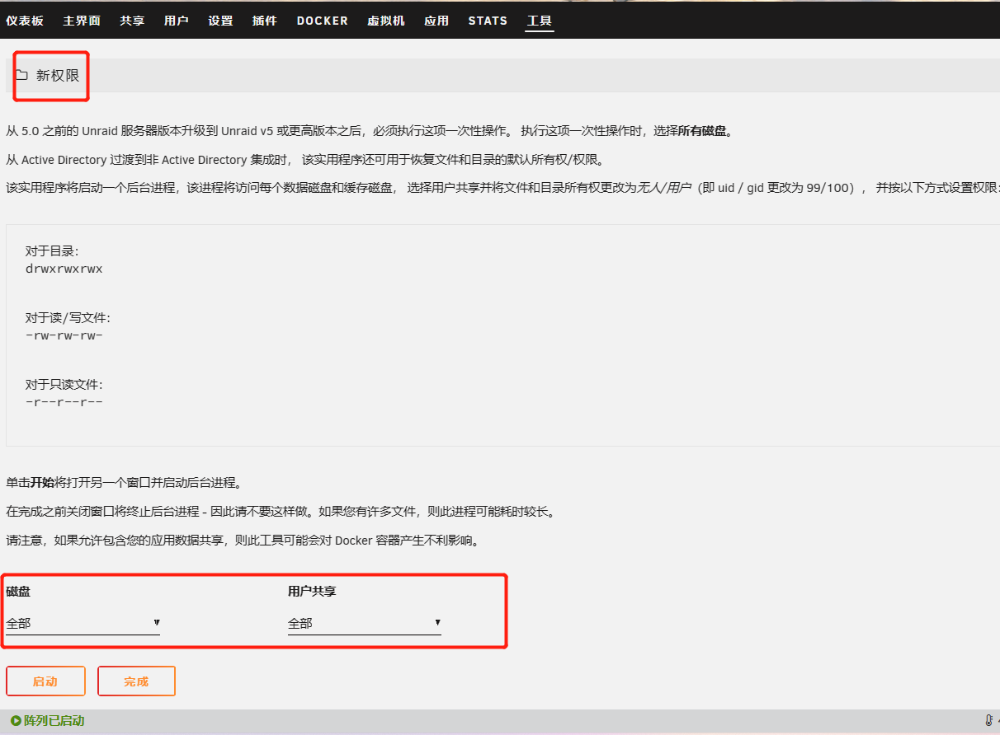

[toc]

## unraid笔记8-问题

记录一些我使用unraid系统时遇到的小问题。

### SMB共享文件夹没有修改权限

问题：当我在windows系统中用SMB协议访问unraid的共享文件夹时。发现无法修改文件，弹窗提示你使用的用户没有读写权限。但是我使用的用户在unraid系统中是拥有读写权限的。

原因：因为unraid并不会自动修改创建的用户权限的权限。

解决方法：打开unraid页面-工具-新权限。把磁盘设置成全部，用户共享设置成全部，点击启动，等代码自动运行结束。

