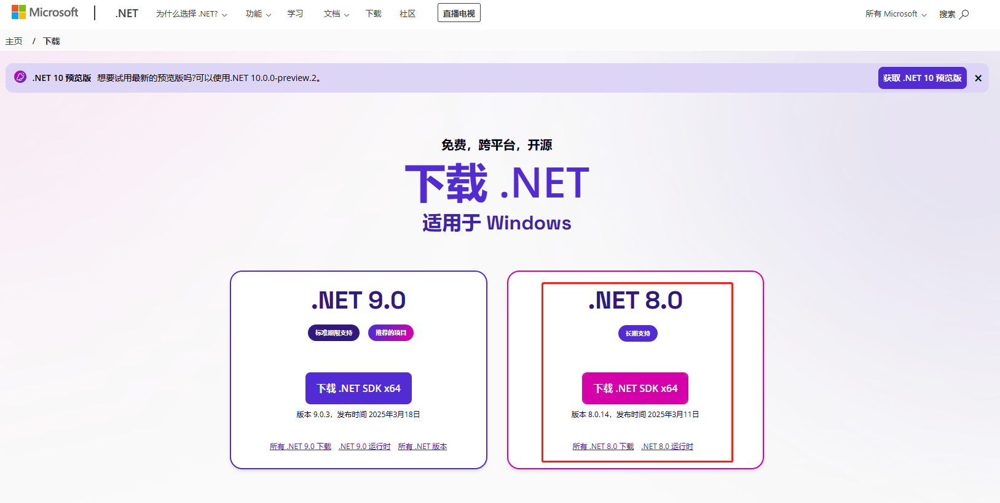
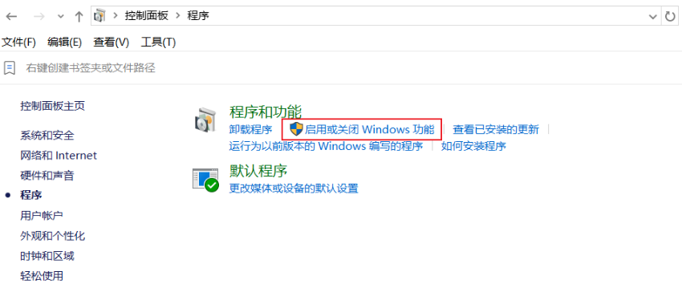
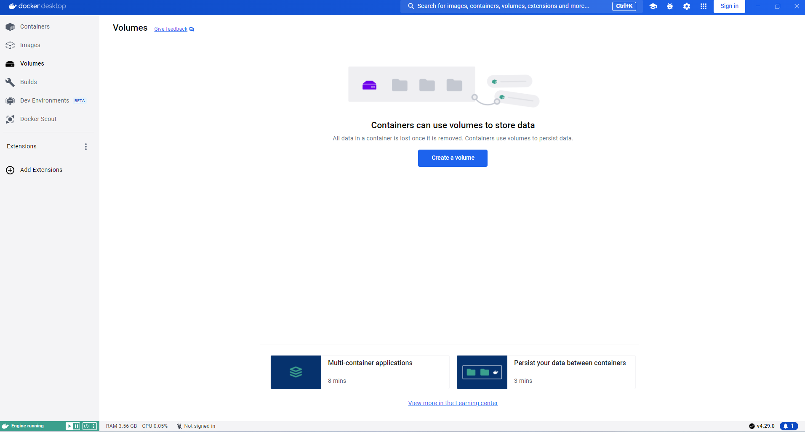

[toc]

# win11 NAS笔记

之前用过黑群晖，unraid作为nas系统。但是由于各种原因，目前打算将windows 11作为nas系统。

正好win 11 LTSC 2024 版发布了。

## 安装 Win 11 LTSC 2024 版

> 什么是LTSC版本

简单来说，LTSC版本 是微软针推出的长期服务版。相比企业版或消费者版。LTSC版去掉了很多不必要功能和软件，系统大幅精简，同时还没有频繁的更新打扰。

正因为这些特性，LTSC 版本才深受大量普通消费者喜爱。

> 下载

推荐大家在 [微软官网 https://www.microsoft.com/zh-cn/](https://www.microsoft.com/zh-cn/) 或者 [itellyou网站 https://next.itellyou.cn/](https://next.itellyou.cn/) 中下载Win 11 LTSC版本的ISO镜像文件。

> 安装系统

自行百度。我在安装的过程，多次安装失败。结果发现是其他硬盘的原因。

可以先把电脑中的其他硬盘全部取出，只保留安装win11系统的硬盘。然后再开始安装win11 ltsc系统。

> 系统信息

系统信息如图所示


## win11 设置

当win11 ltsc系统安装成功后。但是想要作为一个nas系统，还需要进行一些设置。

### 推荐使用本地账户

在系统初始化界面中，我们可以选择「我没有 Intemet 连接」即可顺利注册本地账户。

### 重命名电脑

设置->系统->系统信息 界面中重命名电脑。


### Windows 11 LTSC KMS激活（非激活工具）

安装系统之后，还需要激活系统。否则一些功能无法使用。

1. 打开PowerShell，选择以管理员身份运行 PowerShell。
2. 输入以下命令激活系统。

```sh
slmgr -ipk M7XTQ-FN8P6-TTKYV-9D4CC-J462D
slmgr -skms kms.0t.net.cn
slmgr -ato
```

注意KMS激活有效期限为180天，只要KMS服务器还能访问，那么就可以一直持续激活下去。除非KMS服务器无法访问了。

### 删除C盘中多余的文件

当系统安装好后,会发现C盘占用在50G左右，我们可以清理C盘。分别删除 Win 11 默认的保留空间、休眠文件。

> 删除保留空间和休眠文件

1. 打开PowerShell，选择以管理员身份运行 PowerShell。
2. 输入以下命令并回车即可。

```sh
## 删除保留的储存空间
dism.exe /online /set-reservedstoragestate /state:disabled

## 删除休眠文件
powercfg -h off
```


### 安装微软商店

微软对 Win 11 LTSC 2024 进行了大量精简工作，系统仅自带 edge 浏览器和部分的必要软件，像微软商店和常用的新版照片查看器都已被砍掉。

> 安装微软商店

1. 打开PowerShell，选择以管理员身份运行 PowerShell。
2. 输入以下命令。即可自动安装微软商店。

```sh
wsreset –i
```

当微软商店安装好后，就可以在商店中下载照片查看器了。


### 安装完整运行库和环境

在使用 Win 11 LTSC 2024 时会担心无法稳定兼容各类生产力和游戏环境，其实这是因为没有安装完整运行库和环境的原因。

> 可以前往以下地址下载最新微软`.NET`运行库。



[最新微软.NET 运行库下载 https://dotnet.microsoft.com/zh-cn/download](https://dotnet.microsoft.com/zh-cn/download)

> 可以前往以下地址下载最新 Visual C++ 运行库


[最新微软Visual C++ 运行库下载 https://learn.microsoft.com/zh-cn/cpp/windows/latest-supported-vc-redist?view=msvc-170](https://learn.microsoft.com/zh-cn/cpp/windows/latest-supported-vc-redist?view=msvc-170)

### 关闭 Bitlocker 硬盘加密

1. 进入到系统设置界面
2. 点击左侧“隐私和安全性”菜单，然后进入右侧的“设备加密”选项
3. 将设备加密选项关闭即可

等待系统解密完成后，就完成了Bitlocker关闭。


### 显示文件扩展名

windows系统默认不显示文件的文件扩展名。

有时候，当我们处理文件的时候，可以直接通过文件扩展名来判断文件类型，比较方便。

### 关闭休眠

由于win11 作为nas系统，需要长期运行。因此建议关闭休眠。


### smb共享

对于某些视频目录，我们可以将其设置为共享目录。从而可以让局域网中的其他设备访问该目录。达到远程访问的效果。

方法：选中该目录，点击右键属性，设置共享即可。

## 应用

### 网易云音乐 

网易云音乐官网：https://music.163.com/


### WPS 办公三件套 和 PDF阅读器

WPS的办公三件套有时候还是很有用的。WPS也可以作为PDF阅读器使用。

WPS 官网：https://www.wps.cn/


### Snipaste 截图工具

Snipaste是一个好用的截图工具。

Snipaste官网：https://zh.snipaste.com/index.html


### 360压缩

一个好用的压缩，解压软件。

[360压缩下载地址 https://yasuo.360.cn/](https://yasuo.360.cn/)


### 向日葵 远程控制

用于远程控制，无需公网IP。

向日葵网站：https://sunlogin.oray.com/


### potplayer 视频播放器

[potplayer 中文官网 https://potplayer.tv/?lang=zh_CN](https://potplayer.tv/?lang=zh_CN)


### 迅雷下载

国内下载一些文件，特别是一些冷门文件，还是需要用到迅雷。

迅雷网站：https://dl.xunlei.com/


### Everything 文件搜索

Everything 是一个非常好用的文件搜索工具。

Everything 官网 https://www.voidtools.com/zh-cn/


### FastCopy 文件复制

FastCopy是Windows上最快的复制/备份软件

FastCopy 官网 https://fastcopy.jp


### FreeFileSync 文件同步工具

FreeFileSync 是一款免费、开源的文件同步软件，支持 Windows、macOS 和 Linux 操作系统。它可以帮助用户比较和同步不同位置的文件和文件夹，确保数据的一致性。

FreeFileSync官网 https://freefilesync.org/


### Diskgenius 硬盘分区工具

Diskgenius 可以专门用于硬盘的分区和数据恢复等功能。

Diskgenius官网：https://www.diskgenius.cn/


> 使用方法

1. 下载软件并安装运行。会安装两个软件 FreeFileSync 和 RealTimeSync 。
2. 打开 FreeFileSync 软件。新建一个同步任务,选中源目录和目标目录，点击同步按钮即可。如图所示


3. 如果你想将这个同步任务定时执行。可以先将这个同步任务另存为批处理作业。
4. 然后将这个批处理作业，用RealTimeSync 软件执行即可。


### 硬盘检测工具 CrystalDiskInfo

CrystalDiskInfo 是一款免费开源的硬盘健康监测工具，主要通过读取硬盘的 S.M.A.R.T.（自我监测、分析及报告技术） 数据，实时评估硬盘的健康状态并提供预警功能。

通过 CrystalDiskInfo，可直观掌握硬盘状态，及时采取措施保护数据安全。

CrystalDiskInfo下载链接 https://crystalmark.info/en/software/crystaldiskinfo/


### git 代码管理

下载git 并安装

git 官网 https://git-scm.com/


### vscode 轻量级文本编辑器

vscode 轻量级文本编辑器。这个编辑器也相当于是一个轻量级的IDE，可以编写各种代码。

vscode 官网 https://code.visualstudio.com/


### Zerotier 内网穿透工具

使用Zerotier这个内网穿透工具，可以在无需公网IP的情况下，让多台设备互相连接，互相访问。

它的原理就是让多台设备同时访问Zerotier的服务器，这样通过Zerotier服务器可以让多台设备形成一个局域网的环境。

因此，只有当控制端和被控制端都安装了Zerotier,两端之间才能在不需要公网ip的情况下,进行端对端访问.

Zerotier 官网 https://www.zerotier.com/


> 注册网络和设置

1. 先在Zerotier 官网上注册Zerotier账户
2. 登录进去之后，开始创建网络，点击“Create A Network”
3. 网络创建之后，就可以看到属于你的网络NETWORK ID

> 使用方法

1. 在你需要进行互联的多个设备上，下载 Zerotier 软件并安装。可以在官网上下载不同平台的安装包。
2. 运行Zerotier软件,选择“Join Network”。
4. 输入你创建网络的NETWORK ID即可.
5. 然后登录Zerotier官网,你就可以在Members设置中看到你的设备出现在这个网络中。


7. 勾选方框，刷新页面,这样就把你的设备加入到你创建的网络中。
8. Managed IPs表示的是你的设备在这个网络中的ip,如果你要访问其他设备,就需要在浏览器中输入其他设备的Managed ip。

### clash 网络代理

Clash 是一款功能强大的开源网络代理软件。我们可以通过它访问外网。

可以在github网站中搜索clash,从而下载clah的安装包进行下载。

使用方法自行百度。

### Rainmeter 桌面美化

Rainmeter是一款可以让您在桌面上放置类似 “Windows 7桌面小工具”一样的组件的桌面美化软件。

Rainmeter能做什么？它的全部功能，就是布置装饰桌面的组件，这一个个的组件在Rainmeter中被称为“皮肤”。不过这些皮肤能做什么呢？除了单纯的装饰的皮肤外，有的可以调用显示系统信息，有的可以打开或者控制其它应用程序，有的可以展示系统目录结构和信息，有的可以捕获网页的信息……

Rainmeter官网 https://www.rainmeter.net/


> 使用方法

1. 下载并安装Rainmeter
2. 运行Rainmeter，会加载一套默认皮肤。
3. 我们也可以在Rainmeter官网中找到更多的皮肤进行加载。

Rainmeter的默认皮肤会在桌面上展示系统，磁盘和网络信息。


### docker desktop

docker desktop 是 docker 在 windows系统上的一站式解决方案。可以通过它来更加快捷方便的使用docker。

docker desktop 下载地址 https://www.docker.com/products/docker-desktop/


> 安装 docker desktop

① 在安装 Docker Desktop 之前，首先需要开启主板的 CPU 虚拟化功能。

1. 重启电脑，进入主板的bios系统。
2. 如果是 Intel 处理器，启用 Intel VT-x 选项。

① 在电脑上打开“控制面板”->“程序”-> “启动或关闭Windows功能”。



② 勾选如下内容。


③ 双击安装docker desktop安装包

④ 安装完成启动程序之后，一般会报错。此时我们需要更新wsl版本。

打开PowerShell，选择以管理员身份运行 PowerShell。输入以下命令并回车即可。
```sh
wsl --update
```

⑤ wsl版本更新之后，就能正常使用docker desktop了。



⑥ docker desktop这个应用程序会在windows环境上虚拟一个linux环境，然后在linux环境中再安装docker。

打开windows的CMD终端。输入`docker -v`命令，可以看到安装的docker的版本


