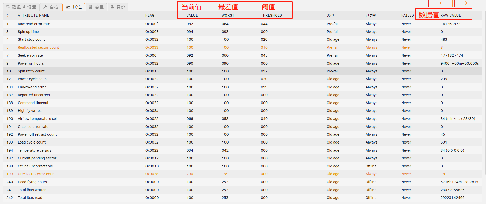

[toc]

# 硬盘SMART信息

S.M.A.R.T.（Self-Monitoring Analysis And Reporting Technology），全称是“自我检测分析与报告技术”，成为一种自动监控硬盘驱动器完好状况和报告潜在问题的技术标准。

SMART功能的实现方式，主要是从硬盘上的各个传感器上不断收集当前状态信息，并把信息保存在硬盘的系统保留区(service area)内，这个区域一般由厂商写入相关的磁盘内部管理程序。例如低级格式化程序、加密解密程序、自监控程序、自动修复程序等。

用户可以使用监测软件通过名为“SMART Return Status”的命令来对硬盘存储的SMART信息进行读取，并且不允许用户对SMART信息进行修改。

## SMART信息的各项参数

目前，各硬盘制造商的绝大部分SMART信息中各项参数信息的含义是一致的。每项参数都有一个十六进制数的ID代码表示。如下所示部分参数信息,括号内对应的是十进制数。

```
01（001） 底层数据读取错误率 Raw Read Error Rate
04（004） 启动/停止计数 Start/Stop Count
05（005） 重映射扇区数 Relocated Sector Count
09（009） 通电时间累计 Power-On Time Count (POH)
0A（010） 主轴起旋重试次数（即硬盘主轴电机启动重试次数） Spin up Retry Count
0B（011） 磁盘校准重试次数 Calibration Retry Count
0C（012） 磁盘通电次数 Power Cycle Count
C2（194） 温度 Temperature
C7（199） ULTRA DMA奇偶校验错误率 ULTRA ATA CRC Error Rate
C8（200） 写错误率 Write Error Rate
```

下面介绍一些重点关注的参数信息。

01（001） 底层数据读取错误率 Raw Read Error Rate ：是指磁头从磁盘表面读取数据时出现的错误，对某些硬盘来说，大于0的数据表明磁盘表面或者读写磁头发生问题，如介质损伤、磁头污染、磁头共振等等。不过对希捷硬盘来说，许多硬盘的这一项会有很大的数据量，这不代表有任何问题。

04（004）启停计数 Start/Stop Count ：这一参数的数据是累计值，表示硬盘主轴电机启动/停止的次数，新硬盘通常只有几次，以后会逐渐增加。


05（005）重映射扇区计数 Reallocated Sectors Count ：该项的数据值正常情况下应为0。当硬盘的某扇区持续出现读/写/校验错误时，硬盘固件程序会将这个扇区的物理地址加入缺陷表(G-list)，并将该扇区进行屏蔽。

这项参数的数据值直接表示已经被屏蔽扇区的数量，当前值则随着数据值的增加而持续下降。当发现此项的数据值不为零时，要密切注意其发展趋势，若能长期保持稳定，则硬盘还可以正常运行；若数据值不断上升，说明不良扇区不断增加，硬盘已处于不稳定状态，应当考虑更换了。

如果这项参数的当前值接近或已到达阈值（此时的数据值并不一定很大），表示缺陷表已满，已经失去了屏蔽扇区的功能，再出现不良扇区就会显现出来并直接导致数据丢失。这一项是硬盘的寿命关键参数。

09（009）通电时间累计 Power-On hours ：这个参数表示硬盘通电的时间，数据值直接累计了设备通电的时长，新硬盘当然应该接近0，但不同硬盘的计数单位有所不同，有以小时计数的，也有以分、秒甚至30秒为单位的。这一参数的阈值通常为0，若当前值随着硬盘通电时间增加会逐渐下降，接近阈值。则表明硬盘已接近预计的设计寿命，当然这并不表明硬盘将出现故障或立即报废。

0C（012）通电周期计数 Power Cycle Count : 该项参数的数据值表示了硬盘通电/断电的次数，即电源开关次数的累计，新硬盘通常只有几次。这一项与启停计数（04）是有区别的，一般来说，硬盘通电/断电意味着计算机的开机与关机，所以经历一次开关机数据才会加1；而启停计数（04）表示硬盘主轴电机的启动/停止（硬盘在运行时可能多次启停，如硬盘进入休眠后被唤醒等）。所以大多情况下这个通电/断电的次数会小于启停计数（04）的次数。通常，硬盘设计的通电次数都很高，如至少5000次，因此这一计数只是寿命参考值，本身不具指标性。

BB（187）无法校正的错误 Reported Uncorrectable Errors ：（希捷）报告给操作系统的无法通过硬件ECC校正的错误。如果数据值不为零，就应该备份硬盘上的数据了。

C0（192）断电返回计数 Power-Off Retract Count ：这一项的数据量代表了不安全关机，即发生意外断电的次数。

C2（194）温度 Temperature ：数据值直接表示了硬盘内部的当前温度。硬盘运行时最好不要超过45℃，温度过高虽不会导致数据丢失，但引起的机械变形会导致寻道与读写错误率上升，降低硬盘性能。

C7（199）Ultra ATA访问校验错误率 Ultra ATA CRC Error Rate ：这个参数的数据值累计了通过接口循环冗余校验发现的数据线传输错误的次数。如果数据值不为0且持续增长，表示硬盘控制器→数据线→硬盘接口出现错误，劣质的数据线、接口接触不良都可能导致此现象。由于这一项的数据值不会复零，所以某些新硬盘也会出现一定的数据量，只要更换数据线后数据值不再继续增长，即表示这个问题已得到解决。


## SMART信息中的参数的值

SMART信息中各项参数信息都有许多数值。值得注意的数值，分别是当前值，最差值，阈值，数据值。

注意：以上的各个数值，在不同的操作环境，不同的检测程序下结果有较大不同。



> 阈值，临界值，Threshold

阈值表示某一项的极限值。如果某个参数的当前值接近了阈值，就意味着硬盘将变得不可靠，可能导致数据丢失或者硬盘故障。

> 当前值，value

当前值是在硬盘运行时根据实测数据通过公式计算的结果，计算公式由硬盘厂家自定。

硬盘出厂时，SMART信息中的各项参数都有一个预设的最大正常值，也即出厂值，最大正常值通常为100或200或253，新硬盘刚开始使用时显示的当前值可以认为是预设的最大正常值（如温度等除外）。

随着使用损耗或出现错误，当前值会根据实测数据而不断刷新并逐渐减小。因此，当前值接近阈值就意味着硬盘寿命的减少，发生故障的可能性增大，所以当前值也是判定硬盘健康状态或推测寿命的依据之一。

> 最差之，worst

最差值是硬盘运行时各项参数之前出现过的最大的非正常值。

最差值是对硬盘运行中某项数据变劣的峰值统计，该数值也会不断刷新。通常，最差值与当前值是相等的，如果最差值出现较大的波动（小于当前值），表明硬盘曾出现错误或曾经历过恶劣的工作环境（如温度）。

> 数据值，data或 Raw value

数据值是硬盘运行时各项参数的实测值。

数据值并不直接反映硬盘状态，有些数据值是累计的，例如硬盘启动/停止次数，用于累计计算硬盘的开关次数。有些数据值是临时的，例如硬盘温度。

数据值和当前值，在某些参数上是相同的，在某些参数是不相同。例如温度参数，硬盘启动/停止次数参数。


