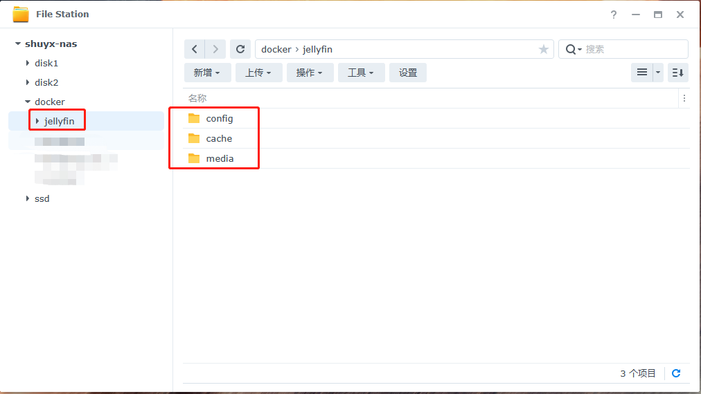
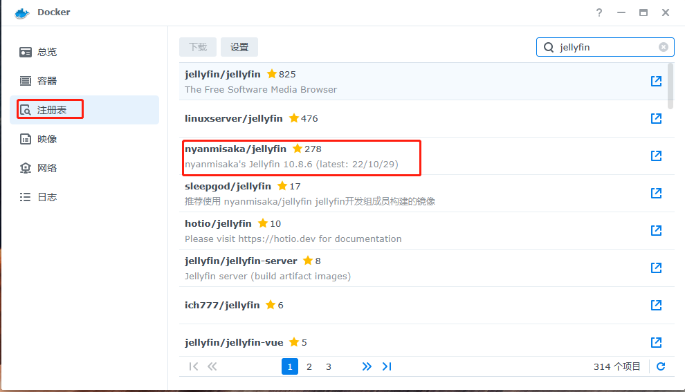
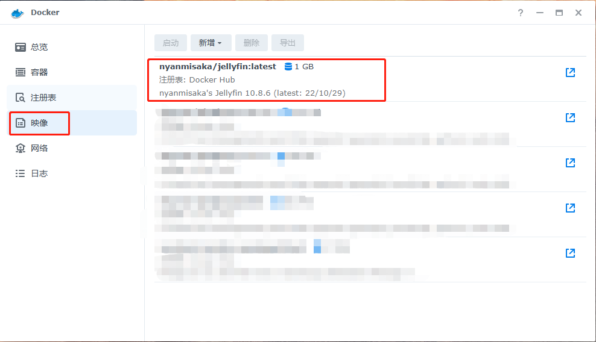
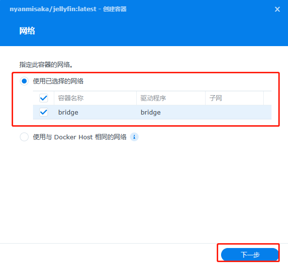
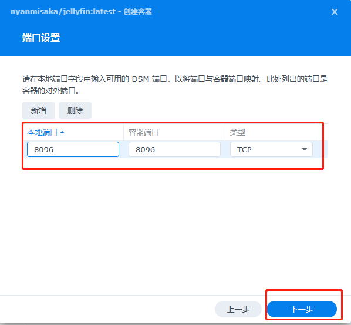
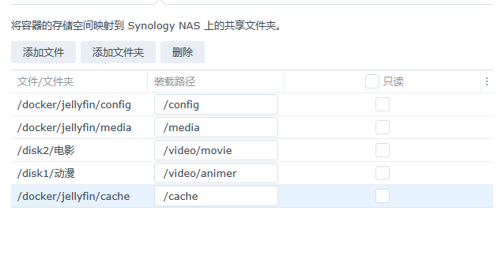
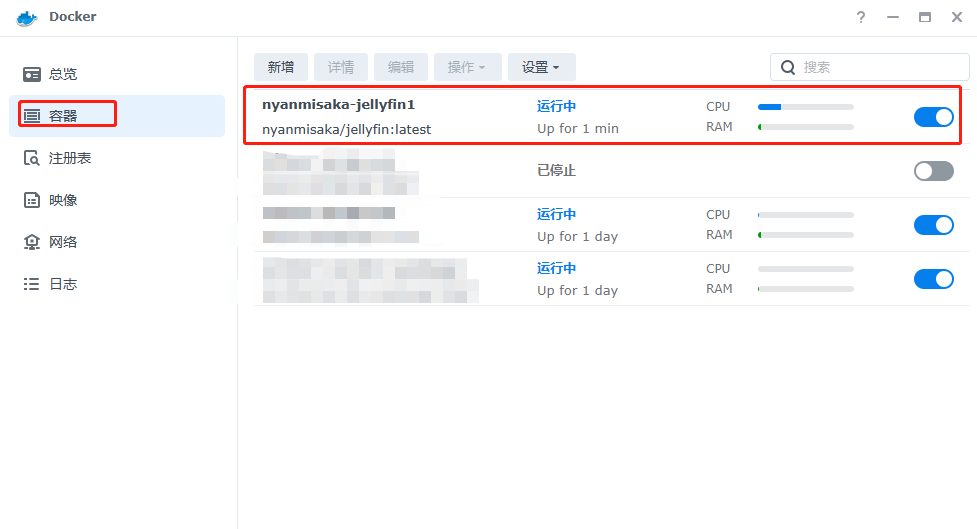
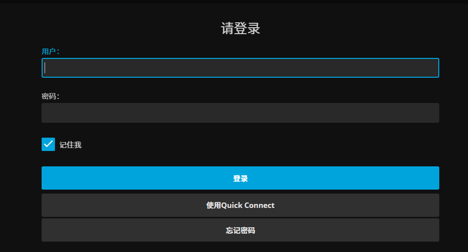

[toc]

## 群晖docker安装jellyfin媒体库

```
jellyfin媒体库
Jellyfin 是一个自由的软件媒体系统，用于控制和管理媒体和流媒体。
它是 emby 和 plex 的替代品，它通过多个应用程序从专用服务器向终端用户设备提供媒体。
Jellyfin 属于 Emby 3.5.2 的下一代，并移植.NET 核心框架，以支持完全的跨平台支持。
总之可以理解为免费版本的emby
```

PS: 需要提前在群晖系统中安装docker套件

### 1 提前创建jellyfin文件夹

在docker共享文件夹中创建jellyfin文件夹，并在其中创建3个子目录config,cache,media。若没有docker共享文件夹，则自己创建一个。我一般在固态硬盘上创建docker共享文件夹。



### 2 设置jellyfin文件夹的权限

右键jellyfin文件夹，选择属性，选择权限，点击新增，然后在用户或组里选Everyone，接着，权限全部打勾，最后确定。

注意选择应用到这个文件夹，子文件夹，文件。


### 3 在docker中下载jellyfin映像




### 4 创建jellyfin容器，进行容器设置

启动jellyfin镜像文件，创建jellyfin容器。有几个地方需要手动设置，其他选择默认即可。

jellyfin默认端口为8096





### 5 容器启动后，输入jellyfin的网址（http://ip:8096），登录jellyfin媒体库。一开始使用需要注册




### 6 后续jellyfin媒体库如何使用，自行百度。