[toc]

## 群晖docker安装青龙面板

安装的青龙面板版本为2.11.3。最新版本青龙面板中下载Linux依赖安装总是失败。

```
青龙面板
一个支持python3、javaScript、shell、typescript 的定时任务管理面板。主要用它跑定时脚本。
```

[青龙面板-dockerhub地址](https://hub.docker.com/r/whyour/qinglong)

PS: 需要提前在群晖系统中安装docker套件

### 1 提前创建qinglong文件夹

在docker共享文件夹中创建qinglong文件夹，并在其中创建图中的子目录。
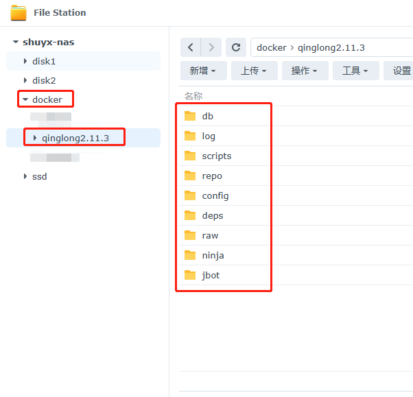

### 2 设置qinglong文件夹的权限

右键qinglong文件夹，选择属性，选择权限，点击新增，然后在用户或组里选Everyone，接着，权限全部打勾，最后确定。

注意选择应用到这个文件夹，子文件夹，文件。

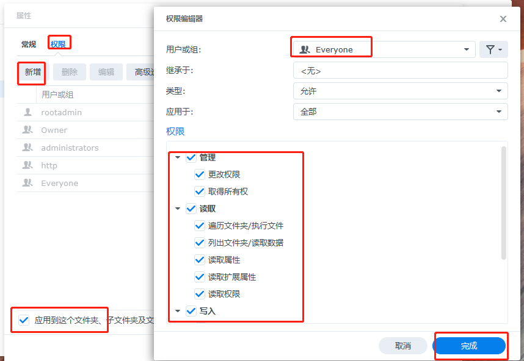

### 3 在docker中下载青龙面板映像

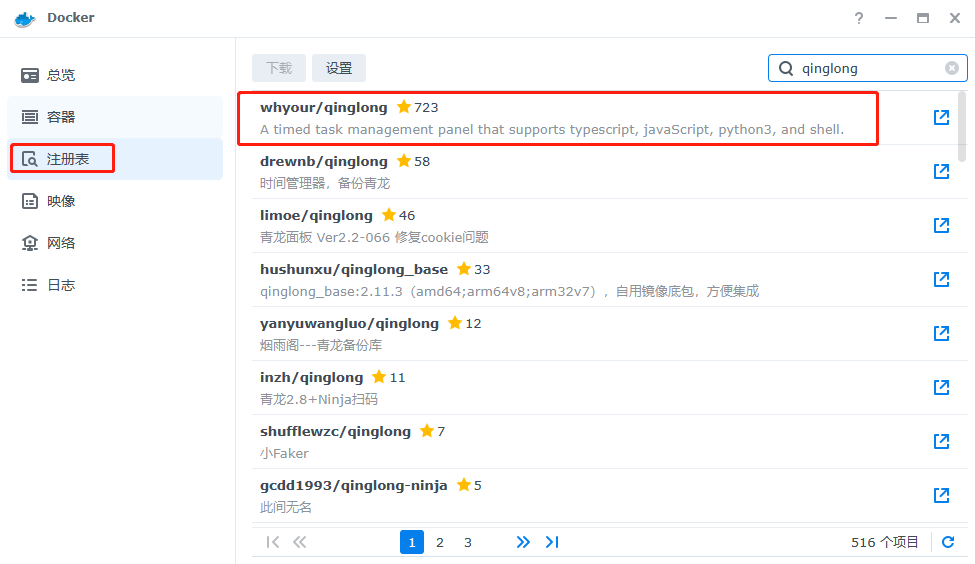
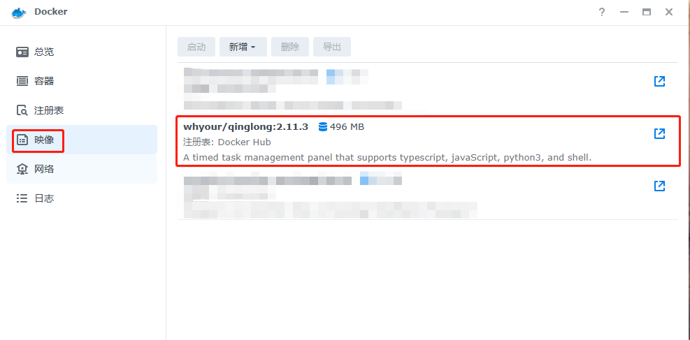

### 4 创建青龙面板容器，进行容器设置

启动青龙面板镜像文件，创建容器。有几个地方需要手动设置，其他选择默认即可。

青龙面板默认端口为5700

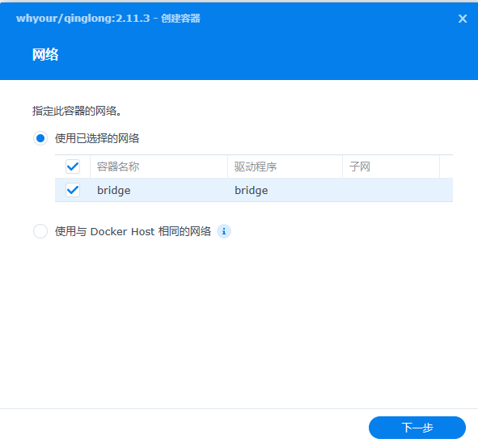
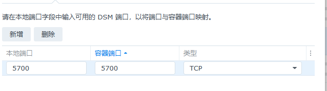
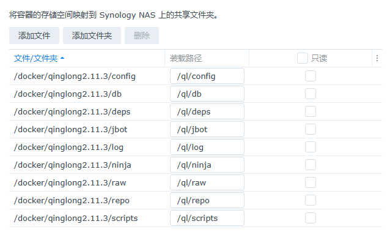

### 5 容器启动后，输入青龙面板的网址（http://ip:5700），登录青龙面板。一开始使用需要注册

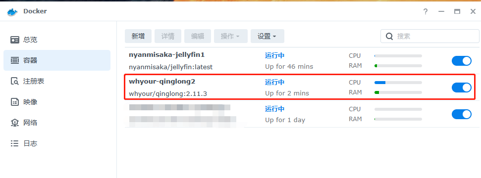
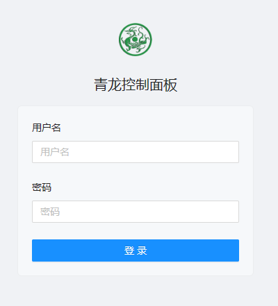


## 青龙面板的使用

### 1 依赖包说明

一开始使用青龙面板，需要先下载依赖包。依赖包主要分为3种，nodejs依赖，python依赖，linux依赖。因为青龙面板中的脚本文件需要靠依赖包才能运行。

青龙面板应该内置了nodejs环境，python环境，linux环境。

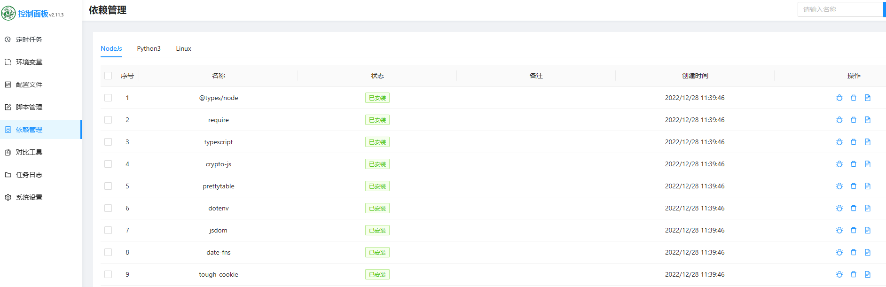

```
网上3种依赖包范例：

node依赖=============
@types/node  
require
typescript
crypto-js
prettytable
dotenv
jsdom
date-fns
tough-cookie
tslib
ws@7.4.3
ts-md5
jsdom -g
jieba
form-data
json5
global-agent 
js-base64
axios

Python依赖====================
requests
canvas  
ping3
jieba

Linux依赖====================
bizCode
bizMsg  
lxml

```

### 2.下载依赖包

选择依赖管理，点击新增依赖，设置依赖类型，输入依赖名称。（若要同时下载多个依赖，则选择自动拆分）

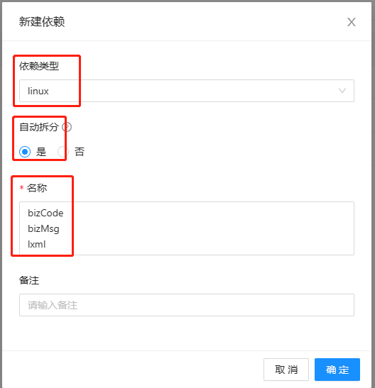

### 3.拉取脚本仓库

网上有许多脚本仓库。这些脚本仓库其实是作者写好的定时脚本文件。

```
smiek2121的脚本库

ql repo https://github.com/smiek2121/scripts.git "jd_|gua_" "" "ZooFaker_Necklace.js|JDJRValidator_Pure.js|sign_graphics_validate.js|cleancart_activity.js|jdCookie.js|sendNotify.js"

Faker仓库脚本
ql repo https://github.com/shufflewzc/faker2.git "jd_|jx_|gua_|jddj_|getJDCookie" "activity|backUp" "^jd1|USER|utils|ZooFaker_Necklace.js|JDJRValidator_Pure|sign_graphics_validate"
```

1. 选择定时任务，点击新建任务，设置任务名称，命令，定时规则。点击确定。
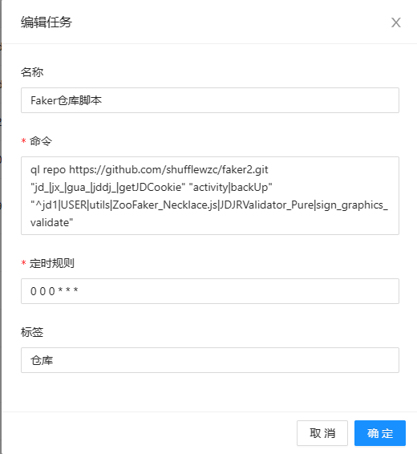

2. 在定时任务中找到新建的任务。运行该任务。
3. 当任务执行完之后，你会发现定时任务界面增加了许多其他定时任务。这些定时任务是仓库脚本里面自带的。
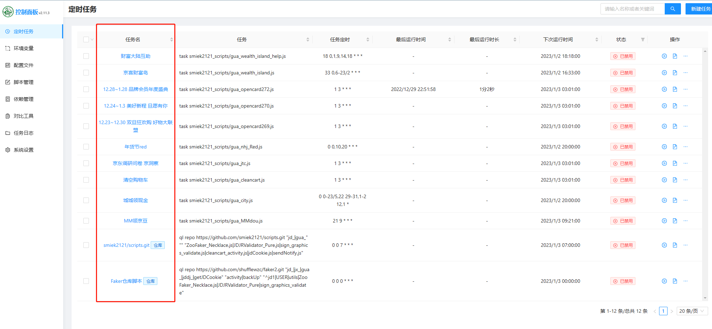
4. 之后可以在定时任务界面中执行或批量执行这些定时脚本文件。

### 4.配置环境变量

有些定时脚本需要环境变量才能运行。所以我们需要在青龙面板中设置环境变量。例如京东定时签到脚本，就需要JD_COOKIE环境变量。

选择环境变量，点击新建变量，填写名称，值。点击确定。

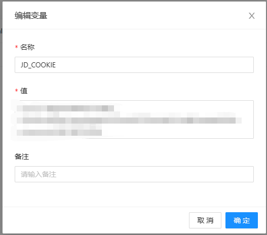

JDcookie环境变量的格式为：pt_key=XXXX;pt_pin=XXXX;


## 自己写的青龙脚本

参考了网上其他大神写的青龙脚本，按照自己的想法稍微修改了一下。

github仓库链接：https://github.com/suichentree/shu_script.git