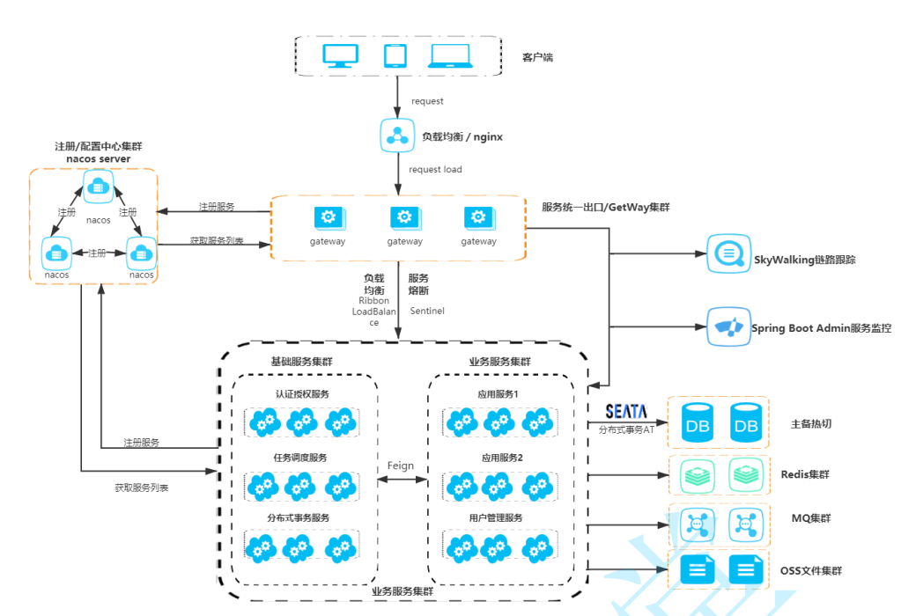

[toc]

# 微服务注册配置中心Nacos

Nacos是一种工具，帮助您快速实现动态服务发现、服务配置、服务元数据及流量管理。
在SpringCloudAlibaba微服务架构中,Nacos用于注册中心和配置中心。

目前SpringCloudAlibaba中各个组件的版本搭配

|  Spring Cloud Alibaba Version | Sentinel Version | Nacos Version | RocketMQ Version | Dubbo Version | Seata Version | 
|  ----  | ----  | ----  | ----  | ----  | ----  |
| 2.2.8.RELEASE  | 1.8.4 | 2.1.0 | 4.9.3 | ~ | 1.5.1 |

## 微服务注册中心Nacos

下图为微服务架构图


### 注册中心的演变

注册中心用于管理所有服务、解决服务与服务之间调用关系错综复杂、难以维护的问题;

第一代：直接通过网址调用其他服务。


第二代：通过注册表维护其他服务的网址


第三代：通过nginx来维护其他服务的网址


第四代：通过简单注册中心来维护服务网址和服务名称


第五代：给注册中心加上心跳机制，并且通过部署注册中心集群等方式来维护服务网址和服务名称


> Nacos作为注册中心提供的核心功能：
* 服务注册：Nacos Client会通过发送REST请求向Nacos Server注册自己的服务，提供自身的元数据，比如ip地址、端口等信息。Nacos Server接收到注册请求后，就会把这些元数据信息存储在一个双层的内存Map中。
* 服务心跳：在服务注册后，Nacos Client会维护一个定时心跳来持续通知Nacos Server，说明服务一直处于可用状态，防止被剔除。默认5s发送一次心跳。
* 服务同步：Nacos Server集群之间会互相同步服务实例，用来保证服务信息的一致性。  
* 服务发现：服务消费者（Nacos Client）在调用服务提供者的服务时，会发送一个REST请求给Nacos Server，获取上面注册的服务清单，并且缓存在Nacos Client本地，同时会在Nacos Client本地开启一个定时任务定时拉取Nacos服务端最新的注册表信息更新到本地缓存中。
* 服务健康检查：Nacos Server会开启一个定时任务用来检查注册服务实例的健康情况，对于超过15s没有收到客户端心跳的实例会将它的healthy属性置为false(客户端服务发现时不会发现)，如果某个实例超过30秒没有收到心跳，直接剔除该实例(被剔除的实例如果恢复发送心跳则会重新注册)

### windows环境下nacos服务端的单机运行

1. github上找到nacos的压缩包，下载解压。注意nacos的版本。目前最新为2.1.0版本
2. 编辑startup.cmd。将nacos从默认的集群模式，修改为单机模式。
3. 双击运行startup.cmd 或者运行命令`startup.cmd -m standalone`，启动nacos服务端。下面是nacos启动截图


### windows环境下nacos服务端的集群运行

<font color="red">注意：nacos集群运行需要使用外部数据源mysql。3个或3个以上Nacos节点才能构成集群</font>

1. github上找到nacos的压缩包，下载解压。注意nacos的版本。目前最新为2.1.0版本
2. nacos集群部署需要连接外部数据源mysql。

```
连接外部数据源mysql步骤：
1. 先把/conf/nacos-mysql.sql文件运行到mysql数据库中，建库建表。
2. 修改/conf/application.properties文件中的数据库配置。将下面配置的注释解除
spring.datasource.platform=mysql
db.num=1
db.url.0=jdbc:mysql://127.0.0.1:3306/nacos-mysql?characterEncoding=utf8&connectTimeout=1000&socketTimeout=3000&autoReconnect=true&useUnicode=true&useSSL=false&serverTimezone=UTC
db.user.0=root
db.password.0=root
```

3. 修改集群配置文件。将conf/cluster.conf.example文件更名为cluster.conf,根据相应安排，添加nacos节点配置。
```
# 这里由于nacos都是运行在同一台机器上所以ip相同。实际根据具体情况来
192.168.11.109:8848
192.168.11.109:8850
192.168.11.109:8852
```
<font color="red">注意：在nacos2.x版本中,每启动一个nacos，会有3个端口被nacos使用。例如：若某个nacos端口为8848，则9848（8848+1000）端口和9849（8848+1001）会被启用。所以设置集群nacos端口时，不要设置连续端口号。</font>

1. 进入bin目录，编辑startup.cmd文件，将nacos启动模式改为集群。set MODE="cluster"
2. 将下载的nacos目录复制3份，必须先停止nacos再复制，否则会报错
3. 分别进入conf/application.properties配置文件，更改端口号，与cluster.conf文件相对应。
4. 分别执行这三个nacos的/bin/startup.cmd文件


8. 进入任意一个nacos可视化界面


当部署了nacos节点的时候，有两种方式把服务端应用和nacos集群连接在一起。

9. 方式一：在每个服务的application.properties中配置多个nacos集群节点的地址

```
# 多个nacos注册中心地址
spring.cloud.nacos.discovery.server‐addr=192.168.11.109:8848,192.168.11.109:8850,192.168.11.109:8852
```

10. 方式二：使用nginx为nacos集群做反向代理。在服务与服务之间做一层负载均衡。


①：下载nginx，修改nginx配置文件,之后启动nginx

```
upstream nacos-cluster {
    # nacos节点地址
    server 192.168.11.109:8848;
    server 192.168.11.109:8850;
    server 192.168.11.109:8852;
}
server {
    listen       7070;
    server_name  localhost;
    location /nacos {
        proxy_pass http://nacos-cluster;
    }
}
```

②：访问nacos图形化界面 http://192.168.11.109:7070/nacos

③：修改application.properties配置文件

```
# nacos注册中心地址
# 若使用nginx对nacos进行负载均衡，这里则填上nginx对nacos代理的地址
spring.cloud.nacos.discovery.server‐addr=192.168.11.109:7070/nacos
```

### Spring Cloud Alibaba 引入Nacos注册中心服务

<font color="red">注意：示例为使用springbootalibaba微服务架构的项目</font>

1. 确保父项目Pom中引入spring cloud和spring cloud alibaba依赖
```xml
<dependencyManagement>
    <dependencies>
        <dependency>
            <groupId>org.springframework.cloud</groupId>
            <artifactId>spring-cloud-dependencies</artifactId>
            <version>Hoxton.SR12</version>
            <type>pom</type>
            <scope>import</scope>
        </dependency>
        <dependency>
            <groupId>com.alibaba.cloud</groupId>
            <artifactId>spring-cloud-alibaba-dependencies</artifactId>
            <version>2.2.8.RELEASE</version>
            <type>pom</type>
            <scope>import</scope>
        </dependency>
    </dependencies>
</dependencyManagement>
```
2. 给当前子项目pom引入Nacos Discovery依赖
```xml
<dependency>
    <groupId>com.alibaba.cloud</groupId>
    <artifactId>spring-cloud-starter-alibaba-nacos-discovery</artifactId>
</dependency>
```

<font color="red">

注意
1.此处不用写版本号，是因为父项目pom引入了spring-cloud-alibaba的依赖，该依赖中包含了nacos-discovery的版本号.
2.若写了版本号，则表示是当前子项目单独引入nacos-discovery依赖，而不是继承父项目alibaba依赖中的nacos依赖。

</font>

3. 当前项目application.properties中配置

```
# 服务端口
server.port=9090
# 服务名称
spring.application.name=user-service
# 是否启用nacos注册中心
spring.cloud.nacos.discovery.enabled=true
# nacos注册中心地址
spring.cloud.nacos.discovery.server‐addr=localhost:8848
```
4. 启动当前项目，访问nacos管理页面http://localhost:8848/nacos上看到当前服务注册到nacos中


5. 测试调用服务
使用restTemplate调用注册中心的服务，注意要给restTemplate添加@LoadBalanced注解，该注解用于开启负载均衡。    
```java
//-------------这里是启动类UserApplication.java
@Bean
@LoadBalanced
public RestTemplate restTemplate(){
    return new RestTemplate();
}

//-------------这里是控制层类userController.java
@Autowired
private RestTemplate restTemplate;

@RequestMapping("/rest1")
public String restTemplate(){
    //用restTemplate调用注册中心的服务
    //这里调用其他服务接口的时候，不填写ip端口，直接填写nacos注册中心的服务名。例如：user-service
    String a = restTemplate.getForObject("http://user-service/user/get",String.class);
    return a;
}
@RequestMapping("/rest2")
public String restTemplate2(){
    //用restTemplate调用注册中心的服务
    String a = restTemplate.getForObject("http://order-service/order/get",String.class);
    return a;
}
@RequestMapping("/rest3")
public String restTemplate3(){
    //用restTemplate调用注册中心的服务
    String a = restTemplate.getForObject("http://product-service/product/get",String.class);
    return a;
}
```

### nacos-discovery的部分配置信息,详细配置参考官网

| 配置项 | Key | 默认值 | 说明 | 
|  ----  | ----  | ----  | ----  | 
| 服务端地址  | spring.cloud.nacos.discovery.server-addr | 无 | Nacos Server 启动监听的ip地址和端口 | 
| 服务名  | spring.cloud.nacos.discovery.service | ${spring.application.name} | 给当前的服务命名 | 
| 服务分组  | spring.cloud.nacos.discovery.group | DEFAULT_GROUP | 设置服务所处的分组 | 
| 命名空间  | spring.cloud.nacos.discovery.namespace | 无 | 常用场景之一是不同环境的注册的区分隔离，例如开发测试环境和生产环境的资源（如配置、服务）隔离等 | 
| 是否启用nacos注册中心  | spring.cloud.nacos.discovery.enabled | true | 是否启用nacos注册中心 | 


## 微服务配置中心Nacos

下图为微服务架构图


### 介绍

在微服务架构中，配置中心就是统一管理各个微服务配置文件的服务。每个微服务都有自己的配置文件，为了统一维护，方便管理，所以出现了配置中心的概念。所有的微服务配置文件都在配置中心中管理和读取，因此，出现了配置中心的概念。

nacos配置中心有三个要点：命名空间Namespace,分组Group,配置集DataId。


① 新增命名空间Namespace


命名空间默认值为public，如果不单独配置命名空间，那么默认所有的配置信息都在public命名空间中。若配置了命名空间，则namespace的值为命令空间id
Namespace 的常用场景是不同环境的配置的区分隔离，例如开发测试环境和生产环境的隔离等。

② 新增配置文件：分组Group,配置集DataId


```
Data ID是配置项的唯一标识，它的命名是有一定规范的。
Data ID的命名规范是：
${prefix}-${spring.profiles.active}.${file-extension}

* prefix 默认为配置项spring.application.name的值，也可以通过配置项spring.cloud.nacos.config.prefix来配置。

* spring.profiles.active 即为当前环境对应的 profile。 
注意：当 spring.profiles.active 为空时，对应的连接符 - 也将不存在，dataId 的拼接格式变成 ${prefix}.${file-extension}

* file-exetension 为配置内容的数据格式，可以通过配置项 spring.cloud.nacos.config.file-extension 来配置。默认为properties类型。目前只支持 properties 和 yaml 类型。
```

<font color="red">例如：某个微服务服务名叫user-service，开发环境为dev。file-extension扩展格式为yaml，则该微服务对应的配置文件的Data ID要命名为user-service-dev.yaml。</font>

### Spring Cloud Alibaba引入Nacos配置中心服务

① 给某个微服务引入Nacos配置中心依赖

该依赖是从父项目继承来的，所以无需填写版本号。
```xml
<dependency>
    <groupId>com.alibaba.cloud</groupId>
    <artifactId>spring-cloud-starter-alibaba-nacos-config</artifactId>
</dependency>
```
② 创建bootstrap.properties配置文件

<font color="red">微服务客户端拉取nacos配置中心的数据，是在读取application.yml文件之前。因此需要在项目中创建bootstrap.properties配置文件。bootstrap.yml配置文件是先于application.yml文件加载到项目中。微服务客户端根据bootstrap.properties配置文件去拉取nacos配置中心数据。</font>

spring.application.name和spring.profiles.active配置可以不写在bootstrap.properties配置文件中,这里是为了方便展示
```
# 服务名称
spring.application.name=user-service
# 当前环境
spring.profiles.active=dev
# 配置中心地址
spring.cloud.nacos.config.server‐addr=localhost:8848
# 配置文件命名空间，不定义的时候默认为public，定义的时候，namespace值为命令空间的ID
# spring.cloud.nacos.config.namespace=public
# 配置文件分组，默认为DEFAULT_GROUP
spring.cloud.nacos.config.group=DEFAULT_GROUP
# 配置文件后缀，默认为properties
spring.cloud.nacos.config.file-extension=properties
```
根据上面例子的配置，该微服务会拉取public命名空间下DEFAULT_GROUP分组下的user-service-dev.properties配置文件。

<font color="red">注意：只有在配置文件中不定义namespace=public，微服务可以读取配置中心public命令空间中的数据。否则不行。此处为Nacos的一个bug。</font>

③：读取配置中心的配置信息

```java
//@Value注解可以获取到配置中心的值，
//但是无法动态获取配置中心实时修改后的值，需要利用@RefreshScope注解进行动态刷新
package com.example.user.controller;
@RestController
@RequestMapping("/userConfig")
@RefreshScope
public class UserConfigController {
    @Value("${username}")
    private String username;

    @Value("${age}")
    private String age;

    @RequestMapping("/getConfig")
    public String getConfig(){
        System.out.println("username："+username);
        System.out.println("age："+age);
        return username+","+age;
    }

}

```

④：重启服务运行


当微服务正确监听到配置中心数据后，nacos配置中心可以查询到配置文件正在被那个服务端进行监听。

### 自定义扩展的 Data Id 配置

nacos配置中心支持自定义扩展的 Data Id 配置。可以解决多个应用间配置共享的问题，又可以支持一个应用有多个配置文件。

bootstrap.properties配置文件
```
# 配置中心地址
spring.cloud.nacos.config.server‐addr=localhost:7070/nacos
# 配置文件命名空间，不定义的时候默认为public，定义的时候，namespace值为命令空间的ID
# spring.cloud.nacos.config.namespace=public
# 配置文件分组，默认为DEFAULT_GROUP
spring.cloud.nacos.config.group=DEFAULT_GROUP
# 配置文件后缀，默认为properties
spring.cloud.nacos.config.file-extension=properties

## 通过shared-configs可以支持读取多个配置文件,数组形式
#  不同工程下的通用配置 支持共享的 DataId
spring.cloud.nacos.config.shared-configs[0].data-id=shared01.properties
spring.cloud.nacos.config.shared-configs[0].group=DEFAULT_GROUP
spring.cloud.nacos.config.shared-configs[0].refresh=true

## 通过extension-configs可以支持读取多个配置文件,数组形式
# 支持一个应用多个 DataId 的配置 一定要加扩展名
spring.cloud.nacos.config.extension-configs[0].data-id=extension01.properties
spring.cloud.nacos.config.extension-configs[0].group=DEFAULT_GROUP
spring.cloud.nacos.config.extension-configs[0].refresh=true
```

* shared-configs：主要用于不同工程下的通用配置。
* extension-configs： 主要用于一个工程下的扩展配置。

不同Data Id 配置的优先级关系：

优先级从高到低：
1) useservice-dev.properties 精准配置。不带有profile形式
2) useservice.properties 同工程不同环境的通用配置。带有profile形式
3) extension-configs: 不同工程 扩展配置
4) shared-configs 不同工程通用配置

<font color="red">当bootstrap.properties配置文件同时出现上面三种DataID设置时。对于同一个属性，高优先级的会覆盖低优先级的。例如高优先级的username属性会覆盖低优先级的username属性。</font>