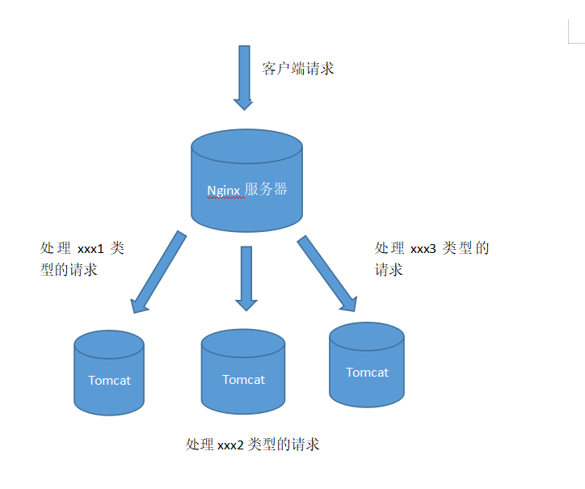
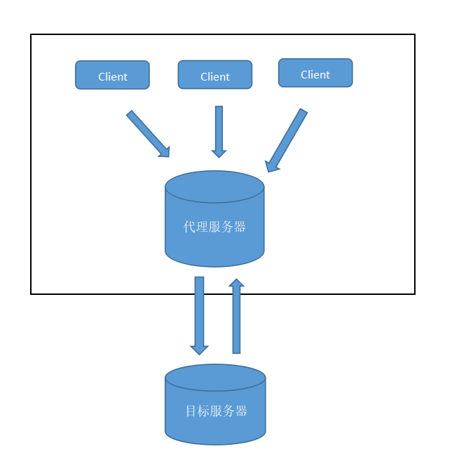
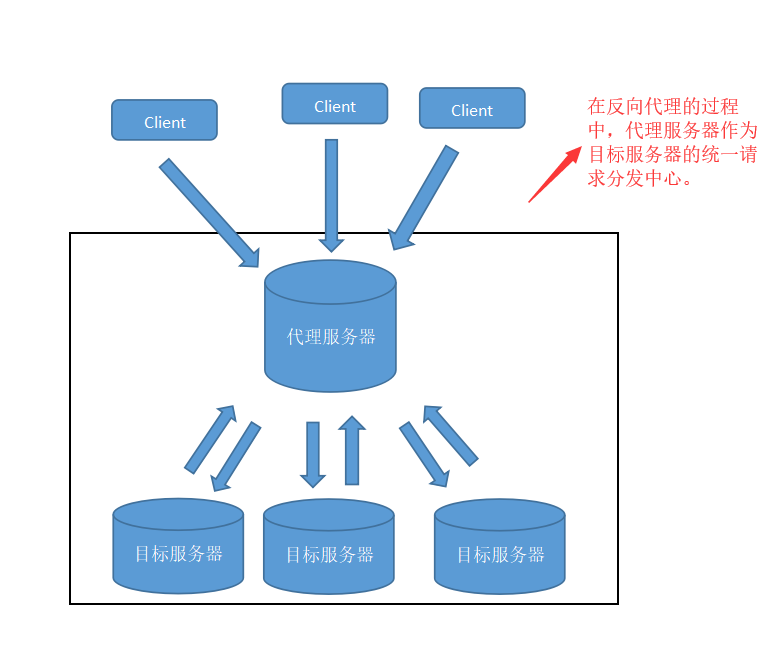
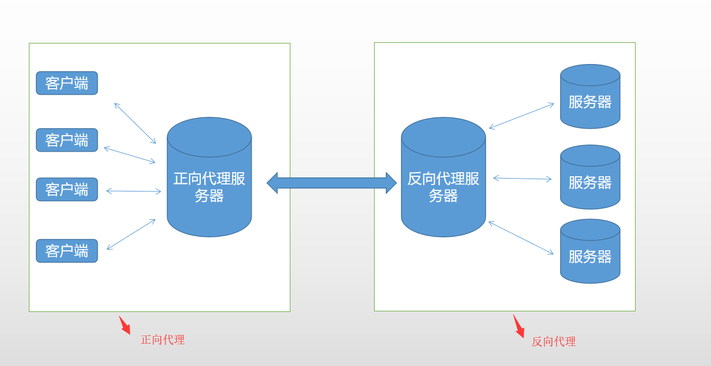

## Nginx基础

<font color="red">基于当前nginx 1.16.0 版本所述。修改日期-20191223</font>

Nginx是一款轻量级的Web 服务器,==反向代理服务器==,电子邮件（IMAP/POP3）代理服务器

>Nginx的应用场景

1. http服务器。Nginx是一个http服务可以独立提供http服务。可以做网页静态服务器。
2. 虚拟主机。可以实现在一台服务器虚拟出多个网站。例如个人网站使用的虚拟主机。
3. 反向代理，负载均衡。

<h4>Nginx的负载均衡</h4>

>负载：就是Nginx接受请求.
>均衡：Nginx将收到的请求按照一定的规则分发到不同的服务器进行处理。



nginx支持的负载均衡调度算法方式如下：

1. weight轮询（默认）：把接收到的请求按照顺序逐一分配到不同的服务器上，即使某一台服务器宕机，nginx会自动将该服务器剔除出队列，请求受理情况不会受到任何影响。 或者可以给不同的后端服务器设置一个权重值（weight），权重数据越大，被分配到请求的几率越大。

2. ip_hash：每个请求按照发起客户端的ip的hash结果进行匹配，这样的算法下一个固定ip地址的客户端总会访问到同一个后端服务器。

3. fair：智能调整调度算法，动态的根据后端服务器的请求处理到响应的时间进行均衡分配，响应时间短处理效率高的服务器分配到请求的概率高，响应时间长处理效率低的服务器分配到的请求少；需要注意的是nginx默认不支持fair算法，如果要使用这种调度算法，请安装upstream_fair模块

4. url_hash：按照访问的url的hash结果分配请求，每个请求的url会指向后端固定的某个服务器，可以在nginx作为静态服务器的情况下提高缓存效率。同样注意nginx默认不支持这种调度算法，要使用的话需要安装nginx的hash软件包


### 1.什么是反向代理？

<h4>正向代理</h4>

当客户端想要间接访问一个目标服务器时。客户端可以找一个可以访问目标服务器的另外一台服务器。这个另外一台服务器就是代理服务器。

正向代理的过程：
1. 客户端把请求发送给代理服务器，再通过代理服务器把请求发送给目标服务器。
2. 代理服务器从目标服务器处获得相应的数据后，再转发给客户端。

<font color="red">在正向代理的过程中，客户端和代理服务器知道目标服务器的IP地址，而目标服务器只知道代理服务器的IP地址而不知道客户端的IP地址。所以正向代理可以屏蔽或隐藏客户端的信息。所以代理服务器是为客户端作代理人，它是站在客户端这边的</font>



<h4>反向代理</h4>

<font color="red">由于正向代理是代理服务器作为客户端的代理人（客户端与代理是一伙的）。而反向代理是指代理服务器作为服务器的代理人（代理与目标服务器是一伙的）。并且在反向代理过程中，屏蔽或隐藏目标服务器的信息</font>




<h4>一般在项目场景中</h4>

在实际项目中，正向代理和反向代理很有可能会存在在一个应用场景中，正向代理代理客户端的请求去访问目标服务器，目标服务器是一个反向单利服务器，反向代理了多台真实的业务处理服务器。




### 2.对Nginx进行配置

nginx使用最多的三个核心功能是反向代理、负载均衡和静态服务器。这三个不同的功能的使用，都要从nginx的配置文件nginx.conf中进行配置。


上面的配置文件由5个部分组成：

main模块：用于nginx全局信息的配置,不在event.http括号中的配置信息
events模块：用于nginx工作模式的配置
http模块：用于http协议信息的一些配置
server模块：用于服务器访问信息的配置
location模块：用于进行访问路由的配置

> 重点server模块是http模块中的一个子模块，用于服务器访问信息的配置

```
server {                      #一个虚拟主机的配置，一个http中可以配置多个server
        listen       80;
        server_name  localhost;    #指定ip地址或者域名，多个配置之间用空格分隔

        #charset koi8-r;              #用于设置www/路径中配置的网页的默认编码格式

        #access_log  logs/host.access.log  main;        #用于指定该虚拟主机服务器中的访问记录日志存放路径

        location / {
            root   html;               #表示整个server虚拟主机内的根目录，所有当前主机中web项目的根目录
            index  index.html index.htm;        #用户访问web网站时的全局首页
        }

        #error_page  404              /404.html;     #错误页面
    }
```

> 5. location模块是server模块中的一个子模块，用于进行访问路由的配置

```
location / {                           # /表示匹配访问根目录
            root   html;               #用于指定访问根目录时，访问虚拟主机的web目录
            index  index.html index.htm;        #在不指定访问具体资源时，默认展示的资源文件列表
        }
```

#### 1.部署静态文件存储目录到nginx中

1. 在/root 目录下创建static目录，用于存放静态文件

2. 在server模块中添加新的location
```
#静态文件目录
location  /static/ {
    root  /root;
    autoindex on; 
    #autoindex on是显示目录
}
```
3. 访问：http://ip:port/static/


#### 2.nginx中部署vue工程

另外创建一个server模块。直接给vue工程分配一个端口来进行部署。

```
server {
    listen       8082;
    server_name  localhost;
    root C:\Users\Administrator\Desktop\dist;
    client_max_body_size 1024M; # 配置上传文件大小限制 
    try_files $uri $uri/ /index.html; #防止vue工程刷新后，报404错误
}
```


#### 3.若访问nginx出现403 forbidden

> 原因1：启动用户和nginx工作用户不一样，导致nginx没有目标目录的访问权限所致

```
#解决方法，在nginx.conf的第一行把user xxx; 改为user root;

#设置nginx的目录访问权限
user  root;
```

> 原因2：localtion中的root对应的目录。缺少index.html

```
location  /www/ {
    root  /data;
    index  index.html index.htm;
}
```
如果在/data/www/下面没有index.html的时候,会报403 forbidden。

> 原因3：SELinux设置为开启状态（enabled）的原因。

```
#查看当前selinux的状态。

/usr/sbin/sestatus

#将SELINUX=enforcing 修改为 SELINUX=disabled 状态。

vim /etc/selinux/config

# 把SELINUX=enforcing 改为 SELINUX=disabled

#重启生效

reboot
```

#### 4.location 语法规则

语法规则
```
location [=|~|~*|^~] /uri/ { 
    … 
}


=  表示精确匹配

^~ 表示uri以某个常规字符串开头，理解为匹配 url路径即可。nginx不对url做编码，因此请求为/static/20%/aa，可以被规则^~ /static/ /aa匹配到（注意是空格）。以xx开头

~  表示区分大小写的正则匹配,以xx结尾

~* 表示不区分大小写的正则匹配,以xx结尾

!~ 和 !~* 分别为区分大小写不匹配及不区分大小写不匹配 的正则

/ 通用匹配，任何请求都会匹配到。

```

匹配顺序：
```
首先精确匹配
其次以xx开头匹配^~
然后是按文件中顺序的正则匹配
最后是交给 / 通用匹配。

############举例

location = / {
   #规则A
}
location = /login {
   #规则B
}
location ^~ /static/ {
   #规则C
}
location ~ \.(gif|jpg|png|js|css)$ {
   #规则D，注意：是根据括号内的大小写进行匹配。括号内全是小写，只匹配小写
}
location ~* \.png$ {
   #规则E
}
location !~ \.xhtml$ {
   #规则F
}
location !~* \.xhtml$ {
   #规则G
}
location / {
   #规则H
}


访问根目录/， 比如http://localhost/ 将匹配规则A

访问 http://localhost/login 将匹配规则B，http://localhost/register 则匹配规则H

访问 http://localhost/static/a.html 将匹配规则C

访问 http://localhost/a.gif, http://localhost/b.jpg 将匹配规则D和规则E，但是规则D顺序优先，规则E不起作用， 而 http://localhost/static/c.png 则优先匹配到 规则C

访问 http://localhost/a.PNG 则匹配规则E， 而不会匹配规则D，因为规则E不区分大小写。

访问 http://localhost/a.xhtml 不会匹配规则F和规则G，

http://localhost/a.XHTML不会匹配规则G，（因为!）。规则F，规则G属于排除法，符合匹配规则也不会匹配到，所以想想看实际应用中哪里会用到。

访问 http://localhost/category/id/1111 则最终匹配到规则H，因为以上规则都不匹配，这个时候nginx转发请求给后端应用服务器，比如FastCGI（php），tomcat（jsp），nginx作为方向代理服务器存在。

```

#### 5.配置https请求，通过https请求来访问nginx

1. 在/usr/local/nginx目录下创建ssl目录，存放服务器ip绑定的域名证书

```
server {
    listen    443 ssl;
    server_name  www.suichen.xyz;

    ssl_certificate      /usr/local/nginx/ssl/1_www.suichen.xyz_bundle.crt; #证书路径
    ssl_certificate_key  /usr/local/nginx/ssl/2_www.suichen.xyz.key;        #证书私钥路径

    ssl_session_cache    shared:SSL:1m;
    ssl_session_timeout  5m;

    ssl_ciphers ECDHE-RSA-AES128-GCM-SHA256:ECDHE:ECDH:AES:HIGH:!NULL:!aNULL:!MD5:!ADH:!RC4;
    ssl_protocols TLSv1 TLSv1.1 TLSv1.2;
    ssl_prefer_server_ciphers  on;

       
    #下面是localtion配置

}
```
    
#### 6.Nginx 将域名下所有http请求转换为https请求

```
server {
    listen 80;
    server_name www.suichen.xyz;
    rewrite ^(.*) https://$server_name$1 permanent;
}
```


### 3.nginx的一些基本命令(centos系统中)

/usr/local/nginx/sbin/nginx 是nginx的命令文件的目录位置

```
/usr/local/nginx/sbin/nginx           #启动nginx服务器
/usr/local/nginx/sbin/nginx -s stop    #强制停止nginx服务器，如果有未处理的数据，丢弃
/usr/local/nginx/sbin/nginx -s quit    #正常关闭服务器。如果有未处理的数据，等待处理完成之后停止
/usr/local/nginx/sbin/nginx -s reload  #重新加载配置文件
/usr/local/nginx/sbin/nginx -s reopen  #重新打开日志文件
/usr/local/nginx/sbin/nginx -v         #显示 nginx 的版本。
/usr/local/nginx/sbin/nginx -V         #显示 nginx 的版本，编译器版本和配置参数。
/usr/local/nginx/sbin/nginx -c filename  #为 Nginx 指定一个配置文件，来代替缺省的.
/usr/local/nginx/sbin/nginx -t          #不运行，而仅仅测试配置文件，检查配置文件中是否有错。
```

### 4.nginx用作http请求转发.用作请求代理功能。

```
server {
    listen       8080;
    server_name  localhost;
    root C:\Users\Administrator\Desktop\vue-x\dist;
    
    location /api {
        proxy_pass http://xxx.xxx.xxx:8099;
        proxy_redirect off;
    }
}
```

`/api`配置会将所有指向/api路径下的请求都转发到某个服务器上8099端口对应的服务上，在浏览器上显示请求路径本身不会发生变化

<font color="red">即http://localhost:8080/api/getUser的请求会被转发到http://xxx.xxx.xxx:8099/api/getUser接口上。</font>


若把`/api` 改为 `/api/`。则转发后的请求路径只会保留/api之后的部分，即/api/getUser的请求会被转发到8099服务的/getUser接口上。

<font color="red">即http://localhost:8080/api/getUser的请求会被转发到http://xxx.xxx.xxx:8099/getUser接口上。</font>

### 5.http请求跳转到https接口上，nginx会返回405或301请求错误问题。

问题原因：当你强制把http请求去请求https的接口。nginx会进行301跳转。但301跳转后会导致请求方法都变成了GET方式,后台接受到请求后,由于请求方式的不同，会返回405和301错误。而Get请求不受此影响。

<font color="red">
如下代码：请求方服务器为http环境,而目标服务器`https://xxx.xxx.xxx`为https环境下。
</font>

解决方法：
```
server {
    listen       8083;
    server_name  localhost;
    root C:\Users\Administrator\Desktop\vue-x\dist;
    try_files $uri $uri/ /index.html; #解决vue工程刷新后，报404错误 

    error_page 405 = 200 $uri; # 把405错误变为200成功状态

    location /fileManager {
        proxy_pass https://xxx.xxx.xxx;
        proxy_redirect off;
    }
}
```

或者
```
server {
        listen       8083;
        server_name  localhost;
        location /fileManager {
            if ($request_method ~ ^(POST|DELETE|OPTIONS)$) {
                proxy_pass https://xxx.xxx.xxx;
                break ;
            }
            rewrite ^(.*) https://$server_name$1 permanent; # 将/fileManager开头的http请求转换为https请求
        }
}
```
